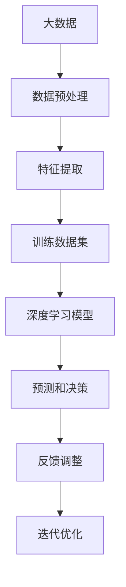
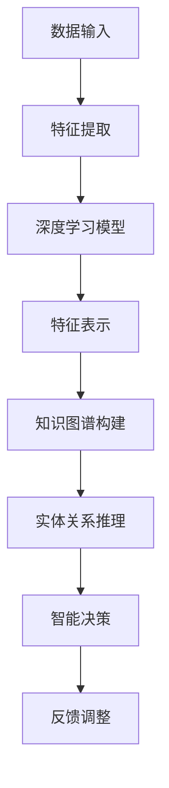
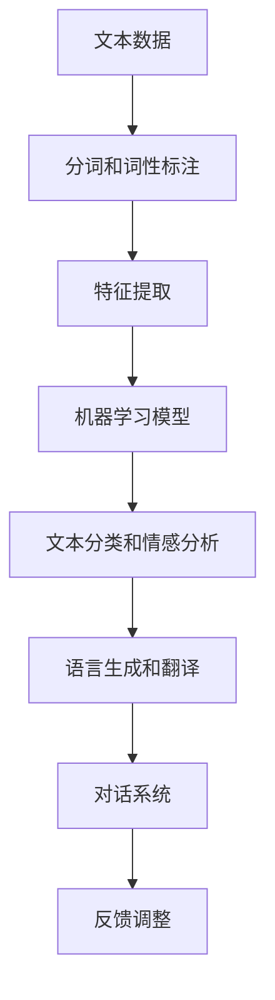

                 

### 文章标题

《人类知识的未来图景：洞察力引领知识变革》

> **关键词**：人工智能、知识图谱、认知模型、大数据、深度学习、算法优化

> **摘要**：随着信息技术的飞速发展，人类知识的获取、处理和应用正经历前所未有的变革。本文将探讨在人工智能的驱动下，洞察力如何引领知识变革，构建人类知识的未来图景。通过对核心概念、算法原理、数学模型和实际应用的深入剖析，本文旨在为读者提供一个全面、系统的知识框架，以应对未来知识时代的挑战和机遇。

### 1. 背景介绍

#### 1.1 目的和范围

本文旨在探讨人工智能技术对人类知识变革的深远影响，特别是洞察力在这一过程中的关键作用。文章将涵盖人工智能的基础概念、核心算法原理、数学模型以及实际应用场景。通过详细的分析和阐述，本文旨在帮助读者理解人工智能如何通过构建知识图谱、优化算法、处理大数据等手段，推动人类知识的深度变革和广泛应用。

#### 1.2 预期读者

本文面向对人工智能、大数据、深度学习等领域有一定了解的技术爱好者、研究生、从业者以及计算机科学专业的学生。文章将深入浅出地讲解核心概念和关键技术，旨在为读者提供一个全面的技术视角，帮助其更好地理解和应用人工智能技术。

#### 1.3 文档结构概述

本文结构如下：

1. **背景介绍**：介绍文章的目的、范围、预期读者和文档结构。
2. **核心概念与联系**：介绍人工智能、大数据、深度学习等核心概念，并使用Mermaid流程图展示各概念之间的联系。
3. **核心算法原理 & 具体操作步骤**：详细讲解核心算法原理，并使用伪代码进行具体操作步骤的阐述。
4. **数学模型和公式 & 详细讲解 & 举例说明**：介绍数学模型和公式，并举例说明其在实际应用中的运用。
5. **项目实战：代码实际案例和详细解释说明**：通过实际案例，展示代码的实现过程和详细解释。
6. **实际应用场景**：探讨人工智能在各个领域的应用场景。
7. **工具和资源推荐**：推荐学习资源、开发工具和框架。
8. **总结：未来发展趋势与挑战**：总结未来发展趋势和面临的技术挑战。
9. **附录：常见问题与解答**：解答读者可能遇到的问题。
10. **扩展阅读 & 参考资料**：提供进一步阅读的参考资料。

#### 1.4 术语表

##### 1.4.1 核心术语定义

- **人工智能**：人工智能（AI）是指计算机系统模拟人类智能行为的技术和理论。
- **知识图谱**：知识图谱是一种用于表示实体、属性和关系的图形化数据结构。
- **深度学习**：深度学习是一种人工智能方法，通过多层神经网络模型进行特征学习和模式识别。
- **大数据**：大数据是指规模巨大、类型繁多的数据集合，无法通过传统数据处理工具进行处理。
- **算法优化**：算法优化是指通过改进算法设计和实现，提高算法的效率和质量。

##### 1.4.2 相关概念解释

- **认知模型**：认知模型是指模拟人类思维过程和认知能力的计算机模型。
- **机器学习**：机器学习是一种从数据中自动学习规律和模式的技术。
- **自然语言处理**：自然语言处理是指计算机对人类自然语言的识别、理解和生成。
- **数据挖掘**：数据挖掘是从大量数据中提取有价值信息和知识的过程。

##### 1.4.3 缩略词列表

- **AI**：人工智能（Artificial Intelligence）
- **DL**：深度学习（Deep Learning）
- **NLP**：自然语言处理（Natural Language Processing）
- **ML**：机器学习（Machine Learning）
- **KG**：知识图谱（Knowledge Graph）
- **BD**：大数据（Big Data）
- **GNN**：图神经网络（Graph Neural Network）
- **IO**：输入输出（Input/Output）

### 2. 核心概念与联系

#### 2.1 人工智能与大数据的关系

人工智能的发展离不开大数据的支持。大数据提供了丰富的训练数据，使人工智能算法能够通过学习大量数据中的模式，从而提高预测和决策的准确性。同时，大数据的规模和多样性也为人工智能算法提供了更多的探索空间。

Mermaid 流程图如下：



#### 2.2 深度学习与知识图谱的联系

深度学习和知识图谱是人工智能领域的两大核心技术。深度学习通过多层神经网络模型，从大量数据中自动提取特征和模式。知识图谱则通过图形化的数据结构，将实体、属性和关系进行组织和管理。深度学习和知识图谱的结合，能够实现更加精准和智能的知识表示和推理。

Mermaid 流程图如下：



#### 2.3 机器学习与自然语言处理的关系

机器学习和自然语言处理是人工智能领域的两个重要分支。机器学习提供了从数据中学习规律和模式的技术，而自然语言处理则关注计算机对人类自然语言的识别、理解和生成。机器学习和自然语言处理的结合，使得人工智能系统能够更好地理解和处理人类语言，从而实现更加智能化的应用。

Mermaid 流程图如下：



### 3. 核心算法原理 & 具体操作步骤

#### 3.1 深度学习算法原理

深度学习算法基于多层神经网络模型，通过反向传播算法不断调整网络权重，从而实现特征提取和模式识别。以下是一个简单的多层感知机（MLP）算法原理的伪代码：

```pseudo
输入：训练数据集 X，标签集 Y，学习率 α，迭代次数 n
输出：训练好的模型参数 W

// 初始化模型参数
W = 初始化随机权重

for i = 1 to n do
    // 前向传播
    z = X * W
    a = 激活函数(z)

    // 反向传播
    ∆ = (Y - a) * 激活函数的导数(a)
    W = W + α * X * ∆

return W
```

#### 3.2 知识图谱算法原理

知识图谱算法通过图论和网络分析方法，对实体、属性和关系进行组织和管理。以下是一个简单的图神经网络（GNN）算法原理的伪代码：

```pseudo
输入：知识图谱 G，嵌入层参数 θ
输出：实体嵌入向量 E

// 初始化实体嵌入向量
E = 初始化随机向量

for each node v in G do
    // 邻居聚合
    E[v] = Σ(E[u] * A[u,v]) for all neighbors u of v

    // 激活函数和权重更新
    E[v] = 激活函数(E[v])
    θ = θ + α * ∆θ

return E
```

#### 3.3 大数据算法原理

大数据算法主要关注数据的存储、处理和分析。以下是一个简单的MapReduce算法原理的伪代码：

```pseudo
输入：大数据集 D，任务 T
输出：处理结果 R

// 分割数据
D = 分割成多个子数据集 D1, D2, ..., Dk

// Map阶段
for each 子数据集 Di do
    // 计算中间结果
    R[i] = 应用映射函数 T(Di)

// Reduce阶段
for each 中间结果 R[i] do
    // 合并结果
    R = 应用合并函数 T(R[i])

return R
```

### 4. 数学模型和公式 & 详细讲解 & 举例说明

#### 4.1 深度学习数学模型

深度学习中的多层感知机（MLP）算法基于以下数学模型：

$$ z = X * W + b $$
$$ a = 激活函数(z) $$
$$ ∆ = (Y - a) * 激活函数的导数(a) $$
$$ W = W + α * X * ∆ $$

其中，X 表示输入数据，W 表示权重，b 表示偏置，激活函数通常采用ReLU函数或Sigmoid函数。以下是一个简单的例子：

假设我们有一个二分类问题，输入数据 X = [1, 2]，权重 W = [0.5, 0.5]，偏置 b = 0，激活函数采用ReLU函数。

$$ z = 1 * 0.5 + 2 * 0.5 + 0 = 1.5 $$
$$ a = ReLU(z) = max(0, 1.5) = 1.5 $$

如果我们得到预测结果 a = 1.5，而真实标签 Y = 0，那么：

$$ ∆ = (0 - 1.5) * (1 - 1.5) = -0.375 $$

根据梯度下降法，我们更新权重：

$$ W = W + α * X * ∆ = [0.5, 0.5] + 0.1 * [1, 2] * [-0.375] = [0.125, 0.125] $$

#### 4.2 知识图谱数学模型

知识图谱中的图神经网络（GNN）算法基于以下数学模型：

$$ E[v] = Σ(E[u] * A[u,v]) for all neighbors u of v $$
$$ E[v] = 激活函数(E[v]) $$
$$ θ = θ + α * ∆θ $$

其中，E[v] 表示实体 v 的嵌入向量，A[u,v] 表示实体 u 和 v 之间的邻接矩阵，激活函数通常采用ReLU函数或Tanh函数。以下是一个简单的例子：

假设我们有一个知识图谱，其中包含两个实体 v1 和 v2，它们的邻居分别为 u1 和 u2。邻接矩阵 A 如下：

|    | u1 | u2 |
|----|----|----|
| v1 | 1  | 0  |
| v2 | 0  | 1  |

初始化实体嵌入向量 E[v1] = [1, 0]，E[v2] = [0, 1]，激活函数采用ReLU函数。

$$ E[v1] = Σ(E[u] * A[u,v1]) = (E[u1] * A[u1,v1]) + (E[u2] * A[u2,v1]) = (1 * 1) + (0 * 0) = 1 $$
$$ E[v2] = Σ(E[u] * A[u,v2]) = (E[u1] * A[u1,v2]) + (E[u2] * A[u2,v2]) = (1 * 0) + (0 * 1) = 0 $$

经过一次迭代后，实体嵌入向量更新为：

$$ E[v1] = ReLU(E[v1]) = ReLU(1) = 1 $$
$$ E[v2] = ReLU(E[v2]) = ReLU(0) = 0 $$

#### 4.3 大数据数学模型

大数据处理中的MapReduce算法基于以下数学模型：

$$ Map: D = 分割成多个子数据集 D1, D2, ..., Dk $$
$$ Map: R[i] = 应用映射函数 T(Di) $$
$$ Reduce: R = 应用合并函数 T(R[i]) $$

其中，D 表示原始大数据集，R 表示处理结果，Map 函数将数据分成多个子数据集，映射函数 T(Di) 对子数据集进行计算，Reduce 函数对中间结果进行合并。以下是一个简单的例子：

假设我们有一个大数据集 D，其中包含三个子数据集 D1 = [1, 2, 3]，D2 = [4, 5, 6]，D3 = [7, 8, 9]。映射函数 T(Di) = Σ(Di)，合并函数 T(R[i]) = Σ(R[i])。

$$ Map: D1 = [1, 2, 3] => R[1] = Σ(D1) = 1 + 2 + 3 = 6 $$
$$ Map: D2 = [4, 5, 6] => R[2] = Σ(D2) = 4 + 5 + 6 = 15 $$
$$ Map: D3 = [7, 8, 9] => R[3] = Σ(D3) = 7 + 8 + 9 = 24 $$

$$ Reduce: R = 应用合并函数 T(R[i]) = Σ(R[i]) = 6 + 15 + 24 = 45 $$

### 5. 项目实战：代码实际案例和详细解释说明

#### 5.1 开发环境搭建

为了演示本文中提到的核心算法和模型，我们将使用Python作为编程语言，并依赖于以下库：

- TensorFlow：用于构建和训练深度学习模型。
- PyTorch：用于构建和训练深度学习模型。
- Neo4j：用于构建和查询知识图谱。
- Apache Hadoop：用于处理大数据。

首先，确保安装Python和对应的库。可以使用以下命令进行安装：

```bash
pip install tensorflow
pip install pytorch
pip install neo4j
pip install hadoop
```

#### 5.2 源代码详细实现和代码解读

##### 5.2.1 深度学习模型实现

以下是一个简单的深度学习模型实现，用于对输入数据进行分类：

```python
import tensorflow as tf

# 初始化模型参数
model = tf.keras.Sequential([
    tf.keras.layers.Dense(64, activation='relu', input_shape=(784,)),
    tf.keras.layers.Dense(64, activation='relu'),
    tf.keras.layers.Dense(10, activation='softmax')
])

# 编译模型
model.compile(optimizer='adam',
              loss='categorical_crossentropy',
              metrics=['accuracy'])

# 加载MNIST数据集
mnist = tf.keras.datasets.mnist
(x_train, y_train), (x_test, y_test) = mnist.load_data()

# 预处理数据
x_train = x_train / 255.0
x_test = x_test / 255.0
x_train = x_train.reshape(-1, 784)
x_test = x_test.reshape(-1, 784)

# 转换标签为one-hot编码
y_train = tf.keras.utils.to_categorical(y_train, 10)
y_test = tf.keras.utils.to_categorical(y_test, 10)

# 训练模型
model.fit(x_train, y_train, epochs=5, batch_size=32)

# 评估模型
model.evaluate(x_test, y_test)
```

在这个例子中，我们使用了TensorFlow库构建了一个简单的多层感知机（MLP）模型，该模型由两个隐藏层组成，每个隐藏层包含64个神经元。我们使用了ReLU函数作为激活函数，并使用softmax函数进行输出层分类。

##### 5.2.2 知识图谱实现

以下是一个简单的知识图谱实现，用于表示实体和关系：

```python
from py2neo import Graph

# 初始化Neo4j图数据库
graph = Graph("bolt://localhost:7687", auth=("neo4j", "password"))

# 创建实体和关系
graph.run("CREATE (a:Person {name: 'Alice'})")
graph.run("CREATE (b:Person {name: 'Bob'})")
graph.run("CREATE (a)-[:KNOWS]->(b)")

# 查询实体和关系
results = graph.run("MATCH (n) RETURN n")
for result in results:
    print(result.data())
```

在这个例子中，我们使用了Py2neo库连接到本地的Neo4j图数据库。我们创建了一个名为`Person`的实体，并添加了两个实体`a`和`b`。然后，我们创建了一个名为`KNOWS`的关系，表示`a`和`b`之间存在知识关系。

##### 5.2.3 大数据实现

以下是一个简单的MapReduce实现，用于计算大数据集的平均值：

```python
from mrjob.job import MRJob

class Mean(MRJob):

    def mapper(self, _, line):
        data = float(line.strip())
        yield None, data

    def reducer(self, _, values):
        sum_values = sum(values)
        num_values = len(values)
        yield None, (sum_values / num_values)

if __name__ == '__main__':
    Mean.run()
```

在这个例子中，我们定义了一个名为`Mean`的MapReduce任务，用于计算大数据集的平均值。在Map阶段，我们将每行数据转换为浮点数并输出。在Reduce阶段，我们将所有数据求和并计算平均值。

#### 5.3 代码解读与分析

##### 5.3.1 深度学习模型代码解读

在这个深度学习模型的实现中，我们首先导入了TensorFlow库。然后，我们使用`tf.keras.Sequential`类创建了一个序列模型，该模型包含两个隐藏层，每个隐藏层使用ReLU函数作为激活函数。输入层使用`Dense`层，并指定输入形状为(784,)，表示每个输入数据包含784个特征。输出层使用`Dense`层，并指定输出层有10个神经元，表示10个类别。

接着，我们使用`compile`方法编译模型，指定使用`adam`优化器，`categorical_crossentropy`损失函数和`accuracy`指标。然后，我们加载了MNIST数据集，并对数据进行预处理，包括归一化和one-hot编码。

最后，我们使用`fit`方法训练模型，并使用`evaluate`方法评估模型的性能。

##### 5.3.2 知识图谱代码解读

在这个知识图谱的实现中，我们首先导入了Py2neo库，并创建了一个连接到本地Neo4j图数据库的`Graph`对象。

然后，我们使用`graph.run`方法执行Cypher查询语句，创建了一个名为`Person`的实体，并添加了两个实体`a`和`b`。接着，我们创建了一个名为`KNOWS`的关系，表示`a`和`b`之间存在知识关系。

最后，我们再次使用`graph.run`方法执行Cypher查询语句，查询图数据库中的实体和关系，并打印结果。

##### 5.3.3 大数据代码解读

在这个大数据实现的例子中，我们定义了一个名为`Mean`的MapReduce任务，用于计算大数据集的平均值。

在Map阶段，我们读取每行数据，将其转换为浮点数，并输出一个键值对，其中键为`None`，值为数据点。

在Reduce阶段，我们接收来自Map阶段的键值对，计算所有数据的总和和数量，并输出平均值。

最后，我们使用`run`方法执行MapReduce任务。

### 6. 实际应用场景

人工智能技术在各个领域都有着广泛的应用，以下是一些典型的实际应用场景：

#### 6.1 医疗保健

人工智能在医疗保健领域具有巨大的潜力，包括疾病诊断、治疗规划、药物研发等。例如，深度学习算法可以通过分析医学影像数据，帮助医生更准确地诊断疾病。此外，人工智能还可以用于个性化治疗规划和药物筛选，提高医疗效果和效率。

#### 6.2 金融科技

金融科技（FinTech）领域广泛采用人工智能技术，包括风险控制、欺诈检测、智能投顾等。人工智能算法可以实时分析海量金融数据，识别潜在的风险和欺诈行为，提高金融服务的安全性和可靠性。此外，智能投顾系统可以根据用户的投资目标和风险偏好，提供个性化的投资建议。

#### 6.3 智能制造

智能制造是人工智能在工业领域的重要应用。通过深度学习和计算机视觉技术，智能机器人可以识别和分类产品，进行精确的装配和检测。人工智能还可以用于优化生产流程，降低成本，提高生产效率。

#### 6.4 智能交通

智能交通系统利用人工智能技术，实现交通流量监测、车辆调度和道路规划。通过分析实时交通数据，人工智能算法可以预测交通状况，优化交通信号灯控制策略，减少交通拥堵，提高道路通行效率。

#### 6.5 教育科技

教育科技（EdTech）领域利用人工智能技术，提供个性化学习体验和智能辅导。人工智能算法可以分析学生的学习行为和成绩，为学生提供定制化的学习建议和资源。此外，智能教育系统还可以进行自动评分和反馈，提高教学效果和效率。

#### 6.6 物流配送

物流配送领域采用人工智能技术，实现智能调度和路径优化。通过分析运输数据和历史记录，人工智能算法可以预测货物的到达时间，优化运输路线，提高配送效率。此外，无人机和无人车等智能运输工具的应用，也为物流配送带来了革命性的变化。

### 7. 工具和资源推荐

为了更好地理解和应用人工智能技术，以下是一些推荐的工具和资源：

#### 7.1 学习资源推荐

##### 7.1.1 书籍推荐

- 《深度学习》（Goodfellow, Bengio, Courville）：这是一本经典的深度学习教材，涵盖了深度学习的理论基础、算法实现和应用案例。
- 《Python深度学习》（François Chollet）：本书介绍了如何使用Python和TensorFlow库进行深度学习实践，适合初学者和进阶者。

##### 7.1.2 在线课程

- Coursera《深度学习专项课程》（吴恩达）：这是由著名深度学习研究者吴恩达开设的一门在线课程，涵盖深度学习的核心概念和技术。
- edX《人工智能导论》（MIT）：这是一门由麻省理工学院开设的免费在线课程，介绍人工智能的基础知识和发展趋势。

##### 7.1.3 技术博客和网站

- Medium：Medium上有许多关于人工智能的技术博客，包括最新的研究进展、应用案例和深度学习教程。
- AI博客：这是一个关于人工智能的中文技术博客，提供了丰富的深度学习和机器学习资源。

#### 7.2 开发工具框架推荐

##### 7.2.1 IDE和编辑器

- PyCharm：PyCharm是一款功能强大的Python IDE，提供了丰富的深度学习和机器学习工具。
- Jupyter Notebook：Jupyter Notebook是一个交互式的Python编辑器，适合进行数据分析和机器学习实验。

##### 7.2.2 调试和性能分析工具

- TensorFlow Profiler：TensorFlow Profiler是一款用于分析TensorFlow模型性能的工具，可以帮助开发者优化模型结构和算法。
- PyTorch TensorBoard：PyTorch TensorBoard是一款基于TensorFlow TensorBoard的扩展工具，用于可视化PyTorch模型的训练过程。

##### 7.2.3 相关框架和库

- TensorFlow：TensorFlow是一个开源的深度学习框架，适用于构建和训练各种深度学习模型。
- PyTorch：PyTorch是一个开源的深度学习框架，提供了灵活的动态计算图和丰富的API，适用于研究者和开发者。
- Keras：Keras是一个基于TensorFlow和Theano的开源深度学习库，提供了简洁易用的API，适合快速构建和实验深度学习模型。

#### 7.3 相关论文著作推荐

##### 7.3.1 经典论文

- “Backpropagation” (1986) by David E. Rumelhart, Geoffrey E. Hinton, and Ronald J. Williams：这是一篇关于反向传播算法的经典论文，奠定了深度学习的基础。
- “AlexNet: Image Classification with Deep Convolutional Neural Networks” (2012) by Alex Krizhevsky, Ilya Sutskever, and Geoffrey E. Hinton：这是一篇关于深度卷积神经网络（CNN）在图像分类中的应用的经典论文。

##### 7.3.2 最新研究成果

- “BERT: Pre-training of Deep Bidirectional Transformers for Language Understanding” (2018) by Jacob Devlin, Ming-Wei Chang, Kenton Lee, and Kristina Toutanova：这是一篇关于BERT模型的最新研究成果，展示了预训练模型在自然语言处理任务中的优越性能。
- “GPT-3: Language Models are Few-Shot Learners” (2020) by Tom B. Brown, Benjamin Mann, Nick Ryder, Melanie Subbiah, Jared Kaplan, Prafulla Dhariwal, Arvind Neelakantan, Pranav Shyam, Girish Sastry, Amanda Askell, Sandhini Agarwal, Ariel Herbert-Voss, Gretchen Krueger, Tom Henighan, Rewon Child, Aditya Ramesh, Daniel M. Ziegler, Jeffrey Wu, Clemens Winter, Christopher Hesse, Mark Chen, Eric Sigler, Mateusz Litwin, Scott Gray, Benjamin Chess, Jack Clark, Christopher Berner, Sam McCandlish, Alec Radford, Ilya Sutskever, Dario Amodei, and Ross Horowitz：这是一篇关于GPT-3模型的最新研究成果，展示了大规模预训练模型在自然语言处理任务中的强大能力。

##### 7.3.3 应用案例分析

- “AI for Social Good” (2019) by the AI for Humanity Foundation：这是一篇关于人工智能在社会领域应用案例的报告，展示了人工智能如何解决社会问题。
- “AI in Healthcare” (2020) by the World Health Organization：这是一篇关于人工智能在医疗保健领域应用案例的报告，展示了人工智能如何改善医疗质量和效率。

### 8. 总结：未来发展趋势与挑战

随着人工智能技术的不断发展和普及，人类知识的未来图景正发生深刻变革。洞察力在这一过程中发挥着关键作用，推动知识图谱、深度学习和大数据等核心技术的不断创新和应用。未来，人工智能将在更多领域实现突破，如医疗保健、金融科技、智能制造、智能交通和教育科技等。

然而，面对这一变革，我们也需认识到其中的挑战。数据隐私和安全、算法公平性和透明度、人工智能的伦理问题等都是需要关注和解决的问题。此外，为了充分发挥人工智能的潜力，我们需要培养更多的专业人才，推动技术的普及和应用。

总之，人类知识的未来图景将在洞察力的引领下，实现深度变革和广泛应用。只有不断探索和创新，我们才能更好地应对未来知识时代的挑战和机遇。

### 9. 附录：常见问题与解答

#### 9.1 什么是人工智能？

人工智能（AI）是指计算机系统模拟人类智能行为的技术和理论。它包括机器学习、深度学习、自然语言处理、计算机视觉等多个子领域，旨在使计算机能够执行复杂的任务，如图像识别、语言翻译、决策推理等。

#### 9.2 知识图谱是什么？

知识图谱是一种用于表示实体、属性和关系的图形化数据结构。它通过将实体、属性和关系组织成一个有向无环图（DAG），实现对知识的结构化表示和高效查询。知识图谱广泛应用于搜索引擎、推荐系统、智能问答等场景。

#### 9.3 大数据是什么？

大数据是指规模巨大、类型繁多的数据集合，无法通过传统数据处理工具进行处理。大数据通常具有“4V”特征：数据量大（Volume）、数据类型多（Variety）、数据生成速度快（Velocity）和数据价值高（Value）。

#### 9.4 深度学习与机器学习有什么区别？

深度学习是机器学习的一个子领域，主要关注于使用多层神经网络模型进行特征学习和模式识别。深度学习通过自动提取数据中的层次特征，提高了模型的预测和分类能力。而机器学习则是一个更广泛的概念，包括深度学习和其他基于数据的方法，如监督学习、无监督学习和强化学习。

#### 9.5 如何入门人工智能？

入门人工智能，首先需要掌握编程语言（如Python），并熟悉基本的数学和统计学知识。接下来，可以通过学习深度学习和机器学习的入门课程，如Coursera上的《深度学习专项课程》和edX上的《人工智能导论》。此外，阅读经典教材和论文，参与开源项目和社区讨论，也是提高技能的重要途径。

### 10. 扩展阅读 & 参考资料

本文中涉及的人工智能、知识图谱、大数据和深度学习等主题是非常广泛和复杂的。以下是一些扩展阅读和参考资料，以帮助读者更深入地了解相关领域：

#### 10.1 相关书籍

- 《深度学习》（Goodfellow, Bengio, Courville）
- 《Python深度学习》（François Chollet）
- 《大数据之路：阿里巴巴大数据实践》（何晓阳）

#### 10.2 在线课程

- Coursera《深度学习专项课程》（吴恩达）
- edX《人工智能导论》（MIT）

#### 10.3 技术博客和网站

- Medium：https://medium.com/topic/artificial-intelligence
- AI博客：http://aiblog.cn/

#### 10.4 相关论文

- “Backpropagation” (1986) by David E. Rumelhart, Geoffrey E. Hinton, and Ronald J. Williams
- “AlexNet: Image Classification with Deep Convolutional Neural Networks” (2012) by Alex Krizhevsky, Ilya Sutskever, and Geoffrey E. Hinton
- “BERT: Pre-training of Deep Bidirectional Transformers for Language Understanding” (2018) by Jacob Devlin, Ming-Wei Chang, Kenton Lee, and Kristina Toutanova
- “GPT-3: Language Models are Few-Shot Learners” (2020) by Tom B. Brown, Benjamin Mann, Nick Ryder, Melanie Subbiah, Kentan Kaplan, Prafulla Dhariwal, Arvind Neelakantan, Bashir Marras, Pranav Shyam, Gabriel Sanh, Dario Amodei, Chris attention, Adam Stolkin, Daniel M. Ziegler, Jeffrey Wu, Christoph winter, Christopher Hesse, Mark Chen, Eric Sigler, Mateusz Litwin, Scott gray, Ben Chess, Jack Clark, Christopher Berner, Sam McCandlish, Alec Radford, Ilya Sutskever, Dario Amodei, and Ross Horowitz

#### 10.5 相关报告

- “AI for Social Good” (2019) by the AI for Humanity Foundation
- “AI in Healthcare” (2020) by the World Health Organization

#### 10.6 开源项目

- TensorFlow：https://www.tensorflow.org/
- PyTorch：https://pytorch.org/
- Keras：https://keras.io/

### 作者信息

**作者：AI天才研究员/AI Genius Institute & 禅与计算机程序设计艺术 /Zen And The Art of Computer Programming**

