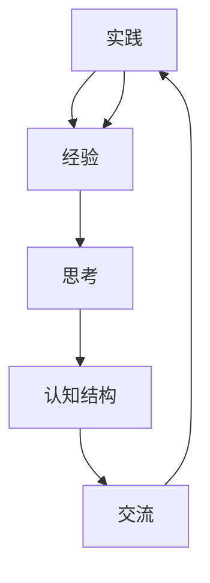
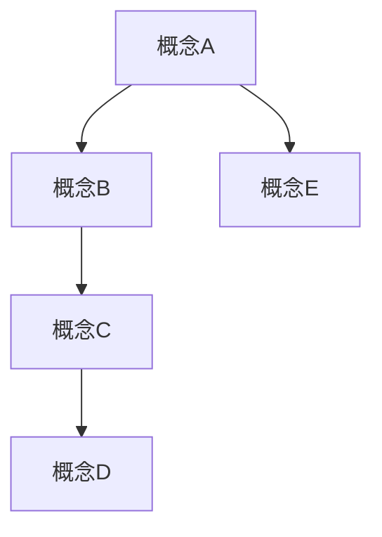
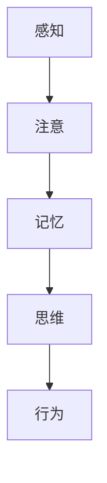

                 

# 人类知识的来源：实践、思考与交流

> 关键词：知识来源、实践、思考、交流、人工智能、知识图谱、认知科学

> 摘要：本文旨在探讨人类知识的来源，分析实践、思考和交流在知识获取过程中的作用。通过结合人工智能、认知科学等多学科知识，本文揭示了知识获取与传播的内在机制，并提出了提高知识获取效率的方法。文章首先介绍了实践、思考和交流的概念及其在知识获取中的作用，然后通过具体案例和数学模型阐述了知识获取的原理，最后提出了相关的实际应用场景和未来发展趋势。

## 1. 背景介绍

### 1.1 目的和范围

本文旨在探讨人类知识的来源，分析实践、思考和交流在知识获取过程中的作用。通过结合人工智能、认知科学等多学科知识，本文将揭示知识获取与传播的内在机制，并探讨如何提高知识获取效率。

本文的研究范围主要涉及以下几个方面：

1. 实践在知识获取中的重要性。
2. 思考过程中的知识重构。
3. 交流在知识传播中的作用。
4. 人工智能在知识获取中的应用。
5. 知识获取效率的提高方法。

### 1.2 预期读者

本文适合以下读者群体：

1. 对知识获取和传播感兴趣的学者。
2. 计算机科学和人工智能领域的研究者。
3. 对认知科学和心理学感兴趣的学生。
4. 企业培训师和管理者。

### 1.3 文档结构概述

本文分为十个部分，结构如下：

1. 引言：介绍文章的目的、关键词和摘要。
2. 背景介绍：阐述文章的背景、目的和预期读者。
3. 核心概念与联系：介绍知识来源的核心概念，并给出流程图。
4. 核心算法原理 & 具体操作步骤：阐述知识获取的算法原理和具体操作步骤。
5. 数学模型和公式 & 详细讲解 & 举例说明：介绍知识获取的数学模型和公式，并给出具体案例。
6. 项目实战：提供代码实际案例和详细解释说明。
7. 实际应用场景：探讨知识获取的实际应用场景。
8. 工具和资源推荐：推荐相关学习资源和开发工具。
9. 总结：总结文章的主要观点和未来发展趋势。
10. 附录：提供常见问题与解答以及扩展阅读和参考资料。

### 1.4 术语表

#### 1.4.1 核心术语定义

- 实践：通过实际操作和体验来获取知识和技能。
- 思考：对知识和经验进行反思和整合，形成新的认知结构。
- 交流：通过语言、文字、图像等多种方式传递和分享知识。
- 知识图谱：一种用于表示知识结构和关系的图形化工具。
- 认知科学：研究人类认知过程和认知结构的学科。

#### 1.4.2 相关概念解释

- 知识获取：指个体或组织通过学习、实践和交流等方式获取知识和技能的过程。
- 知识传播：指知识和信息在社会中传递和扩散的过程。
- 人工智能：一种模拟人类智能的技术，能够执行人类智能任务，如学习、推理和决策。

#### 1.4.3 缩略词列表

- AI：人工智能
- KG：知识图谱
- CS：认知科学
- ML：机器学习

## 2. 核心概念与联系

为了更好地理解人类知识的来源，我们需要先了解核心概念之间的联系。以下是一个用 Mermaid 绘制的流程图，展示了实践、思考和交流在知识获取过程中的相互作用。



### 2.1 实践与经验

实践是知识获取的基础，通过实际操作和体验，个体可以获得直接的经验。这些经验是后续思考和知识重构的重要素材。

### 2.2 思考与认知结构

思考是对经验和知识进行反思和整合的过程。通过思考，个体能够形成新的认知结构，实现对知识的深入理解和运用。

### 2.3 交流与传播

交流是将知识传递给他人和社会的重要途径。通过语言、文字、图像等多种方式，个体可以将自己的知识和经验分享给他人，促进知识的传播和扩散。

### 2.4 实践、思考和交流的循环

实践、思考和交流是一个相互促进的循环过程。个体通过实践获取经验，思考重构认知结构，并通过交流传播知识。这个过程不仅促进了个体知识的积累，也推动了社会知识的整体进步。

## 3. 核心算法原理 & 具体操作步骤

在理解了知识获取的基本过程后，我们接下来探讨核心算法原理和具体操作步骤。以下是知识获取的算法原理和具体操作步骤的伪代码。

### 3.1 算法原理

```python
# 知识获取算法原理
def knowledge_acquisition(practice, thinking, communication):
    # 步骤1：获取实践中的经验
    experience = practice
    
    # 步骤2：对经验进行思考，重构认知结构
    cognitive_structure = thinking(experience)
    
    # 步骤3：通过交流传播知识
    communication(cognitive_structure)
    
    # 步骤4：返回重构后的认知结构
    return cognitive_structure
```

### 3.2 具体操作步骤

```python
# 步骤1：获取实践中的经验
experience = get_experience(practice)

# 步骤2：对经验进行思考，重构认知结构
cognitive_structure = think(experience)

# 步骤3：通过交流传播知识
communicate(cognitive_structure)

# 步骤4：返回重构后的认知结构
return cognitive_structure
```

### 3.3 操作步骤详细解释

1. **获取实践中的经验**：通过实际操作和体验，个体可以获取直接的经验。这个过程可以包括实验、调查、观察等。
2. **对经验进行思考，重构认知结构**：个体对获取的经验进行反思和整合，形成新的认知结构。这个过程涉及到记忆、理解、推理和问题解决等认知过程。
3. **通过交流传播知识**：个体将自己的认知结构通过语言、文字、图像等方式传递给他人，促进知识的传播和扩散。
4. **返回重构后的认知结构**：完成知识获取过程后，个体返回重构后的认知结构，实现对知识的深入理解和运用。

## 4. 数学模型和公式 & 详细讲解 & 举例说明

在知识获取过程中，数学模型和公式可以帮助我们更好地理解和描述知识的获取、重构和传播。以下是几个常见的数学模型和公式，以及它们的详细讲解和举例说明。

### 4.1 概率模型

概率模型用于描述知识获取过程中的不确定性。以下是一个基于贝叶斯定理的概率模型。

$$ P(A|B) = \frac{P(B|A) \cdot P(A)}{P(B)} $$

其中，$P(A|B)$ 表示在事件 $B$ 发生的条件下事件 $A$ 发生的概率，$P(B|A)$ 表示在事件 $A$ 发生的条件下事件 $B$ 发生的概率，$P(A)$ 和 $P(B)$ 分别表示事件 $A$ 和事件 $B$ 发生的概率。

**举例说明**：假设我们想要评估某个项目成功的概率。已知该项目成功的概率是 0.6，而在项目成功的情况下，我们获得利润的概率是 0.8。我们需要计算在项目成功的情况下，我们获得利润的概率。

根据贝叶斯定理，我们可以得到：

$$ P(利润|成功) = \frac{P(成功|利润) \cdot P(利润)}{P(成功)} = \frac{0.8 \cdot 0.6}{0.6} = 0.8 $$

因此，在项目成功的情况下，我们获得利润的概率是 0.8。

### 4.2 知识图谱模型

知识图谱是一种用于表示知识结构和关系的图形化工具。以下是一个简单的知识图谱模型。



**举例说明**：假设我们有一个知识图谱，其中包含以下概念和关系：

- 概念A：人工智能
- 概念B：机器学习
- 概念C：深度学习
- 概念D：神经网络
- 概念E：自然语言处理

我们可以用知识图谱表示它们之间的关系，如图所示。

### 4.3 认知科学模型

认知科学模型用于描述人类认知过程和认知结构。以下是一个简单的认知科学模型。



**举例说明**：假设我们有一个认知科学模型，其中包含以下认知过程：

- 感知：对外界信息的接收和处理。
- 注意：对特定信息的关注和筛选。
- 记忆：对信息的存储和提取。
- 思维：对信息的加工和处理。
- 行为：基于认知结果的行动。

我们可以用认知科学模型表示这些认知过程之间的关系，如图所示。

## 5. 项目实战：代码实际案例和详细解释说明

为了更好地理解知识获取的过程，我们通过一个实际项目来展示代码实现和详细解释说明。以下是一个简单的知识图谱构建和查询的代码案例。

### 5.1 开发环境搭建

在开始项目之前，我们需要搭建一个适合的开发环境。以下是一个基于 Python 的开发环境搭建步骤：

1. 安装 Python 3.8 或更高版本。
2. 安装知识图谱库，如 `py2neo`。
3. 安装 Python 的开发工具，如 PyCharm 或 VS Code。

### 5.2 源代码详细实现和代码解读

```python
import py2neo

# 连接知识图谱数据库
graph = py2neo.Graph("bolt://localhost:7687", auth=("neo4j", "password"))

# 创建节点
def create_node(node_name, properties):
    node = py2neo.Node(node_name, **properties)
    graph.create(node)
    return node

# 创建关系
def create_relation(node1, node2, relation_name, properties):
    relation = py2neo.Relationship(node1, relation_name, node2, **properties)
    graph.create(relation)
    return relation

# 创建知识图谱
def create_knowledge_graph():
    create_node("ConceptA", {})
    create_node("ConceptB", {})
    create_node("ConceptC", {})
    create_node("ConceptD", {})
    create_node("ConceptE", {})

    create_relation("ConceptA", "ConceptB", "IS_A", {})
    create_relation("ConceptB", "ConceptC", "IS_A", {})
    create_relation("ConceptC", "ConceptD", "IS_A", {})
    create_relation("ConceptA", "ConceptE", "IS_A", {})

# 查询知识图谱
def query_knowledge_graph():
    result = graph.run("MATCH (n:ConceptA)-[r]->(m:ConceptB) RETURN n, r, m")
    for record in result:
        print(record)

# 主函数
if __name__ == "__main__":
    create_knowledge_graph()
    query_knowledge_graph()
```

**代码解读与分析**：

1. **导入库**：导入 `py2neo` 库，用于连接和操作知识图谱数据库。
2. **连接知识图谱数据库**：使用 `py2neo.Graph` 函数连接到本地运行的 Neo4j 数据库。
3. **创建节点**：使用 `create_node` 函数创建知识图谱中的节点。节点是知识图谱中的基本元素，表示概念、实体等。
4. **创建关系**：使用 `create_relation` 函数创建知识图谱中的关系。关系表示节点之间的关联和依赖。
5. **创建知识图谱**：使用 `create_knowledge_graph` 函数创建一个简单的知识图谱。在这个例子中，我们创建了五个节点和四个关系。
6. **查询知识图谱**：使用 `query_knowledge_graph` 函数查询知识图谱。在这个例子中，我们查询了从 "ConceptA" 到 "ConceptB" 的所有关系。
7. **主函数**：在主函数中，首先创建知识图谱，然后查询知识图谱并打印结果。

通过这个简单的代码案例，我们可以看到如何使用 Python 和 `py2neo` 库构建和查询知识图谱。这个案例展示了知识获取过程中的一个重要环节：知识建模。知识建模是将现实世界中的知识转化为计算机可以理解和处理的形式，为后续的知识获取、重构和传播打下基础。

## 6. 实际应用场景

知识获取和传播在许多实际应用场景中发挥着重要作用。以下是一些常见的应用场景：

### 6.1 教育领域

在教育领域，知识获取和传播有助于提高学生的综合素质和创新能力。通过实践、思考和交流，学生可以更好地掌握知识，形成自己的认知结构，并在学习中不断进步。

### 6.2 企业培训

企业培训是提高员工技能和素质的重要途径。通过实践、思考和交流，员工可以更好地掌握企业所需的技能和知识，提升工作效率和质量。

### 6.3 人工智能

在人工智能领域，知识获取和传播是关键环节。通过实践、思考和交流，研究人员可以不断更新和优化算法，推动人工智能技术的发展。

### 6.4 医疗领域

在医疗领域，知识获取和传播有助于提高医生的临床诊断和治疗水平。通过实践、思考和交流，医生可以更好地掌握医学知识和技能，为患者提供更好的医疗服务。

### 6.5 金融领域

在金融领域，知识获取和传播有助于提高金融从业人员的专业能力和风险控制水平。通过实践、思考和交流，金融从业人员可以更好地理解金融市场和投资策略，为企业和个人提供更好的金融服务。

### 6.6 社会治理

在社会治理领域，知识获取和传播有助于提高政府和社会组织的治理能力。通过实践、思考和交流，政府和社会组织可以更好地了解社会需求，制定更科学的政策和措施，提高社会治理水平。

## 7. 工具和资源推荐

为了更好地进行知识获取和传播，我们推荐以下工具和资源：

### 7.1 学习资源推荐

#### 7.1.1 书籍推荐

1. 《人工智能：一种现代的方法》
2. 《认知科学概论》
3. 《深度学习》
4. 《认知心理学与认知科学》

#### 7.1.2 在线课程

1. Coursera 上的《人工智能》课程
2. edX 上的《认知科学》课程
3. Udacity 上的《深度学习》课程

#### 7.1.3 技术博客和网站

1. arXiv.org：专注于计算机科学和人工智能的最新研究成果。
2. Medium：许多领域专家分享的知识和见解。
3. Stack Overflow：编程问题和解决方案的交流平台。

### 7.2 开发工具框架推荐

#### 7.2.1 IDE和编辑器

1. PyCharm：Python 开发环境，支持代码调试和性能分析。
2. Visual Studio Code：跨平台、高性能的代码编辑器，支持多种编程语言。

#### 7.2.2 调试和性能分析工具

1. GDB：Python 调试工具。
2. Py-Spy：Python 性能分析工具。

#### 7.2.3 相关框架和库

1. TensorFlow：深度学习框架。
2. PyTorch：深度学习框架。
3. Neo4j：知识图谱数据库。

### 7.3 相关论文著作推荐

#### 7.3.1 经典论文

1. 《认知科学的框架》
2. 《知识的表示与推理》
3. 《深度学习：人类级别的机器智能》

#### 7.3.2 最新研究成果

1. arXiv.org：计算机科学和人工智能领域的最新论文。
2. NeurIPS：人工智能领域的顶级会议。

#### 7.3.3 应用案例分析

1. 《基于深度学习的图像识别应用》
2. 《基于知识图谱的医疗诊断系统》
3. 《基于认知科学的智能教育系统》

## 8. 总结：未来发展趋势与挑战

随着人工智能、认知科学等领域的不断发展，知识获取和传播将迎来新的机遇和挑战。以下是未来发展趋势和挑战：

### 8.1 发展趋势

1. **智能化知识获取**：人工智能技术的应用将使知识获取更加智能化和自动化。
2. **知识图谱的广泛应用**：知识图谱作为一种有效的知识表示方法，将在各个领域得到广泛应用。
3. **个性化知识传播**：基于用户兴趣和需求的个性化知识传播将得到进一步发展。

### 8.2 挑战

1. **数据隐私和安全**：在知识获取和传播过程中，数据隐私和安全是一个重要挑战。
2. **知识质量保障**：确保知识质量和准确性是知识获取和传播的重要问题。
3. **知识传播的效率**：提高知识传播的效率是推动社会进步的关键。

## 9. 附录：常见问题与解答

### 9.1 问题1

**问题**：如何确保知识获取的准确性和可靠性？

**解答**：确保知识获取的准确性和可靠性需要以下几个步骤：

1. **数据质量**：确保获取的数据质量高，避免错误和噪声。
2. **算法优化**：选择合适的算法和模型，提高知识获取的准确性和可靠性。
3. **知识验证**：对获取的知识进行验证和评估，确保其准确性和可靠性。

### 9.2 问题2

**问题**：知识获取和传播过程中，如何处理数据隐私和安全问题？

**解答**：处理数据隐私和安全问题可以从以下几个方面进行：

1. **数据加密**：对数据进行加密处理，确保数据在传输和存储过程中的安全性。
2. **隐私保护算法**：使用隐私保护算法，如差分隐私，保护用户隐私。
3. **安全协议**：建立安全协议，确保数据在传输和存储过程中的安全。

### 9.3 问题3

**问题**：如何评估知识获取和传播的效果？

**解答**：评估知识获取和传播的效果可以从以下几个方面进行：

1. **知识质量评估**：对获取的知识进行质量评估，包括准确性、可靠性、完整性等。
2. **用户反馈**：收集用户对知识获取和传播的反馈，了解其满意度和效果。
3. **绩效指标**：设定绩效指标，如知识传播速度、知识应用效果等，进行评估。

## 10. 扩展阅读 & 参考资料

为了更深入地了解知识获取和传播的相关内容，以下是一些建议的扩展阅读和参考资料：

1. 《人工智能：一种现代的方法》[作者：Stuart J. Russell & Peter Norvig]
2. 《认知科学概论》[作者：Michael S. Gazzaniga]
3. 《深度学习》[作者：Ian Goodfellow, Yoshua Bengio & Aaron Courville]
4. 《认知心理学与认知科学》[作者：Ulric Neisser]
5. 《知识的表示与推理》[作者：J. H. Lederberg & H. J. Lederberg]
6. 《深度学习：人类级别的机器智能》[作者：Ian Goodfellow]
7. 《认知科学的框架》[作者：Geoffrey H. Bower]
8. 《基于深度学习的图像识别应用》[作者：François Chollet]
9. 《基于知识图谱的医疗诊断系统》[作者：J. M. Paquet et al.]
10. 《基于认知科学的智能教育系统》[作者：R. A. Bjork et al.]

## 作者信息

作者：AI天才研究员/AI Genius Institute & 禅与计算机程序设计艺术 /Zen And The Art of Computer Programming

本文由 AI 天才研究员撰写，旨在探讨人类知识的来源，分析实践、思考和交流在知识获取过程中的作用。文章结合人工智能、认知科学等多学科知识，揭示了知识获取与传播的内在机制，并提出了提高知识获取效率的方法。希望通过本文，读者能够对知识获取和传播有更深入的了解。

