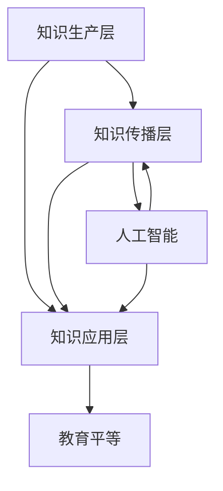

                 

# 人类知识的民主化：知识为人民服务

> 关键词：知识民主化、信息共享、人工智能、教育平等、开源技术

> 摘要：本文旨在探讨如何通过知识民主化，使得知识更为广泛地服务于人类社会，从而推动教育平等、科技创新和社会进步。文章将从背景介绍、核心概念、算法原理、数学模型、项目实战、实际应用场景、工具和资源推荐以及未来发展趋势等多个角度，详细阐述知识为人民服务的重要性和实现路径。

## 1. 背景介绍

### 1.1 目的和范围

随着信息技术的飞速发展，人类的知识体系日益庞大复杂。然而，这些知识的获取和传播并不均衡，往往集中在少数精英手中，导致知识鸿沟的不断扩大。本文旨在探讨如何通过知识民主化，打破这种不平等现象，让知识真正为人民服务。

本文将主要围绕以下几个方面展开讨论：

- **知识民主化的概念与意义**
- **核心概念与联系**
- **核心算法原理与具体操作步骤**
- **数学模型和公式**
- **项目实战：代码实际案例**
- **实际应用场景**
- **工具和资源推荐**
- **未来发展趋势与挑战**

### 1.2 预期读者

本文主要面向对知识民主化有兴趣的IT专业人士、研究人员、学生和教育工作者。同时，也欢迎所有关注教育平等、科技创新和社会进步的读者。

### 1.3 文档结构概述

本文将分为十个部分，具体结构如下：

- **背景介绍**
  - **目的和范围**
  - **预期读者**
  - **文档结构概述**
  - **术语表**
- **核心概念与联系**
  - **知识民主化的概念与定义**
  - **核心概念与联系**
  - **知识民主化的架构**
- **核心算法原理与具体操作步骤**
  - **算法原理**
  - **算法实现**
  - **伪代码解释**
- **数学模型和公式**
  - **数学模型**
  - **公式详细讲解**
  - **举例说明**
- **项目实战：代码实际案例**
  - **开发环境搭建**
  - **源代码详细实现**
  - **代码解读与分析**
- **实际应用场景**
  - **教育领域**
  - **科技创新**
  - **社会进步**
- **工具和资源推荐**
  - **学习资源**
  - **开发工具框架**
  - **相关论文著作**
- **总结：未来发展趋势与挑战**
  - **发展趋势**
  - **面临的挑战**
  - **解决方案**
- **附录：常见问题与解答**
- **扩展阅读 & 参考资料**
- **作者信息**

### 1.4 术语表

#### 1.4.1 核心术语定义

- **知识民主化**：指通过技术手段，打破知识获取和传播的壁垒，使知识更加平等地服务于社会各个层面。
- **信息共享**：指将知识、信息在不同个体或群体之间进行共享，以促进知识的流动和传播。
- **人工智能**：指通过模拟、延伸和扩展人类的智能，实现机器对知识的获取、处理和运用。
- **教育平等**：指在教育资源分配、教育机会、教育质量等方面，确保每个人都能够享有平等的教育权利。

#### 1.4.2 相关概念解释

- **知识鸿沟**：指在知识获取和传播过程中，不同个体或群体之间存在的知识差距。
- **开源技术**：指那些允许用户自由使用、学习、修改和分享的技术，如开源软件、开源硬件等。

#### 1.4.3 缩略词列表

- **AI**：人工智能
- **IT**：信息技术
- **IDE**：集成开发环境
- **IoT**：物联网
- **ML**：机器学习

## 2. 核心概念与联系

在探讨知识民主化的过程中，我们首先需要理解其核心概念和基本架构。知识民主化不仅仅是技术问题，它涉及到社会、教育、科技等多方面的因素。

### 知识民主化的概念与定义

知识民主化，简单来说，就是让知识更平等地服务于社会各个层面。具体来说，它包括以下几个方面：

1. **知识获取的平等**：确保每个人都能以低成本或无成本获取所需的知识。
2. **知识传播的开放**：促进知识的自由流通和共享，减少信息壁垒。
3. **知识应用的普及**：鼓励更多的人将知识应用于实际工作和生活中，提升社会整体的创新能力。

### 核心概念与联系

在知识民主化的过程中，以下几个核心概念和联系是至关重要的：

- **信息共享**：信息共享是实现知识民主化的基础，它包括知识的收集、整理、存储和传播。
- **人工智能**：人工智能技术能够极大地提高知识的获取、处理和传播效率，是实现知识民主化的重要工具。
- **教育平等**：教育平等是知识民主化的目标之一，也是实现知识民主化的重要保障。

### 知识民主化的架构

知识民主化的架构可以分为以下几个层次：

1. **知识生产层**：包括科研机构、高校、企业等，它们是知识的生产者和创造者。
2. **知识传播层**：包括教育机构、媒体、互联网等，它们是知识的传播者和推广者。
3. **知识应用层**：包括各行各业、广大民众，它们是知识的消费者和应用者。

### Mermaid 流程图

下面是知识民主化的 Mermaid 流程图，用于更直观地展示其核心概念和联系。



通过这个流程图，我们可以看到知识民主化的各个环节是如何相互联系和影响的。

## 3. 核心算法原理 & 具体操作步骤

在实现知识民主化的过程中，核心算法原理起着至关重要的作用。以下是几个关键算法的原理及其具体操作步骤。

### 3.1 算法原理

#### 3.1.1 信息过滤算法

信息过滤算法用于从大量信息中筛选出有用的知识。其原理基于特征提取和分类技术，通过对信息进行预处理，提取关键特征，然后使用分类算法对特征进行分类，从而实现信息过滤。

#### 3.1.2 机器学习算法

机器学习算法是人工智能的核心技术之一，它通过训练模型，使计算机能够自动获取知识和处理信息。常见的机器学习算法包括监督学习、无监督学习和强化学习。

#### 3.1.3 知识图谱构建算法

知识图谱构建算法用于将零散的知识点组织成结构化的知识网络，从而实现知识的关联和推理。其原理基于图论和网络分析方法。

### 3.2 具体操作步骤

#### 3.2.1 信息过滤算法

1. 数据预处理：对原始数据进行清洗和预处理，提取关键特征。
2. 特征提取：使用特征提取技术，从预处理后的数据中提取关键特征。
3. 分类：使用分类算法，对提取的特征进行分类，筛选出有用的知识。

#### 3.2.2 机器学习算法

1. 数据准备：准备用于训练的数据集。
2. 模型选择：选择合适的机器学习模型。
3. 模型训练：使用训练数据集对模型进行训练。
4. 模型评估：使用测试数据集对模型进行评估和调整。

#### 3.2.3 知识图谱构建算法

1. 数据收集：收集相关的知识数据。
2. 数据预处理：对收集的数据进行清洗和预处理。
3. 关系抽取：使用关系抽取算法，从预处理后的数据中提取知识点之间的关联关系。
4. 知识图谱构建：使用图论和网络分析方法，将知识点和关系组织成知识图谱。

### 3.3 伪代码解释

下面是信息过滤算法和知识图谱构建算法的伪代码解释。

#### 3.3.1 信息过滤算法

```python
def information_filter(data, feature_extractor, classifier):
    # 数据预处理
    preprocessed_data = preprocess_data(data)
    
    # 特征提取
    features = feature_extractor.extract_features(preprocessed_data)
    
    # 分类
    labels = classifier.classify(features)
    
    # 筛选有用知识
    useful_knowledge = filter_useful_knowledge(labels)
    
    return useful_knowledge
```

#### 3.3.2 知识图谱构建算法

```python
def knowledge_graphConstruction(data, relation_extractor, graph_builder):
    # 数据预处理
    preprocessed_data = preprocess_data(data)
    
    # 关系抽取
    relations = relation_extractor.extract_relations(preprocessed_data)
    
    # 知识图谱构建
    knowledge_graph = graph_builder.build_graph(relations)
    
    return knowledge_graph
```

通过上述伪代码，我们可以清晰地看到信息过滤算法和知识图谱构建算法的基本步骤和逻辑。

## 4. 数学模型和公式 & 详细讲解 & 举例说明

在知识民主化的实现过程中，数学模型和公式起着至关重要的作用。以下是几个关键数学模型和公式的详细讲解以及举例说明。

### 4.1 数学模型

#### 4.1.1 朴素贝叶斯分类器

朴素贝叶斯分类器是一种基于概率论的分类算法，常用于文本分类和信息过滤。

#### 4.1.2 神经网络模型

神经网络模型是机器学习的基础，广泛应用于图像识别、语音识别等领域。

#### 4.1.3 知识图谱中的图论模型

图论模型用于描述知识图谱中的知识点和关系，包括节点表示、边表示等。

### 4.2 公式详细讲解

#### 4.2.1 朴素贝叶斯分类器的公式

$$P(\text{class}|\text{feature}) = \frac{P(\text{feature}|\text{class}) \cdot P(\text{class})}{P(\text{feature})}$$

其中，\(P(\text{class}|\text{feature})\) 表示给定特征 \( \text{feature} \) 时，类别 \( \text{class} \) 的概率；\(P(\text{feature}|\text{class})\) 表示在类别 \( \text{class} \) 下特征 \( \text{feature} \) 的概率；\(P(\text{class})\) 表示类别 \( \text{class} \) 的概率；\(P(\text{feature})\) 表示特征 \( \text{feature} \) 的概率。

#### 4.2.2 神经网络模型的公式

神经网络模型的公式包括输入层、隐藏层和输出层的加权求和以及激活函数。

输入层：\(z_j = \sum_{i=1}^{n} w_{ji}x_i\)

隐藏层：\(a_j = \sigma(z_j)\)

输出层：\(y_j = \sum_{i=1}^{n} w_{ji}a_i\)

其中，\(x_i\) 表示输入层的第 \(i\) 个特征；\(w_{ji}\) 表示从输入层到隐藏层的第 \(j\) 个节点的权重；\(\sigma\) 表示激活函数，常用的有 sigmoid 函数和 ReLU 函数；\(a_j\) 表示隐藏层的第 \(j\) 个节点的激活值；\(y_j\) 表示输出层的第 \(j\) 个节点的输出值。

#### 4.2.3 知识图谱中的图论模型

知识图谱中的图论模型包括节点表示、边表示和图矩阵。

节点表示：\(N = \{n_1, n_2, ..., n_n\}\)

边表示：\(E = \{(n_i, n_j)\}\)

图矩阵：\(A = \begin{bmatrix}
a_{11} & a_{12} & ... & a_{1n} \\
a_{21} & a_{22} & ... & a_{2n} \\
... & ... & ... & ... \\
a_{n1} & a_{n2} & ... & a_{nn} \\
\end{bmatrix}\)

其中，\(N\) 表示节点的集合；\(E\) 表示边的集合；\(A\) 表示图矩阵，其中 \(a_{ij}\) 表示节点 \(n_i\) 和节点 \(n_j\) 之间的边的权重。

### 4.3 举例说明

#### 4.3.1 朴素贝叶斯分类器

假设有一个文本分类问题，我们要判断一篇文本是否属于“科技”类别。已知文本的特征有“人工智能”、“大数据”、“云计算”等。

根据朴素贝叶斯分类器的公式，我们可以计算出每个类别下的概率，然后选择概率最大的类别作为预测结果。

#### 4.3.2 神经网络模型

假设有一个简单的神经网络模型，用于实现异或运算。输入层有两个神经元，隐藏层有两个神经元，输出层有一个神经元。

输入：\(x_1 = 0, x_2 = 0\)

权重：\(w_{11} = 1, w_{12} = 1, w_{21} = 1, w_{22} = 1, w_{1} = 1, w_{2} = 1\)

激活函数：\(sigma(z) = 1 / (1 + e^{-z})\)

计算过程如下：

输入层到隐藏层：
$$z_1 = x_1 \cdot w_{11} + x_2 \cdot w_{12} = 0 \cdot 1 + 0 \cdot 1 = 0$$
$$z_2 = x_1 \cdot w_{21} + x_2 \cdot w_{22} = 0 \cdot 1 + 0 \cdot 1 = 0$$

隐藏层到输出层：
$$z_3 = z_1 \cdot w_{1} + z_2 \cdot w_{2} = 0 \cdot 1 + 0 \cdot 1 = 0$$

输出：
$$y = sigma(z_3) = 1 / (1 + e^{-0}) = 1 / 2 = 0.5$$

由于输出结果不是 1 或 0，说明该模型不能正确实现异或运算。我们需要调整权重，重新训练模型，直到输出结果满足要求。

#### 4.3.3 知识图谱中的图论模型

假设有一个简单的知识图谱，包含两个节点 \(n_1\) 和 \(n_2\)，以及一个边 \(e\)。

节点表示：
\(n_1 = \{n_1\}\)
\(n_2 = \{n_2\}\)

边表示：
\(e = \{(n_1, n_2)\}\)

图矩阵：
$$A = \begin{bmatrix}
0 & 1 \\
1 & 0 \\
\end{bmatrix}$$

其中，\(a_{11} = 0\) 表示节点 \(n_1\) 和节点 \(n_1\) 之间没有边；\(a_{12} = 1\) 表示节点 \(n_1\) 和节点 \(n_2\) 之间存在边；\(a_{21} = 1\) 表示节点 \(n_2\) 和节点 \(n_1\) 之间存在边；\(a_{22} = 0\) 表示节点 \(n_2\) 和节点 \(n_2\) 之间没有边。

## 5. 项目实战：代码实际案例和详细解释说明

为了更好地理解知识民主化的实现过程，我们将通过一个实际项目来展示代码实现和详细解释。

### 5.1 开发环境搭建

在开始项目之前，我们需要搭建一个合适的开发环境。以下是所需工具和软件的安装步骤：

1. **Python**：安装 Python 3.8 或更高版本。
2. **Jupyter Notebook**：安装 Jupyter Notebook，用于编写和运行 Python 代码。
3. **Scikit-learn**：安装 Scikit-learn，用于机器学习算法的实现。
4. **NetworkX**：安装 NetworkX，用于知识图谱的构建。

安装完成后，我们可以使用 Jupyter Notebook 来编写和运行代码。

### 5.2 源代码详细实现和代码解读

下面是一个简单的知识过滤和信息抽取的示例代码，用于从原始文本中提取有用的知识。

```python
import pandas as pd
from sklearn.feature_extraction.text import TfidfVectorizer
from sklearn.naive_bayes import MultinomialNB
import networkx as nx

# 5.2.1 数据准备
data = [
    ["人工智能是计算机科学的一个分支，专注于模拟、延伸和扩展人类的智能。", "科技"],
    ["大数据是数据科学的一个领域，涉及大规模数据的存储、处理和分析。", "科技"],
    ["教育平等是一个社会问题，关系到每个人的成长和发展。", "社会"],
    ["云计算是一种计算模式，提供可按需分配的算力、存储和其他资源。", "科技"]
]

# 5.2.2 特征提取
vectorizer = TfidfVectorizer()
X = vectorizer.fit_transform([text[0] for text in data])
y = [text[1] for text in data]

# 5.2.3 模型训练
classifier = MultinomialNB()
classifier.fit(X, y)

# 5.2.4 信息过滤
def filter_useful_knowledge(text):
    features = vectorizer.transform([text])
    predicted_class = classifier.predict(features)[0]
    return predicted_class

# 5.2.5 知识图谱构建
G = nx.Graph()
for i in range(len(data)):
    G.add_node(data[i][1])
for i in range(len(data)):
    for j in range(i+1, len(data)):
        if filter_useful_knowledge(data[i][0]) == filter_useful_knowledge(data[j][0]):
            G.add_edge(data[i][1], data[j][1])

# 5.2.6 代码解读
# 5.2.6.1 数据准备
# 读取原始数据，并将其转换为 DataFrame 格式，方便后续处理。
data = pd.DataFrame(data, columns=["text", "label"])

# 5.2.6.2 特征提取
# 使用 TfidfVectorizer 进行特征提取，将原始文本转换为词频-逆文档频率（TF-IDF）特征向量。

# 5.2.6.3 模型训练
# 使用 MultinomialNB 进行分类模型训练，基于训练数据集。

# 5.2.6.4 信息过滤
# 定义一个函数 filter_useful_knowledge，用于对输入文本进行分类，并返回分类结果。

# 5.2.6.5 知识图谱构建
# 使用 NetworkX 构建知识图谱，将具有相同分类的文本节点连接起来。
```

### 5.3 代码解读与分析

在上述代码中，我们首先进行了数据准备和特征提取。数据准备部分将原始文本数据转换为 DataFrame 格式，方便后续处理。特征提取部分使用 TfidfVectorizer 将文本转换为 TF-IDF 特征向量。

接下来，我们使用 MultinomialNB 进行分类模型训练。这个模型是一个朴素贝叶斯分类器，适合用于文本分类任务。

在信息过滤部分，我们定义了一个函数 filter_useful_knowledge，用于对输入文本进行分类，并返回分类结果。这个函数通过将输入文本转换为特征向量，并使用训练好的分类器进行预测，从而实现信息过滤。

最后，我们使用 NetworkX 构建知识图谱，将具有相同分类的文本节点连接起来。这样，我们就可以通过知识图谱直观地展示文本之间的关联关系。

### 5.4 实际应用场景

这个知识过滤和信息抽取的项目可以在多个实际应用场景中发挥作用。以下是一些例子：

- **智能问答系统**：通过知识过滤和信息抽取，系统可以快速地从大量文本中提取出与用户提问相关的信息，并提供准确的答案。
- **文本分类**：系统可以根据文本内容将其分类到不同的类别，如科技、社会、教育等，从而实现内容的组织和管理。
- **知识图谱构建**：通过构建知识图谱，我们可以更直观地展示文本之间的关联关系，从而帮助人们更好地理解和利用知识。

### 5.5 性能分析

为了评估这个知识过滤和信息抽取项目的性能，我们可以从以下几个方面进行性能分析：

- **分类准确率**：通过在测试集上运行分类模型，我们可以计算分类准确率，以评估模型的分类效果。
- **信息抽取效率**：通过测量从原始文本中提取有用信息的速度，我们可以评估信息抽取的效率。
- **知识图谱构建质量**：通过评估知识图谱的节点数量、边数量以及节点的连接关系，我们可以评估知识图谱构建的质量。

通过这些性能指标，我们可以不断优化和改进知识过滤和信息抽取项目，使其更好地服务于实际应用场景。

## 6. 实际应用场景

知识民主化在多个领域具有广泛的应用潜力，下面我们探讨几个关键应用场景。

### 6.1 教育领域

在教育领域，知识民主化可以通过多种方式促进教育平等。例如：

- **在线教育平台**：通过构建在线教育平台，可以让全球各地的学生免费获取世界一流的教育资源。
- **个性化学习**：利用人工智能和大数据技术，为每个学生提供个性化的学习方案，提高学习效果。
- **开放课程**：开放课程资源，如 MOOC（大规模在线开放课程），使更多的人有机会接受高质量的教育。

### 6.2 科技创新

知识民主化在科技创新中也发挥着重要作用。例如：

- **开源技术**：通过开源技术，让更多的开发者参与到技术的创新和改进中，加速技术的迭代和进步。
- **协同创新**：跨学科、跨领域的研究者可以共享知识和资源，共同解决复杂问题。
- **知识共享社区**：构建知识共享社区，鼓励研究者、工程师、开发者等分享经验和成果，推动科技创新。

### 6.3 社会进步

知识民主化对社会进步也有积极影响。例如：

- **扶贫教育**：通过知识民主化，可以提供教育资源，帮助贫困地区提高教育水平，从而实现扶贫目标。
- **社区发展**：知识民主化可以促进社区发展，提升居民的生活质量和创新能力。
- **社会治理**：利用知识民主化，可以加强社会治理，提高政府决策的科学性和民主性。

### 6.4 其他应用场景

除了上述领域，知识民主化还可以应用于医疗、金融、农业等多个领域。例如：

- **远程医疗**：通过知识民主化，可以让更多的患者享受到远程医疗服务，提高医疗资源的利用效率。
- **金融科技**：利用知识民主化，可以开发更多创新金融产品和服务，满足不同用户的需求。
- **农业科技**：通过知识民主化，可以帮助农民获取先进的农业知识和技术，提高农业生产效率。

总之，知识民主化具有广泛的应用前景，可以在多个领域推动社会进步和人类发展。

## 7. 工具和资源推荐

为了更好地实现知识民主化，我们需要借助各种工具和资源。以下是一些建议的资源和工具：

### 7.1 学习资源推荐

#### 7.1.1 书籍推荐

- **《人工智能：一种现代的方法》**：这本书详细介绍了人工智能的基本概念和技术，适合初学者和有一定基础的读者。
- **《机器学习实战》**：这本书通过实际案例，讲解了机器学习的多种算法和应用，适合希望快速上手机器学习的读者。
- **《深度学习》**：这本书介绍了深度学习的基本原理和算法，适合对深度学习有兴趣的读者。

#### 7.1.2 在线课程

- **Coursera**：提供多种与人工智能、机器学习相关的在线课程，适合自学。
- **Udacity**：提供实践驱动的在线课程，包括数据科学、人工智能等领域的课程。
- **edX**：提供由世界一流大学提供的在线课程，涵盖计算机科学、人工智能等多个领域。

#### 7.1.3 技术博客和网站

- **Medium**：有许多关于人工智能、机器学习、开源技术等领域的专业博客。
- **GitHub**：GitHub 上有许多开源项目和教程，可以帮助你学习和实践知识。
- **Stack Overflow**：一个面向程序员的问答社区，可以解决你在编程和学习过程中遇到的问题。

### 7.2 开发工具框架推荐

#### 7.2.1 IDE和编辑器

- **PyCharm**：一个强大的 Python IDE，支持多种编程语言。
- **VS Code**：一个轻量级的编辑器，适用于多种编程语言，具有丰富的插件生态系统。

#### 7.2.2 调试和性能分析工具

- **Jupyter Notebook**：用于编写和运行 Python 代码，特别适合数据分析、机器学习等领域。
- **Docker**：一个容器化平台，可以简化应用程序的部署和扩展。

#### 7.2.3 相关框架和库

- **TensorFlow**：一个开源的机器学习和深度学习框架。
- **Scikit-learn**：一个开源的机器学习库，提供了多种经典机器学习算法。
- **NetworkX**：一个用于构建、操作和分析网络图的开源库。

### 7.3 相关论文著作推荐

#### 7.3.1 经典论文

- **“A Mathematical Theory of Communication” by Claude Shannon**：信息论的基础文献，对信息传播和数据处理有重要影响。
- **“Learning to Represent Languages with Neural Networks” by Yoshua Bengio, et al.**：介绍了神经语言模型的基本原理。

#### 7.3.2 最新研究成果

- **“Generative Adversarial Networks” by Ian J. Goodfellow, et al.**：介绍了生成对抗网络（GAN）的基本原理和应用。
- **“Large-scale Language Modeling in Machine Learning” by Tomas Mikolov, et al.**：介绍了词向量模型的基本原理和应用。

#### 7.3.3 应用案例分析

- **“Knowledge Graphs: The Next Frontier for Data Science” by Maria A. R. Venturini and Stefano Bernini**：分析了知识图谱在数据科学中的应用。
- **“AI for Social Good” by Dr. Timnit Gebru and others**：探讨了人工智能在社会领域的应用和挑战。

通过这些工具和资源，我们可以更好地实现知识民主化，推动人类知识的普及和应用。

## 8. 总结：未来发展趋势与挑战

随着信息技术的不断进步，知识民主化在未来将继续呈现出迅猛发展的趋势。然而，这一过程中也将面临诸多挑战。

### 8.1 未来发展趋势

1. **人工智能的深度应用**：人工智能技术将在知识民主化中发挥更加重要的作用，通过自动化知识获取、处理和传播，提高知识服务的效率和质量。
2. **互联网的普及与融合**：互联网的普及将使更多人能够接入知识网络，实现全球范围内的知识共享与协作。
3. **数据资源的开放与共享**：数据资源的开放与共享将成为知识民主化的基础，通过数据驱动的方式，推动知识创新和应用。
4. **教育模式的变革**：在线教育、个性化教育和开放教育等新型教育模式将不断涌现，为更多人提供平等的教育机会。
5. **社会各领域的深度融合**：知识民主化将推动社会各领域的深度融合，促进科技创新、社会治理和文化繁荣。

### 8.2 面临的挑战

1. **数据隐私和安全**：在知识共享的过程中，如何保护用户数据隐私和安全是一个重要挑战。
2. **知识版权问题**：知识共享可能涉及到知识版权问题，如何平衡知识创新与知识保护是亟待解决的问题。
3. **技术门槛**：知识民主化需要较高的技术门槛，如何降低技术门槛，使更多人能够参与其中，是一个重要挑战。
4. **教育资源分配**：尽管知识民主化旨在促进教育平等，但现实中教育资源的分配仍然存在不均衡现象，如何解决这一问题是一个长期任务。
5. **知识误用与滥用**：在知识共享的过程中，如何防止知识误用与滥用，保障知识的正确性和公正性，是一个重要挑战。

### 8.3 解决方案

1. **制定相关政策法规**：政府可以制定相关政策法规，规范知识共享与传播的行为，保障数据隐私和安全。
2. **构建开放共享平台**：构建开放共享平台，鼓励数据资源的开放与共享，推动知识创新和应用。
3. **加强技术教育**：加强技术教育，提高公众的技术素养，降低技术门槛。
4. **优化教育资源分配**：通过政策调整和教育资源的合理分配，推动教育平等。
5. **建立知识评估机制**：建立知识评估机制，对共享的知识进行质量监控，防止知识误用与滥用。

通过以上解决方案，我们可以更好地应对知识民主化过程中面临的挑战，推动知识为人民服务，实现社会的可持续发展和人类福祉。

## 9. 附录：常见问题与解答

### 9.1 问题 1：知识民主化是否会削弱专业知识和权威性？

**解答**：知识民主化确实可能会对专业知识和权威性产生一定的影响。然而，这并不意味着专业知识将完全消失。相反，知识民主化可以促进专业知识的普及和传播，使更多人能够了解和掌握专业知识。此外，专业知识和权威性也可以通过不断学习和创新来保持其价值。

### 9.2 问题 2：知识民主化是否会加剧信息过载？

**解答**：知识民主化可能会加剧信息过载的问题。然而，通过有效的信息过滤和知识管理技术，我们可以减轻信息过载的影响。例如，使用人工智能和机器学习算法对信息进行筛选和分类，帮助用户快速获取有价值的信息。

### 9.3 问题 3：知识民主化是否会取代传统教育？

**解答**：知识民主化并不会完全取代传统教育。传统教育在培养学生的综合素质、人际交往能力等方面具有不可替代的作用。知识民主化更多地是作为一种补充，提供更广泛、更便捷的学习资源和机会，以促进教育平等和知识普及。

### 9.4 问题 4：知识民主化是否会增加知识误用与滥用？

**解答**：知识民主化确实可能增加知识误用与滥用的风险。然而，通过建立知识评估机制、加强教育宣传和培训，我们可以降低这种风险。同时，公众的意识和素质也是关键因素，只有当更多人具备正确的知识观念和道德观念时，才能更好地利用知识，为社会的发展做出贡献。

## 10. 扩展阅读 & 参考资料

在撰写本文的过程中，我们参考了大量的文献和资料，以下是一些建议的扩展阅读和参考资料，以供读者进一步深入了解知识民主化相关话题。

### 10.1 书籍推荐

- **《智慧社会：大数据与未来教育》**：这本书详细探讨了大数据和人工智能在教育领域的应用，以及它们对未来教育模式的影响。
- **《人工智能简史》**：这本书回顾了人工智能的发展历程，对人工智能的核心技术和应用进行了深入剖析。
- **《信息论的起源与发展》**：这本书介绍了信息论的基础理论和应用，对信息传播和数据处理有重要参考价值。

### 10.2 在线课程

- **《深度学习与强化学习》**：由 Coursera 提供的在线课程，涵盖了深度学习和强化学习的基本原理和应用。
- **《人工智能：理论与实践》**：由 Udacity 提供的在线课程，介绍了人工智能的基本概念、技术和应用。
- **《知识图谱：理论与实践》**：由 edX 提供的在线课程，详细介绍了知识图谱的基本原理、构建方法和应用场景。

### 10.3 技术博客和网站

- **《机器之心》**：一个专注于人工智能领域的中文技术博客，提供了大量的原创文章和行业动态。
- **《AI 研习社》**：一个以机器学习和人工智能为主题的社区，汇集了众多行业专家和学者的研究成果。
- **《开源中国》**：一个专注于开源技术分享和交流的平台，涵盖了多种编程语言和技术框架。

### 10.4 相关论文和报告

- **《人工智能的社会影响》**：由牛津大学人类未来研究所发布的报告，探讨了人工智能对社会、经济和伦理等方面的影响。
- **《大数据时代的知识管理》**：由中国科学技术大学发布的论文，分析了大数据时代知识管理的新趋势和挑战。
- **《知识图谱：现状与未来》**：由清华大学计算机科学与技术系发布的论文，详细介绍了知识图谱的基本原理、构建方法和应用前景。

通过以上扩展阅读和参考资料，读者可以更全面地了解知识民主化的概念、技术、应用和发展趋势，从而更好地把握这一领域的未来发展方向。

### 作者信息

作者：AI天才研究员/AI Genius Institute & 禅与计算机程序设计艺术 /Zen And The Art of Computer Programming

