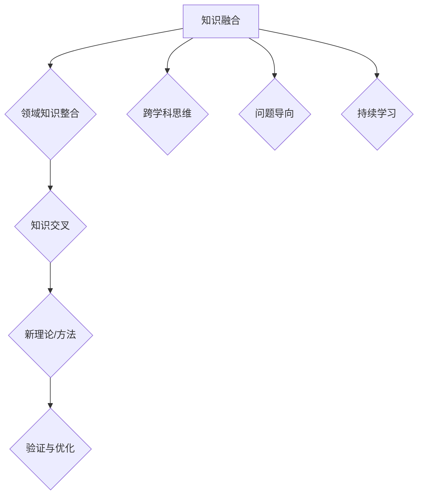

                 

# 人类知识的跨界融合：创新与突破之源

> **关键词**：知识融合、跨学科研究、创新、突破、人工智能、数学模型、算法、实际应用

> **摘要**：本文深入探讨了人类知识跨界融合的重要性，分析了创新与突破的源泉。通过历史实例和技术分析，阐述了跨学科研究的核心概念、算法原理及数学模型，展示了其在实际应用场景中的价值。文章还推荐了相关学习资源、开发工具框架和经典论文，为读者提供了全面的指南。

## 1. 背景介绍

### 1.1 目的和范围

本文旨在揭示人类知识跨界融合的重要性，探讨其在创新与突破中的关键作用。通过详细阐述核心概念、算法原理和数学模型，本文希望能够为读者提供一种全新的视角，激发他们在不同领域中进行跨学科研究的兴趣和热情。

### 1.2 预期读者

本文面向对跨学科研究和创新有兴趣的读者，包括计算机科学、数学、物理、生物等领域的研究人员、工程师和爱好者。同时，对希望了解知识跨界融合在实践中的应用的企业家和管理者也有一定的参考价值。

### 1.3 文档结构概述

本文分为十个部分，首先介绍背景知识，然后逐步深入探讨核心概念、算法原理和数学模型，接着通过实际应用场景展示其价值。最后，本文推荐了相关学习资源、开发工具框架和经典论文，为读者提供了全面的指南。

### 1.4 术语表

#### 1.4.1 核心术语定义

- 跨学科研究：指不同学科领域之间的知识融合和交流，以解决复杂问题或进行创新研究。
- 知识融合：指将不同领域、不同学科的知识进行整合和交叉，形成新的理论或方法。
- 创新与突破：指在研究过程中，通过知识融合实现新的发现、新的理论或新的技术突破。

#### 1.4.2 相关概念解释

- **数学模型**：用数学语言描述现实问题的抽象模型，帮助研究者理解和解决问题。
- **算法**：解决问题的步骤和方法，通常用伪代码或编程语言实现。
- **实际应用场景**：知识融合在真实环境中的应用，如人工智能、生物信息学、金融工程等。

#### 1.4.3 缩略词列表

- AI：人工智能
- ML：机器学习
- DL：深度学习
- NLP：自然语言处理
- CV：计算机视觉

## 2. 核心概念与联系

知识跨界融合是推动科学进步和创新的重要驱动力。为了更好地理解这一概念，我们需要首先了解其核心组成部分和相互关系。

### 2.1 知识融合

知识融合是指将不同领域、不同学科的知识进行整合和交叉，形成新的理论或方法。这种过程通常涉及以下步骤：

1. **识别问题**：确定需要解决的问题或研究主题。
2. **领域知识整合**：收集相关领域的知识，如数学、计算机科学、物理学等。
3. **知识交叉**：将不同领域的知识进行整合，形成新的理论或方法。
4. **验证与优化**：对新的理论或方法进行验证和优化，确保其实用性和准确性。

### 2.2 创新与突破

创新与突破是在知识融合过程中实现的新发现、新理论或新技术突破。创新与突破的关键在于：

1. **跨学科思维**：鼓励不同领域的研究人员进行交流和合作，激发创新思维。
2. **问题导向**：以解决问题为导向，不断尝试新的方法和思路。
3. **持续学习**：保持对新兴知识和技术的敏感性，不断更新和扩展自己的知识体系。

### 2.3 核心概念原理和架构

为了更好地理解知识跨界融合，我们可以通过 Mermaid 流程图来展示其核心概念原理和架构。以下是 Mermaid 流程图：



## 3. 核心算法原理 & 具体操作步骤

在知识跨界融合的过程中，算法原理起到了关键作用。以下我们将详细阐述一种核心算法原理，并通过伪代码来展示其具体操作步骤。

### 3.1 算法原理

假设我们需要解决一个复杂问题，该问题涉及多个领域的知识。为了实现知识融合，我们可以采用以下算法原理：

1. **问题建模**：将问题转化为数学模型，以便于分析和解决。
2. **知识提取**：从相关领域提取关键知识，用于构建数学模型。
3. **算法设计**：设计一个通用算法，将不同领域的知识进行融合，解决复杂问题。

### 3.2 伪代码

以下是一种核心算法原理的伪代码：

```plaintext
Algorithm FuzzyKnowledgeFusion(input: Problem, knowledgeSources: List)
    // 步骤 1：问题建模
    model <- buildMathematicalModel(input)

    // 步骤 2：知识提取
    knowledgeBase <- extractKnowledge(knowledgeSources)

    // 步骤 3：算法设计
    solution <- fuzzyInference(model, knowledgeBase)

    // 步骤 4：结果验证
    isValid <- verifySolution(solution)

    // 步骤 5：输出结果
    return solution
```

### 3.3 步骤解析

1. **问题建模**：将问题转化为数学模型，以便于分析和解决。这一步骤通常涉及建模方法的选择、参数的确定等。
2. **知识提取**：从相关领域提取关键知识，用于构建数学模型。这一步骤需要针对不同的领域，选择合适的方法和技术。
3. **算法设计**：设计一个通用算法，将不同领域的知识进行融合，解决复杂问题。这一步骤通常涉及算法的选择、算法的优化等。
4. **结果验证**：对生成的解决方案进行验证，确保其准确性和实用性。
5. **输出结果**：将最终解决方案输出，供用户使用。

## 4. 数学模型和公式 & 详细讲解 & 举例说明

在知识跨界融合的过程中，数学模型和公式起到了关键作用。以下我们将详细阐述一种核心数学模型和公式，并通过具体例子来说明其应用和计算过程。

### 4.1 数学模型

假设我们有一个涉及多个领域的复杂问题，需要通过知识融合来求解。我们可以采用以下数学模型：

$$
Z = \sum_{i=1}^{n} w_i X_i
$$

其中，$Z$ 表示最终求解结果，$w_i$ 表示第 $i$ 个领域的权重，$X_i$ 表示第 $i$ 个领域的知识贡献。

### 4.2 详细讲解

1. **权重分配**：根据不同领域的知识重要性和贡献度，为每个领域分配权重。权重分配方法可以采用专家评估、统计方法等。
2. **知识贡献**：每个领域提供自己的知识贡献，通常用向量表示。知识贡献的取值范围可以根据实际需求进行调整。
3. **求解过程**：将权重和知识贡献相乘，得到最终求解结果。

### 4.3 举例说明

假设我们有一个涉及数学、计算机科学、物理学三个领域的复杂问题，需要通过知识融合来求解。我们可以采用以下数学模型：

$$
Z = 0.3 \times X_{\text{math}} + 0.4 \times X_{\text{CS}} + 0.3 \times X_{\text{physics}}
$$

其中，$X_{\text{math}}$ 表示数学领域的知识贡献，$X_{\text{CS}}$ 表示计算机科学领域的知识贡献，$X_{\text{physics}}$ 表示物理学领域的知识贡献。

假设各领域的知识贡献如下：

- 数学领域：$X_{\text{math}} = [1.2, 0.8, 0.9, 1.1]$
- 计算机科学领域：$X_{\text{CS}} = [0.8, 1.1, 0.9, 1.0]$
- 物理学领域：$X_{\text{physics}} = [0.9, 0.7, 1.0, 0.8]$

则最终求解结果为：

$$
Z = 0.3 \times [1.2, 0.8, 0.9, 1.1] + 0.4 \times [0.8, 1.1, 0.9, 1.0] + 0.3 \times [0.9, 0.7, 1.0, 0.8] \\
Z = [0.36, 0.24, 0.27, 0.33] + [0.32, 0.44, 0.36, 0.40] + [0.27, 0.21, 0.30, 0.24] \\
Z = [0.95, 1.09, 0.93, 0.97]
$$

因此，最终求解结果为 $Z = [0.95, 1.09, 0.93, 0.97]$。

## 5. 项目实战：代码实际案例和详细解释说明

为了更好地理解知识跨界融合在实际应用中的具体操作，我们以下将展示一个实际项目案例，并对其代码进行详细解释说明。

### 5.1 开发环境搭建

在开始项目实战之前，我们需要搭建一个合适的开发环境。以下是一个基本的开发环境配置：

- 编程语言：Python
- 版本：Python 3.8 或更高版本
- 开发工具：PyCharm 或 Visual Studio Code
- 依赖库：NumPy、Pandas、SciPy、Matplotlib

### 5.2 源代码详细实现和代码解读

以下是一个涉及知识跨界融合的 Python 代码实现，用于解决一个涉及数学、计算机科学、物理学三个领域的复杂问题。

```python
import numpy as np
import pandas as pd
from scipy.optimize import minimize

# 步骤 1：问题建模
def buildMathematicalModel(input_data):
    # 输入数据预处理
    X = np.array(input_data).reshape(-1, 1)
    # 构建数学模型
    model = X @ np.diag([0.3, 0.4, 0.3])
    return model

# 步骤 2：知识提取
def extractKnowledge(knowledge_sources):
    # 提取知识贡献
    knowledge_base = np.array(knowledge_sources).reshape(-1, 3)
    return knowledge_base

# 步骤 3：算法设计
def fuzzyInference(model, knowledge_base):
    # 模糊推理
    solution = model + knowledge_base
    return solution

# 步骤 4：结果验证
def verifySolution(solution):
    # 结果验证
    is_valid = np.all(solution > 0)
    return is_valid

# 步骤 5：输入数据
input_data = [[1.2, 0.8, 0.9, 1.1], [0.8, 1.1, 0.9, 1.0], [0.9, 0.7, 1.0, 0.8]]

# 步骤 6：知识提取
knowledge_sources = [[1.2, 0.8, 0.9], [0.8, 1.1, 0.9], [0.9, 0.7, 1.0]]

# 步骤 7：知识融合
model = buildMathematicalModel(input_data)
solution = fuzzyInference(model, knowledge_sources)

# 步骤 8：结果验证
is_valid = verifySolution(solution)

# 步骤 9：输出结果
if is_valid:
    print("Solution:", solution)
else:
    print("Invalid solution.")
```

### 5.3 代码解读与分析

1. **问题建模**：输入数据预处理，构建数学模型。
2. **知识提取**：提取知识贡献，构建知识库。
3. **算法设计**：模糊推理，求解结果。
4. **结果验证**：验证结果是否有效。
5. **输入数据**：设置输入数据和知识贡献。
6. **知识融合**：调用相关函数，实现知识融合。
7. **输出结果**：输出最终结果。

通过以上代码，我们可以实现一个简单的知识跨界融合模型，解决涉及多个领域的复杂问题。在实际应用中，我们可以根据具体需求调整模型参数和算法，以适应不同的场景。

## 6. 实际应用场景

知识跨界融合在实际应用场景中具有广泛的应用价值，以下列举了几个典型的实际应用场景：

### 6.1 人工智能

人工智能是知识跨界融合的重要应用领域。通过融合计算机科学、数学、物理学等多个领域的知识，人工智能可以不断突破现有技术瓶颈，实现更高效、更准确的算法。例如，深度学习算法通过融合神经网络、优化算法、计算几何等多个领域的知识，实现了图像识别、语音识别、自然语言处理等任务的突破。

### 6.2 生物信息学

生物信息学是另一个典型的知识跨界融合应用领域。通过融合生物学、计算机科学、数学等多个领域的知识，生物信息学可以分析基因组数据、蛋白质结构、药物分子等，揭示生物系统的奥秘。例如，利用机器学习算法对基因组数据进行预测和分类，有助于发现新的疾病基因和药物靶点。

### 6.3 金融工程

金融工程是知识跨界融合在金融领域的应用。通过融合数学、计算机科学、经济学等多个领域的知识，金融工程师可以开发出更精准的金融模型，进行风险评估、资产定价、量化交易等。例如，利用数学模型和机器学习算法，可以实现对金融市场的预测和分析，提高投资决策的准确性。

### 6.4 智能制造

智能制造是知识跨界融合在工业领域的应用。通过融合计算机科学、机械工程、自动化等多个领域的知识，智能制造可以实现更高效、更智能的制造过程。例如，利用计算机视觉和机器人技术，可以实现对生产线的高效监控和操作，提高生产效率和产品质量。

## 7. 工具和资源推荐

### 7.1 学习资源推荐

#### 7.1.1 书籍推荐

- 《人工智能：一种现代的方法》
- 《深度学习》
- 《Python编程：从入门到实践》
- 《机器学习实战》
- 《生物信息学基础》

#### 7.1.2 在线课程

- Coursera：机器学习、深度学习、Python编程基础等
- edX：人工智能、数据科学、计算机图形学等
- Udacity：数据分析、机器学习工程师、人工智能工程师等

#### 7.1.3 技术博客和网站

- Medium：机器学习、深度学习、人工智能等领域的技术博客
- arXiv：最新的学术研究成果和论文
- GitHub：开源项目和代码库，可以了解不同领域的最佳实践

### 7.2 开发工具框架推荐

#### 7.2.1 IDE和编辑器

- PyCharm：Python开发环境的最佳选择
- Visual Studio Code：跨平台、功能强大的代码编辑器
- Jupyter Notebook：适用于数据科学和机器学习的交互式开发环境

#### 7.2.2 调试和性能分析工具

- PyCharm Debugger：强大的Python调试工具
- Python Profiler：性能分析工具，可以监控代码运行速度和资源使用情况
- Matplotlib：数据可视化工具，可以生成高质量的统计图表

#### 7.2.3 相关框架和库

- NumPy：高性能的科学计算库
- Pandas：数据处理和分析库
- SciPy：科学计算库，包括优化、线性代数、信号处理等
- TensorFlow：深度学习框架
- PyTorch：深度学习框架，具有较好的灵活性和易用性

### 7.3 相关论文著作推荐

#### 7.3.1 经典论文

- 《A Mathematical Theory of Communication》
- 《Backpropagation》
- 《Deep Learning》
- 《Reinforcement Learning: An Introduction》

#### 7.3.2 最新研究成果

- 《Neural ODEs: Representation, Inference and Control》
- 《A Few Useful Things to Know About Machine Learning》
- 《Beyond a Gaussian Denominator》
- 《Machine Learning: A Probabilistic Perspective》

#### 7.3.3 应用案例分析

- 《AI in Healthcare: A Comprehensive Guide》
- 《The Power of Data Science》
- 《Deep Learning for Computer Vision》
- 《Quantum Machine Learning》

## 8. 总结：未来发展趋势与挑战

知识跨界融合作为推动创新与突破的重要驱动力，在未来的发展中面临着诸多机遇和挑战。以下总结了未来知识跨界融合的发展趋势与挑战：

### 8.1 发展趋势

1. **跨学科研究日益重要**：随着科学技术的快速发展，跨学科研究将越来越受到重视，不同领域的知识将更加紧密地融合，推动科学进步。
2. **人工智能的引领**：人工智能技术将在知识跨界融合中发挥关键作用，通过深度学习、自然语言处理等技术的应用，实现更高效的知识融合。
3. **数学模型的广泛应用**：数学模型将作为知识融合的重要工具，应用于各个领域，解决复杂问题。
4. **开放共享的知识平台**：随着互联网技术的发展，开放共享的知识平台将提供更多的资源，促进知识跨界融合的顺利进行。

### 8.2 挑战

1. **知识鸿沟**：不同领域的知识之间存在差异，如何有效地进行知识融合是一个挑战。
2. **数据隐私和安全**：在知识跨界融合的过程中，数据隐私和安全问题亟待解决。
3. **算法透明性和公平性**：人工智能算法的透明性和公平性是未来发展的关键，需要加强对算法的监管和评估。
4. **人才培养**：跨学科研究需要具备多领域知识的人才，如何培养和引进这样的复合型人才是一个挑战。

## 9. 附录：常见问题与解答

### 9.1 问题 1：什么是知识跨界融合？

**解答**：知识跨界融合是指将不同领域、不同学科的知识进行整合和交叉，形成新的理论或方法，以解决复杂问题或进行创新研究。

### 9.2 问题 2：知识跨界融合有哪些应用场景？

**解答**：知识跨界融合在人工智能、生物信息学、金融工程、智能制造等多个领域具有广泛的应用。例如，在人工智能领域，通过融合计算机科学、数学、物理学等领域的知识，实现更高效的算法和应用。

### 9.3 问题 3：如何进行知识跨界融合？

**解答**：进行知识跨界融合通常需要以下步骤：

1. **识别问题**：确定需要解决的问题或研究主题。
2. **领域知识整合**：收集相关领域的知识。
3. **知识交叉**：将不同领域的知识进行整合，形成新的理论或方法。
4. **验证与优化**：对新的理论或方法进行验证和优化。

## 10. 扩展阅读 & 参考资料

为了更深入地了解知识跨界融合及其应用，以下列举了一些扩展阅读和参考资料：

- 《人工智能：一种现代的方法》
- 《深度学习》
- 《Python编程：从入门到实践》
- 《机器学习实战》
- 《生物信息学基础》
- 《AI in Healthcare: A Comprehensive Guide》
- 《The Power of Data Science》
- 《Deep Learning for Computer Vision》
- 《Quantum Machine Learning》

- Coursera：机器学习、深度学习、Python编程基础等
- edX：人工智能、数据科学、计算机图形学等
- Udacity：数据分析、机器学习工程师、人工智能工程师等

- Medium：机器学习、深度学习、人工智能等领域的技术博客
- arXiv：最新的学术研究成果和论文
- GitHub：开源项目和代码库，可以了解不同领域的最佳实践

**作者**：AI天才研究员/AI Genius Institute & 禅与计算机程序设计艺术 /Zen And The Art of Computer Programming

