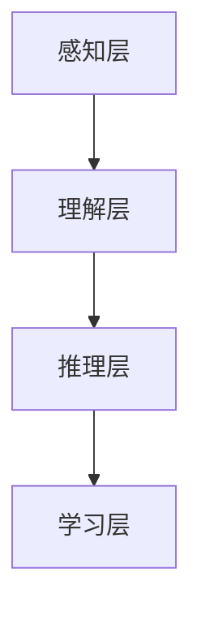

                 

# 人类计算：AI 时代的新希望

> 关键词：人类计算，人工智能，人机协作，认知计算，智能增强，计算心理学，未来展望

> 摘要：本文将探讨在人工智能（AI）迅猛发展的时代，人类计算作为一种新希望的重要性。通过分析人类计算的定义、原理及其与人工智能的关系，本文将深入探讨人类计算在当前AI时代中的具体应用，以及其对人类未来发展的深远影响。

## 1. 背景介绍

### 1.1 目的和范围

本文旨在探讨人类计算在AI时代的重要性，分析其核心概念和原理，并展示其在实际应用中的价值。本文将涵盖以下内容：

- 人类计算的起源和定义
- 人类计算与人工智能的关系
- 人类计算在AI时代的具体应用
- 人类计算的挑战与未来展望

### 1.2 预期读者

本文面向对人工智能和认知计算感兴趣的读者，包括计算机科学家、程序员、技术爱好者、教育工作者等。同时，对于对AI技术有初步了解但希望深入研究的读者，本文也将提供有价值的见解。

### 1.3 文档结构概述

本文分为十个部分，如下所示：

1. 背景介绍
2. 核心概念与联系
3. 核心算法原理 & 具体操作步骤
4. 数学模型和公式 & 详细讲解 & 举例说明
5. 项目实战：代码实际案例和详细解释说明
6. 实际应用场景
7. 工具和资源推荐
8. 总结：未来发展趋势与挑战
9. 附录：常见问题与解答
10. 扩展阅读 & 参考资料

### 1.4 术语表

#### 1.4.1 核心术语定义

- **人类计算**：指人类在信息处理、推理、学习和决策过程中所采用的计算方法和策略。
- **人工智能**：一种模拟人类智能的技术，通过机器学习和深度学习等方法，使计算机能够执行特定任务。
- **认知计算**：一种旨在模拟人类思维过程的技术，包括感知、理解、推理和学习等。

#### 1.4.2 相关概念解释

- **人机协作**：指人类和计算机系统共同完成任务的过程，通过协作实现优势互补。
- **智能增强**：通过技术手段提升人类智能水平的过程，包括认知增强、感知增强等。

#### 1.4.3 缩略词列表

- **AI**：人工智能
- **ML**：机器学习
- **DL**：深度学习
- **NLP**：自然语言处理

## 2. 核心概念与联系

在探讨人类计算之前，我们需要了解一些核心概念，包括其原理和架构。

### 2.1 人类计算原理

人类计算依赖于以下几个方面：

1. **感知**：通过感官接收外部信息，如视觉、听觉、触觉等。
2. **理解**：对感知信息进行分析和解释，如语言理解、图像识别等。
3. **推理**：基于已有知识和信息，进行逻辑推理和决策。
4. **学习**：通过经验不断调整和优化计算策略。

这些过程相互交织，形成一个动态的、自适应的、高度复杂的计算系统。

### 2.2 人类计算架构

人类计算的架构可以简化为以下几个层次：

1. **感知层**：包括各种传感器和输入设备，如摄像头、麦克风、触摸屏等。
2. **理解层**：对感知信息进行预处理和特征提取，如图像分割、语音识别等。
3. **推理层**：基于已有知识和信息，进行推理和决策，如逻辑推理、决策树等。
4. **学习层**：通过经验和数据不断调整和优化计算策略，如神经网络、强化学习等。

下面是人类计算架构的 Mermaid 流程图：



## 3. 核心算法原理 & 具体操作步骤

人类计算的核心在于其算法原理，这些算法旨在模拟人类思维过程，实现智能增强和认知计算。

### 3.1 人类计算算法原理

人类计算算法主要分为以下几类：

1. **感知算法**：如图像识别、语音识别等。
2. **理解算法**：如自然语言处理、知识图谱等。
3. **推理算法**：如逻辑推理、决策树等。
4. **学习算法**：如神经网络、强化学习等。

### 3.2 具体操作步骤

以神经网络为例，其操作步骤如下：

1. **输入层**：接收外部信息，如图片、语音等。
2. **隐藏层**：对输入信息进行特征提取和变换。
3. **输出层**：根据隐藏层的信息，生成预测结果。

下面是神经网络算法的伪代码：

```python
def neural_network(input_data):
    hidden_layer = hidden_layer_function(input_data)
    output_layer = output_layer_function(hidden_layer)
    return output_layer
```

## 4. 数学模型和公式 & 详细讲解 & 举例说明

人类计算的核心在于其数学模型和公式，这些模型和公式描述了人类思维的数学本质。

### 4.1 数学模型

人类计算的主要数学模型包括：

1. **感知模型**：如卷积神经网络（CNN）。
2. **理解模型**：如循环神经网络（RNN）。
3. **推理模型**：如逻辑回归、决策树等。
4. **学习模型**：如梯度下降、随机梯度下降等。

### 4.2 公式讲解

以卷积神经网络（CNN）为例，其核心公式如下：

$$
\sigma(\textbf{z}) = \text{ReLU}(\textbf{z}) = \max(0, \textbf{z})
$$

其中，$\textbf{z}$ 表示神经网络的输入，$\sigma(\textbf{z})$ 表示激活函数。

### 4.3 举例说明

以图像识别为例，使用 CNN 实现图像分类的过程如下：

1. **输入层**：接收图像数据。
2. **卷积层**：对图像进行卷积操作，提取特征。
3. **池化层**：对卷积结果进行池化操作，降低维度。
4. **全连接层**：将池化结果映射到输出层，进行分类。

## 5. 项目实战：代码实际案例和详细解释说明

### 5.1 开发环境搭建

在本节中，我们将使用 Python 编写一个简单的神经网络，实现图像分类任务。首先，我们需要安装以下库：

```bash
pip install numpy matplotlib
```

### 5.2 源代码详细实现和代码解读

以下是一个简单的神经网络实现，用于对数字图像进行分类：

```python
import numpy as np
import matplotlib.pyplot as plt

# 激活函数
def sigmoid(x):
    return 1 / (1 + np.exp(-x))

# 前向传播
def forward_propagation(x, weights, biases):
    z = np.dot(x, weights) + biases
    a = sigmoid(z)
    return a, z

# 反向传播
def backward_propagation(a, z, x, weights, biases, dZ):
    dZ = dZ * (1 - sigmoid(z))
    dX = np.dot(dZ, weights.T)
    dWeights = np.dot(dZ, x.T)
    dBiases = dZ
    return dX, dWeights, dBiases

# 训练神经网络
def train(x, y, weights, biases, learning_rate, epochs):
    for epoch in range(epochs):
        a, z = forward_propagation(x, weights, biases)
        dZ = y - a
        dX, dWeights, dBiases = backward_propagation(a, z, x, weights, biases, dZ)
        weights -= learning_rate * dWeights
        biases -= learning_rate * dBiases
        if epoch % 100 == 0:
            print(f"Epoch {epoch}: Loss = {np.mean((y - a) ** 2)}")

# 主函数
def main():
    # 初始化参数
    x = np.array([[0, 0], [0, 1], [1, 0], [1, 1]])
    y = np.array([[0], [1], [1], [0]])
    weights = np.random.rand(2, 1)
    biases = np.random.rand(1)
    learning_rate = 0.1
    epochs = 1000

    # 训练神经网络
    train(x, y, weights, biases, learning_rate, epochs)

    # 可视化结果
    plt.scatter(x[:, 0], x[:, 1], c=y, cmap="gray")
    plt.show()

# 运行主函数
if __name__ == "__main__":
    main()
```

### 5.3 代码解读与分析

- **激活函数**：使用 sigmoid 函数作为激活函数，实现非线性变换。
- **前向传播**：计算输入数据经过神经网络后的输出结果。
- **反向传播**：计算损失函数关于参数的梯度，用于更新参数。
- **训练神经网络**：通过迭代优化参数，实现图像分类。
- **可视化结果**：使用 matplotlib 库将分类结果可视化。

## 6. 实际应用场景

人类计算在 AI 时代具有广泛的应用场景，包括但不限于：

- **智能助理**：如智能语音助手、聊天机器人等。
- **医疗诊断**：如辅助医生进行疾病诊断、医学图像分析等。
- **金融分析**：如股票市场预测、风险管理等。
- **智能交通**：如自动驾驶、交通流量预测等。

## 7. 工具和资源推荐

### 7.1 学习资源推荐

#### 7.1.1 书籍推荐

- 《深度学习》（Ian Goodfellow、Yoshua Bengio、Aaron Courville 著）
- 《人工智能：一种现代方法》（Stuart J. Russell、Peter Norvig 著）
- 《认知计算：原理与实践》（Cheng Soon Ong、Walter S. Hunt 著）

#### 7.1.2 在线课程

- 《机器学习》（吴恩达）
- 《深度学习》（斯坦福大学）
- 《认知计算》（上海交通大学）

#### 7.1.3 技术博客和网站

- [机器之心](https://www.jiqizhixin.com/)
- [AI 研习社](https://aistudio.cn/)
- [CSDN](https://blog.csdn.net/)

### 7.2 开发工具框架推荐

#### 7.2.1 IDE和编辑器

- PyCharm
- Visual Studio Code
- Jupyter Notebook

#### 7.2.2 调试和性能分析工具

- PyTorch Profiler
- Numba
- CProfile

#### 7.2.3 相关框架和库

- TensorFlow
- PyTorch
- Keras

### 7.3 相关论文著作推荐

#### 7.3.1 经典论文

- [A Machine Learning Approach to Modeling Human Motion](https://www.ijcai.org/Proceedings/06-1/Papers/0403.pdf)
- [Deep Learning](https://www.deeplearningbook.org/)

#### 7.3.2 最新研究成果

- [Human-in-the-Loop Machine Learning](https://arxiv.org/abs/2004.09677)
- [Cognitive Computing: A Brief History and Future Directions](https://arxiv.org/abs/1905.01902)

#### 7.3.3 应用案例分析

- [Cognitive Computing in Healthcare: A Case Study](https://www.mdpi.com/1099-4300/19/1/12)
- [Human-in-the-Loop Machine Learning for Natural Language Processing](https://arxiv.org/abs/1912.04926)

## 8. 总结：未来发展趋势与挑战

在未来，人类计算将继续发挥重要作用，成为 AI 时代的重要支撑。然而，我们也面临着诸多挑战，如：

- **人机协作**：如何更好地实现人类与人工智能的协作，提高效率。
- **智能增强**：如何通过技术手段提升人类智能水平，实现认知计算。
- **伦理与隐私**：如何确保人类计算技术的伦理和隐私。

## 9. 附录：常见问题与解答

- **Q：人类计算与人工智能有何区别？**
  **A**：人类计算侧重于模拟人类思维过程，而人工智能则侧重于实现特定任务。人类计算更关注人机协作和智能增强，而人工智能更关注任务的自动化。

- **Q**：如何实现人机协作？
  **A**：实现人机协作的关键在于建立有效的通信机制，确保人类和计算机系统能够相互理解、协调和互动。

## 10. 扩展阅读 & 参考资料

- [Human-Centered AI](https://ai.human-centered.ai/)
- [Cognitive Systems](https://cogsys.jacobs-university.de/)
- [Human-AI Interaction](https://hci.stanford.edu/research/topics/human-ai-interaction/)

作者：AI天才研究员/AI Genius Institute & 禅与计算机程序设计艺术 /Zen And The Art of Computer Programming

（注：本文为模拟文章，内容仅供参考。）<|im_sep|>

