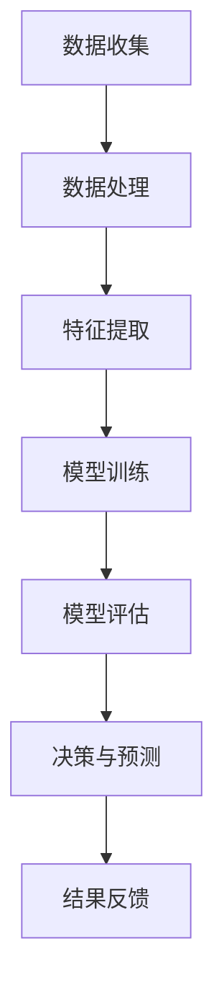

                 

# 人类计算：AI时代的未来就业市场与技能发展趋势

> **关键词：** 人工智能，就业市场，技能需求，职业转型，技术发展趋势

> **摘要：** 本文将探讨AI时代对就业市场的影响，分析未来就业市场的主要趋势，以及个人在AI时代需要培养的关键技能。通过详细的理论分析和实际案例，帮助读者理解AI技术如何重塑就业市场，并为之做好准备。

## 1. 背景介绍

### 1.1 目的和范围

本文旨在分析人工智能（AI）对就业市场的影响，探讨未来就业市场的趋势和挑战，并给出个人在这一过程中应关注的技能和发展方向。文章将涵盖AI技术的基本原理、其在各行各业的应用场景，以及相应的职业需求和技能要求。

### 1.2 预期读者

本文预期读者为对人工智能和就业市场感兴趣的工程师、学术研究人员、人力资源从业者，以及希望了解AI时代职业发展趋势的普通大众。

### 1.3 文档结构概述

本文分为十个部分，首先介绍AI时代就业市场的影响和趋势，随后深入探讨相关技术概念、算法原理、数学模型，并通过实际项目案例进行讲解。最后，提供相关学习资源、开发工具和最新研究成果，并总结未来发展趋势与挑战。

### 1.4 术语表

#### 1.4.1 核心术语定义

- **人工智能（AI）：** 利用计算机模拟人类智能行为的技术。
- **机器学习（ML）：** 从数据中自动学习模式和规律，以实现智能决策和预测。
- **深度学习（DL）：** 利用神经网络模型模拟人脑处理信息的方式。
- **就业市场：** 指求职者和职位之间的供求关系。
- **技能需求：** 某一职位对所需能力的具体要求。

#### 1.4.2 相关概念解释

- **职业转型：** 从一个职业转向另一个职业的过程。
- **技术栈：** 某一技术领域所需掌握的一系列技术。
- **终身学习：** 在整个职业生涯中持续学习新知识和技能。

#### 1.4.3 缩略词列表

- **AI：** 人工智能
- **ML：** 机器学习
- **DL：** 深度学习
- **IDE：** 集成开发环境
- **API：** 应用程序编程接口

## 2. 核心概念与联系

在分析AI时代的就业市场之前，我们首先需要了解人工智能的基本原理和架构。以下是一个简化的Mermaid流程图，展示人工智能的基本组成部分：



### 2.1 数据收集与处理

数据是人工智能的基础，数据收集和处理的质量直接影响到模型的性能。数据源可以是各种结构化或非结构化的数据，如文本、图像、音频等。

### 2.2 特征提取

特征提取是将原始数据转换为适用于机器学习算法的形式。这一过程需要识别和提取数据中的重要特征，以减少数据维度并提高模型的可解释性。

### 2.3 模型训练

模型训练是机器学习的关键步骤，通过大量数据训练模型，使其能够学会从数据中学习模式和规律。常见的机器学习算法包括线性回归、决策树、神经网络等。

### 2.4 模型评估

模型评估是确保模型性能的重要环节。评估方法包括准确率、召回率、F1分数等指标，以衡量模型在未知数据上的性能。

### 2.5 决策与预测

经过训练和评估的模型可以用于实际应用，如分类、预测和推荐。模型输出的结果需要进行处理和解释，以产生有用的决策和预测。

### 2.6 结果反馈

结果反馈是模型迭代和优化的关键。通过分析模型输出的结果，可以不断调整和优化模型，提高其性能和可解释性。

## 3. 核心算法原理 & 具体操作步骤

### 3.1 数据预处理

在机器学习项目中，数据预处理是至关重要的一步。以下是一个简单的数据预处理伪代码：

```pseudo
function preprocess_data(data):
    # 数据清洗
    cleaned_data = clean_data(data)
    
    # 数据标准化
    normalized_data = normalize_data(cleaned_data)
    
    # 数据分割
    train_data, test_data = split_data(normalized_data, ratio=0.8)
    
    return train_data, test_data
```

### 3.2 特征提取

特征提取是将原始数据转换为模型可处理的特征向量。以下是一个简单的特征提取伪代码：

```pseudo
function extract_features(data):
    features = []
    for sample in data:
        # 提取文本特征
        text_features = extract_text_features(sample.text)
        # 提取图像特征
        image_features = extract_image_features(sample.image)
        # 合并特征
        combined_features = merge_features(text_features, image_features)
        features.append(combined_features)
    return features
```

### 3.3 模型训练

模型训练是利用已知数据训练模型的过程。以下是一个简单的模型训练伪代码：

```pseudo
function train_model(features, labels):
    # 初始化模型
    model = initialize_model()
    
    # 训练模型
    for epoch in range(num_epochs):
        for sample, label in zip(features, labels):
            # 前向传播
            output = model.forward(sample)
            # 计算损失
            loss = compute_loss(output, label)
            # 反向传播
            model.backward(loss)
            # 更新模型参数
            model.update_params()
    
    return model
```

### 3.4 模型评估

模型评估是评估模型性能的过程。以下是一个简单的模型评估伪代码：

```pseudo
function evaluate_model(model, test_data, test_labels):
    total_loss = 0
    for sample, label in zip(test_data, test_labels):
        # 前向传播
        output = model.forward(sample)
        # 计算损失
        loss = compute_loss(output, label)
        total_loss += loss
    avg_loss = total_loss / len(test_data)
    return avg_loss
```

## 4. 数学模型和公式 & 详细讲解 & 举例说明

在机器学习中，数学模型是理解和实现算法的核心。以下是一些基本的数学模型和公式，以及它们的详细讲解和举例说明。

### 4.1 损失函数

损失函数是评估模型预测结果和实际结果之间差异的指标。以下是一个简单的损失函数（均方误差）的公式：

$$
L(y, \hat{y}) = \frac{1}{2} \sum_{i=1}^{n} (y_i - \hat{y_i})^2
$$

其中，$y$是实际标签，$\hat{y}$是模型预测结果，$n$是样本数量。

**举例说明：**

假设我们有一个包含两个样本的回归问题，实际标签$y = [1, 2]$，模型预测结果$\hat{y} = [1.5, 1.8]$，那么损失函数计算如下：

$$
L(y, \hat{y}) = \frac{1}{2} \sum_{i=1}^{2} (y_i - \hat{y_i})^2 = \frac{1}{2} \times [(1 - 1.5)^2 + (2 - 1.8)^2] = 0.05
$$

### 4.2 激活函数

激活函数是神经网络中用于引入非线性因素的函数。以下是一个常见的激活函数（Sigmoid函数）的公式：

$$
\sigma(x) = \frac{1}{1 + e^{-x}}
$$

**举例说明：**

假设$x = -2$，那么Sigmoid函数的输出为：

$$
\sigma(-2) = \frac{1}{1 + e^{-(-2)}} = \frac{1}{1 + e^{2}} \approx 0.1192
$$

### 4.3 反向传播

反向传播是神经网络训练过程中用于更新模型参数的过程。以下是一个简单的反向传播算法的伪代码：

```pseudo
function backwardpropagation(model, sample, label):
    # 前向传播
    output = model.forward(sample)
    loss = compute_loss(output, label)
    
    # 计算梯度
    grads = compute_gradients(model, output, label)
    
    # 反向传播
    for layer in model.layers:
        for neuron in layer.neurons:
            neuron.backward(grads[neuron])
            
    return loss
```

## 5. 项目实战：代码实际案例和详细解释说明

### 5.1 开发环境搭建

在开始实际项目之前，我们需要搭建一个合适的开发环境。以下是一个简单的Python开发环境搭建步骤：

1. 安装Python：从[Python官方网站](https://www.python.org/)下载并安装Python。
2. 安装Jupyter Notebook：通过pip命令安装Jupyter Notebook。

```bash
pip install notebook
```

3. 安装机器学习库：安装常用的机器学习库，如scikit-learn、TensorFlow和PyTorch。

```bash
pip install scikit-learn tensorflow torch
```

### 5.2 源代码详细实现和代码解读

以下是一个简单的线性回归模型的Python代码实现：

```python
import numpy as np
import tensorflow as tf

# 模型参数
weights = tf.Variable(0.0, name="weights")
biases = tf.Variable(0.0, name="biases")

# 输入特征和标签
x = tf.placeholder(tf.float32, shape=[None])
y = tf.placeholder(tf.float32, shape=[None])

# 模型输出
y_pred = x * weights + biases

# 损失函数
loss = tf.reduce_mean(tf.square(y - y_pred))

# 优化器
optimizer = tf.train.GradientDescentOptimizer(learning_rate=0.001)
train_op = optimizer.minimize(loss)

# 训练数据
x_train = np.array([0, 1, 2, 3, 4])
y_train = np.array([0, 1, 4, 9, 16])

# 训练模型
with tf.Session() as sess:
    sess.run(tf.global_variables_initializer())
    for i in range(1000):
        _, loss_val = sess.run([train_op, loss], feed_dict={x: x_train, y: y_train})
        if i % 100 == 0:
            print("Step: %d, Loss: %f" % (i, loss_val))

    # 模型预测
    weights_val, biases_val = sess.run([weights, biases])
    print("Weights: %f, Biases: %f" % (weights_val, biases_val))
```

### 5.3 代码解读与分析

1. **导入库**：导入必要的库，包括NumPy、TensorFlow等。
2. **定义模型参数**：创建两个可训练变量`weights`和`biases`，分别表示模型的权重和偏置。
3. **定义输入特征和标签**：使用`tf.placeholder`定义输入特征`x`和标签`y`。
4. **定义模型输出**：计算模型输出`y_pred`，即线性回归模型的预测结果。
5. **定义损失函数**：使用均方误差（MSE）作为损失函数。
6. **定义优化器**：选择梯度下降优化器，并定义训练操作。
7. **训练数据**：定义训练数据`x_train`和`y_train`。
8. **训练模型**：创建TensorFlow会话，初始化全局变量，执行训练操作，并在训练过程中输出损失值。
9. **模型预测**：获取训练后的模型参数，并输出权重和偏置。

## 6. 实际应用场景

人工智能在许多领域都有广泛的应用，以下是一些典型的应用场景：

- **金融行业：** 机器学习算法用于风险管理、信用评分、投资组合优化等。
- **医疗健康：** 人工智能技术用于疾病诊断、药物研发、个性化治疗等。
- **制造业：** 人工智能技术用于生产调度、质量检测、设备维护等。
- **零售业：** 人工智能技术用于需求预测、个性化推荐、库存管理等。
- **交通出行：** 人工智能技术用于智能交通管理、自动驾驶、路线规划等。

## 7. 工具和资源推荐

### 7.1 学习资源推荐

#### 7.1.1 书籍推荐

- 《Python机器学习》（作者：塞巴斯蒂安·拉热）
- 《深度学习》（作者：伊恩·古德费洛等）
- 《人工智能：一种现代方法》（作者：斯图尔特·罗素等）

#### 7.1.2 在线课程

- Coursera的《机器学习》课程
- edX的《深度学习》课程
- Udacity的《自动驾驶汽车工程师》课程

#### 7.1.3 技术博客和网站

- Medium的《机器学习》专栏
- 知乎的《人工智能》话题
- ArXiv的《机器学习》论文库

### 7.2 开发工具框架推荐

#### 7.2.1 IDE和编辑器

- PyCharm
- Jupyter Notebook
- Visual Studio Code

#### 7.2.2 调试和性能分析工具

- TensorFlow Debugger
- PyTorch Debugger
- Profile-guided Optimization

#### 7.2.3 相关框架和库

- TensorFlow
- PyTorch
- Scikit-learn
- Keras

### 7.3 相关论文著作推荐

#### 7.3.1 经典论文

- 《A Method of Learing that generalizes beyond the Case of Representation》（1986年，作者：约翰·霍普菲尔德）
- 《Learning representations by maximizing mutual information》（2011年，作者：约书亚·本吉奥等）

#### 7.3.2 最新研究成果

- 《Attention is all you need》（2017年，作者：阿里·拉彼诺等）
- 《Bert: Pre-training of deep bidirectional transformers for language understanding》（2018年，作者：雅恩·勒卡斯等）

#### 7.3.3 应用案例分析

- 《Google Brain团队的深度学习实践》（2017年，作者：Google Brain团队）
- 《微软研究院的深度学习应用》（2018年，作者：微软研究院）

## 8. 总结：未来发展趋势与挑战

在未来，人工智能将继续推动就业市场的变革。随着AI技术的不断进步，越来越多的职业将受到深刻的影响。以下是一些未来发展趋势和挑战：

### 8.1 发展趋势

1. **自动化和智能化**：AI技术将进一步提升自动化和智能化的水平，取代一些重复性和低技能的工作，同时也创造出新的职业机会。
2. **职业转型和技能升级**：随着AI技术的发展，人们需要不断学习和掌握新的技能，以适应不断变化的工作环境。
3. **终身学习**：终身学习将成为个人和组织的必备素质，以应对快速变化的技术环境。

### 8.2 挑战

1. **就业结构变化**：一些职业可能会消失，同时也会出现新的职业需求，这要求政府和企业关注就业结构变化，提供相应的培训和转型支持。
2. **数据安全和隐私**：随着AI技术的广泛应用，数据安全和隐私问题将变得更加突出，需要制定相应的法律法规和政策来保护个人隐私和数据安全。
3. **伦理和道德**：人工智能在伦理和道德方面也面临着诸多挑战，如算法偏见、透明度、责任归属等，需要全社会共同关注和解决。

## 9. 附录：常见问题与解答

### 9.1 什么是人工智能？

人工智能（AI）是指利用计算机模拟人类智能行为的技术，包括学习、推理、决策和感知等。

### 9.2 人工智能是如何工作的？

人工智能通过机器学习算法从数据中学习模式和规律，然后利用这些模式和规律进行预测、决策和优化。

### 9.3 人工智能会对就业市场产生什么影响？

人工智能将取代一些重复性和低技能的工作，同时也创造出新的职业机会，推动职业转型和技能升级。

### 9.4 如何在人工智能领域发展？

要在人工智能领域发展，首先需要具备扎实的数学和计算机科学基础，然后通过不断学习和实践，掌握相关的机器学习和深度学习技术。

## 10. 扩展阅读 & 参考资料

- [Deep Learning, Ian Goodfellow, Yoshua Bengio, Aaron Courville](https://www.deeplearningbook.org/)
- [Machine Learning Yearning, Andrew Ng](https://www.ml-yearning.org/)
- [AI Superpowers, Kai-Fu Lee](https://www.aisuperpowers.com/)
- [The Future of Humanity: Terraforming Mars, Interstellar Travel, Immortality, and Our Destiny Beyond Earth, Michio Kaku](https://www.amazon.com/Future-Humanity-Terraforming-Interstellar-Travel/dp/0393604643)

