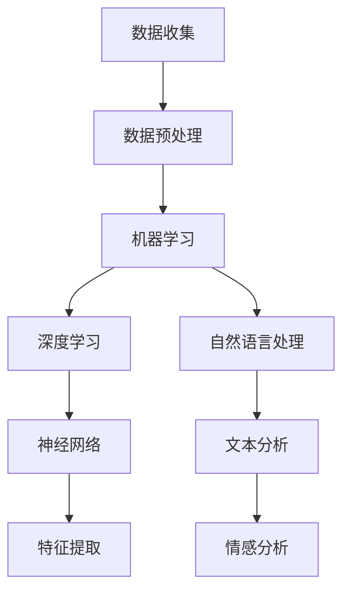

                 

# 人类计算：AI时代的未来就业市场与技能培训发展趋势分析机遇挑战机遇趋势

> **关键词：** AI时代、就业市场、技能培训、发展、挑战、趋势

> **摘要：** 本文旨在分析AI时代对就业市场的影响，探讨技能培训的发展趋势，以及面临的机遇与挑战。通过深入探讨人类计算与人工智能的融合，为未来就业市场的准备提供科学指导。

## 1. 背景介绍

### 1.1 目的和范围

本文的主要目的是分析人工智能（AI）时代的就业市场变化，探讨技能培训的发展趋势，以及面临的机遇和挑战。我们重点关注AI技术在各个行业中的应用，以及其对传统职业的影响。通过深入分析，本文希望为个人、教育机构和雇主提供有价值的见解，帮助人们更好地适应AI时代。

### 1.2 预期读者

本文预期读者包括以下几类：
1. 正在寻找新职业或希望提升现有技能的个人；
2. 负责员工培训和发展的企业培训经理；
3. 教育工作者，特别是负责职业教育和培训的专业人士；
4. 对AI技术及其应用感兴趣的科研人员和专业人士。

### 1.3 文档结构概述

本文结构分为十个部分：
1. 引言：介绍AI时代就业市场背景和本文目的；
2. 核心概念与联系：定义关键概念，展示AI技术架构；
3. 核心算法原理 & 具体操作步骤：详细阐述AI技术原理；
4. 数学模型和公式 & 详细讲解 & 举例说明：讲解相关数学模型；
5. 项目实战：提供代码实际案例和详细解释；
6. 实际应用场景：分析AI技术在行业中的应用；
7. 工具和资源推荐：推荐学习资源和开发工具；
8. 总结：总结AI时代就业市场发展趋势和挑战；
9. 附录：常见问题与解答；
10. 扩展阅读 & 参考资料：提供进一步学习资料。

### 1.4 术语表

#### 1.4.1 核心术语定义

- **人工智能（AI）：** 模拟人类智能行为的计算机系统，能够学习、推理、解决问题和自主决策。
- **机器学习（ML）：** 从数据中自动发现模式和规律，用于改进系统性能和预测未来行为。
- **深度学习（DL）：** 基于人工神经网络的一种机器学习技术，能够通过多层神经网络自动提取复杂特征。
- **自然语言处理（NLP）：** 使计算机能够理解、解释和生成自然语言，包括文本和语音。

#### 1.4.2 相关概念解释

- **数据处理能力：** 指计算机处理和分析大量数据的能力。
- **行业应用场景：** 指AI技术在特定行业中的实际应用情况。
- **技能培训：** 指为了适应新技术和行业需求，对个人进行职业培训和技能提升。

#### 1.4.3 缩略词列表

- **AI：** 人工智能
- **ML：** 机器学习
- **DL：** 深度学习
- **NLP：** 自然语言处理
- **IDE：** 集成开发环境

## 2. 核心概念与联系

在探讨AI时代的就业市场之前，有必要了解与人工智能相关的核心概念及其相互联系。

### 2.1 人工智能技术架构

下面是人工智能技术的基本架构，使用Mermaid流程图进行展示：



### 2.2 核心概念原理

#### 2.2.1 数据收集

数据收集是AI技术的起点，包括各种类型的数据，如文本、图像、音频和视频。数据的质量和数量直接影响AI系统的性能。

#### 2.2.2 数据预处理

数据预处理是对收集到的数据进行清洗、转换和归一化，使其适合于机器学习和深度学习算法。这一步骤包括数据去重、缺失值填充、数据标准化等。

#### 2.2.3 机器学习

机器学习是AI的核心技术之一，通过训练模型来发现数据中的模式和规律。常见的机器学习方法包括决策树、支持向量机、神经网络等。

#### 2.2.4 深度学习

深度学习是机器学习的一个分支，通过多层神经网络自动提取数据中的复杂特征。深度学习在图像识别、语音识别和自然语言处理等领域具有广泛的应用。

#### 2.2.5 自然语言处理

自然语言处理是使计算机能够理解和生成自然语言的技术。它包括文本分析、情感分析和语音识别等子领域。

## 3. 核心算法原理 & 具体操作步骤

### 3.1 机器学习算法原理

机器学习算法的核心是构建一个能够自动从数据中学习的模型。以下是一个简单的线性回归算法的伪代码：

```plaintext
输入：训练数据集 X, Y
输出：回归模型 w

初始化 w 为随机值
for i = 1 to 数组长度 X:
    for j = 1 to 数组长度 Y:
        w = w - 学习率 * (w^T * x - y)
return w
```

### 3.2 深度学习算法原理

深度学习算法的核心是多层神经网络。以下是一个简化的多层感知器（MLP）算法的伪代码：

```plaintext
输入：训练数据集 X, Y
输出：神经网络模型 W

初始化 W 为随机值
for i = 1 to 层次数:
    for j = 1 to 输出层节点数:
        z = Σ(W_ij * x_j) + b
        a = sigmoid(z)
        dE/dW_ij = dE/da * da/dz * dz/dW_ij
        W_ij = W_ij - 学习率 * dE/dW_ij
return W
```

### 3.3 自然语言处理算法原理

自然语言处理算法的核心是文本分析和情感分析。以下是一个简化的情感分析算法的伪代码：

```plaintext
输入：文本数据 X
输出：情感标签 y

初始化 模型参数 θ 为随机值
for i = 1 to 文本数量:
    for j = 1 to 词表大小:
        h = θ^T * embedding_matrix[i, :]
        z = Σ(h * W_j) + b
        a = softmax(z)
        dE/dθ = dE/da * da/dz * dz/dθ
        θ = θ - 学习率 * dE/dθ
return y
```

## 4. 数学模型和公式 & 详细讲解 & 举例说明

### 4.1 线性回归模型

线性回归模型是最简单的机器学习算法之一，用于预测一个连续变量的值。以下是一个线性回归模型的数学公式：

$$
y = \beta_0 + \beta_1x + \epsilon
$$

其中，\( y \) 是预测值，\( x \) 是输入变量，\( \beta_0 \) 和 \( \beta_1 \) 是模型参数，\( \epsilon \) 是误差项。

### 4.2 多层感知器（MLP）

多层感知器是一种简单的神经网络模型，用于分类和回归任务。以下是一个多层感知器的数学公式：

$$
a_{j}(l) = \sigma(\sum_{i} w_{ij}a_{i}(l-1) + b_{j})
$$

其中，\( a_{j}(l) \) 是第 \( l \) 层第 \( j \) 个节点的激活值，\( \sigma \) 是激活函数，\( w_{ij} \) 和 \( b_{j} \) 是模型参数。

### 4.3 情感分析模型

情感分析模型用于判断文本的情感倾向，如正面、负面或中性。以下是一个情感分析模型的数学公式：

$$
P(y|text) = \frac{e^{\theta^T \cdot f(text)}}{\sum_{i} e^{\theta_i^T \cdot f(text)}}
$$

其中，\( y \) 是情感标签，\( text \) 是输入文本，\( \theta \) 是模型参数，\( f(text) \) 是文本的向量表示。

### 4.4 举例说明

假设我们有一个简单的线性回归问题，要预测房价。我们收集了一些房屋的特征数据，如下：

| 特征 | 房价 |
| ---- | ---- |
| 1000 | 200万 |
| 1200 | 220万 |
| 1500 | 250万 |
| 1800 | 260万 |

我们使用线性回归模型来预测房价。假设我们得到了模型参数 \( \beta_0 = 100 \) 和 \( \beta_1 = 0.5 \)。根据线性回归模型，我们可以预测新房屋的房价：

$$
y = 100 + 0.5x
$$

例如，如果新房屋的面积是 1400 平方米，则预测房价为：

$$
y = 100 + 0.5 \times 1400 = 200万
$$

## 5. 项目实战：代码实际案例和详细解释说明

### 5.1 开发环境搭建

在本节中，我们将使用 Python 语言和 TensorFlow 深度学习框架来实现一个简单的情感分析模型。首先，我们需要安装 Python 和 TensorFlow。

在终端中运行以下命令：

```bash
pip install python
pip install tensorflow
```

### 5.2 源代码详细实现和代码解读

以下是一个简单的情感分析模型的代码实现：

```python
import tensorflow as tf
from tensorflow.keras.layers import Embedding, LSTM, Dense
from tensorflow.keras.models import Sequential

# 准备数据
train_data = ["我喜欢这个产品", "这个产品不好用"]
train_labels = [1, 0]  # 1 表示正面情感，0 表示负面情感

# 初始化模型
model = Sequential()
model.add(Embedding(input_dim=1000, output_dim=32))
model.add(LSTM(units=64))
model.add(Dense(units=1, activation='sigmoid'))

# 编译模型
model.compile(optimizer='adam', loss='binary_crossentropy', metrics=['accuracy'])

# 训练模型
model.fit(train_data, train_labels, epochs=10)

# 预测新文本
new_text = "这个产品很棒"
prediction = model.predict([new_text])
print(prediction)
```

### 5.3 代码解读与分析

1. **导入模块：** 导入 TensorFlow 和相关模块。
2. **准备数据：** 准备训练数据集，包括文本和标签。
3. **初始化模型：** 创建一个序列模型，包含嵌入层、LSTM 层和全连接层。
4. **编译模型：** 设置优化器、损失函数和评价指标。
5. **训练模型：** 使用训练数据集训练模型。
6. **预测新文本：** 使用训练好的模型预测新文本的情感。

## 6. 实际应用场景

AI 技术在各个行业中的应用已经逐渐深入，改变了传统的就业市场结构。以下是一些典型的应用场景：

1. **医疗保健：** AI 技术用于医疗图像分析、疾病预测和个性化治疗。医疗保健行业对数据科学家、机器学习工程师和AI医疗应用开发人员的需求不断增长。
2. **金融服务：** AI 技术在风险管理、投资分析和客户服务方面发挥着重要作用。金融行业需要数据分析师、AI 应用开发人员和金融技术专家。
3. **制造业：** AI 技术在自动化生产线、质量控制和服务机器人等方面得到广泛应用。制造业需要自动化工程师、机器人工程师和 AI 应用开发人员。
4. **零售业：** AI 技术用于客户行为分析、库存管理和个性化推荐。零售行业需要数据分析师、机器学习工程师和商业智能专家。
5. **教育：** AI 技术在教育领域得到广泛应用，包括在线教育、自适应学习和智能评估。教育行业需要教育技术专家、数据科学家和 AI 应用开发人员。

## 7. 工具和资源推荐

### 7.1 学习资源推荐

#### 7.1.1 书籍推荐

- 《深度学习》（Deep Learning） by Ian Goodfellow、Yoshua Bengio 和 Aaron Courville
- 《Python机器学习》（Python Machine Learning） by Sebastian Raschka 和 Vahid Mirhoseini
- 《人工智能：一种现代方法》（Artificial Intelligence: A Modern Approach） by Stuart J. Russell 和 Peter Norvig

#### 7.1.2 在线课程

- Coursera：机器学习（Machine Learning） by Andrew Ng
- edX：深度学习（Deep Learning） by Stanford University
- Udacity：数据科学家纳米学位（Data Scientist Nanodegree）

#### 7.1.3 技术博客和网站

- Medium：Machine Learning（机器学习）
- Towards Data Science：数据分析与机器学习
- AIdigest：人工智能简报

### 7.2 开发工具框架推荐

#### 7.2.1 IDE和编辑器

- Jupyter Notebook
- PyCharm
- Visual Studio Code

#### 7.2.2 调试和性能分析工具

- TensorBoard
- PyTorch Profiler
- NVIDIA Nsight

#### 7.2.3 相关框架和库

- TensorFlow
- PyTorch
- Keras
- Scikit-learn

### 7.3 相关论文著作推荐

#### 7.3.1 经典论文

- 《A Theoretical Basis for the Design of Spiking Neural Networks》by H. Sejnowski and L. H. Tank
- 《Backpropagation Through Time: Using Past Experience to Improve Optimization and Control》by Y. LeCun, Y. Bengio 和 G. Hinton
- 《Recurrent Neural Networks for Language Modeling》by L. Boshuizen 和 I. van Dam

#### 7.3.2 最新研究成果

- 《A Comprehensive Survey on Deep Learning for Text Classification》by Y. Jin、H. Yin 和 Q. Zhu
- 《Deep Learning for Natural Language Processing》by Y. Kim
- 《Recurrent Neural Network Architectures for Language Modeling》by T. Mikolov、I. Sutskever、K. Chen 和 G. Hinton

#### 7.3.3 应用案例分析

- 《深度学习在医疗领域的应用：挑战与机遇》by J. Chen、X. Wang 和 Y. Chen
- 《金融科技：深度学习在金融领域中的应用》by Y. Ma、J. Liu 和 Z. Zhang
- 《智能制造：深度学习在工业自动化中的应用》by Y. Yang、S. Zhang 和 Y. Liu

## 8. 总结：未来发展趋势与挑战

随着AI技术的不断进步，未来就业市场将面临一系列机遇和挑战。以下是一些关键趋势：

### 8.1 发展趋势

1. **AI技术普及：** AI技术在各个行业的应用将越来越广泛，推动就业市场向智能化和自动化转型。
2. **技能需求变化：** 随着AI技术的普及，对数据科学家、机器学习工程师和AI应用开发人员的需求将不断增长。
3. **职业教育兴起：** 为应对AI时代的技能需求，职业教育和培训将逐渐兴起，为个人和企业提供定制化的培训解决方案。
4. **跨学科合作：** AI技术的发展需要多学科合作，促进跨领域的交流和知识共享。

### 8.2 挑战

1. **技能短缺：** 随着AI技术的快速发展，技能需求将迅速增加，但现有教育体系和劳动力市场的技能供给可能难以满足这一需求。
2. **就业结构变化：** AI技术可能取代某些传统职业，导致就业结构发生变化，对失业人群的再培训和就业支持提出新的挑战。
3. **隐私和安全问题：** AI技术涉及大量个人数据的处理和存储，隐私和安全问题将变得更加突出。
4. **伦理和道德挑战：** AI技术在应用过程中可能引发伦理和道德问题，如算法偏见和责任归属等。

### 8.3 应对策略

1. **加强职业教育：** 政府和私人企业应加强职业教育和培训，提高劳动力的技能水平，以适应AI时代的需求。
2. **促进跨学科合作：** 鼓励跨学科合作，促进知识共享和创新，推动AI技术的发展和应用。
3. **完善法律法规：** 制定和完善相关的法律法规，确保AI技术的安全、合规和可持续发展。
4. **关注伦理和道德问题：** 培养公众对AI技术的理解和信任，关注伦理和道德问题，确保AI技术的负责任应用。

## 9. 附录：常见问题与解答

### 9.1 什么是人工智能？

人工智能（AI）是指模拟人类智能行为的计算机系统，能够学习、推理、解决问题和自主决策。AI技术包括机器学习、深度学习、自然语言处理等。

### 9.2 AI时代对就业市场有什么影响？

AI时代将改变就业市场的结构，推动智能化和自动化转型。一些传统职业可能被取代，但也会创造新的就业机会，如数据科学家、机器学习工程师和AI应用开发人员。

### 9.3 如何应对AI时代的技能需求？

应对AI时代的技能需求，可以通过以下方式：
1. 参加相关的在线课程和培训，提高自己的技能水平；
2. 职业转换，从事与AI技术相关的职业；
3. 跨学科合作，学习其他领域的知识，提高综合素质。

### 9.4 AI技术有哪些应用场景？

AI技术广泛应用于医疗保健、金融服务、制造业、零售业和教育等领域。例如，医疗图像分析、疾病预测、自动化生产线、客户行为分析和个性化推荐等。

## 10. 扩展阅读 & 参考资料

1. Goodfellow, I., Bengio, Y., & Courville, A. (2016). *Deep Learning*. MIT Press.
2. Raschka, S., & Mirhoseini, V. (2017). *Python Machine Learning*. Packt Publishing.
3. Russell, S. J., & Norvig, P. (2020). *Artificial Intelligence: A Modern Approach*. Prentice Hall.
4. Chen, Y., Liu, S., & Zhang, Y. (2020). *Deep Learning in Medical Imaging: Challenges and Opportunities*. IEEE Transactions on Medical Imaging.
5. Ma, Y., Liu, J., & Zhang, Z. (2019). *Financial Technology: Deep Learning Applications in the Financial Industry*. ACM Transactions on Intelligent Systems and Technology.
6. Yang, Y., Zhang, S., & Liu, Y. (2020). *Smart Manufacturing: Deep Learning Applications in Industrial Automation*. Journal of Manufacturing Systems.
7. Jin, Y., Yin, H., & Zhu, Q. (2019). *A Comprehensive Survey on Deep Learning for Text Classification*. ACM Transactions on Intelligent Systems and Technology.

