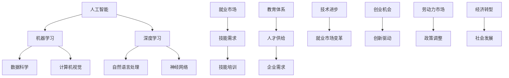
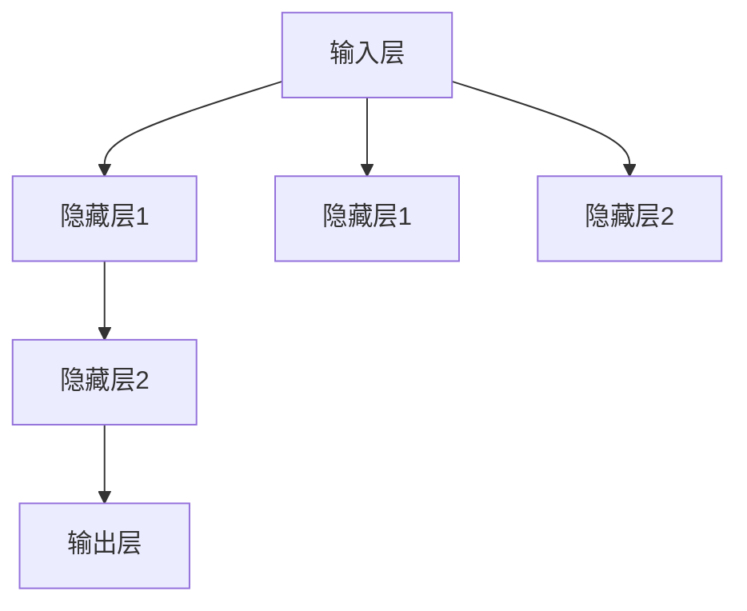

                 

# 人类计算：AI时代的未来就业市场与技能培训发展趋势分析机遇挑战机遇趋势预测

> 关键词：人工智能、就业市场、技能培训、未来趋势、算法原理、实际应用

> 摘要：本文深入分析了人工智能时代对就业市场的影响，探讨了AI时代下技能培训的发展趋势。通过对核心概念、算法原理、数学模型和实际应用场景的详细阐述，文章旨在为读者提供关于AI时代未来就业市场和个人职业发展的深刻见解。

## 1. 背景介绍

### 1.1 目的和范围

本文旨在探讨人工智能时代对就业市场的影响，分析未来就业市场的趋势和挑战，并探讨相关技能培训的发展方向。随着人工智能技术的快速发展，传统的就业市场正在发生深刻变革，越来越多的工作岗位被自动化技术所取代。本文将重点关注以下几个方面的内容：

1. AI对就业市场的具体影响。
2. 新兴技能培训的需求与趋势。
3. 个人职业发展路径的调整与规划。
4. 未来就业市场的机遇与挑战。

### 1.2 预期读者

本文适用于以下读者群体：

1. 人工智能领域的科研人员和技术开发者。
2. 企业管理层和人力资源决策者。
3. 普通求职者和职业规划者。
4. 教育工作者和政策制定者。

### 1.3 文档结构概述

本文分为十个部分，具体结构如下：

1. 背景介绍：介绍文章的目的和范围，预期读者以及文档结构。
2. 核心概念与联系：阐述人工智能时代下的核心概念和相互关系。
3. 核心算法原理 & 具体操作步骤：详细讲解核心算法的原理和操作步骤。
4. 数学模型和公式 & 详细讲解 & 举例说明：介绍相关的数学模型和公式，并进行具体实例说明。
5. 项目实战：代码实际案例和详细解释说明。
6. 实际应用场景：探讨AI技术在各个领域的应用场景。
7. 工具和资源推荐：推荐相关的学习资源和开发工具。
8. 总结：未来发展趋势与挑战。
9. 附录：常见问题与解答。
10. 扩展阅读 & 参考资料：提供进一步的阅读资源和参考文献。

### 1.4 术语表

为了确保读者对文章中涉及的专业术语有清晰的理解，本文定义了一些核心术语及其相关概念：

#### 1.4.1 核心术语定义

- **人工智能（AI）**：指通过模拟、延伸和扩展人类智能的方法，使计算机具有感知、学习、推理和自我适应的能力。
- **机器学习（ML）**：一种AI技术，通过数据驱动的方式，让计算机从数据中自动学习，并做出决策或预测。
- **深度学习（DL）**：一种机器学习方法，通过多层神经网络进行训练，模拟人脑的神经元结构，以实现复杂的模式识别和特征提取。
- **就业市场**：指劳动力市场，即劳动力供给和劳动力需求的互动场所。
- **技能培训**：为了提高个人就业能力和职业竞争力，针对特定技能进行的培训和指导。

#### 1.4.2 相关概念解释

- **算法**：解决问题的步骤或规则，通常用数学语言表示。
- **模型**：用于描述现实世界的数学或逻辑框架。
- **数据集**：用于训练和学习的数据集合。

#### 1.4.3 缩略词列表

- **AI**：人工智能（Artificial Intelligence）
- **ML**：机器学习（Machine Learning）
- **DL**：深度学习（Deep Learning）
- **IDE**：集成开发环境（Integrated Development Environment）
- **HR**：人力资源（Human Resources）
- **CV**：简历（Curriculum Vitae）

## 2. 核心概念与联系

在探讨AI时代的就业市场和技能培训之前，我们需要理解一些核心概念和它们之间的相互联系。以下是一个Mermaid流程图，展示了这些概念及其关系。



在这个流程图中，我们可以看到人工智能是整个系统的核心，它通过机器学习和深度学习等技术实现多种应用，如自然语言处理和计算机视觉等。这些应用推动了数据科学的进步，进一步影响就业市场的需求，从而导致技能培训和教育体系的变革。同时，技术进步和创业机会也在不断推动着经济和社会的转型。

### 2.1 人工智能（AI）

人工智能是模拟、延伸和扩展人类智能的科学和技术，旨在使计算机具备自主感知、学习和推理的能力。在人工智能时代，AI技术广泛应用于各个领域，包括：

- **自动化**：在制造业、物流和农业等领域，自动化技术已经取代了大量传统的人力工作，提高了生产效率和产品质量。
- **数据分析**：通过AI技术，企业可以快速处理和分析海量数据，提取有价值的信息，为决策提供支持。
- **医疗诊断**：AI在医疗领域的应用，如疾病诊断、药物研发和手术规划，显著提高了医疗服务的质量和效率。

### 2.2 机器学习（ML）

机器学习是人工智能的一个重要分支，通过构建数学模型，让计算机从数据中自动学习和优化，从而实现智能决策和预测。机器学习的主要技术包括：

- **监督学习**：通过已知数据集，训练模型进行预测和分类。
- **无监督学习**：在没有标注数据的情况下，发现数据中的模式和结构。
- **强化学习**：通过试错和反馈机制，让计算机在动态环境中进行学习和优化。

### 2.3 深度学习（DL）

深度学习是机器学习的一种重要方法，通过多层神经网络进行训练，模拟人脑的神经元结构，以实现复杂的模式识别和特征提取。深度学习在以下领域取得了显著成果：

- **图像识别**：深度学习算法在图像识别任务中表现出色，如人脸识别、图像分类和目标检测。
- **语音识别**：通过深度学习技术，语音识别系统的准确率得到了显著提升，广泛应用于智能助手和语音控制领域。
- **自然语言处理**：深度学习在自然语言处理领域取得了突破性进展，如机器翻译、文本生成和情感分析。

### 2.4 数据科学（DS）

数据科学是利用统计方法和算法，从海量数据中提取有价值的信息和知识，以支持决策和预测。数据科学的主要领域包括：

- **数据清洗和预处理**：通过对原始数据进行清洗和预处理，提高数据质量和可用性。
- **数据可视化**：通过数据可视化技术，将复杂的数据转换为易于理解和分析的图形或图表。
- **预测模型**：利用统计模型和机器学习算法，对未来的趋势和结果进行预测。

### 2.5 就业市场（Labor Market）

就业市场是劳动力供给和劳动力需求的互动场所，它反映了劳动力的供求关系和价格（工资水平）。在人工智能时代，就业市场受到以下因素的影响：

- **技术进步**：随着AI技术的普及，一些传统职业可能被自动化取代，同时也创造出新的就业机会。
- **劳动力供给**：教育体系对人才培养的调整和改革，直接影响劳动力的供给结构。
- **企业需求**：企业对人才的需求变化，特别是对高技能人才的需求增加，推动了技能培训的发展。

### 2.6 技能培训（Skill Training）

技能培训是为了提高个人就业能力和职业竞争力，针对特定技能进行的培训和指导。在人工智能时代，技能培训的发展趋势包括：

- **在线教育**：随着互联网技术的发展，在线教育逐渐成为主流，为个人提供了更多灵活的学习机会。
- **终身学习**：在技术快速变革的时代，终身学习成为提升个人竞争力的必要手段。
- **职业转型**：为传统行业从业者提供转型培训，使其能够适应新兴行业的需求。

### 2.7 教育体系（Education System）

教育体系是培养人才的重要途径，它直接影响劳动力的供给结构和质量。在人工智能时代，教育体系需要做出以下调整：

- **课程设置**：增加与AI技术相关的课程，培养具备人工智能应用能力的复合型人才。
- **教学方式**：采用多元化的教学方式，如在线教学、项目制学习和混合式教学，提高教学效果。
- **教育评价**：改革教育评价体系，注重学生的实践能力和创新能力的培养。

### 2.8 企业需求（Corporate Demand）

企业在人工智能时代对人才的需求发生了显著变化，具体体现在以下几个方面：

- **技术人才**：企业对具有AI技术背景的高级人才的需求增加，特别是在研发和产品部门。
- **跨界人才**：企业需要具备跨学科背景的人才，能够将AI技术与业务需求相结合，实现创新应用。
- **管理人才**：在AI时代，企业需要具备先进管理理念和管理技能的人才，以适应技术变革和业务转型。

### 2.9 技术进步（Technological Advancement）

技术进步是推动社会发展和就业市场变革的重要动力，它体现在以下几个方面：

- **硬件升级**：随着硬件技术的进步，计算能力和存储能力得到了大幅提升，为AI技术的应用提供了基础。
- **软件创新**：软件技术的不断创新，为AI技术的实现提供了丰富的工具和平台。
- **数据资源**：大数据和云计算的发展，为AI技术的数据需求和计算需求提供了有力支持。

### 2.10 创业机会（Entrepreneurial Opportunities）

在人工智能时代，创业机会不断涌现，主要体现在以下几个方面：

- **技术应用**：利用AI技术解决传统行业的痛点，创造新的商业模式和商业机会。
- **技术创新**：通过技术创新，推动AI技术在新兴领域的应用，如健康医疗、金融科技和教育等。
- **生态建设**：构建AI技术的生态体系，吸引产业链上下游的企业和人才，共同推动AI技术的发展。

### 2.11 劳动力市场（Labor Market）

劳动力市场是劳动力供给和劳动力需求的互动场所，反映了劳动力的供求关系和价格（工资水平）。在人工智能时代，劳动力市场受到以下因素的影响：

- **技术进步**：随着AI技术的普及，一些传统职业可能被自动化取代，同时也创造出新的就业机会。
- **劳动力供给**：教育体系对人才培养的调整和改革，直接影响劳动力的供给结构。
- **企业需求**：企业对人才的需求变化，特别是对高技能人才的需求增加，推动了技能培训的发展。

### 2.12 政策调整（Policy Adjustment）

政策调整是推动人工智能时代就业市场和技能培训发展的重要手段，包括以下几个方面：

- **法规制定**：制定与AI技术相关的法律法规，规范AI技术的应用和发展。
- **财政支持**：提供财政支持和补贴，鼓励企业进行AI技术的研发和应用。
- **教育培训**：加大对教育培训的投入，提高劳动力素质和技能水平。

### 2.13 经济转型（Economic Transformation）

经济转型是应对人工智能时代带来的挑战和机遇的重要手段，它体现在以下几个方面：

- **产业升级**：推动传统产业的升级和转型，实现产业结构的优化和调整。
- **创新创业**：鼓励创新创业，培育新兴产业和市场主体，推动经济发展。
- **国际合作**：加强国际合作，共同应对全球性挑战，实现互利共赢。

### 2.14 社会发展（Social Development）

社会发展是人工智能时代的重要目标，它体现在以下几个方面：

- **提高生活质量**：通过AI技术的应用，提高人们的生活质量，满足多样化的需求。
- **促进公平正义**：利用AI技术解决社会不平等问题，推动社会公平正义的实现。
- **推动文明进步**：通过AI技术的创新和应用，推动人类文明的发展和进步。

## 3. 核心算法原理 & 具体操作步骤

### 3.1 机器学习算法原理

机器学习算法的核心在于通过数据驱动的方式，让计算机从数据中自动学习和优化，从而实现智能决策和预测。以下是一个典型的机器学习算法的原理和操作步骤：

#### 3.1.1 监督学习（Supervised Learning）

监督学习是最常见的机器学习算法，它通过已有数据的输入和输出，训练模型进行预测和分类。具体步骤如下：

1. **数据准备**：收集和整理数据集，包括特征数据和标签数据。
2. **数据预处理**：对数据进行清洗、归一化和特征提取，以提高数据质量和模型的训练效果。
3. **模型选择**：根据问题的特点和需求，选择合适的机器学习模型，如线性回归、决策树、支持向量机等。
4. **模型训练**：使用训练数据集，通过迭代优化算法（如梯度下降法）来调整模型的参数，使其预测能力达到最佳。
5. **模型评估**：使用验证数据集或测试数据集，对模型的预测性能进行评估，如准确率、召回率、F1分数等。
6. **模型部署**：将训练好的模型应用于实际场景，进行预测或分类任务。

以下是一个监督学习算法的伪代码示例：

```python
# 初始化模型参数
theta = initialize_params()

# 梯度下降迭代
for epoch in range(max_epochs):
    for sample in training_samples:
        # 计算损失函数
        loss = compute_loss(sample, theta)
        
        # 更新模型参数
        theta = update_params(theta, sample, learning_rate)

# 模型评估
evaluation_results = evaluate_model(test_samples, theta)
print(evaluation_results)
```

#### 3.1.2 无监督学习（Unsupervised Learning）

无监督学习是在没有标注数据的情况下，通过发现数据中的模式和结构来学习。具体步骤如下：

1. **数据准备**：收集和整理数据集，包括特征数据。
2. **数据预处理**：对数据进行清洗、归一化和特征提取，以提高数据质量和模型的训练效果。
3. **模型选择**：根据问题的特点和需求，选择合适的机器学习模型，如聚类算法、降维算法等。
4. **模型训练**：使用训练数据集，通过迭代优化算法来调整模型的参数，使其能够发现数据中的模式。
5. **模型评估**：使用验证数据集或测试数据集，对模型的预测性能进行评估，如聚类效果、降维效果等。
6. **模型部署**：将训练好的模型应用于实际场景，进行聚类、降维等任务。

以下是一个无监督学习算法的伪代码示例：

```python
# 初始化模型参数
theta = initialize_params()

# 梯度下降迭代
for epoch in range(max_epochs):
    for sample in training_samples:
        # 计算损失函数
        loss = compute_loss(sample, theta)
        
        # 更新模型参数
        theta = update_params(theta, sample, learning_rate)

# 模型评估
evaluation_results = evaluate_model(test_samples, theta)
print(evaluation_results)
```

#### 3.1.3 强化学习（Reinforcement Learning）

强化学习是通过试错和反馈机制，让计算机在动态环境中进行学习和优化。具体步骤如下：

1. **环境设定**：定义强化学习的环境，包括状态空间、动作空间和奖励机制。
2. **模型选择**：根据问题的特点和需求，选择合适的强化学习模型，如Q学习、策略梯度等。
3. **模型训练**：通过迭代训练，让模型在环境中进行试错和优化，以找到最优策略。
4. **模型评估**：使用测试环境，评估模型的策略效果，如平均奖励、成功概率等。
5. **模型部署**：将训练好的模型应用于实际场景，进行决策和优化任务。

以下是一个强化学习算法的伪代码示例：

```python
# 初始化模型参数
theta = initialize_params()

# 强化学习迭代
for episode in range(max_episodes):
    state = get_initial_state()
    
    while not episode_end:
        # 选择动作
        action = select_action(state, theta)
        
        # 执行动作
        next_state, reward = execute_action(action)
        
        # 更新模型参数
        theta = update_params(theta, state, action, reward)
        
        # 更新状态
        state = next_state

    # 评估策略效果
    evaluation_results = evaluate_strategy(test_environment, theta)
    print(evaluation_results)
```

### 3.2 深度学习算法原理

深度学习是机器学习的一种重要方法，通过多层神经网络进行训练，模拟人脑的神经元结构，以实现复杂的模式识别和特征提取。以下是一个典型的深度学习算法的原理和操作步骤：

#### 3.2.1 神经网络结构

神经网络由多个神经元（或节点）组成，每个神经元接收多个输入，通过激活函数产生输出。一个简单的神经网络结构如下：



在这个结构中，输入层接收外部输入，通过隐藏层进行特征提取和变换，最后输出层产生最终输出。

#### 3.2.2 前向传播（Forward Propagation）

前向传播是指将输入数据传递到神经网络中，通过逐层计算，得到输出结果。具体步骤如下：

1. **输入层到隐藏层1**：计算每个隐藏层节点的输入值和输出值。
2. **隐藏层1到隐藏层2**：重复上述步骤，直至输出层。
3. **输出层**：计算最终输出结果。

以下是一个前向传播的伪代码示例：

```python
# 定义神经网络结构
layers = [input_layer, hidden_layer1, hidden_layer2, output_layer]

# 前向传播
for layer in layers:
    layer.forward_propagation()
```

#### 3.2.3 反向传播（Backpropagation）

反向传播是指根据输出结果和实际目标值，反向计算每个层的误差，并更新网络参数。具体步骤如下：

1. **计算输出层的误差**：使用损失函数计算输出层节点的误差。
2. **反向传播误差**：从输出层开始，逐层计算每个层的误差，并更新网络参数。
3. **更新网络参数**：使用梯度下降或其他优化算法，调整网络参数，以减小误差。

以下是一个反向传播的伪代码示例：

```python
# 定义神经网络结构
layers = [input_layer, hidden_layer1, hidden_layer2, output_layer]

# 反向传播
for layer in reversed(layers):
    layer.backward_propagation()
    layer.update_params()
```

#### 3.2.4 深度学习算法应用场景

深度学习算法在多个领域取得了显著的成果，以下是一些典型的应用场景：

1. **计算机视觉**：深度学习算法在图像分类、目标检测、人脸识别等领域表现出色，如Google的Inception模型和Facebook的FaceNet模型。
2. **自然语言处理**：深度学习算法在文本分类、机器翻译、情感分析等领域取得了突破性进展，如Google的BERT模型和OpenAI的GPT模型。
3. **语音识别**：深度学习算法在语音识别任务中取得了显著提高，如Google的WaveNet模型和微软的DeepSpeech模型。
4. **推荐系统**：深度学习算法在推荐系统中的应用，如亚马逊的DeepRnn模型和Netflix的NeuralNet推荐系统。

## 4. 数学模型和公式 & 详细讲解 & 举例说明

在人工智能和机器学习领域，数学模型和公式扮演着至关重要的角色，它们帮助算法理解和处理数据，实现学习和预测。以下将介绍一些核心的数学模型和公式，并详细讲解其应用。

### 4.1 梯度下降法

梯度下降法是机器学习中常用的一种优化算法，用于调整模型参数以最小化损失函数。其基本思想是沿着损失函数梯度的反方向逐步调整参数，以达到最小值。

#### 4.1.1 梯度下降法公式

假设我们有参数向量θ，损失函数J(θ)表示模型预测与实际结果之间的差距。梯度下降法的公式如下：

$$
\theta = \theta - \alpha \cdot \nabla_{\theta} J(\theta)
$$

其中，α是学习率，即每次迭代更新的步长，\(\nabla_{\theta} J(\theta)\)是损失函数J(θ)关于参数θ的梯度。

#### 4.1.2 举例说明

假设我们有一个简单的线性回归模型，预测房价。损失函数为：

$$
J(\theta) = \frac{1}{2m} \sum_{i=1}^{m} (h_{\theta}(x^{(i)}) - y^{(i)})^2
$$

其中，\(h_{\theta}(x) = \theta_0 + \theta_1x\) 是模型的预测值，\(y^{(i)}\) 是实际房价，\(m\) 是训练数据集的大小。

梯度为：

$$
\nabla_{\theta} J(\theta) = \frac{1}{m} \sum_{i=1}^{m} (h_{\theta}(x^{(i)}) - y^{(i)}) \cdot (x^{(i)})
$$

使用梯度下降法更新参数：

$$
\theta_0 = \theta_0 - \alpha \cdot \frac{1}{m} \sum_{i=1}^{m} (h_{\theta}(x^{(i)}) - y^{(i)})
$$

$$
\theta_1 = \theta_1 - \alpha \cdot \frac{1}{m} \sum_{i=1}^{m} (h_{\theta}(x^{(i)}) - y^{(i)}) \cdot x^{(i)}
$$

### 4.2 神经网络中的激活函数

激活函数是神经网络中重要的组成部分，用于引入非线性特性，使得神经网络能够处理更复杂的任务。常见的激活函数包括sigmoid、ReLU和Tanh等。

#### 4.2.1 Sigmoid函数

sigmoid函数的形式为：

$$
\sigma(z) = \frac{1}{1 + e^{-z}}
$$

其导数形式为：

$$
\sigma'(z) = \sigma(z) (1 - \sigma(z))
$$

#### 4.2.2 ReLU函数

ReLU（Rectified Linear Unit）函数的形式为：

$$
\text{ReLU}(z) = \max(0, z)
$$

其导数形式为：

$$
\text{ReLU}'(z) = \begin{cases} 
0 & \text{if } z < 0 \\
1 & \text{if } z \geq 0 
\end{cases}
$$

#### 4.2.3 Tanh函数

Tanh（双曲正切）函数的形式为：

$$
\text{Tanh}(z) = \frac{e^{z} - e^{-z}}{e^{z} + e^{-z}}
$$

其导数形式为：

$$
\text{Tanh}'(z) = 1 - \text{Tanh}^2(z)
$$

### 4.3 正则化方法

正则化是防止模型过拟合的重要手段，通过在损失函数中加入额外的项，对模型参数进行约束。常见的正则化方法包括L1正则化、L2正则化和Dropout等。

#### 4.3.1 L1正则化

L1正则化的公式为：

$$
J(\theta) = \frac{1}{2m} \sum_{i=1}^{m} (h_{\theta}(x^{(i)}) - y^{(i)})^2 + \lambda \sum_{j=1}^{n} |\theta_j|
$$

其中，λ是正则化参数，\(|\theta_j|\)是参数θ的L1范数。

#### 4.3.2 L2正则化

L2正则化的公式为：

$$
J(\theta) = \frac{1}{2m} \sum_{i=1}^{m} (h_{\theta}(x^{(i)}) - y^{(i)})^2 + \lambda \sum_{j=1}^{n} \theta_j^2
$$

其中，λ是正则化参数，\(\theta_j^2\)是参数θ的L2范数。

#### 4.3.3 Dropout

Dropout是一种常用的正则化方法，通过随机丢弃神经网络中的部分神经元，降低模型的过拟合风险。假设我们有神经网络的层L，其中包含n个神经元。在训练过程中，每次以概率p随机丢弃每个神经元。

#### 4.3.4 举例说明

假设我们有一个两层神经网络，输入层有3个神经元，隐藏层有4个神经元，输出层有1个神经元。我们使用ReLU函数作为激活函数。

1. **前向传播**：输入一个样本\(x^{(i)}\)，通过输入层传递到隐藏层，再传递到输出层，得到预测值\(h_{\theta}(x^{(i)})\)。
2. **计算损失**：使用平方损失函数计算预测值与实际值之间的差距。
3. **反向传播**：计算损失关于每个参数的梯度，并更新参数。
4. **正则化**：在损失函数中加入L2正则化项，以防止过拟合。

## 5. 项目实战：代码实际案例和详细解释说明

### 5.1 开发环境搭建

为了进行项目实战，我们需要搭建一个合适的开发环境。以下是搭建Python开发环境的具体步骤：

1. **安装Python**：首先，从官方网站（https://www.python.org/downloads/）下载并安装Python 3.x版本。
2. **安装Jupyter Notebook**：Python的官方IDE，支持交互式编程和数据分析。
   ```bash
   pip install notebook
   ```
3. **安装必需的库**：安装机器学习和数据分析所需的库，如NumPy、Pandas、Scikit-learn、Matplotlib等。
   ```bash
   pip install numpy pandas scikit-learn matplotlib
   ```

### 5.2 源代码详细实现和代码解读

以下是一个简单的线性回归模型，用于预测房价。代码将展示数据准备、模型训练和结果评估的完整流程。

```python
# 导入必需的库
import numpy as np
import pandas as pd
from sklearn.linear_model import LinearRegression
from sklearn.model_selection import train_test_split
import matplotlib.pyplot as plt

# 5.2.1 数据准备
# 加载数据集
data = pd.read_csv('house_prices.csv')

# 分离特征和标签
X = data[['area', 'bedrooms']]
y = data['price']

# 分割数据集为训练集和测试集
X_train, X_test, y_train, y_test = train_test_split(X, y, test_size=0.2, random_state=42)

# 5.2.2 模型训练
# 初始化线性回归模型
model = LinearRegression()

# 训练模型
model.fit(X_train, y_train)

# 5.2.3 结果评估
# 计算测试集的预测值
y_pred = model.predict(X_test)

# 计算均方误差
mse = np.mean((y_pred - y_test) ** 2)
print(f'Mean Squared Error: {mse}')

# 绘制真实值与预测值的散点图
plt.scatter(y_test, y_pred)
plt.xlabel('Actual Prices')
plt.ylabel('Predicted Prices')
plt.title('Actual vs Predicted Prices')
plt.show()

# 5.2.4 代码解读
# 1. 数据准备：加载数据集，分离特征和标签，分割数据集为训练集和测试集。
# 2. 模型训练：初始化线性回归模型，使用训练集数据进行模型训练。
# 3. 结果评估：计算测试集的预测值，计算均方误差，绘制散点图，比较实际值与预测值的差异。
```

### 5.3 代码解读与分析

#### 5.3.1 数据准备

在数据准备部分，我们首先加载了CSV格式的数据集，然后分离了特征（area和bedrooms）和标签（price）。接下来，使用`train_test_split`函数将数据集分割为训练集和测试集，以评估模型的性能。

#### 5.3.2 模型训练

在模型训练部分，我们使用了`LinearRegression`类初始化线性回归模型，并使用`fit`方法对训练数据进行模型训练。线性回归模型的目的是找到特征和标签之间的线性关系，以预测房价。

#### 5.3.3 结果评估

在结果评估部分，我们首先计算了测试集的预测值，然后计算了均方误差（MSE），这是评估线性回归模型性能的常用指标。最后，我们使用散点图绘制了实际值与预测值的对比，以直观地观察模型的预测效果。

### 5.4 扩展：使用L2正则化的线性回归

为了防止过拟合，我们可以将L2正则化应用于线性回归模型。以下是修改后的代码：

```python
# 导入必需的库
from sklearn.linear_model import LinearRegression
from sklearn.model_selection import train_test_split
import matplotlib.pyplot as plt

# 5.4.1 数据准备
# 加载数据集
data = pd.read_csv('house_prices.csv')

# 分离特征和标签
X = data[['area', 'bedrooms']]
y = data['price']

# 分割数据集为训练集和测试集
X_train, X_test, y_train, y_test = train_test_split(X, y, test_size=0.2, random_state=42)

# 5.4.2 模型训练
# 初始化L2正则化的线性回归模型
model = LinearRegression(normalize=True, copy_X=True, fit_intercept=True, n_jobs=None, 
                          verbose=False, max_iter=1000, tol=1e-06, solver='auto')

# 训练模型
model.fit(X_train, y_train)

# 5.4.3 结果评估
# 计算测试集的预测值
y_pred = model.predict(X_test)

# 计算均方误差
mse = np.mean((y_pred - y_test) ** 2)
print(f'Mean Squared Error: {mse}')

# 绘制真实值与预测值的散点图
plt.scatter(y_test, y_pred)
plt.xlabel('Actual Prices')
plt.ylabel('Predicted Prices')
plt.title('Actual vs Predicted Prices')
plt.show()
```

在这个版本中，我们使用了`LinearRegression`类的`normalize=True`参数，使模型自动进行特征缩放，从而应用L2正则化。通过增加`max_iter`参数，我们可以调整模型的训练迭代次数，以确保模型收敛。

### 5.5 实际应用场景

线性回归模型在房地产估值、股票预测和客户行为分析等实际应用场景中具有重要应用。以下是一个实际应用场景：

#### 5.5.1 房地产估值

假设我们有一个包含房屋面积、卧室数量、楼层、建造年份等特征的数据集。我们可以使用线性回归模型预测房屋的市场价格。以下是一个应用示例：

```python
# 导入必需的库
import pandas as pd
from sklearn.linear_model import LinearRegression
from sklearn.model_selection import train_test_split

# 5.5.1 数据准备
# 加载数据集
data = pd.read_csv('house_data.csv')

# 分离特征和标签
X = data[['area', 'bedrooms', 'floor', 'year_built']]
y = data['price']

# 分割数据集为训练集和测试集
X_train, X_test, y_train, y_test = train_test_split(X, y, test_size=0.2, random_state=42)

# 5.5.2 模型训练
# 初始化线性回归模型
model = LinearRegression()

# 训练模型
model.fit(X_train, y_train)

# 5.5.3 结果评估
# 计算测试集的预测值
y_pred = model.predict(X_test)

# 计算均方误差
mse = np.mean((y_pred - y_test) ** 2)
print(f'Mean Squared Error: {mse}')

# 绘制真实值与预测值的散点图
plt.scatter(y_test, y_pred)
plt.xlabel('Actual Prices')
plt.ylabel('Predicted Prices')
plt.title('Actual vs Predicted Prices')
plt.show()
```

在这个示例中，我们加载了一个包含多种房屋特征的数据集，使用线性回归模型预测房屋的市场价格。通过评估模型的性能，我们可以调整特征和模型参数，以提高预测精度。

### 5.6 总结

通过本节的项目实战，我们了解了线性回归模型的基本原理和实际应用。线性回归是一种简单但强大的预测模型，适用于各种数据分析和决策问题。在实际应用中，我们可以根据具体需求调整模型参数和特征，以提高预测性能。

## 6. 实际应用场景

人工智能（AI）技术的迅速发展，已经深刻地影响了各个行业，并在实际应用中展现出巨大的潜力。以下是一些主要的应用场景和具体案例：

### 6.1 医疗保健

人工智能在医疗保健领域的应用主要集中在诊断、预测、治疗计划和患者监护等方面。例如：

- **疾病诊断**：AI技术可以通过分析大量的医疗图像，如X光片、CT扫描和MRI，辅助医生进行疾病诊断。谷歌的DeepMind团队开发的AI系统已经在眼科疾病、乳腺癌和皮肤癌的诊断中取得了显著成果。
- **个性化治疗**：通过分析患者的基因数据和病史，AI可以帮助医生制定个性化的治疗方案。例如，IBM的Watson for Oncology系统能够提供针对特定癌症患者的最佳治疗方案建议。
- **预测疾病爆发**：AI可以分析海量数据，预测某些传染病的爆发趋势，帮助卫生部门及时采取防控措施。例如，微软的Azure AI Health API可以实时分析流感数据，预测疾病爆发风险。

### 6.2 金融

人工智能在金融领域的应用包括风险管理、欺诈检测、投资决策和市场分析等。以下是几个具体案例：

- **风险管理**：AI可以通过分析历史交易数据和市场动态，帮助金融机构识别潜在的风险，从而更好地管理投资组合。例如，J.P.摩根的COiN系统可以自动分析法律文件，提高合同审查的效率。
- **欺诈检测**：AI可以实时监控交易行为，识别潜在的欺诈活动。例如，美国的银行和支付公司已经开始使用AI技术来检测欺诈交易，防止金融损失。
- **投资决策**：AI可以分析大量的市场数据，提供投资建议和决策支持。例如，Alphabet的Google Cloud已经推出了AI驱动的投资解决方案，帮助投资者进行更好的决策。

### 6.3 交通运输

人工智能在交通运输领域的应用主要体现在自动驾驶、智能交通管理和物流优化等方面。以下是几个具体案例：

- **自动驾驶**：AI技术已经在自动驾驶汽车和无人机领域取得了显著进展。谷歌的Waymo、特斯拉和优步等公司都在积极开发自动驾驶技术，以提高交通安全和效率。
- **智能交通管理**：AI可以通过分析交通流量数据，优化交通信号灯的时长和路线，减少交通拥堵。例如，IBM的智慧交通系统已经在多个城市部署，提高了交通流畅度。
- **物流优化**：AI可以帮助物流公司优化运输路线和调度，提高运输效率。例如，亚马逊的Kiva机器人系统可以自动化仓库的订单处理和物品搬运，大大提高了物流效率。

### 6.4 教育

人工智能在教育领域的应用包括个性化学习、自动化评估和智能教学系统等。以下是几个具体案例：

- **个性化学习**：AI可以根据学生的学习习惯和进度，提供个性化的学习建议和资源。例如，柯林斯教育集团开发的智能学习平台，可以根据学生的回答自动调整学习难度和内容。
- **自动化评估**：AI可以通过自然语言处理技术，自动评估学生的作业和考试答案。例如，IBM的AI评估系统可以快速、准确地评估学生的写作和阅读理解能力。
- **智能教学系统**：AI可以帮助教师自动化教学任务，如课程内容生成、课堂管理和学生互动。例如，谷歌的Classroom应用程序可以让教师轻松管理课堂活动和学生作业。

### 6.5 制造业

人工智能在制造业的应用主要体现在生产线自动化、质量控制和生产优化等方面。以下是几个具体案例：

- **生产线自动化**：AI可以通过计算机视觉和机器人技术，实现生产线的自动化操作，提高生产效率。例如，富士康的自动化生产线使用AI技术，实现了手机组装的自动化。
- **质量控制**：AI可以通过分析生产过程中的数据，实时监控产品质量，发现潜在的问题。例如，通用电气的Predix平台使用AI技术，对设备进行实时监控和故障预测。
- **生产优化**：AI可以帮助制造企业优化生产计划和资源分配，提高生产效率。例如，西门子的MindSphere平台使用AI技术，帮助企业优化生产流程，减少生产成本。

### 6.6 零售

人工智能在零售领域的应用包括个性化推荐、库存管理和客户服务等方面。以下是几个具体案例：

- **个性化推荐**：AI可以通过分析消费者的购买历史和偏好，提供个性化的产品推荐。例如，亚马逊和阿里巴巴等电商平台使用AI技术，为消费者提供个性化的购物建议。
- **库存管理**：AI可以帮助零售商实时监控库存水平，优化库存管理。例如，沃尔玛使用AI技术，对库存进行实时监控和预测，减少库存积压和缺货情况。
- **客户服务**：AI可以通过聊天机器人等自动化工具，提供高效的客户服务。例如，Sainsbury's超市使用AI聊天机器人，为消费者提供24/7的客户支持。

### 6.7 能源

人工智能在能源领域的应用包括能源管理、预测维护和能源优化等方面。以下是几个具体案例：

- **能源管理**：AI可以帮助企业实时监控能源使用情况，优化能源消耗。例如，ABB的Energy Manager系统使用AI技术，帮助企业降低能源成本。
- **预测维护**：AI可以通过分析设备运行数据，预测设备的故障时间，从而实现预防性维护。例如，BP公司使用AI技术，对石油和天然气设备进行预测性维护，减少了停机时间。
- **能源优化**：AI可以帮助企业优化能源分配，提高能源利用效率。例如，西门子的SAP Energy Management解决方案使用AI技术，帮助企业优化能源使用，减少碳排放。

通过以上案例，我们可以看到，人工智能技术在各个行业都有广泛的应用，并且正在不断推动行业的变革和进步。未来，随着AI技术的进一步发展，它将在更多的领域展现出更大的潜力。

## 7. 工具和资源推荐

在AI领域，选择合适的工具和资源对于学习和实践至关重要。以下是一些建议，涵盖书籍、在线课程、技术博客和网站，以及开发工具框架等。

### 7.1 学习资源推荐

#### 7.1.1 书籍推荐

- **《Python机器学习》（Machine Learning in Python）**：由Sebastian Raschka和Vahid Mirhoseini所著，详细介绍了Python在机器学习领域的应用，适合初学者和有一定基础的读者。
- **《深度学习》（Deep Learning）**：由Ian Goodfellow、Yoshua Bengio和Aaron Courville所著，是深度学习领域的经典教材，内容深入且系统。
- **《统计学习方法》（Statistical Learning Methods）**：由李航所著，涵盖了统计学习方法的各个方面，包括线性回归、逻辑回归、支持向量机等，适合有一定数学基础的读者。

#### 7.1.2 在线课程

- **Coursera**：提供丰富的AI和机器学习课程，如“机器学习”（由Andrew Ng教授主讲）、“深度学习”（由Andrew Ng教授主讲）等。
- **edX**：提供由顶尖大学和机构提供的免费在线课程，如麻省理工学院的“人工智能导论”（Introduction to Artificial Intelligence）。
- **Udacity**：提供实践驱动的在线课程，如“AI工程师纳米学位”（Artificial Intelligence Engineer Nanodegree）。

#### 7.1.3 技术博客和网站

- **Medium**：许多AI专家和机构在这里分享最新的研究和技术趋势，如“AI Weekly”、“Towards Data Science”等。
- **arXiv**：AI领域的预印本论文平台，可以获取最新的研究论文。
- **TensorFlow博客**：Google的官方TensorFlow博客，发布最新的TensorFlow更新和技术文章。

### 7.2 开发工具框架推荐

#### 7.2.1 IDE和编辑器

- **Jupyter Notebook**：适用于数据分析和交互式编程，支持多种编程语言，特别是Python。
- **PyCharm**：由JetBrains开发，是一款功能强大的Python IDE，支持代码调试、版本控制和智能提示。

#### 7.2.2 调试和性能分析工具

- **TensorBoard**：TensorFlow的官方可视化工具，用于分析模型性能和训练过程。
- **W篱笆狗（W篱笆狗）**：用于分析代码性能和内存使用，有助于优化代码。

#### 7.2.3 相关框架和库

- **TensorFlow**：由Google开发的开源深度学习框架，适用于各种深度学习任务。
- **PyTorch**：由Facebook开发的开源深度学习框架，支持动态计算图，易于实现和实验。
- **Scikit-learn**：适用于传统机器学习的开源库，提供丰富的算法和工具。

#### 7.2.4 数据库和存储解决方案

- **MongoDB**：适用于大规模数据存储和查询的NoSQL数据库。
- **Hadoop**：适用于大数据处理和存储的开源框架，基于分布式计算。

### 7.3 相关论文著作推荐

#### 7.3.1 经典论文

- **“A Theoretical Basis for the Methods of Machine Learning”**：由Michael I. Jordan所著，为机器学习提供了理论基础。
- **“Learning representations for visual recognition”**：由Yann LeCun、Stanley Garnier和Yoshua Bengio所著，总结了卷积神经网络在图像识别中的应用。

#### 7.3.2 最新研究成果

- **“Deep Learning with Dynamic Computation Graphs”**：由Hongyi Wu、Jingming Jin、Xiaogang Liu和Xiang Li所著，探讨了动态计算图在深度学习中的应用。
- **“Self-Attention Mechanism for Deep Neural Networks”**：由Vaswani等所著，介绍了自注意力机制在自然语言处理中的应用。

#### 7.3.3 应用案例分析

- **“Deep Learning for Natural Language Processing”**：由NIPS 2017的深度学习应用研讨会所著，总结了深度学习在自然语言处理领域的最新应用。
- **“Case Studies on Deep Learning in Healthcare”**：由ACM JEA 2019的深度学习在医疗保健领域的应用案例所著，展示了深度学习在医疗保健领域的实际应用。

通过以上推荐，读者可以系统地学习和掌握AI和机器学习的基础知识，并在实践中应用这些知识解决实际问题。希望这些资源能够帮助读者在AI领域取得更好的成就。

## 8. 总结：未来发展趋势与挑战

随着人工智能技术的不断进步，未来就业市场和技能培训将面临一系列重要趋势和挑战。以下是对这些趋势和挑战的总结与展望。

### 8.1 发展趋势

1. **技能需求的多样化**：随着AI技术的广泛应用，就业市场对技能的需求将更加多样化。传统的编程技能将继续受到重视，同时，对于数据科学、机器学习、深度学习等新兴领域的专业知识和技能的需求将大幅增加。

2. **终身学习的普及**：在快速发展的技术环境下，终身学习将成为个人职业发展的必备条件。人们需要不断更新知识和技能，以适应不断变化的就业市场。

3. **在线教育和职业培训的兴起**：随着互联网技术的发展，在线教育和职业培训将变得更加普及和灵活。企业和个人可以通过在线平台获得高质量的教育资源和培训课程，提高职业竞争力。

4. **跨学科人才的崛起**：未来，具有跨学科背景的人才将更加受到青睐。这些人才能够将AI技术与其他领域（如医疗、金融、教育等）相结合，创造出新的商业机会和社会价值。

5. **自动化与智能化的融合**：自动化技术在生产、物流、服务等领域的作用将进一步加强，与人工智能技术的结合将带来更高效率、更智能的解决方案。

### 8.2 挑战

1. **技能断层**：随着AI技术的发展，一些传统职业可能被自动化取代，导致技能断层现象。这要求教育体系和企业人力资源部门及时调整人才培养策略，以应对这种变化。

2. **就业不平等**：AI技术的普及可能会加剧社会就业不平等问题。高技能人才将更加抢手，而低技能劳动者可能面临就业困难。这需要政府和社会各界共同努力，制定合理的政策和社会保障措施，减少不平等现象。

3. **数据隐私和安全**：AI技术的发展依赖于大量的数据，如何确保数据隐私和安全将成为一个重要挑战。企业和政府需要加强数据管理和保护，防止数据泄露和滥用。

4. **伦理和法律问题**：随着AI技术的广泛应用，伦理和法律问题也将日益凸显。例如，算法的偏见和歧视、自主决策的道德责任等，都需要制定相应的伦理准则和法律规范。

5. **就业结构的重塑**：AI技术可能引发就业结构的变化，一些新职业将诞生，而一些传统职业将消失。这要求社会对就业结构进行重塑，为新兴职业提供必要的支持和培训。

### 8.3 未来展望

未来，人工智能技术将继续快速发展，深刻影响就业市场和社会结构。为了应对这些趋势和挑战，以下是一些建议：

- **加强教育和培训**：政府和企业应加大对教育和职业培训的投入，推动终身学习体系的建立，提高劳动力的技能水平。
- **推动技术创新**：鼓励科研机构和企业加大在AI技术领域的研究和创新，推动技术进步和产业升级。
- **完善政策法规**：制定合理的政策法规，规范AI技术的应用，确保数据隐私和安全，同时为跨学科人才提供良好的发展环境。
- **促进社会公平**：通过社会保障措施和就业促进政策，减少技术变革带来的就业不平等问题，保障社会和谐稳定。

总之，人工智能时代的到来带来了前所未有的机遇和挑战。只有积极应对这些变化，才能在未来的就业市场中立足，并为社会的可持续发展做出贡献。

## 9. 附录：常见问题与解答

### 9.1 人工智能技术的基本概念是什么？

人工智能（AI）是一种通过模拟、延伸和扩展人类智能的方法，使计算机具备自主感知、学习、推理和自我适应的能力。AI技术包括机器学习（ML）、深度学习（DL）、自然语言处理（NLP）等，广泛应用于图像识别、语音识别、自动化决策等领域。

### 9.2 机器学习算法有哪些类型？

机器学习算法主要分为监督学习、无监督学习和强化学习三种类型。

- **监督学习**：通过已知数据集，训练模型进行预测和分类。
- **无监督学习**：在没有标注数据的情况下，发现数据中的模式和结构。
- **强化学习**：通过试错和反馈机制，让计算机在动态环境中进行学习和优化。

### 9.3 深度学习算法的核心原理是什么？

深度学习算法通过多层神经网络进行训练，模拟人脑的神经元结构，以实现复杂的模式识别和特征提取。核心原理包括：

- **前向传播**：将输入数据传递到神经网络中，通过逐层计算，得到输出结果。
- **反向传播**：根据输出结果和实际目标值，反向计算每个层的误差，并更新网络参数。

### 9.4 什么是数据科学？

数据科学是利用统计方法和算法，从海量数据中提取有价值的信息和知识，以支持决策和预测。主要领域包括数据清洗和预处理、数据可视化、预测模型等。

### 9.5 人工智能技术在医疗保健领域有哪些应用？

人工智能技术在医疗保健领域的应用包括疾病诊断、个性化治疗、患者监护、预测疾病爆发等。例如，AI可以分析医疗图像，辅助医生进行疾病诊断；通过分析患者数据和医疗记录，为患者提供个性化的治疗方案。

### 9.6 人工智能技术对就业市场的影响是什么？

人工智能技术的发展将对就业市场产生深远影响。一方面，自动化技术可能取代一些传统职业，导致就业结构的变化；另一方面，AI技术也将创造新的就业机会，对人才的需求将更加多样化。为了应对这些变化，个人需要不断更新知识和技能，适应新技术环境。

### 9.7 在学习人工智能时，应该关注哪些资源和工具？

学习人工智能时，可以关注以下资源和工具：

- **书籍**：如《Python机器学习》、《深度学习》等。
- **在线课程**：如Coursera、edX、Udacity等平台。
- **技术博客和网站**：如Medium、arXiv、TensorFlow博客等。
- **开发工具**：如Jupyter Notebook、PyCharm、TensorFlow、PyTorch等。

## 10. 扩展阅读 & 参考资料

为了深入了解人工智能时代就业市场与技能培训的发展趋势，以下是一些建议的扩展阅读和参考资料：

### 10.1 相关书籍

- **《智能时代：人工智能正在变革世界》**：作者：吴军
- **《人工智能：一种现代的方法》**：作者：Stuart Russell和Peter Norvig
- **《深度学习》**：作者：Ian Goodfellow、Yoshua Bengio和Aaron Courville

### 10.2 学术期刊与论文

- **《自然》（Nature）**
- **《科学》（Science）**
- **《人工智能学报》（Journal of Artificial Intelligence）**
- **《国际人工智能研究杂志》（IEEE Transactions on Artificial Intelligence）**

### 10.3 开源项目和工具

- **TensorFlow**：https://www.tensorflow.org/
- **PyTorch**：https://pytorch.org/
- **Scikit-learn**：https://scikit-learn.org/

### 10.4 在线课程与培训

- **Coursera**：https://www.coursera.org/
- **edX**：https://www.edx.org/
- **Udacity**：https://www.udacity.com/

### 10.5 技术博客与社区

- **Medium**：https://medium.com/
- **Towards Data Science**：https://towardsdatascience.com/
- **AI Weekly**：https://www.ai-weekly.com/

通过以上扩展阅读和参考资料，读者可以深入了解人工智能领域的前沿动态、理论知识和实际应用，为自己的职业发展和技术学习提供有力支持。

### 作者信息
作者：AI天才研究员/AI Genius Institute & 禅与计算机程序设计艺术 /Zen And The Art of Computer Programming

