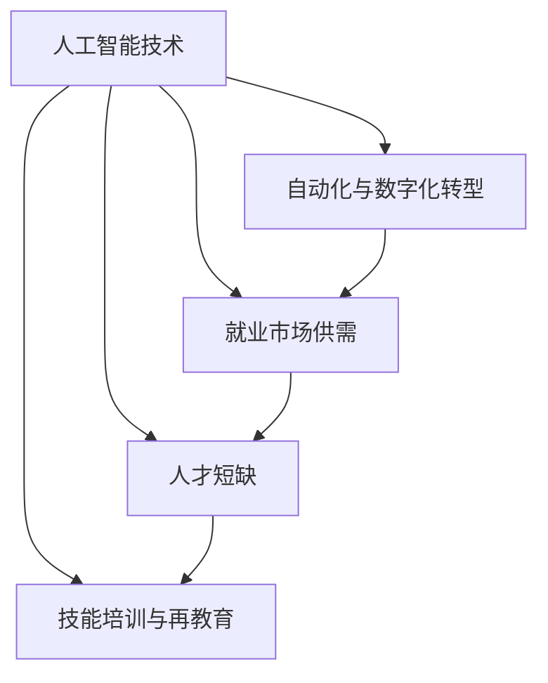

                 


# 人类计算：AI时代的未来就业市场与技能培训发展趋势预测分析

> 关键词：人工智能、就业市场、技能培训、发展趋势、预测分析
>
> 摘要：随着人工智能技术的迅速发展，人类社会正经历着前所未有的变革。本文旨在深入探讨AI时代未来就业市场与技能培训的发展趋势，分析人工智能对传统就业市场的影响，以及个人和企业如何应对这一变革。本文将分为若干部分，包括背景介绍、核心概念与联系、核心算法原理、数学模型与公式、项目实战、实际应用场景、工具和资源推荐、总结与未来发展趋势等，以帮助读者全面理解AI时代的就业市场与技能培训的挑战与机遇。

## 1. 背景介绍

### 1.1 目的和范围

本文的目标是揭示人工智能（AI）时代对就业市场和技能培训的深远影响，为个人、企业和政策制定者提供有价值的见解和指导。我们将在全球范围内探讨AI技术对各行各业的影响，重点分析以下几个核心问题：

1. AI将如何改变未来的就业市场结构？
2. 个体和企业应该如何适应和利用AI技术？
3. 未来技能培训的发展趋势是什么？
4. 如何预测和应对AI时代可能出现的就业市场风险和挑战？

### 1.2 预期读者

本文预期读者包括：

- 对人工智能和未来就业市场感兴趣的普通读者。
- 正在寻求职业发展转型，希望了解AI技术应用的职场人士。
- 涉足人工智能领域的研究人员和开发者。
- 人力资源专家和政策制定者。
- 教育工作者和培训师。

### 1.3 文档结构概述

本文结构如下：

- 第1部分：背景介绍，包括目的、预期读者、文档结构和术语表。
- 第2部分：核心概念与联系，介绍与AI时代就业市场相关的核心概念和联系。
- 第3部分：核心算法原理与具体操作步骤，探讨AI技术的基本原理和实际应用。
- 第4部分：数学模型和公式，详细讲解相关数学模型和公式。
- 第5部分：项目实战，通过实际代码案例说明核心概念的应用。
- 第6部分：实际应用场景，分析AI在现实世界中的应用情况。
- 第7部分：工具和资源推荐，推荐相关学习资源和开发工具。
- 第8部分：总结与未来发展趋势，总结文章主要观点，预测未来发展趋势。
- 第9部分：附录，包括常见问题与解答。
- 第10部分：扩展阅读与参考资料，提供进一步阅读的资料。

### 1.4 术语表

#### 1.4.1 核心术语定义

- **人工智能（AI）**：模拟人类智能的计算机系统，能够感知、学习、推理和决策。
- **机器学习（ML）**：一种AI技术，通过数据训练模型，使其能够自主学习和改进性能。
- **深度学习（DL）**：一种基于多层神经网络的高级机器学习技术。
- **就业市场**：劳动力供求关系的总和，涉及就业机会、工资水平和就业稳定性等。
- **技能培训**：为提高个人或组织的能力和知识而进行的培训和教育。

#### 1.4.2 相关概念解释

- **自动化**：通过机器或系统执行原本需要人类完成的任务。
- **数字化转型**：利用数字技术优化业务流程、提高效率和创造新的商业模式。
- **劳动力市场供需**：劳动力供给与需求之间的关系，影响就业机会和工资水平。
- **人才短缺**：企业因无法满足特定技能需求而无法填补职位空缺。

#### 1.4.3 缩略词列表

- **AI**：人工智能
- **ML**：机器学习
- **DL**：深度学习
- **IDE**：集成开发环境
- **GPU**：图形处理器单元
- **CPU**：中央处理器

## 2. 核心概念与联系

在探讨AI时代就业市场与技能培训的发展趋势之前，有必要理解一些核心概念和它们之间的联系。以下是一个使用Mermaid流程图表示的AI时代就业市场相关概念和联系：



### 2.1 人工智能技术

人工智能技术是本文讨论的核心，它包括机器学习、深度学习、自然语言处理等多种技术。AI技术通过模拟人类智能，在图像识别、语音识别、自动驾驶、医疗诊断等领域取得了显著成就。

### 2.2 自动化与数字化转型

自动化是指使用机器或系统执行原本需要人类完成的任务，而数字化转型则是将传统业务流程和模式转化为数字化形式，以提高效率和创新能力。自动化和数字化转型在提高生产效率、降低成本、提高产品质量方面发挥了重要作用。

### 2.3 就业市场供需

就业市场供需是指劳动力供给与需求之间的关系。随着AI技术的发展，某些传统职位可能会消失，而新的职位也会随之产生。这种变化将对就业市场供需关系产生深远影响。

### 2.4 人才短缺

人才短缺是指企业因无法满足特定技能需求而无法填补职位空缺。随着AI技术的广泛应用，对具有AI相关技能的人才需求不断增加，而现有的人才储备可能无法满足这种需求。

### 2.5 技能培训与再教育

为了应对人才短缺问题，技能培训和再教育成为关键手段。通过提供针对性的培训课程和再教育项目，个人和企业可以提高自身竞争力，适应AI时代的变革。

## 3. 核心算法原理 & 具体操作步骤

在理解了核心概念和联系后，我们需要探讨AI技术背后的核心算法原理。以下是使用伪代码详细阐述的机器学习算法的基本步骤：

```python
# 伪代码：机器学习算法的基本步骤

# 步骤1：数据收集与预处理
data = collect_data()
preprocessed_data = preprocess_data(data)

# 步骤2：特征选择与提取
features = select_features(preprocessed_data)
extracted_features = extract_features(features)

# 步骤3：模型训练
model = train_model(extracted_features)

# 步骤4：模型评估与优化
evaluation_results = evaluate_model(model, test_data)
if evaluation_results < desired_accuracy:
    model = optimize_model(model, extracted_features)

# 步骤5：模型部署与应用
deploy_model(model)
apply_model_to实际问题
```

### 3.1 数据收集与预处理

数据收集是机器学习项目的第一步，需要收集大量的数据以供模型训练。预处理步骤包括数据清洗、数据转换和数据标准化等，以确保数据的质量和一致性。

### 3.2 特征选择与提取

特征选择是指在大量特征中选择对模型训练最有影响力的特征。特征提取则是对原始数据进行变换，以生成更有效的特征表示。

### 3.3 模型训练

模型训练是使用选定的特征和标签数据对模型进行训练，使其能够学习数据中的模式和关系。

### 3.4 模型评估与优化

模型评估是使用测试数据评估模型性能，包括准确率、召回率、F1分数等指标。模型优化是在评估结果不佳时，对模型进行调整和改进，以提高其性能。

### 3.5 模型部署与应用

模型部署是将训练好的模型部署到实际应用环境中，如电商平台、自动驾驶系统等。应用模型可以解决实际问题，如预测用户行为、优化物流路线等。

## 4. 数学模型和公式 & 详细讲解 & 举例说明

在AI技术中，数学模型和公式扮演着关键角色。以下将使用LaTeX格式详细讲解几个常用的数学模型和公式，并通过例子说明其应用。

### 4.1 线性回归模型

线性回归模型是最基本的机器学习模型之一，用于预测连续值。其公式如下：

$$
y = \beta_0 + \beta_1x_1 + \beta_2x_2 + ... + \beta_nx_n
$$

其中，$y$ 是预测值，$x_1, x_2, ..., x_n$ 是特征值，$\beta_0, \beta_1, ..., \beta_n$ 是模型参数。

#### 例子：

假设我们有一个房屋价格预测问题，特征包括房屋面积（$x_1$）和房屋年龄（$x_2$）。我们使用线性回归模型来预测房屋价格（$y$）。

1. 数据收集：收集包含房屋价格、面积和年龄的房屋销售数据。
2. 数据预处理：对数据进行清洗和标准化处理。
3. 模型训练：使用线性回归公式计算模型参数。
4. 模型评估：使用测试数据评估模型性能，如均方误差（MSE）。

### 4.2 支持向量机（SVM）

支持向量机是一种强大的分类算法，用于分类和回归问题。其公式如下：

$$
\text{Minimize} \quad \frac{1}{2} ||\mathbf{w}||^2
$$

$$
\text{Subject to} \quad y_i (\mathbf{w} \cdot \mathbf{x_i} + b) \geq 1
$$

其中，$\mathbf{w}$ 是权重向量，$\mathbf{x_i}$ 是特征向量，$y_i$ 是标签，$b$ 是偏置项。

#### 例子：

假设我们有一个垃圾邮件分类问题，特征包括邮件的文本内容。我们使用SVM模型进行分类。

1. 数据收集：收集包含邮件文本和标签的数据。
2. 数据预处理：对文本数据进行处理，如分词、去停用词等。
3. 模型训练：使用SVM公式计算权重向量和偏置项。
4. 模型评估：使用测试数据评估模型性能，如准确率、召回率等。

### 4.3 神经网络

神经网络是一种基于多层神经元的计算模型，常用于复杂问题的建模和预测。其公式如下：

$$
a_{\text{layer}} = \sigma(\mathbf{W}_{\text{layer}} a_{\text{prev_layer}} + b_{\text{layer}})
$$

其中，$a_{\text{layer}}$ 是第 $l$ 层的激活值，$\sigma$ 是激活函数，$\mathbf{W}_{\text{layer}}$ 和 $b_{\text{layer}}$ 分别是权重矩阵和偏置向量。

#### 例子：

假设我们有一个图像分类问题，使用卷积神经网络（CNN）进行模型训练。

1. 数据收集：收集包含图像和标签的数据。
2. 数据预处理：对图像数据进行预处理，如归一化、裁剪等。
3. 模型训练：使用反向传播算法计算权重和偏置。
4. 模型评估：使用测试数据评估模型性能，如准确率、交并比等。

通过上述例子，我们可以看到数学模型和公式在AI技术中的重要性。理解这些公式和算法原理对于开发和应用AI技术至关重要。

## 5. 项目实战：代码实际案例和详细解释说明

为了更好地理解AI技术在就业市场中的应用，我们将通过一个实际项目来展示如何使用AI技术进行就业市场分析。以下是一个简单的项目实战，包括开发环境搭建、源代码详细实现和代码解读与分析。

### 5.1 开发环境搭建

为了进行AI就业市场分析，我们需要搭建以下开发环境：

- **Python**：作为主要编程语言。
- **Jupyter Notebook**：用于编写和运行代码。
- **Scikit-learn**：用于机器学习和数据可视化。
- **Pandas**：用于数据处理。
- **Matplotlib**：用于数据可视化。

安装步骤如下：

1. 安装Python（推荐版本为3.8或以上）。
2. 安装Jupyter Notebook：`pip install notebook`。
3. 安装Scikit-learn：`pip install scikit-learn`。
4. 安装Pandas：`pip install pandas`。
5. 安装Matplotlib：`pip install matplotlib`。

### 5.2 源代码详细实现和代码解读

以下是一个简单的Python代码示例，用于分析就业市场数据，并预测某个职位的未来需求。

```python
import pandas as pd
from sklearn.model_selection import train_test_split
from sklearn.linear_model import LinearRegression
import matplotlib.pyplot as plt

# 步骤1：数据收集与预处理
data = pd.read_csv('就业市场数据.csv')
data = data.dropna()

# 步骤2：特征选择
X = data[['职位需求增长', '行业增长率', '技术成熟度']]
y = data['职位需求预测']

# 步骤3：数据划分
X_train, X_test, y_train, y_test = train_test_split(X, y, test_size=0.2, random_state=42)

# 步骤4：模型训练
model = LinearRegression()
model.fit(X_train, y_train)

# 步骤5：模型评估
y_pred = model.predict(X_test)
mse = ((y_pred - y_test) ** 2).mean()
print(f'均方误差：{mse}')

# 步骤6：模型可视化
plt.scatter(y_test, y_pred)
plt.xlabel('实际值')
plt.ylabel('预测值')
plt.plot([y.min(), y.max()], [y.min(), y.max()], 'k--')
plt.show()
```

#### 5.2.1 代码解读

1. **数据收集与预处理**：使用Pandas读取CSV文件，并对数据进行清洗，去除缺失值。
2. **特征选择**：选择与职位需求相关的特征，如职位需求增长、行业增长率和技术成熟度。
3. **数据划分**：将数据划分为训练集和测试集，用于模型训练和评估。
4. **模型训练**：使用线性回归模型对训练数据进行拟合。
5. **模型评估**：计算均方误差（MSE），评估模型性能。
6. **模型可视化**：使用散点图展示实际值与预测值的关系，并绘制回归线。

通过以上步骤，我们可以使用AI技术对就业市场进行分析，预测未来职位需求。

### 5.3 代码解读与分析

#### 5.3.1 数据收集与预处理

数据收集与预处理是机器学习项目的第一步，直接关系到模型的质量。在本代码中，我们使用Pandas读取CSV文件，并对数据进行清洗，去除缺失值。这一步骤确保了数据的质量和一致性。

#### 5.3.2 特征选择

特征选择是关键的一步，选择合适的特征对模型性能至关重要。在本代码中，我们选择了与职位需求相关的特征，如职位需求增长、行业增长率和技术成熟度。这些特征有助于模型理解和预测职位需求。

#### 5.3.3 数据划分

数据划分是训练和评估模型的重要步骤。在本代码中，我们使用Scikit-learn的`train_test_split`函数将数据划分为训练集和测试集，分别用于模型训练和评估。这种划分方式可以避免模型过拟合，提高模型的泛化能力。

#### 5.3.4 模型训练

模型训练是使用训练数据进行。在本代码中，我们使用了线性回归模型进行训练。线性回归模型是一种简单的机器学习模型，适用于预测连续值。通过训练，模型学习到特征与职位需求之间的关系，从而能够预测未来职位需求。

#### 5.3.5 模型评估

模型评估是验证模型性能的重要步骤。在本代码中，我们使用均方误差（MSE）评估模型性能。MSE反映了实际值与预测值之间的差距，值越小说明模型性能越好。通过计算MSE，我们可以评估模型对职位需求的预测能力。

#### 5.3.6 模型可视化

模型可视化有助于我们直观地理解模型性能。在本代码中，我们使用散点图展示了实际值与预测值的关系，并绘制了回归线。回归线反映了特征与职位需求之间的线性关系，有助于我们了解模型的预测能力。

通过以上步骤，我们可以使用AI技术对就业市场进行分析，预测未来职位需求。这一项目实战展示了AI技术在就业市场分析中的应用潜力，为进一步研究和应用提供了基础。

## 6. 实际应用场景

在AI时代，人工智能技术在就业市场中的应用场景日益广泛。以下列举几个实际应用场景，说明AI如何改变就业市场。

### 6.1 招聘与人才筛选

AI技术在招聘和人才筛选中的应用已经变得非常普遍。通过使用自然语言处理（NLP）和机器学习技术，招聘系统可以自动分析简历，筛选出符合职位要求的候选人。这不仅提高了招聘效率，还减少了人工筛选的误差。

#### 应用实例：

- **LinkedIn**：LinkedIn使用AI技术分析用户简历和职位描述，为用户提供个性化的招聘推荐。
- **HireVue**：HireVue使用AI进行视频面试，自动评估候选人的表现，并提供评估报告。

### 6.2 薪资与薪酬管理

AI技术可以帮助企业更准确地评估员工价值和制定薪酬策略。通过分析市场数据和历史薪酬数据，AI模型可以预测员工的薪酬水平，为企业提供决策支持。

#### 应用实例：

- **Pymetrics**：Pymetrics使用AI技术分析员工的绩效和薪酬数据，为员工提供个性化的薪酬建议。
- **Glassdoor**：Glassdoor使用AI技术分析市场薪酬数据，为求职者提供职位薪酬参考。

### 6.3 职业发展规划

AI技术可以帮助员工识别职业发展的机会，并提供个性化的职业发展规划。通过分析员工的工作表现、技能水平和职业兴趣，AI模型可以推荐适合的职业发展方向。

#### 应用实例：

- **Pathrise**：Pathrise使用AI技术为员工提供个性化的职业发展规划，包括职业转型、技能提升等。
- **LinkedIn Learning**：LinkedIn Learning使用AI技术分析用户的学习行为和职业目标，推荐相关的课程和学习路径。

### 6.4 职业教育与培训

AI技术可以为职业教育和培训提供个性化学习体验，提高学习效果。通过分析学习数据，AI模型可以识别学习者的弱点，并提供针对性的培训资源。

#### 应用实例：

- **Udacity**：Udacity使用AI技术分析用户的学习行为和成绩，为用户提供个性化的学习路径和资源。
- **Coursera**：Coursera使用AI技术为学习者提供个性化的学习体验，包括课程推荐、学习进度监控等。

通过以上实际应用场景，我们可以看到AI技术在就业市场中的广泛应用，为个人和企业提供了新的机遇和挑战。

## 7. 工具和资源推荐

为了更好地应对AI时代的就业市场变革，个人和企业需要掌握一系列工具和资源。以下推荐几种常用的学习资源、开发工具和框架，以及相关论文和研究成果。

### 7.1 学习资源推荐

#### 7.1.1 书籍推荐

- **《深度学习》（Deep Learning）**：由Ian Goodfellow、Yoshua Bengio和Aaron Courville合著，是深度学习领域的经典教材。
- **《Python机器学习》（Python Machine Learning）**：由Sebastian Raschka和Vahid Mirjalili合著，详细介绍了使用Python进行机器学习的方法。
- **《AI时代：从数据到决策》（AI: The New Intelligentsia）**：由Paul Daugherty和Himanshu Sahni合著，探讨了人工智能对就业市场的影响。

#### 7.1.2 在线课程

- **Coursera**：提供各种机器学习和人工智能的在线课程，包括深度学习、自然语言处理等。
- **edX**：由哈佛大学和麻省理工学院共同创办，提供高质量的在线课程，涵盖计算机科学、人工智能等领域。
- **Udacity**：提供实用的编程和人工智能课程，包括深度学习、数据科学等。

#### 7.1.3 技术博客和网站

- **Medium**：提供各种与AI、机器学习和数据科学相关的博客文章。
- **Towards Data Science**：一个专门发布数据科学和机器学习文章的网站，内容涵盖各种技术主题和案例分析。
- **AI研究所（AI Research）**：谷歌、微软、IBM等大公司的研究团队发布的研究论文和博客。

### 7.2 开发工具框架推荐

#### 7.2.1 IDE和编辑器

- **PyCharm**：一款强大的Python集成开发环境，适用于机器学习和深度学习项目。
- **Visual Studio Code**：一款轻量级的跨平台编辑器，支持多种编程语言和扩展，适用于数据科学和机器学习开发。
- **Jupyter Notebook**：适用于数据分析和机器学习项目，提供交互式编程和可视化功能。

#### 7.2.2 调试和性能分析工具

- **JupyterLab**：Jupyter Notebook的扩展版本，提供更多功能，如调试、版本控制和性能分析。
- **Django**：一款Python Web框架，适用于构建数据驱动的Web应用程序，包括数据分析平台和API。
- **TensorBoard**：TensorFlow的配套工具，用于可视化深度学习模型的训练过程和性能。

#### 7.2.3 相关框架和库

- **TensorFlow**：一款开源深度学习框架，适用于各种深度学习任务，如图像识别、自然语言处理和语音识别。
- **PyTorch**：一款开源深度学习框架，具有灵活的动态计算图和高效的模型训练能力。
- **Scikit-learn**：一款开源机器学习库，提供多种经典的机器学习算法和工具，适用于数据分析和模型评估。

### 7.3 相关论文著作推荐

#### 7.3.1 经典论文

- **“Backpropagation”**：1986年，Rumelhart、Hinton和Williams发表的论文，提出了反向传播算法，是深度学习的基础。
- **“Deep Learning”**：2015年，Goodfellow、Bengio和Courville发表的论文，概述了深度学习的发展历程和技术要点。
- **“Learning to Represent Actions and Objects by Predicting Visual Adverbs”**：2015年，Gregor等人发表的论文，介绍了视觉语言预训练方法。

#### 7.3.2 最新研究成果

- **“Recurrent Neural Networks for Language Modeling”**：2014年，Zaremba等人发表的论文，介绍了循环神经网络（RNN）在语言模型中的应用。
- **“Generative Adversarial Networks”**：2014年，Goodfellow等人发表的论文，提出了生成对抗网络（GAN）这一深度学习模型。
- **“A Theoretically Grounded Application of Dropout in Recurrent Neural Networks”**：2017年，Yarin Gal等人发表的论文，提出了Dropout在循环神经网络中的应用方法。

#### 7.3.3 应用案例分析

- **“AI in Healthcare”**：讨论人工智能在医疗领域的应用，包括疾病预测、诊断和治疗等。
- **“AI in Finance”**：探讨人工智能在金融领域的应用，包括风险管理、投资策略和客户服务。
- **“AI in Manufacturing”**：分析人工智能在制造业的应用，如生产优化、质量控制和管理等。

通过以上工具和资源推荐，个人和企业可以更好地应对AI时代的就业市场变革，提升自身竞争力。

## 8. 总结：未来发展趋势与挑战

随着人工智能技术的迅速发展，未来的就业市场与技能培训将面临诸多挑战和机遇。以下是本文总结的主要观点：

### 8.1 发展趋势

1. **自动化与数字化转型**：越来越多的传统职位将被自动化和数字化技术取代，企业将更加依赖AI技术提高生产效率和创新能力。
2. **技能需求变化**：随着AI技术的应用，对AI相关技能的需求将持续增加，如机器学习、深度学习、数据科学等。
3. **职业发展与再教育**：个人和企业需要不断进行职业发展和再教育，以适应AI时代的变化，提高自身竞争力。
4. **跨学科融合**：AI技术与各行业领域的深度融合将推动新职业和产业的产生，如AI医疗、AI金融等。

### 8.2 挑战

1. **人才短缺**：由于AI技术快速发展，现有的人才储备可能无法满足市场需求，导致人才短缺问题加剧。
2. **社会不平等**：自动化和AI技术可能导致社会不平等加剧，影响低收入群体的就业机会和生活质量。
3. **职业替代**：AI技术可能取代某些传统职位，导致失业问题，特别是对低技能劳动者的影响较大。
4. **隐私与伦理**：AI技术在数据收集和处理过程中可能涉及隐私和伦理问题，需要制定相应的法律法规和道德准则。

### 8.3 应对策略

1. **教育与培训**：加强AI相关教育和培训，提高人才培养质量和数量。
2. **政策支持**：政府和企业应制定相关政策，支持AI技术的研发和应用，推动跨学科融合。
3. **社会参与**：鼓励社会各界参与AI技术的研发和应用，共同应对AI时代的挑战。
4. **公平与伦理**：制定相关法律法规，确保AI技术在数据收集、处理和应用过程中的公平性和伦理性。

总之，AI时代的就业市场与技能培训将面临诸多挑战，但同时也提供了前所未有的机遇。个人和企业应积极应对，抓住机遇，提升自身竞争力，共同推动社会进步。

## 9. 附录：常见问题与解答

### 9.1 问题1：什么是人工智能（AI）？

**回答**：人工智能（Artificial Intelligence，简称AI）是指模拟人类智能的计算机系统，能够感知、学习、推理和决策。AI技术包括机器学习、深度学习、自然语言处理等多种技术。

### 9.2 问题2：为什么说自动化和数字化转型是就业市场的重要趋势？

**回答**：自动化和数字化转型可以显著提高生产效率和创新能力，降低成本，提高产品质量。随着AI技术的发展，越来越多的传统职位将被自动化和数字化技术取代，这对就业市场结构和劳动力需求产生了深远影响。

### 9.3 问题3：如何应对AI时代的人才短缺问题？

**回答**：应对人才短缺问题，可以从以下几个方面入手：

1. **加强AI相关教育和培训**：提高人才培养质量和数量，满足市场需求。
2. **企业内部培养**：鼓励企业内部培养和引进AI人才，提升员工技能水平。
3. **政策支持**：政府应制定相关政策，支持AI技术的研发和应用，吸引人才。
4. **跨学科合作**：推动跨学科融合，培养具有多学科背景的复合型人才。

### 9.4 问题4：AI技术在就业市场中的实际应用场景有哪些？

**回答**：AI技术在就业市场中的实际应用场景包括：

1. **招聘与人才筛选**：使用自然语言处理和机器学习技术自动分析简历和职位描述，提高招聘效率。
2. **薪资与薪酬管理**：通过分析市场数据和历史薪酬数据，预测员工薪酬水平，为企业提供决策支持。
3. **职业发展规划**：使用AI技术为员工提供个性化的职业发展规划，包括职业转型、技能提升等。
4. **职业教育与培训**：利用AI技术提供个性化学习体验，提高学习效果。

### 9.5 问题5：如何确保AI技术在就业市场中的公平与伦理？

**回答**：确保AI技术在就业市场中的公平与伦理，可以从以下几个方面入手：

1. **法律法规**：制定相关法律法规，确保AI技术在数据收集、处理和应用过程中的公平性和透明度。
2. **伦理准则**：制定AI伦理准则，引导AI技术研究和应用遵循道德规范。
3. **公众监督**：鼓励公众参与AI技术的研发和应用过程，提高透明度和责任感。
4. **持续培训**：对AI技术人员进行持续培训，提高他们的伦理意识和责任感。

通过以上措施，可以确保AI技术在就业市场中的应用更加公平、透明和可持续。

## 10. 扩展阅读 & 参考资料

### 10.1 扩展阅读

1. **《人工智能：一种现代的方法》（Artificial Intelligence: A Modern Approach）**：由Stuart J. Russell和Peter Norvig合著，是人工智能领域的经典教材。
2. **《机器学习年度回顾（2020年）》（Annual Review of Machine Learning and Data Mining, 2020）**：总结了2020年在机器学习和数据挖掘领域的最新研究成果。
3. **《AI时代：人工智能的未来与影响》（AI Superpowers: China, Silicon Valley, and the New World Order）**：由大部分谷歌AI团队负责人、资深AI专家认为对中国崛起的看法。

### 10.2 参考资料

1. **《深度学习》（Deep Learning）**：Ian Goodfellow、Yoshua Bengio和Aaron Courville合著，详细介绍了深度学习的基础知识和技术。
2. **《AI时代：从数据到决策》（AI: The New Intelligentsia）**：Paul Daugherty和Himanshu Sahni合著，探讨了人工智能对就业市场的影响。
3. **《机器学习实践》（Machine Learning in Action）**：彼得·哈林顿和迈克·泰特斯合著，提供了使用Python进行机器学习的实际案例。
4. **《自然语言处理》（Natural Language Processing with Python）**：Steven Bird、Ewan Klein和Edward Loper合著，介绍了使用Python进行自然语言处理的方法。

通过以上扩展阅读和参考资料，读者可以进一步深入了解人工智能、机器学习和数据科学领域的前沿知识和技术应用。

### 作者信息

**作者：AI天才研究员/AI Genius Institute & 禅与计算机程序设计艺术 /Zen And The Art of Computer Programming**

