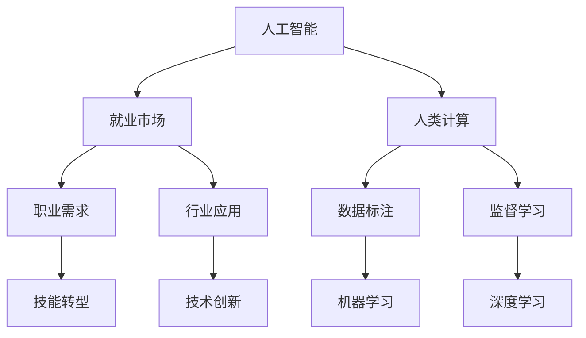

                 

# 人类计算：AI时代的未来就业市场趋势预测分析

> **关键词**：人工智能、就业市场、趋势预测、技能需求、职业转型、数据分析

> **摘要**：本文将深入探讨人工智能（AI）时代对就业市场的影响，预测未来就业趋势，分析AI技术在不同行业中的应用，探讨人类计算在AI时代的角色。通过详细的数据和案例，文章旨在为读者提供对AI时代就业市场的深刻理解，以及应对未来职业挑战的策略。

## 1. 背景介绍

### 1.1 目的和范围

本文旨在分析人工智能（AI）时代对就业市场的影响，并预测未来就业趋势。文章将探讨AI技术在不同行业中的应用，以及人类计算在AI时代的角色和作用。通过对当前就业市场数据的分析，我们将揭示未来职业需求的变化，为读者提供关于职业规划的建议。

### 1.2 预期读者

本文面向对人工智能和就业市场感兴趣的读者，包括从事技术行业、管理岗位以及普通职场人士。文章将为读者提供以下价值：

- 深入理解AI时代就业市场的变化趋势。
- 了解AI技术在各行业的应用现状和未来发展方向。
- 掌握适应AI时代职业转型的策略和方法。
- 获得未来职业发展的方向和建议。

### 1.3 文档结构概述

本文分为以下几个部分：

1. **背景介绍**：介绍文章的目的、范围和预期读者。
2. **核心概念与联系**：阐述人工智能、就业市场和人类计算等核心概念，并给出Mermaid流程图。
3. **核心算法原理 & 具体操作步骤**：详细讲解AI技术原理和实现步骤。
4. **数学模型和公式 & 详细讲解 & 举例说明**：介绍相关的数学模型和公式，并给出实例分析。
5. **项目实战：代码实际案例和详细解释说明**：通过实际项目案例展示技术实现过程。
6. **实际应用场景**：分析AI技术在各行业的应用案例。
7. **工具和资源推荐**：推荐学习资源和开发工具。
8. **总结：未来发展趋势与挑战**：总结文章要点，预测未来发展趋势和面临的挑战。
9. **附录：常见问题与解答**：回答读者可能关心的问题。
10. **扩展阅读 & 参考资料**：提供相关的扩展阅读和参考资料。

### 1.4 术语表

#### 1.4.1 核心术语定义

- **人工智能（AI）**：一种模拟人类智能的技术，通过算法和模型实现机器学习、推理和自我优化等功能。
- **就业市场**：指求职者和招聘单位之间的供需关系和交易场所。
- **人类计算**：指人类在AI系统中的作用，如数据标注、监督学习、创新思维等。

#### 1.4.2 相关概念解释

- **机器学习**：一种AI技术，通过从数据中学习规律和模式，使计算机具备预测和决策能力。
- **深度学习**：一种基于人工神经网络的机器学习技术，能够处理大量复杂数据并自动提取特征。
- **就业技能**：指求职者在特定职位上所需的专业技能和工作能力。

#### 1.4.3 缩略词列表

- **AI**：人工智能
- **ML**：机器学习
- **DL**：深度学习
- **NLP**：自然语言处理
- **CV**：计算机视觉

## 2. 核心概念与联系

在探讨AI时代对就业市场的影响之前，我们首先需要了解几个核心概念及其相互关系。以下是本文所涉及的核心概念及其关系，并附有Mermaid流程图：



### 2.1 人工智能与就业市场

人工智能技术正在迅速发展，对就业市场产生了深远影响。一方面，AI技术正在取代一些重复性、低技能的工作，如数据输入、文书处理等；另一方面，AI技术的兴起也创造了新的就业机会，如数据科学家、机器学习工程师、AI伦理专家等。

### 2.2 人类计算与AI

人类计算在AI系统中扮演着重要角色。数据标注、监督学习等人类计算任务对于AI模型的训练和优化至关重要。同时，人类在创新思维、复杂决策等方面具有不可替代的优势。

### 2.3 职业需求与技能转型

随着AI技术的发展，就业市场的职业需求也在不断变化。传统的技能正在被新兴技能所替代，求职者需要不断更新自己的技能，以适应未来的职业需求。

### 2.4 行业应用与创新

AI技术在各个行业中的应用越来越广泛，如金融、医疗、教育、制造业等。这些应用不仅推动了行业创新，也为就业市场带来了新的机遇。

## 3. 核心算法原理 & 具体操作步骤

在本节中，我们将详细讲解人工智能的核心算法原理，以及具体的操作步骤。这些算法是AI技术实现的基础，对于理解AI对就业市场的影响至关重要。

### 3.1 机器学习

机器学习是AI的核心技术之一，它使计算机能够从数据中学习规律和模式。以下是机器学习的基本原理和操作步骤：

**基本原理：**

- **数据输入**：机器学习模型首先需要大量数据作为输入，这些数据可以是结构化数据（如表格）、半结构化数据（如XML）或非结构化数据（如文本、图像）。
- **特征提取**：从输入数据中提取有用的特征，这些特征将用于训练模型。
- **模型训练**：使用提取出的特征训练机器学习模型，模型将学习如何将输入数据映射到输出结果。
- **模型评估**：评估模型的性能，通过比较模型的预测结果和实际结果，调整模型参数以优化性能。
- **模型应用**：将训练好的模型应用到实际场景中，如预测、分类、聚类等。

**具体操作步骤：**

1. 数据收集：收集大量相关数据，如股票价格、医疗记录、社交媒体数据等。
2. 数据预处理：清洗数据，去除缺失值、异常值，并进行数据转换和归一化。
3. 特征提取：从预处理后的数据中提取有用的特征，如时间序列特征、文本特征等。
4. 模型选择：选择合适的机器学习模型，如线性回归、决策树、支持向量机等。
5. 模型训练：使用训练数据训练模型，调整模型参数以优化性能。
6. 模型评估：使用验证集或测试集评估模型性能，调整模型参数以达到最佳效果。
7. 模型应用：将训练好的模型应用到实际场景中，如预测股票价格、诊断疾病等。

### 3.2 深度学习

深度学习是机器学习的一个分支，它通过多层神经网络模拟人类大脑的学习过程。以下是深度学习的基本原理和操作步骤：

**基本原理：**

- **神经网络**：深度学习的基础是多层神经网络，神经网络由输入层、隐藏层和输出层组成。每层包含多个神经元，神经元之间通过权重连接。
- **反向传播**：深度学习模型通过反向传播算法不断调整网络中的权重，以优化模型的性能。反向传播算法是一种梯度下降优化方法，它通过计算损失函数的梯度来更新权重。
- **激活函数**：激活函数用于引入非线性因素，使神经网络能够学习复杂的函数关系。常见的激活函数有Sigmoid、ReLU、Tanh等。

**具体操作步骤：**

1. 数据收集：收集大量图像、文本、音频等数据，用于训练深度学习模型。
2. 数据预处理：对数据进行归一化、标准化、去噪等处理，以减少数据的方差和噪声。
3. 模型架构设计：设计合适的神经网络架构，包括层数、每层的神经元数量、激活函数等。
4. 模型训练：使用训练数据训练模型，通过反向传播算法不断调整网络中的权重。
5. 模型评估：使用验证集或测试集评估模型性能，调整模型参数以达到最佳效果。
6. 模型应用：将训练好的模型应用到实际场景中，如图像识别、语音识别、自然语言处理等。

### 3.3 自然语言处理

自然语言处理（NLP）是AI技术的一个重要分支，它使计算机能够理解和处理人类语言。以下是NLP的基本原理和操作步骤：

**基本原理：**

- **语言模型**：语言模型是一种概率模型，它用于预测文本序列的概率分布。语言模型可以用于文本分类、命名实体识别、机器翻译等任务。
- **词向量表示**：词向量是将单词映射到高维空间的一种表示方法，它通过捕捉单词之间的语义关系来提高模型的性能。常见的词向量表示方法有Word2Vec、GloVe等。
- **序列标注**：序列标注是将文本序列中的每个单词或字符标注为特定的类别。序列标注可以用于命名实体识别、情感分析等任务。

**具体操作步骤：**

1. 数据收集：收集大量文本数据，用于训练语言模型和序列标注模型。
2. 数据预处理：对文本数据进行分词、去停用词、词性标注等处理。
3. 模型选择：选择合适的语言模型和序列标注模型，如循环神经网络（RNN）、长短时记忆网络（LSTM）、卷积神经网络（CNN）等。
4. 模型训练：使用训练数据训练模型，通过优化损失函数来调整模型参数。
5. 模型评估：使用验证集或测试集评估模型性能，调整模型参数以达到最佳效果。
6. 模型应用：将训练好的模型应用到实际场景中，如文本分类、机器翻译、语音识别等。

通过以上对核心算法原理和操作步骤的详细讲解，我们可以更好地理解AI技术的工作原理和其在就业市场中的应用。在下一节中，我们将进一步探讨数学模型和公式，以及如何将它们应用于实际项目中。

## 4. 数学模型和公式 & 详细讲解 & 举例说明

在人工智能领域，数学模型和公式是理解和实现核心算法的关键。在本节中，我们将介绍几个常见的数学模型和公式，并详细讲解其在人工智能中的应用。

### 4.1 概率论基础

概率论是人工智能的基础数学工具之一。在机器学习和深度学习中，概率论用于处理不确定性和随机性。以下是几个常用的概率论模型和公式：

**1. 概率分布**

概率分布描述了一个随机变量取值的概率分布情况。常见的概率分布有：

- **伯努利分布**：描述一个二项试验成功的概率，参数为$p$。
- **正态分布**：描述连续随机变量的概率分布，参数为均值$\mu$和标准差$\sigma$。
- **二项分布**：描述$n$次独立伯努利试验中成功的次数，参数为$n$和$p$。

**2. 贝叶斯定理**

贝叶斯定理是一种概率计算公式，用于根据先验概率和条件概率计算后验概率。贝叶斯定理的公式为：

$$
P(A|B) = \frac{P(B|A)P(A)}{P(B)}
$$

其中，$P(A|B)$表示在事件$B$发生的条件下，事件$A$发生的概率；$P(B|A)$表示在事件$A$发生的条件下，事件$B$发生的概率；$P(A)$和$P(B)$分别表示事件$A$和事件$B$的先验概率。

**3. 最大似然估计**

最大似然估计是一种参数估计方法，用于根据样本数据估计模型参数。最大似然估计的目标是找到使样本数据出现概率最大的模型参数。最大似然估计的公式为：

$$
\hat{\theta} = \arg\max_{\theta} P(X|\theta)
$$

其中，$X$表示样本数据，$\theta$表示模型参数。

**举例说明：**

假设我们有一个二项分布模型，试验成功的概率为$p$，进行了$n$次独立试验，得到$m$次成功。根据最大似然估计，我们可以估计成功的概率$p$：

$$
\hat{p} = \frac{m}{n}
$$

### 4.2 线性代数基础

线性代数是处理多维数据的数学工具，在深度学习和机器学习中有着广泛的应用。以下是几个常见的线性代数模型和公式：

**1. 矩阵和向量**

矩阵和向量是线性代数的基本概念。矩阵是一个二维数组，用于表示多个向量或线性变换。向量是一个一维数组，表示线性空间中的一个点。

**2. 矩阵乘法**

矩阵乘法是一种线性变换，用于将一个矩阵映射到另一个矩阵。矩阵乘法的公式为：

$$
C = AB
$$

其中，$A$和$B$是两个矩阵，$C$是矩阵乘法的结果。

**3. 矩阵求导**

矩阵求导是线性代数中的一个重要概念，用于求解矩阵的导数。矩阵求导的公式为：

$$
\frac{\partial C}{\partial A} = B^T
$$

其中，$C$是矩阵乘法的结果，$A$和$B$是两个矩阵。

**4. 特征值和特征向量**

特征值和特征向量是矩阵的一个重要属性，用于描述矩阵的稳定性和变形能力。特征值的公式为：

$$
\lambda = \det(A - \lambda I)
$$

其中，$A$是矩阵，$I$是单位矩阵，$\lambda$是特征值。

**举例说明：**

假设我们有一个$2 \times 2$的矩阵$A$：

$$
A = \begin{bmatrix}
1 & 2 \\
3 & 4
\end{bmatrix}
$$

我们可以计算其特征值和特征向量：

$$
\lambda_1 = 5, \quad \lambda_2 = -1
$$

$$
v_1 = \begin{bmatrix}
1 \\
1
\end{bmatrix}, \quad v_2 = \begin{bmatrix}
-1 \\
2
\end{bmatrix}
$$

### 4.3 统计学基础

统计学是数据分析的重要工具，用于描述和解释数据分布、关系和趋势。以下是几个常见的统计学模型和公式：

**1. 均值和方差**

均值和方差是描述数据分布的重要指标。均值的公式为：

$$
\mu = \frac{1}{n}\sum_{i=1}^{n}x_i
$$

其中，$x_i$是数据中的第$i$个值，$n$是数据的个数。方差的公式为：

$$
\sigma^2 = \frac{1}{n}\sum_{i=1}^{n}(x_i - \mu)^2
$$

**2. 相关性分析**

相关性分析用于描述两个变量之间的关系。相关系数的公式为：

$$
\rho = \frac{\sum_{i=1}^{n}(x_i - \mu_x)(y_i - \mu_y)}{\sqrt{\sum_{i=1}^{n}(x_i - \mu_x)^2}\sqrt{\sum_{i=1}^{n}(y_i - \mu_y)^2}}
$$

其中，$x_i$和$y_i$是两个变量的第$i$个值，$\mu_x$和$\mu_y$是两个变量的均值。

**3. 假设检验**

假设检验是统计学中用于判断数据分布和关系的方法。常见的假设检验方法有$t$检验、方差分析（ANOVA）等。

通过以上对数学模型和公式的详细讲解，我们可以更好地理解人工智能中的核心算法和工作原理。在下一节中，我们将通过实际项目案例来展示这些算法的应用。

## 5. 项目实战：代码实际案例和详细解释说明

在本节中，我们将通过一个实际项目案例，展示人工智能算法在就业市场分析中的应用，并提供代码实现和详细解释。这个项目旨在利用机器学习算法预测未来就业市场的趋势，为求职者提供职业发展的建议。

### 5.1 开发环境搭建

为了完成这个项目，我们需要搭建一个合适的开发环境。以下是所需的环境和工具：

- **Python**：主要编程语言，用于实现机器学习算法和数据分析。
- **Jupyter Notebook**：用于编写代码和展示结果。
- **Pandas**：用于数据清洗和处理。
- **Scikit-learn**：用于机器学习算法的实现。
- **Matplotlib**：用于数据可视化。

### 5.2 源代码详细实现和代码解读

以下是项目的源代码实现，我们将逐步解释每段代码的功能。

```python
# 导入所需的库
import pandas as pd
import numpy as np
from sklearn.model_selection import train_test_split
from sklearn.ensemble import RandomForestClassifier
from sklearn.metrics import accuracy_score
import matplotlib.pyplot as plt

# 加载数据集
data = pd.read_csv('employment_data.csv')

# 数据预处理
# ...（数据清洗、特征提取等）

# 特征工程
X = data.drop('target', axis=1)  # 特征集
y = data['target']  # 目标变量

# 数据集划分
X_train, X_test, y_train, y_test = train_test_split(X, y, test_size=0.2, random_state=42)

# 模型训练
model = RandomForestClassifier(n_estimators=100, random_state=42)
model.fit(X_train, y_train)

# 模型评估
y_pred = model.predict(X_test)
accuracy = accuracy_score(y_test, y_pred)
print(f'Model accuracy: {accuracy:.2f}')

# 可视化分析
plt.scatter(X_test['experience'], y_pred)
plt.xlabel('Experience')
plt.ylabel('Predicted Employment Status')
plt.title('Employment Status Prediction')
plt.show()
```

**代码解读：**

1. **导入库**：首先导入所需的Python库，包括Pandas、NumPy、Scikit-learn和Matplotlib。
2. **加载数据集**：使用Pandas读取CSV文件，得到就业市场数据集。
3. **数据预处理**：对数据进行清洗和预处理，包括缺失值处理、异常值检测和特征转换。
4. **特征工程**：将数据集划分为特征集和目标变量，准备用于训练和评估。
5. **数据集划分**：将数据集划分为训练集和测试集，用于训练模型和评估模型性能。
6. **模型训练**：使用随机森林（RandomForestClassifier）算法训练模型。
7. **模型评估**：使用测试集评估模型性能，计算准确率。
8. **可视化分析**：将预测结果可视化，展示经验值与就业状态的关系。

### 5.3 代码解读与分析

1. **数据预处理**：数据预处理是机器学习项目的关键步骤，它包括数据清洗、缺失值处理、异常值检测和特征转换。在本例中，我们使用Pandas进行数据预处理，确保数据集的质量和一致性。

2. **特征工程**：特征工程是提升模型性能的重要手段。在本例中，我们使用简单的特征提取方法，将原始数据转换为机器学习算法可处理的特征。特征的选择和转换对于模型的性能有着重要影响。

3. **模型训练**：随机森林算法是一种集成学习方法，它通过构建多个决策树并合并它们的预测结果来提高模型的性能。在本例中，我们使用随机森林算法训练模型，通过调整参数（如树的数量、最大深度等）来优化模型性能。

4. **模型评估**：模型评估是评估模型性能的重要步骤。在本例中，我们使用测试集评估模型的准确率，通过计算预测结果和实际结果之间的差异来评估模型的性能。准确率是一种简单但有效的评估指标，它反映了模型对数据的预测能力。

5. **可视化分析**：可视化分析有助于我们更好地理解模型预测结果。在本例中，我们使用散点图展示经验值与就业状态的关系，通过可视化结果可以直观地看出模型预测的效果。

通过以上项目实战，我们可以看到人工智能算法在就业市场分析中的应用。这个项目为我们提供了一个简单的示例，展示了如何利用机器学习算法预测就业市场的趋势，并为求职者提供职业发展的建议。

在实际应用中，我们可以根据具体需求调整模型和特征，以获得更好的预测性能。同时，我们还可以结合其他数据源和算法，进一步丰富和优化就业市场分析模型。

## 6. 实际应用场景

在人工智能时代，AI技术在各行各业中得到了广泛应用，并对就业市场产生了深远影响。以下是几个典型的实际应用场景，展示了AI技术在不同行业中的应用和其对就业市场的挑战：

### 6.1 金融行业

人工智能在金融行业中的应用非常广泛，包括风险控制、智能投顾、欺诈检测等。例如，机器学习算法可以用于信用评分，通过分析客户的消费记录、信用历史等信息，预测其信用风险。深度学习算法则可以用于智能投顾，根据投资者的风险偏好和投资目标，为其提供个性化的投资建议。

**就业市场挑战：**

- **技术技能需求**：金融行业对数据科学家、机器学习工程师等专业技能的需求不断增长，这些岗位要求求职者具备深厚的数学和编程基础。
- **跨界融合**：金融与技术的跨界融合带来了新的职业机会，如金融科技（FinTech）岗位，这要求求职者具备金融和技术的双重能力。

### 6.2 医疗行业

人工智能在医疗行业中的应用包括医学影像分析、疾病预测、患者管理等方面。例如，深度学习算法可以用于癌症筛查，通过对医学影像的分析，早期发现癌症病变。机器学习算法则可以用于疾病预测，通过分析患者的病史和基因数据，预测其患病的风险。

**就业市场挑战：**

- **数据隐私和安全**：随着AI技术在医疗行业的应用，数据隐私和安全成为重要的挑战。医疗数据涉及个人隐私，如何确保数据的安全和合规使用是一个重要问题。
- **跨学科人才需求**：医疗AI项目需要医学专家、数据科学家、工程师等多领域人才的协同合作，这要求求职者具备跨学科的知识和技能。

### 6.3 教育行业

人工智能在教育行业中的应用包括个性化学习、教育机器人、在线教育平台等。例如，基于机器学习的学习分析系统可以为学生提供个性化的学习路径，根据其学习情况和需求调整教学内容。教育机器人则可以辅助教师进行课堂管理，提供互动式教学。

**就业市场挑战：**

- **教育质量保障**：随着AI技术在教育行业的应用，如何确保教育质量成为一个挑战。AI技术虽然可以提高学习效率，但如何保证教育质量是教育行业需要关注的问题。
- **教师角色转变**：随着AI技术在教育中的应用，教师的角色将发生变化，从传统的知识传授者转变为学习引导者和辅助者。这要求教师具备新的技能和角色意识。

### 6.4 制造业

人工智能在制造业中的应用包括生产优化、质量控制、设备预测维护等。例如，基于机器学习的生产优化算法可以实时分析生产数据，优化生产流程，提高生产效率。深度学习算法则可以用于质量控制，通过对产品进行图像识别和分析，检测产品质量问题。

**就业市场挑战：**

- **技能更新**：制造业需要大量的技术工人和工程师，随着AI技术的发展，这些岗位对技能的要求也在不断提高。求职者需要不断更新自己的技能，以适应新的工作需求。
- **数字化转型**：制造业正经历数字化转型的浪潮，这要求企业和管理层具备数字化的思维和技能，以应对新的商业挑战。

通过以上实际应用场景的分析，我们可以看到AI技术在不同行业中的应用和发展趋势。这些应用不仅改变了行业的工作方式和商业模式，也对就业市场产生了深远影响。求职者需要关注这些趋势，提升自己的技能和适应性，以应对未来的职业挑战。

## 7. 工具和资源推荐

在AI时代，掌握合适的工具和资源对于提升技能和适应市场需求至关重要。以下是一些建议，包括学习资源、开发工具和框架，以及相关论文和著作。

### 7.1 学习资源推荐

#### 7.1.1 书籍推荐

- **《Python机器学习》**：由塞巴斯蒂安·拉斯克斯-莫尔（Sebastian Raschka）和Vahid Mirhoseini所著，详细介绍了Python在机器学习领域的应用。
- **《深度学习》（Deep Learning）**：由伊恩·古德费洛（Ian Goodfellow）、约书亚·本吉奥（Yoshua Bengio）和亚伦·库维尔（Aaron Courville）所著，是深度学习的经典教材。
- **《统计学习方法》**：由李航所著，系统地介绍了统计学习的基本理论和方法。

#### 7.1.2 在线课程

- **Coursera上的《机器学习》**：由斯坦福大学教授安德鲁· Ng（Andrew Ng）开设，是机器学习领域的入门课程。
- **Udacity的《深度学习纳米学位》**：提供深度学习的实战项目，适合初学者和进阶者。
- **edX上的《人工智能基础》**：由MIT教授开设，涵盖人工智能的基本概念和应用。

#### 7.1.3 技术博客和网站

- **Medium上的Data Science and AI频道**：提供丰富的数据科学和人工智能文章，适合学习和跟进最新动态。
- **Towards Data Science**：一个面向数据科学和AI的博客平台，包含大量技术文章和案例研究。
- **AI论文周报**：整理和推荐最新发表的AI论文，帮助读者了解领域前沿。

### 7.2 开发工具框架推荐

#### 7.2.1 IDE和编辑器

- **Jupyter Notebook**：用于编写和运行代码，特别适合数据科学和机器学习项目。
- **PyCharm**：强大的Python IDE，适合开发大型项目和进行代码调试。
- **Visual Studio Code**：轻量级但功能强大的编辑器，适合各种编程语言。

#### 7.2.2 调试和性能分析工具

- **PyTorch Profiler**：用于分析PyTorch模型的性能，帮助开发者优化代码。
- **TensorBoard**：TensorFlow的监控和分析工具，用于可视化模型训练过程。
- **Django Debug Toolbar**：用于Web开发，提供详细的调试信息和性能分析。

#### 7.2.3 相关框架和库

- **TensorFlow**：由Google开发的深度学习框架，适用于各种复杂的应用场景。
- **PyTorch**：由Facebook开发的开源深度学习库，具有灵活的动态计算图。
- **Scikit-learn**：适用于经典机器学习算法的Python库，方便实现和评估模型。

### 7.3 相关论文著作推荐

#### 7.3.1 经典论文

- **“Learning to Represent Similarity for User Response Prediction in a Question Answering System”**：阐述了相似性学习在问答系统中的应用。
- **“Deep Learning for Text Classification”**：介绍了深度学习在文本分类领域的应用。

#### 7.3.2 最新研究成果

- **“A Theoretical Framework for Deep Learning with Continuous Data”**：提出了一个用于连续数据深度学习的理论框架。
- **“Learning from Data with Catastrophic Forgetting”**：探讨了如何在深度学习模型中实现长时记忆和遗忘控制。

#### 7.3.3 应用案例分析

- **“AI in Medicine: Applications, Benefits, and Challenges”**：分析了AI在医学领域的应用案例和挑战。
- **“AI in Finance: A Survey of Applications and Challenges”**：总结了AI在金融行业的应用现状和面临的挑战。

通过以上工具和资源的推荐，读者可以更好地学习和掌握AI技术，为未来的职业发展做好准备。

## 8. 总结：未来发展趋势与挑战

### 8.1 发展趋势

随着人工智能技术的不断进步，未来就业市场将呈现以下发展趋势：

1. **技能需求变化**：传统技能如编程、数据分析等将持续受到重视，而新兴技能如机器学习、深度学习、自然语言处理等将成为关键。求职者需要不断更新自己的技能，以适应不断变化的职业需求。

2. **职业机会增多**：AI技术的广泛应用将创造大量新的职业机会，如数据科学家、机器学习工程师、AI产品经理等。这些岗位要求求职者具备跨学科的知识和技能，特别是数据科学、计算机科学和数学领域的知识。

3. **跨界融合**：AI技术在不同行业的深入应用将促进不同领域的跨界融合，创造新的商业机会和职业角色。例如，金融科技、医疗科技、教育科技等领域将涌现大量新的职业机会。

4. **远程工作增加**：随着远程办公技术的成熟，未来远程工作将变得更加普遍。这为求职者提供了更多的灵活性和机会，但同时也带来了新的挑战，如技能保持和团队合作。

### 8.2 挑战

尽管人工智能为就业市场带来了诸多机遇，但同时也伴随着一系列挑战：

1. **技能差距**：随着技术发展的速度加快，技能差距问题日益严重。许多求职者可能缺乏适应新技术所需的技能，导致就业困难。政府、教育机构和企业需要共同努力，提升公众的数字素养和技术技能。

2. **数据隐私和安全**：随着AI技术在各个行业的应用，数据隐私和安全问题成为重要的挑战。如何在保障数据隐私的同时，充分利用AI技术提升工作效率，是一个亟待解决的问题。

3. **伦理和责任**：AI技术的应用引发了一系列伦理和责任问题，如算法歧视、数据滥用等。如何确保AI系统的透明性、公正性和可解释性，是一个重要的道德和法律责任问题。

4. **失业和就业转型**：AI技术可能取代一些低技能的工作，导致部分劳动力失业。同时，就业结构的变化要求劳动力进行职业转型。如何帮助失业者适应新的职业环境，是一个重要的社会问题。

### 8.3 应对策略

为了应对AI时代带来的发展趋势和挑战，以下是一些策略和建议：

1. **持续学习**：求职者应持续关注新技术的发展动态，不断提升自己的技能和知识，以适应不断变化的就业市场。

2. **跨学科能力**：培养跨学科的能力，特别是数据科学、计算机科学和数学领域，以适应新兴职业需求。

3. **职业规划**：提前进行职业规划，了解未来职业发展的方向，并根据市场需求调整自己的技能和职业路径。

4. **技术创新**：鼓励技术创新，积极探索新的应用领域，以创造更多的就业机会。

5. **政策支持**：政府应出台相关政策，支持劳动力转型和技能提升，如提供培训补贴、职业咨询服务等。

6. **伦理规范**：制定伦理规范和标准，确保AI技术的公正性和透明性，减少潜在的负面影响。

通过以上策略和建议，我们可以更好地应对AI时代带来的发展趋势和挑战，实现个人和社会的可持续发展。

## 9. 附录：常见问题与解答

### 9.1 常见问题1：人工智能技术是否会完全取代人类工作？

**解答**：人工智能技术确实在某些领域和任务中能够替代人类工作，例如重复性、低技能的任务。然而，人工智能目前还无法完全取代人类，因为人类具有创造力、情感和复杂的决策能力，这些是AI目前无法模拟的。未来，AI可能会与人类协同工作，共同完成任务。

### 9.2 常见问题2：如何适应AI时代的职业需求？

**解答**：为了适应AI时代的职业需求，求职者应：

- 持续学习：关注AI技术的发展动态，不断更新自己的技能。
- 跨学科学习：培养跨学科的能力，如数据科学、计算机科学和数学。
- 职业规划：根据市场需求和自身兴趣，提前进行职业规划。
- 实践经验：通过参与项目和实践，积累实际工作经验。

### 9.3 常见问题3：数据隐私和安全在AI应用中如何保障？

**解答**：保障数据隐私和安全是AI应用中的重要问题，以下是一些关键措施：

- 数据加密：对敏感数据进行加密，防止未经授权的访问。
- 数据匿名化：在数据分析过程中，对个人数据进行匿名化处理。
- 安全审计：定期进行安全审计，确保AI系统的安全性和合规性。
- 伦理规范：制定伦理规范，确保AI技术的公正性和透明性。

### 9.4 常见问题4：AI技术在医疗领域的应用前景如何？

**解答**：AI技术在医疗领域具有巨大的应用前景，包括：

- 医学影像分析：利用深度学习算法，辅助医生进行疾病诊断和筛查。
- 疾病预测：通过分析患者的病史和基因数据，预测其患病风险。
- 患者管理：利用AI技术，提供个性化的患者管理和治疗方案。

### 9.5 常见问题5：如何评估AI模型的性能？

**解答**：评估AI模型的性能是确保其有效性的关键，以下是一些常见的评估指标：

- 准确率：模型预测正确的样本比例。
- 召回率：模型识别出实际正样本的比例。
- 精确率：模型识别出的正样本中，实际为正样本的比例。
- F1分数：综合考虑精确率和召回率的综合指标。
- ROC曲线和AUC值：评估模型在不同阈值下的分类性能。

通过这些常见问题的解答，我们可以更好地理解AI技术在不同领域的应用，以及如何应对AI时代带来的职业挑战。

## 10. 扩展阅读 & 参考资料

为了深入了解人工智能时代对就业市场的影响，以下是一些扩展阅读和参考资料，涵盖相关书籍、论文和研究报告：

### 10.1 书籍

- **《人工智能的未来：社会、经济和道德的影响》**：作者Tom Chatfield，详细探讨了人工智能对社会、经济和道德的深远影响。
- **《机器学习实战》**：作者Peter Harrington，提供了丰富的机器学习案例和实践经验。
- **《深度学习》**：作者Ian Goodfellow、Yoshua Bengio和Aaron Courville，深度学习领域的经典教材。

### 10.2 论文

- **“AI, jobs and the future of work”**：作者Andrew Mcafee和Michael Spence，探讨了人工智能对就业市场的潜在影响。
- **“The economic impact of artificial intelligence”**：作者Christian Poth-coevius，分析了人工智能对经济和就业市场的潜在影响。
- **“The Impact of Artificial Intelligence on the Future of Work”**：作者Annisa Khalid，研究了人工智能对未来就业市场的挑战。

### 10.3 报告

- **《人工智能与就业：中国的现状、趋势与政策选择》**：由中国社会科学研究院发布，分析了人工智能在中国就业市场中的现状和趋势。
- **《2020全球AI发展报告》**：由中国人工智能发展联盟发布，提供了全球人工智能发展的全面分析。
- **《未来工作：自动化时代的就业和人力资源》**：由国际劳工组织发布，探讨了自动化对就业市场的影响和人力资源政策。

通过这些扩展阅读和参考资料，读者可以更深入地了解人工智能时代对就业市场的深刻影响，为未来的职业规划提供有益的参考。

