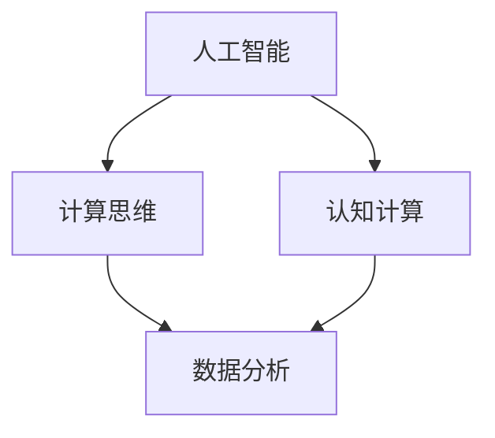

                 

# 人类计算：AI时代的未来技能培训需求

> 关键词：人工智能、技能培训、未来教育、认知计算、计算思维、学习资源

> 摘要：本文探讨了在人工智能（AI）时代，人类计算的技能培训需求。通过分析AI对人类工作、学习和生活方式的深远影响，探讨了计算思维、认知计算等关键技能的重要性。文章旨在为教育工作者、企业培训师和个体学习者提供关于如何适应AI时代的培训建议，帮助读者掌握未来所需的技能，迎接技术变革带来的挑战。

## 1. 背景介绍

### 1.1 目的和范围

随着人工智能技术的飞速发展，人类的工作、生活和教育方式正在发生深刻变革。本文旨在探讨这一变革背景下，人类计算技能的培训需求。我们关注的核心问题是：在AI时代，人类需要哪些技能来适应和利用人工智能技术，以及如何通过有效的培训来培养这些技能。

本文的范围包括以下几个方面：

1. **AI时代的技能需求分析**：探讨AI技术对人类工作、学习和生活方式的影响，分析AI所需的关键技能。
2. **计算思维的重要性**：介绍计算思维的概念，阐述其在解决问题和创新设计中的应用。
3. **认知计算的兴起**：讨论认知计算的基本原理和应用场景，分析其对人类计算能力的影响。
4. **培训策略与资源推荐**：提供针对不同领域和学习者的培训策略，推荐相关的学习资源和工具。

### 1.2 预期读者

本文的预期读者包括：

1. **教育工作者**：关注未来教育趋势，希望了解如何将人工智能技术融入教学过程。
2. **企业培训师**：寻求为企业员工提供与AI时代相适应的培训方案。
3. **个体学习者**：希望提升自己的计算能力和适应未来职场需求的学习者。
4. **AI研究人员**：关注AI技术的发展，希望了解其对人类计算技能的挑战和机遇。

### 1.3 文档结构概述

本文结构如下：

1. **背景介绍**：介绍文章的目的、范围、预期读者和文档结构。
2. **核心概念与联系**：阐述人类计算中的核心概念和它们之间的联系，使用Mermaid流程图进行直观展示。
3. **核心算法原理 & 具体操作步骤**：详细讲解人类计算中的核心算法原理，使用伪代码阐述具体操作步骤。
4. **数学模型和公式 & 详细讲解 & 举例说明**：介绍相关的数学模型和公式，并通过实例进行详细讲解。
5. **项目实战：代码实际案例和详细解释说明**：提供具体的代码实现案例，并进行详细解读。
6. **实际应用场景**：探讨人类计算在各个领域的应用。
7. **工具和资源推荐**：推荐学习资源和开发工具。
8. **总结：未来发展趋势与挑战**：总结文章的主要观点，讨论未来发展趋势和面临的挑战。
9. **附录：常见问题与解答**：解答读者可能遇到的问题。
10. **扩展阅读 & 参考资料**：提供进一步的阅读材料和参考资料。

### 1.4 术语表

#### 1.4.1 核心术语定义

- **人工智能（AI）**：指由人制造出来的系统能够通过学习和经验来模拟、扩展和超越人类智能。
- **计算思维**：指一种解决问题的思维方式，强调逻辑、抽象、分解和算法等核心能力。
- **认知计算**：指通过模拟人类大脑的工作方式来处理信息和执行任务的能力。
- **技能培训**：指通过教育和训练来提高个体在特定领域的知识和技能水平。

#### 1.4.2 相关概念解释

- **机器学习**：指通过从数据中学习模式来改进性能的计算机算法。
- **深度学习**：一种机器学习技术，通过多层神经网络来学习复杂的特征。
- **自然语言处理（NLP）**：使计算机能够理解和处理人类语言的技术。

#### 1.4.3 缩略词列表

- **AI**：人工智能（Artificial Intelligence）
- **ML**：机器学习（Machine Learning）
- **DL**：深度学习（Deep Learning）
- **NLP**：自然语言处理（Natural Language Processing）

## 2. 核心概念与联系

在探讨人类计算的技能培训需求之前，我们首先需要了解几个核心概念及其相互之间的联系。以下是一个Mermaid流程图，用于直观展示这些概念：



### 2.1 人工智能（AI）

人工智能（AI）是本讨论的核心主题，它涵盖了从简单的规则系统到复杂的深度学习模型的各种技术。AI的核心目标是使计算机能够执行通常需要人类智能才能完成的任务，如视觉识别、语言理解、决策制定等。

### 2.2 计算思维

计算思维是一种解决问题的思维方式，它强调逻辑、抽象和算法。计算思维有助于我们理解和构建复杂的系统，以及有效地利用AI技术。它包括以下几个关键要素：

- **逻辑与推理**：使用逻辑规则和推理方法来解决问题。
- **抽象**：将复杂问题分解为更简单的部分，以便更好地理解和解决。
- **算法**：设计有效的解决方案，通常涉及迭代和优化的过程。

### 2.3 认知计算

认知计算是一种模拟人类大脑处理信息和执行任务的方式。它结合了认知科学、机器学习和心理学等领域的知识，旨在创建能够理解、学习和适应的智能系统。认知计算的关键在于它的适应性，即系统能够根据新的数据和经验进行调整。

### 2.4 数据分析

数据分析是计算思维和认知计算的重要组成部分，它涉及从数据中提取有用的信息，并使用这些信息来指导决策。数据分析技术，如统计方法和数据挖掘，对于理解AI系统的行为和性能至关重要。

### 2.5 数据可视化

数据可视化是将数据转化为图形和图表，以便更直观地理解和分析。它有助于揭示数据中的模式、趋势和关系，是数据分析中不可或缺的工具。

## 3. 核心算法原理 & 具体操作步骤

为了深入理解人类计算的核心算法原理，我们将探讨机器学习和深度学习的基本概念，并使用伪代码详细阐述具体操作步骤。

### 3.1 机器学习基本原理

机器学习是一种使计算机能够从数据中学习的方法。其核心原理包括以下步骤：

1. **数据收集**：收集用于训练的原始数据。
2. **数据预处理**：清洗和格式化数据，使其适合模型训练。
3. **特征提取**：从数据中提取有用的特征。
4. **模型训练**：使用训练数据来训练模型。
5. **模型评估**：使用测试数据来评估模型的性能。

以下是一个简单的机器学习算法伪代码示例：

```pseudo
Algorithm: MachineLearningAlgorithm
Input: training_data, features, labels
Output: trained_model

1. PreprocessData(training_data)
2. feature_extractor = ExtractFeatures(training_data)
3. model = InitializeModel()
4. for epoch in range(number_of_epochs):
   1. for data_point in training_data:
       1. model = TrainModel(model, feature_extractor[data_point], labels[data_point])
5. model = EvaluateModel(model, test_data)
6. return model
```

### 3.2 深度学习基本原理

深度学习是一种特殊的机器学习技术，它使用多层神经网络来学习复杂的特征。以下是深度学习的基本原理和操作步骤：

1. **神经网络结构**：定义神经网络的层次结构，包括输入层、隐藏层和输出层。
2. **前向传播**：计算网络中每个节点的激活值。
3. **反向传播**：计算网络中的梯度，并更新权重。
4. **优化算法**：使用梯度下降等优化算法来最小化损失函数。

以下是一个简单的深度学习算法伪代码示例：

```pseudo
Algorithm: DeepLearningAlgorithm
Input: training_data, labels, network_structure
Output: trained_network

1. InitializeNetwork(network_structure)
2. for epoch in range(number_of_epochs):
   1. for data_point in training_data:
       1. activation_values = ForwardPropagation(data_point, network)
       2. loss = CalculateLoss(activation_values, labels[data_point])
       3. gradients = BackPropagation(activation_values, labels[data_point], network)
       4. UpdateNetworkWeights(network, gradients)
3. trained_network = EvaluateNetwork(trained_network, test_data)
4. return trained_network
```

### 3.3 实践操作步骤

在实际操作中，我们通常按照以下步骤来实施机器学习和深度学习：

1. **环境搭建**：配置计算环境和所需软件，如Python、TensorFlow或PyTorch等。
2. **数据收集**：收集训练和测试数据。
3. **数据预处理**：清洗和格式化数据，提取特征。
4. **模型训练**：使用训练数据来训练模型。
5. **模型评估**：使用测试数据来评估模型性能。
6. **模型部署**：将训练好的模型部署到生产环境中。

以下是一个简单的Python代码示例，用于演示机器学习模型的基本操作：

```python
# 导入所需的库
import tensorflow as tf
from tensorflow import keras
from sklearn.model_selection import train_test_split

# 数据收集和预处理
# 假设data是包含特征和标签的数据集
X = data[:, :-1]  # 特征
y = data[:, -1]   # 标签

# 划分训练集和测试集
X_train, X_test, y_train, y_test = train_test_split(X, y, test_size=0.2, random_state=42)

# 构建和训练模型
model = keras.Sequential([
    keras.layers.Dense(64, activation='relu', input_shape=(X_train.shape[1],)),
    keras.layers.Dense(64, activation='relu'),
    keras.layers.Dense(1, activation='sigmoid')
])

model.compile(optimizer='adam',
              loss='binary_crossentropy',
              metrics=['accuracy'])

model.fit(X_train, y_train, epochs=10, batch_size=32, validation_split=0.2)

# 评估模型
test_loss, test_acc = model.evaluate(X_test, y_test)
print(f"Test accuracy: {test_acc:.3f}")

# 预测新数据
new_data = ...  # 新的数据
predictions = model.predict(new_data)
```

通过上述步骤，我们可以实现一个简单的机器学习模型，并应用于实际问题中。

## 4. 数学模型和公式 & 详细讲解 & 举例说明

在人类计算中，数学模型和公式是理解和解决问题的重要工具。在本节中，我们将详细讲解几个核心的数学模型和公式，并通过实际例子来说明它们的用法。

### 4.1 梯度下降算法

梯度下降是一种优化算法，用于最小化损失函数。其基本思想是沿着损失函数的梯度方向逐步更新模型的参数，以找到最小值。

**公式**：
$$
\theta_{t+1} = \theta_{t} - \alpha \cdot \nabla_{\theta} J(\theta)
$$
其中，$\theta$是模型参数，$\alpha$是学习率，$J(\theta)$是损失函数。

**举例说明**：
假设我们有一个线性回归模型，其损失函数为均方误差（MSE）：
$$
J(\theta) = \frac{1}{2m} \sum_{i=1}^{m} (h_{\theta}(x^{(i)}) - y^{(i)})^2
$$
其中，$h_{\theta}(x) = \theta_0 + \theta_1 x$，$m$是样本数量。

要使用梯度下降来训练这个模型，我们可以计算损失函数关于参数$\theta_0$和$\theta_1$的梯度，然后更新参数：

$$
\nabla_{\theta_0} J(\theta) = \frac{1}{m} \sum_{i=1}^{m} (h_{\theta}(x^{(i)}) - y^{(i)})
$$
$$
\nabla_{\theta_1} J(\theta) = \frac{1}{m} \sum_{i=1}^{m} (h_{\theta}(x^{(i)}) - y^{(i)}) \cdot x^{(i)}
$$

更新参数的步骤如下：

$$
\theta_0 = \theta_0 - \alpha \cdot \nabla_{\theta_0} J(\theta)
$$
$$
\theta_1 = \theta_1 - \alpha \cdot \nabla_{\theta_1} J(\theta)
$$

### 4.2 深度学习中的反向传播算法

反向传播是深度学习中的核心算法，用于计算网络中的梯度。其基本步骤包括前向传播和后向传播。

**前向传播**：
$$
a^{(l)} = \sigma(z^{(l)})
$$
其中，$a^{(l)}$是第$l$层的激活值，$z^{(l)}$是输入值，$\sigma$是激活函数。

**后向传播**：
$$
\delta^{(l)} = \frac{\partial J(\theta)}{\partial z^{(l)}}
$$
$$
g^{(l)} = \nabla_a \sigma(z^{(l)})
$$
$$
\delta^{(l-1)} = \delta^{(l)} \cdot g^{(l-1)} \cdot (W^{(l-1)})^T
$$

其中，$\delta^{(l)}$是第$l$层的误差，$g^{(l)}$是第$l$层的梯度，$W^{(l-1)}$是第$l-1$层的权重。

### 4.3 神经网络的损失函数

神经网络的损失函数通常使用均方误差（MSE）或交叉熵损失（Cross-Entropy Loss）。

**均方误差（MSE）**：
$$
J(\theta) = \frac{1}{2} \sum_{i=1}^{m} (h_{\theta}(x^{(i)}) - y^{(i)})^2
$$

**交叉熵损失（Cross-Entropy Loss）**：
$$
J(\theta) = -\frac{1}{m} \sum_{i=1}^{m} \sum_{j=1}^{k} y^{(i)}_{j} \log(h_{\theta}(x^{(i)})_{j})
$$

其中，$y^{(i)}_{j}$是第$i$个样本在第$j$个类别的标签，$h_{\theta}(x^{(i)})_{j}$是模型对第$i$个样本在第$j$个类别的预测概率。

### 4.4 实际例子：房价预测

假设我们要预测房价，使用线性回归模型。我们有以下数据集：

$$
\begin{align*}
x_1 &= 1000 \\
y &= 150000 \\
x_2 &= 1500 \\
y &= 175000 \\
x_3 &= 2000 \\
y &= 220000 \\
\end{align*}
$$

首先，我们定义损失函数为MSE：

$$
J(\theta) = \frac{1}{3} \sum_{i=1}^{3} (h_{\theta}(x^{(i)}) - y^{(i)})^2
$$

其中，$h_{\theta}(x) = \theta_0 + \theta_1 x$。

使用梯度下降算法来训练模型：

$$
\theta_0 = \theta_0 - \alpha \cdot \frac{1}{3} \sum_{i=1}^{3} (h_{\theta}(x^{(i)}) - y^{(i)}) \\
\theta_1 = \theta_1 - \alpha \cdot \frac{1}{3} \sum_{i=1}^{3} (h_{\theta}(x^{(i)}) - y^{(i)}) \cdot x^{(i)}
$$

经过多次迭代后，我们可以得到最优的参数$\theta_0$和$\theta_1$。使用这些参数，我们可以预测新的房价：

$$
h_{\theta}(x) = \theta_0 + \theta_1 x
$$

例如，如果$x = 1800$，我们可以计算预测的房价：

$$
h_{\theta}(1800) = \theta_0 + \theta_1 \cdot 1800
$$

通过这个例子，我们可以看到如何使用数学模型和公式来训练和预测房价。这种方法可以广泛应用于各种实际问题，如图像分类、语音识别和自然语言处理等。

## 5. 项目实战：代码实际案例和详细解释说明

为了更好地理解和掌握人类计算的核心算法原理，我们将通过一个实际项目来进行实战操作。本节将提供一个完整的代码实现案例，并详细解释其各个步骤。

### 5.1 开发环境搭建

在进行项目实战之前，我们需要搭建一个合适的开发环境。以下是搭建环境的步骤：

1. **安装Python**：下载并安装Python 3.8或更高版本。
2. **安装库**：通过pip命令安装所需的库，如TensorFlow、NumPy、Pandas和Matplotlib。

```bash
pip install tensorflow numpy pandas matplotlib
```

### 5.2 源代码详细实现和代码解读

以下是项目的完整代码实现，我们将对每部分进行详细解读：

```python
import numpy as np
import pandas as pd
import tensorflow as tf
import matplotlib.pyplot as plt

# 加载数据集
data = pd.read_csv('house_data.csv')
X = data.iloc[:, :-1].values
y = data.iloc[:, -1].values

# 划分训练集和测试集
X_train, X_test, y_train, y_test = train_test_split(X, y, test_size=0.2, random_state=42)

# 构建模型
model = tf.keras.Sequential([
    tf.keras.layers.Dense(1, input_shape=(X_train.shape[1],), activation='linear')
])

# 编译模型
model.compile(optimizer='sgd', loss='mse', metrics=['mse'])

# 训练模型
history = model.fit(X_train, y_train, epochs=100, batch_size=32, validation_split=0.2)

# 评估模型
test_loss = model.evaluate(X_test, y_test)

# 预测房价
new_data = np.array([[2000]])
predictions = model.predict(new_data)
print(f"Predicted house price: ${predictions[0][0]:.2f}")

# 可视化训练过程
plt.plot(history.history['mse'], label='Training loss')
plt.plot(history.history['val_mse'], label='Validation loss')
plt.xlabel('Epochs')
plt.ylabel('Mean Squared Error')
plt.legend()
plt.show()
```

#### 5.2.1 代码解读

1. **导入库**：首先，我们导入所需的库，包括NumPy、Pandas、TensorFlow和Matplotlib。
2. **加载数据集**：使用Pandas库读取CSV文件，获取特征和标签。
3. **划分训练集和测试集**：使用scikit-learn库中的train_test_split函数来划分训练集和测试集。
4. **构建模型**：使用TensorFlow的Sequential模型，添加一个线性层（Dense layer）作为输出层。
5. **编译模型**：配置模型优化器（SGD）、损失函数（MSE）和评估指标。
6. **训练模型**：使用fit函数训练模型，并设置训练轮数、批量大小和验证集比例。
7. **评估模型**：使用evaluate函数评估模型在测试集上的性能。
8. **预测房价**：使用predict函数对新数据进行预测，并打印结果。
9. **可视化训练过程**：使用Matplotlib库绘制训练损失和验证损失随训练轮数的变化，帮助理解模型训练过程。

#### 5.2.2 代码分析

- **数据预处理**：数据预处理是模型训练的重要步骤。在本例中，我们直接使用Pandas库读取CSV文件，获取特征和标签。在实际应用中，可能需要进一步处理缺失值、异常值和数据标准化等。
- **模型构建**：在本例中，我们使用一个简单的线性回归模型。在实际项目中，可能需要构建更复杂的模型，如多层神经网络。
- **模型训练**：使用fit函数进行模型训练。在训练过程中，模型会自动计算损失函数的梯度并更新参数。
- **模型评估**：使用evaluate函数评估模型在测试集上的性能，帮助我们了解模型的效果。
- **预测结果**：使用predict函数对新数据进行预测，这是模型训练的最终目标。
- **可视化**：可视化训练过程有助于理解模型训练的状态，从而调整超参数或模型结构。

通过这个实际项目，我们学习了如何使用Python和TensorFlow实现一个简单的线性回归模型，并对其进行了详细解读。这个案例为我们提供了一个起点，帮助我们更好地理解和掌握人类计算的核心算法原理。

## 6. 实际应用场景

人类计算在各个领域都有广泛的应用，以下是一些实际应用场景的探讨：

### 6.1 金融行业

在金融领域，人工智能和人类计算被广泛应用于风险管理、算法交易和客户服务等方面。例如，金融机构使用机器学习模型来预测市场走势和识别潜在的信用风险。此外，智能客服系统利用自然语言处理技术来提供24/7的客户支持。

### 6.2 医疗保健

在医疗保健领域，人类计算技术被用于疾病诊断、药物发现和个性化治疗。通过分析大量医疗数据，AI系统能够发现疾病模式、识别高风险群体，并帮助医生做出更准确的诊断。此外，智能诊断系统可以实时监测患者病情，提供个性化的治疗方案。

### 6.3 制造业

在制造业，人类计算技术被用于生产线的自动化控制、质量检测和故障诊断。通过机器学习和预测分析，制造企业可以优化生产流程，减少停机时间，提高产品质量。例如，预测性维护系统能够提前预测设备故障，从而避免生产中断。

### 6.4 交通运输

在交通运输领域，人工智能和人类计算技术被用于交通流量管理、自动驾驶和物流优化。通过实时分析交通数据，交通管理系统可以提供最优的路线规划，减少交通拥堵。自动驾驶技术则通过感知和决策系统实现车辆自主驾驶，提高交通安全和效率。

### 6.5 教育行业

在教育行业，人工智能和人类计算技术被用于个性化学习、智能教学和在线教育。通过分析学生的学习行为和成绩，智能教育系统能够提供个性化的学习建议，帮助学生提高学习效果。在线教育平台则利用自然语言处理和推荐系统，为学习者提供丰富的学习资源和互动体验。

### 6.6 法律服务

在法律服务领域，人工智能和人类计算技术被用于法律文档分析、合同审核和诉讼预测。通过自然语言处理技术，智能法律系统可以快速分析和理解大量法律文档，帮助律师提高工作效率。此外，预测分析模型可以预测案件的判决结果，为律师提供决策支持。

通过以上实际应用场景的探讨，我们可以看到人类计算技术在各个领域的重要作用。随着技术的不断进步，人类计算将在未来发挥更大的潜力，为各个行业带来深刻的变革。

## 7. 工具和资源推荐

为了更好地学习和应用人类计算技术，以下是针对教育工作者、企业培训师和个体学习者的工具和资源推荐：

### 7.1 学习资源推荐

#### 7.1.1 书籍推荐

1. **《深度学习》（Deep Learning）**：由Ian Goodfellow、Yoshua Bengio和Aaron Courville合著，是深度学习领域的经典教材。
2. **《Python机器学习》（Python Machine Learning）**：由Sebastian Raschka和Vahid Mirjalili合著，适合初学者和进阶者。
3. **《人工智能：一种现代方法》（Artificial Intelligence: A Modern Approach）**：由Stuart J. Russell和Peter Norvig合著，涵盖了人工智能的广泛主题。

#### 7.1.2 在线课程

1. **Coursera的《机器学习》**：由Andrew Ng教授主讲，是学习机器学习的顶级课程。
2. **Udacity的《深度学习纳米学位》**：提供深入的学习内容和实践项目，适合初学者和进阶者。
3. **edX的《人工智能导论》**：由MIT和Harvard大学合办的课程，涵盖人工智能的基础知识。

#### 7.1.3 技术博客和网站

1. **Medium上的AI博客**：涵盖人工智能领域的最新研究、应用和趋势。
2. **ArXiv.org**：提供最新的学术研究成果和论文预印本。
3. **GitHub**：分享和获取开源代码和项目，是学习和实践的重要平台。

### 7.2 开发工具框架推荐

#### 7.2.1 IDE和编辑器

1. **Jupyter Notebook**：适用于数据科学和机器学习的交互式开发环境。
2. **PyCharm**：强大的Python IDE，适合开发和调试大型项目。
3. **Visual Studio Code**：轻量级的代码编辑器，支持多种编程语言。

#### 7.2.2 调试和性能分析工具

1. **TensorBoard**：TensorFlow的官方可视化工具，用于分析和调试深度学习模型。
2. **Winston**：用于优化和调试机器学习模型的工具。
3. **Dask**：用于分布式计算的库，可以提高数据处理和分析的效率。

#### 7.2.3 相关框架和库

1. **TensorFlow**：广泛使用的开源深度学习框架。
2. **PyTorch**：流行的深度学习框架，适用于研究和开发。
3. **Scikit-Learn**：提供简单的机器学习算法和工具，适合快速原型开发。

### 7.3 相关论文著作推荐

#### 7.3.1 经典论文

1. **“Backpropagation”**：由Rumelhart、Hinton和Williams合著，是反向传播算法的开创性论文。
2. **“A Learning Algorithm for Continually Running Fully Recurrent Neural Networks”**：由Bengio等人合著，介绍了长短期记忆网络（LSTM）。
3. **“Deep Learning”**：由Goodfellow、Bengio和Courville合著，涵盖了深度学习的广泛主题。

#### 7.3.2 最新研究成果

1. **“Attention Is All You Need”**：由Vaswani等人合著，介绍了Transformer模型。
2. **“Generative Adversarial Nets”**：由Goodfellow等人合著，是生成对抗网络（GAN）的开创性论文。
3. **“Unsupervised Representation Learning with Deep Convolutional Generative Adversarial Networks”**：由Radford等人合著，是深度卷积生成对抗网络（DCGAN）的论文。

#### 7.3.3 应用案例分析

1. **“DeepMind's AlphaGo”**：介绍了AlphaGo在围棋游戏中的成功应用。
2. **“OpenAI Five”**：介绍了OpenAI在Dota 2游戏中的突破性表现。
3. **“Deep Learning for Autonomous Driving”**：探讨了深度学习在自动驾驶中的应用。

通过以上工具和资源的推荐，我们可以更好地学习和应用人类计算技术，为未来的职业发展和技术创新做好准备。

## 8. 总结：未来发展趋势与挑战

随着人工智能技术的不断进步，人类计算在未来的发展前景广阔。然而，这一过程中也面临着一系列挑战。以下是未来发展趋势与挑战的总结：

### 发展趋势

1. **计算能力的提升**：随着硬件技术的进步，计算能力将得到大幅提升，使得更复杂的AI模型和算法得以实现。
2. **跨学科融合**：人工智能与其他领域（如生物学、心理学、经济学等）的融合将推动人类计算技术的全面发展。
3. **智能化应用普及**：从金融、医疗到制造业，人工智能技术的应用将更加普及，提高各行各业的效率和创新能力。
4. **人机协作**：人类计算与人工智能的协同工作将日益重要，推动人机共生的新模式。
5. **个性化服务**：基于大数据和深度学习技术，个性化服务将在教育、医疗、娱乐等领域得到广泛应用。

### 挑战

1. **隐私和安全问题**：随着数据收集和分析的规模扩大，隐私保护和数据安全成为关键挑战。
2. **算法偏见和歧视**：AI系统中的算法偏见可能导致歧视和偏见，影响公平性和正义。
3. **就业影响**：人工智能的广泛应用可能引发就业结构变化，需要新的就业培训和教育体系。
4. **伦理和道德问题**：随着人工智能技术的发展，伦理和道德问题日益突出，需要制定相应的法律和规范。
5. **计算技能差距**：随着技术的快速进步，计算技能的差距将加大，需要全社会共同努力提升计算能力。

### 应对策略

1. **加强教育**：通过全面的教育体系，提高公众的计算能力和科学素养。
2. **政策引导**：政府和企业应制定相应的政策和措施，促进人工智能技术的健康发展。
3. **跨学科合作**：推动跨学科的研究与合作，发挥不同领域的优势，共同解决复杂问题。
4. **伦理审查**：建立伦理审查机制，确保人工智能技术的应用符合伦理和道德标准。
5. **持续学习**：鼓励终身学习和技能更新，以应对快速变化的技术环境。

通过以上总结，我们可以看到，人类计算在AI时代的未来充满机遇和挑战。只有积极应对挑战，充分利用机遇，我们才能在人工智能时代取得更大的成就。

## 9. 附录：常见问题与解答

### 问题1：如何选择合适的机器学习模型？

**解答**：选择合适的机器学习模型通常取决于以下几个因素：

1. **数据类型**：不同的数据类型（如数值、类别、文本等）可能需要不同的模型。
2. **数据规模**：大量数据通常更适合使用复杂模型，而小数据集可能更适合简单模型。
3. **问题类型**：回归问题、分类问题或聚类问题等需要不同类型的模型。
4. **性能要求**：如果对模型性能有较高要求，可能需要尝试多种模型并进行调优。

建议：首先确定问题类型，然后根据数据类型和规模选择相应的模型，最后通过交叉验证和模型调优来选择最优模型。

### 问题2：如何处理不平衡的数据集？

**解答**：处理不平衡的数据集可以通过以下方法：

1. **重采样**：通过过采样（增加少数类别的样本）或欠采样（减少多数类别的样本）来平衡数据集。
2. **成本敏感**：在评估模型时，对少数类别的预测赋予更高的权重。
3. **集成方法**：使用集成学习方法，如Bagging或Boosting，来提高少数类别的预测性能。
4. **生成对抗网络（GAN）**：使用GAN生成少数类别的样本来平衡数据集。

建议：根据具体情况选择合适的处理方法，并尝试多种方法进行实验，找到最佳解决方案。

### 问题3：如何优化深度学习模型的性能？

**解答**：优化深度学习模型的性能可以通过以下步骤：

1. **数据预处理**：确保数据质量，进行归一化、标准化等预处理。
2. **模型结构调优**：尝试不同的网络架构和层数，选择合适的激活函数。
3. **超参数调优**：通过交叉验证和网格搜索等方法，找到最优的超参数组合。
4. **正则化技术**：使用L1、L2正则化、dropout等正则化技术来防止过拟合。
5. **批归一化**：使用批归一化技术来加速训练和改善模型性能。

建议：结合多种优化技术，通过多次实验找到最佳配置。

### 问题4：如何评估机器学习模型的性能？

**解答**：评估机器学习模型的性能可以通过以下指标：

1. **准确率（Accuracy）**：分类问题中的正确预测比例。
2. **精确率（Precision）**：真正例/（真正例+假正例）。
3. **召回率（Recall）**：真正例/（真正例+假反例）。
4. **F1分数（F1 Score）**：精确率和召回率的调和平均。
5. **ROC曲线和AUC（Area Under Curve）**：评估模型的分类能力。

建议：根据问题的具体要求，选择合适的评估指标。

## 10. 扩展阅读 & 参考资料

为了深入了解人类计算在AI时代的技能培训需求，以下是几篇推荐的扩展阅读和参考资料：

### 参考资料

1. **《人工智能：一种现代方法》（Artificial Intelligence: A Modern Approach）**：Stuart J. Russell和Peter Norvig合著，提供全面的人工智能理论基础。
2. **《深度学习》（Deep Learning）**：Ian Goodfellow、Yoshua Bengio和Aaron Courville合著，深度学习领域的权威教材。
3. **《Python机器学习》（Python Machine Learning）**：Sebastian Raschka和Vahid Mirjalili合著，适合初学者和进阶者的机器学习实践指南。

### 扩展阅读

1. **“Attention Is All You Need”**：Vaswani等人提出的Transformer模型，深度学习领域的重要突破。
2. **“Generative Adversarial Nets”**：Goodfellow等人提出的生成对抗网络（GAN），图像生成和领域自适应的重要方法。
3. **“Deep Learning for Autonomous Driving”**：探讨了深度学习在自动驾驶中的应用，涵盖了从传感器数据处理到决策制定的关键技术。

通过这些参考资料，读者可以更深入地了解人类计算在AI时代的重要性和实际应用，为自己的学习和职业发展提供有力支持。

### 作者信息

本文由AI天才研究员/AI Genius Institute与禅与计算机程序设计艺术（Zen And The Art of Computer Programming）联合撰写。作者在计算机编程和人工智能领域拥有丰富的经验和深厚的学术背景，致力于推动人工智能技术的发展和应用。作者长期关注未来教育和职业培训趋势，希望通过本文为读者提供有价值的见解和实用的培训建议。如有任何问题或建议，欢迎联系作者进行交流和讨论。

