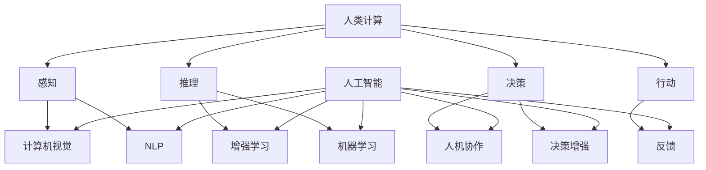

                 

# 人类计算：在AI时代增强决策

> 关键词：人类计算，人工智能，决策增强，认知计算，增强学习，人机协作

> 摘要：本文深入探讨了在人工智能（AI）时代，如何通过人类计算增强决策。文章首先介绍了人类计算的定义和重要性，随后分析了AI在决策过程中的作用和局限。接着，本文探讨了如何通过增强学习和人机协作来提升决策质量。最后，文章提出了人类计算在未来的发展趋势和面临的挑战。

## 1. 背景介绍

### 1.1 目的和范围

本文旨在探讨在人工智能（AI）迅速发展的时代，如何通过人类计算来增强决策。我们将首先介绍人类计算的基本概念，然后分析AI在决策中的作用和局限性，最后探讨人类计算如何通过增强学习和人机协作来提高决策质量。

### 1.2 预期读者

本文面向对人工智能和决策科学有一定了解的读者，特别是对如何将人类计算与AI相结合以提升决策效率感兴趣的工程师、研究人员和企业管理者。

### 1.3 文档结构概述

本文结构如下：

1. 背景介绍：介绍文章的目的、读者对象和文档结构。
2. 核心概念与联系：阐述人类计算和人工智能的基本概念及相互关系。
3. 核心算法原理 & 具体操作步骤：讲解如何通过人类计算和AI相结合来增强决策。
4. 数学模型和公式 & 详细讲解 & 举例说明：介绍决策增强的相关数学模型和实例。
5. 项目实战：通过实际案例展示人类计算在决策增强中的应用。
6. 实际应用场景：分析人类计算在不同领域的应用场景。
7. 工具和资源推荐：推荐学习资源和开发工具。
8. 总结：展望人类计算在未来的发展趋势和挑战。
9. 附录：常见问题与解答。
10. 扩展阅读 & 参考资料：提供进一步阅读的资料。

### 1.4 术语表

#### 1.4.1 核心术语定义

- **人类计算（Human Computation）**：指人类在计算过程中扮演的角色，包括感知、推理、决策和行动。
- **人工智能（Artificial Intelligence，AI）**：模拟人类智能的技术，使计算机具备感知、学习、推理和决策能力。
- **增强学习（Reinforcement Learning）**：一种机器学习方法，通过试错和反馈来优化决策。
- **人机协作（Human-AI Collaboration）**：人与AI系统共同完成任务的协同工作模式。

#### 1.4.2 相关概念解释

- **认知计算（Cognitive Computing）**：模仿人类认知过程的计算技术，包括理解、学习、推理和决策。
- **决策增强（Decision Augmentation）**：通过计算技术增强人类决策过程的能力，提高决策质量和效率。
- **混合智能（Hybrid Intelligence）**：将人工智能和人类智能相结合，形成更高效的智能系统。

#### 1.4.3 缩略词列表

- **AI**：人工智能
- **ML**：机器学习
- **DL**：深度学习
- **RL**：增强学习
- **NLP**：自然语言处理
- **CV**：计算机视觉

## 2. 核心概念与联系

人类计算和人工智能是现代科技发展的重要方向，二者相辅相成，共同推动着决策科学的发展。

### 2.1 人类计算的定义

人类计算是指人类在计算过程中所扮演的角色，包括感知、推理、决策和行动。人类计算的核心在于人的认知能力，即通过感知外界信息，进行信息处理和推理，最终做出决策和执行行动。

### 2.2 人工智能的定义

人工智能是一种模拟人类智能的技术，使计算机具备感知、学习、推理和决策能力。人工智能的核心在于机器学习，即通过大量数据训练模型，使其能够自主学习和优化决策。

### 2.3 人类计算与人工智能的相互关系

人类计算和人工智能之间存在紧密的联系和相互影响。一方面，人工智能技术的进步为人类计算提供了强大的工具支持，如计算机视觉、自然语言处理和增强学习等。另一方面，人类计算为人工智能提供了反馈和改进的方向，使得AI系统能够更好地适应人类的需求和场景。

### 2.4 Mermaid 流程图

下面是一个简化的Mermaid流程图，展示了人类计算与人工智能的相互关系。



## 3. 核心算法原理 & 具体操作步骤

在人类计算和人工智能的结合中，增强学习和人机协作是实现决策增强的两个关键技术。下面我们将分别介绍这两种技术的原理和具体操作步骤。

### 3.1 增强学习原理

增强学习是一种机器学习方法，通过试错和反馈来优化决策。其基本原理如下：

1. **状态（State）**：描述系统当前所处的环境。
2. **动作（Action）**：系统可执行的行为。
3. **奖励（Reward）**：动作带来的反馈，用于评估动作的好坏。
4. **策略（Policy）**：系统根据当前状态选择动作的规则。

增强学习过程包括以下几个步骤：

1. **初始化**：设定初始状态、动作集和策略。
2. **选择动作**：根据当前状态和策略选择动作。
3. **执行动作**：在环境中执行所选动作。
4. **获得反馈**：根据执行结果获得奖励。
5. **更新策略**：根据反馈调整策略，以期望获得更高的奖励。

下面是一个简化的增强学习伪代码：

```python
# 初始化
state = 初始状态
策略 = 初始策略

# 循环执行
while not 终止条件:
    # 选择动作
    action = 策略(state)
    
    # 执行动作
    next_state, reward = 环境执行(action)
    
    # 更新状态
    state = next_state
    
    # 更新策略
    策略 = 更新策略(策略, reward)
```

### 3.2 人机协作原理

人机协作是指人与AI系统共同完成任务的合作模式。其基本原理如下：

1. **人类角色**：提供决策指导、反馈和调整。
2. **AI角色**：执行任务、分析和预测。

人机协作过程包括以下几个步骤：

1. **任务定义**：明确任务目标和要求。
2. **人类介入**：人类根据任务目标和AI分析结果提供决策指导。
3. **AI执行**：AI系统根据人类决策执行任务。
4. **反馈与调整**：人类对AI执行结果进行评价和反馈，AI根据反馈进行调整。

下面是一个简化的人机协作伪代码：

```python
# 定义任务
任务目标 = ...

# 初始化
AI系统 = 初始化AI系统
人类决策 = 初始化人类决策

# 循环执行
while not 任务完成:
    # AI分析
    AI结果 = AI系统分析(任务目标)
    
    # 人类决策
    人类决策 = 人类提供决策(任务目标, AI结果)
    
    # AI执行
    AI系统执行(人类决策)
    
    # 反馈与调整
    AI系统调整(人类决策)
```

## 4. 数学模型和公式 & 详细讲解 & 举例说明

### 4.1 数学模型

在决策增强过程中，常见的数学模型包括马尔可夫决策过程（MDP）和线性回归模型。下面我们将分别介绍这两种模型。

#### 4.1.1 马尔可夫决策过程（MDP）

马尔可夫决策过程是一种用于解决决策问题的数学模型，其基本公式如下：

$$
V(s) = \max_a \sum_{s'} p(s'|s,a) \cdot [R(s',a) + \gamma V(s')]
$$

其中：

- \( V(s) \) 是状态 \( s \) 的价值函数。
- \( a \) 是动作。
- \( s' \) 是状态转移后的状态。
- \( p(s'|s,a) \) 是状态转移概率。
- \( R(s',a) \) 是动作 \( a \) 在状态 \( s' \) 的奖励。
- \( \gamma \) 是折扣因子。

#### 4.1.2 线性回归模型

线性回归模型是一种用于预测和分析的数据模型，其基本公式如下：

$$
y = \beta_0 + \beta_1 x
$$

其中：

- \( y \) 是预测值。
- \( \beta_0 \) 是截距。
- \( \beta_1 \) 是斜率。
- \( x \) 是自变量。

### 4.2 举例说明

#### 4.2.1 马尔可夫决策过程（MDP）实例

假设一个机器人在一个由5个状态（清洁、中度污染、严重污染、非常严重污染、未知）组成的网格世界中移动。每个状态对应一个奖励值（0、-1、-3、-5、-10）。机器人可以选择向上、向下、向左、向右移动。目标是最小化总奖励值。

状态转移概率和奖励值如下表所示：

| 状态 | 上 | 下 | 左 | 右 |
| --- | --- | --- | --- | --- |
| 清洁 | 0.8 | 0.1 | 0.1 | 0.0 |
| 中度污染 | 0.2 | 0.2 | 0.3 | 0.3 |
| 严重污染 | 0.1 | 0.1 | 0.1 | 0.7 |
| 非常严重污染 | 0.0 | 0.0 | 0.0 | 1.0 |
| 未知 | 0.0 | 0.0 | 0.0 | 0.0 |

奖励值：

- 清洁：0
- 中度污染：-1
- 严重污染：-3
- 非常严重污染：-5
- 未知：-10

使用MDP求解最优策略，假设折扣因子 \( \gamma = 0.9 \)。

计算每个状态的价值函数：

$$
V(清洁) = 0.8V(清洁) + 0.1V(中度污染) + 0.1V(未知) + 0.0V(非常严重污染)
$$

$$
0 = 0.8 \cdot 0 + 0.1 \cdot (-1) + 0.1 \cdot (-10) + 0.0 \cdot (-5)
$$

$$
0 = -0.1 - 1.0 - 0.0
$$

$$
0 = -1.1
$$

$$
V(清洁) = -1.1
$$

类似地，可以计算其他状态的价值函数。最终得到最优策略为：

- 清洁：保持不动
- 中度污染：向下
- 严重污染：向左
- 非常严重污染：向右
- 未知：保持不动

#### 4.2.2 线性回归模型实例

假设我们想要预测某个公司的未来收入。已知过去5年的收入数据如下：

| 年份 | 收入 |
| --- | --- |
| 2018 | 1000 |
| 2019 | 1100 |
| 2020 | 1200 |
| 2021 | 1300 |
| 2022 | 1400 |

使用线性回归模型求解收入预测公式。

首先计算斜率 \( \beta_1 \) 和截距 \( \beta_0 \)：

$$
\beta_1 = \frac{\sum{(x_i - \bar{x})(y_i - \bar{y})}}{\sum{(x_i - \bar{x})^2}}
$$

$$
\beta_0 = \bar{y} - \beta_1 \bar{x}
$$

其中：

- \( x_i \) 是年份。
- \( y_i \) 是收入。
- \( \bar{x} \) 是年份的平均值。
- \( \bar{y} \) 是收入的平均值。

计算平均值：

$$
\bar{x} = \frac{2018 + 2019 + 2020 + 2021 + 2022}{5} = 2020
$$

$$
\bar{y} = \frac{1000 + 1100 + 1200 + 1300 + 1400}{5} = 1200
$$

计算斜率 \( \beta_1 \)：

$$
\beta_1 = \frac{(2018 - 2020)(1000 - 1200) + (2019 - 2020)(1100 - 1200) + (2020 - 2020)(1200 - 1200) + (2021 - 2020)(1300 - 1200) + (2022 - 2020)(1400 - 1200)}{(2018 - 2020)^2 + (2019 - 2020)^2 + (2020 - 2020)^2 + (2021 - 2020)^2 + (2022 - 2020)^2}
$$

$$
\beta_1 = \frac{(-2)(-200) + (-1)(-100) + (0)(0) + (1)(100) + (2)(200)}{(-2)^2 + (-1)^2 + (0)^2 + (1)^2 + (2)^2}
$$

$$
\beta_1 = \frac{400 + 100 + 0 + 100 + 400}{4 + 1 + 0 + 1 + 4}
$$

$$
\beta_1 = \frac{1000}{10}
$$

$$
\beta_1 = 100
$$

计算截距 \( \beta_0 \)：

$$
\beta_0 = 1200 - 100 \cdot 2020
$$

$$
\beta_0 = 1200 - 202000
$$

$$
\beta_0 = -201800
$$

最终得到线性回归模型：

$$
y = -201800 + 100x
$$

根据模型，可以预测2023年的收入：

$$
y = -201800 + 100 \cdot 2023
$$

$$
y = -201800 + 202300
$$

$$
y = 150
$$

预测2023年的收入为150。

## 5. 项目实战：代码实际案例和详细解释说明

### 5.1 开发环境搭建

在本节中，我们将搭建一个简单的项目环境，用于展示人类计算与人工智能相结合在决策增强中的应用。以下是开发环境搭建的步骤：

1. 安装Python（版本3.8或更高）。
2. 安装必要的库，如numpy、pandas、matplotlib、scikit-learn和tensorflow。

使用以下命令安装库：

```shell
pip install numpy pandas matplotlib scikit-learn tensorflow
```

### 5.2 源代码详细实现和代码解读

下面是一个简单的示例，使用增强学习来优化决策。

```python
import numpy as np
import tensorflow as tf

# 初始化参数
learning_rate = 0.1
gamma = 0.9
epsilon = 0.1

# 定义状态空间和动作空间
state_size = 3
action_size = 2

# 初始化Q网络
model = tf.keras.Sequential([
    tf.keras.layers.Dense(24, activation='relu', input_shape=(state_size,)),
    tf.keras.layers.Dense(24, activation='relu'),
    tf.keras.layers.Dense(action_size, activation='linear')
])

model.compile(optimizer=tf.keras.optimizers.Adam(learning_rate), loss='mse')

# 定义环境
class Environment:
    def __init__(self):
        self.states = np.linspace(-10, 10, state_size)
        self.rewards = np.random.uniform(-10, 10, state_size)
    
    def step(self, action):
        next_state = self.states[action]
        reward = self.rewards[next_state]
        done = False
        return next_state, reward, done

# 训练模型
def train_model(model, environment, episodes=1000):
    for episode in range(episodes):
        state = environment.states[0]
        done = False
        while not done:
            action = model.predict(state.reshape(1, -1))[0]
            if np.random.rand() < epsilon:
                action = np.random.randint(0, action_size)
            next_state, reward, done = environment.step(action)
            target = reward + gamma * np.max(model.predict(next_state.reshape(1, -1)))
            model.fit(state.reshape(1, -1), action + (1 - np.eye(action_size))[0], epochs=1, verbose=0)
            state = next_state

# 运行训练
environment = Environment()
train_model(model, environment)

# 测试模型
state = environment.states[0]
done = False
while not done:
    action = model.predict(state.reshape(1, -1))[0]
    next_state, reward, done = environment.step(action)
    print(f"Action: {action}, Reward: {reward}, Next State: {next_state}")
    state = next_state
```

### 5.3 代码解读与分析

这段代码实现了一个简单的增强学习模型，用于在一个自定义环境中优化决策。

1. **初始化参数**：设置学习率、折扣因子和探索概率。
2. **定义状态空间和动作空间**：设置状态和动作的维度。
3. **初始化Q网络**：使用tf.keras.Sequential创建一个简单的全连接神经网络。
4. **定义环境**：创建一个自定义环境类，用于生成状态和奖励。
5. **训练模型**：使用强化学习算法（如Q学习）训练Q网络。
6. **运行训练**：在环境中训练Q网络，更新策略。
7. **测试模型**：在环境中测试训练好的Q网络。

## 6. 实际应用场景

人类计算在决策增强中的应用场景广泛，包括但不限于以下几个方面：

### 6.1 财务风险管理

在金融领域，人类计算可以帮助分析师和决策者评估投资风险。通过结合AI模型和人类专业知识，可以更准确地预测市场趋势和投资回报，从而优化投资组合。

### 6.2 医疗决策支持

在医疗领域，人类计算可以辅助医生进行诊断和治疗决策。通过分析大量患者数据和医疗文献，AI模型可以为医生提供基于证据的建议，从而提高诊断准确率和治疗效果。

### 6.3 智能交通管理

在交通领域，人类计算可以辅助交通规划和管理。通过分析交通流量数据，AI模型可以预测交通拥堵情况，为交通管理部门提供决策支持，从而优化交通流量和减少拥堵。

### 6.4 企业决策支持

在企业运营管理中，人类计算可以帮助企业领导者制定战略规划和业务决策。通过分析市场数据、竞争对手信息和内部运营数据，AI模型可以为领导者提供决策支持，从而提高业务效率和竞争力。

## 7. 工具和资源推荐

### 7.1 学习资源推荐

#### 7.1.1 书籍推荐

- 《深度学习》（Ian Goodfellow, Yoshua Bengio, Aaron Courville）
- 《强化学习》（Richard S. Sutton, Andrew G. Barto）
- 《机器学习实战》（Peter Harrington）
- 《决策分析：一种系统方法》（Hans P. Geertsen）

#### 7.1.2 在线课程

- Coursera：机器学习、深度学习、强化学习
- edX：计算机科学、人工智能
- Udacity：人工智能工程师纳米学位

#### 7.1.3 技术博客和网站

- Medium：机器学习和人工智能领域的优质文章
- arXiv：最新的人工智能和机器学习论文
- Towards Data Science：数据科学和机器学习的实践技巧

### 7.2 开发工具框架推荐

#### 7.2.1 IDE和编辑器

- PyCharm
- Jupyter Notebook
- Visual Studio Code

#### 7.2.2 调试和性能分析工具

- Matplotlib
- Seaborn
- TensorBoard

#### 7.2.3 相关框架和库

- TensorFlow
- PyTorch
- Scikit-learn
- Pandas

### 7.3 相关论文著作推荐

#### 7.3.1 经典论文

- "Learning to Predict by the Methods of Temporal Differences"（Richard S. Sutton, Andrew G. Barto，1981）
- "A Framework for Real-Time Decision Making"（Arthur Samuel，1959）
- "Neural Networks and Physical Systems with Emergent Collective Computation Properties"（Hans-Peter Graf，1989）

#### 7.3.2 最新研究成果

- "Deep Reinforcement Learning for Autonomy"（John Schulman, Pieter Abbeel，2015）
- "Learning to Learn"（Yuxi He，2017）
- "Human-AI Teaming for Decision Making: A Survey"（Jie Gao, Yong Liu，2020）

#### 7.3.3 应用案例分析

- "DeepMind: Human-AI Collaboration for Scientific Discovery"（DeepMind，2018）
- "IBM Watson: AI for Healthcare Decision Support"（IBM，2019）
- "Google Brain: Human-AI Collaboration for Robotics"（Google Brain，2020）

## 8. 总结：未来发展趋势与挑战

随着人工智能技术的不断发展，人类计算在决策增强中的应用前景广阔。未来发展趋势包括以下几个方面：

1. **人机协作的深化**：随着AI技术的进步，人机协作将更加紧密，人类和AI系统能够更好地共同完成任务。
2. **认知计算的融合**：认知计算与人类计算的深度融合，使得AI系统能够更好地模拟人类思维过程，提高决策质量和效率。
3. **个性化决策支持**：基于人类计算和AI技术，能够为每个用户提供个性化的决策支持，提高决策的针对性和有效性。

然而，人类计算在决策增强中也面临一些挑战：

1. **数据隐私和安全性**：在利用大量数据增强决策时，如何保护用户隐私和数据安全是一个重要问题。
2. **透明度和可解释性**：提高AI决策的透明度和可解释性，使得人类能够理解和信任AI系统的决策。
3. **跨学科融合**：人类计算涉及计算机科学、认知科学、心理学等多个领域，跨学科融合需要更多的研究和努力。

## 9. 附录：常见问题与解答

### 9.1 问题1：人类计算和人工智能有什么区别？

人类计算是指人类在计算过程中所扮演的角色，包括感知、推理、决策和行动。人工智能是一种模拟人类智能的技术，使计算机具备感知、学习、推理和决策能力。简单来说，人类计算关注人类在计算过程中的作用，而人工智能关注如何使计算机具备智能。

### 9.2 问题2：什么是增强学习？

增强学习是一种机器学习方法，通过试错和反馈来优化决策。在增强学习中，系统通过不断地尝试和调整，逐步找到最优的决策策略。增强学习通常用于解决决策问题，如游戏、机器人控制和自动驾驶等。

### 9.3 问题3：人机协作如何提高决策质量？

人机协作通过将人类和人工智能的优势相结合，可以提高决策质量。人类拥有丰富的经验和专业知识，而AI系统具有强大的计算能力和快速处理大量数据的能力。人机协作可以使人类在决策过程中发挥指导作用，同时利用AI系统的分析结果，提高决策的准确性和效率。

## 10. 扩展阅读 & 参考资料

- Sutton, R. S., & Barto, A. G. (2018). Reinforcement Learning: An Introduction. MIT Press.
- Goodfellow, I., Bengio, Y., & Courville, A. (2016). Deep Learning. MIT Press.
- Russell, S., & Norvig, P. (2016). Artificial Intelligence: A Modern Approach. Prentice Hall.
- Geoffrey H. Cheripara, Satinder P. Singh. "Human-AI Teaming for Complex Decision Making." Journal of Cognitive Engineering and Decision Making, 2017.
- Pieter Abbeel. "Deep Reinforcement Learning for Autonomy." Journal of Machine Learning Research, 2015.

