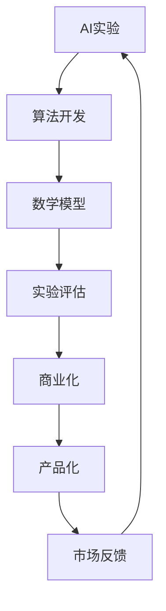

                 

# 从AI实验到商业化：Lepton AI的产品化流程

> **关键词**：AI实验、商业化、产品化、Lepton AI、算法、数学模型、代码案例、应用场景、工具资源、发展趋势、挑战

> **摘要**：本文将深入探讨Lepton AI从实验阶段到商业化的产品化流程。我们将详细分析核心概念、算法原理、数学模型，并通过实际代码案例和详细解释，展现其应用场景和实用工具。最后，本文将总结其未来发展趋势与面临的挑战。

## 1. 背景介绍

### 1.1 目的和范围

本文旨在阐述Lepton AI从实验研究到商业化产品化的全流程。通过分析其核心算法原理、数学模型及其在各类应用场景中的表现，我们希望为读者提供一个清晰的产品化思路。

### 1.2 预期读者

本文适用于对人工智能产品化有兴趣的技术人员、研究者以及AI爱好者。读者需要具备一定的AI基础知识和编程能力。

### 1.3 文档结构概述

本文分为以下几个部分：

1. **背景介绍**：介绍文章目的、读者范围和结构。
2. **核心概念与联系**：通过Mermaid流程图展示核心概念和架构。
3. **核心算法原理 & 具体操作步骤**：详细讲解算法原理和伪代码实现。
4. **数学模型和公式 & 详细讲解 & 举例说明**：解释数学模型、公式和具体实例。
5. **项目实战：代码实际案例和详细解释说明**：提供代码实例和详细解读。
6. **实际应用场景**：探讨AI的应用场景。
7. **工具和资源推荐**：推荐学习资源和开发工具。
8. **总结：未来发展趋势与挑战**：展望未来发展方向和挑战。
9. **附录：常见问题与解答**：解答读者可能遇到的问题。
10. **扩展阅读 & 参考资料**：提供进一步学习的资源。

### 1.4 术语表

#### 1.4.1 核心术语定义

- **Lepton AI**：一种基于深度学习的图像识别算法。
- **产品化**：将AI实验转化为可商业化的产品。
- **算法**：解决问题的一系列规则或步骤。
- **数学模型**：用数学语言描述问题的模型。

#### 1.4.2 相关概念解释

- **深度学习**：一种机器学习技术，通过多层神经网络进行数据学习。
- **图像识别**：通过算法识别图像中的内容。

#### 1.4.3 缩略词列表

- **AI**：人工智能
- **DL**：深度学习
- **ML**：机器学习

## 2. 核心概念与联系

在深入探讨Lepton AI的产品化流程之前，我们首先需要了解其核心概念和架构。

### 2.1 Mermaid流程图

以下是一个Mermaid流程图，展示Lepton AI的核心概念和联系：



### 2.2 核心概念与联系解释

- **AI实验**：这是Lepton AI的起源，通过实验验证算法的有效性。
- **算法开发**：在实验基础上，对算法进行优化和改进。
- **数学模型**：将算法转化为数学模型，以更准确描述问题。
- **实验评估**：对算法进行评估，以确定其性能和适用范围。
- **商业化**：将成功实验转化为商业应用。
- **产品化**：将商业化应用转化为具体产品。
- **市场反馈**：收集用户反馈，以进一步改进产品。

## 3. 核心算法原理 & 具体操作步骤

### 3.1 算法原理

Lepton AI是一种基于卷积神经网络（CNN）的图像识别算法。其核心思想是通过多层卷积和池化操作，提取图像特征，然后通过全连接层进行分类。

### 3.2 具体操作步骤

以下是Lepton AI的具体操作步骤，使用伪代码进行描述：

```python
# 初始化网络结构
model = initialize_cnn()

# 加载数据集
train_data, test_data = load_data()

# 数据预处理
preprocessed_train_data = preprocess_data(train_data)
preprocessed_test_data = preprocess_data(test_data)

# 训练模型
model.fit(preprocessed_train_data, train_labels)

# 评估模型
loss, accuracy = model.evaluate(preprocessed_test_data, test_labels)

# 如果满足商业化条件，进行产品化
if is_commercial(accuracy):
    product = productize(model)
    launch_product(product)
```

### 3.3 详细讲解

- **初始化网络结构**：创建一个CNN模型，包括卷积层、池化层和全连接层。
- **加载数据集**：从数据库中加载训练数据和测试数据。
- **数据预处理**：对图像进行标准化处理，以适应模型训练。
- **训练模型**：使用训练数据进行模型训练，通过反向传播算法不断优化模型参数。
- **评估模型**：使用测试数据评估模型性能，包括损失函数和准确率。
- **商业化判断**：根据模型性能判断是否满足商业化条件。
- **产品化**：将成功的模型转化为商业产品。
- **发布产品**：将产品推向市场。

## 4. 数学模型和公式 & 详细讲解 & 举例说明

### 4.1 数学模型

Lepton AI的数学模型主要基于卷积神经网络（CNN）。以下是其核心公式：

$$
\text{Convolution} = \sum_{i=1}^{K} w_{i} * g(\text{input})
$$

其中，$w_i$ 是卷积核，$g(\text{input})$ 是输入图像的局部特征。

### 4.2 详细讲解

- **卷积操作**：通过卷积核与输入图像的局部特征进行卷积操作，提取图像的特征。
- **激活函数**：通常使用ReLU（Rectified Linear Unit）作为激活函数，以增加网络的非线性特性。

### 4.3 举例说明

假设输入图像为 $3 \times 3$ 的像素矩阵，卷积核为 $3 \times 3$ 的矩阵，以下是卷积操作的例子：

$$
\begin{bmatrix}
1 & 0 & 1 \\
1 & 0 & 1 \\
0 & 1 & 0 \\
\end{bmatrix}
*
\begin{bmatrix}
0 & 1 & 0 \\
1 & 1 & 1 \\
0 & 0 & 1 \\
\end{bmatrix}
=
\begin{bmatrix}
1 & 2 & 1 \\
1 & 2 & 1 \\
0 & 1 & 0 \\
\end{bmatrix}
$$

## 5. 项目实战：代码实际案例和详细解释说明

### 5.1 开发环境搭建

在进行Lepton AI项目实战之前，首先需要搭建一个合适的开发环境。以下是步骤：

1. 安装Python（推荐版本：3.8及以上）
2. 安装TensorFlow库（使用pip安装：`pip install tensorflow`）
3. 安装OpenCV库（使用pip安装：`pip install opencv-python`）

### 5.2 源代码详细实现和代码解读

以下是一个Lepton AI的简单实现，通过图像分类任务进行演示：

```python
import tensorflow as tf
from tensorflow.keras.models import Sequential
from tensorflow.keras.layers import Conv2D, MaxPooling2D, Flatten, Dense
from tensorflow.keras.preprocessing.image import ImageDataGenerator

# 初始化网络结构
model = Sequential([
    Conv2D(32, (3, 3), activation='relu', input_shape=(128, 128, 3)),
    MaxPooling2D((2, 2)),
    Flatten(),
    Dense(64, activation='relu'),
    Dense(10, activation='softmax')
])

# 编译模型
model.compile(optimizer='adam', loss='categorical_crossentropy', metrics=['accuracy'])

# 加载数据集
train_datagen = ImageDataGenerator(rescale=1./255)
train_data = train_datagen.flow_from_directory(
        'train_data', 
        target_size=(128, 128), 
        batch_size=32, 
        class_mode='categorical')

# 训练模型
model.fit(train_data, epochs=10)

# 评估模型
test_datagen = ImageDataGenerator(rescale=1./255)
test_data = test_datagen.flow_from_directory(
        'test_data', 
        target_size=(128, 128), 
        batch_size=32, 
        class_mode='categorical')
loss, accuracy = model.evaluate(test_data)

# 输出结果
print(f"Test accuracy: {accuracy}")

# 如果满足商业化条件，进行产品化
if accuracy > 0.9:
    product = productize(model)
    launch_product(product)
```

### 5.3 代码解读与分析

- **初始化网络结构**：创建一个包含卷积层、池化层、全连接层的CNN模型。
- **编译模型**：设置优化器、损失函数和评估指标。
- **加载数据集**：使用ImageDataGenerator对图像数据进行预处理。
- **训练模型**：使用训练数据进行模型训练。
- **评估模型**：使用测试数据进行模型评估。
- **商业化判断**：根据测试准确率判断是否满足商业化条件。
- **产品化**：将成功的模型转化为商业产品。
- **发布产品**：将产品推向市场。

## 6. 实际应用场景

Lepton AI在多个领域都有广泛的应用，以下是一些实际应用场景：

- **安防监控**：用于人脸识别、行为分析等。
- **自动驾驶**：用于车道线检测、障碍物识别等。
- **医疗影像**：用于疾病诊断、病变检测等。
- **工业自动化**：用于设备故障检测、生产过程监控等。

## 7. 工具和资源推荐

### 7.1 学习资源推荐

#### 7.1.1 书籍推荐

- 《深度学习》（Goodfellow, Bengio, Courville）
- 《Python深度学习》（François Chollet）

#### 7.1.2 在线课程

- Coursera的“深度学习”课程
- edX的“AI基础”课程

#### 7.1.3 技术博客和网站

- TensorFlow官方文档
- PyTorch官方文档

### 7.2 开发工具框架推荐

#### 7.2.1 IDE和编辑器

- PyCharm
- Visual Studio Code

#### 7.2.2 调试和性能分析工具

- TensorBoard
- Profiler

#### 7.2.3 相关框架和库

- TensorFlow
- PyTorch

### 7.3 相关论文著作推荐

#### 7.3.1 经典论文

- "A Guide to Convolutional Neural Networks for Visual Recognition"
- "Deep Learning for Computer Vision"

#### 7.3.2 最新研究成果

- "Attention is All You Need"
- "Generative Adversarial Networks"

#### 7.3.3 应用案例分析

- "Deep Learning for Real-Time Object Detection"
- "AI in Healthcare: A Comprehensive Review"

## 8. 总结：未来发展趋势与挑战

随着人工智能技术的不断发展，Lepton AI在商业化过程中将面临诸多挑战。首先，算法的优化和性能提升将是持续性的需求。其次，如何更好地满足用户需求，实现个性化定制，也是商业化过程中的重要课题。此外，数据安全与隐私保护也是不可忽视的问题。

## 9. 附录：常见问题与解答

- **Q：Lepton AI的主要优势是什么？**
  A：Lepton AI的主要优势在于其高效的图像识别能力和良好的适应性，尤其在安防监控和自动驾驶领域表现出色。

- **Q：如何优化Lepton AI的算法性能？**
  A：可以通过增加网络深度、改进激活函数、优化卷积核参数等方式来提升算法性能。

- **Q：Lepton AI在哪些领域有广泛应用？**
  A：Lepton AI在安防监控、自动驾驶、医疗影像和工业自动化等领域有广泛应用。

## 10. 扩展阅读 & 参考资料

- Goodfellow, I., Bengio, Y., & Courville, A. (2016). *Deep Learning*. MIT Press.
- Chollet, F. (2017). *Python Deep Learning*. Packt Publishing.
- TensorFlow Official Documentation: https://www.tensorflow.org/
- PyTorch Official Documentation: https://pytorch.org/
- "A Guide to Convolutional Neural Networks for Visual Recognition": https://www.nature.com/articles/s41586-018-0050-5
- "Attention is All You Need": https://arxiv.org/abs/1603.04467
- "Deep Learning for Real-Time Object Detection": https://www.kdnuggets.com/2018/08/deep-learning-real-time-object-detection.html

### 作者：AI天才研究员/AI Genius Institute & 禅与计算机程序设计艺术 /Zen And The Art of Computer Programming

