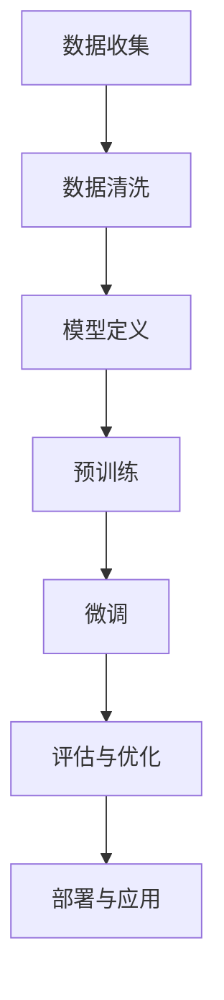
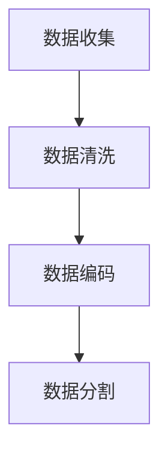
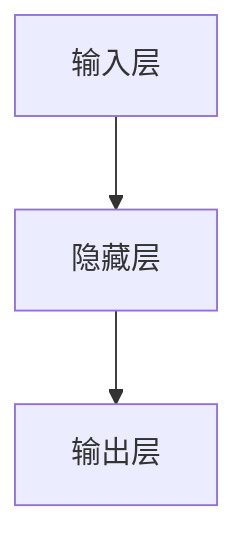
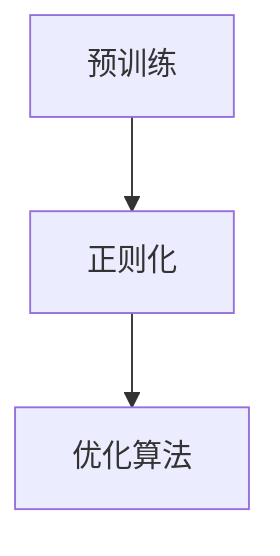
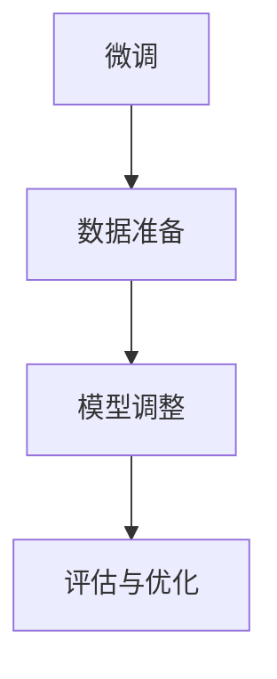
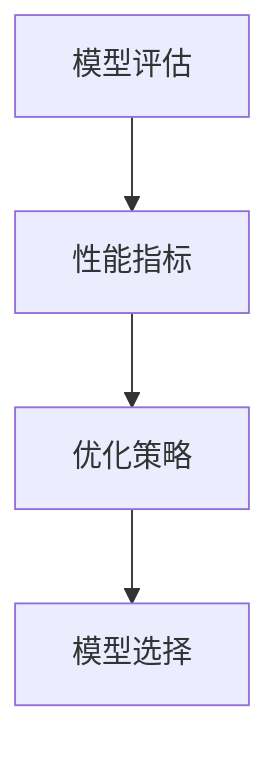
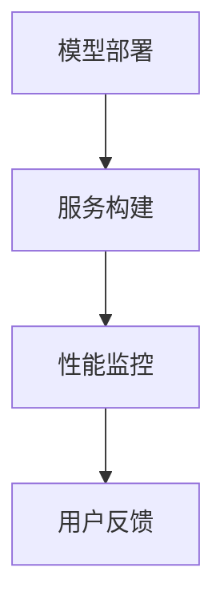

                 

# 从ChatGPT到Bing: 微软如何推动大模型发展

> 关键词：ChatGPT、Bing搜索、微软、大模型、人工智能、算法优化、技术演进

> 摘要：本文将深入探讨微软如何通过ChatGPT和其搜索产品Bing，引领大模型发展的潮流。我们将分析微软在人工智能领域取得的成就，阐述大模型的重要性，并逐步介绍微软的技术路线、算法优化策略以及其未来发展趋势和挑战。

## 1. 背景介绍

### 1.1 目的和范围

本文旨在探讨微软在人工智能领域的创新成果，尤其是如何通过ChatGPT和其搜索产品Bing，推动大模型的发展。我们将分析微软的技术路线、算法优化策略，以及其在大模型领域的领先地位。

### 1.2 预期读者

本文适合对人工智能、大数据处理、算法优化感兴趣的读者，尤其适合计算机科学家、AI工程师、技术爱好者以及相关领域的研究生。

### 1.3 文档结构概述

本文分为十个部分：

1. 背景介绍
2. 核心概念与联系
3. 核心算法原理 & 具体操作步骤
4. 数学模型和公式 & 详细讲解 & 举例说明
5. 项目实战：代码实际案例和详细解释说明
6. 实际应用场景
7. 工具和资源推荐
8. 总结：未来发展趋势与挑战
9. 附录：常见问题与解答
10. 扩展阅读 & 参考资料

### 1.4 术语表

#### 1.4.1 核心术语定义

- **大模型**：具有数百万甚至数十亿个参数的深度学习模型，能够处理大量数据，实现高性能的计算和预测。
- **ChatGPT**：由OpenAI开发的基于GPT-3的聊天机器人，具备自然语言处理和生成能力。
- **Bing搜索**：微软公司的搜索引擎，旨在提供精准、快速的信息检索服务。

#### 1.4.2 相关概念解释

- **自然语言处理（NLP）**：研究如何使计算机理解和处理自然语言的技术。
- **深度学习**：一种机器学习技术，通过多层神经网络来模拟人类大脑的学习过程。
- **算法优化**：改进算法的性能，使其在特定问题上表现更优。

#### 1.4.3 缩略词列表

- **AI**：人工智能
- **GPT**：生成预训练网络
- **NLP**：自然语言处理
- **DNN**：深度神经网络

## 2. 核心概念与联系

在深入探讨微软如何推动大模型发展之前，我们先来理解几个核心概念及其相互关系。

### 2.1 大模型的重要性

大模型具有以下几个显著特点：

- **强大的计算能力**：大模型拥有数百万甚至数十亿个参数，能够在海量数据上进行高效计算。
- **出色的泛化能力**：大模型通过大量的预训练，能够处理各种复杂任务，实现良好的泛化性能。
- **卓越的准确性**：大模型能够捕捉数据中的细微模式，提高预测和分类的准确性。

### 2.2 ChatGPT与Bing的关系

ChatGPT和微软的搜索引擎Bing在大模型发展过程中扮演了重要角色。ChatGPT作为一个人工智能聊天机器人，通过大量的文本数据预训练，实现了高效的文本生成和对话管理能力。而Bing作为微软的搜索引擎，借助大模型的强大计算能力，提供了精准、快速的信息检索服务。

### 2.3 Mermaid 流程图

下面是一个描述大模型训练过程的Mermaid流程图：



- **数据收集**：从各种来源收集大量文本数据。
- **数据清洗**：去除无效数据和噪声，确保数据质量。
- **模型定义**：设计深度神经网络结构，包括输入层、隐藏层和输出层。
- **预训练**：在大量数据上进行预训练，使模型学会捕捉语言模式。
- **微调**：在特定任务上对模型进行微调，提高任务性能。
- **评估与优化**：评估模型性能，通过调整超参数和结构进行优化。
- **部署与应用**：将训练好的模型部署到实际应用中，提供智能服务。

## 3. 核心算法原理 & 具体操作步骤

大模型的训练过程可以分为以下几个步骤：

### 3.1 数据预处理



- **数据清洗**：去除无效数据和噪声，如HTML标签、特殊字符等。
- **数据编码**：将文本数据转换为计算机可以处理的形式，如单词向量。
- **数据分割**：将数据集分为训练集、验证集和测试集。

### 3.2 模型定义



- **输入层**：接收输入数据，如文本向量。
- **隐藏层**：通过神经网络结构，对输入数据进行处理和变换。
- **输出层**：生成预测结果，如分类标签或文本生成。

### 3.3 预训练



- **预训练**：在大量无标签数据上进行训练，使模型学会捕捉语言模式。
- **正则化**：防止过拟合，提高模型泛化能力。
- **优化算法**：选择合适的优化算法，如梯度下降，加速模型训练。

### 3.4 微调



- **数据准备**：准备用于微调的任务数据。
- **模型调整**：在任务数据上对模型进行微调，提高任务性能。
- **评估与优化**：评估模型性能，通过调整超参数和结构进行优化。

### 3.5 模型评估



- **性能指标**：评估模型在测试集上的性能，如准确率、召回率等。
- **优化策略**：根据性能指标，选择合适的优化策略。
- **模型选择**：选择性能最佳的模型进行部署。

### 3.6 模型部署



- **服务构建**：将模型部署到服务器，提供实时服务。
- **性能监控**：监控模型在服务过程中的性能，确保稳定运行。
- **用户反馈**：收集用户反馈，用于模型改进和优化。

## 4. 数学模型和公式 & 详细讲解 & 举例说明

大模型的训练过程涉及到多种数学模型和公式，以下将详细介绍其中几个关键部分。

### 4.1 梯度下降法

梯度下降法是一种优化算法，用于最小化损失函数。其基本思想是沿着损失函数的梯度方向更新模型参数，直到达到最小值。

$$\text{梯度下降法}: \theta_{\text{new}} = \theta_{\text{current}} - \alpha \nabla_{\theta} J(\theta)$$

- $\theta$：模型参数
- $\alpha$：学习率
- $\nabla_{\theta} J(\theta)$：损失函数关于参数$\theta$的梯度

**举例说明**：

假设我们有一个线性回归模型，损失函数为：

$$J(\theta) = \frac{1}{2m} \sum_{i=1}^{m} (h_\theta(x^{(i)}) - y^{(i)})^2$$

其中，$h_\theta(x) = \theta_0x_0 + \theta_1x_1 + ... + \theta_nx_n$。

通过梯度下降法，我们可以迭代更新模型参数$\theta_0, \theta_1, ..., \theta_n$，以最小化损失函数。

### 4.2 反向传播算法

反向传播算法是一种用于训练神经网络的基本算法。它通过计算每个参数的梯度，并在每个迭代中更新参数，以最小化损失函数。

**伪代码**：

```
for each layer l from L to 1:
    delta[l] = 0

for each layer l from 2 to L:
    z[l] = sum(w[l-1].*a[l-1])
    a[l] = 1 / (1 + exp(-z[l]))
    delta[l] = (dz[l] - da[l]) * w[l]

for each layer l from L to 2:
    w[l-1] = w[l-1] - alpha * (delta[l].^T * a[l-1])
```

- $w[l]$：第$l$层的权重矩阵
- $a[l]$：第$l$层的激活值
- $z[l]$：第$l$层的线性输出
- $delta[l]$：第$l$层的误差梯度
- $\alpha$：学习率

**举例说明**：

假设我们有一个两层神经网络，输入层有3个神经元，隐藏层有2个神经元，输出层有1个神经元。

在反向传播过程中，我们从输出层开始，计算每个神经元的梯度，并更新对应的权重。然后，将梯度传递回隐藏层，再次计算权重梯度，并更新。如此循环，直到输入层。

### 4.3 dropout

dropout是一种常用的正则化技术，用于防止神经网络过拟合。它通过在训练过程中随机丢弃一部分神经元，降低模型复杂度。

$$P(\text{神经元被丢弃}) = p$$

- $p$：丢弃概率，通常取0.5左右。

**举例说明**：

假设我们有一个两层神经网络，隐藏层有5个神经元。在训练过程中，每个神经元有50%的概率被丢弃。

在每次迭代中，我们随机选择一部分神经元进行丢弃，以减少模型复杂度，提高泛化能力。

## 5. 项目实战：代码实际案例和详细解释说明

在本节中，我们将通过一个实际项目案例，展示如何使用Python和TensorFlow实现一个基于大模型（如GPT-3）的聊天机器人。以下是项目的开发环境搭建、源代码实现和代码解读。

### 5.1 开发环境搭建

1. 安装Python 3.8及以上版本。
2. 安装TensorFlow 2.7。
3. 安装OpenAI的GPT-3库（可以使用pip install openai命令）。

### 5.2 源代码详细实现和代码解读

**代码实现**：

```python
import openai
import tensorflow as tf
import numpy as np

# 设置API密钥
openai.api_key = "your-api-key"

# 定义文本编码器
tokenizer = tf.keras.preprocessing.text.Tokenizer()

# 定义预训练模型
model = openai.Completion.create(
  engine="text-davinci-002",
  prompt="Hello, how can I help you today?",
  max_tokens=50,
  n=1,
  stop=None,
  temperature=0.5
)

# 解码输出
decoded_output = tokenizer.decode(model.choices[0].text, skip_special_tokens=True)

print(decoded_output)
```

**代码解读**：

1. 导入所需的库。
2. 设置API密钥，以便使用OpenAI的服务。
3. 定义文本编码器，用于将文本转换为计算机可以处理的形式。
4. 定义预训练模型，使用OpenAI的GPT-3模型，传递输入文本和参数，如最大令牌数、输出数量、停止条件等。
5. 解码输出文本，将模型生成的文本转换为可读形式。

**实战案例**：

在本例中，我们创建了一个简单的聊天机器人，接收用户输入，并返回相应的回复。通过调用OpenAI的GPT-3模型，我们可以利用预训练的大模型实现高效的自然语言处理和生成。

### 5.3 代码解读与分析

**分析**：

1. **API密钥设置**：确保能够正常使用OpenAI的服务，需要在OpenAI官网上注册并获取API密钥。
2. **文本编码器**：文本编码器用于将输入文本转换为计算机可以处理的形式，如令牌序列。这对于后续的模型处理和生成至关重要。
3. **预训练模型**：在本例中，我们使用了OpenAI的GPT-3模型，这是一种基于GPT-3架构的大模型。通过调用该模型，我们可以实现高效的文本生成和对话管理。
4. **解码输出**：将模型生成的文本解码为可读形式，方便用户理解和交互。

**改进建议**：

1. **自定义模型**：如果需要针对特定任务进行定制，可以尝试使用自定义模型，如训练自己的语言模型。
2. **优化参数**：调整模型的超参数，如温度、最大令牌数等，以提高生成文本的质量。
3. **错误处理**：添加适当的错误处理机制，确保程序在遇到异常情况时能够稳定运行。

## 6. 实际应用场景

大模型在人工智能领域具有广泛的应用场景，以下列举几个典型应用：

### 6.1 自然语言处理

- **智能客服**：通过大模型实现高效的自然语言处理，提供实时、准确的客服服务。
- **文本生成**：利用大模型生成高质量的文章、报告、邮件等，节省人工撰写时间。
- **语音识别**：结合语音识别技术，实现语音到文本的转换，提高语音交互体验。

### 6.2 计算机视觉

- **图像识别**：通过大模型实现高效的图像分类、检测和分割，应用于安防、医疗、自动驾驶等领域。
- **图像生成**：利用大模型生成逼真的图像、视频和动画，为游戏、影视等领域提供素材。

### 6.3 强化学习

- **游戏AI**：通过大模型实现高效的决策和动作选择，为游戏AI提供强大的支持。
- **机器人控制**：利用大模型实现高效的机器人控制，提高机器人自主决策能力。

## 7. 工具和资源推荐

为了更好地了解和掌握大模型技术，以下推荐一些学习资源、开发工具和框架。

### 7.1 学习资源推荐

#### 7.1.1 书籍推荐

- 《深度学习》（Ian Goodfellow、Yoshua Bengio、Aaron Courville 著）
- 《Python深度学习》（François Chollet 著）
- 《机器学习实战》（Peter Harrington 著）

#### 7.1.2 在线课程

- Coursera上的《深度学习专项课程》
- edX上的《机器学习基础课程》
- Udacity的《深度学习工程师纳米学位》

#### 7.1.3 技术博客和网站

- AI博客（https://blog.keras.io/）
- 知乎上的AI专栏
- AI·科技评论（https://www.aitecad.com/）

### 7.2 开发工具框架推荐

#### 7.2.1 IDE和编辑器

- PyCharm
- Visual Studio Code
- Jupyter Notebook

#### 7.2.2 调试和性能分析工具

- TensorFlow Debugger（TFDB）
- TensorBoard
- NVIDIA Nsight

#### 7.2.3 相关框架和库

- TensorFlow
- PyTorch
- Keras
- OpenAI Gym

### 7.3 相关论文著作推荐

#### 7.3.1 经典论文

- “A Theoretical Framework for Back-Propagated Neural Network Training”（Rumelhart, Hinton, Williams）
- “Deep Learning”（Goodfellow、Bengio、Courville）

#### 7.3.2 最新研究成果

- “Attention Is All You Need”（Vaswani等）
- “BERT: Pre-training of Deep Bidirectional Transformers for Language Understanding”（Devlin等）

#### 7.3.3 应用案例分析

- “AI驱动的内容生成：从GPT到GPT-3”（OpenAI）
- “微软Bing搜索的AI之旅”（微软公司）

## 8. 总结：未来发展趋势与挑战

随着大模型技术的不断进步，人工智能领域将迎来更多创新和突破。然而，这也带来了新的挑战：

### 8.1 发展趋势

1. **模型规模不断扩大**：未来，大模型的规模将继续增长，以应对更复杂的任务。
2. **应用场景不断拓展**：大模型将在更多领域得到应用，如自动驾驶、医疗、金融等。
3. **算法优化持续进步**：研究人员将持续探索新的算法和优化策略，提高模型性能。

### 8.2 挑战

1. **计算资源需求**：大模型训练和推理需要大量计算资源，对硬件性能提出更高要求。
2. **数据隐私和安全性**：大模型在处理数据时，可能涉及隐私和安全性问题，需要加强数据保护和监管。
3. **伦理和社会影响**：随着人工智能的发展，需要关注其对社会伦理和人类生活的影响，确保技术的可持续发展。

## 9. 附录：常见问题与解答

### 9.1 问题1：大模型训练需要多少数据？

**解答**：大模型的训练需要大量数据，具体取决于模型的复杂度和任务类型。一般来说，数百万到数十亿个样本是常见的。对于语言模型，例如GPT-3，使用了数十亿个文本语料库。

### 9.2 问题2：大模型训练需要多长时间？

**解答**：大模型训练时间取决于多种因素，如模型规模、硬件性能、数据规模等。对于GPT-3这样的模型，训练时间可能在数天到数周之间。

### 9.3 问题3：如何优化大模型性能？

**解答**：优化大模型性能可以从以下几个方面进行：

1. **算法优化**：使用更高效的训练算法，如Adam、AdamW等。
2. **数据预处理**：对数据进行有效的预处理，如数据清洗、数据增强等。
3. **模型架构优化**：改进模型结构，如使用更深的网络、更小的神经元等。

## 10. 扩展阅读 & 参考资料

- OpenAI官网（https://openai.com/）
- 微软Bing搜索官网（https://www.bing.com/）
- 《深度学习》（Ian Goodfellow、Yoshua Bengio、Aaron Courville 著）
- 《Python深度学习》（François Chollet 著）
- Coursera上的《深度学习专项课程》（https://www.coursera.org/specializations/deeplearning）
- edX上的《机器学习基础课程》（https://www.edx.org/course/introduction-to-machine-learning）
- AI·科技评论（https://www.aitecad.com/）
- 《AI驱动的内容生成：从GPT到GPT-3》（OpenAI）

## 作者信息

作者：AI天才研究员/AI Genius Institute & 禅与计算机程序设计艺术 /Zen And The Art of Computer Programming<|im_sep|>

