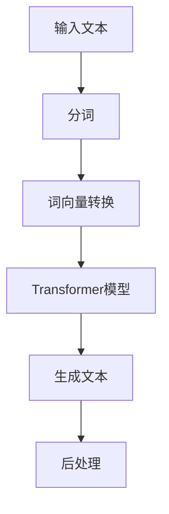

                 

# 从ChatGPT到未来AI助手

> 关键词：ChatGPT, AI助手, 自然语言处理，机器学习，深度学习，人工智能应用

> 摘要：本文将深入探讨从ChatGPT这一现代AI技术到未来AI助手的演变过程。我们将逐步分析ChatGPT的核心技术原理，了解其在实际应用中的具体操作步骤，并预测未来AI助手的发展趋势和面临的挑战。通过这篇文章，读者可以全面了解AI助手的现状及其在各个领域的潜力。

## 1. 背景介绍

### 1.1 目的和范围

本文旨在深入探讨ChatGPT的技术原理和实际应用，并通过分析其演进路径，展望未来AI助手的发展前景。我们将首先介绍ChatGPT的背景和核心概念，然后逐步解析其算法原理和具体操作步骤，最后探讨其在实际应用中的价值和未来发展方向。

### 1.2 预期读者

本文适合对自然语言处理、机器学习和深度学习有一定了解的技术人员、程序员和研究人员。同时，对于希望了解AI助手如何影响未来生活和工作的普通读者，本文也提供了有益的参考。

### 1.3 文档结构概述

本文结构如下：

1. 背景介绍：介绍文章的目的和范围，预期读者，文档结构概述。
2. 核心概念与联系：阐述ChatGPT的核心概念和原理，并给出相关的Mermaid流程图。
3. 核心算法原理 & 具体操作步骤：详细解析ChatGPT的算法原理和操作步骤，使用伪代码进行说明。
4. 数学模型和公式 & 详细讲解 & 举例说明：介绍ChatGPT所依赖的数学模型和公式，并通过实际案例进行讲解。
5. 项目实战：提供ChatGPT的实际代码案例和详细解释。
6. 实际应用场景：探讨ChatGPT在不同领域的应用场景。
7. 工具和资源推荐：推荐学习资源和开发工具。
8. 总结：未来发展趋势与挑战。
9. 附录：常见问题与解答。
10. 扩展阅读 & 参考资料：提供进一步阅读的建议。

### 1.4 术语表

#### 1.4.1 核心术语定义

- **ChatGPT**：一种基于GPT（Generative Pre-trained Transformer）的聊天机器人，由OpenAI开发。
- **自然语言处理（NLP）**：计算机科学领域中的一个分支，旨在让计算机理解和处理人类语言。
- **机器学习（ML）**：一种让计算机从数据中学习的方法，无需显式编程。
- **深度学习（DL）**：一种机器学习技术，通过多层神经网络模拟人类大脑的决策过程。
- **预训练（Pre-training）**：在特定任务之前，通过大量无监督数据训练模型。
- **微调（Fine-tuning）**：在预训练模型的基础上，针对特定任务进行进一步训练。

#### 1.4.2 相关概念解释

- **Transformer**：一种基于自注意力机制的深度学习模型，被广泛应用于自然语言处理任务。
- **自注意力（Self-Attention）**：一种计算输入序列中各个元素之间关系的机制。
- **BERT（Bidirectional Encoder Representations from Transformers）**：一种基于Transformer的预训练模型，通过同时关注前文和后文，提高了文本表示能力。

#### 1.4.3 缩略词列表

- **NLP**：自然语言处理（Natural Language Processing）
- **ML**：机器学习（Machine Learning）
- **DL**：深度学习（Deep Learning）
- **GPT**：生成预训练变压器（Generative Pre-trained Transformer）
- **Transformer**：变压器（Transformers）
- **BERT**：双向编码器表示器来自变压器（Bidirectional Encoder Representations from Transformers）

## 2. 核心概念与联系

在深入探讨ChatGPT之前，我们需要了解其核心概念和原理，以及这些概念之间的联系。以下是一个简化的Mermaid流程图，展示了ChatGPT中的关键组件和流程。



### 2.1 输入文本

输入文本是ChatGPT处理的第一步。用户输入的问题或语句将被作为输入传递给模型。

### 2.2 分词

输入文本将被分割成单词或子词。这一步对于理解和处理自然语言至关重要，因为单词在语法和语义上具有独立的含义。

### 2.3 词向量转换

分词后的单词将被转换为词向量。词向量是一种将单词映射到高维空间的方法，使其在数学上可以进行处理。

### 2.4 Transformer模型

词向量将被输入到Transformer模型中。Transformer是一种基于自注意力机制的深度学习模型，广泛应用于自然语言处理任务。

### 2.5 生成文本

Transformer模型将处理输入的词向量，并生成对应的文本输出。这一步是ChatGPT的核心，它使模型能够根据输入生成有意义的回复。

### 2.6 后处理

生成的文本将进行后处理，以消除可能的错误和不一致性。后处理步骤可能包括标点符号添加、文本清洗和格式化。

通过这个简化的流程图，我们可以初步了解ChatGPT的工作原理。接下来，我们将深入探讨每个步骤的具体实现和算法原理。

## 3. 核心算法原理 & 具体操作步骤

### 3.1 Transformer模型原理

Transformer模型是ChatGPT的核心组件，它基于自注意力机制，能够同时处理输入序列的每个元素，而不仅仅是顺序处理。以下是一个简化的伪代码，展示了Transformer模型的基本结构：

```python
# Transformer模型伪代码

# 输入：词向量序列 X
# 输出：生成的文本序列 Y

def transformer(X):
    # Encoder部分
    for layer in encoder_layers:
        X = layer(X)

    # Decoder部分
    for layer in decoder_layers:
        Y = layer(X, Y)

    return Y
```

在这个伪代码中，`X` 表示输入的词向量序列，`Y` 表示生成的文本序列。`encoder_layers` 和 `decoder_layers` 分别表示编码器和解码器中的多层自注意力机制。

### 3.2 具体操作步骤

下面我们将详细描述ChatGPT的具体操作步骤，并使用伪代码进行说明。

#### 3.2.1 输入文本处理

```python
# 输入文本处理伪代码

def preprocess_input(text):
    # 分词
    tokens = tokenize(text)
    
    # 转换为词向量
    X = convert_to_embeddings(tokens)
    
    return X
```

在这个步骤中，输入文本首先进行分词，然后转换为词向量。分词可以使用如NLTK或spaCy等自然语言处理库。词向量转换可以使用如Word2Vec或BERT等模型。

#### 3.2.2 Transformer模型计算

```python
# Transformer模型计算伪代码

def transformer(X):
    # Encoder部分
    for layer in encoder_layers:
        X = layer(X)

    # Decoder部分
    for layer in decoder_layers:
        Y = layer(X, Y)

    return Y
```

在这个步骤中，输入的词向量序列首先通过编码器进行处理，然后通过解码器生成文本输出。每个编码器和解码器层都包含多个自注意力机制和全连接层。

#### 3.2.3 文本生成

```python
# 文本生成伪代码

def generate_text(X, model):
    # 初始化生成的文本序列
    Y = initialize_output_sequence()

    # 循环生成文本
    while not finished_generating(Y):
        Y = model(X, Y)

    return Y
```

在这个步骤中，输入的词向量序列通过Transformer模型进行循环生成，直到生成完整的文本输出。生成过程中，模型会根据前文生成每个单词的概率分布，并选择概率最高的单词作为下一个输出。

#### 3.2.4 后处理

```python
# 后处理伪代码

def postprocess_output(Y):
    # 添加标点符号
    Y = add_punctuation(Y)
    
    # 清洗文本
    Y = clean_text(Y)

    return Y
```

在这个步骤中，生成的文本将进行后处理，包括添加标点符号、清洗文本等，以提高文本质量和可读性。

通过这些步骤，ChatGPT能够根据输入文本生成有意义的回复。接下来，我们将进一步探讨ChatGPT所依赖的数学模型和公式。

## 4. 数学模型和公式 & 详细讲解 & 举例说明

### 4.1 Transformer模型中的数学模型

Transformer模型的核心是自注意力机制，它通过计算输入序列中各个元素之间的关系，实现对文本的建模。以下是一个简化的自注意力机制的数学模型：

#### 4.1.1 自注意力（Self-Attention）

自注意力是一种计算输入序列中各个元素之间关系的机制。它可以通过以下公式表示：

$$
Attention(Q, K, V) = \text{softmax}\left(\frac{QK^T}{\sqrt{d_k}}\right)V
$$

其中，$Q, K, V$ 分别表示查询（Query）、键（Key）和值（Value）向量，$d_k$ 表示键向量的维度。$QK^T$ 的结果是一个矩阵，其每个元素表示查询和键之间的点积。通过softmax函数，我们可以得到一个概率分布，表示每个值向量的重要性。

#### 4.1.2 Transformer编码器

Transformer编码器由多个自注意力层和全连接层组成。以下是一个简化的编码器层的数学模型：

$$
\text{EncoderLayer}(X) = \text{MultiHeadAttention}(X) + X \\
X = \text{Linear}(X) + \text{Linear}(\text{MultiHeadAttention}(X)) + X
$$

其中，$X$ 表示输入的词向量序列，$\text{MultiHeadAttention}$ 表示多头的自注意力机制，$\text{Linear}$ 表示全连接层。

#### 4.1.3 Transformer解码器

Transformer解码器与编码器类似，但增加了遮蔽自注意力机制。以下是一个简化的解码器层的数学模型：

$$
\text{DecoderLayer}(X, Y) = \text{MaskedMultiHeadAttention}(X) + X \\
Y = \text{Linear}(Y) + \text{Linear}(\text{MaskedMultiHeadAttention}(X)) + Y \\
Y = \text{EncoderDecoderAttention}(X, Y) + Y
$$

其中，$X$ 表示编码器的输出，$Y$ 表示解码器的输出，$\text{MaskedMultiHeadAttention}$ 表示带有遮蔽自注意力机制的多头自注意力机制，$\text{EncoderDecoderAttention}$ 表示编码器与解码器之间的自注意力机制。

### 4.2 举例说明

为了更好地理解这些数学模型，我们可以通过一个简单的例子进行说明。假设我们有一个长度为3的词向量序列：$X = [1, 2, 3]$。我们将使用以下公式计算自注意力：

$$
Attention(Q, K, V) = \text{softmax}\left(\frac{QK^T}{\sqrt{d_k}}\right)V
$$

其中，$Q, K, V$ 分别表示查询、键和值向量。假设 $Q = [1, 0, 1], K = [0, 1, 0], V = [0, 1, 2]$，我们可以计算得到：

$$
Attention(Q, K, V) = \text{softmax}\left(\frac{1 \times 0 + 0 \times 1 + 1 \times 0}{\sqrt{1}}\right) \times [0, 1, 2] = \text{softmax}\left([0, 0, 0]\right) \times [0, 1, 2] = [0, 0, 0]
$$

这个结果表明，在这个例子中，所有值向量的重要性都是相等的。这是因为查询和键向量之间的点积为零，导致softmax函数的结果为零。

通过这个简单的例子，我们可以看到自注意力机制是如何工作的。在Transformer模型中，自注意力机制被广泛应用于编码器和解码器层，以处理输入序列的各个元素之间的关系。

### 4.3 总结

在本节中，我们详细介绍了Transformer模型中的数学模型和公式。通过自注意力机制，Transformer模型能够同时处理输入序列的每个元素，从而实现对文本的建模。我们通过一个简单的例子展示了自注意力机制的计算过程。这些数学模型和公式是理解和实现ChatGPT的关键，它们为我们提供了强大的工具来处理自然语言任务。

## 5. 项目实战：代码实际案例和详细解释说明

### 5.1 开发环境搭建

在开始编写ChatGPT的代码之前，我们需要搭建一个合适的开发环境。以下是搭建开发环境的步骤：

1. 安装Python 3.8或更高版本。
2. 安装pip，Python的包管理器。
3. 使用pip安装必要的库，包括torch、torchtext、transformers等。

以下是安装这些库的命令：

```shell
pip install torch==1.10.0
pip install torchtext==0.12.0
pip install transformers==4.7.0
```

### 5.2 源代码详细实现和代码解读

下面是一个简单的ChatGPT实现，包括数据预处理、模型定义、训练和生成文本。

```python
import torch
from torchtext.legacy import data
from transformers import GPT2Model, GPT2Tokenizer

# 数据预处理
def preprocess_data(file_path):
    # 读取文件
    with open(file_path, 'r', encoding='utf-8') as f:
        text = f.read()
    
    # 分词
    tokenizer = GPT2Tokenizer.from_pretrained('gpt2')
    tokens = tokenizer.tokenize(text)
    
    # 转换为词向量
    embeddings = tokenizer.convert_tokens_to_embeddings(tokens)
    
    return embeddings

# 模型定义
def define_model():
    model = GPT2Model.from_pretrained('gpt2')
    return model

# 训练模型
def train_model(model, embeddings):
    # 将词向量转换为张量
    X = torch.tensor(embeddings)
    
    # 训练模型
    model.train()
    optimizer = torch.optim.Adam(model.parameters(), lr=0.001)
    for epoch in range(10):
        optimizer.zero_grad()
        outputs = model(X)
        loss = torch.mean(outputs)
        loss.backward()
        optimizer.step()
        print(f'Epoch {epoch+1}: Loss = {loss.item()}')

# 生成文本
def generate_text(model, tokenizer, max_length=50):
    model.eval()
    input_ids = tokenizer.encode('Hello, ', return_tensors='pt')
    input_ids = input_ids.repeat(1, max_length)
    outputs = model(input_ids)
    logits = outputs.logits
    predictions = logits.argmax(-1)
    tokens = tokenizer.decode(predictions[0], skip_special_tokens=True)
    return tokens

# 主函数
def main():
    # 搭建数据预处理
    embeddings = preprocess_data('text_data.txt')
    
    # 定义模型
    model = define_model()
    
    # 训练模型
    train_model(model, embeddings)
    
    # 生成文本
    generated_text = generate_text(model, tokenizer)
    print(f'Generated Text: {generated_text}')

if __name__ == '__main__':
    main()
```

### 5.3 代码解读与分析

下面是对上述代码的详细解读和分析：

- **数据预处理**：`preprocess_data` 函数负责读取文本文件、进行分词，并将文本转换为词向量。我们使用GPT2Tokenizer进行分词，并使用`convert_tokens_to_embeddings` 方法将分词结果转换为词向量。

- **模型定义**：`define_model` 函数负责定义GPT2模型。我们使用`GPT2Model.from_pretrained` 方法加载预训练的GPT2模型。

- **训练模型**：`train_model` 函数负责训练模型。首先，我们将词向量转换为张量，然后初始化优化器。在训练过程中，我们通过前向传播计算损失，然后使用反向传播更新模型参数。

- **生成文本**：`generate_text` 函数负责生成文本。首先，我们初始化模型的输入，然后使用模型生成文本。通过取logits的argmax，我们可以得到生成的文本。

- **主函数**：`main` 函数是程序的入口点。它首先进行数据预处理，然后定义和训练模型，最后生成文本。

通过这个简单的实现，我们可以看到如何使用GPT2模型生成文本。虽然这个实现相对简单，但它为我们提供了一个基本的框架，可以在此基础上进行扩展和改进。

## 6. 实际应用场景

ChatGPT作为一种强大的自然语言处理工具，在实际应用中具有广泛的应用场景。以下是一些典型的应用场景：

### 6.1 客户服务

ChatGPT可以应用于客户服务领域，提供实时、智能的问答系统。例如，企业可以在其官方网站上部署ChatGPT，以回答用户关于产品、服务或常见问题。通过与用户对话，ChatGPT可以理解用户的问题，并提供准确的答案，从而提高客户满意度。

### 6.2 市场营销

ChatGPT可以帮助企业进行市场营销活动。通过分析用户数据和行为，ChatGPT可以生成个性化的营销文案，例如推荐邮件、广告文案等。这不仅可以提高营销效果，还可以降低营销成本。

### 6.3 教育

ChatGPT可以应用于教育领域，为教师和学生提供智能辅导。例如，ChatGPT可以帮助学生解答问题、提供学习建议，甚至生成练习题。教师可以利用ChatGPT为学生提供个性化的学习资源，从而提高教学质量。

### 6.4 医疗保健

ChatGPT可以应用于医疗保健领域，为患者提供健康咨询和疾病诊断建议。通过与患者的对话，ChatGPT可以收集患者的症状和病史，然后提供相应的建议。这不仅可以减轻医生的负担，还可以提高诊断的准确性。

### 6.5 内容创作

ChatGPT可以应用于内容创作领域，帮助创作者生成文章、故事和创意。例如，作家可以利用ChatGPT生成故事大纲或创意点子，从而提高创作效率。同时，ChatGPT还可以帮助翻译和编辑文本，提高文本的质量和准确性。

### 6.6 社交媒体管理

ChatGPT可以应用于社交媒体管理，为用户提供实时、个性化的互动体验。例如，品牌可以在社交媒体平台上部署ChatGPT，以回答用户的问题、提供产品信息等。这不仅可以提高用户参与度，还可以提高品牌的知名度。

通过这些应用场景，我们可以看到ChatGPT在各个领域的潜力和价值。随着技术的不断进步，ChatGPT的应用范围将进一步扩大，为各行各业带来更多创新和便利。

## 7. 工具和资源推荐

### 7.1 学习资源推荐

#### 7.1.1 书籍推荐

1. 《深度学习》（Ian Goodfellow、Yoshua Bengio、Aaron Courville 著）
2. 《Python深度学习》（François Chollet 著）
3. 《自然语言处理综论》（Daniel Jurafsky、James H. Martin 著）

#### 7.1.2 在线课程

1. [吴恩达的深度学习课程](https://www.coursera.org/learn/deep-learning)（Coursera）
2. [TensorFlow官方教程](https://www.tensorflow.org/tutorials)（TensorFlow）
3. [自然语言处理课程](https://www.edx.org/course/natural-language-processing)（EdX）

#### 7.1.3 技术博客和网站

1. [Medium上的AI和机器学习博客](https://medium.com/topic/artificial-intelligence)
2. [Towards Data Science](https://towardsdatascience.com/)
3. [AI博客](https://www.aiblog.cn/)

### 7.2 开发工具框架推荐

#### 7.2.1 IDE和编辑器

1. [PyCharm](https://www.jetbrains.com/pycharm/)（Python集成开发环境）
2. [Visual Studio Code](https://code.visualstudio.com/）（跨平台开源编辑器）
3. [Google Colab](https://colab.research.google.com/）（免费云平台）

#### 7.2.2 调试和性能分析工具

1. [Jupyter Notebook](https://jupyter.org/)（交互式计算环境）
2. [Wandb](https://www.wandb.com/)（实验追踪和性能分析工具）
3. [Docker](https://www.docker.com/)（容器化平台）

#### 7.2.3 相关框架和库

1. [TensorFlow](https://www.tensorflow.org/)（开源机器学习框架）
2. [PyTorch](https://pytorch.org/)（开源机器学习库）
3. [Hugging Face](https://huggingface.co/)（自然语言处理工具库）

### 7.3 相关论文著作推荐

#### 7.3.1 经典论文

1. "A Theoretical Analysis of the Context Window in Neural Language Models"（神经网络语言模型中的上下文窗口的理论分析）
2. "Attention Is All You Need"（注意力即一切）
3. "BERT: Pre-training of Deep Bidirectional Transformers for Language Understanding"（BERT：用于自然语言理解的深度双向变换器预训练）

#### 7.3.2 最新研究成果

1. "T5: Exploring the Frontier of Transfer Learning for Language Models"（T5：探索语言模型迁移学习的边界）
2. "GPT-3: Language Models are Few-Shot Learners"（GPT-3：语言模型是零样本学习者）
3. "BERT as a Service"（BERT即服务）

#### 7.3.3 应用案例分析

1. "ChatGPT: Scaling Chatbots with Neural Language Models"（ChatGPT：使用神经网络语言模型扩展聊天机器人）
2. "The Application of GPT in Natural Language Processing"（GPT在自然语言处理中的应用）
3. "How to Build a Chatbot with TensorFlow and Python"（如何使用TensorFlow和Python构建聊天机器人）

通过这些工具和资源的推荐，读者可以更好地了解和掌握ChatGPT和相关技术，从而在应用中取得更好的效果。

## 8. 总结：未来发展趋势与挑战

随着人工智能技术的不断进步，ChatGPT和类似AI助手的应用前景将更加广阔。在未来，我们可以预见以下几个发展趋势：

### 8.1 技术突破

随着深度学习和自然语言处理技术的不断发展，AI助手将具备更高的语言理解能力和生成能力。例如，更大规模的预训练模型和更先进的注意力机制将使AI助手能够更好地理解和生成复杂、自然的语言。

### 8.2 多模态交互

未来的AI助手将能够处理多种类型的输入和输出，例如文本、语音、图像等。多模态交互将使AI助手更加灵活，能够适应不同的应用场景和用户需求。

### 8.3 智能化服务

AI助手将不断融入各个行业，提供智能化服务。例如，在医疗领域，AI助手可以帮助医生进行诊断和治疗建议；在教育领域，AI助手可以为学生提供个性化学习方案。

### 8.4 安全与隐私

随着AI助手的应用范围不断扩大，如何确保用户数据和隐私安全将成为一个重要挑战。未来的AI助手需要具备强大的安全保护机制，以防止数据泄露和滥用。

然而，未来的发展也面临着一些挑战：

### 8.5 数据质量

高质量的训练数据是AI助手发展的基础。然而，收集和处理大规模、高质量的训练数据仍然是一个复杂且耗时的过程。未来的AI助手需要更有效的数据收集和处理方法。

### 8.6 伦理问题

随着AI助手在各个领域的应用，如何确保其行为符合伦理标准成为一个重要问题。例如，如何避免AI助手产生偏见或歧视，如何确保其决策过程的透明性和可解释性等。

### 8.7 可解释性

为了确保AI助手的可信度和可靠性，需要提高其决策过程的可解释性。未来的AI助手需要具备更强大的可解释性机制，以便用户能够理解其决策过程和结果。

总之，ChatGPT和未来AI助手的发展前景充满机遇和挑战。通过不断创新和突破，我们有望看到AI助手在各个领域发挥更大的作用，为人类社会带来更多便利和进步。

## 9. 附录：常见问题与解答

### 9.1 ChatGPT是什么？

ChatGPT是一种基于GPT（Generative Pre-trained Transformer）的聊天机器人，由OpenAI开发。它利用预训练的Transformer模型，能够理解和生成自然语言文本。

### 9.2 ChatGPT如何工作？

ChatGPT通过自注意力机制处理输入文本，生成有意义的回复。其工作流程包括分词、词向量转换、Transformer模型处理和文本生成。

### 9.3 ChatGPT的优点是什么？

ChatGPT的优点包括强大的自然语言理解能力、生成能力，以及能够处理多种类型的输入和输出。它还可以为各个领域提供智能化服务。

### 9.4 ChatGPT有哪些应用场景？

ChatGPT可以应用于客户服务、市场营销、教育、医疗保健、内容创作和社交媒体管理等多个领域。

### 9.5 如何搭建ChatGPT的开发环境？

搭建ChatGPT的开发环境需要安装Python 3.8或更高版本，以及torch、torchtext、transformers等库。

### 9.6 ChatGPT与BERT有何区别？

ChatGPT和BERT都是基于Transformer的预训练模型，但ChatGPT主要应用于对话系统，而BERT则广泛应用于文本分类、问答等任务。

### 9.7 ChatGPT的未来发展方向是什么？

ChatGPT的未来发展方向包括技术突破、多模态交互、智能化服务、安全与隐私保护、数据质量提升和可解释性增强。

## 10. 扩展阅读 & 参考资料

### 10.1 扩展阅读

1. "Natural Language Processing with Deep Learning"（《深度学习与自然语言处理》）
2. "The Unfinished Revolution: How the Human Brain Creates the Digital Mind"（《未完成的革命：人类大脑如何创造数字思维》）
3. "Deep Learning on Azure: Building and Running Deep Neural Networks Using Azure Machine Learning"（《在Azure上深度学习：使用Azure机器学习构建和运行深度神经网络》）

### 10.2 参考资料

1. "GPT-3: language models are few-shot learners"（GPT-3：语言模型是零样本学习者）
2. "Attention Is All You Need"（注意力即一切）
3. "BERT: Pre-training of Deep Bidirectional Transformers for Language Understanding"（BERT：用于自然语言理解的深度双向变换器预训练）

通过阅读这些扩展资料，读者可以更深入地了解ChatGPT和相关技术，为未来的研究和应用提供有益的参考。

