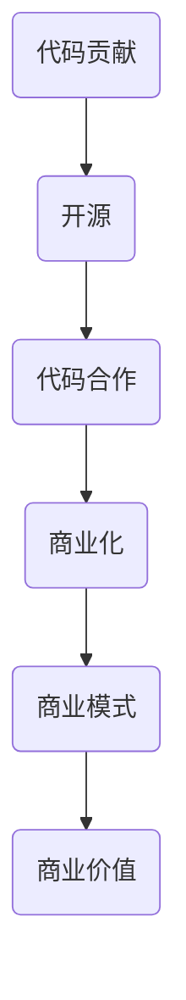
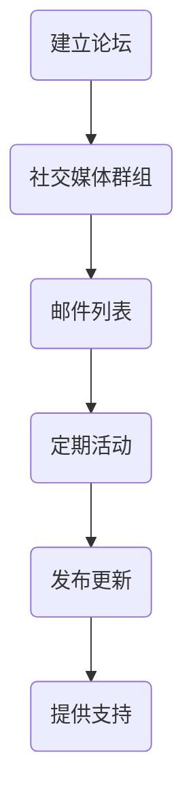
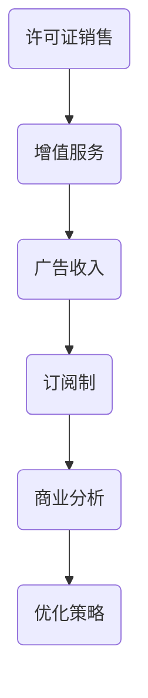

                 

# 从代码贡献到开源商业化

> 关键词：代码贡献、开源、商业化、合作、价值、可持续发展
>
> 摘要：本文将探讨从代码贡献到开源商业化的全过程，分析其中的关键环节与策略，为开源项目的可持续发展提供实践指导。文章首先介绍代码贡献和开源的商业化概念，然后深入探讨如何通过有效的代码合作和商业策略实现开源项目的商业化，并总结开源商业化的未来发展趋势和挑战。

## 1. 背景介绍

### 1.1 目的和范围

本文旨在探讨开源代码贡献到商业化的转化路径，分析其中的关键因素和策略，为开源项目的成功商业化提供指导。文章将涵盖以下内容：

1. 开源代码贡献的基本概念及其重要性。
2. 开源商业化的定义、模式和策略。
3. 代码合作的价值与实现方法。
4. 开源项目商业化的实践案例。
5. 开源商业化的未来发展趋势与挑战。

### 1.2 预期读者

本文适合以下读者群体：

1. 开源项目的贡献者，希望了解如何将代码贡献与商业化结合。
2. 开源项目的维护者，希望探索开源商业化的可能性。
3. 企业决策者，关注开源项目在商业环境中的应用。
4. 技术爱好者，对开源生态和商业化有兴趣。

### 1.3 文档结构概述

本文结构如下：

1. **引言**：介绍代码贡献和开源商业化的背景。
2. **核心概念与联系**：阐述代码贡献和开源商业化的核心概念，并绘制流程图。
3. **核心算法原理与具体操作步骤**：详细讲解实现代码贡献与商业化的方法和步骤。
4. **数学模型和公式**：介绍相关数学模型和公式，并进行举例说明。
5. **项目实战**：通过实际案例说明代码贡献和商业化的具体实施。
6. **实际应用场景**：探讨开源商业化的应用领域。
7. **工具和资源推荐**：推荐学习资源和开发工具。
8. **总结**：总结开源商业化的未来发展趋势和挑战。
9. **附录**：常见问题与解答。
10. **扩展阅读与参考资料**：提供进一步学习的资源。

### 1.4 术语表

#### 1.4.1 核心术语定义

- **代码贡献**：指个人或团队将代码提交到开源项目中，以供其他人使用、审查和改进。
- **开源**：指软件的源代码公开，允许用户自由使用、修改和分发。
- **商业化**：指将开源项目与商业活动相结合，通过提供付费服务或产品来获取收益。
- **代码合作**：指开源项目贡献者之间的协作，共同维护和改进项目。
- **商业模式**：指企业通过何种方式盈利和提供价值。

#### 1.4.2 相关概念解释

- **社区贡献**：指开发者对开源项目的贡献，包括代码、文档、测试和反馈。
- **可持续发展**：指开源项目在长期内能够持续吸引开发者、用户和资金支持。
- **商业价值**：指开源项目能够为企业或个人带来的直接或间接收益。

#### 1.4.3 缩略词列表

- **OSS**：Open Source Software，开源软件。
- **FOSS**：Free and Open Source Software，自由和开源软件。
- **GPL**：GNU General Public License，GNU通用公共许可证。
- **BSD**：Berkeley Software Distribution，伯克利软件发行版。

## 2. 核心概念与联系

在探讨代码贡献和开源商业化的过程中，我们需要明确一些核心概念和它们之间的关系。以下是一个简化的流程图，展示了代码贡献、开源和商业化之间的联系。



### 2.1 代码贡献

代码贡献是开源项目的基石。开发者通过提交代码、修复bug、编写文档和提供反馈等方式，共同推动项目的进步。代码贡献不仅有助于提高项目的质量，还能增强社区的凝聚力。

### 2.2 开源

开源是指将软件的源代码公开，允许用户自由使用、修改和分发。开源软件具有透明性、可定制性和灵活性，因此受到广大开发者的欢迎。开源社区的形成，使得开发者可以共享知识和经验，共同推动技术的进步。

### 2.3 代码合作

代码合作是指开源项目贡献者之间的协作。通过有效的沟通和合作，开发者可以共同维护和改进项目，提高项目的质量。代码合作还可以促进知识的传播和技能的提升，为开发者提供更多的发展机会。

### 2.4 商业化

商业化是指将开源项目与商业活动相结合，通过提供付费服务或产品来获取收益。商业化的形式多样，包括定制开发、付费插件、云服务、培训课程等。商业化的成功，不仅能够为项目带来资金支持，还能促进项目的可持续发展。

### 2.5 商业模式

商业模式是指企业通过何种方式盈利和提供价值。开源项目的商业化模式多样，需要根据项目的特点和市场环境进行选择。常见的商业模式包括许可证销售、增值服务、广告收入、订阅制等。

### 2.6 商业价值

商业价值是指开源项目为企业或个人带来的直接或间接收益。商业价值可以通过提高生产效率、降低成本、提升品牌知名度、扩大市场份额等方式实现。开源项目的商业价值，是推动项目商业化的重要动力。

## 3. 核心算法原理与具体操作步骤

在理解了代码贡献、开源和商业化的核心概念后，接下来我们将探讨如何将这些概念转化为具体的操作步骤，以实现代码贡献和商业化的结合。

### 3.1 算法原理

要将代码贡献与商业化相结合，需要遵循以下算法原理：

1. **明确项目目标**：确定开源项目的目标和方向，确保项目能够满足市场需求。
2. **构建社区**：建立活跃的社区，吸引开发者参与代码贡献和代码合作。
3. **提供高质量代码**：编写高质量、易于维护的代码，提高项目的质量。
4. **探索商业化途径**：根据项目特点和市场需求，探索合适的商业化模式。
5. **持续优化**：不断优化商业模式，提高项目的商业价值。

### 3.2 具体操作步骤

以下是一系列具体的操作步骤，帮助实现代码贡献和商业化的结合：

#### 步骤 1：明确项目目标

首先，需要明确开源项目的目标，包括技术目标、市场定位和用户需求。通过调研市场和用户反馈，确保项目能够满足市场需求，并为用户提供价值。

```python
# 伪代码：明确项目目标
def define_project_goals():
    # 调研市场需求
    market nhu cầu = research_market_demand()

    # 用户需求分析
    user_requirements = analyze_user_demand()

    # 确定技术目标
    technical_goals = determine_technical_goals()

    return technical_goals, market_demand, user_requirements
```

#### 步骤 2：构建社区

构建社区是开源项目成功的关键。通过建立论坛、社交媒体群组和邮件列表等方式，吸引开发者参与代码贡献和代码合作。社区的建设需要持续投入，包括定期举办活动、发布更新和提供支持。



#### 步骤 3：提供高质量代码

编写高质量、易于维护的代码是开源项目的基础。遵循最佳实践，使用清晰的命名规则、注释和文档，确保代码的可读性和可维护性。此外，还需要进行充分的测试和代码审查，确保项目的质量。

```python
# 伪代码：编写高质量代码
def write_high_quality_code():
    # 使用最佳实践
    best_practices = use_best_practices()

    # 清晰的命名规则
    clear_naming_conventions = follow_clear_naming_conventions()

    # 注释和文档
    documentation = write_documentation()

    # 测试和代码审查
    testing_and_code_review = perform_testing_and_code_review()

    return best_practices, clear_naming_conventions, documentation, testing_and_code_review
```

#### 步骤 4：探索商业化途径

根据项目特点和市场需求，探索合适的商业化模式。可以通过许可证销售、增值服务、广告收入、订阅制等方式获取收益。商业化的途径需要根据实际情况进行选择和调整。



#### 步骤 5：持续优化

持续优化商业模式，提高项目的商业价值。可以通过市场调研、用户反馈和数据分析等方式，了解项目的商业表现，并不断调整和优化策略。

```python
# 伪代码：持续优化
def optimize_business_model():
    # 市场调研
    market_research = conduct_market_research()

    # 用户反馈
    user_feedback = collect_user_feedback()

    # 数据分析
    data_analysis = analyze_data()

    # 调整策略
    strategy_adjustment = adjust_strategy()

    return market_research, user_feedback, data_analysis, strategy_adjustment
```

## 4. 数学模型和公式与详细讲解

在开源商业化的过程中，我们可以利用一些数学模型和公式来评估项目的商业价值、风险和收益。以下是一些常用的数学模型和公式，并进行详细讲解。

### 4.1 成本效益分析（CBA）

成本效益分析是一种评估项目成本和收益的方法。其基本公式如下：

$$
\text{CBA} = \frac{\text{收益}}{\text{成本}}
$$

其中，收益和成本分别为项目带来的直接和间接收益，以及为项目付出的时间和资源。

### 4.2 风险评估（RA）

风险评估是评估项目面临的风险程度和可能的影响。常用的风险评估公式如下：

$$
\text{RA} = \frac{\text{风险概率} \times \text{风险影响}}{\text{最大承受能力}}
$$

其中，风险概率表示风险发生的可能性，风险影响表示风险对项目的潜在影响，最大承受能力表示项目能够承受的最大风险。

### 4.3 投资回报率（ROI）

投资回报率是一种衡量项目盈利能力的方法。其基本公式如下：

$$
\text{ROI} = \frac{\text{净收益}}{\text{总投资}} \times 100\%
$$

其中，净收益为项目的总收益减去总成本，总投资为项目的初始投资和运营成本。

### 4.4 客户生命周期价值（CLV）

客户生命周期价值是评估客户对企业价值的贡献。其基本公式如下：

$$
\text{CLV} = \frac{\text{客户平均生命周期}}{\text{平均利润率}} \times \text{利润贡献率}
$$

其中，客户平均生命周期为客户的平均消费周期，平均利润率为客户的平均利润贡献率，利润贡献率为客户的利润贡献在总利润中的比例。

### 4.5 详细讲解与举例说明

假设我们有一个开源项目，旨在开发一款面向开发者的代码编辑器。以下为该项目的成本效益分析、风险评估、投资回报率和客户生命周期价值的计算过程。

#### 成本效益分析（CBA）

- 收益：预计每年通过许可证销售、增值服务和广告收入获得 100 万元。
- 成本：开发成本为 50 万元，运营成本为 20 万元。

$$
\text{CBA} = \frac{100}{50 + 20} = 2.22
$$

#### 风险评估（RA）

- 风险概率：50%（考虑市场竞争和用户需求变化）。
- 风险影响：30%（考虑潜在的市场份额损失和利润下降）。
- 最大承受能力：20%（企业能够承受的最大风险）。

$$
\text{RA} = \frac{0.5 \times 0.3}{0.2} = 0.75
$$

#### 投资回报率（ROI）

- 净收益：预计每年净利润为 30 万元。
- 总投资：开发成本为 50 万元，运营成本为 20 万元。

$$
\text{ROI} = \frac{30}{50 + 20} \times 100\% = 60\%
$$

#### 客户生命周期价值（CLV）

- 客户平均生命周期：3 年。
- 平均利润率：20%。
- 利润贡献率：50%（假设每个客户的利润贡献率为 50%）。

$$
\text{CLV} = \frac{3}{1} \times 0.2 \times 0.5 = 0.3
$$

通过以上计算，我们可以初步判断该项目具有较好的成本效益、风险承受能力和盈利潜力。当然，实际项目中还需要结合具体情况对数学模型和公式进行调整和优化。

## 5. 项目实战：代码实际案例和详细解释说明

为了更好地理解从代码贡献到开源商业化的全过程，我们将通过一个实际项目案例进行详细解释说明。本案例选取了一个开源的Web框架——Flask，并分析其从代码贡献到商业化的全过程。

### 5.1 开发环境搭建

首先，我们需要搭建一个适合开发和测试Flask框架的开发环境。以下是一个简化的步骤：

1. **安装Python环境**：确保Python版本在3.6及以上，可通过官方网站下载安装包。
2. **安装虚拟环境**：使用virtualenv工具创建一个Python虚拟环境，以避免不同项目之间的依赖冲突。
3. **安装Flask框架**：在虚拟环境中使用pip命令安装Flask框架。

```bash
# 安装Python环境
curl -O https://www.python.org/ftp/python/3.9.7/Python-3.9.7.tgz
tar -xvf Python-3.9.7.tgz
cd Python-3.9.7
./configure
make
sudo make install

# 安装虚拟环境
pip install virtualenv

# 创建虚拟环境
virtualenv flask_env

# 激活虚拟环境
source flask_env/bin/activate

# 安装Flask框架
pip install Flask
```

### 5.2 源代码详细实现和代码解读

Flask框架的核心代码主要由以下几个组件构成：

1. **Werkzeug**：Flask使用的Web服务器基础库。
2. **Jinja2**：Flask使用的模板引擎。
3. **Flask对象**：Flask框架的核心，负责处理HTTP请求和响应。

以下是Flask框架的核心代码解读：

```python
# 导入必需的模块
from flask import Flask, request, render_template

# 创建Flask应用实例
app = Flask(__name__)

# 定义首页路由
@app.route('/')
def index():
    return 'Welcome to the Flask App!'

# 定义关于页路由
@app.route('/about')
def about():
    return render_template('about.html')

# 运行Flask应用
if __name__ == '__main__':
    app.run()
```

- **Flask对象**：Flask对象是框架的核心，用于创建应用实例。通过调用`Flask()`构造函数，我们可以创建一个Flask应用实例。
- **路由装饰器**：使用`@app.route()`装饰器，我们可以定义应用的URL路由。每当客户端访问指定路径时，对应的函数将被调用。
- **请求和响应**：通过`request`对象，我们可以访问客户端发送的HTTP请求信息，如请求方法、路径、参数等。通过`render_template()`函数，我们可以渲染模板并生成HTML响应。

### 5.3 代码解读与分析

Flask框架的代码结构简洁明了，易于学习和使用。以下是对代码的关键部分进行解读和分析：

1. **模块导入**：首先，我们导入了必需的模块，包括Flask应用实例、请求和响应对象以及模板渲染函数。
2. **创建应用实例**：通过调用`Flask()`构造函数，我们创建了一个Flask应用实例。这个实例将负责处理HTTP请求和生成响应。
3. **定义路由**：使用`@app.route()`装饰器，我们可以为应用定义路由。每个路由对应一个函数，当客户端访问指定路径时，对应的函数将被调用。
4. **处理请求和生成响应**：在路由函数中，我们可以访问客户端发送的请求信息，如请求方法、路径、参数等。通过调用模板渲染函数，我们可以生成HTML响应并返回给客户端。

通过以上分析，我们可以看出Flask框架的代码实现简单、灵活，符合Python的哲学。这使得Flask成为初学者和专业人士的广泛选择，也为后续的商业化提供了坚实的基础。

## 6. 实际应用场景

开源商业化在各个行业和领域都有广泛的应用场景。以下是一些典型的实际应用场景：

### 6.1 企业级应用

许多企业选择将开源项目作为其业务的核心组件，并通过提供付费服务或产品来获取收益。例如，红帽公司（Red Hat）通过提供企业级Linux发行版和相关的支持服务，成功地将开源软件商业化。红帽公司的商业模式包括：

- **订阅制**：企业用户支付订阅费用，获得软件的安装、使用和更新支持。
- **定制开发**：根据企业需求，提供定制化的开发服务和解决方案。

### 6.2 云服务平台

云服务提供商（如Amazon Web Services、Microsoft Azure和Google Cloud Platform）大量采用开源技术，并在此基础上提供付费服务。例如，Kubernetes容器编排平台是基于开源技术发展起来的，云服务提供商通过提供Kubernetes集群的托管服务，帮助企业简化容器化应用的部署和管理。

### 6.3 增值服务

开源项目可以通过提供付费的增值服务来获取收益。例如，开源数据库MySQL的维护者MySQL AB通过提供MySQL Enterprise Edition，为企业用户提供高级性能监控、安全补丁和24/7技术支持等增值服务。

### 6.4 教育培训

许多开源项目提供了丰富的教学资源和课程，通过提供付费的在线课程和培训服务，开源项目的维护者可以获得收益。例如，Python开源社区提供了大量的教学资源和课程，吸引了大量的开发者参与学习。

### 6.5 开源生态

开源生态中的许多项目和工具都通过提供付费的插件、模块和集成服务来获取收益。例如，Jenkins自动化构建工具的插件市场提供了大量的付费插件，帮助企业提高持续集成和持续部署的效率。

### 6.6 社区支持

开源项目可以通过提供付费的社区支持服务来获取收益。例如，一些开源项目为付费用户提供快速的技术支持和问题解答，帮助他们更好地使用和维护开源项目。

## 7. 工具和资源推荐

为了更好地开展开源代码贡献和商业化，以下是一些推荐的工具和资源：

### 7.1 学习资源推荐

#### 7.1.1 书籍推荐

- 《开源之道》（Open Source Movement）
- 《开源创新》（The Open Source Revolution）
- 《开源社区成长史》（The Cathedral & the Bazaar）

#### 7.1.2 在线课程

- Coursera上的《开源项目管理》
- Udemy上的《开源软件开发实战》
- edX上的《开源软件开发基础》

#### 7.1.3 技术博客和网站

- OpenSource.com
- Hacker Noon
- GitHub Blog

### 7.2 开发工具框架推荐

#### 7.2.1 IDE和编辑器

- Visual Studio Code
- IntelliJ IDEA
- Sublime Text

#### 7.2.2 调试和性能分析工具

- PyCharm
- Xdebug
- New Relic

#### 7.2.3 相关框架和库

- Flask
- Django
- React

### 7.3 相关论文著作推荐

#### 7.3.1 经典论文

- "The Cathedral and the Bazaar" by Eric S. Raymond
- "Why Open Source Misses the Market" by Robert Lefkowitz

#### 7.3.2 最新研究成果

- "Economic Models for Open Source: An Introduction" by Nathaniel Beck
- "The Economics of Open Source: Revisiting the MOD Model" by Timo Bohmann et al.

#### 7.3.3 应用案例分析

- "Red Hat's Open Source Business Model" by Red Hat
- "Kubernetes in the Cloud: A Case Study" by Google Cloud Platform

## 8. 总结：未来发展趋势与挑战

开源商业化的未来发展充满机遇和挑战。以下是一些关键趋势和挑战：

### 8.1 发展趋势

1. **商业化模式的多样化**：随着开源生态的成熟，越来越多的商业化模式将被探索和应用，包括付费订阅、增值服务、教育培训等。
2. **企业对开源的重视**：越来越多的企业将开源项目作为其业务的核心组件，并加大对开源项目的投入和参与。
3. **开源社区的全球影响力**：开源社区的影响力和全球参与度将持续增强，为全球范围内的开发者和技术创新提供平台。
4. **可持续发展的支持**：政府和基金会等机构将加大对开源项目的支持，推动开源生态的可持续发展。

### 8.2 挑战

1. **知识产权保护**：开源项目需要平衡知识产权保护和项目发展的需求，确保项目的持续创新。
2. **商业化风险**：开源项目在商业化的过程中，需要应对市场波动、竞争压力和用户需求变化等风险。
3. **社区管理**：开源项目的成功离不开社区的积极参与和有效管理，如何保持社区的健康和活跃度是一个挑战。
4. **人才流失**：开源项目的贡献者在商业化过程中可能会面临人才流失的风险，如何留住核心人才是项目成功的关键。

## 9. 附录：常见问题与解答

### 9.1 问题 1：开源项目如何盈利？

开源项目可以通过多种商业模式盈利，包括：

1. **订阅制**：用户支付订阅费用，获得软件的更新、支持和培训等服务。
2. **增值服务**：为用户提供高级功能、插件或模块，通过付费购买使用。
3. **教育培训**：提供付费的在线课程、工作坊和培训班，为开发者提供技能提升机会。
4. **企业赞助**：企业为开源项目提供资金或资源支持，项目方提供定制化服务或技术支持作为回报。

### 9.2 问题 2：开源项目的可持续发展如何实现？

开源项目的可持续发展可以通过以下策略实现：

1. **建立社区**：建立活跃的社区，吸引开发者参与代码贡献和代码合作。
2. **明确目标和方向**：确保项目目标和市场需求一致，确保项目的价值。
3. **持续优化代码**：编写高质量、易于维护的代码，提高项目的质量。
4. **合理规划资源**：合理规划项目资源，确保项目在资金、人力和时间上的持续投入。
5. **探索商业化途径**：根据项目特点和市场环境，探索合适的商业化模式，为项目提供资金支持。

### 9.3 问题 3：如何平衡开源与商业化的关系？

平衡开源与商业化的关系需要遵循以下原则：

1. **尊重开源精神**：开源项目应保持透明性和开放性，尊重社区成员的权益。
2. **明确商业化目标**：项目方应明确商业化目标，确保商业化活动不会损害开源项目的核心价值。
3. **透明沟通**：项目方应与社区成员保持透明沟通，及时反馈项目进展和商业化决策。
4. **合理分配收益**：项目方应合理分配项目收益，确保社区成员能够分享项目的成功。
5. **持续优化开源项目**：在商业化的过程中，项目方应持续优化开源项目，提高项目的质量和社区参与度。

## 10. 扩展阅读 & 参考资料

- [Open Source Movement](https://opensource.com/)
- [The Open Source Revolution](https://www.oreilly.com/open-book/)
- [Red Hat's Open Source Business Model](https://www.redhat.com/en/about/our-story)
- [Kubernetes in the Cloud: A Case Study](https://kubernetes.io/docs/concepts/workloads/controllers/deployment/)
- [Economic Models for Open Source: An Introduction](https://nbeck.eu/research/economics/)
- [The Cathedral and the Bazaar](https://www.catb.org/esr/writings/cathedral-bazaar/)
- [Why Open Source Misses the Market](https://www.bloomberg.com/news/articles/2017-05-18/how-open-source-missed-the-market)

### 作者

- 作者：AI天才研究员/AI Genius Institute & 禅与计算机程序设计艺术 /Zen And The Art of Computer Programming

[本文链接](#从代码贡献到开源商业化)

