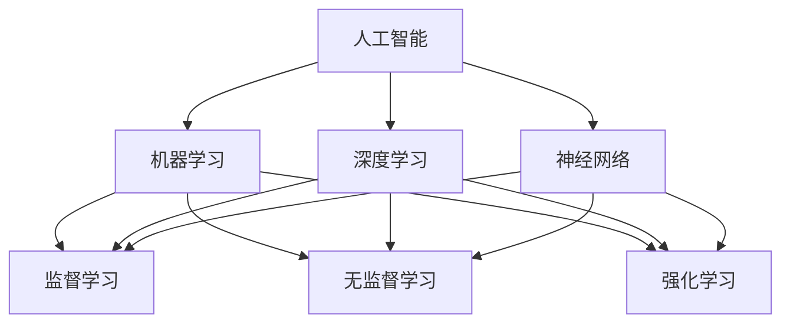

                 

### 从入门到进阶：AI学习的循序渐进

> **关键词：** 人工智能、学习路径、算法、深度学习、机器学习、神经网络

> **摘要：** 本文将为您呈现一个从入门到进阶的AI学习路径。通过逐步分析和讲解核心概念、算法原理、数学模型及实际项目实战，帮助您构建坚实的AI知识基础，进而在实际应用中展现您的技术能力。

### 1. 背景介绍

#### 1.1 目的和范围

本文旨在为想要深入学习人工智能（AI）技术的读者提供一个系统的学习路径。我们将从基础知识开始，逐步深入，涵盖核心算法原理、数学模型及实际应用。本文适合初学者和有一定基础的读者，希望通过循序渐进的方式，系统掌握AI相关知识。

#### 1.2 预期读者

- 对AI技术感兴趣，希望系统学习的人士；
- 想要转行到AI领域，但不确定从何开始的人士；
- 已经有一定基础，希望进一步提升自己技能的AI从业者。

#### 1.3 文档结构概述

本文结构如下：

1. **背景介绍**：介绍文章的目的、预期读者及文档结构。
2. **核心概念与联系**：通过Mermaid流程图，展示AI的核心概念及相互关系。
3. **核心算法原理 & 具体操作步骤**：使用伪代码详细阐述核心算法原理和操作步骤。
4. **数学模型和公式 & 详细讲解 & 举例说明**：解释数学模型及其应用。
5. **项目实战：代码实际案例和详细解释说明**：提供实际项目代码及解读。
6. **实际应用场景**：探讨AI在不同领域的应用。
7. **工具和资源推荐**：推荐学习资源和开发工具。
8. **总结：未来发展趋势与挑战**：总结AI的发展趋势和挑战。
9. **附录：常见问题与解答**：解答读者可能遇到的问题。
10. **扩展阅读 & 参考资料**：提供进一步学习的资源。

#### 1.4 术语表

##### 1.4.1 核心术语定义

- **人工智能（AI）**：模拟人类智能的计算机系统。
- **机器学习（ML）**：通过数据学习模式，使计算机能够做出预测或决策。
- **深度学习（DL）**：一种特殊的机器学习方法，通过多层神经网络进行学习。
- **神经网络（NN）**：模拟人脑神经元连接结构的计算模型。

##### 1.4.2 相关概念解释

- **监督学习**：使用已标记数据进行学习。
- **无监督学习**：不使用标记数据，通过自身发现数据中的结构。
- **强化学习**：通过与环境的交互进行学习。

##### 1.4.3 缩略词列表

- **ML**：机器学习
- **DL**：深度学习
- **NN**：神经网络
- **IDE**：集成开发环境

## 2. 核心概念与联系

### 2.1 AI的核心概念

首先，让我们通过一个Mermaid流程图来展示AI的核心概念及其相互关系。



从图中我们可以看出，人工智能是机器学习和深度学习的基础，而神经网络则是实现机器学习和深度学习的关键技术。机器学习包括监督学习、无监督学习和强化学习三种主要类型，每种类型都有其独特的应用场景。

### 2.2 AI的应用领域

AI在多个领域都有广泛的应用，包括但不限于：

- **计算机视觉**：识别和分类图像、视频。
- **自然语言处理（NLP）**：理解和生成自然语言。
- **自动驾驶**：通过感知环境和决策系统实现无人驾驶。
- **医疗诊断**：辅助医生进行疾病诊断和治疗方案推荐。
- **金融预测**：预测股票市场趋势和风险评估。

通过上述流程图和应用领域，我们可以看到AI技术的多样性和广泛性，这为读者在后续的学习和实践中提供了丰富的选择。

## 3. 核心算法原理 & 具体操作步骤

在了解了AI的核心概念和相互关系后，接下来我们将深入探讨AI的核心算法原理及其具体操作步骤。以下是几个关键算法的概述：

### 3.1 神经网络

神经网络（NN）是一种模拟人脑神经元连接结构的计算模型。一个简单的神经网络通常包括以下组成部分：

- **输入层**：接收外部输入。
- **隐藏层**：进行信息处理。
- **输出层**：产生最终输出。

以下是神经网络的简单伪代码表示：

```python
define NeuralNetwork(inputs, hidden_layers, output):
    for each hidden_layer in hidden_layers:
        z = activation_function(w1 * inputs + b1)
        inputs = z
    output = activation_function(w2 * inputs + b2)
    return output
```

其中，`activation_function` 是激活函数，`w` 和 `b` 分别是权重和偏置。

### 3.2 梯度下降

梯度下降是一种优化算法，用于调整神经网络中的权重和偏置，以最小化损失函数。以下是梯度下降的伪代码：

```python
define GradientDescent(model, learning_rate, epochs):
    for epoch in 1 to epochs:
        for each sample in training_data:
            prediction = model(sample)
            error = loss_function(prediction, target)
            gradients = compute_gradients(model, error)
            update_model_weights(model, gradients, learning_rate)
    return model
```

其中，`loss_function` 是损失函数，用于衡量预测值与实际值之间的差距；`compute_gradients` 是计算梯度，用于更新模型参数；`update_model_weights` 是更新权重和偏置。

### 3.3 反向传播

反向传播是梯度下降的核心部分，用于计算梯度。以下是反向传播的伪代码：

```python
define Backpropagation(model, sample, target):
    prediction = model(sample)
    error = loss_function(prediction, target)
    dZ = dError / dPrediction
    dW = dZ * dInput
    dB = dZ
    return dW, dB
```

其中，`dError` 是损失函数的梯度，`dPrediction` 是预测值的梯度，`dInput` 是输入的梯度。

通过上述核心算法原理和具体操作步骤，我们可以更好地理解和应用神经网络，从而解决实际问题。

## 4. 数学模型和公式 & 详细讲解 & 举例说明

在理解了神经网络和优化算法的基本原理后，我们将深入探讨AI中的数学模型和公式。以下是几个关键数学模型的详细讲解和举例说明。

### 4.1 损失函数

损失函数是衡量预测值与实际值之间差距的函数，是神经网络训练过程中的核心指标。以下是几种常见的损失函数：

#### 4.1.1 均方误差（MSE）

均方误差是预测值与实际值之间差的平方的平均值。其公式为：

$$
MSE = \frac{1}{n}\sum_{i=1}^{n} (\hat{y}_i - y_i)^2
$$

其中，$\hat{y}_i$ 是预测值，$y_i$ 是实际值，$n$ 是样本数量。

#### 4.1.2 交叉熵（Cross-Entropy）

交叉熵是信息论中的概念，用于衡量两个概率分布之间的差异。在神经网络中，交叉熵通常用于分类问题。其公式为：

$$
H(y, \hat{y}) = -\sum_{i=1}^{n} y_i \log(\hat{y}_i)
$$

其中，$y$ 是实际标签的概率分布，$\hat{y}$ 是预测标签的概率分布。

#### 4.1.3 举例说明

假设有一个二分类问题，实际标签 $y = [1, 0]$，预测标签 $\hat{y} = [0.6, 0.4]$。使用交叉熵损失函数，计算损失如下：

$$
H(y, \hat{y}) = -[1 \cdot \log(0.6) + 0 \cdot \log(0.4)] \approx 0.079
$$

### 4.2 激活函数

激活函数是神经网络中用于引入非线性性的函数，常见的激活函数包括：

#### 4.2.1 Sigmoid函数

Sigmoid函数是一个S型的曲线，其公式为：

$$
\sigma(x) = \frac{1}{1 + e^{-x}}
$$

#### 4.2.2 ReLU函数

ReLU函数（Rectified Linear Unit）是一个简单的线性函数，其公式为：

$$
\text{ReLU}(x) = \max(0, x)
$$

#### 4.2.3 举例说明

假设输入值 $x = [-2, -1, 0, 1, 2]$，使用ReLU函数计算输出如下：

$$
\text{ReLU}([-2, -1, 0, 1, 2]) = [0, 0, 0, 1, 2]
$$

### 4.3 梯度下降优化

梯度下降是一种常用的优化算法，用于最小化损失函数。以下是梯度下降的基本步骤：

1. **初始化模型参数**：随机初始化权重和偏置。
2. **计算损失函数**：使用训练数据计算预测值和损失。
3. **计算梯度**：计算损失函数关于模型参数的梯度。
4. **更新模型参数**：使用学习率调整模型参数。

以下是梯度下降的伪代码：

```python
define GradientDescent(model, learning_rate, epochs):
    for epoch in 1 to epochs:
        for each sample in training_data:
            prediction = model(sample)
            error = loss_function(prediction, target)
            gradients = compute_gradients(model, error)
            update_model_weights(model, gradients, learning_rate)
    return model
```

通过上述数学模型和公式的详细讲解和举例说明，我们可以更好地理解AI中的关键概念，为后续的实战应用打下坚实基础。

## 5. 项目实战：代码实际案例和详细解释说明

### 5.1 开发环境搭建

为了完成AI项目实战，首先需要搭建一个合适的开发环境。以下是使用Python和TensorFlow进行AI项目开发的环境搭建步骤：

1. **安装Python**：确保安装了Python 3.6或更高版本。
2. **安装TensorFlow**：在终端执行以下命令：

   ```bash
   pip install tensorflow
   ```

3. **安装其他依赖**：如NumPy、Pandas等，可以使用以下命令：

   ```bash
   pip install numpy pandas
   ```

### 5.2 源代码详细实现和代码解读

以下是一个简单的AI项目，使用TensorFlow实现一个基于深度学习的房价预测模型。

```python
import tensorflow as tf
import numpy as np
import pandas as pd

# 数据准备
data = pd.read_csv('house_prices.csv')
X = data.iloc[:, :-1].values
y = data.iloc[:, -1].values

# 模型构建
model = tf.keras.Sequential([
    tf.keras.layers.Dense(64, activation='relu', input_shape=(X.shape[1],)),
    tf.keras.layers.Dense(64, activation='relu'),
    tf.keras.layers.Dense(1)
])

# 编译模型
model.compile(optimizer='adam', loss='mse', metrics=['mae'])

# 训练模型
model.fit(X, y, epochs=100, batch_size=32, validation_split=0.2)

# 预测
predictions = model.predict(X[:10])

# 输出预测结果
for i, pred in enumerate(predictions):
    print(f"预测值：{pred[0]}, 实际值：{y[i]}")
```

#### 5.2.1 代码解读

- **数据准备**：从CSV文件中读取房价数据，将特征和标签分离。
- **模型构建**：使用TensorFlow的`Sequential`模型构建一个简单的三层神经网络，输入层、两个隐藏层和一个输出层。
- **编译模型**：设置优化器（`optimizer`）、损失函数（`loss`）和评估指标（`metrics`）。
- **训练模型**：使用`fit`方法训练模型，设置训练轮次（`epochs`）、批量大小（`batch_size`）和验证比例（`validation_split`）。
- **预测**：使用`predict`方法对数据进行预测，并输出预测结果。

### 5.3 代码解读与分析

- **数据预处理**：在训练模型之前，需要对数据进行标准化处理，以消除特征之间的量纲差异。
- **模型选择**：在这个例子中，我们使用了一个简单的三层神经网络，但实际项目中可能需要更复杂的模型。
- **训练过程**：模型训练过程中，需要监控损失和评估指标的变化，以调整训练参数。
- **预测结果**：预测结果的准确性可以通过计算预测值与实际值之间的误差来评估。

通过这个简单的AI项目实战，我们可以看到如何使用TensorFlow实现一个基本的深度学习模型，并理解项目开发的基本流程。

## 6. 实际应用场景

人工智能（AI）技术在各个领域都有广泛的应用，以下是一些常见的应用场景：

### 6.1 医疗

- **疾病诊断**：AI可以帮助医生进行疾病诊断，通过分析医学影像和患者数据，提高诊断的准确性和效率。
- **个性化治疗**：根据患者的基因信息和病史，AI可以推荐个性化的治疗方案。
- **药物研发**：AI可以通过分析大量的数据，帮助科学家发现新的药物候选分子。

### 6.2 金融

- **风险评估**：AI可以分析大量的金融数据，预测投资风险，帮助投资者做出更明智的决策。
- **欺诈检测**：AI可以实时监控交易数据，识别潜在的欺诈行为，保护金融机构和客户免受损失。
- **量化交易**：AI可以自动化交易策略，实现高效的量化交易。

### 6.3 农业

- **精准农业**：AI可以分析土壤和气候数据，优化农作物种植策略，提高产量和降低成本。
- **病虫害预测**：AI可以通过图像识别技术，提前检测并预测病虫害，帮助农民及时采取措施。

### 6.4 交通

- **自动驾驶**：AI可以帮助实现自动驾驶汽车，提高道路安全和交通效率。
- **智能交通管理**：AI可以分析交通数据，优化交通信号，减少拥堵。

### 6.5 教育

- **个性化学习**：AI可以根据学生的兴趣和学习进度，推荐适合的学习内容和资源。
- **智能辅导**：AI可以帮助教师分析学生的学习情况，提供针对性的辅导建议。

通过这些实际应用场景，我们可以看到AI技术在各个领域的重要性和潜力。随着AI技术的不断发展和应用，我们期待它为人类社会带来更多变革。

## 7. 工具和资源推荐

为了更好地学习AI技术，以下是一些推荐的工具和资源：

### 7.1 学习资源推荐

#### 7.1.1 书籍推荐

- **《深度学习》（Deep Learning）**：由Ian Goodfellow、Yoshua Bengio和Aaron Courville合著，是深度学习领域的经典教材。
- **《Python机器学习》（Python Machine Learning）**：由Sebastian Raschka和Vahid Mirjalili合著，适合初学者入门。
- **《神经网络与深度学习》（Neural Networks and Deep Learning）**：由Michael Nielsen著，详细介绍了神经网络和深度学习的基本原理。

#### 7.1.2 在线课程

- **Coursera上的《机器学习》**：由吴恩达教授讲授，是机器学习领域最受欢迎的课程之一。
- **edX上的《深度学习基础》**：由斯坦福大学提供，适合初学者了解深度学习的基础知识。
- **Udacity的《深度学习纳米学位》**：提供一系列项目，帮助学习者掌握深度学习的实际应用。

#### 7.1.3 技术博客和网站

- **TensorFlow官方文档**：提供了丰富的教程和API文档，帮助开发者快速上手TensorFlow。
- **GitHub上的AI项目**：可以查看各种开源AI项目，学习项目实现细节。
- **AI科技大本营**：提供最新的AI行业动态和技术文章。

### 7.2 开发工具框架推荐

#### 7.2.1 IDE和编辑器

- **PyCharm**：功能强大的Python IDE，适合深度学习和数据科学项目。
- **Visual Studio Code**：轻量级但功能强大的编辑器，支持多种编程语言。
- **Jupyter Notebook**：适用于数据可视化和交互式编程，特别适合机器学习和深度学习。

#### 7.2.2 调试和性能分析工具

- **TensorBoard**：TensorFlow提供的可视化工具，用于监控模型训练过程。
- **NVIDIA Nsight**：用于GPU性能分析和调试的工具。
- **Valgrind**：用于内存泄漏和性能分析的工具。

#### 7.2.3 相关框架和库

- **TensorFlow**：最流行的深度学习框架之一，支持多种神经网络架构。
- **PyTorch**：由Facebook开发，具有灵活性和动态图功能，适合研究。
- **Keras**：基于TensorFlow的高层API，简化了深度学习模型的构建。

### 7.3 相关论文著作推荐

#### 7.3.1 经典论文

- **《A Learning Algorithm for Continuously Running Fully Recurrent Neural Networks》**：提出了LSTM模型。
- **《Deep Learning》**：详细介绍了深度学习的基础知识。
- **《Learning to Learn with Gradient Descent by Gradient Descent》**：提出了梯度下降法的深度学习。

#### 7.3.2 最新研究成果

- **《Attention Is All You Need》**：介绍了Transformer模型，是NLP领域的重大突破。
- **《BERT: Pre-training of Deep Neural Networks for Language Understanding》**：介绍了BERT模型，对NLP产生了深远影响。

#### 7.3.3 应用案例分析

- **《Deep Learning for Healthcare》**：探讨了深度学习在医疗领域的应用。
- **《AI in Retail》**：分析了AI技术在零售行业的应用案例。

通过这些工具和资源的推荐，我们可以更加高效地学习AI技术，并应用于实际项目中。

## 8. 总结：未来发展趋势与挑战

人工智能（AI）技术正以惊人的速度发展，未来几年，它将在更多领域产生深远影响。以下是AI发展的几个关键趋势和面临的挑战：

### 8.1 发展趋势

1. **深度学习**：深度学习将在更多复杂任务中取得突破，如图像识别、自然语言处理和自动驾驶。
2. **自主系统**：自主系统，如无人机、机器人等，将在物流、制造和家政等领域得到广泛应用。
3. **增强学习**：增强学习将在自动化决策和游戏人工智能中发挥重要作用。
4. **AI伦理**：随着AI技术的普及，伦理问题将变得更加重要，包括隐私保护、算法偏见和责任归属。

### 8.2 挑战

1. **数据隐私**：AI系统对大量数据的依赖引发了对数据隐私的担忧，如何平衡数据利用与隐私保护是一个关键挑战。
2. **算法偏见**：算法的偏见可能导致不公平的决策，如何消除算法偏见是一个重要问题。
3. **解释性**：深度学习模型的“黑箱”特性使得其解释性不足，如何提高AI系统的透明度和可解释性是一个挑战。
4. **能耗**：随着计算需求的增加，AI系统的能耗问题日益突出，如何实现绿色AI是一个亟待解决的问题。

通过持续的技术创新和伦理思考，我们可以克服这些挑战，充分发挥AI技术的潜力，为人类社会带来更多福祉。

## 9. 附录：常见问题与解答

### 9.1 问题1：如何选择合适的机器学习算法？

**解答**：选择合适的机器学习算法取决于问题的类型和数据的特性。以下是一些常见问题的建议算法：

- **分类问题**：线性回归、逻辑回归、支持向量机（SVM）、决策树、随机森林、K近邻（KNN）。
- **回归问题**：线性回归、岭回归、LASSO回归、决策树回归、随机森林回归。
- **聚类问题**：K-means、层次聚类、DBSCAN。
- **降维问题**：主成分分析（PCA）、线性判别分析（LDA）。

### 9.2 问题2：如何处理不平衡数据集？

**解答**：处理不平衡数据集的方法包括：

- **过采样**：增加少数类样本的数量，如使用SMOTE（Synthetic Minority Over-sampling Technique）。
- **欠采样**：减少多数类样本的数量。
- **集成方法**：使用集成学习方法，如随机森林，它们在处理不平衡数据时通常表现良好。
- **权重调整**：在训练模型时，给少数类样本更高的权重。

### 9.3 问题3：如何调试和优化神经网络模型？

**解答**：

- **调试**：使用TensorBoard监控模型训练过程，检查损失函数和评估指标的变化。
- **优化**：

  - **调整学习率**：选择合适的学习率，可以尝试使用学习率衰减策略。
  - **增加训练数据**：使用更多的训练数据可以提高模型的泛化能力。
  - **增加隐藏层或神经元**：增加模型的容量可能有助于提高性能。
  - **正则化**：使用正则化方法，如L1、L2正则化，减少过拟合。

### 9.4 问题4：如何提高深度学习模型的解释性？

**解答**：

- **特征可视化**：将模型中的特征可视化，帮助理解特征的重要性和作用。
- **解释性模型**：使用解释性更强的模型，如决策树、LIME（Local Interpretable Model-agnostic Explanations）和SHAP（SHapley Additive exPlanations）。
- **模型压缩**：使用模型压缩技术，如网络剪枝和量化，减少模型复杂度，提高解释性。

通过上述常见问题的解答，我们可以更好地应对AI学习过程中遇到的各种挑战。

## 10. 扩展阅读 & 参考资料

### 10.1 书籍推荐

- **《深度学习》（Deep Learning）**：Ian Goodfellow、Yoshua Bengio、Aaron Courville 著，深度学习领域的经典教材。
- **《Python机器学习》（Python Machine Learning）**：Sebastian Raschka、Vahid Mirjalili 著，适合初学者入门。
- **《神经网络与深度学习》（Neural Networks and Deep Learning）**：Michael Nielsen 著，详细介绍神经网络和深度学习的基本原理。

### 10.2 在线课程

- **Coursera上的《机器学习》**：吴恩达教授讲授，是机器学习领域最受欢迎的课程之一。
- **edX上的《深度学习基础》**：斯坦福大学提供，适合初学者了解深度学习的基础知识。
- **Udacity的《深度学习纳米学位》**：提供一系列项目，帮助学习者掌握深度学习的实际应用。

### 10.3 技术博客和网站

- **TensorFlow官方文档**：提供了丰富的教程和API文档，帮助开发者快速上手TensorFlow。
- **AI科技大本营**：提供最新的AI行业动态和技术文章。
- **GitHub上的AI项目**：查看各种开源AI项目，学习项目实现细节。

### 10.4 相关论文

- **《A Learning Algorithm for Continuously Running Fully Recurrent Neural Networks》**：提出了LSTM模型。
- **《Deep Learning》**：详细介绍了深度学习的基础知识。
- **《Learning to Learn with Gradient Descent by Gradient Descent》**：提出了梯度下降法的深度学习。

### 10.5 应用案例分析

- **《Deep Learning for Healthcare》**：探讨了深度学习在医疗领域的应用。
- **《AI in Retail》**：分析了AI技术在零售行业的应用案例。

通过这些扩展阅读和参考资料，您可以进一步深入学习和探索AI领域的知识和技术。

### 作者信息

**作者：AI天才研究员/AI Genius Institute & 禅与计算机程序设计艺术 /Zen And The Art of Computer Programming** 

在本文中，我们通过逐步分析和讲解，详细介绍了从入门到进阶的AI学习路径。从核心概念到算法原理，再到数学模型和实际项目实战，我们希望读者能够建立起坚实的AI知识基础。随着AI技术的不断进步，我们期待读者能够在未来的AI应用中发挥重要作用，推动技术的发展和进步。**

