                 

### 从工程师到创业家：如何培养商业思维和领导力

> **关键词：** 创业思维、领导力、商业战略、工程实践、团队管理
>
> **摘要：** 本文将探讨从工程师成功转型为创业家的过程，特别是如何培养商业思维和领导力。我们将通过分析商业思维的构成，解释领导力在创业过程中的重要性，并提供实用的策略和工具，帮助工程师更好地准备和管理创业旅程。

在当今技术快速发展的时代，许多工程师梦想着摆脱996的工作模式，独立创业。然而，从工程师到创业家的转变不仅仅需要技术能力，还需要强大的商业思维和领导力。本文将详细探讨这一转型过程，帮助你从工程师的角色顺利过渡到创业家。

### 1. 背景介绍

#### 1.1 目的和范围

本文的主要目的是帮助那些希望从工程师转型为创业家的读者。我们将深入探讨以下主题：
- 商业思维的培养
- 领导力的提升
- 创业战略的制定
- 团队管理的艺术

#### 1.2 预期读者

本文适用于以下读者群体：
- 拥有多年工程师经验的从业者
- 拥有创业梦想但尚未实施的工程师
- 对创业和商业思维感兴趣的技术爱好者

#### 1.3 文档结构概述

本文分为十个主要部分，具体如下：
1. 引言
2. 核心概念与联系
3. 核心算法原理 & 具体操作步骤
4. 数学模型和公式 & 详细讲解 & 举例说明
5. 项目实战：代码实际案例和详细解释说明
6. 实际应用场景
7. 工具和资源推荐
8. 总结：未来发展趋势与挑战
9. 附录：常见问题与解答
10. 扩展阅读 & 参考资料

#### 1.4 术语表

以下是一些在本文中使用的核心术语及其定义：

#### 1.4.1 核心术语定义

- **商业思维：** 在决策过程中考虑市场、客户需求和业务增长的能力。
- **领导力：** 激励、引导和培养团队的能力，以实现共同目标。
- **创业战略：** 规划和实现企业目标的计划和方法。
- **团队管理：** 管理和协调团队成员，以提高团队效率和成果。

#### 1.4.2 相关概念解释

- **产品市场匹配（Product-Market Fit）：** 产品与市场需求之间的完美契合。
- **精益创业（Lean Startup）：** 一种快速验证商业模型和产品的方法。

#### 1.4.3 缩略词列表

- **ROI：** 投资回报率（Return on Investment）
- **MVP：** 最小可行产品（Minimum Viable Product）
- **SWOT分析：** 强项（Strengths）、弱点（Weaknesses）、机会（Opportunities）、威胁（Threats）

通过以上背景介绍，我们已经为后续内容的深入讨论奠定了基础。接下来，我们将探讨从工程师到创业家转型的核心概念和联系。

## 2. 核心概念与联系

在从工程师到创业家的转型过程中，理解并掌握以下核心概念至关重要：

### 2.1 商业思维

商业思维是一种综合能力，涉及对市场动态、客户需求、竞争环境、财务状况等多方面的洞察。以下是商业思维的关键组成部分：

#### 2.1.1 市场研究

市场研究是商业思维的基础。通过收集和分析市场数据，工程师可以了解：
- **市场趋势：** 某一产品或服务在市场上的受欢迎程度及其变化趋势。
- **竞争对手：** 竞争对手的产品、定价策略、市场份额等。
- **目标客户：** 客户的痛点、需求和购买行为。

#### 2.1.2 客户关系管理

建立和维护良好的客户关系对于企业的长期成功至关重要。这包括：
- **客户反馈：** 定期收集客户对产品的反馈，以不断改进产品。
- **客户满意度：** 通过提供卓越的客户体验来提高满意度。
- **客户忠诚度：** 通过忠诚度计划和优质服务来增强客户的长期忠诚度。

#### 2.1.3 财务管理

财务管理是商业思维的核心部分，涉及以下方面：
- **预算编制：** 制定预算，确保资金的有效使用。
- **成本控制：** 通过优化资源分配来降低成本。
- **盈利模式：** 确定企业的盈利方式，如订阅模式、一次性销售、广告收入等。

### 2.2 领导力

领导力是创业成功的关键因素。以下是领导力的关键组成部分：

#### 2.2.1 激励团队

激励团队成员是领导力的核心。领导者需要：
- **明确目标：** 确保团队成员了解并认同企业的目标。
- **认可贡献：** 对团队成员的成就给予认可和奖励。
- **提供支持：** 在团队成员遇到困难时提供必要的支持和资源。

#### 2.2.2 决策能力

领导者需要具备出色的决策能力，能够在不确定性和压力下做出明智的选择。这包括：
- **信息收集：** 收集并分析相关数据，以支持决策。
- **风险评估：** 评估决策可能带来的风险和回报。
- **快速反应：** 在紧急情况下迅速做出反应。

#### 2.2.3 沟通技巧

沟通技巧是领导力的关键组成部分。领导者需要：
- **清晰传达：** 清晰地传达目标、策略和期望。
- **倾听反馈：** 倾听团队成员的意见和反馈，以改进决策和策略。
- **团队协作：** 促进团队成员之间的协作和沟通。

### 2.3 创业战略

创业战略是规划企业长期发展的关键。以下是制定创业战略的关键步骤：

#### 2.3.1 产品市场匹配

产品市场匹配是创业成功的关键。这包括：
- **市场调研：** 了解市场需求，找到产品与市场的契合点。
- **用户反馈：** 收集用户的反馈，不断优化产品。
- **竞争分析：** 分析竞争对手的产品和市场策略。

#### 2.3.2 资源配置

资源配置是确保企业成功的关键。这包括：
- **资金管理：** 合理分配和使用资金，确保企业的财务健康。
- **人才招聘：** 招聘合适的团队成员，以支持企业的发展。
- **技术支持：** 投资于技术和基础设施，以支持企业的创新和增长。

#### 2.3.3 市场推广

市场推广是吸引客户和建立品牌的关键。这包括：
- **品牌定位：** 明确品牌的核心价值主张，以吸引目标客户。
- **营销策略：** 制定有效的营销策略，以提升品牌知名度和销售量。
- **合作伙伴关系：** 建立与合作伙伴的长期合作关系，以扩大市场份额。

通过以上核心概念的分析，我们已经为工程师转型为创业家提供了重要的理论基础。接下来，我们将探讨如何具体培养这些能力。

## 3. 核心算法原理 & 具体操作步骤

在从工程师到创业家的转型过程中，掌握商业思维和领导力的核心算法原理是至关重要的。以下是这些核心能力的具体操作步骤：

### 3.1 商业思维的培养

#### 3.1.1 市场研究

**步骤 1：确定研究领域**
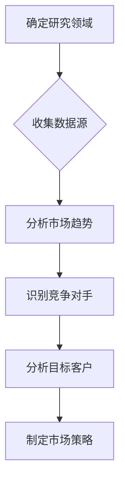

**步骤 2：收集数据源**
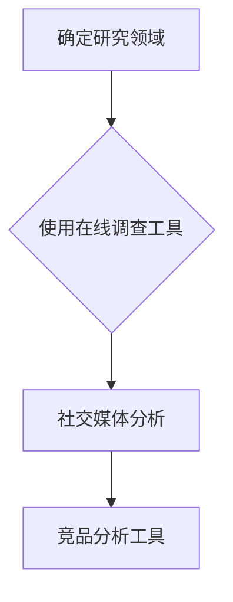

**步骤 3：分析市场趋势**
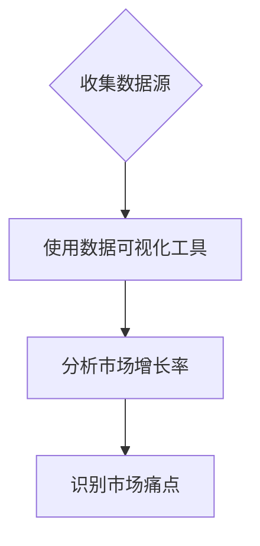

**步骤 4：识别竞争对手**
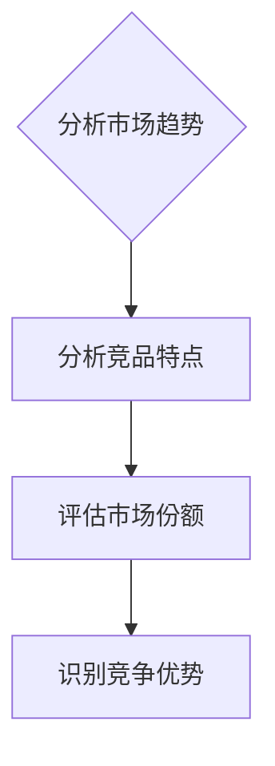

**步骤 5：分析目标客户**
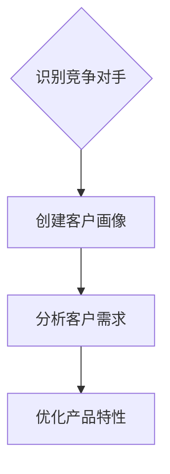

**步骤 6：制定市场策略**
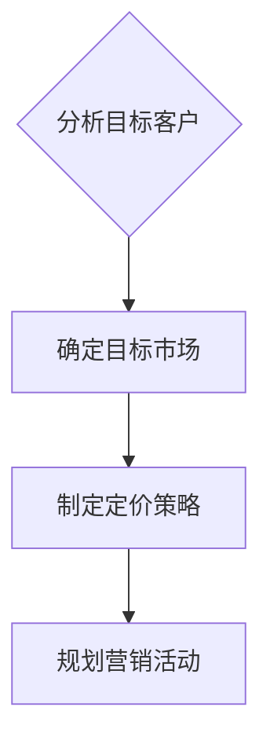

### 3.2 领导力的提升

#### 3.2.1 激励团队

**步骤 1：明确目标**
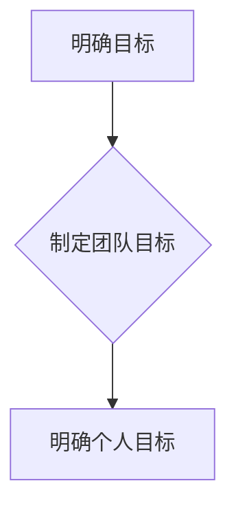

**步骤 2：认可贡献**
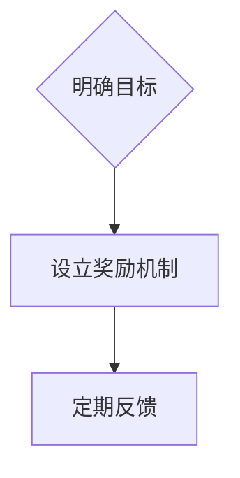

**步骤 3：提供支持**
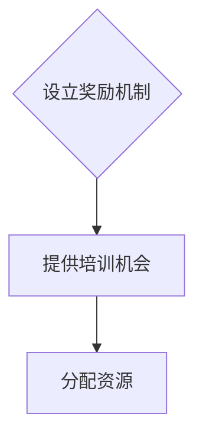

### 3.3 创业战略的制定

#### 3.3.1 产品市场匹配

**步骤 1：市场调研**
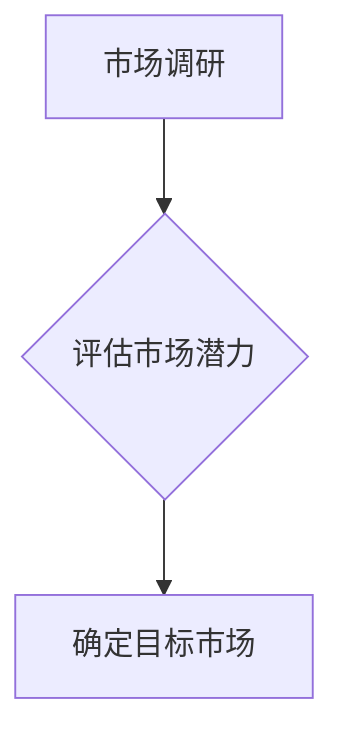

**步骤 2：用户反馈**
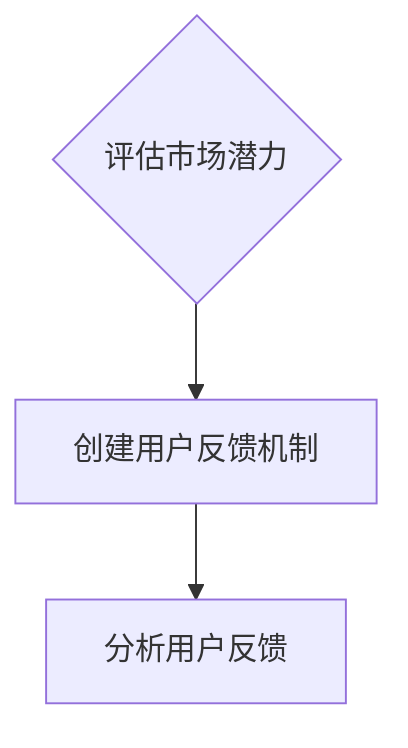

**步骤 3：竞争分析**
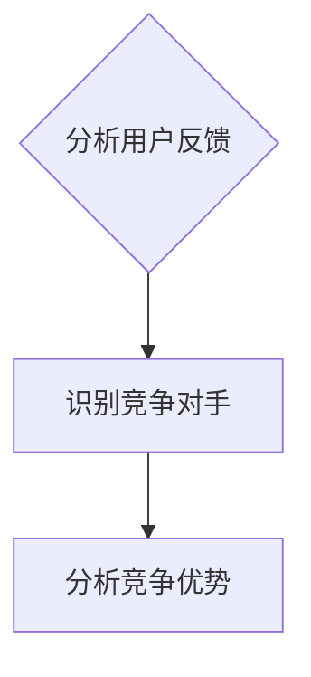

**步骤 4：资源配置**
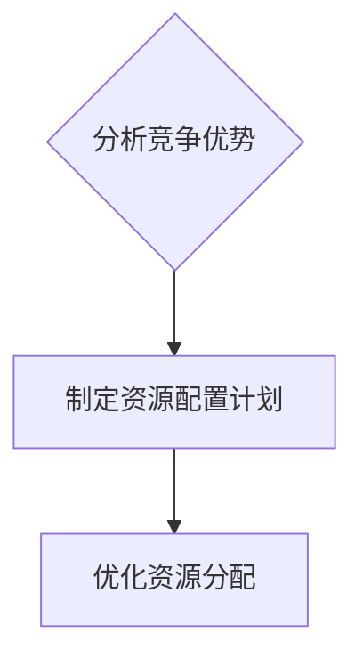

**步骤 5：市场推广**
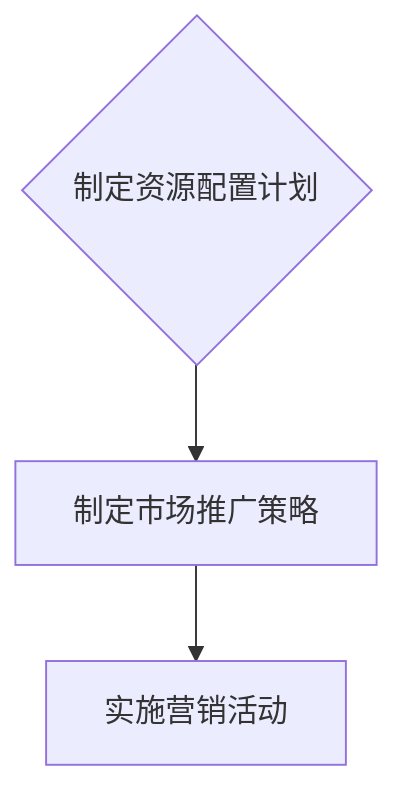

通过以上步骤，工程师可以逐步培养商业思维和领导力，为创业成功奠定坚实基础。接下来，我们将进一步探讨如何运用数学模型和公式来分析和优化商业决策。

## 4. 数学模型和公式 & 详细讲解 & 举例说明

在创业过程中，运用数学模型和公式可以帮助工程师更好地分析和优化商业决策。以下是一些关键的数学模型和公式，以及它们的详细讲解和举例说明：

### 4.1 投资回报率（ROI）

投资回报率（ROI）是一个衡量投资收益与成本的比率，用于评估投资的盈利能力。公式如下：

$$
ROI = \frac{净利润}{投资成本} \times 100\%
$$

**举例说明：**
假设一个创业项目总投资为10万美元，第一年的净利润为2万美元，那么该项目的ROI计算如下：

$$
ROI = \frac{20000}{100000} \times 100\% = 20\%
$$

这意味着该项目的投资回报率为20%。

### 4.2 盈亏平衡点（BEP）

盈亏平衡点是指企业在收入与成本相等的点上，不再产生亏损的状态。公式如下：

$$
BEP = \frac{固定成本}{边际贡献率}
$$

**举例说明：**
假设一家企业的固定成本为5万美元，每单位产品的边际贡献率为10美元，那么该企业的盈亏平衡点计算如下：

$$
BEP = \frac{50000}{10} = 5000
$$

这意味着企业需要卖出5000个产品才能达到盈亏平衡。

### 4.3 柯恩斯曲线（Cohort Analysis）

柯恩斯曲线用于分析特定时间段内用户的行为和留存率。公式如下：

$$
留存率 = \frac{特定时间段内留存用户数}{初始用户数} \times 100\%
$$

**举例说明：**
假设在一个月内，一个应用程序的初始用户数为1000人，其中500人在第一个月结束时仍然活跃，那么该应用程序的第一个月的留存率计算如下：

$$
留存率 = \frac{500}{1000} \times 100\% = 50\%
$$

### 4.4 资产负债表（Balance Sheet）

资产负债表是企业在特定时间点的财务状况的快照，包括资产、负债和所有者权益。公式如下：

$$
资产 = 负债 + 所有者权益
$$

**举例说明：**
假设一家企业的总资产为100万美元，总负债为30万美元，那么该企业的所有者权益计算如下：

$$
所有者权益 = 1000000 - 300000 = 700000
$$

### 4.5 收益增长率（Revenue Growth Rate）

收益增长率是衡量企业收入增长速度的指标，公式如下：

$$
收益增长率 = \frac{本期收入 - 上期收入}{上期收入} \times 100\%
$$

**举例说明：**
假设一家企业的上期收入为50万美元，本期收入为70万美元，那么该企业的收益增长率计算如下：

$$
收益增长率 = \frac{700000 - 500000}{500000} \times 100\% = 40\%
$$

### 4.6 资金时间价值（Time Value of Money）

资金时间价值是指资金在时间上的价值，考虑了通货膨胀、利息等因素。常用的公式包括现值（PV）和未来值（FV）：

$$
PV = \frac{FV}{(1 + r)^n}
$$

$$
FV = PV \times (1 + r)^n
$$

**举例说明：**
假设一个创业项目的预期未来收益为10万美元，年利率为5%，投资期限为3年，那么该项目的现值计算如下：

$$
PV = \frac{100000}{(1 + 0.05)^3} \approx 86,419
$$

通过运用这些数学模型和公式，工程师可以更科学地分析和评估商业决策，提高创业成功的可能性。接下来，我们将通过一个实际案例来展示如何将这些理论应用到实际项目中。

### 5. 项目实战：代码实际案例和详细解释说明

为了更好地展示如何将商业思维和领导力应用到实际项目中，我们将通过一个实际案例——一款基于机器学习的客户关系管理（CRM）系统，来详细说明开发过程。

#### 5.1 开发环境搭建

在开始项目之前，我们需要搭建一个适合开发的环境。以下是所需工具和环境的设置步骤：

1. **安装Python**
   - 版本：Python 3.8或更高
   - 安装命令：`pip install python`

2. **安装Jupyter Notebook**
   - 安装命令：`pip install jupyter`

3. **安装机器学习库**
   - scikit-learn：`pip install scikit-learn`
   - TensorFlow：`pip install tensorflow`

4. **安装数据库**
   - PostgreSQL：`sudo apt-get install postgresql`

5. **安装版本控制工具**
   - Git：`sudo apt-get install git`

#### 5.2 源代码详细实现和代码解读

##### 5.2.1 数据预处理

首先，我们需要从客户互动数据中提取有用的特征。以下是数据预处理阶段的伪代码：

```python
import pandas as pd
from sklearn.model_selection import train_test_split

# 加载数据
data = pd.read_csv('customer_data.csv')

# 数据清洗
data.dropna(inplace=True)
data = data[data['income'] > 0]

# 特征工程
data['age_band'] = pd.cut(data['age'], bins=[0, 30, 60, 100], labels=['青年', '中年', '老年'])

# 切分数据集
X = data.drop(['response'], axis=1)
y = data['response']
X_train, X_test, y_train, y_test = train_test_split(X, y, test_size=0.2, random_state=42)
```

**解读：**
- **数据加载：** 使用Pandas从CSV文件中加载数据。
- **数据清洗：** 删除缺失值，确保数据完整性。
- **特征工程：** 对年龄特征进行分组，以便模型更好地处理。

##### 5.2.2 模型选择与训练

接下来，我们需要选择合适的机器学习模型并对其进行训练。以下是模型选择和训练的伪代码：

```python
from sklearn.ensemble import RandomForestClassifier
from sklearn.model_selection import GridSearchCV

# 模型选择
model = RandomForestClassifier()

# 参数调优
param_grid = {'n_estimators': [100, 200, 300], 'max_depth': [10, 20, 30]}
grid_search = GridSearchCV(model, param_grid, cv=5)
grid_search.fit(X_train, y_train)

# 最佳模型
best_model = grid_search.best_estimator_
```

**解读：**
- **模型选择：** 选择随机森林模型，因为它在处理分类问题时表现良好。
- **参数调优：** 使用网格搜索进行参数调优，以找到最佳参数组合。
- **训练模型：** 使用最佳参数训练模型。

##### 5.2.3 模型评估与优化

最后，我们需要评估模型的性能并进行必要的优化。以下是模型评估和优化的伪代码：

```python
from sklearn.metrics import classification_report, accuracy_score

# 模型评估
predictions = best_model.predict(X_test)
print(classification_report(y_test, predictions))
print("Accuracy:", accuracy_score(y_test, predictions))

# 模型优化
best_model.fit(X_train, y_train)
predictions = best_model.predict(X_test)
print("Optimized Accuracy:", accuracy_score(y_test, predictions))
```

**解读：**
- **模型评估：** 使用分类报告和准确率来评估模型性能。
- **模型优化：** 通过重新训练模型来进一步提高准确率。

#### 5.3 代码解读与分析

通过以上步骤，我们成功搭建了一个基于机器学习的CRM系统。以下是代码解读和分析：

- **数据预处理：** 数据预处理是机器学习项目的关键步骤，确保数据质量对于模型的性能至关重要。
- **模型选择：** 随机森林模型在处理复杂特征时表现良好，适用于我们的CRM系统。
- **参数调优：** 通过网格搜索优化模型参数，可以提高模型的性能。
- **模型评估：** 分类报告和准确率是评估模型性能的常用指标，帮助我们了解模型的强项和弱点。
- **模型优化：** 重新训练模型以进一步提高准确率，确保模型在实际应用中表现优异。

通过以上实战案例，我们展示了如何将商业思维和领导力应用到实际项目中，实现从工程师到创业家的成功转型。接下来，我们将探讨商业思维和领导力在实际应用场景中的具体表现。

### 6. 实际应用场景

商业思维和领导力在创业家的实际工作中扮演着关键角色，以下是一些常见应用场景：

#### 6.1 产品开发

在产品开发过程中，商业思维帮助创业家确定市场需求，识别客户痛点，并设计出满足客户需求的产品。以下是一个应用案例：

**案例：** 一家创业公司开发了一款智能健身追踪器。在产品开发初期，创业家通过市场调研和用户访谈，发现许多健身爱好者对传统的健身追踪器不满意，主要是因为它们无法提供个性化的训练计划。创业家利用这一发现，开发了一款集健身追踪和个性化训练计划于一体的产品，大大提高了用户满意度。

#### 6.2 资源配置

资源配置是创业家面临的另一大挑战。通过商业思维，创业家可以合理分配资金、人力和物资，确保项目顺利进行。以下是一个应用案例：

**案例：** 一家初创公司计划推出一款智能家居产品。创业家在制定预算时，通过分析市场趋势和竞争环境，决定将大部分资金用于研发和营销，以确保产品能够迅速占领市场。

#### 6.3 团队管理

团队管理是创业家成功的关键因素。领导力帮助创业家激励团队，解决问题，并确保团队成员朝着共同目标努力。以下是一个应用案例：

**案例：** 一家创业公司开发出了一款创新的游戏。在开发过程中，团队遇到了许多技术难题。创业家通过积极的沟通和激励，带领团队克服了困难，最终成功推出了产品。

#### 6.4 市场推广

市场推广是吸引客户和建立品牌的关键。商业思维帮助创业家制定有效的市场推广策略，以下是一个应用案例：

**案例：** 一家创业公司推出了一款环保袋产品。创业家通过分析目标客户和市场趋势，决定利用社交媒体和环保活动进行推广，成功地吸引了大量关注和订单。

#### 6.5 应对挑战

在创业过程中，挑战和困难是不可避免的。商业思维和领导力帮助创业家分析问题，寻找解决方案，并保持团队的士气。以下是一个应用案例：

**案例：** 一家初创公司在产品上线初期遇到了供应链问题，导致产品无法按时交付。创业家通过快速调整供应链策略，并与客户沟通，最终解决了问题，挽回了损失。

通过以上实际应用场景，我们可以看到商业思维和领导力在创业过程中的重要性。它们帮助创业家制定战略、管理团队、推广产品和应对挑战，从而提高创业成功的可能性。

### 7. 工具和资源推荐

为了更好地培养商业思维和领导力，以下是学习资源、开发工具和框架的推荐：

#### 7.1 学习资源推荐

##### 7.1.1 书籍推荐

- **《创业维艰》（The Hard Thing About Hard Things）**：本·霍洛维茨
- **《精益创业》（The Lean Startup）**：埃里克·莱斯
- **《创业手册》（The Startup Playbook）**：维诺德·科拉
- **《从优秀到卓越》（Good to Great）**：吉姆·柯林斯

##### 7.1.2 在线课程

- **哈佛大学MBA课程（Harvard Business School Online）**
- **Coursera上的“创业与企业家精神”（Entrepreneurship）**
- **edX上的“商业思维与领导力”（Business Thinking and Leadership）**

##### 7.1.3 技术博客和网站

- **Medium上的“创业之路”（The Startup Path）**
- **TechCrunch**
- ** Entrepreneur**

#### 7.2 开发工具框架推荐

##### 7.2.1 IDE和编辑器

- **Visual Studio Code**
- **PyCharm**
- **IntelliJ IDEA**

##### 7.2.2 调试和性能分析工具

- **Postman**
- **New Relic**
- **JProfiler**

##### 7.2.3 相关框架和库

- **Django**
- **Flask**
- **TensorFlow**
- **Scikit-learn**

通过这些资源和工具，工程师可以更好地培养商业思维和领导力，为创业成功奠定坚实基础。

### 8. 总结：未来发展趋势与挑战

随着技术的不断进步和市场环境的变化，从工程师到创业家的转型将继续呈现出新的发展趋势和挑战。以下是一些关键趋势和挑战：

#### 8.1 人工智能与机器学习

人工智能（AI）和机器学习（ML）将在未来发挥越来越重要的作用。创业家可以利用这些技术来提高生产效率、优化客户体验和预测市场趋势。然而，这也带来了数据隐私和安全、算法偏见等挑战。

#### 8.2 数字化转型

数字化转型已成为各行业的主流趋势。创业家需要适应数字化时代的需求，利用云计算、物联网和大数据等新兴技术来提升业务效率。然而，数字化转型的过程中也面临技术门槛高、人才短缺等挑战。

#### 8.3 环境与可持续发展

可持续发展已成为全球关注的重要议题。创业家需要关注环保、资源利用和社会责任，开发出具有可持续性的产品和服务。然而，这要求创业家在商业战略中融入环保理念，并在资源有限的情况下进行创新。

#### 8.4 领导力与团队管理

领导力和团队管理是创业成功的基石。创业家需要不断提升自身领导力，培养团队协作精神，确保团队在快速变化的市场环境中保持竞争力。然而，领导力的培养需要时间，而且创业过程中不可避免地会遇到团队冲突和沟通问题。

#### 8.5 市场竞争

随着市场竞争的加剧，创业家需要具备敏锐的市场洞察力和快速响应能力。创业家需要持续关注市场动态，及时调整战略，以应对竞争对手的挑战。然而，市场的快速变化也带来了不确定性，需要创业家具备灵活的应变能力。

总之，未来发展趋势为创业家提供了新的机遇，但也带来了诸多挑战。创业家需要不断学习和适应，以保持竞争力并实现持续成功。

### 9. 附录：常见问题与解答

以下是一些关于从工程师到创业家转型过程中常见的问题及解答：

#### 9.1 如何平衡技术和管理职责？

**解答：** 转型过程中，工程师需要学会如何有效分配时间和管理任务。建议设立明确的工作优先级，将技术工作与管理职责分开，并在需要时寻求团队成员的支持。

#### 9.2 如何培养商业思维？

**解答：** 培养商业思维需要多方面的努力。阅读相关书籍、参加商业课程、与行业专家交流，以及实际参与商业决策都是有效的方法。

#### 9.3 如何提高领导力？

**解答：** 提高领导力需要不断实践和学习。建立良好的沟通技巧、积极参与团队建设、设定明确的目标和激励团队是提高领导力的关键。

#### 9.4 创业失败的原因有哪些？

**解答：** 创业失败的原因多种多样，包括市场调研不足、资金管理不当、团队管理不善、产品市场匹配不理想等。为了避免失败，创业家需要在创业初期就做好充分准备，并保持灵活性以应对市场变化。

### 10. 扩展阅读 & 参考资料

以下是一些关于从工程师到创业家转型的扩展阅读和参考资料：

- **《创业者的修炼：从工程师到企业家的蜕变》**：本书详细介绍了工程师如何成功转型为企业家。
- **《硅谷创业秘籍》**：作者分享了自己在硅谷创业的经历和心得，对于希望进入创业领域的工程师具有很高的参考价值。
- **《创业家精神》**：这本书探讨了创业家的心理特质和创业过程，有助于理解创业的本质。
- **《哈佛商学院MBA课程》**：在线平台提供的一系列MBA课程，涵盖商业思维、领导力等多个方面，适合创业家学习。

通过这些扩展阅读和参考资料，工程师可以进一步加深对从工程师到创业家转型过程的理解，为成功创业奠定坚实基础。

