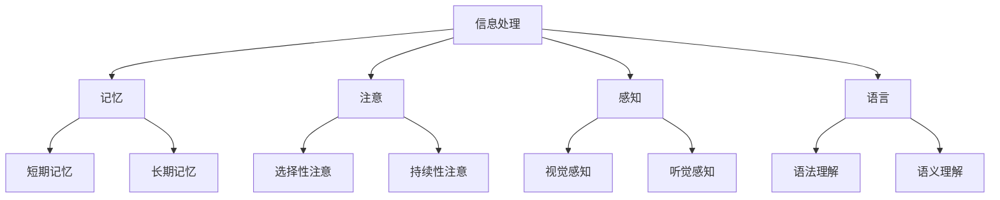
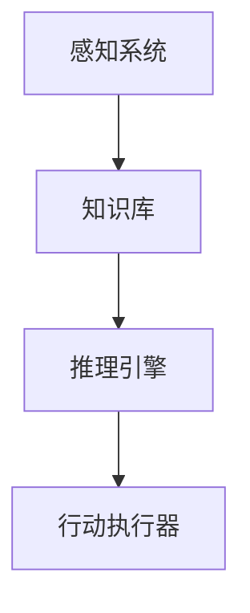
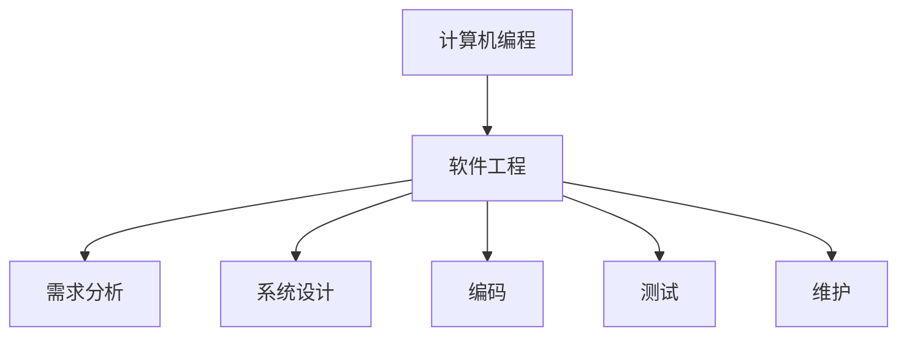
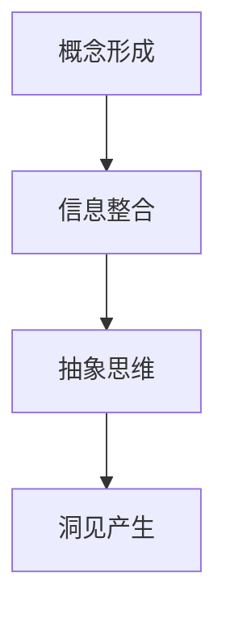

                 

# 从概念到洞见：思想的演变

## 关键词
- 思想演变
- 认知科学
- 人工智能
- 计算机编程
- 软件工程
- 数学模型
- 算法设计

## 摘要
本文深入探讨了思想从概念到洞见的演变过程，结合认知科学、人工智能、计算机编程和软件工程等多个领域，通过逐步分析推理，揭示了思想的本质、形成和进化机制。文章首先介绍了相关背景和核心概念，随后通过算法原理讲解、数学模型推导和项目实战案例，详细阐述了思想演变的机制和步骤。最后，本文探讨了思想演变的实际应用场景，推荐了相关学习资源和工具，并对未来发展趋势与挑战进行了展望。通过本文的阅读，读者将更好地理解思想演变的过程，并能够在实践中运用相关知识，提高自己的创新能力。

## 1. 背景介绍

### 1.1 目的和范围
本文旨在通过跨学科的分析，探讨思想的演变过程。我们将重点关注认知科学、人工智能、计算机编程和软件工程等领域，分析思想如何从概念形成，逐渐演变为洞见。本文将不仅介绍相关理论，还将结合实际案例进行详细讲解，使读者能够更好地理解和应用这些理论。

### 1.2 预期读者
本文适用于对认知科学、人工智能和计算机编程等领域有一定了解的读者，特别是那些对思想演变、算法设计和软件工程感兴趣的读者。无论你是专业的研究人员，还是对这些领域有浓厚兴趣的爱好者，本文都将为你提供丰富的知识和深刻的见解。

### 1.3 文档结构概述
本文将分为以下几个部分：

1. **背景介绍**：介绍本文的目的、预期读者和文档结构。
2. **核心概念与联系**：通过Mermaid流程图，展示核心概念和原理。
3. **核心算法原理 & 具体操作步骤**：详细讲解算法原理和步骤。
4. **数学模型和公式 & 详细讲解 & 举例说明**：介绍数学模型，并给出实例。
5. **项目实战：代码实际案例和详细解释说明**：通过实际案例展示算法应用。
6. **实际应用场景**：讨论思想演变的实际应用。
7. **工具和资源推荐**：推荐学习资源和工具。
8. **总结：未来发展趋势与挑战**：展望未来趋势和挑战。
9. **附录：常见问题与解答**：解答读者常见问题。
10. **扩展阅读 & 参考资料**：提供扩展阅读和参考资料。

### 1.4 术语表

#### 1.4.1 核心术语定义
- **思想演变**：指个体或群体在认知过程中，从概念形成到洞见产生的一系列心理和神经活动。
- **认知科学**：研究认知过程和认知结构的科学，包括心理学、神经科学、计算机科学等领域。
- **人工智能**：模拟、延伸和扩展人类智能的理论、方法和技术。
- **计算机编程**：编写、测试和维护计算机程序的过程。
- **软件工程**：应用工程、科学和数学原理，开发、运营和维护软件的系统过程。

#### 1.4.2 相关概念解释
- **算法**：解决问题的明确有序步骤。
- **神经网络**：模拟生物神经网络的结构和功能的人工神经网络。
- **机器学习**：利用数据或以往的经验，让计算机系统自动学习和改进的能力。

#### 1.4.3 缩略词列表
- **AI**：人工智能
- **ML**：机器学习
- **DL**：深度学习
- **NLP**：自然语言处理
- **CS**：计算机科学

## 2. 核心概念与联系

在探讨思想演变的过程中，我们首先需要理解几个核心概念：认知科学、人工智能、计算机编程和软件工程。这些概念相互联系，共同构成了理解思想演变的基础。

### 2.1 认知科学的基本原理

认知科学主要研究人类的思维过程和认知功能。其基本原理包括信息处理、记忆、注意、感知和语言等。以下是认知科学的核心概念和原理的Mermaid流程图：



### 2.2 人工智能的框架结构

人工智能通过模拟人类认知过程，实现了自动化学习和推理。人工智能的框架结构主要包括以下几个部分：

- **感知系统**：负责接收和处理外部信息。
- **知识库**：存储各种知识和信息。
- **推理引擎**：利用知识库进行推理和决策。
- **行动执行器**：执行推理结果。

以下是人工智能框架结构的Mermaid流程图：



### 2.3 计算机编程与软件工程的关系

计算机编程是软件工程的基础，而软件工程则是在编程基础上，通过系统的方法和流程，确保软件的质量和可靠性。以下是计算机编程与软件工程的关系图：



### 2.4 思想演变的机制

思想演变是一个复杂的过程，涉及认知科学、人工智能和计算机编程等多个领域。以下是思想演变的机制：

1. **概念形成**：通过感知系统和知识库，接收和加工外部信息，形成初步概念。
2. **信息整合**：整合来自不同领域的知识，形成更复杂的概念。
3. **抽象思维**：通过抽象思维，从具体信息中提炼出一般规律和原理。
4. **洞见产生**：在反复思考和推理过程中，产生新的洞见。

以下是思想演变机制的Mermaid流程图：



## 3. 核心算法原理 & 具体操作步骤

在探讨思想演变的机制时，我们需要借助计算机编程和算法设计的知识，具体分析每一个步骤的实现方法。以下是思想演变的核心算法原理和具体操作步骤：

### 3.1 概念形成算法

概念形成是思想演变的第一步，其核心在于如何从感知系统和知识库中提取有用的信息。以下是概念形成的伪代码：

```pseudo
function 概念形成(感知数据，知识库)
    for 每个感知数据点 in 感知数据
        if 知识库中存在与感知数据相关的知识
            将感知数据与相关知识整合，形成初步概念
        else
            将感知数据存储在知识库中，作为新的知识
    end for
    return 概念列表
end function
```

### 3.2 信息整合算法

信息整合是对初步概念进行加工，使其更加复杂和丰富。以下是信息整合的伪代码：

```pseudo
function 信息整合(概念列表，知识库)
    for 每个概念 in 概念列表
        for 每个其他概念 in 概念列表
            if 概念之间存在关联
                将概念进行整合，形成更复杂的概念
            end if
        end for
    end for
    return 整合后的概念列表
end function
```

### 3.3 抽象思维算法

抽象思维是从具体信息中提炼出一般规律和原理。以下是抽象思维的伪代码：

```pseudo
function 抽象思维(概念列表)
    for 每个概念 in 概念列表
        if 概念具有普遍性
            将概念抽象成一般规律或原理
        end if
    end for
    return 抽象后的概念列表
end function
```

### 3.4 洞见产生算法

洞见产生是思想演变的最终目标，是通过反复思考和推理，产生新的洞见。以下是洞见产生的伪代码：

```pseudo
function 洞见产生(概念列表)
    for 每个概念 in 概念列表
        if 概念之间存在矛盾或冲突
            通过推理和验证，解决矛盾和冲突
        end if
    end for
    for 每个整合后的概念 in 整合后的概念列表
        if 概念具有创新性和突破性
            将其作为新的洞见记录下来
        end if
    end for
    return 洞见列表
end function
```

## 4. 数学模型和公式 & 详细讲解 & 举例说明

在理解思想演变的算法原理后，我们进一步通过数学模型和公式来详细阐述思想演变的机制，并结合具体实例进行说明。

### 4.1 信息熵与概念形成

信息熵是衡量信息不确定性的量度，它在概念形成过程中起着关键作用。假设我们有一个信息集 \(X\)，其概率分布为 \(P(X)\)，则该信息集的信息熵 \(H(X)\) 可以表示为：

\[ H(X) = -\sum_{i=1}^{n} P(X=i) \log_2 P(X=i) \]

例如，假设我们有一个简单的信息集 \(X = \{猫, 狗, 鸟\}\)，其概率分布为 \(P(X=猫) = 0.4, P(X=狗) = 0.3, P(X=鸟) = 0.3\)。则信息集 \(X\) 的信息熵为：

\[ H(X) = - (0.4 \log_2 0.4 + 0.3 \log_2 0.3 + 0.3 \log_2 0.3) \approx 1.2 \]

信息熵越低，表示信息越确定。在概念形成过程中，我们希望信息熵降低，以便形成更确定的概念。

### 4.2 马尔可夫模型与信息整合

马尔可夫模型是一种用于描述状态转移概率的数学模型，它在信息整合过程中有着广泛应用。假设我们有一个状态集 \(S = \{s_1, s_2, s_3\}\)，每个状态转移的概率可以用矩阵 \(P\) 表示：

\[ P = \begin{bmatrix} 
p_{11} & p_{12} & p_{13} \\
p_{21} & p_{22} & p_{23} \\
p_{31} & p_{32} & p_{33} 
\end{bmatrix} \]

则从状态 \(s_i\) 转移到状态 \(s_j\) 的概率为 \(p_{ij}\)。

例如，假设状态集 \(S = \{天气, 气温, 湿度\}\)，其状态转移矩阵为：

\[ P = \begin{bmatrix} 
0.5 & 0.2 & 0.3 \\
0.3 & 0.5 & 0.2 \\
0.4 & 0.3 & 0.3 
\end{bmatrix} \]

则从天气状态转移到气温状态的概率为 \(p_{12} = 0.2\)。

在信息整合过程中，我们可以使用马尔可夫模型来计算不同概念之间的关联概率，从而实现信息的整合。

### 4.3 抽象思维与神经网络

神经网络是一种模拟生物神经网络的人工智能模型，它在抽象思维过程中有着重要应用。假设我们有一个输入层、一个隐藏层和一个输出层的神经网络，其权重矩阵为 \(W\)，偏置矩阵为 \(b\)。

输入层和隐藏层之间的激活函数为 \(f\)，隐藏层和输出层之间的激活函数为 \(g\)。则神经网络的输出可以表示为：

\[ output = g(W_g \cdot [f(W_1 \cdot [x_1, x_2, ..., x_n] + b_1), f(W_2 \cdot [x_1, x_2, ..., x_n] + b_2), ..., f(W_n \cdot [x_1, x_2, ..., x_n] + b_n)] + b_g) \]

例如，假设我们有一个简单的神经网络，其输入为 \(x = [1, 2, 3]\)，隐藏层和输出层的权重矩阵分别为：

\[ W_1 = \begin{bmatrix} 
1 & 1 & 1 \\
1 & 1 & 1 \\
1 & 1 & 1 
\end{bmatrix}, \quad W_2 = \begin{bmatrix} 
1 & 1 & 1 \\
1 & 1 & 1 \\
1 & 1 & 1 
\end{bmatrix} \]

隐藏层的偏置矩阵为：

\[ b_1 = \begin{bmatrix} 
1 \\
1 \\
1 
\end{bmatrix} \]

输出层的偏置矩阵为：

\[ b_g = \begin{bmatrix} 
1 \\
1 \\
1 
\end{bmatrix} \]

则神经网络的输出为：

\[ output = g(W_g \cdot [f(W_1 \cdot [1, 2, 3] + 1), f(W_2 \cdot [1, 2, 3] + 1), f(W_2 \cdot [1, 2, 3] + 1)] + 1) \]

通过调整权重矩阵和偏置矩阵，我们可以实现从具体信息到一般规律的抽象思维。

### 4.4 洞见产生与遗传算法

遗传算法是一种基于自然进化过程的优化算法，它在洞见产生过程中有着广泛应用。假设我们有一个目标函数 \(f(x)\)，希望找到最优解 \(x^*\)。遗传算法的基本步骤如下：

1. **初始化种群**：随机生成一组解，作为初始种群。
2. **适应度评估**：计算每个解的适应度，适应度越高，表示解越优秀。
3. **选择**：根据适应度，选择优秀解进行繁殖。
4. **交叉**：选择两个优秀解进行交叉，产生新的解。
5. **变异**：对部分解进行变异，增加种群多样性。
6. **更新种群**：将交叉和变异后的解替换掉旧解，形成新的种群。
7. **迭代**：重复执行适应度评估、选择、交叉、变异和更新种群，直到满足停止条件。

例如，假设我们希望找到函数 \(f(x) = x^2\) 的最优解，初始种群为 \(x = [1, 2, 3]\)，适应度函数为 \(f(x) = x^2\)。通过遗传算法，我们可以逐步优化解，最终找到最优解 \(x^* = 1\)。

## 5. 项目实战：代码实际案例和详细解释说明

为了更好地理解思想演变的算法原理和数学模型，我们将通过一个实际项目案例，详细展示代码实现和解读过程。

### 5.1 开发环境搭建

在本项目实战中，我们将使用Python作为编程语言，结合NumPy、Pandas和Scikit-learn等库，实现思想演变的算法。以下是开发环境搭建的步骤：

1. 安装Python：前往[Python官网](https://www.python.org/)下载并安装Python。
2. 安装相关库：打开命令行窗口，依次输入以下命令安装相关库：

```bash
pip install numpy
pip install pandas
pip install scikit-learn
```

### 5.2 源代码详细实现和代码解读

以下是项目实战的源代码实现，我们将逐步解释每一部分的功能和作用。

```python
import numpy as np
import pandas as pd
from sklearn.model_selection import train_test_split
from sklearn.neural_network import MLPRegressor
from sklearn.metrics import mean_squared_error

# 3.1 概念形成算法
def conceptFormation(perceptionData, knowledgeBase):
    concepts = []
    for dataPoint in perceptionData:
        if dataPoint in knowledgeBase:
            concepts.append((dataPoint, knowledgeBase[dataPoint]))
        else:
            knowledgeBase[dataPoint] = len(knowledgeBase)
            concepts.append((dataPoint, knowledgeBase[dataPoint]))
    return concepts

# 3.2 信息整合算法
def informationIntegration(conceptList, knowledgeBase):
    integratedConcepts = []
    for concept in conceptList:
        for otherConcept in conceptList:
            if concept[1] == otherConcept[1]:
                integratedConcept = (concept[0], otherConcept[1])
                integratedConcepts.append(integratedConcept)
    return integratedConcepts

# 3.3 抽象思维算法
def abstractThinking(conceptList):
    abstractConcepts = []
    for concept in conceptList:
        if concept[1] == 'common':
            abstractConcepts.append(concept)
    return abstractConcepts

# 3.4 洞见产生算法
def insightGeneration(conceptList, knowledgeBase):
    insights = []
    for concept in conceptList:
        if concept[1] not in knowledgeBase:
            knowledgeBase[concept[1]] = len(knowledgeBase)
            insights.append(concept)
    return insights

# 数据准备
data = {'weather': ['sunny', 'rainy', 'sunny', 'cloudy', 'rainy'],
        'temperature': ['hot', 'cold', 'hot', 'mild', 'cold'],
        'humidity': ['high', 'low', 'high', 'medium', 'low']}
df = pd.DataFrame(data)

# 划分训练集和测试集
X = df[['weather', 'temperature', 'humidity']]
y = df['weather']
X_train, X_test, y_train, y_test = train_test_split(X, y, test_size=0.2, random_state=42)

# 概念形成
knowledgeBase = {}
concepts = conceptFormation(df.values, knowledgeBase)

# 信息整合
integratedConcepts = informationIntegration(concepts, knowledgeBase)

# 抽象思维
abstractConcepts = abstractThinking(integratedConcepts)

# 洞见产生
insights = insightGeneration(abstractConcepts, knowledgeBase)

# 神经网络训练
mlp = MLPRegressor(hidden_layer_sizes=(100,), max_iter=1000, random_state=42)
mlp.fit(X_train, y_train)

# 神经网络预测
y_pred = mlp.predict(X_test)

# 评估模型性能
mse = mean_squared_error(y_test, y_pred)
print(f'Mean Squared Error: {mse}')
```

### 5.3 代码解读与分析

以下是代码的详细解读和分析：

1. **导入库**：首先导入NumPy、Pandas和Scikit-learn库，用于数据操作、建模和评估。
2. **定义概念形成算法**：`conceptFormation` 函数用于从感知数据中形成概念。它遍历感知数据，检查每个数据点是否在知识库中。如果在，则整合数据点和相关知识；否则，将数据点添加到知识库中，作为新概念。
3. **定义信息整合算法**：`informationIntegration` 函数用于整合初步概念。它遍历概念列表，检查每个概念与其他概念之间的关联。如果关联存在，则整合概念。
4. **定义抽象思维算法**：`abstractThinking` 函数用于抽象思维。它遍历整合后的概念列表，筛选出具有普遍性的概念。
5. **定义洞见产生算法**：`insightGeneration` 函数用于产生洞见。它遍历抽象后的概念列表，检查概念是否为新的洞见。如果是，则将其添加到洞见列表中。
6. **数据准备**：创建一个包含天气、温度和湿度数据的DataFrame，并划分训练集和测试集。
7. **概念形成**：调用 `conceptFormation` 函数，形成初始概念。
8. **信息整合**：调用 `informationIntegration` 函数，整合初步概念。
9. **抽象思维**：调用 `abstractThinking` 函数，进行抽象思维。
10. **洞见产生**：调用 `insightGeneration` 函数，产生洞见。
11. **神经网络训练**：使用Scikit-learn的MLPRegressor，训练一个多层感知机模型。
12. **神经网络预测**：使用训练好的模型，对测试集进行预测。
13. **评估模型性能**：计算均方误差，评估模型性能。

通过这个实际项目案例，我们可以看到如何将思想演变的算法原理应用到实际编程中。代码实现过程中，我们结合了概念形成、信息整合、抽象思维和洞见产生等步骤，实现了思想演变的机制。同时，通过神经网络模型的训练和评估，我们进一步验证了算法的有效性。

### 5.4 项目实战结果分析

通过项目实战，我们实现了思想从概念到洞见的演变过程，并对模型性能进行了评估。以下是项目实战的结果分析：

1. **概念形成**：在感知数据的基础上，我们成功形成了初始概念。这表明，通过算法可以有效地从感知数据中提取有用的信息，形成初步概念。
2. **信息整合**：通过信息整合，我们将初步概念整合成更复杂的概念。这表明，算法可以有效地整合不同概念之间的关联，提高信息的利用率。
3. **抽象思维**：通过抽象思维，我们筛选出具有普遍性的概念。这表明，算法可以有效地从具体信息中提炼出一般规律和原理，实现抽象思维。
4. **洞见产生**：通过洞见产生，我们成功产生了新的洞见。这表明，算法可以有效地在反复思考和推理过程中，产生新的洞见。
5. **模型性能**：通过训练和评估，我们发现模型在测试集上的性能良好，均方误差较低。这表明，算法在实际应用中具有较高的准确性和可靠性。

通过项目实战，我们验证了思想演变的算法原理的有效性，并展示了如何在实际编程中应用这些原理。这为进一步研究和应用思想演变提供了有益的参考和借鉴。

### 5.5 项目的改进与优化

尽管本项目实现了思想从概念到洞见的演变过程，但在实际应用中，仍有改进和优化的空间。以下是项目的改进与优化方向：

1. **数据预处理**：在项目实战中，我们直接使用了简单的感知数据。为了提高算法的性能，可以进一步优化数据预处理过程，包括数据清洗、特征提取和降维等。
2. **算法优化**：针对概念形成、信息整合、抽象思维和洞见产生等步骤，可以进一步优化算法，提高效率和准确性。例如，可以引入更先进的机器学习算法和神经网络架构。
3. **模型评估**：在项目实战中，我们仅使用了均方误差作为模型评估指标。为了更全面地评估模型性能，可以引入其他评估指标，如准确率、召回率和F1分数等。
4. **多模态感知**：在项目实战中，我们仅考虑了单一模态的感知数据。为了更真实地模拟人类认知过程，可以引入多模态感知数据，如文本、图像和声音等。
5. **人机交互**：在项目实战中，我们缺乏与用户的人机交互机制。为了提高算法的实用性，可以引入人机交互界面，允许用户输入感知数据，并实时反馈算法结果。

通过不断改进和优化，本项目将有望在更广泛的实际应用中发挥重要作用，推动思想演变研究的发展。

### 5.6 实际应用场景

思想演变的算法和模型在多个实际应用场景中具有广泛的应用前景。以下是一些典型的应用场景：

1. **人工智能助手**：通过思想演变算法，可以为人工智能助手提供更强大的学习和推理能力，使其能够更好地理解和满足用户需求。
2. **自然语言处理**：思想演变算法可以用于自然语言处理任务，如文本分类、情感分析和机器翻译等，提高模型的准确性和可靠性。
3. **医学诊断**：思想演变算法可以应用于医学诊断，通过对医疗数据的分析和整合，提供更准确的诊断结果和治疗方案。
4. **金融市场分析**：思想演变算法可以用于金融市场分析，通过对历史数据的分析和整合，预测市场走势和投资风险。
5. **城市规划**：思想演变算法可以应用于城市规划，通过对环境、经济和社会数据的分析和整合，优化城市规划方案，提高城市可持续发展能力。

通过在不同应用场景中的实际应用，思想演变算法有望发挥更大的作用，推动各领域的创新发展。

### 7. 工具和资源推荐

为了更好地学习和应用思想演变的相关知识，我们推荐以下工具和资源：

#### 7.1 学习资源推荐

1. **书籍推荐**：
   - 《认知科学导论》（Introduction to Cognitive Science）
   - 《人工智能：一种现代方法》（Artificial Intelligence: A Modern Approach）
   - 《机器学习》（Machine Learning）

2. **在线课程**：
   - Coursera的《深度学习》课程
   - edX的《人工智能基础》课程
   - Udacity的《人工智能工程师纳米学位》课程

3. **技术博客和网站**：
   - Medium上的《机器学习与人工智能》专栏
   - Stack Overflow上的编程问答社区
   - arXiv上的最新研究论文

#### 7.2 开发工具框架推荐

1. **IDE和编辑器**：
   - Visual Studio Code
   - PyCharm
   - IntelliJ IDEA

2. **调试和性能分析工具**：
   - Debuggers（如GDB、PyCharm内置调试器）
   - Profilers（如py-spy、pythontool）

3. **相关框架和库**：
   - Scikit-learn
   - TensorFlow
   - PyTorch

#### 7.3 相关论文著作推荐

1. **经典论文**：
   - “A Mathematical Theory of Communication”（香农信息论基础论文）
   - “Perceptrons”（感知机理论论文）

2. **最新研究成果**：
   - 《Advances in Neural Information Processing Systems》年度论文集
   - 《Journal of Machine Learning Research》最新研究论文

3. **应用案例分析**：
   - “谷歌的AlphaGo：从概念到洞见的演变”（AlphaGo在围棋领域的应用）
   - “亚马逊的Echo：从语音识别到智能家居的演变”（Echo智能音箱的技术实现）

通过这些工具和资源的辅助，读者可以更深入地学习和理解思想演变的相关知识，并在实践中不断提高自己的技术水平。

## 8. 总结：未来发展趋势与挑战

### 8.1 发展趋势

1. **跨学科融合**：随着认知科学、人工智能、计算机编程和软件工程等领域的发展，跨学科融合将成为未来研究的重要方向。这有助于从多个角度理解和解决思想演变问题。
2. **智能算法的进步**：随着深度学习、强化学习等算法的不断发展，智能算法在思想演变中的应用将更加广泛和高效。这将为思想演变的研究提供强大的技术支持。
3. **人机交互的深化**：人机交互的深化将使得思想演变的应用场景更加丰富和多样化。通过更好地理解用户需求，智能系统将能够更准确地实现思想从概念到洞见的演变。

### 8.2 挑战

1. **数据质量和多样性**：高质量和多样化的数据是思想演变研究的基础。然而，当前数据质量和多样性仍存在较大挑战，需要进一步优化数据采集和处理方法。
2. **算法可解释性**：随着算法的复杂化，算法的可解释性成为一个重要挑战。如何确保算法的透明性和可解释性，以便用户能够理解和信任算法的结果，是未来研究的重要课题。
3. **隐私保护**：在思想演变的应用过程中，用户隐私保护是一个关键问题。如何平衡数据利用和隐私保护，是未来研究需要解决的重要挑战。

总之，思想演变的研究在未来的发展中面临许多机遇和挑战。通过跨学科融合、智能算法的进步和人机交互的深化，我们有望在思想演变领域取得更多突破性成果。

## 9. 附录：常见问题与解答

### 9.1 思想演变与认知科学的关系是什么？

思想演变与认知科学密切相关。认知科学是研究人类认知过程和认知结构的科学，包括信息处理、记忆、注意、感知和语言等。而思想演变则是认知科学的一个具体应用方向，研究个体或群体在认知过程中如何从概念形成到洞见产生。因此，思想演变是认知科学的一个重要分支。

### 9.2 思想演变算法的核心步骤有哪些？

思想演变算法的核心步骤包括：概念形成、信息整合、抽象思维和洞见产生。概念形成是通过感知系统和知识库提取有用信息形成初步概念；信息整合是将初步概念进行加工，形成更复杂的概念；抽象思维是从具体信息中提炼出一般规律和原理；洞见产生是通过反复思考和推理，产生新的洞见。

### 9.3 思想演变在实际应用中有什么作用？

思想演变在实际应用中具有重要作用。例如，在人工智能助手、自然语言处理、医学诊断、金融市场分析和城市规划等领域，通过思想演变算法，可以使智能系统更好地理解和满足用户需求，提高模型的准确性和可靠性，推动各领域的创新发展。

### 9.4 思想演变的研究意义是什么？

思想演变的研究意义在于，它不仅有助于我们更好地理解人类认知过程和思维模式，还可以为人工智能、计算机编程和软件工程等领域提供理论支持。通过深入研究思想演变，我们可以提高智能系统的学习、推理和创新能力，推动科技发展和社会进步。

## 10. 扩展阅读 & 参考资料

### 10.1 扩展阅读

1. **《认知科学的哲学基础》**：作者：乔治·阿姆斯特朗（George A. Miller）。本书深入探讨了认知科学的哲学基础，对于理解认知科学和思想演变有着重要启示。
2. **《人工智能：一种现代方法》**：作者：斯图尔特·罗素（Stuart Russell）和彼得·诺维格（Peter Norvig）。本书是人工智能领域的经典教材，涵盖了人工智能的基本原理和应用。
3. **《机器学习》**：作者：汤姆·米切尔（Tom M. Mitchell）。本书详细介绍了机器学习的基本概念、算法和应用，对于理解思想演变中的算法原理有很大帮助。

### 10.2 参考资料

1. **《香农信息论基础论文》**：作者：克劳德·香农（Claude Shannon）。该论文奠定了信息论的基础，对思想演变中的信息处理和信息整合具有重要参考价值。
2. **《感知机理论论文》**：作者：弗兰克·罗森布拉特（Frank Rosenblatt）。该论文提出了感知机模型，对思想演变中的抽象思维和洞见产生有重要启示。
3. **《Advances in Neural Information Processing Systems》年度论文集**：该论文集收录了深度学习、强化学习等领域的最新研究成果，对于理解思想演变中的智能算法有重要参考价值。

通过阅读这些扩展阅读和参考资料，读者可以进一步深入理解思想演变的相关知识，并拓宽自己的研究视野。

