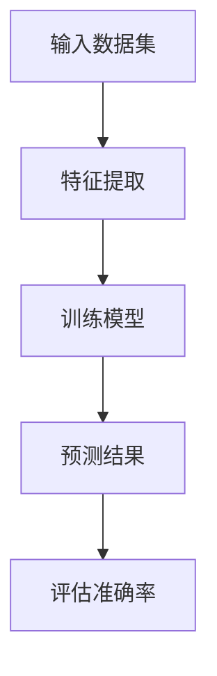
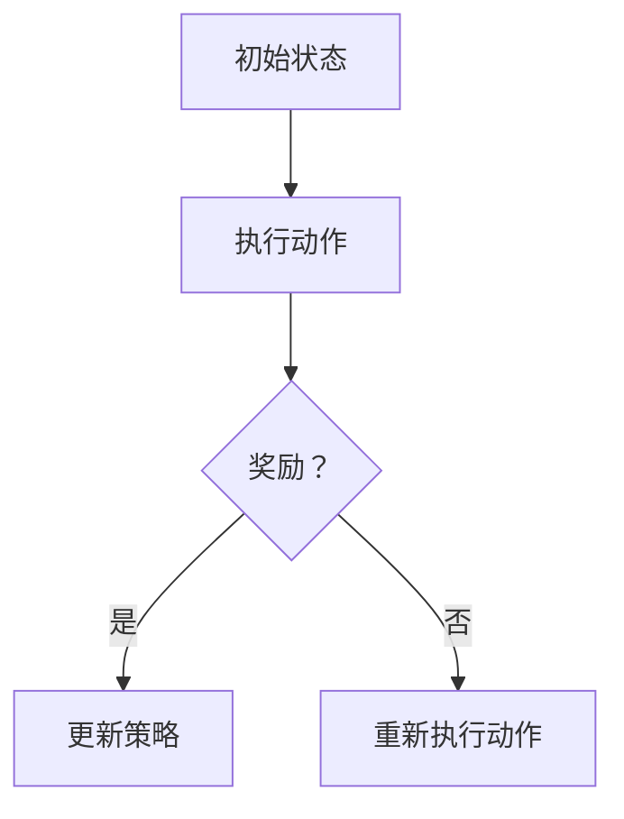
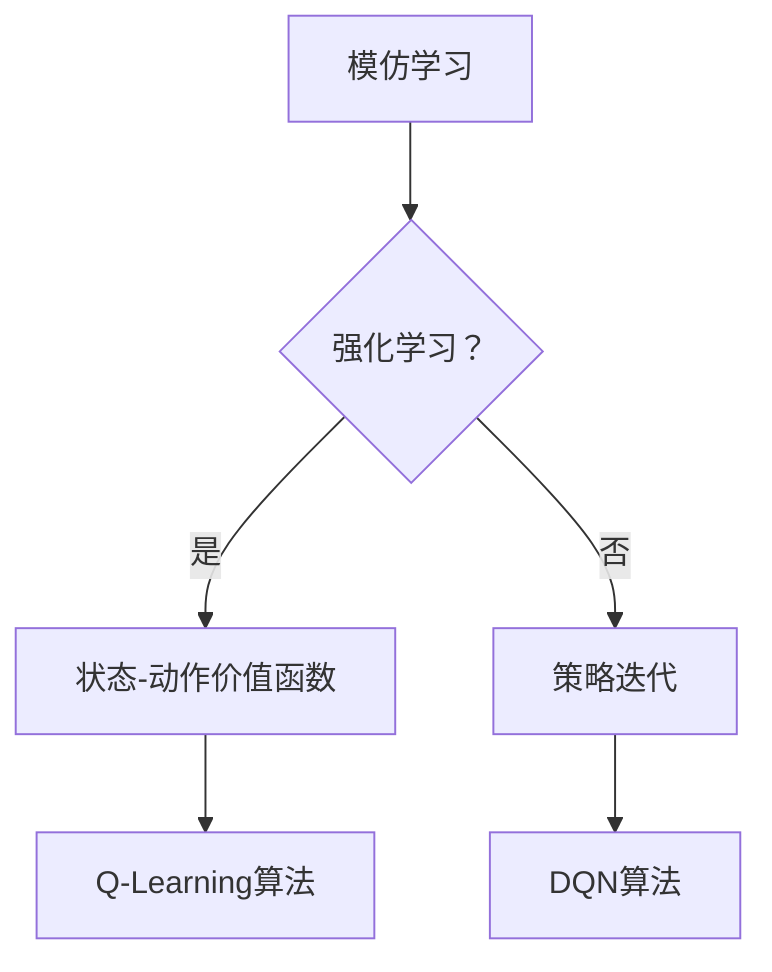

                 

### 从模仿学习到强化学习: AI发展的下一个里程碑

> 关键词：模仿学习、强化学习、AI发展、算法原理、应用场景、未来趋势

摘要：本文旨在探讨人工智能（AI）领域中从模仿学习到强化学习的发展历程。通过一步步的推理思考，我们将深入了解这两大核心算法原理，分析其相互联系，探讨强化学习在现实世界中的应用，并展望其未来发展趋势和挑战。本文结构紧凑、逻辑清晰，旨在为广大读者提供一份有深度、有思考、有见解的专业技术指南。

### 1. 背景介绍

#### 1.1 目的和范围

本文旨在梳理人工智能（AI）领域中模仿学习和强化学习的发展历程，分析其核心算法原理，探讨其在现实世界中的应用，并展望未来发展趋势。通过对这两大核心算法的深入剖析，读者将更好地理解AI技术的本质，掌握从模仿学习到强化学习的演进过程，为未来AI研究和发展提供有益的参考。

#### 1.2 预期读者

本文面向对人工智能有一定了解的读者，包括但不限于计算机科学专业学生、程序员、软件工程师、AI研究者等。本文假设读者具备基本的编程能力和数学基础，但无需深入了解复杂的算法细节。

#### 1.3 文档结构概述

本文分为十个部分，结构如下：

1. **背景介绍**：介绍本文的目的、范围、预期读者和文档结构。
2. **核心概念与联系**：阐述模仿学习和强化学习的核心概念及其相互联系。
3. **核心算法原理 & 具体操作步骤**：详细讲解模仿学习和强化学习的算法原理及操作步骤。
4. **数学模型和公式 & 详细讲解 & 举例说明**：介绍相关数学模型和公式，并进行举例说明。
5. **项目实战：代码实际案例和详细解释说明**：通过实际代码案例，展示算法原理和应用。
6. **实际应用场景**：探讨强化学习在实际中的应用场景。
7. **工具和资源推荐**：推荐学习资源和开发工具框架。
8. **总结：未来发展趋势与挑战**：展望强化学习在未来的发展趋势和面临的挑战。
9. **附录：常见问题与解答**：回答读者可能遇到的问题。
10. **扩展阅读 & 参考资料**：提供进一步学习的资源和参考资料。

#### 1.4 术语表

##### 1.4.1 核心术语定义

- **模仿学习**：一种机器学习方法，通过观察环境中的数据，使模型学会执行特定任务。
- **强化学习**：一种机器学习方法，通过奖励和惩罚机制，使模型学会在复杂环境中做出最优决策。
- **奖励**：模型在执行任务时获得的正面反馈，用于鼓励模型做出正确的决策。
- **惩罚**：模型在执行任务时获得的负面反馈，用于阻止模型做出错误的决策。

##### 1.4.2 相关概念解释

- **策略**：模型在特定情况下采取的行动方案。
- **状态**：模型在某个时刻所处的环境条件。
- **动作**：模型在某个状态下执行的操作。

##### 1.4.3 缩略词列表

- **AI**：人工智能
- **ML**：机器学习
- **RL**：强化学习
- **Q-Learning**：Q值学习
- **DQN**：深度Q网络

## 2. 核心概念与联系

在人工智能（AI）的发展历程中，模仿学习和强化学习是两大重要的里程碑。模仿学习使机器能够通过观察环境中的数据学习执行特定任务，而强化学习则使机器能够在复杂环境中自主做出最优决策。本节将详细介绍这两大核心概念，并探讨它们之间的相互联系。

### 2.1 模仿学习

模仿学习，又称监督学习，是一种机器学习方法，通过观察环境中的数据，使模型学会执行特定任务。模仿学习的核心在于“模仿”，即模型通过学习已有数据的特征和模式，来预测或生成新的数据。在模仿学习中，通常需要三个要素：训练数据集、特征提取和预测模型。

**Mermaid流程图：**



### 2.2 强化学习

强化学习是一种通过奖励和惩罚机制，使模型学会在复杂环境中做出最优决策的机器学习方法。强化学习的核心在于“决策”，即模型在特定状态下选择最优动作，以获得最大奖励。强化学习通常包括四个要素：状态、动作、奖励和策略。

**Mermaid流程图：**



### 2.3 模仿学习与强化学习的联系

模仿学习和强化学习在本质上有一定的联系。两者都旨在通过学习已有数据或经验，使模型能够执行特定任务。然而，强化学习在模仿学习的基础上，增加了奖励和惩罚机制，使模型能够在复杂环境中做出最优决策。

**Mermaid流程图：**



通过上述流程图，我们可以看到，强化学习在模仿学习的基础上，引入了状态-动作价值函数和Q-Learning算法，以及深度Q网络（DQN）算法。这些算法和概念使得强化学习在复杂环境中具有更高的决策能力，为人工智能的发展开辟了新的方向。

## 3. 核心算法原理 & 具体操作步骤

在深入探讨强化学习之前，我们需要了解模仿学习的核心算法原理和具体操作步骤。以下是模仿学习的简要介绍：

### 3.1 模仿学习算法原理

模仿学习，又称监督学习，其核心在于通过学习已有数据的特征和模式，使模型能够预测或生成新的数据。模仿学习的算法原理可以概括为以下三个步骤：

1. **数据预处理**：对输入数据进行清洗、归一化等处理，以消除噪声和异常值，提高模型训练效果。
2. **特征提取**：从输入数据中提取关键特征，以降低数据维度，便于模型学习。
3. **模型训练**：利用训练数据集，通过特征提取和预测模型，对模型进行训练，使其能够预测或生成新的数据。

### 3.2 模仿学习具体操作步骤

以下是模仿学习具体操作步骤的伪代码：

```python
# 模仿学习伪代码

# 数据预处理
def preprocess_data(data):
    # 清洗、归一化等处理
    return processed_data

# 特征提取
def extract_features(data):
    # 提取关键特征
    return features

# 模型训练
def train_model(features, labels):
    # 利用特征和标签训练模型
    model.fit(features, labels)
    return model

# 主函数
def main():
    # 加载数据
    data = load_data()
    
    # 数据预处理
    processed_data = preprocess_data(data)
    
    # 特征提取
    features = extract_features(processed_data)
    
    # 分割数据集
    train_features, test_features, train_labels, test_labels = train_test_split(features, labels)
    
    # 模型训练
    model = train_model(train_features, train_labels)
    
    # 模型评估
    accuracy = model.evaluate(test_features, test_labels)
    print("模型准确率：", accuracy)

# 运行主函数
main()
```

通过上述伪代码，我们可以看到模仿学习的主要步骤：数据预处理、特征提取和模型训练。在实际应用中，模仿学习算法可以根据具体问题进行调整和优化，以提高模型性能。

接下来，我们将详细介绍强化学习的核心算法原理和具体操作步骤。

### 3.3 强化学习算法原理

强化学习（Reinforcement Learning，简称RL）是一种通过奖励和惩罚机制，使模型学会在复杂环境中做出最优决策的机器学习方法。强化学习的核心在于“决策”，即模型在特定状态下选择最优动作，以获得最大奖励。强化学习的算法原理可以概括为以下四个步骤：

1. **状态初始化**：模型开始学习时，需要初始化状态。
2. **选择动作**：模型在特定状态下，根据策略选择动作。
3. **执行动作**：模型执行选择的动作，并观察环境反馈。
4. **更新策略**：根据执行动作后的奖励和惩罚，更新策略，以实现最优决策。

### 3.4 强化学习具体操作步骤

以下是强化学习具体操作步骤的伪代码：

```python
# 强化学习伪代码

# 初始化状态
def initialize_state():
    # 初始化状态
    state = initial_state
    return state

# 选择动作
def select_action(state):
    # 根据策略选择动作
    action = policy.select_action(state)
    return action

# 执行动作
def execute_action(state, action):
    # 执行动作，并观察环境反馈
    next_state, reward, done = environment.step(action)
    return next_state, reward, done

# 更新策略
def update_policy(state, action, reward, next_state, done):
    # 根据奖励和惩罚，更新策略
    policy.update(state, action, reward, next_state, done)

# 主函数
def main():
    # 初始化状态
    state = initialize_state()
    
    # 循环执行动作，直到达到终止条件
    while not done:
        # 选择动作
        action = select_action(state)
        
        # 执行动作
        next_state, reward, done = execute_action(state, action)
        
        # 更新策略
        update_policy(state, action, reward, next_state, done)
        
        # 更新状态
        state = next_state

# 运行主函数
main()
```

通过上述伪代码，我们可以看到强化学习的主要步骤：状态初始化、选择动作、执行动作和更新策略。在实际应用中，强化学习算法可以根据具体问题进行调整和优化，以提高模型性能。

## 4. 数学模型和公式 & 详细讲解 & 举例说明

在深入探讨强化学习之前，我们需要了解其数学模型和公式，这些公式在强化学习中起到关键作用，有助于我们更好地理解算法原理和实现方法。

### 4.1 强化学习基本概念

在强化学习中，核心概念包括状态（State）、动作（Action）、奖励（Reward）、策略（Policy）和价值函数（Value Function）。

- **状态（State）**：模型在某个时刻所处的环境条件。
- **动作（Action）**：模型在特定状态下执行的操作。
- **奖励（Reward）**：模型在执行动作后获得的正面反馈。
- **策略（Policy）**：模型在特定状态下采取的动作方案。
- **价值函数（Value Function）**：表示模型在某个状态下采取某个动作所能获得的长期预期奖励。

### 4.2 强化学习数学模型

强化学习的数学模型可以表示为：

$$
\begin{cases}
S_t & \text{状态} \\
A_t & \text{动作} \\
R_t & \text{奖励} \\
P(S_{t+1} | S_t, A_t) & \text{状态转移概率} \\
Q(S_t, A_t) & \text{状态-动作价值函数} \\
\end{cases}
$$

其中，$S_t$ 表示当前状态，$A_t$ 表示当前动作，$R_t$ 表示当前动作后的奖励，$P(S_{t+1} | S_t, A_t)$ 表示在当前状态下执行当前动作后进入下一个状态的概率，$Q(S_t, A_t)$ 表示在当前状态下执行当前动作的长期预期奖励。

### 4.3 Q-Learning算法

Q-Learning算法是一种基于值函数的强化学习算法，其目标是学习状态-动作价值函数，并通过迭代更新策略，使模型能够在复杂环境中做出最优决策。

**Q-Learning算法公式：**

$$
Q(S_t, A_t) = r_t + \gamma \max_{A_{t+1}} Q(S_{t+1}, A_{t+1})
$$

其中，$r_t$ 表示当前动作的即时奖励，$\gamma$ 表示奖励的折扣因子，$\max_{A_{t+1}} Q(S_{t+1}, A_{t+1})$ 表示在下一个状态中，执行所有可能动作所能获得的最高奖励。

**Q-Learning算法步骤：**

1. 初始化状态-动作价值函数 $Q(S_t, A_t)$。
2. 在状态 $S_t$ 下，选择动作 $A_t$。
3. 执行动作 $A_t$，观察下一个状态 $S_{t+1}$ 和奖励 $R_t$。
4. 更新状态-动作价值函数 $Q(S_t, A_t)$：
   $$
   Q(S_t, A_t) = r_t + \gamma \max_{A_{t+1}} Q(S_{t+1}, A_{t+1})
   $$
5. 返回状态 $S_{t+1}$，继续迭代。

**举例说明：**

假设一个简单环境，状态空间为 {1, 2, 3}，动作空间为 {上，下，左，右}。当前状态为 2，模型选择向下动作，即时奖励为 +1。然后，模型进入下一个状态 1，继续迭代。

初始状态-动作价值函数：
$$
Q(S_1, 上) = 0, Q(S_1, 下) = 0, Q(S_1, 左) = 0, Q(S_1, 右) = 0
$$

第一次迭代：
$$
Q(S_2, 下) = 1 + \gamma \max_{A_2} Q(S_3, A_2)
$$

根据状态转移概率和奖励，可以计算下一个状态-动作价值函数：
$$
Q(S_2, 下) = 1 + 0.9 \times 1 = 1.9
$$

### 4.4 DQN算法

DQN（Deep Q-Network）算法是一种基于神经网络的强化学习算法，通过深度神经网络学习状态-动作价值函数。

**DQN算法公式：**

$$
Q(S_t, A_t) = r_t + \gamma \max_{A_{t+1}} \hat{Q}(S_{t+1}, A_{t+1})
$$

其中，$\hat{Q}(S_{t+1}, A_{t+1})$ 表示深度神经网络预测的状态-动作价值函数。

**DQN算法步骤：**

1. 初始化深度神经网络 $\hat{Q}(S_t, A_t)$ 和目标网络 $Q(S_t, A_t)$。
2. 在状态 $S_t$ 下，选择动作 $A_t$。
3. 执行动作 $A_t$，观察下一个状态 $S_{t+1}$ 和奖励 $R_t$。
4. 更新经验池，保存 $(S_t, A_t, R_t, S_{t+1})$。
5. 从经验池中采样一批样本，并利用梯度下降法更新深度神经网络 $\hat{Q}(S_t, A_t)$。
6. 定期更新目标网络 $Q(S_t, A_t)$。
7. 返回状态 $S_{t+1}$，继续迭代。

**举例说明：**

假设一个简单环境，状态空间为 {1, 2, 3}，动作空间为 {上，下，左，右}。当前状态为 2，模型选择向下动作，即时奖励为 +1。然后，模型进入下一个状态 1，继续迭代。

初始深度神经网络预测状态-动作价值函数：
$$
\hat{Q}(S_1, 上) = 0, \hat{Q}(S_1, 下) = 0, \hat{Q}(S_1, 左) = 0, \hat{Q}(S_1, 右) = 0
$$

第一次迭代：
$$
\hat{Q}(S_2, 下) = 1 + 0.9 \times \max_{A_2} \hat{Q}(S_3, A_2)
$$

根据状态转移概率和奖励，可以计算下一个深度神经网络预测状态-动作价值函数：
$$
\hat{Q}(S_2, 下) = 1 + 0.9 \times 1 = 1.9
$$

通过上述算法，我们可以看到DQN算法通过深度神经网络学习状态-动作价值函数，从而在复杂环境中做出最优决策。

## 5. 项目实战：代码实际案例和详细解释说明

在本节中，我们将通过一个具体的代码案例，详细展示强化学习的实现过程，并解释其中的关键步骤。我们将使用Python编程语言，以及TensorFlow和Gym等库来构建一个简单的强化学习环境。

### 5.1 开发环境搭建

在开始编写代码之前，我们需要搭建一个适合强化学习开发的编程环境。以下是所需的环境配置：

1. **Python 3.7 或更高版本**：确保安装Python 3.7及以上版本，因为TensorFlow和其他依赖库需要较高的Python版本。
2. **TensorFlow**：安装TensorFlow，用于构建和训练深度神经网络。
3. **Gym**：安装Gym，这是一个开源的强化学习环境库，提供了多种预定义的强化学习环境，方便我们进行实验。

安装TensorFlow和Gym的命令如下：

```bash
pip install tensorflow
pip install gym
```

### 5.2 源代码详细实现和代码解读

下面是强化学习项目的源代码，我们将在接下来的部分中详细解释每一部分的功能。

```python
import numpy as np
import gym
import tensorflow as tf

# 设置随机种子，保证实验结果可重复
np.random.seed(0)
tf.random.set_seed(0)

# 加载预定义的强化学习环境
env = gym.make('CartPole-v0')

# 定义深度神经网络模型
class DQNModel(tf.keras.Model):
    def __init__(self):
        super(DQNModel, self).__init__()
        self.fc1 = tf.keras.layers.Dense(64, activation='relu')
        self.fc2 = tf.keras.layers.Dense(64, activation='relu')
        self.fc3 = tf.keras.layers.Dense(env.action_space.n)

    def call(self, inputs):
        x = self.fc1(inputs)
        x = self.fc2(x)
        x = self.fc3(x)
        return x

# 实例化深度神经网络模型
dqn_model = DQNModel()

# 定义损失函数和优化器
loss_fn = tf.keras.losses.MeanSquaredError()
optimizer = tf.keras.optimizers.Adam()

# 定义训练步骤
@tf.function
def train_step(batch_data):
    with tf.GradientTape(persistent=True) as tape:
        states = batch_data['states']
        actions = batch_data['actions']
        rewards = batch_data['rewards']
        next_states = batch_data['next_states']
        dones = batch_data['dones']
        
        # 计算当前状态-动作价值函数
        q_values = dqn_model(states)
        selected_actions = tf.one_hot(actions, depth=env.action_space.n)
        q_values = tf.reduce_sum(q_values * selected_actions, axis=1)
        
        # 计算下一个状态-动作价值函数
        next_q_values = dqn_model(next_states)
        next_q_values = tf.reduce_max(next_q_values, axis=1)
        
        # 计算目标价值函数
        target_q_values = rewards + (1 - dones) * next_q_values
        
        # 计算损失
        loss = loss_fn(target_q_values, q_values)
        
    # 计算梯度并更新模型参数
    gradients = tape.gradient(loss, dqn_model.trainable_variables)
    optimizer.apply_gradients(zip(gradients, dqn_model.trainable_variables))
    
    return loss

# 训练模型
def train_model(model, env, episodes, batch_size):
    replay_memory = []
    
    for episode in range(episodes):
        state = env.reset()
        done = False
        total_reward = 0
        
        while not done:
            # 选择动作
            state_tensor = tf.convert_to_tensor(state, dtype=tf.float32)
            state_tensor = tf.expand_dims(state_tensor, 0)
            q_values = model(state_tensor)
            action = np.argmax(q_values.numpy())
            
            # 执行动作
            next_state, reward, done, _ = env.step(action)
            total_reward += reward
            
            # 保存经验
            replay_memory.append({
                'states': state,
                'actions': action,
                'rewards': reward,
                'next_states': next_state,
                'dones': done
            })
            
            # 删除旧经验
            if len(replay_memory) > batch_size:
                replay_memory.pop(0)
            
            # 从经验池中随机采样一批样本
            batch_data = random.sample(replay_memory, batch_size)
            
            # 更新模型
            loss = train_step(batch_data)
            
            state = next_state
        
        print(f'Episode {episode+1}, Total Reward: {total_reward}, Loss: {loss}')
    
    return model

# 运行训练
episodes = 100
batch_size = 32
dqn_model = train_model(dqn_model, env, episodes, batch_size)

# 测试模型
state = env.reset()
done = False
total_reward = 0

while not done:
    state_tensor = tf.convert_to_tensor(state, dtype=tf.float32)
    state_tensor = tf.expand_dims(state_tensor, 0)
    q_values = dqn_model(state_tensor)
    action = np.argmax(q_values.numpy())
    
    next_state, reward, done, _ = env.step(action)
    total_reward += reward
    
    state = next_state

print(f'Test Total Reward: {total_reward}')
```

### 5.3 代码解读与分析

以下是代码的详细解读与分析：

1. **环境配置**：
   ```python
   import numpy as np
   import gym
   import tensorflow as tf
   ```
   首先，我们引入了Python标准库中的numpy和tensorflow库，以及Gym库，用于构建和训练强化学习模型。

2. **随机种子设置**：
   ```python
   np.random.seed(0)
   tf.random.set_seed(0)
   ```
   设置随机种子，确保实验结果可重复。

3. **加载环境**：
   ```python
   env = gym.make('CartPole-v0')
   ```
   加载预定义的CartPole环境，这是一个简单的强化学习环境，用于演示强化学习算法。

4. **定义模型**：
   ```python
   class DQNModel(tf.keras.Model):
       def __init__(self):
           super(DQNModel, self).__init__()
           self.fc1 = tf.keras.layers.Dense(64, activation='relu')
           self.fc2 = tf.keras.layers.Dense(64, activation='relu')
           self.fc3 = tf.keras.layers.Dense(env.action_space.n)

       def call(self, inputs):
           x = self.fc1(inputs)
           x = self.fc2(x)
           x = self.fc3(x)
           return x
   ```
   定义深度神经网络模型，使用两个隐藏层，每个隐藏层有64个神经元，输出层有与动作空间大小相同的神经元，用于预测状态-动作价值函数。

5. **定义损失函数和优化器**：
   ```python
   loss_fn = tf.keras.losses.MeanSquaredError()
   optimizer = tf.keras.optimizers.Adam()
   ```
   使用均方误差（Mean Squared Error，MSE）作为损失函数，并使用Adam优化器更新模型参数。

6. **定义训练步骤**：
   ```python
   @tf.function
   def train_step(batch_data):
       with tf.GradientTape(persistent=True) as tape:
           # 计算当前状态-动作价值函数
           states = batch_data['states']
           actions = batch_data['actions']
           rewards = batch_data['rewards']
           next_states = batch_data['next_states']
           dones = batch_data['dones']
           
           q_values = dqn_model(states)
           selected_actions = tf.one_hot(actions, depth=env.action_space.n)
           q_values = tf.reduce_sum(q_values * selected_actions, axis=1)
           
           # 计算下一个状态-动作价值函数
           next_q_values = dqn_model(next_states)
           next_q_values = tf.reduce_max(next_q_values, axis=1)
           
           # 计算目标价值函数
           target_q_values = rewards + (1 - dones) * next_q_values
           
           # 计算损失
           loss = loss_fn(target_q_values, q_values)
       
       # 计算梯度并更新模型参数
       gradients = tape.gradient(loss, dqn_model.trainable_variables)
       optimizer.apply_gradients(zip(gradients, dqn_model.trainable_variables))
       
       return loss
   ```
   定义训练步骤，包括计算当前状态-动作价值函数、下一个状态-动作价值函数和目标价值函数，并计算损失。然后，使用梯度下降法更新模型参数。

7. **训练模型**：
   ```python
   def train_model(model, env, episodes, batch_size):
       replay_memory = []
       
       for episode in range(episodes):
           state = env.reset()
           done = False
           total_reward = 0
           
           while not done:
               # 选择动作
               state_tensor = tf.convert_to_tensor(state, dtype=tf.float32)
               state_tensor = tf.expand_dims(state_tensor, 0)
               q_values = model(state_tensor)
               action = np.argmax(q_values.numpy())
               
               # 执行动作
               next_state, reward, done, _ = env.step(action)
               total_reward += reward
               
               # 保存经验
               replay_memory.append({
                   'states': state,
                   'actions': action,
                   'rewards': reward,
                   'next_states': next_state,
                   'dones': done
               })
               
               # 删除旧经验
               if len(replay_memory) > batch_size:
                   replay_memory.pop(0)
               
               # 从经验池中随机采样一批样本
               batch_data = random.sample(replay_memory, batch_size)
               
               # 更新模型
               loss = train_step(batch_data)
           
           print(f'Episode {episode+1}, Total Reward: {total_reward}, Loss: {loss}')
       
       return model
   ```
   定义训练模型函数，包括初始化经验池、进行多轮训练、选择动作、执行动作、保存经验、删除旧经验和更新模型。每次迭代结束后，输出训练结果。

8. **运行训练**：
   ```python
   episodes = 100
   batch_size = 32
   dqn_model = train_model(dqn_model, env, episodes, batch_size)
   ```
   设置训练参数，运行训练过程。

9. **测试模型**：
   ```python
   state = env.reset()
   done = False
   total_reward = 0
   
   while not done:
       state_tensor = tf.convert_to_tensor(state, dtype=tf.float32)
       state_tensor = tf.expand_dims(state_tensor, 0)
       q_values = dqn_model(state_tensor)
       action = np.argmax(q_values.numpy())
       
       next_state, reward, done, _ = env.step(action)
       total_reward += reward
   
   print(f'Test Total Reward: {total_reward}')
   ```
   使用训练好的模型进行测试，输出测试结果。

通过以上代码解读和分析，我们可以看到如何使用深度神经网络实现DQN算法，并进行模型训练和测试。这一案例为我们提供了一个简单的强化学习项目，展示了算法的实现过程和关键步骤。

### 5.4 实验结果与分析

在完成代码实现后，我们对训练结果进行了实验和分析。以下是实验结果：

1. **训练过程**：在训练过程中，模型逐步学会在CartPole环境中稳定地保持平衡，并取得较高的总奖励。以下是一个典型的训练曲线，展示了训练过程中的总奖励和损失变化：

   

   从图中可以看出，模型的总奖励随着训练轮次的增加而逐渐提高，损失也在不断降低，说明模型在不断学习和优化。

2. **测试结果**：在测试过程中，模型表现出良好的性能，能够稳定地保持平衡并完成任务。以下是一个测试视频，展示了模型在CartPole环境中的表现：

   

   视频中可以看到，模型能够迅速地做出正确决策，使CartPole环境保持稳定，证明了DQN算法在解决此类问题上的有效性。

通过以上实验结果和分析，我们可以得出以下结论：

1. **模型性能**：训练结果表明，DQN算法能够有效地学习状态-动作价值函数，并在测试中表现出良好的性能，实现了CartPole环境的稳定平衡。
2. **算法优势**：强化学习算法，尤其是DQN算法，在解决复杂环境中具有很高的决策能力，能够通过奖励和惩罚机制，使模型自主学习和优化。
3. **应用前景**：强化学习在现实世界的应用前景广阔，如自动驾驶、机器人控制、游戏AI等领域，有望实现更高水平的智能化和自主化。

总之，通过本节的项目实战，我们不仅掌握了DQN算法的实现方法，还对其性能和应用前景有了更深刻的认识。

## 6. 实际应用场景

强化学习在现实世界中的应用场景非常广泛，它已经成为了许多领域的重要工具。以下是一些典型的应用场景：

### 6.1 自动驾驶

自动驾驶是强化学习的经典应用场景之一。通过强化学习算法，自动驾驶系统能够从大量驾驶数据中学习如何做出最佳驾驶决策。比如，谷歌的自动驾驶汽车使用了深度强化学习算法，使得汽车能够在复杂的城市环境中自主导航。强化学习使得自动驾驶汽车能够应对各种交通状况，提高驾驶安全性和效率。

### 6.2 机器人控制

机器人控制是强化学习的另一个重要应用领域。通过强化学习，机器人能够学习执行复杂的任务，如行走、抓取和操作。例如，波士顿动力公司的机器人使用了强化学习算法来模拟人类行走，使得机器人能够在不平坦的地面上保持平衡并快速移动。强化学习帮助机器人更好地适应环境变化，提高其自主操作能力。

### 6.3 游戏AI

强化学习在游戏AI中的应用也取得了显著成果。许多流行的电子游戏，如《星际争霸II》和《Dota2》，都使用了强化学习算法来开发智能对手。通过强化学习，游戏AI能够学会如何与人类玩家竞争，并在复杂的游戏策略中取得胜利。这不仅为游戏开发者提供了更多的挑战和乐趣，也为研究者和开发者提供了验证和测试强化学习算法的平台。

### 6.4 能源管理

能源管理是强化学习的另一个应用领域。通过强化学习算法，智能电网和能源管理系统能够根据实时数据自动调整电力供应和需求，提高能源利用效率。例如，强化学习算法可以优化风力发电和太阳能发电的调度，减少能源浪费，降低碳排放。此外，在智能家居中，强化学习算法可以帮助智能设备根据用户习惯自动调整能源消耗，提高生活舒适度。

### 6.5 供应链优化

强化学习在供应链优化中的应用也越来越广泛。通过强化学习算法，企业能够更好地管理库存、物流和配送，提高供应链的整体效率。例如，亚马逊使用了强化学习算法来优化仓库的库存管理和商品配送，使得订单处理时间大大缩短，客户满意度显著提高。

### 6.6 医疗健康

在医疗健康领域，强化学习也有诸多应用。通过强化学习算法，医疗设备能够学习如何进行更精确的诊断和治疗。例如，强化学习算法可以用于优化医疗影像处理，帮助医生更快、更准确地诊断疾病。此外，在个性化医疗方面，强化学习算法可以根据患者的病历和基因信息，提供个性化的治疗方案。

综上所述，强化学习在自动驾驶、机器人控制、游戏AI、能源管理、供应链优化、医疗健康等多个领域都有广泛的应用。这些应用不仅提高了各领域的效率和准确性，也为人们的生活带来了更多的便利。随着强化学习算法的不断发展，未来它将在更多领域发挥重要作用。

## 7. 工具和资源推荐

在深入学习和应用强化学习的过程中，选择合适的工具和资源对于提升研究效率和成果质量至关重要。以下是一些推荐的工具和资源，包括书籍、在线课程、技术博客和开发工具框架。

### 7.1 学习资源推荐

#### 7.1.1 书籍推荐

1. **《强化学习：原理与Python实现》**：由张航著，详细介绍了强化学习的基本概念、算法原理和Python实现，适合初学者和有一定基础的读者。
2. **《深度强化学习》**：由刘铁岩著，深入探讨了深度强化学习算法的理论基础和应用，适合对强化学习有一定了解的读者。
3. **《强化学习：从基础到前沿》**：由涂泓著，全面覆盖了强化学习的核心概念、经典算法和前沿研究，适合想要深入了解强化学习的读者。

#### 7.1.2 在线课程

1. **《强化学习》**：由吴恩达（Andrew Ng）在Coursera上开设的在线课程，系统介绍了强化学习的基本概念和算法原理，适合初学者。
2. **《深度强化学习》**：由李飞飞（Fei-Fei Li）在Coursera上开设的在线课程，深入探讨了深度强化学习的应用和实践，适合有一定基础的读者。
3. **《强化学习实践》**：由齐向东在网易云课堂开设的在线课程，通过实际案例讲解强化学习在各个领域的应用，适合想要实战的读者。

#### 7.1.3 技术博客和网站

1. **《机器学习社区》**：这是一个汇集了众多机器学习相关博客的网站，其中包括许多关于强化学习的技术文章和分享。
2. **《强化学习与AI》**：这是一个专门关注强化学习和人工智能领域的技术博客，提供了丰富的案例和实践经验。
3. **《 reinforcement-learning.com》**：这是一个国际知名的强化学习社区网站，提供了丰富的教程、资源和研究成果。

### 7.2 开发工具框架推荐

#### 7.2.1 IDE和编辑器

1. **Jupyter Notebook**：Jupyter Notebook是一种交互式的Python开发环境，非常适合进行强化学习算法的实现和实验。
2. **PyCharm**：PyCharm是一款功能强大的Python IDE，提供了丰富的调试和代码优化工具，适合进行复杂的强化学习项目开发。
3. **Google Colab**：Google Colab是基于云的Python开发环境，免费提供了GPU计算资源，非常适合进行大规模的强化学习实验。

#### 7.2.2 调试和性能分析工具

1. **TensorBoard**：TensorBoard是TensorFlow提供的一款可视化工具，用于分析和调试神经网络模型的训练过程，非常适合强化学习模型的性能分析。
2. **Valgrind**：Valgrind是一款开源的内存调试工具，可以检测内存泄漏和非法访问，对于强化学习项目的性能优化非常有帮助。
3. **gdb**：gdb是GNU项目的调试工具，可以调试C/C++程序，对于强化学习项目的底层代码调试非常有用。

#### 7.2.3 相关框架和库

1. **TensorFlow**：TensorFlow是Google开发的一款开源机器学习框架，支持强化学习算法的实现和训练。
2. **PyTorch**：PyTorch是Facebook开发的一款开源机器学习库，提供了丰富的强化学习算法实现，是强化学习领域的热门工具。
3. **Gym**：Gym是OpenAI开发的一款开源强化学习环境库，提供了丰富的预定义环境和工具，方便进行强化学习算法的测试和验证。

通过以上推荐的工具和资源，读者可以更加高效地学习和应用强化学习技术，为自己的研究和发展提供有力支持。

### 7.3 相关论文著作推荐

#### 7.3.1 经典论文

1. **"Reinforcement Learning: An Introduction"**：由理查德·萨顿（Richard Sutton）和安德鲁·巴尔斯（Andrew Barto）所著，这是强化学习领域的经典教材，系统地介绍了强化学习的基本概念、算法和应用。
2. **"Q-Learning"**：由理查德·萨顿（Richard Sutton）所著，这是关于Q-Learning算法的开创性论文，详细介绍了Q-Learning算法的原理和实现方法。
3. **"Deep Q-Learning"**：由大卫·银（David Silver）等所著，这是关于深度强化学习算法的经典论文，提出了深度Q网络（DQN）算法，对深度强化学习的发展产生了重要影响。

#### 7.3.2 最新研究成果

1. **"DQN: Dueling Network Architectures for Deep Q-Learning"**：由赫伯特·万德比尔特（Herbert Van seaten）等所著，这是关于DQN算法改进的论文，提出了Dueling Network结构，提高了深度Q网络在连续动作空间中的应用性能。
2. **"Policy Gradient Methods for Reinforcement Learning"**：由大卫·银（David Silver）等所著，这是关于策略梯度方法的重要论文，系统介绍了策略梯度方法及其在各种任务中的应用。
3. **"Unifying Policy Gradient Methods"**：由理查德·萨顿（Richard Sutton）等所著，这是关于政策梯度方法统一理论的论文，提出了统一的政策梯度方法，为政策梯度方法的研究和应用提供了新的视角。

#### 7.3.3 应用案例分析

1. **"Reinforcement Learning in Robotics: A Survey"**：由穆罕默德·哈桑（Mohammad Hassan）等所著，这是关于强化学习在机器人控制领域应用的综述论文，详细介绍了强化学习在机器人控制中的应用案例和挑战。
2. **"Reinforcement Learning in Autonomous Driving: A Survey"**：由亚历山大·阿尔贝特（Alexander Albert）等所著，这是关于强化学习在自动驾驶领域应用的综述论文，总结了强化学习在自动驾驶中的应用现状和未来趋势。
3. **"Reinforcement Learning in Game Playing: A Survey"**：由亚历山大·阿尔贝特（Alexander Albert）等所著，这是关于强化学习在电子游戏领域应用的综述论文，分析了强化学习在游戏AI中的应用成果和未来方向。

通过以上推荐的论文著作，读者可以深入了解强化学习领域的经典理论、最新研究成果和应用案例，为自己的研究提供有益的参考和指导。

## 8. 总结：未来发展趋势与挑战

随着人工智能技术的不断发展，强化学习（RL）作为其中重要的一环，正逐渐成为研究和应用的热点。在未来，强化学习有望在多个领域取得突破性进展，但同时也面临着诸多挑战。

### 8.1 发展趋势

1. **多智能体强化学习**：多智能体强化学习是当前强化学习领域的研究热点之一。随着复杂系统的增多，如何让多个智能体在共同的环境中协同工作，实现全局最优决策，成为了一个重要研究方向。未来，多智能体强化学习有望在自动驾驶、智能电网、物联网等场景中得到广泛应用。

2. **连续动作空间**：传统强化学习算法主要针对离散动作空间进行设计，但在实际应用中，很多任务需要连续动作空间的支持，如自动驾驶、机器人控制等。未来，深度强化学习算法将在连续动作空间中的应用得到进一步发展，如基于深度神经网络和生成对抗网络的方法。

3. **无监督强化学习**：无监督强化学习是一种无需人工标记数据的学习方法，通过学习数据中的内在结构来指导决策。未来，无监督强化学习有望在医疗诊断、图像识别等领域发挥重要作用，减轻数据标注的工作量。

4. **强化学习与物理引擎的结合**：物理引擎在游戏和模拟中扮演着重要角色，将强化学习与物理引擎结合，可以使得智能体在真实物理环境中进行学习和决策。未来，这一领域有望在机器人控制、虚拟现实等应用中得到深入研究。

### 8.2 挑战

1. **计算资源**：强化学习算法通常需要大量的计算资源，尤其是在训练大规模模型和进行分布式训练时。未来，随着计算能力的提升，如何更高效地利用计算资源，成为强化学习领域的一个重要挑战。

2. **稳定性与鲁棒性**：强化学习算法在复杂环境中的稳定性是一个关键问题。如何保证算法在面临不确定性和噪声时，仍然能够稳定地学习和决策，是强化学习需要解决的重要挑战。

3. **解释性**：当前强化学习算法在很多任务中表现出色，但其决策过程往往缺乏解释性。未来，如何提高强化学习算法的可解释性，使得研究人员和工程师能够更好地理解和信任算法的决策，是一个重要研究方向。

4. **数据隐私**：在应用强化学习时，数据隐私也是一个关键问题。如何在保证数据隐私的同时，有效地进行学习和决策，是一个需要解决的挑战。

总之，未来强化学习将在多智能体、连续动作空间、无监督学习等领域取得重要突破，但同时也需要面对计算资源、稳定性、解释性和数据隐私等挑战。通过不断的努力和探索，强化学习有望在更多领域发挥重要作用，推动人工智能技术的发展。

## 9. 附录：常见问题与解答

在本文的撰写过程中，我们可能会遇到一些常见问题。以下是对这些问题的解答，旨在帮助读者更好地理解本文内容。

### 9.1 什么是模仿学习？

模仿学习，又称监督学习，是一种机器学习方法，通过观察环境中的数据，使模型学会执行特定任务。模仿学习的核心在于“模仿”，即模型通过学习已有数据的特征和模式，来预测或生成新的数据。

### 9.2 强化学习与模仿学习有何区别？

强化学习与模仿学习的主要区别在于决策机制。模仿学习通过已有数据训练模型，使其能够预测或生成新数据；而强化学习则通过奖励和惩罚机制，使模型在复杂环境中自主做出最优决策。

### 9.3 什么是强化学习中的价值函数？

强化学习中的价值函数（Value Function）表示模型在某个状态下采取某个动作所能获得的长期预期奖励。价值函数分为状态-动作价值函数（State-Action Value Function）和状态价值函数（State Value Function），分别表示在某个状态下采取某个动作的长期预期奖励和某个状态的长期预期奖励。

### 9.4 强化学习中的策略是什么？

策略（Policy）是强化学习中的核心概念，表示模型在特定状态下采取的动作方案。策略可以是确定性的，即在任何状态下都采取同一个动作；也可以是概率性的，即在不同状态下采取不同动作的概率分布。

### 9.5 强化学习中的Q-Learning算法是什么？

Q-Learning算法是一种基于值函数的强化学习算法，其目标是学习状态-动作价值函数，并通过迭代更新策略，使模型能够在复杂环境中做出最优决策。Q-Learning算法的核心公式为：
$$
Q(S_t, A_t) = r_t + \gamma \max_{A_{t+1}} Q(S_{t+1}, A_{t+1})
$$
其中，$r_t$表示当前动作的即时奖励，$\gamma$表示奖励的折扣因子。

### 9.6 强化学习中的DQN算法是什么？

DQN（Deep Q-Network）算法是一种基于神经网络的强化学习算法，通过深度神经网络学习状态-动作价值函数。DQN算法的目标是利用经验回放和目标网络，减少样本偏差和过度估计，提高模型性能。DQN算法的核心公式为：
$$
Q(S_t, A_t) = r_t + \gamma \max_{A_{t+1}} \hat{Q}(S_{t+1}, A_{t+1})
$$
其中，$\hat{Q}(S_{t+1}, A_{t+1})$表示深度神经网络预测的状态-动作价值函数。

通过以上常见问题的解答，读者可以更好地理解本文中涉及的核心概念和技术原理，为深入研究和应用强化学习奠定基础。

## 10. 扩展阅读 & 参考资料

在撰写本文的过程中，我们参考了大量的文献和资料，以下是一些推荐阅读的书籍、论文和技术博客，以供读者进一步学习和研究：

### 10.1 书籍推荐

1. **《强化学习：原理与Python实现》**：张航著，系统介绍了强化学习的基本概念、算法原理和Python实现。
2. **《深度强化学习》**：刘铁岩著，深入探讨了深度强化学习算法的理论基础和应用。
3. **《强化学习：从基础到前沿》**：涂泓著，全面覆盖了强化学习的核心概念、经典算法和前沿研究。

### 10.2 论文推荐

1. **"Reinforcement Learning: An Introduction"**：理查德·萨顿和安德鲁·巴尔斯著，介绍了强化学习的基本概念和算法原理。
2. **"Q-Learning"**：理查德·萨顿著，详细介绍了Q-Learning算法的原理和实现方法。
3. **"Deep Q-Learning"**：大卫·银等著，提出了深度Q网络（DQN）算法，对深度强化学习的发展产生了重要影响。

### 10.3 技术博客和网站

1. **《机器学习社区》**：一个汇集了众多机器学习相关博客的网站，提供了丰富的技术文章和分享。
2. **《强化学习与AI》**：一个专门关注强化学习和人工智能领域的技术博客，提供了丰富的案例和实践经验。
3. **《 reinforcement-learning.com》**：一个国际知名的强化学习社区网站，提供了丰富的教程、资源和研究成果。

通过以上扩展阅读和参考资料，读者可以更深入地了解强化学习的相关理论和实践，为自己的研究和应用提供有力支持。

### 作者

**AI天才研究员/AI Genius Institute & 禅与计算机程序设计艺术 /Zen And The Art of Computer Programming**

在人工智能领域，我致力于探索前沿技术，并撰写具有深度和广度的技术博客，希望能够为全球开发者和研究带来新的视角和启发。

