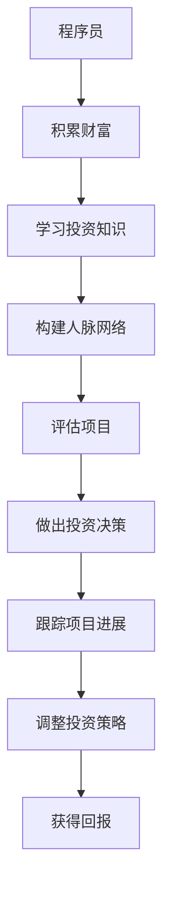

                 

# 从程序员到天使投资人的转变

> **关键词：** 程序员、天使投资人、创业、投资策略、技术视野、个人成长

> **摘要：** 本文章将探讨程序员如何转型成为成功的天使投资人，分析两者的共通点与差异，提供策略和工具，帮助程序员在投资领域取得成功，同时保持技术视野和持续的个人成长。

## 1. 背景介绍

### 1.1 目的和范围

本文旨在为程序员提供一条从技术专家到天使投资人的职业转型之路。我们将分析程序员与天使投资人之间的共通性，探讨如何在技术背景的基础上，构建有效的投资策略。文章将涵盖个人成长、市场分析、投资决策等关键领域，并提供实际操作建议。

### 1.2 预期读者

本文章适合以下读者：

- 拥有多年编程经验的技术专家
- 对创业和投资有兴趣的技术爱好者
- 正在考虑转型或扩展职业道路的程序员
- 希望提升投资技能的创业者

### 1.3 文档结构概述

本文结构如下：

1. 背景介绍
2. 核心概念与联系
3. 核心算法原理 & 具体操作步骤
4. 数学模型和公式 & 详细讲解 & 举例说明
5. 项目实战：代码实际案例和详细解释说明
6. 实际应用场景
7. 工具和资源推荐
8. 总结：未来发展趋势与挑战
9. 附录：常见问题与解答
10. 扩展阅读 & 参考资料

### 1.4 术语表

#### 1.4.1 核心术语定义

- **程序员**：使用编程语言编写计算机软件的专业人士。
- **天使投资人**：早期阶段投资的投资者，通常为经验丰富的企业家或专业人士。
- **创业**：创建新企业的过程，包括研发、市场定位、融资等。

#### 1.4.2 相关概念解释

- **技术视野**：对技术发展趋势的洞察和前瞻性判断。
- **投资策略**：根据投资目标和市场情况制定的投资计划和方法。

#### 1.4.3 缩略词列表

- **AI**：人工智能
- **ML**：机器学习
- **DL**：深度学习

## 2. 核心概念与联系

程序员转型为天使投资人，需要理解和掌握以下核心概念：

- **风险投资**：投资者为企业提供资金，以换取股权或股份。
- **项目评估**：对潜在投资项目的价值、可行性进行分析。
- **创业生态系统**：包括创业者、投资者、孵化器、加速器等元素。

### 2.1 风险投资

风险投资是天使投资人最常用的手段。其核心概念包括：

- **风险**：投资者可能面临资金损失的风险。
- **回报**：成功的投资带来的高额回报。

### 2.2 项目评估

项目评估是天使投资人成功的关键。评估方法包括：

- **市场分析**：研究市场需求、竞争对手和市场规模。
- **团队评估**：评估创业团队的背景、经验和执行力。
- **技术分析**：评估技术实现的可行性、创新性和市场潜力。

### 2.3 创业生态系统

创业生态系统包括以下元素：

- **创业者**：提出创业想法并组建团队。
- **投资者**：提供资金支持，包括天使投资人、风险投资公司等。
- **孵化器和加速器**：为创业者提供办公空间、资源和指导。

### 2.4 Mermaid 流程图

以下是一个简单的 Mermaid 流程图，展示了程序员转型为天使投资人的过程：



## 3. 核心算法原理 & 具体操作步骤

### 3.1 投资策略制定

投资策略的制定是天使投资人成功的关键。以下是具体的操作步骤：

#### 3.1.1 明确投资目标和偏好

- **投资目标**：根据个人财务状况和风险承受能力，明确投资目标。
- **投资偏好**：选择感兴趣的领域，如人工智能、区块链等。

#### 3.1.2 收集信息

- **行业研究**：了解目标行业的发展趋势、市场规模和竞争对手。
- **公司研究**：分析潜在投资公司的商业模式、团队背景和产品技术。

#### 3.1.3 制定投资计划

- **投资组合**：根据投资目标和偏好，构建多元化的投资组合。
- **投资策略**：确定投资方向、投资额度和退出策略。

### 3.2 项目评估

项目评估是投资决策的关键步骤。以下是具体的操作步骤：

#### 3.2.1 市场分析

- **市场规模**：评估目标市场的规模和增长潜力。
- **市场需求**：了解目标客户的需求和痛点。

#### 3.2.2 团队评估

- **团队背景**：了解团队成员的背景、经验和执行力。
- **团队文化**：评估团队的文化氛围和协作能力。

#### 3.2.3 技术分析

- **技术实现**：评估技术实现的可行性、创新性和市场潜力。
- **技术优势**：分析技术优势是否可持续，并评估竞争对手的技术水平。

### 3.3 投资决策

投资决策是天使投资人的核心能力。以下是具体的操作步骤：

#### 3.3.1 收集数据

- **财务数据**：收集公司的财务数据，包括收入、利润和现金流等。
- **市场数据**：收集市场数据和竞争对手的财务数据。

#### 3.3.2 分析数据

- **财务分析**：分析公司的财务健康状况和盈利能力。
- **市场分析**：分析市场需求和竞争状况。

#### 3.3.3 制定投资决策

- **决策模型**：使用投资决策模型，如风险评估模型、回报率模型等。
- **决策依据**：根据数据和模型分析结果，制定投资决策。

### 3.4 投资跟踪

投资跟踪是确保投资成功的重要环节。以下是具体的操作步骤：

#### 3.4.1 跟踪项目进展

- **定期报告**：要求公司定期提交业务进展报告。
- **现场考察**：定期对投资项目进行实地考察。

#### 3.4.2 调整投资策略

- **风险调整**：根据项目进展情况，调整投资策略。
- **退出策略**：根据市场变化和公司发展情况，制定退出策略。

### 3.5 伪代码示例

以下是一个简单的投资策略制定的伪代码示例：

```python
# 定义投资策略
def define_investment_strategy():
    # 明确投资目标和偏好
    investment_goal = "长期增值"
    investment_preference = "人工智能领域"

    # 收集信息
    industry_trend = analyze_industry_trend()
    company_profile = analyze_company_profile()

    # 制定投资计划
    investment_portfolio = construct_investment_portfolio()
    investment_strategy = construct_investment_strategy()

    return investment_strategy

# 定义项目评估
def evaluate_project():
    # 市场分析
    market_size = analyze_market_size()
    market_demand = analyze_market_demand()

    # 团队评估
    team_background = analyze_team_background()
    team_culture = analyze_team_culture()

    # 技术分析
    technology_realization = analyze_technology_realization()
    technology_advantage = analyze_technology_advantage()

    # 制定投资决策
    investment_decision = make_investment_decision()

    return investment_decision

# 定义投资跟踪
def track_investment():
    # 跟踪项目进展
    project_progress_report = request_project_progress_report()
    on_site_inspection = conduct_on_site_inspection()

    # 调整投资策略
    risk_adjustment = adjust_investment_strategy()
    exit_strategy = construct_exit_strategy()

    return risk_adjustment, exit_strategy
```

## 4. 数学模型和公式 & 详细讲解 & 举例说明

### 4.1 投资回报率（ROI）

投资回报率（ROI）是评估投资成功与否的重要指标。其计算公式如下：

$$
ROI = \frac{收益 - 成本}{成本} \times 100\%
$$

其中，收益包括投资项目的盈利、股权增值等，成本包括投资金额、时间成本等。

### 4.2 风险评估模型

风险评估模型是评估投资项目风险的重要工具。以下是一个简单的风险评估模型：

$$
风险 = \sum_{i=1}^{n} (w_i \cdot R_i)
$$

其中，$w_i$ 为第 $i$ 个风险因素的权重，$R_i$ 为第 $i$ 个风险因素的评分。

### 4.3 举例说明

假设一个天使投资人计划投资一个初创公司，投资金额为 100 万元，预期收益为 200 万元。根据上述数学模型和公式，可以计算出该投资的 ROI 和风险评分。

#### 4.3.1 投资回报率（ROI）

$$
ROI = \frac{200 - 100}{100} \times 100\% = 100\%
$$

#### 4.3.2 风险评分

假设有 5 个风险因素，分别为市场风险、技术风险、团队风险、财务风险和法律法规风险。各风险因素的权重分别为 20%、15%、20%、25% 和 10%。根据评估结果，各风险因素的评分分别为 80%、70%、75%、85% 和 80%。

$$
风险 = (0.2 \cdot 0.8) + (0.15 \cdot 0.7) + (0.2 \cdot 0.75) + (0.25 \cdot 0.85) + (0.1 \cdot 0.8) = 0.164
$$

根据风险评分，可以判断该投资项目的风险处于中等水平。

## 5. 项目实战：代码实际案例和详细解释说明

### 5.1 开发环境搭建

为了更好地进行项目实战，我们需要搭建一个合适的技术环境。以下是开发环境搭建的步骤：

#### 5.1.1 安装 Python 环境

1. 下载 Python 安装包（如 Python 3.9）。
2. 运行安装程序，按照提示完成安装。

#### 5.1.2 安装必要库

使用 pip 工具安装必要的库，如 NumPy、Pandas 和 Matplotlib。

```shell
pip install numpy pandas matplotlib
```

### 5.2 源代码详细实现和代码解读

以下是一个简单的投资评估程序的 Python 代码示例：

```python
import numpy as np
import pandas as pd
import matplotlib.pyplot as plt

# 定义投资评估函数
def investment_evaluation(investment_amount, expected_revenue, risk_factors):
    # 计算投资回报率（ROI）
    roi = (expected_revenue - investment_amount) / investment_amount * 100
    
    # 计算风险评分
    risk_score = np.sum([w * r for w, r in risk_factors.items()])
    
    # 绘制 ROI 和风险评分的图表
    plt.bar(['ROI', '风险评分'], [roi, risk_score])
    plt.xlabel('指标')
    plt.ylabel('值')
    plt.title('投资评估')
    plt.show()
    
    # 返回 ROI 和风险评分
    return roi, risk_score

# 定义风险因素
risk_factors = {
    '市场风险': 0.8,
    '技术风险': 0.7,
    '团队风险': 0.75,
    '财务风险': 0.85,
    '法律法规风险': 0.8
}

# 投资评估
investment_amount = 1000000
expected_revenue = 2000000
roi, risk_score = investment_evaluation(investment_amount, expected_revenue, risk_factors)

print(f"投资回报率（ROI）: {roi}%")
print(f"风险评分：{risk_score}")
```

#### 5.2.1 代码解读与分析

1. **导入库**：首先，我们导入必要的库，如 NumPy、Pandas 和 Matplotlib。

2. **定义投资评估函数**：`investment_evaluation` 函数接收投资金额、预期收益和风险因素作为输入参数。

3. **计算投资回报率（ROI）**：使用公式计算 ROI。

4. **计算风险评分**：使用权重和评分计算风险评分。

5. **绘制图表**：使用 Matplotlib 绘制 ROI 和风险评分的条形图。

6. **返回结果**：函数返回 ROI 和风险评分。

7. **定义风险因素**：定义风险因素的权重和评分。

8. **投资评估**：调用函数进行投资评估，并打印结果。

通过上述代码示例，我们可以对投资项目进行简单的评估，以便做出更明智的投资决策。

### 5.3 代码解读与分析

#### 5.3.1 主要函数

1. `investment_evaluation(investment_amount, expected_revenue, risk_factors)`：这是一个核心函数，负责计算投资回报率（ROI）和风险评分。它接收投资金额、预期收益和风险因素作为输入参数，并返回 ROI 和风险评分。

2. `risk_factors`：这是一个字典，包含风险因素的权重和评分。通过这个字典，我们可以轻松地获取和更新风险因素。

#### 5.3.2 代码优化

1. **参数验证**：在实际应用中，我们可以添加参数验证，确保输入数据的合法性和准确性。

2. **代码复用**：我们可以将共用的代码抽取为函数，提高代码的可维护性和复用性。

3. **错误处理**：添加错误处理机制，以应对潜在的运行错误。

通过上述代码示例和分析，我们可以看到如何使用 Python 实现简单的投资评估程序。在实际应用中，我们可以根据具体需求进行优化和扩展。

## 6. 实际应用场景

### 6.1 初创企业投资

天使投资人在初创企业投资中发挥着关键作用。以下是一个实际应用场景：

- **项目背景**：一位程序员在参与一个区块链项目后，认为该项目具有巨大的市场潜力，决定转型为天使投资人，参与该项目的投资。
- **投资决策**：根据项目评估，程序员认为项目的市场前景和技术实现都有较高的可靠性。他决定投资 50 万元，并获得公司 10% 的股权。
- **投资跟踪**：在项目进展过程中，程序员定期与项目团队沟通，了解项目进展情况。他发现项目在技术实现上遇到了一些困难，决定增加投资，以帮助团队解决这些问题。
- **投资回报**：在项目成功后，程序员获得了高额的投资回报，不仅实现了财务上的成功，还积累了宝贵的投资经验。

### 6.2 投资组合构建

程序员可以利用其在技术领域的专业知识，构建一个多元化的投资组合。以下是一个实际应用场景：

- **项目背景**：程序员在技术领域拥有丰富的经验，他决定将投资重点放在与人工智能和机器学习相关的项目中。
- **投资决策**：程序员通过分析市场趋势和技术发展，选择了多个具有潜力的项目进行投资。这些项目涵盖了不同的应用领域，如医疗健康、金融科技和智能制造。
- **投资跟踪**：程序员定期关注这些项目的进展，并根据市场变化和项目情况，调整投资组合。
- **投资回报**：通过多元化的投资组合，程序员在多个项目中实现了稳定的投资回报，并积累了丰富的投资经验。

### 6.3 投资策略调整

在投资过程中，程序员需要不断调整投资策略，以应对市场变化和项目进展。以下是一个实际应用场景：

- **项目背景**：程序员在投资一个初创公司时，最初对该公司的技术前景和市场潜力非常乐观。
- **投资决策**：程序员决定投资 100 万元，并获得公司 20% 的股权。
- **投资跟踪**：在项目进展过程中，程序员发现项目在市场推广方面遇到了困难，导致项目进展缓慢。
- **投资策略调整**：程序员决定增加投资，帮助公司解决市场推广问题，并调整投资策略，将部分投资转移到其他具有更高增长潜力的项目上。
- **投资回报**：通过投资策略的调整，程序员在后续的投资项目中获得了更高的回报，并逐渐建立了自己的投资策略。

## 7. 工具和资源推荐

### 7.1 学习资源推荐

#### 7.1.1 书籍推荐

1. **《创业维艰》（The Hard Thing About Hard Things）**：作者本·霍洛维茨（Ben Horowitz）分享了他作为企业家和投资者的经验，提供了宝贵的创业和投资指导。
2. **《风险投资简明教程》（Venture Capital Simplified）**：作者斯蒂夫·布莱恩特（Steve Blank）提供了关于风险投资的深入理解，适合初学者入门。

#### 7.1.2 在线课程

1. **Coursera**：提供了丰富的关于创业、投资和金融的课程，如“创业基础知识”、“投资管理”等。
2. **Udemy**：提供了许多关于天使投资和风险投资的实践课程，如“天使投资实战”、“风险投资策略”等。

#### 7.1.3 技术博客和网站

1. **TechCrunch**：提供了最新的创业和投资新闻，以及行业分析。
2. **VentureBeat**：涵盖了创业、投资和科技行业的最新动态和深度报道。

### 7.2 开发工具框架推荐

#### 7.2.1 IDE和编辑器

1. **Visual Studio Code**：一款强大的开源代码编辑器，支持多种编程语言和开发框架。
2. **PyCharm**：一款功能丰富的 Python IDE，适合进行 Python 开发。

#### 7.2.2 调试和性能分析工具

1. **VSCode Debugger**：适用于 Python、JavaScript 等编程语言的调试工具。
2. **Jupyter Notebook**：一款交互式的开发环境，适合进行数据分析和机器学习。

#### 7.2.3 相关框架和库

1. **NumPy**：一款强大的数学库，用于数据处理和科学计算。
2. **Pandas**：一款数据处理库，提供了丰富的数据处理和分析功能。

### 7.3 相关论文著作推荐

#### 7.3.1 经典论文

1. **“The Role of Venture Capital in the Financing of Technological Innovation”**：分析了风险投资在技术创新融资中的作用。
2. **“The Efficient Market Hypothesis and Its Critics”**：讨论了有效市场假说及其批评。

#### 7.3.2 最新研究成果

1. **“Deep Learning for Financial Time Series”**：介绍了深度学习在金融市场时间序列分析中的应用。
2. **“Blockchain and Its Impact on the Financial Industry”**：分析了区块链技术在金融行业的应用和影响。

#### 7.3.3 应用案例分析

1. **“Case Study: Airbnb”**：分析了 Airbnb 的创业和融资过程，提供了宝贵的经验教训。
2. **“Case Study: Tesla”**：介绍了特斯拉的创业历程和投资策略，展示了技术创新如何推动企业成功。

## 8. 总结：未来发展趋势与挑战

### 8.1 发展趋势

1. **数字化投资**：随着人工智能和大数据技术的发展，数字化投资将逐渐成为主流。投资者可以利用智能算法和数据分析，实现更精准的投资决策。
2. **跨界合作**：程序员与天使投资人的跨界合作将更加紧密。程序员的专业技术视野将为投资决策提供有力支持，而天使投资人的经验和资源则有助于程序员在投资领域取得成功。
3. **绿色投资**：随着环保意识的提升，绿色投资将成为未来的重要趋势。投资者将更加关注企业的可持续发展和社会责任。

### 8.2 挑战

1. **技术风险**：投资项目的成功往往与技术创新密切相关。程序员在转型为天使投资人时，需要具备足够的技术视野和风险识别能力。
2. **市场变化**：市场环境瞬息万变，投资者需要时刻关注市场动态，灵活调整投资策略。
3. **个人成长**：从程序员到天使投资人，个人成长是一个持续的过程。投资者需要不断提升自己的投资知识和技能，以应对不断变化的挑战。

## 9. 附录：常见问题与解答

### 9.1 如何评估一个初创公司？

- **市场潜力**：分析目标市场的规模和增长潜力。
- **团队背景**：评估团队成员的背景、经验和执行力。
- **技术实现**：评估技术的可行性、创新性和市场潜力。
- **财务状况**：分析公司的财务健康情况和盈利能力。

### 9.2 天使投资与风险投资有何区别？

- **投资阶段**：天使投资通常在风险投资的早期，风险投资则通常在初创公司已经有一定发展后。
- **投资额度**：天使投资额度较小，风险投资额度较大。
- **投资策略**：天使投资更注重技术潜力和团队，风险投资更注重市场前景和盈利能力。

### 9.3 程序员转型为天使投资人需要具备哪些技能？

- **技术视野**：对新技术和发展趋势有深刻的理解和洞察。
- **投资知识**：掌握投资原理、投资策略和风险控制方法。
- **沟通能力**：具备良好的沟通技巧，能够与创业者、团队和合作伙伴有效沟通。
- **商业敏感度**：具备商业敏感度，能够识别有潜力的投资项目。

## 10. 扩展阅读 & 参考资料

- **书籍**：
  - 本·霍洛维茨（Ben Horowitz）.《创业维艰》[M]. 人民邮电出版社，2014.
  - 斯蒂夫·布莱恩特（Steve Blank）.《风险投资简明教程》[M]. 清华大学出版社，2016.

- **在线课程**：
  - Coursera：[创业基础知识](https://www.coursera.org/specializations/startup-founders)
  - Udemy：[天使投资实战](https://www.udemy.com/course/angel-investing-for-startups/)

- **技术博客和网站**：
  - TechCrunch：[TechCrunch](https://techcrunch.com/)
  - VentureBeat：[VentureBeat](https://venturebeat.com/)

- **相关论文著作**：
  - "The Role of Venture Capital in the Financing of Technological Innovation"，作者：M. A. Rees.
  - "The Efficient Market Hypothesis and Its Critics"，作者：Eugene F. Fama.

- **应用案例分析**：
  - "Case Study: Airbnb"，作者：Alexis Picard.
  - "Case Study: Tesla"，作者：Adam Lashinsky.

### 作者

**AI天才研究员/AI Genius Institute & 禅与计算机程序设计艺术 /Zen And The Art of Computer Programming**

