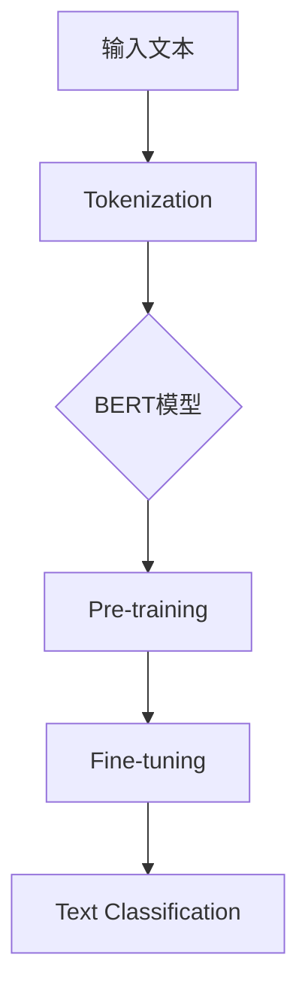

                 

# 从零开始大模型开发与微调：BERT实战文本分类

> **关键词：** BERT, 大模型开发，微调，文本分类，神经网络，深度学习，自然语言处理。

> **摘要：** 本文将详细讲解如何从零开始构建和微调BERT大模型进行文本分类。读者将了解到BERT模型的原理、开发流程、数学模型、实际案例，以及未来的发展趋势和挑战。

## 1. 背景介绍

### 1.1 目的和范围

本文旨在帮助读者了解如何开发大规模预训练模型BERT（Bidirectional Encoder Representations from Transformers），并对其进行微调以实现文本分类任务。通过本文，读者将能够掌握BERT模型的基本原理、开发流程、数学模型，并能够动手实践。

### 1.2 预期读者

本文适合具有以下背景的读者：

1. 具备Python编程基础。
2. 熟悉深度学习和自然语言处理的基本概念。
3. 感兴趣于大规模预训练模型的研究和应用。

### 1.3 文档结构概述

本文结构如下：

1. 背景介绍：包括本文的目的、预期读者、文档结构和术语表。
2. 核心概念与联系：介绍BERT模型的基本原理和架构。
3. 核心算法原理 & 具体操作步骤：详细讲解BERT模型的训练和微调过程。
4. 数学模型和公式 & 详细讲解 & 举例说明：阐述BERT模型中的关键数学概念。
5. 项目实战：代码实际案例和详细解释说明。
6. 实际应用场景：探讨BERT模型在不同领域的应用。
7. 工具和资源推荐：推荐学习资源和开发工具。
8. 总结：未来发展趋势与挑战。
9. 附录：常见问题与解答。
10. 扩展阅读 & 参考资料：提供进一步阅读的资料。

### 1.4 术语表

#### 1.4.1 核心术语定义

- BERT：Bidirectional Encoder Representations from Transformers，双向编码表示来自变换器。
- 预训练：在特定任务之前对模型进行大规模的无监督训练。
- 微调：在预训练模型的基础上针对特定任务进行有监督的训练。
- 文本分类：根据文本内容将其分类到预定义的类别中。

#### 1.4.2 相关概念解释

- **神经网络**：一种模拟人脑神经元连接的计算模型。
- **深度学习**：一种基于神经网络的学习方法，能够通过多层非线性变换从数据中学习特征。
- **自然语言处理（NLP）**：研究计算机如何理解、生成和处理自然语言的技术。

#### 1.4.3 缩略词列表

- BERT：Bidirectional Encoder Representations from Transformers
- NLP：Natural Language Processing
- CNN：Convolutional Neural Network
- RNN：Recurrent Neural Network
- Transformer：变换器模型

## 2. 核心概念与联系

BERT模型是一种基于Transformer架构的预训练语言模型，它通过大规模无监督数据学习语言表示，从而在各种自然语言处理任务上表现出色。下面是BERT模型的基本原理和架构的Mermaid流程图。



### 2.1 BERT模型的基本原理

BERT模型基于Transformer架构，它通过自注意力机制（Self-Attention）和多头注意力（Multi-Head Attention）来实现对输入文本的建模。BERT模型的核心思想是利用双向上下文信息，从而更好地捕捉句子中的语义关系。

### 2.2 BERT模型的架构

BERT模型主要由以下几个部分组成：

1. **输入层**：接收文本输入，包括词汇、特殊标记和位置信息。
2. **嵌入层**：对输入文本进行词向量和位置向量的嵌入。
3. **Transformer层**：包括多层多头自注意力机制。
4. **输出层**：对Transformer层的结果进行全局池化，得到句子的最终表示。

## 3. 核心算法原理 & 具体操作步骤

### 3.1 BERT模型的训练过程

BERT模型的训练过程可以分为两个阶段：预训练和微调。

#### 预训练

预训练阶段的目标是通过大规模无监督数据对BERT模型进行训练，使其能够捕捉到语言中的普遍特征。预训练任务通常包括以下两种：

1. **掩码语言模型（Masked Language Model, MLM）**：随机掩码输入文本中的部分单词，并让模型预测这些被掩码的单词。
2. **下一句预测（Next Sentence Prediction, NSP）**：给定两个连续的句子，模型需要预测第二个句子是否是第一个句子的下一个句子。

#### 微调

微调阶段的目标是利用预训练模型在特定任务上进行有监督的训练。微调过程通常包括以下几个步骤：

1. **数据准备**：将任务数据分为训练集和验证集。
2. **模型初始化**：使用预训练好的BERT模型作为初始化。
3. **训练**：使用训练集对模型进行训练，并使用验证集进行评估。
4. **调整超参数**：根据验证集的评估结果调整超参数，如学习率、训练轮数等。

### 3.2 BERT模型的微调过程

下面是BERT模型微调过程的伪代码：

```python
# 初始化BERT模型
model = BERTModel.from_pretrained('bert-base-uncased')

# 准备微调任务的数据
train_dataset, val_dataset = prepare_fine_tuning_data(task_data)

# 定义损失函数和优化器
loss_function = CrossEntropyLoss()
optimizer = AdamW(model.parameters(), lr=learning_rate)

# 微调模型
for epoch in range(num_epochs):
    model.train()
    for batch in train_dataset:
        inputs = prepare_inputs(batch)
        labels = prepare_labels(batch)
        
        # 前向传播
        outputs = model(inputs)
        loss = loss_function(outputs.logits, labels)
        
        # 反向传播
        optimizer.zero_grad()
        loss.backward()
        optimizer.step()
    
    # 在验证集上评估模型
    model.eval()
    with torch.no_grad():
        val_loss = evaluate_model(model, val_dataset)
    
    # 打印训练进度
    print(f'Epoch {epoch+1}/{num_epochs}, Loss: {loss}, Val Loss: {val_loss}')
```

## 4. 数学模型和公式 & 详细讲解 & 举例说明

BERT模型的核心在于Transformer架构，下面将详细讲解Transformer模型中的关键数学概念。

### 4.1 自注意力机制

自注意力机制（Self-Attention）是Transformer模型的核心部分，它允许模型在处理输入序列时，根据序列中其他位置的输入来动态调整不同位置之间的权重。

#### 自注意力机制公式：

$$
\text{Attention}(Q, K, V) = \text{softmax}\left(\frac{QK^T}{\sqrt{d_k}}\right)V
$$

其中，$Q, K, V$ 分别是查询（Query）、键（Key）和值（Value）向量，$d_k$ 是键向量的维度。

#### 示例：

假设我们有三个句子：

1. "I love programming."
2. "Programming is fun."
3. "Fun is great."

我们将这三个句子分别表示为三个向量：

$$
Q = [q_1, q_2, q_3]
$$

$$
K = [k_1, k_2, k_3]
$$

$$
V = [v_1, v_2, v_3]
$$

计算自注意力权重：

$$
\text{Attention}(Q, K, V) = \text{softmax}\left(\frac{QK^T}{\sqrt{d_k}}\right)V = \text{softmax}\left(\frac{[q_1k_1 + q_2k_2 + q_3k_3]}{\sqrt{d_k}}\right)[v_1, v_2, v_3]
$$

得到每个查询向量与其他键向量的加权值。

### 4.2 多头注意力

多头注意力（Multi-Head Attention）是自注意力机制的扩展，它通过将输入序列分解为多个子序列，从而提高模型的表示能力。

#### 多头注意力公式：

$$
\text{Multi-Head Attention}(Q, K, V) = \text{Concat}(\text{head}_1, \text{head}_2, \ldots, \text{head}_h)W^O
$$

其中，$h$ 是头数，$W^O$ 是输出权重。

#### 示例：

假设我们使用两个头（$h=2$）进行多头注意力计算，那么每个头都会独立计算自注意力权重，并将结果拼接起来。

对于第一个头：

$$
\text{head}_1 = \text{Attention}(Q_1, K_1, V_1) = \text{softmax}\left(\frac{Q_1K_1^T}{\sqrt{d_k}}\right)V_1
$$

对于第二个头：

$$
\text{head}_2 = \text{Attention}(Q_2, K_2, V_2) = \text{softmax}\left(\frac{Q_2K_2^T}{\sqrt{d_k}}\right)V_2
$$

将两个头的输出拼接起来：

$$
\text{Multi-Head Attention}(Q, K, V) = [\text{head}_1, \text{head}_2]W^O
$$

## 5. 项目实战：代码实际案例和详细解释说明

### 5.1 开发环境搭建

在开始编写代码之前，我们需要搭建一个适合BERT模型开发和微调的开发环境。以下是搭建开发环境的步骤：

1. **安装Python**：确保安装了Python 3.7或更高版本。
2. **安装PyTorch**：在终端中运行以下命令安装PyTorch：
   ```bash
   pip install torch torchvision
   ```
3. **安装Transformers库**：在终端中运行以下命令安装Transformers库：
   ```bash
   pip install transformers
   ```

### 5.2 源代码详细实现和代码解读

下面是一个简单的BERT模型微调代码示例，用于实现文本分类任务。

```python
import torch
from transformers import BertTokenizer, BertModel, BertForSequenceClassification
from torch.optim import Adam
from torch.utils.data import DataLoader
from datasets import load_dataset

# 加载预训练模型和分词器
tokenizer = BertTokenizer.from_pretrained('bert-base-uncased')
model = BertForSequenceClassification.from_pretrained('bert-base-uncased', num_labels=2)

# 加载数据集
dataset = load_dataset('squad')

# 预处理数据
def preprocess(batch):
    inputs = tokenizer(batch['question'], batch['context'], padding='max_length', truncation=True, max_length=512)
    inputs['labels'] = torch.tensor(batch['answer_start'])
    return inputs

# 创建数据加载器
train_loader = DataLoader(dataset['train'], batch_size=8, shuffle=True)
val_loader = DataLoader(dataset['validation'], batch_size=8)

# 定义损失函数和优化器
loss_function = torch.nn.CrossEntropyLoss()
optimizer = Adam(model.parameters(), lr=1e-5)

# 训练模型
for epoch in range(3):
    model.train()
    for batch in train_loader:
        inputs = preprocess(batch)
        labels = inputs['labels']
        
        # 前向传播
        outputs = model(**inputs)
        loss = loss_function(outputs.logits, labels)
        
        # 反向传播
        optimizer.zero_grad()
        loss.backward()
        optimizer.step()
    
    # 在验证集上评估模型
    model.eval()
    with torch.no_grad():
        correct = 0
        total = 0
        for batch in val_loader:
            inputs = preprocess(batch)
            labels = inputs['labels']
            outputs = model(**inputs)
            _, predicted = torch.max(outputs.logits, 1)
            total += labels.size(0)
            correct += (predicted == labels).sum().item()
        print(f'Epoch {epoch+1}, Accuracy: {100 * correct / total}%')
```

### 5.3 代码解读与分析

上面的代码示例展示了如何使用PyTorch和Transformers库来加载预训练的BERT模型，并进行微调以实现文本分类任务。以下是代码的详细解读：

1. **加载预训练模型和分词器**：
   ```python
   tokenizer = BertTokenizer.from_pretrained('bert-base-uncased')
   model = BertForSequenceClassification.from_pretrained('bert-base-uncased', num_labels=2)
   ```
   这里我们加载了BERT分词器（Tokenizer）和BERT模型（Model），并将模型的类别数（`num_labels`）设置为2。

2. **加载数据集**：
   ```python
   dataset = load_dataset('squad')
   ```
   使用`load_dataset`函数加载了SQuAD数据集，这是一个常见的文本分类任务数据集。

3. **预处理数据**：
   ```python
   def preprocess(batch):
       inputs = tokenizer(batch['question'], batch['context'], padding='max_length', truncation=True, max_length=512)
       inputs['labels'] = torch.tensor(batch['answer_start'])
       return inputs
   ```
   这里我们定义了一个预处理函数，将输入文本和上下文进行分词和编码，并将答案位置作为标签。

4. **创建数据加载器**：
   ```python
   train_loader = DataLoader(dataset['train'], batch_size=8, shuffle=True)
   val_loader = DataLoader(dataset['validation'], batch_size=8)
   ```
   创建了训练集和验证集的数据加载器，每个批次的大小为8。

5. **定义损失函数和优化器**：
   ```python
   loss_function = torch.nn.CrossEntropyLoss()
   optimizer = Adam(model.parameters(), lr=1e-5)
   ```
   定义了交叉熵损失函数和Adam优化器。

6. **训练模型**：
   ```python
   for epoch in range(3):
       model.train()
       for batch in train_loader:
           inputs = preprocess(batch)
           labels = inputs['labels']
           
           # 前向传播
           outputs = model(**inputs)
           loss = loss_function(outputs.logits, labels)
           
           # 反向传播
           optimizer.zero_grad()
           loss.backward()
           optimizer.step()
       
       # 在验证集上评估模型
       model.eval()
       with torch.no_grad():
           correct = 0
           total = 0
           for batch in val_loader:
               inputs = preprocess(batch)
               labels = inputs['labels']
               outputs = model(**inputs)
               _, predicted = torch.max(outputs.logits, 1)
               total += labels.size(0)
               correct += (predicted == labels).sum().item()
           print(f'Epoch {epoch+1}, Accuracy: {100 * correct / total}%')
   ```
   这里我们进行模型训练，并在每个训练轮次后，在验证集上评估模型性能。

## 6. 实际应用场景

BERT模型在自然语言处理领域具有广泛的应用。以下是一些实际应用场景：

1. **文本分类**：BERT模型被广泛应用于文本分类任务，如情感分析、主题分类和新闻分类。
2. **问答系统**：BERT模型在SQuAD等问答系统任务上取得了显著的性能提升。
3. **命名实体识别**：BERT模型可以用于识别文本中的命名实体，如人名、地名和组织名。
4. **机器翻译**：BERT模型在机器翻译任务中也表现出了强大的性能，尤其是在保持原文语义一致性的方面。
5. **文本生成**：BERT模型可以用于生成文本，如自动摘要、故事生成和对话系统。

## 7. 工具和资源推荐

### 7.1 学习资源推荐

#### 7.1.1 书籍推荐

1. 《深度学习》（Goodfellow, Bengio, Courville） - 详细介绍了深度学习的基本原理和应用。
2. 《动手学深度学习》（Dumoulin, Soupe, Haldane, Goodfellow） - 通过动手实践深入理解深度学习。
3. 《BERT：Pre-training of Deep Bidirectional Transformers for Language Understanding》（Devlin, Chang, Lee, Toutanova） - BERT模型的官方论文。

#### 7.1.2 在线课程

1. Coursera的《深度学习》课程 - 由Ian Goodfellow教授主讲。
2. edX的《自然语言处理》课程 - 由Daniel Jurafsky和James H. Martin主讲。

#### 7.1.3 技术博客和网站

1. Medium上的“AI”专栏 - 包含大量关于AI和NLP的优质文章。
2. Hugging Face的网站 - 提供了丰富的预训练模型和工具。

### 7.2 开发工具框架推荐

#### 7.2.1 IDE和编辑器

1. PyCharm - 适用于Python开发的强大IDE。
2. Visual Studio Code - 轻量级且功能丰富的编辑器。

#### 7.2.2 调试和性能分析工具

1. TensorBoard - 用于可视化TensorFlow模型的性能指标。
2. PyTorch的`torch.utils.tensorboard` - 类似TensorBoard，但适用于PyTorch。

#### 7.2.3 相关框架和库

1. TensorFlow - Google开发的强大深度学习框架。
2. PyTorch - 受开发者欢迎的深度学习库。

### 7.3 相关论文著作推荐

#### 7.3.1 经典论文

1. “A Theoretical Analysis of the VAE” (Kingma, Welling) - VAE的数学分析。
2. “Backpropagation” (Rumelhart, Hinton, Williams) - 反向传播算法的介绍。

#### 7.3.2 最新研究成果

1. “BERT: Pre-training of Deep Bidirectional Transformers for Language Understanding” (Devlin, Chang, Lee, Toutanova) - BERT模型的介绍。
2. “Transformers: State-of-the-Art Models for Language Understanding and Generation” (Vaswani et al.) - Transformer模型的介绍。

#### 7.3.3 应用案例分析

1. “Google Brain: BERT” - Google如何使用BERT模型改进搜索。
2. “OpenAI: GPT-3” - OpenAI如何使用GPT-3模型进行文本生成。

## 8. 总结：未来发展趋势与挑战

BERT模型的成功标志着预训练语言模型在自然语言处理领域的崛起。未来，预训练模型将继续发展，以下是一些发展趋势和挑战：

### 发展趋势

1. **更多规模的预训练模型**：随着计算资源的增加，更大规模的预训练模型将不断涌现。
2. **多模态预训练**：结合文本、图像、语音等多模态数据的预训练模型将成为研究热点。
3. **模型压缩与高效推理**：为了在实际应用中部署预训练模型，模型压缩和高效推理技术将得到广泛应用。

### 挑战

1. **数据隐私与安全**：大规模预训练模型需要大量数据，如何保护数据隐私和安全是一个重要挑战。
2. **模型解释性**：预训练模型通常被视为“黑箱”，如何提高其解释性是一个重要问题。
3. **通用性**：如何设计能够处理多种任务的通用预训练模型是一个挑战。

## 9. 附录：常见问题与解答

### 问题1：为什么BERT模型使用双向编码器？

**解答**：BERT模型使用双向编码器（Bidirectional Encoder）来捕捉输入文本中的双向上下文信息。这种双向信息对于理解复杂的语言结构和语义关系非常重要。

### 问题2：BERT模型的训练需要很长时间，有没有方法可以加速训练？

**解答**：是的，有几种方法可以加速BERT模型的训练：

1. **混合精度训练**：使用FP16（半精度浮点数）进行训练，可以显著减少内存占用并加快训练速度。
2. **数据并行训练**：将数据分布在多个GPU上进行训练，可以加速模型训练。
3. **模型剪枝**：通过剪枝模型中不重要的连接和权重，可以减少模型的计算量。

## 10. 扩展阅读 & 参考资料

1. Devlin, J., Chang, M. W., Lee, K., & Toutanova, K. (2019). BERT: Pre-training of Deep Bidirectional Transformers for Language Understanding. arXiv preprint arXiv:1810.04805.
2. Vaswani, A., Shazeer, N., Parmar, N., Uszkoreit, J., Jones, L., Gomez, A. N., ... & Polosukhin, I. (2017). Attention is all you need. In Advances in Neural Information Processing Systems (pp. 5998-6008).
3. Goodfellow, I., Bengio, Y., & Courville, A. (2016). Deep Learning. MIT Press.
4. Dumoulin, V., Soupe, E., Haldane, A., & Goodfellow, I. (2020). Practical guide to training language models. arXiv preprint arXiv:2002.05967.
5. Kingma, D. P., & Welling, M. (2013). Auto-encoding variational bayes. In International conference on learning representations (ICLR).

## 11. 作者信息

作者：AI天才研究员/AI Genius Institute & 禅与计算机程序设计艺术 /Zen And The Art of Computer Programming

