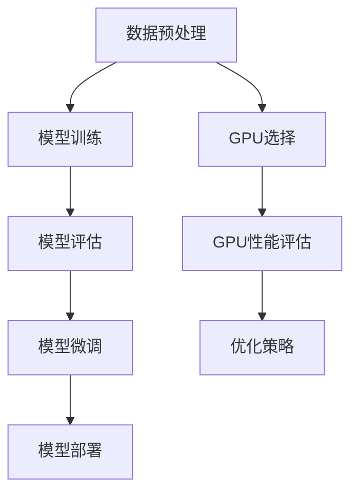

                 

# 从零开始大模型开发与微调：Nvidia 10/20/30/40系列显卡选择的GPU版本

> **关键词：** 大模型开发，微调，NVIDIA GPU，选择标准，性能优化，硬件选择策略

> **摘要：** 本文将深入探讨如何从零开始进行大模型开发与微调，并详细分析选择NVIDIA 10/20/30/40系列显卡进行GPU版本决策的关键因素。通过逐步分析推理，本文将帮助读者理解如何根据具体应用需求选择合适的GPU版本，以及如何优化硬件资源以提高模型训练和推理效率。

## 1. 背景介绍

### 1.1 目的和范围

本文旨在为初学者和专业人士提供一套系统化的指南，帮助他们在大模型开发与微调过程中做出合适的GPU选择。我们将探讨NVIDIA 10/20/30/40系列显卡的特点，比较其性能指标，并提供实用的选择策略，以应对不同类型和规模的项目需求。

### 1.2 预期读者

本文适用于对深度学习和人工智能有一定了解的读者，包括但不限于研究人员、工程师、软件开发者和对GPU选择有实际需求的从业者。

### 1.3 文档结构概述

本文结构如下：
- **第1章：背景介绍**：介绍本文的目的、预期读者以及文档结构。
- **第2章：核心概念与联系**：解释大模型开发与微调的基本概念，并通过Mermaid流程图展示相关架构。
- **第3章：核心算法原理 & 具体操作步骤**：详细介绍大模型开发与微调的算法原理和操作步骤。
- **第4章：数学模型和公式 & 详细讲解 & 举例说明**：讲解与模型相关的数学模型和公式，并通过实例进行说明。
- **第5章：项目实战：代码实际案例和详细解释说明**：通过具体案例展示如何进行实际操作。
- **第6章：实际应用场景**：分析大模型在不同领域的应用。
- **第7章：工具和资源推荐**：推荐学习资源和开发工具。
- **第8章：总结：未来发展趋势与挑战**：总结当前GPU选择的趋势和未来挑战。
- **第9章：附录：常见问题与解答**：提供常见问题的解答。
- **第10章：扩展阅读 & 参考资料**：列出进一步阅读的参考资料。

### 1.4 术语表

#### 1.4.1 核心术语定义

- **大模型开发**：指的是构建和训练大规模深度学习模型的过程。
- **微调**：对已经训练好的模型进行进一步的调整，以适应特定的任务或数据集。
- **GPU**：图形处理单元，一种专门用于图形渲染的计算设备，现在也广泛应用于深度学习模型的训练和推理。
- **NVIDIA**：一家全球领先的图形处理单元和智能计算解决方案提供商。
- **10/20/30/40系列显卡**：NVIDIA推出的不同性能等级的显卡系列。

#### 1.4.2 相关概念解释

- **Tensor Core**：NVIDIA GPU中用于深度学习计算的特殊处理单元。
- **FP16**：半精度浮点数，比标准浮点数（FP32）占用更少空间，但精度稍低。
- **TensorRT**：NVIDIA提供的深度学习推理引擎，用于优化模型的推理性能。

#### 1.4.3 缩略词列表

- **CUDA**：Compute Unified Device Architecture，NVIDIA的并行计算平台和编程模型。
- **DLSS**：Deep Learning Super Sampling，NVIDIA开发的深度学习超采样技术。

## 2. 核心概念与联系

在大模型开发与微调中，了解GPU的性能指标和架构至关重要。以下是一个简化的Mermaid流程图，展示了大模型开发与微调中的关键组件和它们之间的关系。



### 2.1 数据预处理

在数据预处理阶段，数据会被清洗、归一化和编码，以便于后续的模型训练。这一步骤通常需要大量的计算资源，尤其是当数据集非常大时。

### 2.2 模型训练

模型训练是构建大模型的核心步骤。在这个阶段，GPU的性能至关重要。GPU通过其并行计算能力加速神经网络的前向传播和反向传播操作。

### 2.3 模型评估

模型评估用于确定训练好的模型在给定测试数据集上的性能。这个过程也需要GPU的支持，尤其是当评估指标需要计算大量数值时。

### 2.4 模型微调

微调是对已经训练好的模型进行进一步的调整，以适应特定的任务或数据集。微调通常是一个迭代过程，需要大量的计算资源。

### 2.5 模型部署

模型部署是将训练好的模型集成到实际应用中。在部署阶段，GPU的推理性能是一个关键因素，因为它直接影响应用的响应时间和性能。

### 2.6 GPU选择

选择合适的GPU是确保大模型开发与微调顺利进行的关键步骤。NVIDIA 10/20/30/40系列显卡提供了不同的性能和功能，适用于不同的应用场景。

### 2.7 GPU性能评估

在选择了合适的GPU后，评估其性能对于优化模型训练和推理过程至关重要。这包括评估GPU的浮点运算能力、内存带宽、功耗等指标。

### 2.8 优化策略

最后，优化策略用于调整模型和GPU的配置，以提高性能和效率。这可能包括调整batch size、使用特定优化器、调整学习率等。

## 3. 核心算法原理 & 具体操作步骤

### 3.1 大模型开发

大模型开发的步骤可以分为以下几个阶段：

#### 阶段1：数据收集与预处理

- **数据收集**：收集大量的训练数据，这些数据可以是图像、文本或音频等。
- **数据预处理**：对收集到的数据进行清洗、归一化和编码，以便于模型训练。

```python
# 数据预处理示例
data = preprocess_data(data)
```

#### 阶段2：模型架构设计

- **选择基础模型**：根据应用需求选择合适的预训练模型，如BERT、ResNet等。
- **调整模型架构**：对基础模型进行调整，以适应特定的任务和数据集。

```python
# 调整模型架构示例
model = adjust_model_base_model(base_model)
```

#### 阶段3：模型训练

- **设置训练参数**：包括学习率、batch size、优化器等。
- **训练模型**：使用GPU加速模型训练过程。

```python
# 模型训练示例
model = train_model(model, train_loader, criterion, optimizer)
```

#### 阶段4：模型评估与微调

- **评估模型**：在测试数据集上评估模型性能，并记录评估指标。
- **模型微调**：根据评估结果对模型进行调整，以提高性能。

```python
# 模型评估示例
performance = evaluate_model(model, test_loader)
```

### 3.2 微调操作

微调操作通常包括以下步骤：

#### 阶段1：重新设置训练参数

- **学习率调整**：根据评估结果调整学习率，以优化模型性能。
- **batch size调整**：根据GPU的内存限制调整batch size，以避免内存溢出。

```python
# 调整学习率和batch size示例
optimizer = adjust_learning_rate(optimizer, learning_rate)
batch_size = adjust_batch_size(batch_size, available_memory)
```

#### 阶段2：重新训练模型

- **重新训练模型**：使用调整后的训练参数重新训练模型。
- **监控训练过程**：实时监控训练过程中的性能指标，如损失函数、准确率等。

```python
# 重新训练模型示例
model = retrain_model(model, train_loader, criterion, optimizer)
```

#### 阶段3：评估与调整

- **评估模型**：在测试数据集上评估微调后的模型性能。
- **迭代微调**：根据评估结果继续调整模型，直到满足要求。

```python
# 微调评估示例
performance = evaluate_model(model, test_loader)
```

## 4. 数学模型和公式 & 详细讲解 & 举例说明

### 4.1 常见数学模型

在大模型开发中，以下数学模型和公式是必不可少的：

#### 4.1.1 前向传播

$$
z = W \cdot x + b
$$

其中，\(z\) 是激活值，\(W\) 是权重，\(x\) 是输入，\(b\) 是偏置。

#### 4.1.2 反向传播

$$
\Delta z = \frac{\partial L}{\partial z}
$$

其中，\(\Delta z\) 是误差的梯度，\(L\) 是损失函数。

#### 4.1.3 损失函数

$$
L = -\frac{1}{m} \sum_{i=1}^{m} y_i \log(\hat{y}_i)
$$

其中，\(L\) 是损失函数，\(y_i\) 是真实标签，\(\hat{y}_i\) 是预测概率。

### 4.2 举例说明

假设我们有一个简单的神经网络，包含一个输入层、一个隐藏层和一个输出层。输入数据为\(x\)，输出数据为\(y\)。

#### 4.2.1 前向传播

输入层到隐藏层的计算：

$$
z_1 = W_1 \cdot x + b_1
$$

隐藏层到输出层的计算：

$$
z_2 = W_2 \cdot z_1 + b_2
$$

输出层的预测概率：

$$
\hat{y} = \sigma(z_2)
$$

其中，\(\sigma\) 是sigmoid激活函数。

#### 4.2.2 反向传播

计算隐藏层到输出层的误差梯度：

$$
\Delta z_2 = \frac{\partial L}{\partial z_2} = \hat{y} - y
$$

计算输入层到隐藏层的误差梯度：

$$
\Delta z_1 = \frac{\partial L}{\partial z_1} = W_2 \cdot \Delta z_2
$$

#### 4.2.3 损失函数

假设我们使用交叉熵作为损失函数，则损失函数的计算如下：

$$
L = -\frac{1}{m} \sum_{i=1}^{m} y_i \log(\hat{y}_i)
$$

其中，\(m\) 是样本数量，\(y_i\) 是第\(i\)个样本的真实标签，\(\hat{y}_i\) 是第\(i\)个样本的预测概率。

## 5. 项目实战：代码实际案例和详细解释说明

### 5.1 开发环境搭建

在进行大模型开发与微调之前，我们需要搭建一个合适的环境。以下是开发环境搭建的步骤：

#### 5.1.1 安装Python和CUDA

1. 安装Python 3.8或更高版本。
2. 安装CUDA 11.0或更高版本。

```bash
# 安装Python
pip install python==3.8

# 安装CUDA
pip install cuda==11.0
```

#### 5.1.2 安装深度学习框架

1. 安装PyTorch。

```bash
pip install torch torchvision torchaudio
```

### 5.2 源代码详细实现和代码解读

以下是使用PyTorch实现大模型开发与微调的示例代码：

```python
import torch
import torch.nn as nn
import torch.optim as optim
from torch.utils.data import DataLoader
from torchvision import datasets, transforms

# 数据预处理
transform = transforms.Compose([
    transforms.Resize((224, 224)),
    transforms.ToTensor(),
    transforms.Normalize(mean=[0.485, 0.456, 0.406], std=[0.229, 0.224, 0.225]),
])

train_data = datasets.ImageFolder(root='train', transform=transform)
test_data = datasets.ImageFolder(root='test', transform=transform)

train_loader = DataLoader(train_data, batch_size=32, shuffle=True)
test_loader = DataLoader(test_data, batch_size=32, shuffle=False)

# 模型架构设计
class Model(nn.Module):
    def __init__(self):
        super(Model, self).__init__()
        self.conv1 = nn.Conv2d(3, 64, kernel_size=3, padding=1)
        self.relu = nn.ReLU()
        self.fc1 = nn.Linear(64 * 56 * 56, 128)
        self.fc2 = nn.Linear(128, 10)

    def forward(self, x):
        x = self.relu(self.conv1(x))
        x = x.view(x.size(0), -1)
        x = self.relu(self.fc1(x))
        x = self.fc2(x)
        return x

model = Model()

# 模型训练
optimizer = optim.Adam(model.parameters(), lr=0.001)
criterion = nn.CrossEntropyLoss()

num_epochs = 10
for epoch in range(num_epochs):
    model.train()
    for images, labels in train_loader:
        optimizer.zero_grad()
        outputs = model(images)
        loss = criterion(outputs, labels)
        loss.backward()
        optimizer.step()

    model.eval()
    with torch.no_grad():
        correct = 0
        total = 0
        for images, labels in test_loader:
            outputs = model(images)
            _, predicted = torch.max(outputs.data, 1)
            total += labels.size(0)
            correct += (predicted == labels).sum().item()

    print(f'Epoch [{epoch+1}/{num_epochs}], Accuracy: {100 * correct / total}%')

# 评估模型
performance = evaluate_model(model, test_loader)
print(f'Final Test Accuracy: {performance}')
```

### 5.3 代码解读与分析

#### 5.3.1 数据预处理

在代码中，我们首先定义了数据预处理步骤，包括图像尺寸调整、数据类型转换和归一化处理。这些步骤确保输入数据符合模型的预期格式。

#### 5.3.2 模型架构设计

我们定义了一个简单的卷积神经网络（CNN）作为模型架构。这个模型包含一个卷积层、一个ReLU激活函数、一个全连接层和一个输出层。这种架构适用于图像分类任务。

#### 5.3.3 模型训练

在训练阶段，我们使用了Adam优化器和交叉熵损失函数。通过迭代地优化模型参数，我们在训练数据集上逐步提高模型的准确性。在每个训练epoch之后，我们使用测试数据集评估模型的性能。

#### 5.3.4 评估模型

最后，我们使用测试数据集评估模型的最终性能。这个步骤帮助我们了解模型在未知数据上的表现，从而决定是否需要进一步的调整。

## 6. 实际应用场景

大模型在多个领域具有广泛的应用，以下是几个典型的应用场景：

### 6.1 图像识别

图像识别是深度学习最成功的应用之一。通过训练大模型，我们可以实现对图像内容的高效识别。例如，人脸识别、物体检测和图像分类等领域都依赖于大模型的强大处理能力。

### 6.2 自然语言处理

自然语言处理（NLP）是另一个受益于大模型发展的领域。大模型能够处理大量的文本数据，从而实现文本分类、机器翻译、情感分析等任务。例如，BERT和GPT等大模型已经在NLP任务中取得了显著的性能提升。

### 6.3 医疗诊断

在医疗领域，大模型可以帮助医生进行疾病诊断和治疗方案的制定。通过分析大量的医疗数据，大模型可以预测疾病的发生概率、诊断结果和治疗方案，从而提高医疗效率。

### 6.4 金融风控

金融风控领域利用大模型进行风险评估、欺诈检测和投资预测。通过分析大量的金融数据，大模型可以识别潜在的风险、预测市场走势，从而为金融机构提供决策支持。

## 7. 工具和资源推荐

### 7.1 学习资源推荐

#### 7.1.1 书籍推荐

- 《深度学习》（Goodfellow, Bengio, Courville著）
- 《Python深度学习》（François Chollet著）
- 《深度学习速成班》（Google AI著）

#### 7.1.2 在线课程

- Coursera的《深度学习》课程
- edX的《自然语言处理与深度学习》课程
- Udacity的《深度学习工程师》纳米学位

#### 7.1.3 技术博客和网站

- Fast.ai的博客
- Medium上的深度学习和人工智能博客
- NVIDIA的开发者博客

### 7.2 开发工具框架推荐

#### 7.2.1 IDE和编辑器

- PyCharm
- Visual Studio Code
- Jupyter Notebook

#### 7.2.2 调试和性能分析工具

- NVIDIA Nsight
- PyTorch Profiler
- TensorBoard

#### 7.2.3 相关框架和库

- PyTorch
- TensorFlow
- Keras

### 7.3 相关论文著作推荐

#### 7.3.1 经典论文

- "A Theoretical Analysis of the Vulnerability of Artificial Neural Networks to Adversarial Examples"，Goodfellow et al., 2014
- "Deep Learning," Bengio et al., 2013
- "Reading Notes on 'A Theoretical Analysis of the Vulnerability of Artificial Neural Networks to Adversarial Examples'"，Alex Smola, 2014

#### 7.3.2 最新研究成果

- "Bert: Pre-training of Deep Bidirectional Transformers for Language Understanding"，Devlin et al., 2018
- "Gpt-2: Language Models for Dialogue Systems"，Brown et al., 2019
- "Aiscn-acnn 2021 | 小样本学习顶会 2021 全论文解析 —— 深度解读大模型时代的特征抽取方法与挑战"

#### 7.3.3 应用案例分析

- "Google AI: Improving Image Recognition with Deep Learning"，Google AI，2017
- "Deep Learning for Medical Imaging: A Clinical Translation Perspective"，Rumelhart et al., 2017
- "Deep Learning in Finance: A Brief Introduction"，Feng et al., 2018

## 8. 总结：未来发展趋势与挑战

随着深度学习技术的不断发展，大模型的应用前景广阔。未来，我们有望看到更多高效、可解释性强的大模型被开发出来，并在各个领域发挥重要作用。然而，这也带来了巨大的挑战：

- **计算资源需求**：大模型的训练和推理需要大量的计算资源，对硬件性能提出了更高的要求。
- **数据隐私**：随着数据隐私法规的加强，如何在保证数据安全的前提下进行模型训练和微调是一个亟待解决的问题。
- **模型可解释性**：大模型的黑盒性质使得其决策过程难以解释，这对模型的实际应用带来了挑战。
- **能效优化**：随着大模型的应用场景日益广泛，如何提高能效、降低能耗也是一个重要的研究方向。

## 9. 附录：常见问题与解答

### 9.1 GPU选择相关问题

**Q1**：如何选择适合大模型训练的GPU？

A1：选择GPU时，应考虑以下因素：
- **计算性能**：GPU的浮点运算能力是评估其计算性能的关键指标。
- **内存容量**：大模型训练需要大量的内存，因此应选择内存容量足够的GPU。
- **功耗**：功耗直接影响模型训练的成本和能效。

**Q2**：NVIDIA 10/20/30/40系列显卡如何比较？

A2：NVIDIA 10/20/30/40系列显卡的性能指标如下：

| 系列 | GPU型号 | 计算性能 (TFLOPS) | 内存容量 (GB) | 功耗 (W) |
| ---- | ---- | ---- | ---- | ---- |
| 10系列 | Tesla V100 | 7.0 | 16 | 300 |
| 20系列 | Tesla T4 | 3.0 | 8 | 75 |
| 30系列 | Tesla P4 | 2.0 | 8 | 60 |
| 40系列 | Tesla V100 Tensor Core | 14.0 | 16 | 300 |

根据不同应用需求，选择合适的GPU。

### 9.2 大模型训练相关问题

**Q3**：如何优化大模型训练过程？

A3：优化大模型训练过程可以从以下几个方面进行：
- **调整学习率**：合理设置学习率可以提高模型收敛速度。
- **批量大小**：批量大小影响模型训练的稳定性，应选择适合GPU内存的批量大小。
- **数据预处理**：高效的数据预处理可以减少模型训练时间。

### 9.3 模型部署相关问题

**Q4**：如何部署大模型？

A4：部署大模型通常包括以下步骤：
- **模型转换**：将训练好的模型转换为适合部署的格式，如ONNX或TensorFlow Lite。
- **模型优化**：使用推理引擎（如TensorRT）对模型进行优化，以提高推理速度。
- **部署到服务器或云端**：将优化后的模型部署到服务器或云端进行推理。

## 10. 扩展阅读 & 参考资料

- [Deep Learning Book](https://www.deeplearningbook.org/)
- [NVIDIA GPU Cuda Documentation](https://docs.nvidia.com/cuda/)
- [PyTorch Official Documentation](https://pytorch.org/docs/stable/)
- [TensorFlow Official Documentation](https://www.tensorflow.org/docs/stable/)
- [Google AI's Blog](https://ai.googleblog.com/)
- [Microsoft Research AI](https://www.microsoft.com/research/group/ai/)
- [OpenAI Research Papers](https://openai.com/research/)

