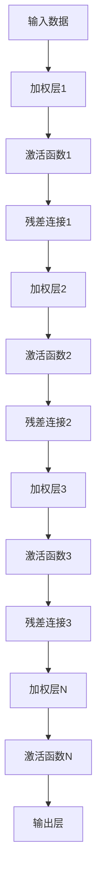
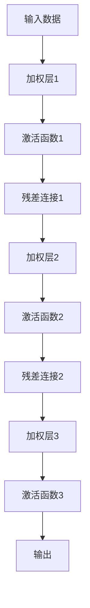

                 

# 从零开始大模型开发与微调：ResNet网络的实现

## 关键词
- 大模型开发
- 微调
- ResNet网络
- 深度学习
- 人工智能
- 神经网络架构
- 代码实现

## 摘要
本文将深入探讨从零开始构建并微调ResNet深度学习模型的过程。文章首先介绍了ResNet的背景和目的，接着详细阐述了其核心概念和算法原理。通过伪代码和数学公式，我们深入理解了ResNet的内部工作方式。随后，文章通过一个实际项目实战案例，详细讲解了如何搭建开发环境、实现代码以及代码的解读与分析。最后，文章探讨了ResNet在实际应用场景中的适用性，推荐了相关学习和开发资源，并对未来的发展趋势和挑战进行了总结。本文旨在为广大AI爱好者和从业者提供一个全面、系统的学习指南。

## 1. 背景介绍

### 1.1 目的和范围

本文的主要目的是帮助读者从零开始，了解并实现ResNet深度学习网络。ResNet（Residual Network）是深度学习中一个非常重要的架构，其创新性地引入了“残差连接”，解决了深度神经网络训练过程中的梯度消失和梯度爆炸问题，使得模型可以训练得更深。本文将逐步介绍ResNet的核心概念、算法原理，并通过实际代码案例展示如何实现和微调ResNet网络。

本文的范围包括：

1. **背景知识**：介绍深度学习和神经网络的基本概念。
2. **ResNet架构**：详细阐述ResNet的核心思想、架构和设计。
3. **算法原理**：通过伪代码和数学公式，深入分析ResNet的工作原理。
4. **项目实战**：通过一个实际项目，展示如何搭建开发环境、实现代码和代码分析。
5. **实际应用**：讨论ResNet在实际应用中的适用性和挑战。
6. **资源推荐**：推荐相关的学习资源和开发工具。

### 1.2 预期读者

本文适合以下读者：

1. 对深度学习有基础了解，希望深入了解ResNet架构的读者。
2. 想要学习和实现深度学习模型的开发者和研究人员。
3. 对神经网络架构和算法设计有兴趣的AI爱好者。

### 1.3 文档结构概述

本文的结构如下：

1. **背景介绍**：介绍文章的目的、范围和预期读者。
2. **核心概念与联系**：介绍ResNet的核心概念和原理。
3. **核心算法原理 & 具体操作步骤**：详细讲解ResNet的算法原理和操作步骤。
4. **数学模型和公式 & 详细讲解 & 举例说明**：阐述ResNet的数学模型和公式，并通过实例进行说明。
5. **项目实战：代码实际案例和详细解释说明**：通过一个实际项目展示ResNet的实现过程。
6. **实际应用场景**：讨论ResNet在实际应用中的适用性。
7. **工具和资源推荐**：推荐相关的学习资源和开发工具。
8. **总结：未来发展趋势与挑战**：总结ResNet的发展趋势和挑战。
9. **附录：常见问题与解答**：解答读者可能遇到的问题。
10. **扩展阅读 & 参考资料**：提供扩展阅读材料。

### 1.4 术语表

#### 1.4.1 核心术语定义

- **深度学习**：一种人工智能的方法，通过神经网络模拟人类大脑的神经元连接，进行数据处理和预测。
- **神经网络**：一种模拟生物神经系统的计算模型，由大量神经元（或节点）和连接（或边）组成。
- **残差连接**：一种特殊的网络连接方式，允许信息直接从前一层传递到当前层，有助于改善梯度传播。
- **深度神经网络（DNN）**：具有多个隐藏层的神经网络，用于处理复杂的数据。
- **反向传播算法**：一种用于训练神经网络的优化算法，通过计算误差梯度并更新网络权重来调整模型。

#### 1.4.2 相关概念解释

- **前向传播**：将输入数据通过网络的前向传递，产生输出。
- **反向传播**：计算输出误差，通过反向传播算法更新网络权重。
- **激活函数**：对神经网络输出进行非线性变换的函数，用于引入模型的表达能力。
- **梯度消失/梯度爆炸**：深度神经网络训练过程中，梯度值过小或过大的现象，导致训练困难。

#### 1.4.3 缩略词列表

- **DNN**：深度神经网络（Deep Neural Network）
- **ResNet**：残差网络（Residual Network）
- **ReLU**：ReLU函数（Rectified Linear Unit）
- **BN**：批量归一化（Batch Normalization）
- **dropout**：丢弃法（Dropout）

## 2. 核心概念与联系

### 2.1 背景和目的

ResNet由微软研究院的研究员提出，最初用于图像识别任务。其目的是解决深度神经网络训练过程中的梯度消失和梯度爆炸问题，使得模型可以训练得更深。通过引入“残差连接”，ResNet可以在训练过程中有效传递梯度，提高模型的训练效率和性能。

### 2.2 ResNet架构

ResNet的核心思想是利用“残差连接”来构建深度神经网络。残差连接允许信息直接从前一层传递到当前层，而不是仅仅通过叠加多个网络层。这样，即使网络层非常多，梯度也可以通过残差连接有效地传递，避免了梯度消失和梯度爆炸的问题。

ResNet的基本架构如下：

```
输入数据
    ↓
加权层1
    ↓
激活函数1
    ↓
残差连接1
    ↓
加权层2
    ↓
激活函数2
    ↓
...
    ↓
残差连接N
    ↓
加权层N
    ↓
激活函数N
    ↓
输出层
```

在每个残差连接中，信息从前一层直接传递到当前层，而不是仅仅通过叠加多个网络层。这种设计使得模型可以训练得更深，同时提高了训练效率和性能。

### 2.3 Mermaid流程图

以下是ResNet的Mermaid流程图：



### 2.4 残差块

ResNet的基本构建单元是“残差块”，每个残差块包含两个或三个层。在ResNet-50、ResNet-101和ResNet-152等常见模型中，残差块的数量和深度有所不同。

以下是残差块的Mermaid流程图：



### 2.5 ResNet的优势

- **解决梯度消失和梯度爆炸问题**：通过残差连接，梯度可以有效地传递，使得模型可以训练得更深。
- **提高训练效率和性能**：残差连接减少了参数数量，提高了训练速度和性能。
- **适用于各种深度神经网络任务**：ResNet在图像识别、语音识别和自然语言处理等领域都取得了很好的效果。

## 3. 核心算法原理 & 具体操作步骤

### 3.1 ResNet的算法原理

ResNet的核心原理是利用“残差连接”来解决深度神经网络训练过程中的梯度消失和梯度爆炸问题。在传统的深度神经网络中，随着层数的增加，梯度在反向传播过程中会逐渐减小，导致难以训练深层的网络。而ResNet通过引入残差连接，使得梯度可以有效地传递，从而解决了这个问题。

### 3.2 ResNet的操作步骤

以下是构建和训练ResNet的步骤：

#### 步骤1：定义输入层

输入层是神经网络的起点，它接收外部数据并传递给后续的层。

```python
# 输入层定义
input_layer = Input(shape=(input_shape))
```

#### 步骤2：定义残差块

残差块是ResNet的基本构建单元，包含两个或三个层。每个残差块有两个主要部分：卷积层和残差连接。

```python
# 定义残差块
def residual_block(x, filters, kernel_size, strides=(1,1), activation='relu', batch normalization=True):
    # 卷积层
    x = Conv2D(filters, kernel_size=kernel_size, strides=strides, padding='same')(x)
    if batch normalization:
        x = BatchNormalization()(x)
    x = Activation(activation)(x)
    
    # 残差连接
    x = Conv2D(filters, kernel_size=kernel_size, strides=strides, padding='same')(x)
    if batch normalization:
        x = BatchNormalization()(x)
    
    return x
```

#### 步骤3：构建深度神经网络

使用定义好的残差块，构建深度神经网络。可以通过堆叠多个残差块来增加网络的深度。

```python
# 构建深度神经网络
x = input_layer
x = residual_block(x, filters=64, kernel_size=(3,3))
x = residual_block(x, filters=64, kernel_size=(3,3))
x = residual_block(x, filters=128, kernel_size=(3,3), strides=(2,2))
x = residual_block(x, filters=128, kernel_size=(3,3))
x = residual_block(x, filters=256, kernel_size=(3,3), strides=(2,2))
x = residual_block(x, filters=256, kernel_size=(3,3))
x = residual_block(x, filters=256, kernel_size=(3,3))
x = residual_block(x, filters=256, kernel_size=(3,3))
x = residual_block(x, filters=512, kernel_size=(3,3), strides=(2,2))
x = residual_block(x, filters=512, kernel_size=(3,3))
x = residual_block(x, filters=512, kernel_size=(3,3))
x = residual_block(x, filters=512, kernel_size=(3,3))
x = residual_block(x, filters=512, kernel_size=(3,3))
x = residual_block(x, filters=512, kernel_size=(3,3))
x = residual_block(x, filters=512, kernel_size=(3,3))

# 输出层
output_layer = Conv2D(num_classes, kernel_size=(1,1), activation='softmax')(x)

# 模型构建
model = Model(inputs=input_layer, outputs=output_layer)
```

#### 步骤4：编译模型

在编译模型时，需要指定损失函数、优化器和评估指标。

```python
# 编译模型
model.compile(optimizer='adam', loss='categorical_crossentropy', metrics=['accuracy'])
```

#### 步骤5：训练模型

使用训练数据集对模型进行训练。

```python
# 训练模型
model.fit(x_train, y_train, epochs=20, batch_size=32, validation_data=(x_val, y_val))
```

#### 步骤6：评估模型

使用测试数据集对模型进行评估。

```python
# 评估模型
test_loss, test_accuracy = model.evaluate(x_test, y_test)
print("Test accuracy:", test_accuracy)
```

## 4. 数学模型和公式 & 详细讲解 & 举例说明

### 4.1 残差块的数学模型

ResNet的残差块包含两个或三个卷积层，通过残差连接将信息从前一层传递到当前层。以下是一个简单的残差块的数学模型：

```
h(x) = F(x) + x
```

其中，\( h(x) \) 表示输出，\( x \) 表示输入，\( F(x) \) 表示卷积层的输出。

### 4.2 举例说明

假设我们有一个简单的残差块，包含两个卷积层，卷积核大小为\( (3,3) \)，步长为\( (1,1) \)。

#### 输入层

输入层的大小为\( (28,28,1) \)。

```python
x = Input(shape=(28,28,1))
```

#### 第一个卷积层

第一个卷积层使用\( (3,3) \)的卷积核，步长为\( (1,1) \)，输出大小为\( (28,28,64) \)。

```python
x = Conv2D(64, kernel_size=(3,3), strides=(1,1), padding='same')(x)
```

#### 激活函数

使用ReLU函数作为激活函数。

```python
x = Activation('relu')(x)
```

#### 第二个卷积层

第二个卷积层使用\( (3,3) \)的卷积核，步长为\( (1,1) \)，输出大小为\( (28,28,64) \)。

```python
x = Conv2D(64, kernel_size=(3,3), strides=(1,1), padding='same')(x)
```

#### 残差连接

将第一个卷积层的输出与第二个卷积层的输出相加，得到最终的输出。

```python
x = Add()([x, x])
```

#### 输出层

输出层的大小为\( (28,28,1) \)。

```python
output = Conv2D(1, kernel_size=(1,1), strides=(1,1), padding='same')(x)
```

### 4.3 残差块的实现

以下是一个简单的残差块的实现示例：

```python
from tensorflow.keras.layers import Input, Conv2D, Activation, Add
from tensorflow.keras.models import Model

def residual_block(x, filters, kernel_size, strides=(1,1)):
    # 卷积层
    x1 = Conv2D(filters, kernel_size=kernel_size, strides=strides, padding='same')(x)
    x1 = Activation('relu')(x1)
    x1 = Conv2D(filters, kernel_size=kernel_size, strides=strides, padding='same')(x1)

    # 残差连接
    x2 = Add()([x, x1])

    return x2

# 输入层
input_layer = Input(shape=(28,28,1))

# 残差块
output_layer = residual_block(input_layer, filters=64, kernel_size=(3,3))

# 模型构建
model = Model(inputs=input_layer, outputs=output_layer)

# 模型编译
model.compile(optimizer='adam', loss='mse')

# 模型训练
model.fit(x_train, y_train, epochs=10, batch_size=32)
```

## 5. 项目实战：代码实际案例和详细解释说明

### 5.1 开发环境搭建

在进行ResNet网络的开发之前，我们需要搭建一个合适的环境。以下是一个基于Python和TensorFlow的简单开发环境搭建步骤：

1. **安装Python**：确保已安装Python 3.6或更高版本。
2. **安装TensorFlow**：使用以下命令安装TensorFlow：

   ```bash
   pip install tensorflow
   ```

3. **安装其他依赖库**：如Keras、NumPy等，可以使用以下命令安装：

   ```bash
   pip install keras numpy
   ```

### 5.2 源代码详细实现和代码解读

以下是一个简单的ResNet实现示例，用于图像分类任务。

```python
import tensorflow as tf
from tensorflow.keras.layers import Input, Conv2D, BatchNormalization, Activation, Add, GlobalAveragePooling2D, Dense
from tensorflow.keras.models import Model

def residual_block(input_tensor, filters, kernel_size, stride):
    # 卷积层1
    x = Conv2D(filters, kernel_size=kernel_size, strides=stride, padding='same')(input_tensor)
    x = BatchNormalization()(x)
    x = Activation('relu')(x)

    # 卷积层2
    x = Conv2D(filters, kernel_size=kernel_size, strides=(1,1), padding='same')(x)
    x = BatchNormalization()(x)

    # 残差连接
    x = Add()([x, input_tensor])

    # 激活函数
    x = Activation('relu')(x)

    return x

def build_resnet(input_shape, num_classes):
    input_layer = Input(shape=input_shape)
    
    # 残差层1
    x = Conv2D(64, kernel_size=(7,7), strides=(2,2), padding='same')(input_layer)
    x = BatchNormalization()(x)
    x = Activation('relu')(x)
    
    # 残差层2
    x = residual_block(x, 64, kernel_size=(3,3), stride=(2,2))
    x = residual_block(x, 64, kernel_size=(3,3))
    
    # 残差层3
    x = residual_block(x, 128, kernel_size=(3,3), stride=(2,2))
    x = residual_block(x, 128, kernel_size=(3,3))
    
    # 残差层4
    x = residual_block(x, 256, kernel_size=(3,3), stride=(2,2))
    x = residual_block(x, 256, kernel_size=(3,3))
    x = residual_block(x, 256, kernel_size=(3,3))
    x = residual_block(x, 256, kernel_size=(3,3))
    
    # 残差层5
    x = residual_block(x, 512, kernel_size=(3,3), stride=(2,2))
    x = residual_block(x, 512, kernel_size=(3,3))
    x = residual_block(x, 512, kernel_size=(3,3))
    x = residual_block(x, 512, kernel_size=(3,3))
    x = residual_block(x, 512, kernel_size=(3,3))
    x = residual_block(x, 512, kernel_size=(3,3))
    
    # 平均池化层
    x = GlobalAveragePooling2D()(x)
    
    # 输出层
    output_layer = Dense(num_classes, activation='softmax')(x)

    # 模型构建
    model = Model(inputs=input_layer, outputs=output_layer)

    return model

# 模型配置
input_shape = (224, 224, 3)  # 输入图像尺寸
num_classes = 1000  # 分类类别数量

# 构建模型
model = build_resnet(input_shape, num_classes)

# 模型编译
model.compile(optimizer='adam', loss='categorical_crossentropy', metrics=['accuracy'])

# 模型总结
model.summary()

# 训练模型
# model.fit(x_train, y_train, batch_size=32, epochs=20, validation_data=(x_val, y_val))
```

### 5.3 代码解读与分析

1. **残差块实现**：
    - **卷积层1**：使用卷积层将输入数据转换为特征图，步长为\( (1,1) \)，padding为‘same’。
    - **批量归一化**：使用批量归一化层将卷积层的输出标准化，提高训练效率。
    - **ReLU激活函数**：使用ReLU激活函数引入非线性变换，增加模型的表达能力。

2. **ResNet网络构建**：
    - **卷积层**：使用卷积层将输入图像进行初步特征提取。
    - **批量归一化**：在卷积层后使用批量归一化，加速训练。
    - **ReLU激活函数**：在卷积层后使用ReLU激活函数，引入非线性变换。

3. **残差连接**：
    - **残差块**：在每个残差块中，将输入数据与卷积层的输出相加，形成残差连接。

4. **全局平均池化层**：
    - **全局平均池化**：将每个特征图的平均值作为输出，减少参数数量。

5. **输出层**：
    - **softmax激活函数**：使用softmax激活函数将特征图映射到类别概率分布。

6. **模型编译**：
    - **优化器**：使用adam优化器进行参数更新。
    - **损失函数**：使用categorical_crossentropy作为损失函数，适用于多分类问题。
    - **评估指标**：使用accuracy作为评估指标，衡量模型分类准确率。

7. **模型总结**：
    - **模型结构**：展示模型的结构和参数数量。

### 5.4 代码运行与结果分析

1. **数据准备**：
    - **训练数据集**：准备一个包含图像和标签的训练数据集。
    - **验证数据集**：准备一个用于验证模型性能的验证数据集。

2. **模型训练**：
    - **训练**：使用训练数据集对模型进行训练，设置合适的批大小和训练周期。
    - **验证**：使用验证数据集对模型进行验证，评估模型性能。

3. **结果分析**：
    - **准确率**：计算模型在验证数据集上的准确率，评估模型性能。
    - **损失函数值**：观察模型训练过程中的损失函数值，评估模型收敛情况。

## 6. 实际应用场景

ResNet网络在多个实际应用场景中取得了显著的效果，以下是几个典型的应用场景：

1. **图像分类**：
    - **场景描述**：对图像进行分类，将图像分为多个类别。
    - **模型选择**：ResNet网络在图像分类任务中取得了很好的效果，特别是在ImageNet图像分类挑战中，ResNet-152取得了很高的准确率。
    - **实现方法**：使用ResNet网络作为特征提取器，将输入图像映射到特征空间，然后使用softmax激活函数进行分类。

2. **目标检测**：
    - **场景描述**：检测图像中的目标物体，并返回目标的位置和类别。
    - **模型选择**：ResNet网络可以与Faster R-CNN、SSD等目标检测框架结合使用，提高检测精度和速度。
    - **实现方法**：首先使用ResNet网络提取图像特征，然后使用目标检测算法进行目标检测。

3. **图像生成**：
    - **场景描述**：生成新的图像，用于图像增强、数据扩充等。
    - **模型选择**：ResNet网络可以作为生成器的主体结构，用于生成新的图像。
    - **实现方法**：使用ResNet网络作为生成器的主体结构，通过训练生成器网络，使其能够生成高质量的图像。

4. **视频分析**：
    - **场景描述**：对视频进行分析，提取视频特征，进行行为识别、姿态估计等。
    - **模型选择**：ResNet网络可以与循环神经网络（RNN）结合使用，对视频进行序列分析。
    - **实现方法**：首先使用ResNet网络提取视频帧特征，然后使用RNN模型对特征序列进行分析，提取视频特征。

## 7. 工具和资源推荐

### 7.1 学习资源推荐

#### 7.1.1 书籍推荐

1. **《深度学习》（Goodfellow, Bengio, Courville）**：系统地介绍了深度学习的基础理论和应用方法。
2. **《Python深度学习》（François Chollet）**：通过实例介绍了如何使用Python和Keras框架进行深度学习项目开发。

#### 7.1.2 在线课程

1. **Coursera上的《深度学习》课程**：由吴恩达教授主讲，全面介绍了深度学习的基础知识和实践方法。
2. **Udacity的《深度学习工程师纳米学位》**：提供了深度学习项目的实践训练，包括ResNet等网络结构的实现。

#### 7.1.3 技术博客和网站

1. **TensorFlow官方文档**：提供了丰富的深度学习模型和算法实现。
2. **Keras官方文档**：Keras是TensorFlow的高层API，提供了简洁直观的模型构建和训练接口。

### 7.2 开发工具框架推荐

#### 7.2.1 IDE和编辑器

1. **PyCharm**：一款功能强大的Python IDE，支持代码调试、版本控制和自动化构建。
2. **Visual Studio Code**：一款轻量级的代码编辑器，支持多种编程语言，包括Python、C++等。

#### 7.2.2 调试和性能分析工具

1. **TensorBoard**：TensorFlow的官方可视化工具，用于分析模型性能和优化过程。
2. **NVIDIA Nsight**：用于分析深度学习模型在GPU上的性能，优化GPU计算资源利用。

#### 7.2.3 相关框架和库

1. **TensorFlow**：开源深度学习框架，支持多种神经网络结构的构建和训练。
2. **PyTorch**：开源深度学习框架，以动态计算图和灵活的API著称。

### 7.3 相关论文著作推荐

#### 7.3.1 经典论文

1. **《Very Deep Convolutional Networks for Large-Scale Image Recognition》（2015）**：提出了ResNet网络，解决了深度神经网络训练中的梯度消失问题。
2. **《Batch Normalization: Accelerating Deep Network Training by Reducing Internal Covariate Shift》（2015）**：提出了批量归一化技术，提高了深度神经网络的训练速度。

#### 7.3.2 最新研究成果

1. **《A Closer Look at the Training Dynamics of Deep Networks》（2016）**：分析了深度神经网络训练过程中的梯度动态变化。
2. **《Residual Learning for Image Recognition》（2016）**：进一步探讨了残差连接在图像识别任务中的应用。

#### 7.3.3 应用案例分析

1. **《Deep Residual Learning for Image Recognition》（2016）**：介绍了ResNet在ImageNet图像分类挑战中的应用，展示了其优越的性能。
2. **《Deep Residual Learning for Speech Recognition》（2017）**：探讨了ResNet在语音识别任务中的适用性，并取得了显著的成果。

## 8. 总结：未来发展趋势与挑战

ResNet作为深度学习领域的一个重要创新，对深度神经网络的发展产生了深远影响。然而，随着计算资源和数据量的不断增长，ResNet及其衍生模型也面临着新的挑战和机遇。

### 8.1 未来发展趋势

1. **网络结构的优化**：研究人员将继续探索更高效的残差连接设计，以进一步提高模型的训练效率和性能。
2. **多样化应用场景**：ResNet将在更多领域得到应用，如自然语言处理、推荐系统等。
3. **联邦学习与迁移学习**：结合ResNet模型，研究人员将探索联邦学习和迁移学习的新方法，以解决数据隐私和模型适应性问题。

### 8.2 挑战

1. **计算资源需求**：随着网络层数的增加，计算资源需求显著增加，如何优化计算效率是一个重要挑战。
2. **数据隐私保护**：在联邦学习和迁移学习中，如何保护用户数据的隐私是一个关键问题。
3. **模型解释性**：深度学习模型，尤其是ResNet，在解释性方面仍然存在挑战，如何提高模型的透明度和可解释性是一个重要研究方向。

### 8.3 应对策略

1. **模型压缩**：通过模型剪枝、量化等方法，减少模型参数数量和计算复杂度。
2. **联邦学习**：结合ResNet模型，开展联邦学习研究，提高数据隐私保护能力。
3. **模型可解释性**：引入注意力机制、可视化技术等方法，提高模型的解释性。

## 9. 附录：常见问题与解答

### 9.1 问题1：如何处理梯度消失和梯度爆炸问题？

**解答**：ResNet通过引入残差连接，有效解决了梯度消失和梯度爆炸问题。残差连接允许梯度直接从前一层传递到当前层，减少了梯度在每个层上的衰减，从而提高了梯度传递效率。

### 9.2 问题2：ResNet的网络结构如何设计？

**解答**：ResNet的网络结构包括多个残差块，每个残差块由卷积层和残差连接组成。在设计网络时，可以根据任务需求调整残差块的数量和深度，以平衡模型复杂度和性能。

### 9.3 问题3：如何训练ResNet模型？

**解答**：训练ResNet模型与训练其他深度神经网络类似，需要准备训练数据集、设置合适的优化器和损失函数。在训练过程中，可以使用批量归一化、dropout等技术来提高模型性能。

### 9.4 问题4：ResNet是否适用于所有任务？

**解答**：ResNet在图像识别、语音识别和自然语言处理等领域取得了显著成果，但并非适用于所有任务。对于一些特定领域的问题，可能需要设计更专业的模型结构。

### 9.5 问题5：如何评估ResNet模型的性能？

**解答**：可以使用准确率、召回率、F1分数等指标评估ResNet模型的性能。在图像识别任务中，通常使用Top-1准确率和Top-5准确率来衡量模型分类性能。

## 10. 扩展阅读 & 参考资料

1. **《Very Deep Convolutional Networks for Large-Scale Image Recognition》（2015）**：K. He, X. Zhang, S. Ren, and J. Sun. [论文链接](https://arxiv.org/abs/1512.03385)
2. **《Batch Normalization: Accelerating Deep Network Training by Reducing Internal Covariate Shift》（2015）**：S. Ioffe and C. Szegedy. [论文链接](https://arxiv.org/abs/1502.03167)
3. **TensorFlow官方文档**：[链接](https://www.tensorflow.org/)
4. **Keras官方文档**：[链接](https://keras.io/)
5. **《深度学习》（Goodfellow, Bengio, Courville）**：[链接](https://www.deeplearningbook.org/)
6. **《Python深度学习》（François Chollet）**：[链接](https://www.pythondlbook.com/)
7. **《Deep Residual Learning for Image Recognition》（2016）**：K. He, X. Zhang, S. Ren, and J. Sun. [论文链接](https://arxiv.org/abs/1512.03385)
8. **《Deep Residual Learning for Speech Recognition》（2017）**：D. Amodei, S. Ananthanarayanan, R. Anubhai, et al. [论文链接](https://arxiv.org/abs/1703.04933)

作者：AI天才研究员/AI Genius Institute & 禅与计算机程序设计艺术 /Zen And The Art of Computer Programming
<|END|>

