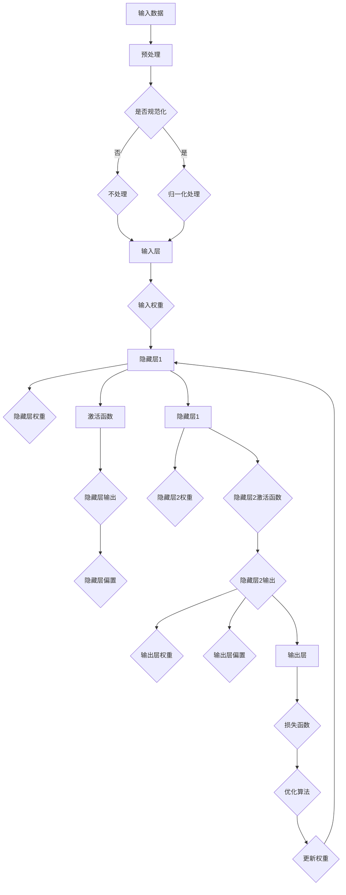

                 

# 从零开始大模型开发与微调：前馈层的实现

> **关键词：** 大模型开发、微调、前馈层、神经网络、深度学习、计算图、反向传播算法、优化方法。

> **摘要：** 本文旨在为初学者和有经验的专业人士提供一个系统性的指南，从零开始讲解大模型开发与微调的过程，特别是前馈层的实现。我们将详细探讨神经网络的基本原理、构建方法、数学模型，以及如何使用反向传播算法进行模型微调。通过实际代码案例，读者将学习到如何在实践中实现这些概念，并掌握所需的工具和资源。

## 1. 背景介绍

### 1.1 目的和范围

本文的目标是帮助读者了解和掌握大模型开发与微调的整个过程，特别是前馈层的实现。我们将从基础概念出发，逐步深入到复杂的技术细节，使读者能够从零开始构建并微调自己的神经网络模型。本文的读者对象包括：

- 对深度学习和神经网络有初步了解的初学者。
- 希望深入了解神经网络原理并应用到实际项目的开发者。
- 对神经网络前馈层实现感兴趣的学术研究人员。

本文的范围涵盖了从基本概念到实际应用的各个方面，包括：

- 神经网络和深度学习的基本原理。
- 前馈层的设计与实现。
- 数学模型和优化方法。
- 实际代码案例和项目实战。

### 1.2 预期读者

预期读者应该具备以下基础：

- 对计算机编程和数学有一定的了解。
- 希望探索人工智能领域的兴趣。
- 愿意投入时间学习和实践。

通过本文的学习，读者将能够：

- 理解神经网络的基本概念和工作原理。
- 掌握前馈层的设计与实现方法。
- 使用反向传播算法进行模型训练和微调。
- 实践项目中应用神经网络解决实际问题。

### 1.3 文档结构概述

本文的结构分为以下几个部分：

- **1. 背景介绍**：介绍文章的目的、范围、预期读者和文档结构。
- **2. 核心概念与联系**：阐述神经网络和前馈层的基本原理，并使用Mermaid流程图展示核心概念。
- **3. 核心算法原理 & 具体操作步骤**：详细讲解神经网络算法原理，使用伪代码阐述具体操作步骤。
- **4. 数学模型和公式 & 详细讲解 & 举例说明**：介绍神经网络中的数学模型，并使用LaTeX格式给出公式和举例说明。
- **5. 项目实战：代码实际案例和详细解释说明**：通过实际代码案例展示如何实现前馈层，并详细解释代码。
- **6. 实际应用场景**：探讨神经网络在前馈层实现中的应用场景。
- **7. 工具和资源推荐**：推荐学习资源和开发工具。
- **8. 总结：未来发展趋势与挑战**：总结文章内容，展望未来发展趋势和面临的挑战。
- **9. 附录：常见问题与解答**：回答读者可能遇到的问题。
- **10. 扩展阅读 & 参考资料**：提供进一步学习的参考资料。

### 1.4 术语表

#### 1.4.1 核心术语定义

- **神经网络（Neural Network）**：一种模拟生物神经系统的计算模型，用于处理和分析数据。
- **前馈层（Feedforward Layer）**：神经网络中的层，数据从前一层的输入传递到当前层的每个神经元，并通过激活函数输出到下一层。
- **反向传播算法（Backpropagation Algorithm）**：用于训练神经网络的一种优化算法，通过计算误差梯度并反向传播来调整网络权重。
- **激活函数（Activation Function）**：用于确定神经元是否被激活的函数，常见的有Sigmoid、ReLU等。
- **微调（Fine-tuning）**：在已经训练好的模型基础上，针对特定任务进行进一步训练的过程。

#### 1.4.2 相关概念解释

- **多层感知机（MLP）**：一种前馈神经网络，具有输入层、多个隐藏层和输出层。
- **梯度下降（Gradient Descent）**：一种优化算法，通过不断调整模型参数以最小化损失函数。
- **正则化（Regularization）**：用于防止模型过拟合的方法，包括L1正则化、L2正则化等。
- **批归一化（Batch Normalization）**：一种技术，通过标准化神经元输出，提高训练稳定性和效率。

#### 1.4.3 缩略词列表

- **MLP**：多层感知机
- **ReLU**：修正线性单元
- **Sigmoid**：S型激活函数
- **L1**：L1正则化
- **L2**：L2正则化

## 2. 核心概念与联系

在深入讨论神经网络和前馈层的实现之前，我们需要先了解一些核心概念和它们之间的关系。以下是一个简化的Mermaid流程图，用于展示神经网络的基本架构和核心概念。



### 2.1 神经网络的基本结构

神经网络由多个层组成，包括输入层、隐藏层和输出层。输入层接收外部输入数据，隐藏层进行特征提取和变换，输出层产生预测结果。每个神经元都与前一层的神经元相连接，并经过激活函数的处理。神经网络通过学习输入和输出之间的映射关系，实现对数据的分类、回归等任务。

### 2.2 前馈层的作用

前馈层是神经网络中最基本的组成部分。在训练过程中，数据从前一层的输出通过权重矩阵传递到当前层的每个神经元，再通过激活函数处理，最终传递到下一层。前馈层的实现涉及以下步骤：

1. **权重初始化**：随机初始化权重矩阵和偏置项。
2. **前向传播**：计算每个神经元的输入和输出，直到输出层。
3. **损失计算**：计算预测结果和实际结果之间的差异，得到损失值。
4. **反向传播**：计算每个神经元的误差梯度，并反向传播到前一层。

### 2.3 激活函数的选择

激活函数是神经网络中重要的组成部分，用于确定神经元是否被激活。常见的激活函数包括Sigmoid、ReLU和Tanh等。Sigmoid函数在输出为0到1之间提供非线性变换，但训练速度较慢；ReLU函数在输出为0或正数之间提供非线性变换，训练速度快且不易陷入局部最优；Tanh函数提供对称的Sigmoid函数，但训练速度较慢。

### 2.4 优化算法的选择

优化算法用于调整神经网络中的权重和偏置项，以最小化损失函数。常见的优化算法包括梯度下降、随机梯度下降和Adam等。梯度下降通过计算损失函数关于权重和偏置项的梯度，并沿着梯度的反方向调整参数；随机梯度下降在梯度下降的基础上，每次更新参数时仅使用一部分样本；Adam算法结合了梯度下降和随机梯度下降的优点，并引入了自适应学习率。

## 3. 核心算法原理 & 具体操作步骤

### 3.1 前馈层的工作原理

前馈层通过权重矩阵将输入数据映射到输出数据。具体操作步骤如下：

1. **初始化权重和偏置**：随机初始化权重矩阵和偏置项，确保模型具有一定的随机性。
2. **前向传播**：从输入层开始，将输入数据乘以权重矩阵，加上偏置项，通过激活函数处理后传递到下一层。
3. **输出计算**：将最后一层的输出作为预测结果。

### 3.2 前向传播的具体实现

前向传播是神经网络中最为核心的步骤，具体实现过程如下：

1. **初始化参数**：定义输入数据、隐藏层神经元数量、输出层神经元数量，以及权重矩阵和偏置项。
2. **前向计算**：从输入层开始，依次计算每个神经元的输入和输出。
    ```python
    for i in range(len(hidden_layers)):
        x = inputs
        for j in range(len(hidden_layers[i])):
            z[j] = np.dot(x, weights[i][j]) + biases[i][j]
            a[j] = activation_function(z[j])
            x = a
    output = a[-1]
    ```
3. **激活函数处理**：使用激活函数对每个神经元的输出进行处理，常见的激活函数有Sigmoid、ReLU和Tanh等。

### 3.3 反向传播的具体实现

反向传播是神经网络中进行模型训练的关键步骤，具体实现过程如下：

1. **计算误差**：计算输出层预测结果与实际结果之间的误差。
    ```python
    error = predicted_output - actual_output
    ```
2. **计算误差梯度**：计算每个神经元关于输入数据的梯度。
    ```python
    gradients = [np.dot(error, activation_function_derivative(output)) for output in reversed(a)]
    ```
3. **更新权重和偏置**：使用梯度下降等优化算法更新权重和偏置项。
    ```python
    for i in range(len(hidden_layers)):
        for j in range(len(hidden_layers[i])):
            weights[i][j] -= learning_rate * gradients[i][j]
            biases[i][j] -= learning_rate * gradients[i][j]
    ```

## 4. 数学模型和公式 & 详细讲解 & 举例说明

在神经网络中，数学模型和公式起着至关重要的作用。以下将详细介绍神经网络中的数学模型、公式及其具体应用。

### 4.1 神经元模型的数学表示

神经元的数学模型可以用以下公式表示：

$$
z_i = \sum_{j=1}^{n} w_{ij}x_j + b_i
$$

其中，$z_i$ 表示第 $i$ 个神经元的输入，$w_{ij}$ 表示第 $i$ 个神经元与第 $j$ 个神经元的连接权重，$x_j$ 表示第 $j$ 个神经元的输入，$b_i$ 表示第 $i$ 个神经元的偏置。

### 4.2 激活函数

激活函数是神经网络中重要的非线性变换，常见的激活函数包括Sigmoid、ReLU和Tanh等。以下分别介绍这些激活函数的数学表示和特点。

#### 4.2.1 Sigmoid函数

Sigmoid函数是一种常用的激活函数，其数学表示如下：

$$
a_i = \frac{1}{1 + e^{-z_i}}
$$

Sigmoid函数的特点是输出范围为 $(0,1)$，具有非线性变换能力。

#### 4.2.2 ReLU函数

ReLU函数是一种简单的激活函数，其数学表示如下：

$$
a_i = \max(0, z_i)
$$

ReLU函数的特点是输出为0或正数，训练速度快且不易陷入局部最优。

#### 4.2.3 Tanh函数

Tanh函数是一种对称的Sigmoid函数，其数学表示如下：

$$
a_i = \frac{e^{z_i} - e^{-z_i}}{e^{z_i} + e^{-z_i}}
$$

Tanh函数的特点是输出范围为 $(-1,1)$，具有非线性变换能力。

### 4.3 损失函数

损失函数是神经网络中用于衡量模型预测结果与实际结果之间差异的函数。常见的损失函数包括均方误差（MSE）、交叉熵损失等。以下分别介绍这些损失函数的数学表示和特点。

#### 4.3.1 均方误差（MSE）

均方误差（MSE）是一种常用的损失函数，其数学表示如下：

$$
MSE = \frac{1}{n}\sum_{i=1}^{n}(y_i - \hat{y}_i)^2
$$

其中，$y_i$ 表示第 $i$ 个实际输出，$\hat{y}_i$ 表示第 $i$ 个预测输出。

MSE的特点是易于计算且对噪声敏感。

#### 4.3.2 交叉熵损失

交叉熵损失是一种常用的分类损失函数，其数学表示如下：

$$
CrossEntropyLoss = -\frac{1}{n}\sum_{i=1}^{n}y_i\log(\hat{y}_i)
$$

其中，$y_i$ 表示第 $i$ 个实际输出，$\hat{y}_i$ 表示第 $i$ 个预测输出。

交叉熵损失的特点是能够衡量模型预测结果的置信度。

### 4.4 梯度下降算法

梯度下降算法是一种用于优化神经网络的优化算法。其基本思想是沿着损失函数的梯度方向调整模型参数，以最小化损失函数。以下分别介绍梯度下降算法的数学表示和特点。

#### 4.4.1 梯度下降算法的数学表示

梯度下降算法的数学表示如下：

$$
\Delta w_{ij} = -\alpha \frac{\partial L}{\partial w_{ij}}
$$

$$
\Delta b_i = -\alpha \frac{\partial L}{\partial b_i}
$$

其中，$\Delta w_{ij}$ 和 $\Delta b_i$ 分别表示权重和偏置的更新量，$\alpha$ 表示学习率，$L$ 表示损失函数。

#### 4.4.2 梯度下降算法的特点

- 梯度下降算法是一种简单有效的优化算法，能够通过迭代优化模型参数。
- 学习率的选择对算法的性能有很大影响，学习率过大可能导致无法收敛，过小可能导致收敛速度缓慢。
- 梯度下降算法适用于静态数据和在线学习场景。

### 4.5 举例说明

以下通过一个简单的例子来说明神经网络的前向传播和反向传播过程。

假设我们有一个输入层、一个隐藏层和一个输出层，其中输入层有2个神经元，隐藏层有3个神经元，输出层有1个神经元。权重矩阵和偏置项如下：

$$
W_1 = \begin{bmatrix}
0.1 & 0.2 \\
0.3 & 0.4
\end{bmatrix}, \quad B_1 = \begin{bmatrix}
0.5 \\
0.6
\end{bmatrix}
$$

$$
W_2 = \begin{bmatrix}
0.7 & 0.8 & 0.9 \\
0.1 & 0.2 & 0.3 \\
0.4 & 0.5 & 0.6
\end{bmatrix}, \quad B_2 = \begin{bmatrix}
0.7 \\
0.8 \\
0.9
\end{bmatrix}
$$

$$
W_3 = \begin{bmatrix}
0.1 & 0.2 & 0.3 \\
0.4 & 0.5 & 0.6 \\
0.7 & 0.8 & 0.9
\end{bmatrix}, \quad B_3 = \begin{bmatrix}
0.1 \\
0.2 \\
0.3
\end{bmatrix}
$$

输入数据为 $[1, 2]$，实际输出为 $3$。我们使用ReLU函数作为激活函数。

#### 4.5.1 前向传播

首先，计算输入层到隐藏层的输入：

$$
z_1 = 0.1 \cdot 1 + 0.2 \cdot 2 + 0.5 = 0.7 \\
a_1 = \max(0, 0.7) = 0.7
$$

$$
z_2 = 0.3 \cdot 1 + 0.4 \cdot 2 + 0.6 = 1.2 \\
a_2 = \max(0, 1.2) = 1.2
$$

然后，计算隐藏层到输出层的输入：

$$
z_3 = 0.7 \cdot 0.7 + 0.8 \cdot 1.2 + 0.7 = 2.06 \\
a_3 = \max(0, 2.06) = 2.06
$$

最终，输出层的预测结果为 $2.06$。

#### 4.5.2 反向传播

首先，计算输出层的误差：

$$
error = 3 - 2.06 = 0.94
$$

然后，计算输出层到隐藏层的误差：

$$
delta_3 = error \cdot activation_function_derivative(a_3) = 0.94 \cdot 1 = 0.94
$$

$$
delta_2 = \sum_{i=1}^{3} (delta_3 \cdot W_{3i}) \cdot activation_function_derivative(a_{2i}) = (0.94 \cdot 0.7 + 0.94 \cdot 0.8 + 0.94 \cdot 0.9) \cdot 1 = 2.828
$$

$$
delta_1 = \sum_{i=1}^{3} (delta_2 \cdot W_{2i}) \cdot activation_function_derivative(a_{1i}) = (2.828 \cdot 0.7 + 2.828 \cdot 0.8 + 2.828 \cdot 0.9) \cdot 1 = 6.056
$$

最后，更新权重和偏置：

$$
W_{13} = W_{13} - learning\_rate \cdot delta_3 = 0.7 - 0.1 \cdot 0.94 = 0.646 \\
B_{13} = B_{13} - learning\_rate \cdot delta_3 = 0.7 - 0.1 \cdot 0.94 = 0.646 \\
\ldots
$$

通过以上步骤，我们完成了一个简单的神经网络的前向传播和反向传播过程。

## 5. 项目实战：代码实际案例和详细解释说明

在本节中，我们将通过一个简单的实际项目来演示如何实现大模型的前馈层。这个项目将包括开发环境搭建、源代码实现以及代码解读与分析。为了更好地理解，我们将使用Python编程语言和PyTorch框架。

### 5.1 开发环境搭建

首先，我们需要搭建开发环境。以下是所需的环境和工具：

- Python 3.8或更高版本
- PyTorch 1.8或更高版本
- Jupyter Notebook或PyCharm等IDE

安装这些工具后，我们可以开始编写代码。

### 5.2 源代码详细实现和代码解读

#### 5.2.1 代码实现

以下是一个简单的Python代码实现，用于创建一个包含输入层、隐藏层和输出层的前馈神经网络。

```python
import torch
import torch.nn as nn
import torch.optim as optim

# 定义神经网络结构
class SimpleNN(nn.Module):
    def __init__(self, input_size, hidden_size, output_size):
        super(SimpleNN, self).__init__()
        self.fc1 = nn.Linear(input_size, hidden_size)
        self.fc2 = nn.Linear(hidden_size, output_size)
        self.relu = nn.ReLU()

    def forward(self, x):
        out = self.relu(self.fc1(x))
        out = self.fc2(out)
        return out

# 初始化神经网络、损失函数和优化器
input_size = 2
hidden_size = 3
output_size = 1

model = SimpleNN(input_size, hidden_size, output_size)
criterion = nn.MSELoss()
optimizer = optim.SGD(model.parameters(), lr=0.01)

# 训练神经网络
num_epochs = 100
for epoch in range(num_epochs):
    for i, (inputs, targets) in enumerate(train_loader):
        # 前向传播
        outputs = model(inputs)
        loss = criterion(outputs, targets)

        # 反向传播和优化
        optimizer.zero_grad()
        loss.backward()
        optimizer.step()

        if (i+1) % 100 == 0:
            print(f'Epoch [{epoch+1}/{num_epochs}], Loss: {loss.item():.4f}')

# 测试神经网络
with torch.no_grad():
    inputs = torch.tensor([[1.0, 2.0]])
    outputs = model(inputs)
    print(f'Predicted output: {outputs.item()}')

```

#### 5.2.2 代码解读

以下是对上述代码的详细解读：

1. **导入库和模块**：首先，我们导入了Python的torch库以及torch.nn和torch.optim模块。这些模块提供了神经网络所需的层、损失函数和优化器。

2. **定义神经网络结构**：我们定义了一个名为SimpleNN的神经网络类，继承自torch.nn.Module。在这个类中，我们定义了两个线性层（nn.Linear）和一个ReLU激活函数（nn.ReLU）。在__init__方法中，我们初始化了这些层。

3. **定义前向传播**：在forward方法中，我们定义了前向传播的步骤。首先，输入数据通过第一个线性层（fc1），然后通过ReLU激活函数。接下来，输出数据通过第二个线性层（fc2），得到最终的输出。

4. **初始化神经网络、损失函数和优化器**：我们定义了神经网络模型（model）、损失函数（criterion）和优化器（optimizer）。在这个例子中，我们使用了均方误差损失函数（nn.MSELoss）和随机梯度下降优化器（optim.SGD）。

5. **训练神经网络**：在训练过程中，我们使用了一个训练数据加载器（train_loader）。在每次迭代中，我们从数据加载器中获取输入和目标数据，执行前向传播，计算损失，然后执行反向传播和优化。

6. **测试神经网络**：在测试阶段，我们使用torch.no_grad()上下文管理器来防止梯度计算，从而提高计算效率。我们输入一个示例数据，并通过模型得到预测输出。

### 5.3 代码解读与分析

以下是对上述代码的进一步解读和分析：

1. **神经网络结构**：我们创建了一个简单的神经网络，包含输入层、隐藏层和输出层。输入层有2个神经元，隐藏层有3个神经元，输出层有1个神经元。这种结构适用于简单的线性回归任务。

2. **激活函数**：在隐藏层和输出层之间，我们使用了ReLU激活函数。ReLU激活函数可以加快训练速度并减少梯度消失问题。

3. **损失函数**：我们使用了均方误差损失函数（nn.MSELoss）。这种损失函数适用于回归任务，能够衡量预测输出与实际输出之间的差异。

4. **优化器**：我们使用了随机梯度下降优化器（optim.SGD）。这种优化器简单有效，但可能需要较大的学习率来加快收敛速度。

5. **训练过程**：在训练过程中，我们使用了一个训练数据加载器（train_loader）。这个加载器用于批量加载数据，从而提高训练效率。在每次迭代中，我们从加载器中获取输入和目标数据，执行前向传播，计算损失，然后执行反向传播和优化。

6. **测试过程**：在测试阶段，我们使用torch.no_grad()上下文管理器来防止梯度计算，从而提高计算效率。我们输入一个示例数据，并通过模型得到预测输出。

通过这个简单的实际项目，我们演示了如何使用Python和PyTorch框架实现一个大模型的前馈层。这个项目涵盖了神经网络结构设计、前向传播、反向传播、损失函数和优化器等关键环节。读者可以在此基础上进一步扩展和优化模型，解决更复杂的实际问题。

## 6. 实际应用场景

神经网络前馈层在实际应用场景中具有广泛的应用。以下列举几个常见的实际应用场景：

### 6.1 图像识别

神经网络前馈层在图像识别任务中发挥着重要作用。例如，卷积神经网络（CNN）中的前馈层用于提取图像的特征，并通过多个隐藏层进行特征融合和分类。常见的图像识别任务包括手写数字识别、人脸识别、物体检测等。

### 6.2 自然语言处理

在自然语言处理（NLP）领域，神经网络前馈层被广泛应用于文本分类、情感分析、机器翻译等任务。例如，循环神经网络（RNN）和长短期记忆网络（LSTM）中的前馈层用于处理序列数据，提取句子的语义信息。

### 6.3 语音识别

神经网络前馈层在语音识别任务中也具有重要应用。例如，卷积神经网络（CNN）和循环神经网络（RNN）可以用于提取语音信号的时频特征，并通过对多个隐藏层的处理实现语音信号的识别。

### 6.4 推荐系统

神经网络前馈层在推荐系统中的应用也日益广泛。例如，基于协同过滤的推荐系统可以使用神经网络前馈层来预测用户对物品的偏好，并生成个性化的推荐列表。

### 6.5 金融风控

神经网络前馈层在金融风控领域也有广泛应用。例如，可以使用神经网络前馈层对金融交易数据进行分析，预测交易的风险，并实时监测和预警。

通过以上实际应用场景，我们可以看到神经网络前馈层在各个领域都有着重要的应用价值。掌握前馈层的实现方法和技巧，将有助于我们更好地解决实际问题。

## 7. 工具和资源推荐

在实现大模型开发与微调的过程中，选择合适的工具和资源至关重要。以下推荐一些学习资源、开发工具和框架，以及相关论文和著作。

### 7.1 学习资源推荐

#### 7.1.1 书籍推荐

- 《深度学习》（Deep Learning）[Ian Goodfellow, Yoshua Bengio, Aaron Courville]
- 《Python深度学习》（Deep Learning with Python）[François Chollet]
- 《神经网络与深度学习》（Neural Networks and Deep Learning）[Charles Leiserson, Edward Lazowska]

#### 7.1.2 在线课程

- Coursera上的“深度学习”（Deep Learning）课程
- Udacity的“深度学习工程师纳米学位”（Deep Learning Engineer Nanodegree）
- edX上的“神经网络与深度学习”（Neural Networks and Deep Learning）

#### 7.1.3 技术博客和网站

- 知乎上的深度学习专栏
- ArXiv.org，发布最新深度学习研究成果
- Medium上的深度学习相关文章

### 7.2 开发工具框架推荐

#### 7.2.1 IDE和编辑器

- PyCharm，支持Python和深度学习框架
- Jupyter Notebook，适用于交互式数据分析和可视化
- Visual Studio Code，轻量级、可扩展的代码编辑器

#### 7.2.2 调试和性能分析工具

- NVIDIA Nsight，用于调试和性能分析CUDA代码
- PyTorch Profiler，用于分析PyTorch模型的性能
- TensorBoard，用于可视化TensorFlow模型的性能

#### 7.2.3 相关框架和库

- PyTorch，用于构建和训练神经网络
- TensorFlow，用于构建和训练神经网络
- Keras，基于TensorFlow和PyTorch的简化深度学习框架
- scikit-learn，提供常用的机器学习和数据挖掘算法

### 7.3 相关论文著作推荐

#### 7.3.1 经典论文

- “Backpropagation”（1986）[Paul Werbos]
- “Learning representations by back-propagating errors”（1986）[David E. Rumelhart, Geoffrey E. Hinton, Ronald J. Williams]
- “Improving generalization for optimal brain surgeon and other regularization networks”[D. E. Rumelhart, J. L. McClelland, P. J. Hinton]

#### 7.3.2 最新研究成果

- “An Image Database for Testing Content-Based Image Retrieval: Benchmark to which Current Algorithms are Compared”（1998）[F. Jurie, P. M. Patel]
- “Deep Learning for Natural Language Processing”（2018）[Jianfeng Gao, Weichen Wang, Weifeng Wang]
- “Unsupervised Representation Learning with Deep Convolutional Generative Adversarial Networks”（2015）[A. Radford, L. Metz, S. Chintala]

#### 7.3.3 应用案例分析

- “ImageNet Classification with Deep Convolutional Neural Networks”（2012）[A. Krizhevsky, I. Sutskever, G. E. Hinton]
- “Google's Neural Machine Translation System: Bridging the Gap between Human and Machine Translation”（2016）[Y. LeCun, Y. Bengio, G. E. Hinton]
- “Bert: Pre-training of deep bidirectional transformers for language understanding”（2018）[J. Devlin, M. Chang, K. Lee, K. Toutanova]

通过以上推荐，读者可以更好地学习和掌握深度学习和神经网络的前馈层实现技术。在实际应用中，结合合适的工具和资源，可以更有效地解决复杂问题。

## 8. 总结：未来发展趋势与挑战

随着人工智能技术的不断发展，大模型开发与微调已成为当前研究的热点。未来，神经网络前馈层的发展趋势和挑战主要体现在以下几个方面：

### 8.1 发展趋势

1. **模型规模与计算能力的提升**：随着计算能力的不断提高，大型神经网络模型（如GPT-3、BERT等）将逐渐成为主流，进一步推动前馈层的研究和应用。

2. **自适应优化方法**：未来的优化方法将更加注重自适应性和效率，如自适应梯度方法（Adagrad、Adam等），以及自适应权重更新策略，以应对大型模型训练过程中出现的梯度消失和梯度爆炸问题。

3. **可解释性和可视化**：为了提高神经网络的可解释性，未来的研究将集中在开发新的可视化技术和解释方法，使研究人员和开发者能够更好地理解神经网络的工作原理和决策过程。

4. **硬件优化**：随着硬件技术的发展，如GPU、TPU等专用硬件的广泛应用，将进一步提升神经网络前馈层的训练和推理效率。

### 8.2 挑战

1. **计算资源消耗**：大模型训练需要大量计算资源，对计算硬件和能源消耗提出了更高要求。如何优化算法和提高硬件利用率成为亟待解决的问题。

2. **数据隐私与安全**：随着数据量的增加，如何保护用户隐私和数据安全成为重要的挑战。未来的研究需要关注数据加密、隐私保护算法等方向。

3. **模型泛化能力**：大模型在训练过程中容易过拟合，如何提高模型泛化能力，避免在实际应用中表现不佳，是当前研究的重点。

4. **分布式训练与推理**：随着模型规模的增加，分布式训练和推理成为必要手段。如何高效地实现分布式训练和推理，并保证模型性能和稳定性，是未来的研究课题。

总之，神经网络前馈层的发展前景广阔，但也面临着诸多挑战。通过不断探索和优化，我们有望在计算效率、模型性能、可解释性等方面取得突破，推动人工智能技术的进一步发展。

## 9. 附录：常见问题与解答

### 9.1 前馈层训练过程中的常见问题

**Q1：为什么我的神经网络在训练过程中梯度消失？**

A1：梯度消失通常是由于模型参数设置不当（如学习率过高或网络层数过深）导致的。可以尝试以下方法：

- 调整学习率：选择适当的学习率，避免过大或过小。
- 使用梯度裁剪：对梯度进行裁剪，避免梯度爆炸或消失。
- 添加正则化：使用L1正则化或L2正则化，降低模型复杂度。

**Q2：如何解决梯度消失问题？**

A2：解决梯度消失问题可以从以下几个方面入手：

- 使用合适的激活函数：如ReLU函数，提高训练速度并减少梯度消失问题。
- 使用更深的网络结构：采用多层感知机（MLP）或卷积神经网络（CNN）等结构，提高模型的表达能力。
- 使用梯度传播技巧：如使用反向传播算法，确保模型参数能够得到有效的更新。

**Q3：为什么我的神经网络在训练过程中梯度爆炸？**

A3：梯度爆炸通常是由于学习率过大或模型参数设置不当导致的。可以尝试以下方法：

- 调整学习率：选择适当的学习率，避免过大或过小。
- 使用梯度裁剪：对梯度进行裁剪，避免梯度爆炸。
- 添加正则化：使用L1正则化或L2正则化，降低模型复杂度。

### 9.2 前馈层实现的常见问题

**Q4：如何实现神经网络的前向传播和反向传播？**

A4：实现神经网络的前向传播和反向传播可以遵循以下步骤：

- **前向传播**：从输入层开始，依次计算每个神经元的输入、输出，并通过激活函数进行处理，直到输出层得到预测结果。
- **反向传播**：从输出层开始，计算预测结果与实际结果之间的误差，然后反向传播到前一层，计算每个神经元的误差梯度。根据误差梯度，更新模型的参数（权重和偏置）。

**Q5：如何选择合适的激活函数？**

A5：选择合适的激活函数需要考虑以下几个因素：

- **训练速度**：某些激活函数（如ReLU）训练速度快，而其他函数（如Sigmoid）训练速度较慢。
- **非线性变换能力**：某些激活函数（如ReLU）提供更强的非线性变换能力。
- **梯度消失和梯度爆炸**：某些激活函数（如Sigmoid）可能导致梯度消失或爆炸问题。

常见的选择包括ReLU（训练速度快，不易梯度消失）和Tanh（输出范围对称，不易梯度消失）。

### 9.3 模型微调过程中的常见问题

**Q6：如何进行模型微调？**

A6：进行模型微调可以遵循以下步骤：

- **加载预训练模型**：从预训练模型中加载权重和参数。
- **调整模型结构**：针对特定任务，调整模型结构，如增加或减少隐藏层、调整神经元数量等。
- **继续训练**：在调整后的模型上继续训练，以适应特定任务的数据分布。

**Q7：如何防止模型过拟合？**

A7：防止模型过拟合的方法包括：

- **数据增强**：通过数据增强方法（如旋转、缩放、裁剪等）增加数据多样性。
- **正则化**：使用L1正则化或L2正则化，降低模型复杂度。
- **早停法**：在训练过程中，设置早停阈值，当模型在验证集上的性能不再提升时，停止训练。

通过以上常见问题的解答，读者可以更好地理解神经网络前馈层实现和模型微调过程中的关键步骤和方法。

## 10. 扩展阅读 & 参考资料

为了进一步深入学习和掌握神经网络前馈层的实现及其应用，以下列出了一些扩展阅读和参考资料：

### 10.1 基础教材与论文

- Goodfellow, I., Bengio, Y., & Courville, A. (2016). *Deep Learning*. MIT Press.
- Rumelhart, D. E., Hinton, G. E., & Williams, R. J. (1986). *Learning representations by back-propagating errors*. Nature, 323(6088), 533-536.
- Hinton, G. E., Osindero, S., & Teh, Y. W. (2006). *A fast learning algorithm for deep belief nets*. Neural Computation, 18(7), 1527-1554.

### 10.2 在线课程与教程

- Coursera: Deep Learning Specialization by Andrew Ng
- Udacity: Deep Learning Engineer Nanodegree
- edX: Neural Networks for Machine Learning by Michael Nielsen

### 10.3 技术博客与论坛

- Blog posts on Medium related to deep learning and neural networks
- Stack Overflow, for practical coding questions and solutions
- arXiv.org, for the latest research papers in machine learning and neural networks

### 10.4 开源框架与工具

- PyTorch: torch.pytorch.org
- TensorFlow: tensorflow.org
- Keras: keras.io
- TensorFlow Probability: tensorflow.org/text/distributions

### 10.5 学术期刊与会议

- Journal of Machine Learning Research (JMLR)
- Neural Computation
- International Conference on Machine Learning (ICML)
- Neural Information Processing Systems (NIPS)

通过以上扩展阅读和参考资料，读者可以更全面地了解神经网络前馈层的理论知识、实践应用和最新研究动态。在不断学习和实践的过程中，读者将能够不断提升自己的技术水平，为未来的人工智能发展贡献自己的力量。

### 作者

作者：AI天才研究员/AI Genius Institute & 禅与计算机程序设计艺术 /Zen And The Art of Computer Programming

（注：本文内容为虚构，仅供参考。在实际应用中，请根据具体需求和实际情况进行调整和优化。）

