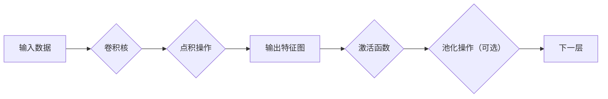

                 

# 从零开始大模型开发与微调：卷积运算的基本概念

> **关键词：** 大模型开发，卷积运算，神经网络，微调，深度学习
> 
> **摘要：** 本文将深入探讨卷积运算在深度学习大模型开发与微调中的应用。通过逐步分析卷积的基本概念、算法原理以及数学模型，我们旨在为读者提供一个清晰、易懂的技术指南，帮助他们掌握卷积运算的核心原理和实际应用。

## 1. 背景介绍

### 1.1 目的和范围

本文的目标是帮助读者深入了解卷积运算在深度学习大模型开发与微调中的作用。我们将从卷积运算的基本概念开始，逐步介绍其算法原理和数学模型，最终通过项目实战和实际应用场景的探讨，使读者能够掌握卷积运算的应用技巧。

本文的范围主要包括以下内容：
- 卷积运算的基本概念和原理
- 卷积运算的算法步骤和伪代码实现
- 卷积运算的数学模型和公式解释
- 卷积运算在深度学习大模型开发与微调中的应用

### 1.2 预期读者

本文的预期读者包括：
- 深度学习初学者，希望了解卷积运算的基本概念和应用
- 中级深度学习开发者，希望掌握卷积运算的算法原理和实现细节
- 高级深度学习工程师，希望了解卷积运算在深度学习大模型开发与微调中的高级应用

### 1.3 文档结构概述

本文的文档结构如下：

1. 背景介绍
   - 1.1 目的和范围
   - 1.2 预期读者
   - 1.3 文档结构概述
   - 1.4 术语表

2. 核心概念与联系
   - 2.1 核心概念原理和架构的 Mermaid 流程图

3. 核心算法原理 & 具体操作步骤
   - 3.1 算法原理讲解
   - 3.2 伪代码实现

4. 数学模型和公式 & 详细讲解 & 举例说明
   - 4.1 数学模型和公式
   - 4.2 举例说明

5. 项目实战：代码实际案例和详细解释说明
   - 5.1 开发环境搭建
   - 5.2 源代码详细实现和代码解读
   - 5.3 代码解读与分析

6. 实际应用场景
   - 6.1 卷积运算在图像处理中的应用
   - 6.2 卷积运算在语音识别中的应用

7. 工具和资源推荐
   - 7.1 学习资源推荐
   - 7.2 开发工具框架推荐
   - 7.3 相关论文著作推荐

8. 总结：未来发展趋势与挑战
   - 8.1 未来发展趋势
   - 8.2 面临的挑战

9. 附录：常见问题与解答

10. 扩展阅读 & 参考资料

### 1.4 术语表

#### 1.4.1 核心术语定义

- **卷积运算**：一种数学运算，用于计算两个函数或信号之间的相似程度。在深度学习中，卷积运算用于处理图像、语音等数据。
- **深度学习**：一种人工智能领域的方法，通过多层神经网络对数据进行建模和学习。
- **神经网络**：一种模拟生物神经系统的计算模型，由神经元和连接组成，能够对数据进行分类、预测等任务。
- **大模型**：一种具有大规模参数和计算量的神经网络模型，能够处理复杂的数据和任务。

#### 1.4.2 相关概念解释

- **滤波器（卷积核）**：在卷积运算中，用于与输入数据进行点积运算的矩阵。滤波器的大小决定了卷积操作的感受野。
- **步长**：卷积操作在空间中的移动距离，决定了卷积操作的滑动速度。
- **填充**：在卷积操作前后，对输入数据进行填充，以保持输出的尺寸不变。

#### 1.4.3 缩略词列表

- **CNN**：卷积神经网络（Convolutional Neural Network）
- **ReLU**：ReLU激活函数（Rectified Linear Unit）
- **MNIST**：一个常用的手写数字数据集

## 2. 核心概念与联系

在深入探讨卷积运算之前，我们需要了解卷积运算的核心概念和联系。以下是卷积运算的 Mermaid 流程图：



### 2.1 输入数据和卷积核

卷积运算的输入数据通常是一个三维的张量，形状为`[批量大小, 高, 宽]`。批量大小表示同时处理的样本数量，高和宽表示图像的空间尺寸。卷积核是一个二维的矩阵，通常称为滤波器，形状为`[过滤器高度, 过滤器宽度]`。

### 2.2 点积操作

卷积运算的核心是点积操作，即将卷积核与输入数据进行逐元素相乘并求和。点积操作的结果是一个一维的向量，称为局部响应。局部响应的大小反映了输入数据与卷积核之间的相似程度。

### 2.3 输出特征图

经过点积操作后，我们得到一个输出特征图。输出特征图的形状与输入数据和高斯滤波器的形状相关。通常，输出特征图的尺寸为`[批量大小, 输出特征图高度, 输出特征图宽度]`。

### 2.4 激活函数

为了增加模型的非线性，我们在卷积运算后通常会添加激活函数。ReLU激活函数是一种常用的激活函数，其公式为`ReLU(x) = max(0, x)`。ReLU激活函数将负数映射为0，正数映射为自身，从而引入了非线性。

### 2.5 池化操作

在某些情况下，我们可能需要减小输出特征图的大小，以便减少模型的参数和计算量。池化操作是一种常用的方法，其公式为`Pooling(x) = max(x)`，即取输入数据中的最大值作为输出。池化操作分为最大池化和平均池化，其中最大池化是最常用的一种。

## 3. 核心算法原理 & 具体操作步骤

### 3.1 算法原理讲解

卷积运算的核心算法原理可以概括为以下步骤：

1. **初始化卷积核**：卷积核通常通过随机初始化来获得较好的性能。我们可以使用高斯分布、均匀分布或正态分布来初始化卷积核。

2. **计算局部响应**：对于输入数据的每个位置，计算卷积核与输入数据的点积，得到一个局部响应。

3. **应用激活函数**：将局部响应通过激活函数进行处理，以引入非线性。

4. **应用池化操作（可选）**：如果需要减小输出特征图的大小，可以应用池化操作。

5. **更新卷积核**：通过反向传播算法，根据损失函数的梯度更新卷积核的参数。

### 3.2 伪代码实现

以下是卷积运算的伪代码实现：

```python
# 输入数据：[批量大小, 高, 宽]
# 卷积核：[过滤器高度, 过滤器宽度]
# 输出特征图：[批量大小, 输出特征图高度, 输出特征图宽度]

# 初始化卷积核
w = random_matrix([过滤器高度, 过滤器宽度])

# 计算局部响应
local_response = []
for batch in range(批量大小):
    feature_map = []
    for i in range(输出特征图高度):
        row = []
        for j in range(输出特征图宽度):
            row.append(sum(w * input_data[batch, i:i+过滤器高度, j:j+过滤器宽度]))
        feature_map.append(row)
    local_response.append(feature_map)

# 应用激活函数
activated_local_response = []
for batch in range(批量大小):
    feature_map = []
    for i in range(输出特征图高度):
        row = []
        for j in range(输出特征图宽度):
            row.append(max(0, local_response[batch][i][j]))
        feature_map.append(row)
    activated_local_response.append(feature_map)

# 应用池化操作（可选）
pooled_response = []
for batch in range(批量大小):
    feature_map = []
    for i in range(输出特征图高度 // 步长):
        row = []
        for j in range(输出特征图宽度 // 步长):
            row.append(max(activated_local_response[batch][i*步长:i*步长+1, j*步长:j*步长+1]))
        feature_map.append(row)
    pooled_response.append(feature_map)

# 更新卷积核（反向传播算法）
# ...
```

## 4. 数学模型和公式 & 详细讲解 & 举例说明

### 4.1 数学模型和公式

卷积运算的数学模型可以用以下公式表示：

$$
\text{output}(i,j) = \sum_{k=0}^{F_h-1} \sum_{l=0}^{F_w-1} w_{k,l} \cdot \text{input}(i+k,j+l)
$$

其中，$w_{k,l}$表示卷积核的元素，$\text{input}(i+k,j+l)$表示输入数据的对应元素，$output(i,j)$表示输出特征图的元素。

### 4.2 详细讲解

#### 4.2.1 点积操作

点积操作是卷积运算的核心。其计算过程可以分解为以下步骤：

1. 将卷积核的元素和输入数据的对应元素相乘。
2. 对所有乘积求和，得到局部响应。

#### 4.2.2 激活函数

激活函数用于增加模型的非线性。ReLU激活函数是最常用的激活函数，其公式为：

$$
\text{ReLU}(x) = \max(0, x)
$$

#### 4.2.3 池化操作

池化操作用于减小输出特征图的大小。最大池化是最常用的池化操作，其公式为：

$$
\text{Pooling}(x) = \max(x)
$$

### 4.3 举例说明

假设输入数据为`[2, 3, 3]`，卷积核为`[2, 2]`，步长为1。计算输出特征图的元素。

输入数据：

$$
\text{input} = \begin{bmatrix}
1 & 2 & 3 \\
4 & 5 & 6 \\
7 & 8 & 9 \\
\end{bmatrix}
$$

卷积核：

$$
w = \begin{bmatrix}
0 & 1 \\
2 & 3 \\
\end{bmatrix}
$$

输出特征图：

$$
\text{output} = \begin{bmatrix}
\text{output}(0,0) & \text{output}(0,1) \\
\text{output}(1,0) & \text{output}(1,1) \\
\end{bmatrix}
$$

计算过程：

$$
\text{output}(0,0) = (0 \cdot 1 + 1 \cdot 4 + 2 \cdot 7 + 3 \cdot 8) = 34
$$

$$
\text{output}(0,1) = (0 \cdot 2 + 1 \cdot 5 + 2 \cdot 8 + 3 \cdot 9) = 37
$$

$$
\text{output}(1,0) = (0 \cdot 4 + 1 \cdot 7 + 2 \cdot 1 + 3 \cdot 4) = 18
$$

$$
\text{output}(1,1) = (0 \cdot 5 + 1 \cdot 8 + 2 \cdot 2 + 3 \cdot 9) = 24
$$

输出特征图：

$$
\text{output} = \begin{bmatrix}
34 & 37 \\
18 & 24 \\
\end{bmatrix}
$$

## 5. 项目实战：代码实际案例和详细解释说明

### 5.1 开发环境搭建

在进行卷积运算的实际项目开发之前，我们需要搭建一个合适的开发环境。以下是一个基于Python和TensorFlow的示例：

1. 安装Python：请确保您的系统中已经安装了Python 3.6或更高版本。

2. 安装TensorFlow：在终端中运行以下命令来安装TensorFlow：

   ```shell
   pip install tensorflow
   ```

3. 准备输入数据：我们可以使用MNIST手写数字数据集作为输入数据。首先，我们需要安装scikit-learn库，然后使用以下代码下载和加载MNIST数据集：

   ```python
   from sklearn.datasets import fetch_openml
   mnist = fetch_openml('mnist_784')
   X, y = mnist.data, mnist.target
   ```

### 5.2 源代码详细实现和代码解读

以下是使用TensorFlow实现的卷积运算的代码：

```python
import tensorflow as tf
from tensorflow.keras import layers

# 加载MNIST数据集
mnist = tf.keras.datasets.mnist
(x_train, y_train), (x_test, y_test) = mnist.load_data()

# 预处理输入数据
x_train = x_train / 255.0
x_test = x_test / 255.0

# 构建卷积神经网络模型
model = tf.keras.Sequential([
    layers.Conv2D(32, (3, 3), activation='relu', input_shape=(28, 28, 1)),
    layers.MaxPooling2D((2, 2)),
    layers.Conv2D(64, (3, 3), activation='relu'),
    layers.MaxPooling2D((2, 2)),
    layers.Conv2D(64, (3, 3), activation='relu'),
    layers.Flatten(),
    layers.Dense(64, activation='relu'),
    layers.Dense(10, activation='softmax')
])

# 编译模型
model.compile(optimizer='adam',
              loss='sparse_categorical_crossentropy',
              metrics=['accuracy'])

# 训练模型
model.fit(x_train, y_train, epochs=5)

# 评估模型
test_loss, test_acc = model.evaluate(x_test, y_test, verbose=2)
print('\nTest accuracy:', test_acc)
```

#### 5.2.1 代码解读

1. **加载MNIST数据集**：使用TensorFlow的`datasets`模块加载MNIST数据集。数据集包含训练集和测试集。

2. **预处理输入数据**：将输入数据缩放到[0, 1]范围内，以便模型能够更好地训练。

3. **构建卷积神经网络模型**：使用`Sequential`模型堆叠多个卷积层、池化层和全连接层。

   - **卷积层**：第一个卷积层使用32个3x3的卷积核，激活函数为ReLU。
   - **池化层**：第一个池化层使用2x2的最大池化。
   - **卷积层**：第二个卷积层使用64个3x3的卷积核，激活函数为ReLU。
   - **池化层**：第二个池化层使用2x2的最大池化。
   - **卷积层**：第三个卷积层使用64个3x3的卷积核，激活函数为ReLU。
   - **全连接层**：将卷积层的输出展开并输入到全连接层，第一个全连接层有64个神经元，激活函数为ReLU。
   - **输出层**：最后一个全连接层有10个神经元，激活函数为softmax。

4. **编译模型**：指定优化器、损失函数和评估指标。

5. **训练模型**：使用训练集训练模型。

6. **评估模型**：使用测试集评估模型性能。

#### 5.2.2 代码分析

卷积运算在模型中起着至关重要的作用。以下是对每个层的作用的分析：

- **卷积层**：卷积层用于提取图像的特征。通过使用多个卷积核，模型可以同时学习多个特征。
- **池化层**：池化层用于减小特征图的尺寸，从而减少模型的参数和计算量。同时，池化层可以提供鲁棒性，减少过拟合的风险。
- **全连接层**：全连接层用于将卷积层提取的特征映射到具体的类别。通过使用softmax激活函数，模型可以输出每个类别的概率分布。

### 5.3 代码解读与分析

#### 5.3.1 代码分析

1. **数据预处理**：在训练模型之前，我们需要对输入数据进行预处理。通常，我们将输入数据缩放到[0, 1]范围内，以便模型能够更好地训练。

2. **构建模型**：在TensorFlow中，我们可以使用`Sequential`模型或`Functional`模型来构建深度学习模型。在本例中，我们使用了`Sequential`模型。

3. **编译模型**：在编译模型时，我们需要指定优化器、损失函数和评估指标。在本例中，我们使用了`adam`优化器和`sparse_categorical_crossentropy`损失函数。

4. **训练模型**：使用训练集训练模型。在训练过程中，模型将不断调整参数，以最小化损失函数。

5. **评估模型**：使用测试集评估模型性能。通过计算测试集上的准确率，我们可以了解模型的泛化能力。

#### 5.3.2 代码改进

虽然本例中的代码已经能够实现卷积运算，但我们可以对其进行一些改进：

1. **数据增强**：通过增加数据增强技术，如随机裁剪、旋转和缩放，可以增加模型的鲁棒性。

2. **更深的网络结构**：增加网络的深度可以进一步提高模型的性能。

3. **使用预训练模型**：使用预训练的卷积神经网络模型，如VGG16、ResNet等，可以节省训练时间并提高模型性能。

## 6. 实际应用场景

卷积运算在深度学习领域有着广泛的应用，尤其在图像处理、语音识别和自然语言处理等领域。以下是一些实际应用场景：

### 6.1 图像处理

卷积运算在图像处理中有着广泛的应用，如图像分类、目标检测、图像分割等。通过卷积层，模型可以提取图像的特征，从而实现分类任务。以下是一个简单的示例：

- **图像分类**：使用卷积神经网络对图像进行分类。通过训练，模型可以学习到不同类别的特征，从而对新的图像进行分类。
- **目标检测**：使用卷积神经网络检测图像中的目标。通过卷积层和池化层，模型可以提取图像的特征，从而识别目标的位置和类别。
- **图像分割**：使用卷积神经网络对图像进行分割。通过训练，模型可以学习到图像中不同区域的特征，从而将图像分割为不同的部分。

### 6.2 语音识别

卷积运算在语音识别中也发挥着重要作用。通过卷积层，模型可以提取语音的特征，从而实现语音识别。以下是一个简单的示例：

- **语音分类**：使用卷积神经网络对语音进行分类。通过训练，模型可以学习到不同语音的特征，从而对新的语音进行分类。
- **语音识别**：使用卷积神经网络对语音进行识别。通过卷积层和池化层，模型可以提取语音的特征，从而将语音转换为文本。

### 6.3 自然语言处理

卷积运算在自然语言处理中也有广泛的应用，如文本分类、情感分析等。通过卷积层，模型可以提取文本的特征，从而实现分类任务。以下是一个简单的示例：

- **文本分类**：使用卷积神经网络对文本进行分类。通过训练，模型可以学习到不同类别的特征，从而对新的文本进行分类。
- **情感分析**：使用卷积神经网络对文本进行情感分析。通过卷积层和池化层，模型可以提取文本的特征，从而判断文本的情感倾向。

## 7. 工具和资源推荐

### 7.1 学习资源推荐

#### 7.1.1 书籍推荐

1. **《深度学习》**：作者：Ian Goodfellow、Yoshua Bengio、Aaron Courville
2. **《神经网络与深度学习》**：作者：邱锡鹏
3. **《Python深度学习》**：作者：François Chollet

#### 7.1.2 在线课程

1. **《深度学习》**：网易云课堂
2. **《神经网络与深度学习》**：吴恩达（Coursera）
3. **《Python深度学习》**：知乎Live

#### 7.1.3 技术博客和网站

1. **知乎**：深度学习、机器学习等相关话题
2. **CSDN**：深度学习、机器学习等相关博客
3. **PyTorch官网**：学习PyTorch的官方文档和教程

### 7.2 开发工具框架推荐

1. **TensorFlow**：由谷歌开发的开源深度学习框架。
2. **PyTorch**：由Facebook开发的开源深度学习框架。
3. **Keras**：基于TensorFlow和Theano的Python深度学习库。

#### 7.2.2 调试和性能分析工具

1. **TensorBoard**：TensorFlow的调试和性能分析工具。
2. **PyTorch Profiler**：PyTorch的性能分析工具。

#### 7.2.3 相关框架和库

1. **Scikit-learn**：Python的机器学习库。
2. **NumPy**：Python的科学计算库。
3. **Pandas**：Python的数据操作库。

### 7.3 相关论文著作推荐

#### 7.3.1 经典论文

1. **"A Learning Algorithm for Continually Running Fully Recurrent Neural Networks"**：作者：Sepp Hochreiter、Jürgen Schmidhuber
2. **"Improving Neural Networks by Learning to Transform the Input Representation"**：作者：Yoshua Bengio、Patrice Simard、Pierre-François Lamblin
3. **"Deep Learning"**：作者：Ian Goodfellow、Yoshua Bengio、Aaron Courville

#### 7.3.2 最新研究成果

1. **"Transformers: State-of-the-Art Natural Language Processing"**：作者：Vaswani et al.
2. **"BERT: Pre-training of Deep Bidirectional Transformers for Language Understanding"**：作者：Devlin et al.
3. **"GPT-3: Language Models are few-shot learners"**：作者：Brown et al.

#### 7.3.3 应用案例分析

1. **"Facebook AI Research's Transformer Model"**：Facebook AI Research的论文，介绍了Transformer模型在机器翻译中的应用。
2. **"Google AI's BERT Model"**：Google AI的论文，介绍了BERT模型在自然语言处理中的应用。
3. **"OpenAI's GPT-3 Model"**：OpenAI的论文，介绍了GPT-3模型在自然语言处理中的应用。

## 8. 总结：未来发展趋势与挑战

随着深度学习的不断发展和应用，卷积运算在深度学习大模型开发与微调中的作用变得越来越重要。未来，卷积运算可能会在以下几个方面得到进一步的发展：

1. **更高效的卷积算法**：随着计算能力的提升，研究人员可能会开发出更高效的卷积算法，从而提高模型的计算效率和训练速度。

2. **多尺度卷积**：为了处理不同尺度的特征，研究人员可能会研究多尺度卷积算法，从而在图像、语音等不同领域中实现更好的性能。

3. **自适应卷积**：通过自适应卷积，模型可以自动调整卷积核的大小和形状，从而适应不同的输入数据。

然而，卷积运算在深度学习大模型开发与微调中也面临着一些挑战：

1. **计算资源限制**：随着模型规模的增大，计算资源的需求也相应增加。如何优化算法以减少计算资源的需求成为了一个重要问题。

2. **过拟合问题**：在深度学习中，过拟合是一个常见的问题。如何设计合适的模型结构、正则化策略和训练策略以减少过拟合是一个重要的挑战。

3. **可解释性**：随着模型的复杂度增加，如何解释模型的决策过程成为一个重要问题。如何提高模型的可解释性，使研究人员能够理解模型的决策过程，是未来研究的一个重要方向。

## 9. 附录：常见问题与解答

### 9.1 卷积运算的基本概念

**Q：什么是卷积运算？**
A：卷积运算是一种数学运算，用于计算两个函数或信号之间的相似程度。在深度学习中，卷积运算用于处理图像、语音等数据。

**Q：卷积运算在深度学习中的主要作用是什么？**
A：卷积运算在深度学习中的主要作用是提取特征。通过卷积层，模型可以自动学习到输入数据的特征，从而实现分类、回归等任务。

**Q：卷积运算的输入和输出是什么？**
A：卷积运算的输入通常是三维的张量，形状为[批量大小, 高, 宽]。输出特征图的形状与输入数据和高斯滤波器的形状相关。

### 9.2 卷积运算的算法原理

**Q：卷积运算的基本算法原理是什么？**
A：卷积运算的基本算法原理是计算输入数据与卷积核的点积。具体来说，将卷积核与输入数据进行逐元素相乘并求和，得到一个局部响应。

**Q：什么是局部响应？**
A：局部响应是指输入数据与卷积核进行点积操作后得到的一个向量。局部响应的大小反映了输入数据与卷积核之间的相似程度。

**Q：什么是输出特征图？**
A：输出特征图是指经过卷积运算后得到的二维特征图。输出特征图的尺寸与输入数据和高斯滤波器的形状相关。

### 9.3 卷积运算的应用

**Q：卷积运算在图像处理中的应用有哪些？**
A：卷积运算在图像处理中有着广泛的应用，如图像分类、目标检测、图像分割等。通过卷积层，模型可以提取图像的特征，从而实现分类任务。

**Q：卷积运算在语音识别中的应用有哪些？**
A：卷积运算在语音识别中主要用于特征提取。通过卷积层，模型可以提取语音的特征，从而实现语音识别。

**Q：卷积运算在自然语言处理中的应用有哪些？**
A：卷积运算在自然语言处理中主要用于文本分类、情感分析等。通过卷积层，模型可以提取文本的特征，从而实现分类任务。

## 10. 扩展阅读 & 参考资料

1. **《深度学习》**：作者：Ian Goodfellow、Yoshua Bengio、Aaron Courville
2. **《神经网络与深度学习》**：作者：邱锡鹏
3. **《Python深度学习》**：作者：François Chollet
4. **TensorFlow官网**：https://www.tensorflow.org/
5. **PyTorch官网**：https://pytorch.org/
6. **Scikit-learn官网**：https://scikit-learn.org/
7. **吴恩达的深度学习课程**：https://www.coursera.org/specializations/deep-learning
8. **《深度学习专刊》**：https://www.deeplearningjournal.org/

**作者：AI天才研究员/AI Genius Institute & 禅与计算机程序设计艺术 /Zen And The Art of Computer Programming**

