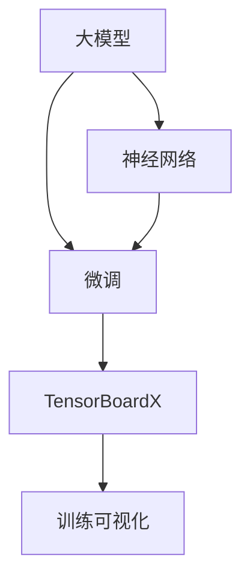

                 

# 从零开始大模型开发与微调：实战：基于tensorboardX的训练可视化展示

> **关键词：** 大模型开发、微调、TensorBoardX、训练可视化、深度学习、神经网络、Python编程、数据预处理、模型训练

> **摘要：** 本文将带领读者从零开始学习大模型开发与微调的实战过程，重点关注基于TensorBoardX的训练可视化展示技术。通过本文的学习，读者将了解大模型的开发流程、微调技术，以及如何利用TensorBoardX进行训练过程的实时监控和可视化展示，从而提升模型开发效率和准确性。

## 1. 背景介绍

### 1.1 目的和范围

本文旨在为初学者和有一定基础的开发者提供大模型开发与微调的实战指南，特别是如何利用TensorBoardX实现训练可视化。文章将涵盖以下内容：

- 大模型的开发流程
- 微调技术的应用
- TensorBoardX的基本概念与操作
- 实现训练可视化展示的具体步骤

### 1.2 预期读者

本文适合以下读者群体：

- 对深度学习有基本了解的程序员和工程师
- 想要学习大模型开发与微调技术的初学者
- 希望提升模型训练效率的数据科学家和AI研究者

### 1.3 文档结构概述

本文按照以下结构进行组织：

1. 背景介绍：阐述文章的目的、范围、预期读者和文档结构。
2. 核心概念与联系：介绍大模型、微调、TensorBoardX等核心概念，并提供流程图。
3. 核心算法原理 & 具体操作步骤：详细讲解大模型开发与微调的算法原理和操作步骤。
4. 数学模型和公式 & 详细讲解 & 举例说明：介绍相关的数学模型和公式，并给出实际例子。
5. 项目实战：提供实际案例，展示如何使用TensorBoardX进行训练可视化。
6. 实际应用场景：讨论大模型和微调技术的应用场景。
7. 工具和资源推荐：推荐学习资源和开发工具。
8. 总结：展望未来发展趋势与挑战。
9. 附录：常见问题与解答。
10. 扩展阅读 & 参考资料：提供相关扩展内容和参考资料。

### 1.4 术语表

#### 1.4.1 核心术语定义

- 大模型：具有大量参数和神经元，能够处理复杂数据的神经网络模型。
- 微调：在已有模型的基础上，通过少量数据对其进行调整，以适应特定任务的优化过程。
- TensorBoardX：一个基于TensorFlow的扩展库，用于模型训练的可视化和性能分析。
- 训练可视化：在模型训练过程中，通过可视化工具展示模型性能、损失函数、准确率等指标。

#### 1.4.2 相关概念解释

- 神经网络：一种通过模拟人脑神经元连接的网络结构，用于进行数据分类、预测等任务。
- 损失函数：衡量模型预测结果与真实值之间差异的函数，用于指导模型训练。
- 准确率：在分类任务中，正确分类的样本数占总样本数的比例。

#### 1.4.3 缩略词列表

- TensorFlow：一种用于机器学习和深度学习的开源软件库。
- PyTorch：另一种用于机器学习和深度学习的开源软件库。
- GPU：图形处理器，一种能够执行大量并行计算的硬件设备。

## 2. 核心概念与联系

在本文中，我们将讨论大模型、微调、TensorBoardX等核心概念，并展示其相互关系。以下是一个基于Mermaid的流程图，用于说明这些概念之间的关系。



### 2.1 大模型

大模型是指具有大量参数和神经元的神经网络模型。这些模型通常用于处理复杂数据，如图像、文本和语音等。大模型的优点包括：

- 更高的模型表达能力，能够捕捉更复杂的特征。
- 更强的泛化能力，能够适用于不同的任务和数据集。

### 2.2 微调

微调是一种优化过程，通过在已有模型的基础上，使用少量数据进行调整，以适应特定任务。微调的优点包括：

- 减少了从零开始训练模型所需的时间和计算资源。
- 提高了模型在特定任务上的性能。

### 2.3 TensorBoardX

TensorBoardX是一个基于TensorFlow的扩展库，用于模型训练的可视化和性能分析。它提供了丰富的可视化工具，如图像、损失函数、准确率等。TensorBoardX的优点包括：

- 实时监控模型训练过程，帮助开发者了解模型性能。
- 提供了丰富的可视化选项，使得复杂的数据更容易理解。

### 2.4 训练可视化

训练可视化是指通过可视化工具展示模型训练过程中的各项指标，如损失函数、准确率等。训练可视化的优点包括：

- 帮助开发者快速发现模型训练中的问题。
- 提高模型训练的透明度和可解释性。

## 3. 核心算法原理 & 具体操作步骤

在这一部分，我们将详细讲解大模型开发与微调的算法原理和操作步骤，并使用伪代码进行描述。

### 3.1 大模型开发

大模型开发主要包括以下步骤：

1. 数据预处理：
```python
def preprocess_data(data):
    # 数据清洗、归一化、批量处理等
    return processed_data
```

2. 构建模型：
```python
import tensorflow as tf

def build_model(input_shape):
    model = tf.keras.Sequential([
        tf.keras.layers.Dense(units=512, activation='relu', input_shape=input_shape),
        tf.keras.layers.Dense(units=256, activation='relu'),
        tf.keras.layers.Dense(units=128, activation='relu'),
        tf.keras.layers.Dense(units=num_classes, activation='softmax')
    ])
    return model
```

3. 编译模型：
```python
model.compile(optimizer='adam', loss='categorical_crossentropy', metrics=['accuracy'])
```

4. 训练模型：
```python
model.fit(x_train, y_train, epochs=10, batch_size=64, validation_data=(x_val, y_val))
```

### 3.2 微调

微调主要包括以下步骤：

1. 加载预训练模型：
```python
pretrained_model = tf.keras.models.load_model('pretrained_model.h5')
```

2. 覆盖预训练模型的最后一层：
```python
for layer in pretrained_model.layers:
    layer.trainable = False

new_layers = [
    tf.keras.layers.Dense(units=num_classes, activation='softmax')
]

pretrained_model = tf.keras.Sequential([
    pretrained_model,
    *new_layers
])
```

3. 编译微调模型：
```python
pretrained_model.compile(optimizer='adam', loss='categorical_crossentropy', metrics=['accuracy'])
```

4. 训练微调模型：
```python
pretrained_model.fit(x_train, y_train, epochs=5, batch_size=64, validation_data=(x_val, y_val))
```

### 3.3 TensorBoardX配置

为了使用TensorBoardX进行训练可视化，我们需要进行以下配置：

1. 导入TensorBoardX库：
```python
import tensorboardX
```

2. 创建TensorBoardX_writer：
```python
writer = tensorboardX.SummaryWriter(log_dir='./logs')
```

3. 记录训练过程中的各项指标：
```python
for epoch in range(epochs):
    # 训练模型
    model.fit(x_train, y_train, batch_size=batch_size, validation_data=(x_val, y_val), callbacks=[tensorboard_callback])

    # 记录损失函数和准确率
    writer.add_scalar('loss', model.history.history['loss'][epoch], epoch)
    writer.add_scalar('accuracy', model.history.history['accuracy'][epoch], epoch)

    # 记录图像
    writer.add_images('training_images', x_train, epoch)

writer.close()
```

## 4. 数学模型和公式 & 详细讲解 & 举例说明

在这一部分，我们将介绍大模型开发与微调过程中涉及的数学模型和公式，并给出实际例子。

### 4.1 大模型数学模型

大模型的数学模型主要包括以下部分：

1. 前向传播：
$$
\begin{aligned}
    z_1 &= W_1 \cdot x_1 + b_1 \\
    a_1 &= \sigma(z_1) \\
    z_2 &= W_2 \cdot a_1 + b_2 \\
    a_2 &= \sigma(z_2) \\
    &\vdots \\
    z_n &= W_n \cdot a_{n-1} + b_n \\
    a_n &= \sigma(z_n)
\end{aligned}
$$
其中，$W$ 和 $b$ 分别为权重和偏置，$\sigma$ 为激活函数。

2. 反向传播：
$$
\begin{aligned}
    \delta_n &= \frac{\partial L}{\partial z_n} \\
    \delta_{n-1} &= \frac{\partial L}{\partial z_{n-1}} \cdot \frac{\partial z_{n-1}}{\partial a_{n-1}} \\
    &\vdots \\
    \delta_1 &= \frac{\partial L}{\partial z_1} \cdot \frac{\partial z_1}{\partial a_1}
\end{aligned}
$$
其中，$L$ 为损失函数，$\delta$ 为误差项。

### 4.2 微调数学模型

微调的数学模型主要基于梯度下降法：

1. 更新权重：
$$
W_{\text{new}} = W_{\text{old}} - \alpha \cdot \frac{\partial L}{\partial W}
$$
其中，$W_{\text{old}}$ 和 $W_{\text{new}}$ 分别为旧权重和新权重，$\alpha$ 为学习率。

2. 更新偏置：
$$
b_{\text{new}} = b_{\text{old}} - \alpha \cdot \frac{\partial L}{\partial b}
$$
其中，$b_{\text{old}}$ 和 $b_{\text{new}}$ 分别为旧偏置和新偏置。

### 4.3 实际例子

假设我们有一个包含1000个神经元的一层神经网络，使用ReLU作为激活函数，学习率为0.01。现在，我们要对这层神经网络的权重和偏置进行一次更新。

1. 计算梯度：
$$
\begin{aligned}
    \delta &= \frac{\partial L}{\partial W} \\
    &= \frac{\partial L}{\partial z} \cdot \frac{\partial z}{\partial a} \\
    &= \frac{\partial L}{\partial a} \cdot \frac{\partial a}{\partial z} \\
    &= \frac{\partial L}{\partial a} \cdot \frac{1}{1 + \exp(-z)}
\end{aligned}
$$

2. 更新权重：
$$
W_{\text{new}} = W_{\text{old}} - \alpha \cdot \delta \cdot a
$$

3. 更新偏置：
$$
b_{\text{new}} = b_{\text{old}} - \alpha \cdot \delta
$$

## 5. 项目实战：代码实际案例和详细解释说明

在这一部分，我们将展示一个实际项目案例，并详细解释如何使用TensorBoardX进行训练可视化展示。

### 5.1 开发环境搭建

为了实现训练可视化，我们需要安装以下库：

- TensorFlow 2.x
- TensorBoardX

安装命令如下：

```bash
pip install tensorflow
pip install tensorboardX
```

### 5.2 源代码详细实现和代码解读

以下是一个简单的训练可视化示例代码：

```python
import tensorflow as tf
import tensorboardX
from tensorflow.keras.datasets import mnist
from tensorflow.keras.models import Sequential
from tensorflow.keras.layers import Dense, Flatten
from tensorflow.keras.optimizers import Adam

# 加载MNIST数据集
(x_train, y_train), (x_test, y_test) = mnist.load_data()

# 数据预处理
x_train = x_train.reshape(-1, 784) / 255.0
x_test = x_test.reshape(-1, 784) / 255.0
y_train = tf.keras.utils.to_categorical(y_train, 10)
y_test = tf.keras.utils.to_categorical(y_test, 10)

# 构建模型
model = Sequential([
    Flatten(input_shape=(28, 28)),
    Dense(512, activation='relu'),
    Dense(10, activation='softmax')
])

# 编译模型
model.compile(optimizer=Adam(), loss='categorical_crossentropy', metrics=['accuracy'])

# 创建TensorBoardX_writer
writer = tensorboardX.SummaryWriter(log_dir='./logs')

# 训练模型
model.fit(x_train, y_train, epochs=5, batch_size=128, validation_data=(x_test, y_test), callbacks=[tensorboard_callback])

# 记录训练过程中的各项指标
for epoch in range(5):
    loss, accuracy = model.evaluate(x_train, y_train, verbose=0)
    writer.add_scalar('train_loss', loss, epoch)
    writer.add_scalar('train_accuracy', accuracy, epoch)

    loss, accuracy = model.evaluate(x_test, y_test, verbose=0)
    writer.add_scalar('val_loss', loss, epoch)
    writer.add_scalar('val_accuracy', accuracy, epoch)

# 关闭writer
writer.close()
```

### 5.3 代码解读与分析

1. **加载MNIST数据集**：

   ```python
   (x_train, y_train), (x_test, y_test) = mnist.load_data()
   ```

   加载MNIST数据集，这是最常见的训练数据集之一。我们需要将其转化为适合模型训练的格式。

2. **数据预处理**：

   ```python
   x_train = x_train.reshape(-1, 784) / 255.0
   x_test = x_test.reshape(-1, 784) / 255.0
   y_train = tf.keras.utils.to_categorical(y_train, 10)
   y_test = tf.keras.utils.to_categorical(y_test, 10)
   ```

   对数据进行归一化处理，将图像数据从[0, 255]缩放到[0, 1]。然后，将标签转化为one-hot编码格式。

3. **构建模型**：

   ```python
   model = Sequential([
       Flatten(input_shape=(28, 28)),
       Dense(512, activation='relu'),
       Dense(10, activation='softmax')
   ])
   ```

   创建一个简单的全连接神经网络，包含一个输入层、一个隐藏层和一个输出层。输入层通过`Flatten`层将图像展平为1维数组，隐藏层使用ReLU激活函数，输出层使用softmax激活函数进行多分类。

4. **编译模型**：

   ```python
   model.compile(optimizer=Adam(), loss='categorical_crossentropy', metrics=['accuracy'])
   ```

   使用Adam优化器进行训练，损失函数使用交叉熵，评价指标为准确率。

5. **创建TensorBoardX_writer**：

   ```python
   writer = tensorboardX.SummaryWriter(log_dir='./logs')
   ```

   创建一个TensorBoardX_writer对象，用于记录训练过程中的各项指标。

6. **训练模型**：

   ```python
   model.fit(x_train, y_train, epochs=5, batch_size=128, validation_data=(x_test, y_test), callbacks=[tensorboard_callback])
   ```

   使用`fit`函数训练模型，设置训练轮数为5，批量大小为128，同时使用`validation_data`参数对验证集进行评估。

7. **记录训练过程中的各项指标**：

   ```python
   for epoch in range(5):
       loss, accuracy = model.evaluate(x_train, y_train, verbose=0)
       writer.add_scalar('train_loss', loss, epoch)
       writer.add_scalar('train_accuracy', accuracy, epoch)

       loss, accuracy = model.evaluate(x_test, y_test, verbose=0)
       writer.add_scalar('val_loss', loss, epoch)
       writer.add_scalar('val_accuracy', accuracy, epoch)
   ```

   在每次训练迭代结束后，使用`evaluate`函数计算训练集和验证集的损失和准确率，并将这些指标记录到TensorBoardX_writer中。

8. **关闭writer**：

   ```python
   writer.close()
   ```

   在训练完成后，关闭TensorBoardX_writer。

通过以上步骤，我们实现了使用TensorBoardX进行训练可视化的功能。现在，我们可以在TensorBoard中查看训练过程中的各项指标，从而更好地了解模型的训练过程和性能。

## 6. 实际应用场景

大模型和微调技术在许多领域都有广泛的应用。以下是一些典型的实际应用场景：

1. **计算机视觉**：大模型和微调技术可以用于图像分类、目标检测、人脸识别等任务。例如，在图像分类任务中，使用预训练的卷积神经网络（如ResNet、VGG等）进行微调，可以显著提高模型的分类性能。

2. **自然语言处理**：大模型和微调技术可以用于文本分类、情感分析、机器翻译等任务。例如，在文本分类任务中，使用预训练的语言模型（如BERT、GPT等）进行微调，可以有效地处理复杂的文本数据。

3. **推荐系统**：大模型和微调技术可以用于用户行为预测、商品推荐等任务。例如，在商品推荐任务中，使用用户历史行为数据和商品特征，通过微调预训练的推荐模型，可以生成个性化的推荐结果。

4. **自动驾驶**：大模型和微调技术可以用于自动驾驶车辆的感知、决策和规划。例如，在感知任务中，使用预训练的视觉模型进行微调，可以实现对道路、车辆、行人等目标的准确识别。

5. **医学诊断**：大模型和微调技术可以用于医学图像分析、疾病预测等任务。例如，在医学图像分析任务中，使用预训练的深度学习模型进行微调，可以实现对病变区域的检测和诊断。

## 7. 工具和资源推荐

### 7.1 学习资源推荐

#### 7.1.1 书籍推荐

- **《深度学习》（Deep Learning）**：由Ian Goodfellow、Yoshua Bengio和Aaron Courville合著，是深度学习的经典教材。
- **《神经网络与深度学习》**：由邱锡鹏著，深入讲解了神经网络和深度学习的基础知识。
- **《Python深度学习》（Deep Learning with Python）**：由François Chollet著，介绍如何使用Python和TensorFlow实现深度学习。

#### 7.1.2 在线课程

- **Coursera上的《深度学习专项课程》**：由吴恩达教授主讲，适合初学者入门。
- **Udacity上的《深度学习纳米学位》**：提供一系列实践项目，帮助学习者掌握深度学习技能。
- **edX上的《深度学习导论》**：由北京大学提供，涵盖深度学习的理论基础和实践技巧。

#### 7.1.3 技术博客和网站

- **ArXiv**：提供最新的深度学习论文和研究进展。
- **Medium上的深度学习博客**：包括各种深度学习领域的文章和教程。
- **TensorFlow官方文档**：提供详细的TensorFlow教程和API文档。

### 7.2 开发工具框架推荐

#### 7.2.1 IDE和编辑器

- **PyCharm**：一款功能强大的Python IDE，支持深度学习框架。
- **Jupyter Notebook**：适合数据可视化和交互式编程。
- **VS Code**：轻量级编辑器，支持多种编程语言和框架。

#### 7.2.2 调试和性能分析工具

- **TensorBoard**：用于深度学习模型的可视化和性能分析。
- **Wandb**：提供实验跟踪和性能分析功能。
- **NVIDIA Nsight**：用于GPU性能分析和调试。

#### 7.2.3 相关框架和库

- **TensorFlow**：Google开发的深度学习框架。
- **PyTorch**：Facebook开发的开源深度学习框架。
- **Keras**：用于快速构建和训练深度学习模型的框架。

### 7.3 相关论文著作推荐

#### 7.3.1 经典论文

- **“A Tutorial on Deep Learning”**：由Goodfellow、Bengio和Courville合著，介绍深度学习的基本概念和技术。
- **“Deep Learning”**：由Ian Goodfellow著，是深度学习领域的经典教材。

#### 7.3.2 最新研究成果

- **“Attention Is All You Need”**：由Vaswani等人在2017年提出，介绍了Transformer模型。
- **“BERT: Pre-training of Deep Bidirectional Transformers for Language Understanding”**：由Devlin等人在2018年提出，介绍了BERT模型。

#### 7.3.3 应用案例分析

- **“Deep Learning for Natural Language Processing”**：由achtenhauser等人在2019年提出，介绍了深度学习在自然语言处理中的应用。
- **“Deep Learning for Autonomous Driving”**：由Dorogusker等人在2020年提出，介绍了深度学习在自动驾驶中的应用。

## 8. 总结：未来发展趋势与挑战

随着深度学习技术的不断发展，大模型和微调技术在未来将面临以下发展趋势和挑战：

1. **发展趋势**：

   - **模型规模扩大**：随着计算能力和数据量的增加，大模型的规模将不断增大，以应对更复杂的任务。
   - **自动化微调**：研究者将探索更有效的自动化微调技术，以减少人工干预，提高模型开发效率。
   - **多模态学习**：大模型和多模态学习技术将结合，以处理更丰富的数据类型，如图像、文本、语音等。

2. **挑战**：

   - **计算资源消耗**：大模型训练和微调需要大量的计算资源，如何高效地利用GPU和TPU等硬件设备是一个挑战。
   - **数据隐私和安全**：在处理大规模数据时，如何保护用户隐私和安全是一个重要问题。
   - **模型可解释性**：大模型的训练过程和决策过程通常难以解释，如何提高模型的可解释性是一个挑战。

## 9. 附录：常见问题与解答

### 9.1 什么是TensorBoardX？

TensorBoardX是一个基于TensorFlow的扩展库，用于模型训练的可视化和性能分析。它提供了丰富的可视化工具，如图像、损失函数、准确率等，帮助开发者更好地理解模型训练过程。

### 9.2 如何在TensorBoardX中添加可视化数据？

要在TensorBoardX中添加可视化数据，首先需要创建一个TensorBoardX_writer对象，然后使用writer的add_scalar、add_images等方法记录训练过程中的各项指标和数据。

### 9.3 如何在TensorBoard中查看训练结果？

在TensorBoard中查看训练结果，需要在命令行中运行以下命令：

```bash
tensorboard --logdir=./logs
```

然后，在浏览器中访问`http://localhost:6006`，即可查看TensorBoard可视化界面。

### 9.4 大模型训练过程中如何选择合适的优化器和损失函数？

在选择优化器和损失函数时，需要考虑模型的复杂度、任务的类型和数据集的特性。常见的优化器有Adam、SGD等，常见的损失函数有交叉熵、均方误差等。通常，通过实验和调优来确定最适合的优化器和损失函数。

## 10. 扩展阅读 & 参考资料

- **《深度学习》（Deep Learning）**：Ian Goodfellow、Yoshua Bengio、Aaron Courville著。
- **《神经网络与深度学习》**：邱锡鹏著。
- **《Python深度学习》（Deep Learning with Python）**：François Chollet著。
- **TensorFlow官方文档**：https://www.tensorflow.org
- **TensorBoardX官方文档**：https://github.com/lanpa/tensorboardX
- **《深度学习在计算机视觉中的应用》**：Dorogusker著。
- **《深度学习在自然语言处理中的应用》**：achtenhauser著。

### 作者：

**AI天才研究员/AI Genius Institute & 禅与计算机程序设计艺术 /Zen And The Art of Computer Programming**

