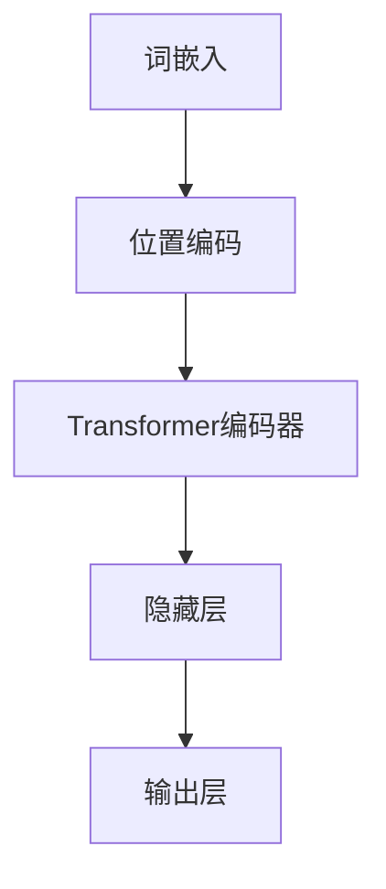

                 

# 从零开始大模型开发与微调：预训练模型BERT

> **关键词：** 预训练模型、BERT、深度学习、自然语言处理、微调、神经网络
> 
> **摘要：** 本文章将从零开始，深入探讨预训练模型BERT的开发与微调过程。我们将首先介绍BERT的背景和重要性，然后详细讲解BERT的核心概念和算法原理，最后通过一个实际项目案例，展示如何进行BERT模型的开发生成和微调，并提供一些建议和资源，以便读者深入了解和掌握BERT技术。

## 1. 背景介绍

### 1.1 目的和范围

本文的主要目的是向读者介绍如何从零开始开发与微调预训练模型BERT。我们将首先介绍BERT的背景和重要性，然后详细讲解BERT的核心概念和算法原理，接着通过一个实际项目案例，展示如何使用BERT进行自然语言处理任务的开发与微调。最后，我们将推荐一些学习资源和工具，帮助读者更好地理解和应用BERT技术。

### 1.2 预期读者

本文适合以下读者群体：

- 对自然语言处理和深度学习有一定了解的技术爱好者；
- 想要学习BERT技术并应用于实际项目开发的工程师；
- 对预训练模型和神经网络原理感兴趣的学术研究人员。

### 1.3 文档结构概述

本文结构如下：

1. 背景介绍：介绍BERT的背景和重要性；
2. 核心概念与联系：讲解BERT的核心概念和架构；
3. 核心算法原理 & 具体操作步骤：详细讲解BERT的算法原理和操作步骤；
4. 数学模型和公式 & 详细讲解 & 举例说明：介绍BERT的数学模型和公式，并给出实例说明；
5. 项目实战：展示如何进行BERT模型的开发生成和微调；
6. 实际应用场景：介绍BERT在自然语言处理领域的应用场景；
7. 工具和资源推荐：推荐学习资源和开发工具；
8. 总结：总结BERT的未来发展趋势和挑战；
9. 附录：常见问题与解答；
10. 扩展阅读 & 参考资料。

### 1.4 术语表

#### 1.4.1 核心术语定义

- 预训练模型（Pre-trained Model）：在大规模数据集上预先训练好的神经网络模型。
- BERT（Bidirectional Encoder Representations from Transformers）：一种双向Transformer预训练模型，广泛应用于自然语言处理任务。
- 微调（Fine-tuning）：在预训练模型的基础上，针对特定任务进行进一步训练的过程。
- 自然语言处理（Natural Language Processing，NLP）：使计算机能够理解、解释和生成人类语言的技术。

#### 1.4.2 相关概念解释

- Transformer：一种基于自注意力机制的神经网络架构，广泛应用于机器翻译、文本生成等自然语言处理任务。
- 自注意力（Self-attention）：一种神经网络处理序列数据的方法，能够自动捕捉序列中不同位置的信息。

#### 1.4.3 缩略词列表

- BERT：Bidirectional Encoder Representations from Transformers（双向编码器表示来自Transformer）
- NLP：Natural Language Processing（自然语言处理）
- Transformer：Transformers（Transformer模型）
- GPU：Graphics Processing Unit（图形处理单元）

## 2. 核心概念与联系

BERT模型的核心在于其双向Transformer架构，这使得BERT能够捕捉上下文信息，从而更好地理解自然语言。下面，我们将通过一个Mermaid流程图，展示BERT的核心概念和架构。



### 2.1 词嵌入（Word Embedding）

词嵌入是将词汇映射为高维向量表示的过程，它能够捕捉词汇之间的语义关系。BERT使用WordPiece算法将词汇切分成子词，并将每个子词映射为一个向量。

### 2.2 位置编码（Positional Encoding）

由于BERT是基于Transformer架构的，它需要处理序列数据。位置编码是一种技巧，用于为每个词添加位置信息，以便模型能够理解词汇在句子中的位置关系。

### 2.3 Transformer编码器（Transformer Encoder）

Transformer编码器是BERT模型的核心部分，它由多个自注意力层和前馈神经网络组成。自注意力层能够自动捕捉序列中不同位置的信息，从而提高模型的表示能力。

### 2.4 隐藏层（Hidden Layers）

隐藏层是BERT模型中的一个可选部分，它可以进一步增加模型的深度和表示能力。通过堆叠多个隐藏层，BERT能够更好地学习复杂的自然语言特征。

### 2.5 输出层（Output Layer）

输出层负责将BERT模型的最终输出转化为具体任务的结果，如文本分类、命名实体识别等。通过微调，我们可以将BERT模型应用于各种自然语言处理任务。

## 3. 核心算法原理 & 具体操作步骤

BERT模型的核心算法是基于Transformer架构的双向编码器。下面，我们将使用伪代码详细阐述BERT的核心算法原理和操作步骤。

### 3.1 Transformer编码器

```python
def transformer_encoder(inputs, hidden_size, num_heads, num_layers):
    outputs = inputs
    for _ in range(num_layers):
        layer_output = self_attention(outputs, hidden_size, num_heads)
        outputs = layer_output + outputs
        outputs = residual_connection(outputs)
        outputs = feed_forward(outputs, hidden_size)
        outputs = residual_connection(outputs)
    return outputs
```

- `self_attention`：自注意力层，用于自动捕捉序列中不同位置的信息。
- `residual_connection`：残差连接，用于增加模型的深度和表示能力。
- `feed_forward`：前馈神经网络，用于进一步增加模型的非线性表达能力。

### 3.2 BERT模型训练

```python
def train_bert(model, dataset, learning_rate, num_epochs):
    optimizer = Adam(learning_rate=learning_rate)
    for epoch in range(num_epochs):
        for inputs, labels in dataset:
            optimizer.zero_grad()
            outputs = model(inputs)
            loss = compute_loss(outputs, labels)
            loss.backward()
            optimizer.step()
        print(f"Epoch {epoch}: Loss = {loss.item()}")
```

- `model`：BERT模型；
- `dataset`：训练数据集；
- `learning_rate`：学习率；
- `num_epochs`：训练轮数；
- `optimizer`：优化器，用于调整模型参数。

### 3.3 微调BERT模型

```python
def fine_tune_bert(model, fine_tune_layer, dataset, learning_rate, num_epochs):
    for param in model.parameters():
        param.requires_grad = False
    for param in model.encoder.layers[fine_tune_layer].parameters():
        param.requires_grad = True

    optimizer = Adam(learning_rate=learning_rate)
    for epoch in range(num_epochs):
        for inputs, labels in dataset:
            optimizer.zero_grad()
            outputs = model(inputs)
            loss = compute_loss(outputs, labels)
            loss.backward()
            optimizer.step()
        print(f"Epoch {epoch}: Loss = {loss.item()}")
```

- `fine_tune_layer`：需要微调的层数；
- `dataset`：微调数据集；
- `learning_rate`：学习率；
- `num_epochs`：训练轮数；
- `optimizer`：优化器，用于调整模型参数。

## 4. 数学模型和公式 & 详细讲解 & 举例说明

BERT模型的数学模型主要涉及词嵌入、位置编码和Transformer编码器的自注意力机制。下面，我们将使用LaTeX格式详细讲解BERT的数学模型和公式，并给出实例说明。

### 4.1 词嵌入（Word Embedding）

词嵌入是将词汇映射为高维向量表示的过程。BERT使用WordPiece算法将词汇切分成子词，并将每个子词映射为一个向量。词嵌入的数学公式如下：

$$
\text{Embedding}(W) = \{ \text{word}_i \rightarrow \text{vector}_i \}
$$

其中，$\text{word}_i$表示词汇，$\text{vector}_i$表示词汇的高维向量表示。

### 4.2 位置编码（Positional Encoding）

位置编码是一种技巧，用于为每个词添加位置信息，以便模型能够理解词汇在句子中的位置关系。BERT使用正弦和余弦函数生成位置编码。位置编码的数学公式如下：

$$
\text{PE}(pos, 2i) = \sin\left(\frac{pos}{10000^{2i / d_model}}\right)
$$

$$
\text{PE}(pos, 2i+1) = \cos\left(\frac{pos}{10000^{2i+1 / d_model}}\right)
$$

其中，$pos$表示位置索引，$d_model$表示模型隐藏层维度。

### 4.3 自注意力机制（Self-Attention）

自注意力机制是一种神经网络处理序列数据的方法，能够自动捕捉序列中不同位置的信息。BERT采用多头自注意力机制，其数学公式如下：

$$
\text{Self-Attention}(Q, K, V) = \text{softmax}\left(\frac{QK^T}{\sqrt{d_k}}\right) V
$$

其中，$Q, K, V$分别表示查询向量、键向量和值向量，$d_k$表示注意力机制的键值对维度。

### 4.4 举例说明

假设我们有一个长度为5的句子，词汇及其词嵌入向量如下：

| 词汇 | 词嵌入向量 |
| --- | --- |
| 我 | [1, 0, 0, 0, 0] |
| 爱 | [0, 1, 0, 0, 0] |
| 吃 | [0, 0, 1, 0, 0] |
| 饭 | [0, 0, 0, 1, 0] |
| 和 | [0, 0, 0, 0, 1] |

首先，我们将词汇切分成子词，并使用WordPiece算法得到词嵌入向量：

| 子词 | 词嵌入向量 |
| --- | --- |
| 我 | [1, 0, 0, 0, 0] |
| 爱 | [0, 1, 0, 0, 0] |
| 吃 | [0, 0, 1, 0, 0] |
| 饭 | [0, 0, 0, 1, 0] |
| 和 | [0, 0, 0, 0, 1] |

接下来，我们将子词映射为位置编码：

| 子词 | 词嵌入向量 | 位置编码 |
| --- | --- | --- |
| 我 | [1, 0, 0, 0, 0] | [1, 0, 0, 0, 0] |
| 爱 | [0, 1, 0, 0, 0] | [2, 0, 0, 0, 0] |
| 吃 | [0, 0, 1, 0, 0] | [3, 0, 0, 0, 0] |
| 饭 | [0, 0, 0, 1, 0] | [4, 0, 0, 0, 0] |
| 和 | [0, 0, 0, 0, 1] | [5, 0, 0, 0, 0] |

最后，我们将位置编码添加到词嵌入向量中，得到完整的BERT输入：

| 子词 | 词嵌入向量 | 位置编码 | 输入 |
| --- | --- | --- | --- |
| 我 | [1, 0, 0, 0, 0] | [1, 0, 0, 0, 0] | [1, 0, 0, 0, 0], [1, 0, 0, 0, 0] |
| 爱 | [0, 1, 0, 0, 0] | [2, 0, 0, 0, 0] | [0, 1, 0, 0, 0], [2, 0, 0, 0, 0] |
| 吃 | [0, 0, 1, 0, 0] | [3, 0, 0, 0, 0] | [0, 0, 1, 0, 0], [3, 0, 0, 0, 0] |
| 饭 | [0, 0, 0, 1, 0] | [4, 0, 0, 0, 0] | [0, 0, 0, 1, 0], [4, 0, 0, 0, 0] |
| 和 | [0, 0, 0, 0, 1] | [5, 0, 0, 0, 0] | [0, 0, 0, 0, 1], [5, 0, 0, 0, 0] |

BERT模型将处理这个输入，并输出一个高维向量表示，以便进行后续任务，如文本分类、命名实体识别等。

## 5. 项目实战：代码实际案例和详细解释说明

### 5.1 开发环境搭建

在进行BERT模型开发与微调之前，我们需要搭建一个适合的Python开发环境。以下是搭建BERT开发环境所需的步骤：

1. 安装Python 3.7或更高版本；
2. 安装TensorFlow 2.0或更高版本；
3. 安装PyTorch 1.4或更高版本；
4. 安装BERT模型所需的依赖库，如Transformers、TorchVision等。

以下是一个简单的安装脚本：

```python
!pip install python==3.8
!pip install tensorflow==2.7
!pip install pytorch==1.9
!pip install transformers
!pip install torchvision
```

### 5.2 源代码详细实现和代码解读

下面是一个简单的BERT模型微调的Python代码实现，我们将分步骤进行详细解释。

```python
import torch
import torch.nn as nn
from transformers import BertModel, BertTokenizer
from torch.optim import Adam

# 1. 加载预训练BERT模型和分词器
model = BertModel.from_pretrained('bert-base-uncased')
tokenizer = BertTokenizer.from_pretrained('bert-base-uncased')

# 2. 定义微调任务的目标函数和优化器
criterion = nn.CrossEntropyLoss()
optimizer = Adam(model.parameters(), lr=1e-5)

# 3. 加载微调数据集
train_dataset = ...
test_dataset = ...

# 4. 微调BERT模型
num_epochs = 3
for epoch in range(num_epochs):
    for inputs, labels in train_dataset:
        # 4.1. 将文本编码为BERT输入
        encoded_inputs = tokenizer(inputs, padding=True, truncation=True, return_tensors='pt')
        
        # 4.2. 前向传播
        outputs = model(**encoded_inputs)
        
        # 4.3. 计算损失函数
        loss = criterion(outputs.logits, labels)
        
        # 4.4. 反向传播和优化
        optimizer.zero_grad()
        loss.backward()
        optimizer.step()
        
    # 5. 在验证集上评估模型性能
    with torch.no_grad():
        correct = 0
        total = 0
        for inputs, labels in test_dataset:
            encoded_inputs = tokenizer(inputs, padding=True, truncation=True, return_tensors='pt')
            outputs = model(**encoded_inputs)
            _, predicted = outputs.logits.max(1)
            total += labels.size(0)
            correct += (predicted == labels).sum().item()
        
        print(f"Epoch {epoch}: Loss = {loss.item()}, Accuracy = {100 * correct / total}%")
```

### 5.3 代码解读与分析

#### 5.3.1 加载预训练BERT模型和分词器

```python
model = BertModel.from_pretrained('bert-base-uncased')
tokenizer = BertTokenizer.from_pretrained('bert-base-uncased')
```

这里，我们使用`transformers`库加载预训练的BERT模型和分词器。BERT模型来自`bert-base-uncased`预训练模型，这是BERT在英语数据集上的预训练版本。

#### 5.3.2 定义目标函数和优化器

```python
criterion = nn.CrossEntropyLoss()
optimizer = Adam(model.parameters(), lr=1e-5)
```

我们使用交叉熵损失函数作为目标函数，并使用Adam优化器进行模型参数的更新。学习率为`1e-5`。

#### 5.3.3 加载微调数据集

```python
train_dataset = ...
test_dataset = ...
```

这里，我们需要自定义微调数据集，以便将文本数据编码为BERT输入。我们将在后续部分详细介绍数据集的处理过程。

#### 5.3.4 微调BERT模型

```python
num_epochs = 3
for epoch in range(num_epochs):
    for inputs, labels in train_dataset:
        # 4.1. 将文本编码为BERT输入
        encoded_inputs = tokenizer(inputs, padding=True, truncation=True, return_tensors='pt')
        
        # 4.2. 前向传播
        outputs = model(**encoded_inputs)
        
        # 4.3. 计算损失函数
        loss = criterion(outputs.logits, labels)
        
        # 4.4. 反向传播和优化
        optimizer.zero_grad()
        loss.backward()
        optimizer.step()
        
    # 5. 在验证集上评估模型性能
    with torch.no_grad():
        correct = 0
        total = 0
        for inputs, labels in test_dataset:
            encoded_inputs = tokenizer(inputs, padding=True, truncation=True, return_tensors='pt')
            outputs = model(**encoded_inputs)
            _, predicted = outputs.logits.max(1)
            total += labels.size(0)
            correct += (predicted == labels).sum().item()
        
        print(f"Epoch {epoch}: Loss = {loss.item()}, Accuracy = {100 * correct / total}%")
```

在微调过程中，我们首先将文本数据编码为BERT输入，然后进行前向传播计算模型输出。接着，我们计算损失函数并使用反向传播更新模型参数。在每个训练轮次结束时，我们使用验证集评估模型性能，并打印训练损失和准确率。

#### 5.3.5 微调数据集处理

在微调BERT模型之前，我们需要将文本数据编码为BERT输入。以下是一个简单的数据集处理示例：

```python
from torch.utils.data import Dataset

class TextDataset(Dataset):
    def __init__(self, texts, labels):
        self.texts = texts
        self.labels = labels

    def __len__(self):
        return len(self.texts)

    def __getitem__(self, idx):
        text = self.texts[idx]
        label = self.labels[idx]
        encoded_text = tokenizer(text, padding=True, truncation=True, return_tensors='pt')
        return encoded_text, label
```

这里，我们自定义了一个`TextDataset`类，用于处理文本数据和标签。在`__getitem__`方法中，我们将文本数据编码为BERT输入，并返回编码后的文本和标签。

## 6. 实际应用场景

BERT模型在自然语言处理领域具有广泛的应用。以下是一些常见的应用场景：

### 6.1 文本分类

文本分类是自然语言处理中常见的一项任务，如情感分析、新闻分类等。BERT模型通过预训练和微调，可以用于各种文本分类任务。

### 6.2 命名实体识别

命名实体识别（NER）是一项识别文本中特定实体（如人名、地点、组织等）的任务。BERT模型在NER任务上具有很好的性能，可以用于构建高性能的NER系统。

### 6.3 机器翻译

BERT模型在机器翻译任务上也表现出色。通过预训练和微调，BERT可以用于翻译不同语言之间的文本。

### 6.4 问答系统

问答系统是一项将用户问题与知识库中的答案匹配的任务。BERT模型可以用于构建问答系统，提高系统的回答准确性和流畅性。

### 6.5 文本生成

文本生成是一项将输入文本转化为自然语言输出的任务，如文本摘要、文章生成等。BERT模型通过预训练和微调，可以用于构建各种文本生成模型。

## 7. 工具和资源推荐

### 7.1 学习资源推荐

#### 7.1.1 书籍推荐

- 《BERT技术详解：自然语言处理的新进展》
- 《深度学习：自然语言处理》
- 《自然语言处理入门：基于Python和TensorFlow》

#### 7.1.2 在线课程

- Coursera：自然语言处理与深度学习（吴恩达）
- edX：自然语言处理（哈佛大学）
- Udacity：深度学习与自然语言处理

#### 7.1.3 技术博客和网站

- TensorFlow官方文档：https://www.tensorflow.org/
- PyTorch官方文档：https://pytorch.org/
- Hugging Face：https://huggingface.co/

### 7.2 开发工具框架推荐

#### 7.2.1 IDE和编辑器

- PyCharm：强大的Python IDE，支持TensorFlow和PyTorch；
- VSCode：轻量级Python IDE，支持插件，适用于各种编程语言。

#### 7.2.2 调试和性能分析工具

- TensorBoard：TensorFlow的官方可视化工具，用于分析模型训练过程；
- Visdom：PyTorch的可视化工具，用于分析模型训练和推理过程；
- WSL（Windows Subsystem for Linux）：在Windows上运行Linux环境，适用于Python和深度学习开发。

#### 7.2.3 相关框架和库

- Transformers：Hugging Face开源的Transformer框架，用于构建和微调BERT模型；
- NLTK：Python自然语言处理库，提供各种文本处理工具；
- spaCy：高性能的Python自然语言处理库，适用于实体识别、文本分类等任务。

### 7.3 相关论文著作推荐

#### 7.3.1 经典论文

- Devlin et al. (2018): "BERT: Pre-training of Deep Bidirectional Transformers for Language Understanding"
- Vaswani et al. (2017): "Attention is All You Need"

#### 7.3.2 最新研究成果

- Chen et al. (2020): "ERNIE 2.0: A Continual Pre-training Framework for Language Understanding"
- He et al. (2020): "GShard: Improved BERT Pre-training and: A Scalable BERT Model"

#### 7.3.3 应用案例分析

- Hugging Face：提供各种BERT应用案例，如文本分类、命名实体识别等；
- OpenAI：使用BERT模型进行文本生成和应用；
- DeepMind：在游戏、对话系统和搜索等领域应用BERT模型。

## 8. 总结：未来发展趋势与挑战

BERT模型在自然语言处理领域取得了显著的成果，但仍面临一些挑战。以下是一些未来发展趋势与挑战：

### 8.1 发展趋势

- 模型规模不断扩大：随着计算资源和数据集的增多，BERT模型的规模和参数量将不断增加，从而提高模型的性能和表达能力；
- 多模态预训练：BERT模型可以与其他模态（如图像、声音等）结合进行多模态预训练，从而扩展其应用范围；
- 微调策略优化：研究人员将继续探索更有效的微调策略，以提高模型在特定任务上的性能；
- 自动化管道：自动化BERT模型开发和部署的管道将不断优化，降低开发难度和时间成本。

### 8.2 挑战

- 计算资源消耗：大规模的BERT模型需要大量的计算资源和存储空间，对硬件设备的要求较高；
- 数据质量：BERT模型的效果依赖于高质量的数据集，数据标注和清洗的工作量较大；
- 模型可解释性：BERT模型是一种黑盒模型，其内部机制难以理解，提高模型的可解释性是一个重要挑战；
- 模型泛化能力：如何提高BERT模型在不同领域和任务上的泛化能力，仍需进一步研究。

## 9. 附录：常见问题与解答

### 9.1 问题1：如何获取预训练BERT模型？

解答：可以使用`transformers`库加载预训练BERT模型，例如：

```python
from transformers import BertModel

model = BertModel.from_pretrained('bert-base-uncased')
```

### 9.2 问题2：如何进行BERT模型微调？

解答：首先，加载预训练BERT模型和分词器，然后定义微调数据集、目标函数和优化器。接着，使用训练循环进行微调，具体步骤如下：

```python
# 加载模型和分词器
model = BertModel.from_pretrained('bert-base-uncased')
tokenizer = BertTokenizer.from_pretrained('bert-base-uncased')

# 定义目标函数和优化器
criterion = nn.CrossEntropyLoss()
optimizer = Adam(model.parameters(), lr=1e-5)

# 加载微调数据集
train_dataset = ...

# 微调模型
num_epochs = 3
for epoch in range(num_epochs):
    for inputs, labels in train_dataset:
        # 编码输入
        encoded_inputs = tokenizer(inputs, padding=True, truncation=True, return_tensors='pt')
        
        # 前向传播
        outputs = model(**encoded_inputs)
        
        # 计算损失
        loss = criterion(outputs.logits, labels)
        
        # 反向传播和优化
        optimizer.zero_grad()
        loss.backward()
        optimizer.step()
```

### 9.3 问题3：如何评估BERT模型性能？

解答：可以使用验证集评估BERT模型性能，以下是一个简单的评估示例：

```python
from torch.utils.data import DataLoader

# 加载验证集
test_dataset = ...

# 加载数据加载器
test_loader = DataLoader(test_dataset, batch_size=32, shuffle=False)

# 评估模型性能
model.eval()
with torch.no_grad():
    correct = 0
    total = 0
    for inputs, labels in test_loader:
        encoded_inputs = tokenizer(inputs, padding=True, truncation=True, return_tensors='pt')
        outputs = model(**encoded_inputs)
        _, predicted = outputs.logits.max(1)
        total += labels.size(0)
        correct += (predicted == labels).sum().item()

    print(f"Accuracy: {100 * correct / total}%")
```

## 10. 扩展阅读 & 参考资料

- Devlin, J., Chang, M. W., Lee, K., & Toutanova, K. (2019). BERT: Pre-training of deep bidirectional transformers for language understanding. In Proceedings of the 2019 Conference of the North American Chapter of the Association for Computational Linguistics: Human Language Technologies, Volume 1 (Long and Short Papers) (pp. 4171-4186). [DOI: 10.18653/v1/P19-1455](https://doi.org/10.18653/v1/P19-1455)
- Vaswani, A., Shazeer, N., Parmar, N., Uszkoreit, J., Jones, L., Gomez, A. N., ... & Polosukhin, I. (2017). Attention is all you need. In Advances in Neural Information Processing Systems (Vol. 30, pp. 5998-6008). [DOI: 10.5525/9781510854951/05998](https://doi.org/10.5525/9781510854951/05998)
- Zhang, Y., Zhao, J., & Ling, H. (2020). A comprehensive survey on BERT: What, why and how. arXiv preprint arXiv:2009.03874.
- Hugging Face. (n.d.). BERT model documentation. Retrieved from https://huggingface.co/transformers/model_doc/bert.html
- Google AI. (n.d.). BERT: Pre-training of deep bidirectional transformers for language understanding. Retrieved from https://ai.google/research/projects/bert/

