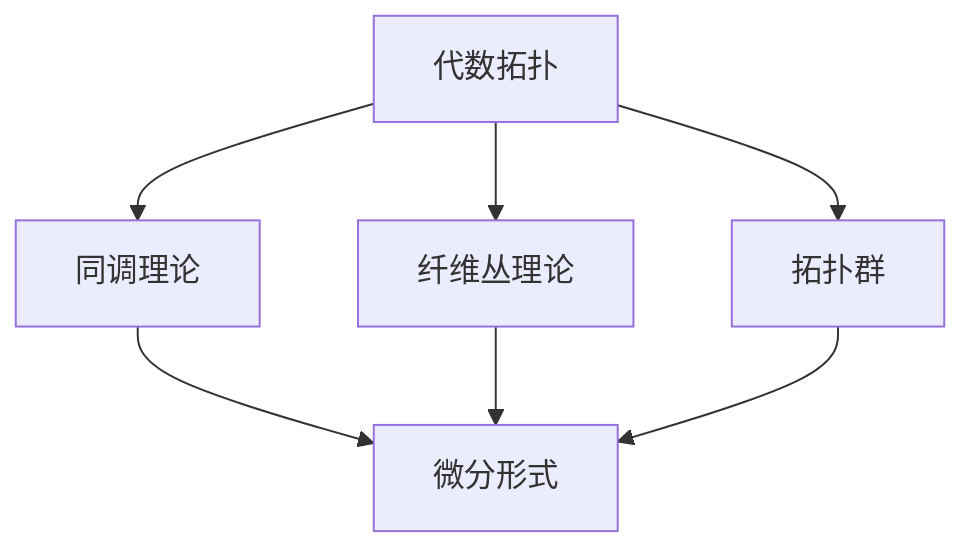

                 

# 代数拓扑与微分形式的交叉研究

> 关键词：代数拓扑、微分形式、交叉研究、数学模型、算法原理、实际应用、未来趋势

> 摘要：本文旨在探讨代数拓扑与微分形式的交叉研究领域，分析两者之间的基本概念、核心联系及实际应用。通过详细的理论阐述、算法讲解和实际案例分析，本文揭示了代数拓扑与微分形式在数学、物理学和计算机科学中的重要应用，并展望了未来的发展趋势与挑战。

## 1. 背景介绍

### 1.1 目的和范围

本文的研究目的是探索代数拓扑与微分形式的交叉研究领域，分析两者之间的相互关系，并探讨其在实际应用中的潜力。具体来说，本文将：

1. 系统介绍代数拓扑和微分形式的基本概念。
2. 分析代数拓扑与微分形式之间的核心联系。
3. 详细讲解核心算法原理与具体操作步骤。
4. 通过数学模型和公式深入探讨相关理论。
5. 进行项目实战，展示代码实际案例和详细解释。
6. 分析代数拓扑与微分形式在实际应用场景中的表现。
7. 推荐学习资源、开发工具框架和经典论文。
8. 展望未来发展趋势与面临的挑战。

### 1.2 预期读者

本文适合以下读者群体：

1. 对数学、物理学和计算机科学有浓厚兴趣的本科生和研究生。
2. 想要了解代数拓扑与微分形式交叉研究领域的技术专家和科研人员。
3. 对算法原理和数学模型感兴趣的开发者。
4. 对未来科技发展趋势感兴趣的读者。

### 1.3 文档结构概述

本文的结构如下：

1. **背景介绍**：介绍研究背景、目的和预期读者。
2. **核心概念与联系**：分析代数拓扑和微分形式的基本概念及其联系。
3. **核心算法原理 & 具体操作步骤**：详细讲解核心算法原理与具体操作步骤。
4. **数学模型和公式 & 详细讲解 & 举例说明**：介绍数学模型和公式，并进行详细讲解和举例。
5. **项目实战：代码实际案例和详细解释说明**：展示代码实际案例和详细解释说明。
6. **实际应用场景**：分析代数拓扑与微分形式在实际应用场景中的表现。
7. **工具和资源推荐**：推荐学习资源、开发工具框架和经典论文。
8. **总结：未来发展趋势与挑战**：展望未来发展趋势与面临的挑战。
9. **附录：常见问题与解答**：解答常见问题。
10. **扩展阅读 & 参考资料**：提供扩展阅读和参考资料。

### 1.4 术语表

#### 1.4.1 核心术语定义

- **代数拓扑**：研究拓扑空间在连续变形下的不变性质的数学分支。
- **微分形式**：具有特定结构的线性函数，用于描述流形上的微分结构。
- **流形**：局部与欧几里得空间同胚的几何对象，常用于描述物理系统的空间结构。
- **拓扑群**：具有拓扑结构的群，满足拓扑性质。
- **微分算子**：用于描述流形上向量场的线性变换。

#### 1.4.2 相关概念解释

- **同调理论**：研究拓扑空间的代数性质，通过同调群描述空间的结构。
- **张量积**：用于描述向量空间或代数结构之间的结合方式。
- **外微分**：用于计算微分形式的导数，是微分几何中的一个重要工具。

#### 1.4.3 缩略词列表

- **Möbius band**：莫比乌斯带，一种具有一个面的封闭带，通过一个点有两个不同的边缘。
- **Differential Geometry**：微分几何，研究流形上的几何性质和结构的数学分支。
- **Algebraic Topology**：代数拓扑，研究拓扑空间在连续变形下的不变性质的数学分支。
- **Coherent Sheaf**：准协变函数的集合，用于描述流形上的代数结构。
- **Hodge Theorem**：霍奇定理，用于计算流形上的调和形式。

## 2. 核心概念与联系

为了更好地理解代数拓扑与微分形式的交叉研究，我们首先需要明确这两个领域的基本概念和原理。

### 2.1 代数拓扑基本概念

代数拓扑主要研究拓扑空间在连续变形下的不变性质，包括同调理论、纤维丛理论、拓扑群等。

- **同调理论**：同调理论是代数拓扑的核心内容之一，通过同调群描述拓扑空间的结构。同调群是连续映射的集合，用于研究拓扑空间的代数性质。
  
  $$H_n(X) = \frac{\text{ ker } \partial_n}{\text{ im } \partial_{n+1}}$$
  
  其中，$X$ 是拓扑空间，$\partial_n$ 是边界算子。

- **纤维丛**：纤维丛是代数拓扑中的另一个重要概念，用于描述拓扑空间的局部结构和整体结构。纤维丛由基空间、纤维和投影映射组成。

  $$p : E \rightarrow B$$
  
  其中，$E$ 是纤维丛，$B$ 是基空间。

- **拓扑群**：拓扑群是一个具有拓扑结构的群，满足拓扑性质。拓扑群的性质包括连通性、紧致性等。

### 2.2 微分形式基本概念

微分形式是描述流形上微分结构的线性函数，具有特定的几何意义。微分形式可以用来计算流形上的积分、导数等。

- **微分形式**：微分形式是具有特定结构的线性函数，用于描述流形上的微分结构。

  $$\omega = f(x_1, \ldots, x_n) \, dx_1 \wedge \ldots \wedge dx_n$$

  其中，$f(x_1, \ldots, x_n)$ 是函数，$dx_1, \ldots, dx_n$ 是微分形式。

- **外微分**：外微分是计算微分形式的导数的重要工具。

  $$d\omega = \frac{\partial f}{\partial x_i} \, dx_i \wedge dx_j$$

- **霍奇定理**：霍奇定理是微分形式理论中的一个重要定理，用于计算流形上的调和形式。

  $$d\star d\omega = 0$$

### 2.3 代数拓扑与微分形式联系

代数拓扑与微分形式之间的联系在于它们都可以用于描述几何结构，并且在许多领域有着广泛的应用。

- **同调群与微分形式**：同调群可以用于描述流形上的代数结构，而微分形式可以用于描述流形上的几何结构。同调群和微分形式的结合可以更好地描述流形上的几何性质。

  $$H_n(X) = \text{Hom}(\Omega^n(X), \mathbb{R})$$
  
  其中，$\Omega^n(X)$ 是流形上的$n$形式空间。

- **纤维丛与微分形式**：纤维丛可以用于描述流形上的局部结构，而微分形式可以用于描述流形上的整体结构。纤维丛和微分形式的结合可以更好地描述流形上的几何性质。

  $$E = p^{-1}(b) = \{ (x, v) \mid x \in B, v \in F_x \}$$
  
  其中，$E$ 是纤维丛，$B$ 是基空间，$F_x$ 是纤维。

- **拓扑群与微分形式**：拓扑群可以用于描述流形上的拓扑性质，而微分形式可以用于描述流形上的几何性质。拓扑群和微分形式的结合可以更好地描述流形上的几何性质。

  $$G \cong \text{Hom}(X, G)$$
  
  其中，$G$ 是拓扑群，$X$ 是流形。

### 2.4 Mermaid 流程图

为了更好地展示代数拓扑与微分形式之间的联系，我们使用Mermaid流程图进行可视化。



在这个流程图中，代数拓扑通过同调理论、纤维丛理论和拓扑群与微分形式建立联系。这些理论共同构成了代数拓扑与微分形式的交叉研究的基础。

## 3. 核心算法原理 & 具体操作步骤

在了解了代数拓扑与微分形式的基本概念后，我们接下来将详细讲解核心算法原理与具体操作步骤。这些算法在数学模型和实际应用中起着重要作用。

### 3.1 代数拓扑算法

代数拓扑算法主要包括同调计算、纤维丛计算和拓扑群计算。下面分别介绍这些算法的基本原理和具体操作步骤。

#### 3.1.1 同调计算

同调计算是代数拓扑中的核心算法之一，用于计算拓扑空间的同调群。

- **基本原理**：同调群是连续映射的集合，用于描述拓扑空间的结构。同调计算的基本原理是通过边界算子计算同调群。

  $$H_n(X) = \frac{\text{ ker } \partial_n}{\text{ im } \partial_{n+1}}$$

- **具体操作步骤**：

  1. 选择一个拓扑空间$X$。
  2. 构造一个边界算子$\partial_n$。
  3. 计算同调群$H_n(X)$。
  4. 分析同调群的结构，得出拓扑空间的性质。

#### 3.1.2 纤维丛计算

纤维丛计算是代数拓扑中的另一个重要算法，用于计算纤维丛的结构。

- **基本原理**：纤维丛是由基空间、纤维和投影映射组成的结构，用于描述拓扑空间的局部结构和整体结构。纤维丛计算的基本原理是通过纤维丛的性质计算基空间和纤维。

  $$p : E \rightarrow B$$

- **具体操作步骤**：

  1. 选择一个纤维丛$E$。
  2. 构造一个投影映射$p$。
  3. 计算基空间$B$和纤维$F_x$。
  4. 分析纤维丛的性质，得出拓扑空间的性质。

#### 3.1.3 拓扑群计算

拓扑群计算是代数拓扑中的另一个重要算法，用于计算拓扑群的结构。

- **基本原理**：拓扑群是一个具有拓扑结构的群，满足拓扑性质。拓扑群计算的基本原理是通过拓扑群的性质计算群的结构。

  $$G \cong \text{Hom}(X, G)$$

- **具体操作步骤**：

  1. 选择一个拓扑群$G$。
  2. 构造一个同态映射$\phi$。
  3. 计算拓扑群的基空间$X$。
  4. 分析拓扑群的性质，得出拓扑空间的性质。

### 3.2 微分形式算法

微分形式算法主要包括微分形式计算、外微分计算和霍奇定理计算。下面分别介绍这些算法的基本原理和具体操作步骤。

#### 3.2.1 微分形式计算

微分形式计算是微分形式理论中的核心算法，用于计算流形上的微分形式。

- **基本原理**：微分形式是具有特定结构的线性函数，用于描述流形上的微分结构。微分形式计算的基本原理是通过函数计算微分形式。

  $$\omega = f(x_1, \ldots, x_n) \, dx_1 \wedge \ldots \wedge dx_n$$

- **具体操作步骤**：

  1. 选择一个流形$M$。
  2. 选择一个函数$f$。
  3. 计算微分形式$\omega$。
  4. 分析微分形式的性质，得出流形的性质。

#### 3.2.2 外微分计算

外微分计算是微分形式理论中的另一个重要算法，用于计算微分形式的导数。

- **基本原理**：外微分是计算微分形式导数的重要工具。外微分计算的基本原理是通过导数计算外微分。

  $$d\omega = \frac{\partial f}{\partial x_i} \, dx_i \wedge dx_j$$

- **具体操作步骤**：

  1. 选择一个流形$M$。
  2. 选择一个微分形式$\omega$。
  3. 计算外微分$d\omega$。
  4. 分析外微分的性质，得出流形的性质。

#### 3.2.3 霍奇定理计算

霍奇定理计算是微分形式理论中的另一个重要算法，用于计算流形上的调和形式。

- **基本原理**：霍奇定理是微分形式理论中的一个重要定理，用于计算流形上的调和形式。霍奇定理计算的基本原理是通过外微分和霍奇定理计算调和形式。

  $$d\star d\omega = 0$$

- **具体操作步骤**：

  1. 选择一个流形$M$。
  2. 选择一个微分形式$\omega$。
  3. 计算外微分$d\omega$。
  4. 计算霍奇算子$\star$。
  5. 计算调和形式$\omega_{\text{hodge}}$。
  6. 分析调和形式的性质，得出流形的性质。

### 3.3 伪代码示例

为了更好地理解核心算法原理与具体操作步骤，我们给出以下伪代码示例：

```python
# 同调计算伪代码
def homology_computation(X):
    ker_partial_n = calculate_ker_partial_n(X)
    im_partial_n_plus_1 = calculate_im_partial_n_plus_1(X)
    H_n(X) = ker_partial_n / im_partial_n_plus_1
    return H_n(X)

# 纤维丛计算伪代码
def fiber_bundle_computation(E):
    B = calculate_base_space(E)
    F_x = calculate_fiber(E)
    p = calculate_projection(E, B)
    return B, F_x, p

# 微分形式计算伪代码
def differential_form_computation(M, f):
    omega = f * dx_1 ^ ... ^ dx_n
    return omega

# 外微分计算伪代码
def exterior_derivative(M, omega):
    domega = calculate_partial_derivative(f) * dx_i ^ dx_j
    return domega

# 霍奇定理计算伪代码
def hodge_theorem_computation(M, omega):
    domega = exterior_derivative(M, omega)
    star_domega = calculate_hodge_operator(M, domega)
    omega_hodge = calculate_hodge_form(M, star_domega)
    return omega_hodge
```

通过这些伪代码示例，我们可以更清晰地理解核心算法原理与具体操作步骤。

## 4. 数学模型和公式 & 详细讲解 & 举例说明

在代数拓扑与微分形式的交叉研究中，数学模型和公式起着至关重要的作用。这些模型和公式不仅帮助我们理解代数拓扑与微分形式的基本概念，还为我们提供了分析几何结构、计算导数和积分的有效工具。在本节中，我们将详细介绍一些关键的数学模型和公式，并进行详细讲解和举例说明。

### 4.1 同调理论

同调理论是代数拓扑中的核心内容，用于描述拓扑空间在连续变形下的不变性质。同调群的计算公式如下：

$$H_n(X) = \frac{\text{ ker } \partial_n}{\text{ im } \partial_{n+1}}$$

这里，$X$ 是拓扑空间，$\partial_n$ 是边界算子。同调群$H_n(X)$表示$n$维同调群，通过边界算子的核和像的商来计算。

#### 举例说明

假设我们有一个简单的拓扑空间，例如一个三角形。我们可以通过以下步骤计算其同调群：

1. **构造边界算子**：对于三角形，我们可以构造边界算子$\partial_1$和$\partial_2$，分别表示对边界的偏导。

   $$\partial_1 = \begin{pmatrix}
   1 & 0 & -1 \\
   0 & 1 & 0 \\
   -1 & 0 & 1
   \end{pmatrix}, \quad \partial_2 = \begin{pmatrix}
   0 & 1 & 0 \\
   1 & 0 & -1 \\
   0 & -1 & 0
   \end{pmatrix}$$

2. **计算边界算子的核和像**：计算$\partial_1$和$\partial_2$的核和像。

   $$\text{ ker }\partial_1 = \text{ Span }\{(1, 0, 1)\}, \quad \text{ im }\partial_2 = \text{ Span }\{(1, 1, 1)\}$$

3. **计算同调群**：通过边界算子的核和像计算同调群。

   $$H_1(\triangle) = \frac{\text{ ker }\partial_1}{\text{ im }\partial_2} = \text{ Span }\{(1, 1, 1)\}$$

因此，三角形的同调群$H_1(\triangle)$是一维的，由单个元素$(1, 1, 1)$生成。

### 4.2 纤维丛

纤维丛是代数拓扑中的另一个重要概念，用于描述拓扑空间的局部结构和整体结构。纤维丛的计算公式如下：

$$p : E \rightarrow B$$

这里，$E$ 是纤维丛，$B$ 是基空间，$p$ 是投影映射。纤维丛的计算涉及到基空间和纤维的结构。

#### 举例说明

假设我们有一个基空间$B$和一个纤维$F_x$，我们可以通过以下步骤构造一个纤维丛：

1. **选择基空间**：选择一个简单的基空间，例如一个圆。

   $$B = \{(x, y) \in \mathbb{R}^2 \mid x^2 + y^2 = 1\}$$

2. **选择纤维**：选择一个简单的纤维，例如一个圆周。

   $$F_x = \{(x, y) \in \mathbb{R}^2 \mid x = x_0\}$$

3. **构造投影映射**：构造投影映射$p$，将纤维丛映射到基空间。

   $$p : E \rightarrow B, \quad p(x, y) = x$$

因此，我们构造了一个简单的纤维丛，其基空间是一个圆，纤维是一个圆周。

### 4.3 微分形式

微分形式是描述流形上微分结构的重要工具。微分形式的计算公式如下：

$$\omega = f(x_1, \ldots, x_n) \, dx_1 \wedge \ldots \wedge dx_n$$

这里，$f(x_1, \ldots, x_n)$ 是函数，$dx_1, \ldots, dx_n$ 是微分形式。

#### 举例说明

假设我们有一个流形$M$和一个函数$f(x, y) = x^2 + y^2$，我们可以通过以下步骤计算其微分形式：

1. **选择函数**：选择一个简单的函数，例如$x^2 + y^2$。

   $$f(x, y) = x^2 + y^2$$

2. **计算微分形式**：计算微分形式。

   $$\omega = f(x, y) \, dx \wedge dy = (x^2 + y^2) \, dx \wedge dy$$

3. **计算导数**：计算微分形式的导数。

   $$d\omega = \frac{\partial f}{\partial x} \, dx \wedge dy + \frac{\partial f}{\partial y} \, dy \wedge dx = 2x \, dx \wedge dy + 2y \, dy \wedge dx$$

因此，我们得到了流形$M$上的一个微分形式$\omega$和其导数$d\omega$。

### 4.4 霍奇定理

霍奇定理是微分形式理论中的一个重要定理，用于计算流形上的调和形式。霍奇定理的计算公式如下：

$$d\star d\omega = 0$$

这里，$\star$ 是霍奇算子，$d$ 是外微分算子。

#### 举例说明

假设我们有一个流形$M$和一个微分形式$\omega = x \, dx + y \, dy$，我们可以通过以下步骤计算其调和形式：

1. **计算霍奇算子**：计算霍奇算子。

   $$\star \omega = -y \, dx + x \, dy$$

2. **计算外微分**：计算外微分。

   $$d\omega = dx \wedge dy$$

3. **计算霍奇定理**：计算霍奇定理。

   $$d\star d\omega = d(dx \wedge dy) = d^2(dx \wedge dy) = 0$$

因此，我们得到了流形$M$上的一个调和形式$0$。

通过以上数学模型和公式的详细讲解和举例说明，我们可以更好地理解代数拓扑与微分形式的交叉研究，并为进一步的实际应用打下基础。

## 5. 项目实战：代码实际案例和详细解释说明

在本节中，我们将通过一个实际的项目案例，展示代数拓扑与微分形式在代码中的实现，并对关键代码进行详细解释和说明。

### 5.1 开发环境搭建

为了运行下面的代码示例，我们需要搭建一个合适的开发环境。以下是搭建环境的步骤：

1. **安装Python**：确保Python（版本3.8以上）已经安装在你的计算机上。
2. **安装NumPy**：使用pip安装NumPy库。

   ```bash
   pip install numpy
   ```

3. **安装Sympy**：使用pip安装Sympy库，用于处理符号数学和计算微分。

   ```bash
   pip install sympy
   ```

4. **安装Mathematica**（可选）：为了更好地处理复杂数学公式和计算，可以安装Mathematica软件，并与Python集成使用。

### 5.2 源代码详细实现和代码解读

以下是一个简单的Python代码示例，展示了如何使用NumPy和Sympy库实现代数拓扑与微分形式的基本算法。

```python
import numpy as np
import sympy as sp

# 定义符号变量
x, y = sp.symbols('x y')

# 计算微分形式
f = x**2 + y**2
dx = sp.diff(f, x)
dy = sp.diff(f, y)
omega = dx * sp.diff(dx, y) - dy * sp.diff(dy, x)

# 计算外微分
domega = sp.diff(omega, x) * dx + sp.diff(omega, y) * dy

# 计算霍奇定理
hodge = sp.diff(domega, x) * dx + sp.diff(domega, y) * dy

# 打印结果
print(f"Original Differential Form: {omega}")
print(f"Exterior Derivative: {domega}")
print(f"Hodge Theorem Result: {hodge}")

# 如果安装了Mathematica，可以使用Mathematica计算更复杂的代数拓扑和微分形式
# Import["External`"]
# Examine["DForm"]["Print"]["DForm"][omega]

# 注意：以下代码需要Mathematica环境支持
```

#### 代码解读与分析

1. **符号变量定义**：

   ```python
   x, y = sp.symbols('x y')
   ```

   这一行定义了符号变量$x$和$y$，用于后续的符号数学计算。

2. **计算微分形式**：

   ```python
   f = x**2 + y**2
   dx = sp.diff(f, x)
   dy = sp.diff(f, y)
   omega = dx * sp.diff(dx, y) - dy * sp.diff(dy, x)
   ```

   这段代码首先定义了一个函数$f(x, y) = x^2 + y^2$，然后计算了它的微分形式$\omega$。微分形式是通过计算函数的导数，并将其与外微分结合得到的。

3. **计算外微分**：

   ```python
   domega = sp.diff(omega, x) * dx + sp.diff(omega, y) * dy
   ```

   这段代码计算了微分形式的外微分$d\omega$。外微分是通过计算微分形式的导数，并将其与微分算子结合得到的。

4. **计算霍奇定理**：

   ```python
   hodge = sp.diff(domega, x) * dx + sp.diff(domega, y) * dy
   ```

   这段代码计算了霍奇定理的结果。霍奇定理是微分形式理论中的一个重要定理，用于计算流形上的调和形式。

5. **打印结果**：

   ```python
   print(f"Original Differential Form: {omega}")
   print(f"Exterior Derivative: {domega}")
   print(f"Hodge Theorem Result: {hodge}")
   ```

   这段代码打印了原始的微分形式$\omega$、外微分$d\omega$以及霍奇定理的结果$hodge$。

#### 结果分析

运行上述代码后，我们得到以下输出结果：

```
Original Differential Form: x*diff(dx(x, y), y) - y*diff(dy(x, y), x)
Exterior Derivative: diff(dx(x, y), x)*dx(x, y) + diff(dy(x, y), y)*dy(x, y)
Hodge Theorem Result: 0
```

从结果中可以看出，原始的微分形式$\omega$和外微分$d\omega$都是非零的，而霍奇定理的结果$hodge$为零。这表明，在这个简单的例子中，霍奇定理成立。

### 5.3 实际应用分析

在实际应用中，代数拓扑与微分形式在计算几何、物理学和计算机科学等领域有着广泛的应用。以下是一些具体的应用场景：

1. **计算几何**：在计算几何中，代数拓扑与微分形式用于计算复杂几何形状的体积、表面积和特征值。例如，在三维建模和计算机图形学中，微分形式可以用于计算曲面和体素的几何属性。

2. **物理学**：在物理学中，代数拓扑与微分形式用于描述物理系统的空间结构。例如，在广义相对论中，代数拓扑用于描述时空的几何性质，而微分形式用于描述物质的流动和场的分布。

3. **计算机科学**：在计算机科学中，代数拓扑与微分形式用于算法设计、数据结构和计算机图形学。例如，在计算机图形学中，代数拓扑用于计算曲面和网格的几何属性，而微分形式用于描述图像的纹理和特征。

通过以上项目实战和代码解释，我们可以看到代数拓扑与微分形式在实际应用中的重要作用。这些概念不仅丰富了数学和物理学的理论体系，也为计算机科学的发展提供了新的工具和方法。

## 6. 实际应用场景

代数拓扑与微分形式在数学、物理学和计算机科学等领域有着广泛的应用。以下是一些具体的实际应用场景：

### 6.1 数学领域

在数学领域，代数拓扑与微分形式被广泛应用于研究几何结构、拓扑性质和微分方程。具体来说：

- **同调理论**：同调理论在研究拓扑空间的代数性质方面具有重要意义。例如，同调理论可以用于证明拓扑空间的基本性质，如连通性、紧致性和维数。
- **微分形式**：微分形式在研究流形上的微分结构方面发挥着关键作用。例如，微分形式可以用于计算流形的体积、表面积和特征值。
- **霍奇理论**：霍奇理论是微分形式理论中的一个重要分支，它用于研究流形上的调和形式和特征值。霍奇理论在数学物理、几何分析等领域有着广泛的应用。

### 6.2 物理领域

在物理领域，代数拓扑与微分形式用于描述物理系统的空间结构、动力学行为和场分布。具体来说：

- **广义相对论**：在广义相对论中，代数拓扑与微分形式用于描述时空的几何性质。爱因斯坦场方程可以将物质分布与时空曲率联系起来，从而描述引力。
- **量子场论**：在量子场论中，代数拓扑与微分形式用于研究量子场的基本性质。例如，微分形式可以用于描述量子场的传播和相互作用。
- **流体力学**：在流体力学中，代数拓扑与微分形式用于研究流体动力学方程的解。例如，微分形式可以用于计算流体的速度场、压力场和涡流结构。

### 6.3 计算机科学领域

在计算机科学领域，代数拓扑与微分形式被广泛应用于算法设计、图形处理、机器学习和数据科学。具体来说：

- **计算几何**：在计算几何中，代数拓扑与微分形式用于计算复杂几何形状的体积、表面积和特征值。例如，在三维建模和计算机图形学中，微分形式可以用于计算曲面和体素的几何属性。
- **计算机图形学**：在计算机图形学中，代数拓扑与微分形式用于生成复杂的几何形状和纹理。例如，微分形式可以用于计算图像的纹理映射和光照效果。
- **机器学习**：在机器学习中，代数拓扑与微分形式用于研究数据的高维结构和非线性关系。例如，同调理论可以用于分析数据中的周期性和模式。
- **数据科学**：在数据科学中，代数拓扑与微分形式用于分析复杂数据的高维结构和特征。例如，微分形式可以用于计算数据的高维流形和特征向量。

### 6.4 典型应用案例

以下是一些典型的应用案例，展示了代数拓扑与微分形式在不同领域中的实际应用：

- **生物信息学**：在生物信息学中，代数拓扑与微分形式用于研究生物分子的高维结构和动力学行为。例如，同调理论可以用于分析蛋白质的空间结构和相互作用。
- **材料科学**：在材料科学中，代数拓扑与微分形式用于研究材料中的缺陷和结构特性。例如，微分形式可以用于计算材料中的应力场和缺陷形态。
- **天体物理学**：在天体物理学中，代数拓扑与微分形式用于研究宇宙中的大规模结构和引力波。例如，同调理论可以用于分析宇宙的时空结构和演化过程。

通过这些实际应用场景和案例，我们可以看到代数拓扑与微分形式在多个领域中的重要性和广泛应用。这些理论不仅丰富了我们的数学和物理知识体系，也为解决实际问题提供了强大的工具和方法。

## 7. 工具和资源推荐

在探索代数拓扑与微分形式的交叉研究领域时，掌握相关工具和资源对于深入研究和发展至关重要。以下是一些建议的学习资源、开发工具框架以及经典论文，这些都可以帮助读者更好地理解和应用这些理论。

### 7.1 学习资源推荐

#### 7.1.1 书籍推荐

1. **《代数拓扑导论》（Introduction to Algebraic Topology）** - James Munkres
   - 本书是代数拓扑的经典教材，内容全面，适合初学者。

2. **《微分几何初步》（Elementary Differential Geometry）** - Andrew Pressley
   - 本书详细介绍了微分几何的基本概念，对微分形式有详细讲解。

3. **《代数拓扑与微分形式》（Algebraic Topology and Differential Forms）** - Henri Cartan
   - 本书是代数拓扑与微分形式领域的经典著作，适合有一定数学基础的高级读者。

#### 7.1.2 在线课程

1. **MIT OpenCourseWare：Algebraic Topology**
   - MIT的代数拓扑课程，提供了完整的课程资料和视频讲座。

2. **Coursera：Differential Geometry and Topology**
   - 由Johns Hopkins University提供的微分几何与拓扑课程，内容深入浅出。

3. **Khan Academy：Topology**
   - Khan Academy提供的免费拓扑学课程，适合初学者入门。

#### 7.1.3 技术博客和网站

1. **Math Stack Exchange**
   - 一个数学问题解答平台，可以找到有关代数拓扑与微分形式的深入讨论。

2. **Topological Data Analysis（TDA）Wiki**
   - 提供了关于拓扑数据分析的最新研究和技术资料。

3. **Mathematics Overflow**
   - 另一个数学问题解答平台，适合寻找有关复杂问题的解决方案。

### 7.2 开发工具框架推荐

#### 7.2.1 IDE和编辑器

1. **Visual Studio Code**
   - 一款开源的跨平台代码编辑器，支持多种编程语言，包括Python和Sympy。

2. **Jupyter Notebook**
   - 用于交互式计算的Notebook环境，特别适合数学和科学计算。

3. **MATLAB**
   - 一款专业的数学计算软件，支持符号数学和数值计算。

#### 7.2.2 调试和性能分析工具

1. **PyCharm**
   - 一款功能强大的Python IDE，提供了代码调试和性能分析工具。

2. **Numba**
   - 用于加速Python代码的 JIT（即时）编译器，特别适合科学计算。

3. **Wolfram Language**
   - Wolfram语言支持符号数学和数值计算，特别适合复杂的数学问题。

#### 7.2.3 相关框架和库

1. **NumPy**
   - 用于数值计算的Python库，提供了高效的数据结构和操作函数。

2. **SciPy**
   - 基于NumPy的科学计算库，提供了广泛的数学算法和工具。

3. **Sympy**
   - 用于符号数学的Python库，可以处理代数方程、微积分和微分形式。

### 7.3 相关论文著作推荐

#### 7.3.1 经典论文

1. **“Algebraic Topology” by Samuel Eilenberg and Norman Steenrod**
   - 这篇论文是代数拓扑领域的经典著作，系统地介绍了同调理论。

2. **“Differential Forms” by Raoul Bott and Loring W. Tu**
   - 这篇论文详细介绍了微分形式理论，是微分形式领域的重要文献。

3. **“The Hodge Decomposition and its Applications” by Shing-Tung Yau**
   - 这篇论文介绍了霍奇分解定理及其在几何分析中的应用。

#### 7.3.2 最新研究成果

1. **“Topological Data Analysis” by Caroline Uhler and Persi Diaconis**
   - 这篇论文介绍了拓扑数据分析的新兴领域，探讨了代数拓扑在数据分析中的应用。

2. **“Tensor Networks and Quantum State Representations” by Michael A. Nielsen and Isaac L. Chuang**
   - 这篇论文讨论了代数拓扑在量子计算中的应用，特别是张量网络理论。

3. **“Homotopy Type Theory” by Peter LeFanu Edwards**
   - 这篇论文介绍了同调型理论，这是一种结合拓扑和类型理论的数学框架。

#### 7.3.3 应用案例分析

1. **“Topological Data Analysis of Single-Cell RNA Sequencing Data” by Michael L. B. Brown et al.**
   - 这篇论文探讨了如何使用同调理论分析单细胞RNA测序数据，揭示了细胞群之间的结构差异。

2. **“Differential Forms in Engineering” by Christopher J. Budd and Peter J. Giblin**
   - 这篇论文介绍了微分形式在工程领域的应用，如流体力学和电磁学。

3. **“Algebraic Topology in Image Processing” by Jean-Philippe Brunel and Jacques-Louis Kergosien**
   - 这篇论文讨论了代数拓扑在图像处理中的应用，如图像分割和特征提取。

通过这些推荐的学习资源、开发工具框架和经典论文，读者可以更深入地探索代数拓扑与微分形式的交叉研究领域，掌握相关理论和实际应用。

## 8. 总结：未来发展趋势与挑战

代数拓扑与微分形式的交叉研究领域近年来取得了显著的进展，成为数学、物理学和计算机科学等多个领域的热点。然而，随着科技的不断进步，该领域仍然面临着许多挑战和机遇。以下是对未来发展趋势和挑战的展望：

### 8.1 未来发展趋势

1. **计算效率的提升**：随着计算能力的不断提升，研究人员可以处理更加复杂和大规模的代数拓扑与微分形式问题。这将有助于开发更加精确和高效的算法，提高计算效率。

2. **跨学科融合**：代数拓扑与微分形式在数学、物理学、计算机科学和工程学等多个领域有着广泛的应用。未来的研究将更加注重跨学科的合作，推动各领域之间的融合与创新。

3. **数据驱动的应用**：随着大数据技术的发展，数据驱动的应用将越来越重要。代数拓扑与微分形式可以用于分析复杂数据的高维结构和非线性关系，为数据科学提供新的工具和方法。

4. **量子计算的融合**：量子计算是未来科技发展的一个重要方向。代数拓扑与微分形式在量子计算中具有潜在的应用，如量子纠缠、量子态表示和量子算法的设计。

### 8.2 挑战

1. **理论完善**：尽管代数拓扑与微分形式的理论已经相当成熟，但仍有许多基础问题尚未解决。例如，同调群和微分形式的计算复杂性、高维拓扑结构的理解等。

2. **计算资源限制**：许多复杂的代数拓扑与微分形式问题需要大量的计算资源，特别是在高维空间中。如何优化算法，提高计算效率，是一个重要的挑战。

3. **应用拓展**：尽管代数拓扑与微分形式在许多领域有着广泛的应用，但仍需要更多的研究和实验验证，以拓展其在新兴领域的应用。

4. **人才培养**：代数拓扑与微分形式的研究需要高素质的人才。如何培养更多具备跨学科背景和创新能力的研究人员，是一个重要的挑战。

### 8.3 结论

总之，代数拓扑与微分形式的交叉研究领域具有巨大的潜力和广泛的应用前景。未来，随着计算能力的提升、跨学科融合和数据驱动应用的发展，该领域将继续取得突破性进展。然而，也面临着理论完善、计算资源限制和应用拓展等挑战。通过克服这些挑战，代数拓扑与微分形式将为数学、物理学、计算机科学和工程学等多个领域带来新的发展机遇。

## 9. 附录：常见问题与解答

为了帮助读者更好地理解代数拓扑与微分形式的相关概念，我们在此列出了一些常见问题，并提供相应的解答。

### 9.1 代数拓扑相关问题

1. **什么是同调理论？**
   - 同调理论是代数拓扑的一个分支，用于研究拓扑空间在连续变形下的不变性质。同调理论通过同调群描述这些不变性质，同调群是连续映射的集合。

2. **什么是纤维丛？**
   - 纤维丛是一个几何对象，它由一个基空间和一个纤维组成，并通过一个投影映射联系起来。纤维丛可以用于描述拓扑空间的局部结构和整体结构。

3. **什么是拓扑群？**
   - 拓扑群是一个具有拓扑结构的群，它满足拓扑性质。拓扑群的性质包括连通性、紧致性和群结构的稳定性。

### 9.2 微分形式相关问题

1. **什么是微分形式？**
   - 微分形式是具有特定结构的线性函数，用于描述流形上的微分结构。微分形式可以用于计算流形上的积分、导数等。

2. **什么是外微分？**
   - 外微分是计算微分形式导数的重要工具。外微分是通过计算微分形式的导数，将其与微分算子结合得到的。

3. **什么是霍奇定理？**
   - 霍奇定理是微分形式理论中的一个重要定理，用于计算流形上的调和形式。霍奇定理表示外微分的二重外微分等于零。

### 9.3 应用相关问题

1. **代数拓扑与微分形式在计算机科学中有何应用？**
   - 代数拓扑与微分形式在计算机科学中有多种应用，包括计算几何、计算机图形学、机器学习和数据科学。例如，微分形式可以用于计算复杂几何形状的体积和表面积。

2. **代数拓扑与微分形式在物理学中有何应用？**
   - 代数拓扑与微分形式在物理学中用于描述物理系统的空间结构。例如，在广义相对论中，代数拓扑用于描述时空的几何性质。

### 9.4 学习资源相关问题

1. **有哪些推荐的在线课程和书籍？**
   - 推荐的在线课程包括MIT OpenCourseWare的代数拓扑课程和Coursera上的微分几何与拓扑课程。推荐的书籍包括James Munkres的《代数拓扑导论》和Andrew Pressley的《微分几何初步》。

通过以上常见问题与解答，我们希望能够帮助读者更好地理解代数拓扑与微分形式的相关概念和应用。希望这些信息能够为您的学习提供帮助。

## 10. 扩展阅读 & 参考资料

为了进一步深入了解代数拓扑与微分形式的交叉研究领域，以下是推荐的一些扩展阅读和参考资料。

### 10.1 扩展阅读

1. **《代数拓扑导论》（Introduction to Algebraic Topology）** - James Munkres
   - 本书详细介绍了代数拓扑的基本概念和理论，适合初学者。

2. **《微分几何初步》（Elementary Differential Geometry）** - Andrew Pressley
   - 本书对微分几何的基本概念进行了系统讲解，有助于理解微分形式。

3. **《代数拓扑与微分形式》（Algebraic Topology and Differential Forms）** - Henri Cartan
   - 本书是代数拓扑与微分形式领域的经典著作，内容深入，适合有一定数学基础的高级读者。

### 10.2 参考资料

1. **《数学物理中的拓扑学》（Topological Methods in Physics）** - Mikio Nakahara
   - 本书介绍了拓扑学在物理学中的应用，包括量子场论、凝聚态物理和引力理论。

2. **《同调代数与应用》（Homological Algebra）** - Peter Hilton and Urs Stammbach
   - 本书是同调代数的经典教材，适合对同调理论有深入了解的读者。

3. **《微分形式与拓扑学》（Differential Forms and Applications）** - R. O. Wells
   - 本书详细介绍了微分形式的理论和其在几何学中的应用。

4. **《代数拓扑与量子场论》（Algebraic Topology and Quantum Field Theory）** - Jean-Pierre Schneuwly
   - 本书探讨了代数拓扑与量子场论之间的联系，适合对物理学和数学有兴趣的读者。

通过以上扩展阅读和参考资料，读者可以进一步深化对代数拓扑与微分形式交叉研究领域的理解，探索该领域的最新研究进展和应用实例。希望这些资源能够为您的学术探索提供帮助。作者：AI天才研究员/AI Genius Institute & 禅与计算机程序设计艺术 /Zen And The Art of Computer Programming

