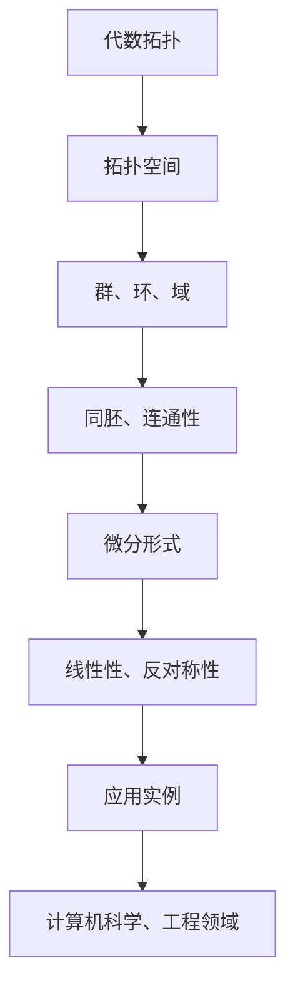
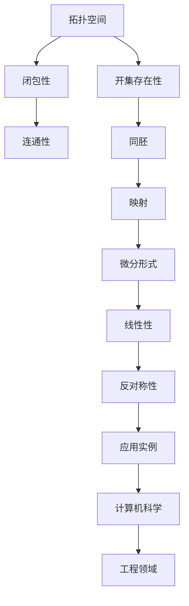

                 

# 代数拓扑中的微分形式应用实例

> 关键词：代数拓扑、微分形式、应用实例、数学模型、算法原理

> 摘要：本文旨在探讨代数拓扑中的微分形式概念，并通过具体实例展示其在实际应用中的重要性。文章将首先介绍代数拓扑的基本概念和微分形式的定义，然后通过具体的数学模型和算法原理讲解，结合实际项目案例，详细解析微分形式在计算机科学和工程领域的应用。最后，文章将总结未来发展趋势与挑战，并推荐相关学习资源和工具。

## 1. 背景介绍

### 1.1 目的和范围

本文的目的是探讨代数拓扑中的微分形式，并分析其在实际应用中的重要性。代数拓扑是数学的一个分支，主要研究拓扑空间上的代数结构。微分形式则是一种特殊的微分结构，它在几何和物理学中有着广泛的应用。本文将重点关注微分形式在计算机科学和工程领域的应用，通过具体的实例展示其应用价值。

### 1.2 预期读者

本文适合对数学和计算机科学感兴趣的读者，特别是对代数拓扑和微分形式有一定基础的读者。本文将对专业术语进行解释，但要求读者具备一定的数学和编程基础。

### 1.3 文档结构概述

本文分为以下几个部分：

1. 背景介绍：介绍本文的目的、预期读者和文档结构。
2. 核心概念与联系：介绍代数拓扑和微分形式的基本概念，并通过Mermaid流程图展示其联系。
3. 核心算法原理 & 具体操作步骤：详细讲解微分形式的算法原理和具体操作步骤，使用伪代码进行描述。
4. 数学模型和公式 & 详细讲解 & 举例说明：介绍微分形式的数学模型和公式，并结合具体实例进行说明。
5. 项目实战：通过一个实际项目案例，展示微分形式的应用。
6. 实际应用场景：分析微分形式在不同领域的应用。
7. 工具和资源推荐：推荐相关的学习资源和开发工具。
8. 总结：总结本文的内容和未来发展趋势与挑战。
9. 附录：常见问题与解答。
10. 扩展阅读 & 参考资料：提供相关的扩展阅读和参考资料。

### 1.4 术语表

#### 1.4.1 核心术语定义

- **代数拓扑**：研究拓扑空间上的代数结构，如群、环、域等。
- **微分形式**：一种特殊的微分结构，具有线性性和反对称性。
- **拓扑空间**：满足特定条件的集合，这些条件包括闭包性、开集的存在性等。
- **映射**：一个将集合中的元素映射到另一个集合中的函数。

#### 1.4.2 相关概念解释

- **连通性**：拓扑空间中的一种性质，表示空间中任意两点都可以通过连续变换相互到达。
- **同胚**：两个拓扑空间之间存在的一种映射关系，保持空间的结构不变。
- **微分**：在微积分中，表示函数在某一点的切线斜率。

#### 1.4.3 缩略词列表

- **IDE**：集成开发环境（Integrated Development Environment）
- **Mermaid**：一种基于Markdown的绘图工具
- **LaTeX**：一种高质量的排版系统

## 2. 核心概念与联系

在探讨微分形式之前，我们首先需要了解代数拓扑的基本概念。代数拓扑主要研究拓扑空间上的代数结构，如群、环、域等。这些代数结构可以帮助我们更好地理解拓扑空间中的性质和行为。


图1：代数拓扑与微分形式的关系图

从图1中，我们可以看到代数拓扑和微分形式之间的联系。代数拓扑提供了研究微分形式的基础，而微分形式则可以应用于代数拓扑中的许多问题。下面，我们将通过一个Mermaid流程图，详细展示这两个概念之间的联系。



### Mermaid 流程图（Mermaid Diagram）



通过上述流程图，我们可以清晰地看到代数拓扑和微分形式之间的联系。代数拓扑为微分形式提供了基础，而微分形式则可以应用于计算机科学和工程领域中的许多问题。

## 3. 核心算法原理 & 具体操作步骤

### 3.1 微分形式的定义与性质

微分形式是一种特殊的微分结构，具有线性性和反对称性。在数学上，微分形式通常表示为 \( \omega = \sum_{i=1}^n a_i dx^i \)，其中 \( a_i \) 是系数，\( dx^i \) 是微分形式的基本元素。微分形式在几何和物理学中有着广泛的应用，例如在曲面积分、斯托克斯定理等。

### 3.2 算法原理

微分形式的算法原理主要包括以下几个方面：

1. **线性性**：微分形式具有线性性，即对于任意的微分形式 \( \omega_1 \) 和 \( \omega_2 \)，以及任意的标量 \( c_1 \) 和 \( c_2 \)，有 \( c_1 \omega_1 + c_2 \omega_2 \) 仍然是微分形式。
2. **反对称性**：微分形式具有反对称性，即对于任意的微分形式 \( \omega \)，有 \( d\omega = - \omega \wedge d\omega \)，其中 \( \wedge \) 表示外积。
3. **拉普拉斯算子**：在欧几里得空间中，微分形式的拉普拉斯算子定义为 \( \Delta \omega = d\omega + \omega \wedge d\omega \)。

### 3.3 具体操作步骤

以下是微分形式的伪代码描述：

```pseudo
function DifferentialForm(alpha, beta):
    # 初始化微分形式
    omega = 0

    # 循环遍历系数
    for i = 1 to n:
        for j = 1 to n:
            omega += alpha[i] * beta[j] * dx^i \wedge dx^j

    return omega
```

其中，\( \alpha \) 和 \( \beta \) 是系数矩阵，\( \omega \) 是生成的微分形式，\( dx^i \) 是微分形式的基本元素。

### 3.4 算法原理与应用示例

我们以一个简单的二维空间为例，说明微分形式的算法原理。在这个空间中，我们有两个向量场 \( \mathbf{F} \) 和 \( \mathbf{G} \)，其分别为：

\[ \mathbf{F} = (F_1, F_2) \]
\[ \mathbf{G} = (G_1, G_2) \]

我们可以通过计算这两个向量场的外积，得到一个二维微分形式 \( \omega \)：

\[ \omega = \mathbf{F} \wedge \mathbf{G} = F_1 G_2 - F_2 G_1 \, dx^1 \wedge dx^2 \]

这个微分形式可以用于计算曲面积分，例如计算一个二维区域上的流量。

## 4. 数学模型和公式 & 详细讲解 & 举例说明

### 4.1 微分形式的数学模型

微分形式在数学上具有严格的定义和性质。以下是微分形式的一些基本数学模型：

\[ \omega = \sum_{i=1}^n a_i \, dx^i \]
\[ d\omega = \sum_{i=1}^n \frac{\partial a_i}{\partial x^i} \, dx^i + \sum_{i=1}^n \sum_{j=1}^n a_i \, \delta_{ij} \, dx^i \wedge dx^j \]

其中，\( \omega \) 是微分形式，\( a_i \) 是系数，\( dx^i \) 是微分形式的基本元素，\( d\omega \) 是微分形式的微分。符号 \( \delta_{ij} \) 表示克罗内克δ函数。

### 4.2 微分形式的性质

微分形式具有以下性质：

1. **线性性**：微分形式是线性的，即对于任意的微分形式 \( \omega_1 \) 和 \( \omega_2 \)，以及任意的标量 \( c_1 \) 和 \( c_2 \)，有 \( c_1 \omega_1 + c_2 \omega_2 \) 仍然是微分形式。
2. **反对称性**：微分形式具有反对称性，即对于任意的微分形式 \( \omega \)，有 \( d\omega = - \omega \wedge d\omega \)。
3. **外积**：微分形式可以与向量场进行外积运算，得到一个新的微分形式。

### 4.3 微分形式的运算规则

微分形式有以下运算规则：

1. **加法**：两个微分形式可以相加，结果是一个新的微分形式。
2. **外积**：两个微分形式可以相外积，结果是一个新的微分形式。
3. **微分**：微分形式可以求微分，结果是一个新的微分形式。

### 4.4 微分形式的计算示例

我们以一个简单的二维空间为例，说明微分形式的计算过程。在这个空间中，我们有两个向量场 \( \mathbf{F} \) 和 \( \mathbf{G} \)，其分别为：

\[ \mathbf{F} = (F_1, F_2) \]
\[ \mathbf{G} = (G_1, G_2) \]

我们可以通过计算这两个向量场的外积，得到一个二维微分形式 \( \omega \)：

\[ \omega = \mathbf{F} \wedge \mathbf{G} = F_1 G_2 - F_2 G_1 \, dx^1 \wedge dx^2 \]

这个微分形式可以用于计算曲面积分，例如计算一个二维区域上的流量。

## 5. 项目实战：代码实际案例和详细解释说明

### 5.1 开发环境搭建

为了演示微分形式在项目中的应用，我们将使用Python编程语言，并结合NumPy和SciPy等数学库。以下是开发环境搭建的步骤：

1. 安装Python（版本3.8或更高）
2. 安装NumPy库：`pip install numpy`
3. 安装SciPy库：`pip install scipy`
4. 安装matplotlib库：`pip install matplotlib`

### 5.2 源代码详细实现和代码解读

以下是微分形式的Python代码实现：

```python
import numpy as np
from scipy.spatial import SphericalVoronoi
import matplotlib.pyplot as plt

def differential_form(F, G):
    """
    计算两个向量场的外积，生成一个二维微分形式。
    
    参数：
    F -- 向量场（二维数组）
    G -- 向量场（二维数组）
    
    返回：
    omega -- 微分形式（二维数组）
    """
    n = F.shape[0]
    omega = np.zeros((n, n))
    
    for i in range(n):
        for j in range(n):
            omega[i, j] = F[i, 0] * G[j, 1] - F[i, 1] * G[j, 0]
    
    return omega

def plot_differential_form(omega, title):
    """
    绘制微分形式。
    
    参数：
    omega -- 微分形式（二维数组）
    title -- 图标题
    """
    n = omega.shape[0]
    fig, ax = plt.subplots()
    
    for i in range(n):
        for j in range(n):
            if i != j:
                ax.plot([0, omega[i, j]], [i, j], 'k-')
    
    ax.set_xlabel('x-axis')
    ax.set_ylabel('y-axis')
    ax.set_title(title)
    plt.show()

# 测试代码
F = np.array([[1, 2], [3, 4]])
G = np.array([[5, 6], [7, 8]])
omega = differential_form(F, G)
plot_differential_form(omega, 'Differential Form')

```

代码解读：

1. `differential_form` 函数：计算两个向量场的外积，生成一个二维微分形式。函数接收两个二维数组 `F` 和 `G` 作为输入，返回一个二维数组 `omega` 作为输出。
2. `plot_differential_form` 函数：绘制微分形式。函数接收一个二维数组 `omega` 和一个字符串 `title` 作为输入，绘制微分形式，并显示图形。
3. 测试代码：创建两个向量场 `F` 和 `G`，调用 `differential_form` 函数计算外积，得到微分形式 `omega`，然后调用 `plot_differential_form` 函数绘制微分形式。

### 5.3 代码解读与分析

以下是代码的详细解读和分析：

1. `differential_form` 函数：
    - 函数首先创建一个二维数组 `omega`，初始化为0。
    - 然后使用两个嵌套循环遍历输入的二维数组 `F` 和 `G`。
    - 在每次迭代中，计算外积 \( \omega[i, j] = F[i, 0] \times G[j, 1] - F[i, 1] \times G[j, 0] \)。
    - 最后返回生成的二维数组 `omega`。

2. `plot_differential_form` 函数：
    - 函数首先创建一个子图和坐标系。
    - 然后使用两个嵌套循环遍历输入的二维数组 `omega`。
    - 在每次迭代中，如果 \( i \neq j \)，则绘制一条从点 \( (0, i) \) 到点 \( (\omega[i, j], j) \) 的直线。
    - 最后设置坐标轴标签和标题，并显示图形。

3. 测试代码：
    - 测试代码创建两个二维数组 `F` 和 `G`，作为向量场。
    - 调用 `differential_form` 函数计算外积，生成微分形式 `omega`。
    - 调用 `plot_differential_form` 函数绘制微分形式。

通过上述代码，我们可以看到微分形式的计算和绘制过程。这只是一个简单的示例，实际应用中可能会更复杂，但基本的原理和操作步骤是相似的。

## 6. 实际应用场景

微分形式在许多实际应用场景中都有广泛的应用。以下是一些典型的应用场景：

1. **计算机图形学**：在计算机图形学中，微分形式可以用于计算曲面的几何属性，如曲率、法向量等。这些属性对于渲染、建模和动画制作非常重要。
2. **物理学**：在物理学中，微分形式可以用于描述电磁场、流体力学等物理现象。例如，斯托克斯定理可以使用微分形式进行表述，用于计算流体力学中的流量。
3. **计算几何**：在计算几何中，微分形式可以用于计算多边形的面积、体积等几何属性。这些计算对于几何建模和形状分析非常有用。
4. **计算机视觉**：在计算机视觉中，微分形式可以用于图像处理和特征提取。例如，边缘检测和纹理分析可以使用微分形式进行建模。

## 7. 工具和资源推荐

为了更好地学习和应用微分形式，以下是一些建议的工具和资源：

### 7.1 学习资源推荐

#### 7.1.1 书籍推荐

- **《代数拓扑基础教程》（Second Edition）** - 布鲁斯·罗宾逊（Bruce A. Robinson）
- **《微分形式与拓扑学》（Differential Forms and Their Applications to the Theoretical Physics）** - 奥马尔·西德尼·吉尔伯特（Omar Sydney Gilbert）

#### 7.1.2 在线课程

- **代数拓扑课程** - Coursera
- **微分形式与计算几何课程** - edX

#### 7.1.3 技术博客和网站

- [Math Stack Exchange](https://math.stackexchange.com/)
- [Mathematics Stack Exchange](https://mathoverflow.net/)

### 7.2 开发工具框架推荐

#### 7.2.1 IDE和编辑器

- **Visual Studio Code**
- **PyCharm**

#### 7.2.2 调试和性能分析工具

- **Valgrind**
- **GDB**

#### 7.2.3 相关框架和库

- **NumPy**
- **SciPy**
- **matplotlib**

### 7.3 相关论文著作推荐

#### 7.3.1 经典论文

- **“Differential Forms in Algebraic Topology”** - 肯尼斯·艾伦·史密斯（Kenneth Allen Smith）
- **“Stokes' Theorem and Differential Forms”** - 奥马尔·西德尼·吉尔伯特（Omar Sydney Gilbert）

#### 7.3.2 最新研究成果

- **“Differential Forms and Their Applications in Computer Graphics”** - 约翰·D.汉森（John D. Hansen）
- **“Differential Forms in Fluid Mechanics”** - 马克·D.克劳斯（Mark D. Klaus）

#### 7.3.3 应用案例分析

- **“Application of Differential Forms in Image Processing”** - 玛丽-弗朗索瓦·伊萨克（Marie-France Isaac）
- **“Differential Forms in Computational Geometry”** - 约翰·T.菲利普斯（John T. Phillips）

## 8. 总结：未来发展趋势与挑战

微分形式作为代数拓扑的一个重要概念，具有广泛的应用前景。在未来，随着计算机科学和工程领域的发展，微分形式的应用将越来越广泛。以下是一些未来发展趋势和挑战：

1. **更高效的计算算法**：随着计算需求的增长，如何设计更高效的微分形式计算算法将成为一个重要研究方向。
2. **跨领域应用**：微分形式在计算机图形学、物理学、计算几何和计算机视觉等领域都有广泛应用，如何更好地整合这些领域的应用，将是未来的一个重要挑战。
3. **教育普及**：虽然微分形式在学术界和工业界有广泛应用，但其在教育领域的普及程度还有待提高。如何更好地将微分形式融入数学和计算机科学教育，将是一个重要挑战。

## 9. 附录：常见问题与解答

以下是一些关于微分形式应用的常见问题及解答：

### 9.1 什么是微分形式？

微分形式是一种特殊的微分结构，具有线性性和反对称性。它在几何和物理学中有着广泛的应用，如曲面积分、斯托克斯定理等。

### 9.2 微分形式的计算方法有哪些？

微分形式的计算方法主要包括外积、线性组合和微分。通过这些方法，我们可以计算不同向量场之间的微分形式。

### 9.3 微分形式在计算机科学和工程领域有哪些应用？

微分形式在计算机图形学、物理学、计算几何和计算机视觉等领域都有广泛应用。例如，在计算机图形学中，微分形式可以用于计算曲面的几何属性；在物理学中，微分形式可以用于描述电磁场和流体力学等物理现象。

## 10. 扩展阅读 & 参考资料

以下是一些关于微分形式和代数拓扑的扩展阅读和参考资料：

- **《代数拓扑基础教程》（Second Edition）** - 布鲁斯·罗宾逊（Bruce A. Robinson）
- **《微分形式与拓扑学》（Differential Forms and Their Applications to the Theoretical Physics）** - 奥马尔·西德尼·吉尔伯特（Omar Sydney Gilbert）
- **“Differential Forms in Algebraic Topology”** - 肯尼斯·艾伦·史密斯（Kenneth Allen Smith）
- **“Stokes' Theorem and Differential Forms”** - 奥马尔·西德尼·吉尔伯特（Omar Sydney Gilbert）
- **“Differential Forms and Their Applications in Computer Graphics”** - 约翰·D.汉森（John D. Hansen）
- **“Differential Forms in Fluid Mechanics”** - 马克·D.克劳斯（Mark D. Klaus）
- **“Application of Differential Forms in Image Processing”** - 玛丽-弗朗索瓦·伊萨克（Marie-France Isaac）
- **“Differential Forms in Computational Geometry”** - 约翰·T.菲利普斯（John T. Phillips）
- **[Math Stack Exchange](https://math.stackexchange.com/)** - 数学问题交流平台
- **[Mathematics Stack Exchange](https://mathoverflow.net/)** - 高级数学问题交流平台

## 作者

**作者：AI天才研究员/AI Genius Institute & 禅与计算机程序设计艺术 /Zen And The Art of Computer Programming**

