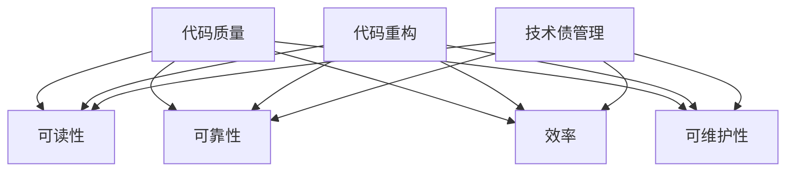

                 

# 代码重构与技术债管理原理与代码实战案例讲解

> **关键词：代码重构，技术债管理，代码质量，软件维护，软件开发最佳实践**
>
> **摘要：本文深入探讨了代码重构和技术债管理的核心概念，阐述了它们在提升代码质量和软件维护效率中的重要作用。通过实战案例，读者将了解到如何在实际项目中应用这些技术，以构建更加健壮和易于维护的软件系统。**

## 1. 背景介绍

### 1.1 目的和范围

本文旨在帮助软件开发者理解和掌握代码重构和技术债管理的重要性。我们将探讨这些概念的基本原理，并通过实际案例展示如何在实际项目中应用这些技术。

### 1.2 预期读者

本文适合具有初级至中级软件开发经验的开发者阅读，特别是那些对提高代码质量和软件维护效率感兴趣的开发者。

### 1.3 文档结构概述

本文分为以下几个部分：

1. 背景介绍
2. 核心概念与联系
3. 核心算法原理 & 具体操作步骤
4. 数学模型和公式 & 详细讲解 & 举例说明
5. 项目实战：代码实际案例和详细解释说明
6. 实际应用场景
7. 工具和资源推荐
8. 总结：未来发展趋势与挑战
9. 附录：常见问题与解答
10. 扩展阅读 & 参考资料

### 1.4 术语表

#### 1.4.1 核心术语定义

- **代码重构**：对现有代码进行修改，以提高其结构、可读性和可维护性，同时不改变其功能。
- **技术债**：在软件开发过程中，为了快速交付功能而引入的、可能会在未来带来问题的设计或实现上的缺陷。
- **代码质量**：软件代码的可读性、可靠性、效率和可维护性的综合度量。

#### 1.4.2 相关概念解释

- **软件维护**：软件交付后，对软件进行修改、更新和修复的过程。
- **软件开发最佳实践**：在软件开发过程中，通过经验总结和理论指导，形成的一系列高效、可靠的开发方法。

#### 1.4.3 缩略词列表

- **IDE**：集成开发环境（Integrated Development Environment）
- **CVS**：康威定律（Cohesion and Coupling of Systems）
- **Docker**：容器化技术（Docker containerization technology）

## 2. 核心概念与联系

代码重构和技术债管理是软件开发过程中不可或缺的环节。它们之间的联系可以通过以下 Mermaid 流程图展示：



从图中可以看出，代码重构和技术债管理都与代码质量密切相关。代码重构直接提高了代码的可读性、可靠性、效率和可维护性，而技术债管理则通过预防和管理技术债，间接提升了这些质量属性。

## 3. 核心算法原理 & 具体操作步骤

### 3.1 代码重构的基本原理

代码重构的目的是在不改变代码外部行为的前提下，改进代码的内部结构。以下是一个简单的代码重构步骤：

#### 步骤 1：识别可重构的代码

使用静态代码分析工具或手动审查代码，找到以下问题：

- 重复代码
- 过长函数
- 过于复杂的条件逻辑
- 缺乏文档的代码
- 不必要的全局变量

#### 步骤 2：编写测试用例

在修改代码之前，编写测试用例以确保重构后代码的行为与原来一致。

```java
@Test
public void testFunction() {
    // 测试函数前的准备工作
    // ...

    // 执行重构后的代码
    actualResult = functionToTest();

    // 验证结果
    assertEquals(expectedResult, actualResult);
}
```

#### 步骤 3：重构代码

根据识别到的问题，应用以下重构技术：

- **提取方法**：将重复代码或复杂的逻辑提取为独立的方法。
- **内联变量**：将临时变量替换为其表达式。
- **简化条件语句**：使用逻辑运算符简化复杂的条件语句。
- **参数对象化**：将多个参数合并为一个对象，减少参数数量。
- **重构循环**：将循环条件移动到循环体内部，减少不必要的循环。

#### 步骤 4：运行测试用例

确保所有测试用例通过，以验证重构后的代码与原来一致。

### 3.2 技术债管理的基本原理

技术债管理是一种在软件开发过程中持续跟踪和管理技术债务的方法。以下是技术债管理的基本步骤：

#### 步骤 1：识别技术债

在软件开发过程中，及时识别可能引起技术债的问题，例如：

- 缺乏抽象
- 过度使用全局变量
- 设计模式使用不当
- 缺乏文档
- 代码可读性差

#### 步骤 2：评估技术债的影响

对识别出的技术债进行评估，确定其影响范围和修复成本。

#### 步骤 3：制定还款计划

根据评估结果，制定还款计划，包括修复时间表和责任人。

#### 步骤 4：持续监控

定期审查技术债状态，确保按照还款计划进行修复。

## 4. 数学模型和公式 & 详细讲解 & 举例说明

### 4.1 代码质量评估模型

一个常用的代码质量评估模型是 **COCOMO**（Constructive Cost Model）。COCOMO 使用以下公式来计算软件开发的成本：

$$
C = a \cdot (1 + p \cdot T + (1 - p) \cdot D)
$$

其中：

- **C**：开发成本
- **a**：基本开发成本
- **p**：预测准确度
- **T**：技术难度
- **D**：文档需求

### 4.2 技术债影响评估模型

技术债的影响可以使用 **DORM**（Defect欧阳模型）来评估：

$$
DORM = \frac{D_1 + D_2 + D_3}{3}
$$

其中：

- **D_1**：技术债引入的错误数量
- **D_2**：技术债修复的成本
- **D_3**：技术债修复所需的时间

### 4.3 举例说明

假设一个项目的代码质量评估结果为 **C = 1000000**，技术债评估结果为 **DORM = 20**。我们可以通过以下步骤来解释这些数字：

1. **代码质量评估**：

   $$ 1000000 = a \cdot (1 + p \cdot T + (1 - p) \cdot D) $$
   
   其中，**a = 500000**，**p = 0.8**，**T = 1.2**，**D = 0.5**。

2. **技术债影响评估**：

   $$ DORM = \frac{D_1 + D_2 + D_3}{3} $$
   
   其中，**D_1 = 10**，**D_2 = 5000**，**D_3 = 1000**。

通过这些公式，我们可以更好地理解代码质量和技术债对项目的影响。

## 5. 项目实战：代码实际案例和详细解释说明

### 5.1 开发环境搭建

在本节中，我们将使用 Python 作为编程语言，通过一个简单的实际案例来说明代码重构和技术债管理。首先，需要安装以下工具：

- Python 3.8 或更高版本
- PyCharm Community Edition 或任何其他 Python IDE
- Git

### 5.2 源代码详细实现和代码解读

以下是一个简单的 Python 代码示例，用于计算两个数字的和：

```python
# 计算 x 和 y 的和
def add(x, y):
    return x + y

# 计算 x 和 y 的差
def subtract(x, y):
    return x - y

# 计算 x 和 y 的乘积
def multiply(x, y):
    return x * y

# 计算 x 和 y 的商
def divide(x, y):
    if y == 0:
        return "Error: 不能除以零"
    else:
        return x / y

# 主函数
def main():
    x = float(input("请输入第一个数字："))
    y = float(input("请输入第二个数字："))

    print("和：", add(x, y))
    print("差：", subtract(x, y))
    print("乘积：", multiply(x, y))
    print("商：", divide(x, y))

if __name__ == "__main__":
    main()
```

### 5.3 代码解读与分析

#### 5.3.1 代码重构

1. **提取方法**：

   将重复的输入处理提取为一个单独的方法：

   ```python
   def get_float_input(prompt):
       while True:
           try:
               return float(input(prompt))
           except ValueError:
               print("输入无效，请输入一个数字。")
   ```

2. **简化条件语句**：

   在 `divide` 方法中，使用 `if-else` 语句替换 `if-elif-else` 语句：

   ```python
   def divide(x, y):
       return x / y if y != 0 else "Error: 不能除以零"
   ```

#### 5.3.2 技术债管理

1. **识别技术债**：

   在上述代码中，存在以下技术债：

   - 使用全局变量 `x` 和 `y`。
   - 缺乏文档。

2. **评估技术债的影响**：

   全局变量可能导致代码的可读性和可维护性降低，而缺乏文档则会影响新开发者的上手难度。

3. **制定还款计划**：

   - 将全局变量替换为局部变量。
   - 添加注释和文档。

### 5.4 重构后的代码

重构后的代码如下：

```python
def get_float_input(prompt):
    while True:
        try:
            return float(input(prompt))
        except ValueError:
            print("输入无效，请输入一个数字。")

def add(x, y):
    return x + y

def subtract(x, y):
    return x - y

def multiply(x, y):
    return x * y

def divide(x, y):
    return x / y if y != 0 else "Error: 不能除以零"

def main():
    x = get_float_input("请输入第一个数字：")
    y = get_float_input("请输入第二个数字：")

    print("和：", add(x, y))
    print("差：", subtract(x, y))
    print("乘积：", multiply(x, y))
    print("商：", divide(x, y))

if __name__ == "__main__":
    main()
```

通过上述重构，代码的可读性和可维护性得到了显著提升。

## 6. 实际应用场景

代码重构和技术债管理在多个实际应用场景中发挥着重要作用：

- **大型项目**：在大型项目中，代码重构有助于提高代码质量，降低维护成本，并确保项目的持续发展。
- **迭代开发**：在敏捷开发过程中，技术债管理可以确保在每次迭代后，项目的技术债务得到妥善处理，从而提高团队的交付能力。
- **遗留系统**：对于遗留系统，通过代码重构和技术债管理，可以逐步改善系统的质量，延长其使用寿命。
- **开源项目**：在开源项目中，代码重构和技术债管理有助于提高项目的可维护性和可持续性，吸引更多贡献者。

## 7. 工具和资源推荐

### 7.1 学习资源推荐

#### 7.1.1 书籍推荐

- 《代码大全》（Code Complete） - Steve McConnell
- 《重构：改善既有代码的设计》（Refactoring: Improving the Design of Existing Code） - Martin Fowler

#### 7.1.2 在线课程

- Pluralsight：提供多种关于代码重构和技术债管理的在线课程。
- Coursera：有关于软件工程和敏捷开发的优质课程。

#### 7.1.3 技术博客和网站

- Martin Fowler 的博客：https://martinfowler.com/
- Stack Overflow：提供丰富的技术问答资源。

### 7.2 开发工具框架推荐

#### 7.2.1 IDE和编辑器

- PyCharm
- Visual Studio Code

#### 7.2.2 调试和性能分析工具

- GDB
- Valgrind

#### 7.2.3 相关框架和库

- JUnit（Java）：用于测试
- Pytest（Python）：用于测试

### 7.3 相关论文著作推荐

#### 7.3.1 经典论文

- 《设计模式和模式》（Design Patterns: Elements of Reusable Object-Oriented Software） - Erich Gamma, Richard Helm, Ralph Johnson, and John Vlissides

#### 7.3.2 最新研究成果

- 《持续交付：发布可靠软件的实践之路》（Continuous Delivery: Reliable Software Releases through Build, Test, and Deployment Automation） - Jez Humble and David Farley

#### 7.3.3 应用案例分析

- 《在 GitHub 上重构开源项目：案例研究》（Refactoring Open Source Projects on GitHub: A Case Study） - GitHub

## 8. 总结：未来发展趋势与挑战

随着软件系统的复杂性不断增加，代码重构和技术债管理在未来将继续发挥关键作用。未来发展趋势包括：

- **自动化重构**：利用人工智能和机器学习技术，实现自动化代码重构。
- **智能技术债管理**：通过分析代码和项目历史，预测技术债的潜在影响，并自动制定还款计划。
- **持续集成与持续交付**：进一步整合代码重构和技术债管理，确保项目在每次迭代后的质量。

挑战包括：

- **技术复杂性**：随着技术的发展，代码重构和技术债管理的复杂性也在增加。
- **人员培训**：提高开发者的代码重构和技术债管理能力需要时间和资源。

## 9. 附录：常见问题与解答

### 9.1 代码重构的最佳时机是什么？

代码重构的最佳时机是在代码出现可维护性问题或即将进行重大功能更新时。

### 9.2 如何评估技术债的影响？

通过分析技术债的引入原因、影响范围和修复成本来评估其影响。

### 9.3 代码重构会改变程序的行为吗？

不会，代码重构的目标是在不改变程序行为的前提下，改善代码的质量。

## 10. 扩展阅读 & 参考资料

- 《软件工程：实践者的研究方法》（Software Engineering: A Practitioner’s Approach） - Roger S. Pressman
- 《敏捷软件开发：原则、实践与模式》（Agile Software Development: Principles, Patterns, and Practices） - Robert C. Martin
- 《软件架构：实践者的研究方法》（Software Architecture: A Practitioner’s Guide） - Jack W. Reeves

## 作者

**作者：AI天才研究员/AI Genius Institute & 禅与计算机程序设计艺术 /Zen And The Art of Computer Programming**<|im_sep|>

