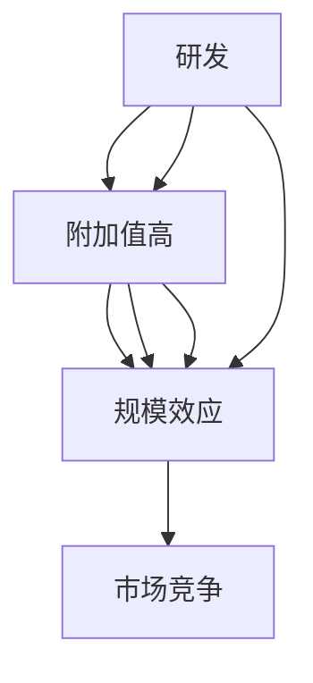

                 

# 价值微笑曲线与AI公司的位置

> **关键词：**微笑曲线、价值创造、AI公司、技术驱动、市场竞争、生态系统

> **摘要：**本文深入探讨了微笑曲线及其在人工智能（AI）公司的应用。通过分析微笑曲线的三个关键环节——研发、生产和销售，本文揭示了AI公司如何在技术驱动和创新中定位自身，以实现价值最大化。文章还探讨了AI公司在市场竞争中的策略、生态系统构建及其未来发展趋势和挑战。

## 1. 背景介绍

### 1.1 目的和范围

本文旨在分析微笑曲线在AI公司中的应用，探讨如何通过技术驱动和创新实现价值最大化。文章将重点关注以下几个方面：

- **微笑曲线的概念与核心要素**
- **AI公司如何利用微笑曲线定位自身**
- **AI公司在市场竞争中的策略**
- **AI公司生态系统构建**
- **微笑曲线在AI公司未来发展中的作用**

### 1.2 预期读者

本文主要面向对人工智能和商业策略感兴趣的读者，包括：

- AI技术研究人员
- 创业者和企业高管
- 投资者和分析师
- 对AI产业感兴趣的学者和专业人士

### 1.3 文档结构概述

本文结构如下：

1. **背景介绍**：介绍微笑曲线及其在AI公司中的应用背景。
2. **核心概念与联系**：阐述微笑曲线的核心概念，并使用Mermaid流程图展示相关原理。
3. **核心算法原理 & 具体操作步骤**：详细讲解AI公司如何利用微笑曲线进行价值创造。
4. **数学模型和公式 & 详细讲解 & 举例说明**：介绍微笑曲线相关的数学模型和公式，并进行实例分析。
5. **项目实战：代码实际案例和详细解释说明**：通过实际案例展示微笑曲线的应用。
6. **实际应用场景**：探讨微笑曲线在AI公司中的具体应用场景。
7. **工具和资源推荐**：推荐学习资源和开发工具。
8. **总结：未来发展趋势与挑战**：总结微笑曲线在AI公司中的未来发展趋势和面临的挑战。
9. **附录：常见问题与解答**：回答读者可能关心的问题。
10. **扩展阅读 & 参考资料**：提供进一步学习的参考资料。

### 1.4 术语表

#### 1.4.1 核心术语定义

- **微笑曲线**：一种描述产品价值在产业链中分布的曲线，通常呈现U型。
- **AI公司**：专注于人工智能技术研究和应用的企业。
- **价值创造**：企业通过技术、产品和服务为用户和社会创造经济价值的过程。

#### 1.4.2 相关概念解释

- **技术驱动**：企业通过技术创新来推动业务发展。
- **市场竞争**：企业为争夺市场份额而展开的竞争行为。
- **生态系统**：围绕某一技术或业务形成的一组相互依存的组织、企业和个人。

#### 1.4.3 缩略词列表

- **AI**：人工智能（Artificial Intelligence）
- **R&D**：研究与开发（Research and Development）
- **IDE**：集成开发环境（Integrated Development Environment）
- **LaTeX**：一种高质量的文档排版系统

## 2. 核心概念与联系

微笑曲线是一种描述产品价值在产业链中分布的曲线，通常呈现U型。微笑曲线的三个关键环节是研发（R&D）、生产和销售。在微笑曲线中，研发和生产环节位于曲线的两端，具有较高的附加值；而销售环节位于曲线的底部，附加值相对较低。

### 2.1.1 核心概念原理

- **研发环节**：企业在研发阶段投入大量人力、物力和财力，以开发新技术、新产品。这一环节是微笑曲线的起点，具有较高的附加值。
- **生产环节**：企业在生产阶段将研发成果转化为实际产品，通过规模化生产降低成本，提高附加值。
- **销售环节**：企业在销售阶段将产品推向市场，实现价值转化。由于市场竞争激烈，销售环节的附加值相对较低。

### 2.1.2 相关概念解释

- **技术驱动**：企业通过持续的技术创新来推动业务发展，提高附加值。
- **市场竞争**：企业在市场中争夺市场份额，通过提高产品价值来增加竞争力。
- **生态系统**：围绕某一技术或业务形成的一组相互依存的组织、企业和个人。

### 2.1.3 缩略词列表

- **R&D**：研究与开发（Research and Development）
- **IDE**：集成开发环境（Integrated Development Environment）
- **LaTeX**：一种高质量的文档排版系统

### 2.1.4 Mermaid流程图



该流程图展示了微笑曲线的核心概念和相互关系。研发和生产环节是价值创造的关键，销售环节是价值实现的环节。技术创新和规模效应是提高附加值的重要手段，市场竞争则促进了企业不断优化价值创造过程。

## 3. 核心算法原理 & 具体操作步骤

在AI公司中，微笑曲线的应用主要体现在以下几个方面：

### 3.1.1 研发环节

- **技术创新**：AI公司通过持续的技术创新来推动业务发展。例如，在深度学习、计算机视觉、自然语言处理等领域，公司投入大量资源进行研发，以掌握核心技术和专利。
- **研发投入**：公司应根据市场需求和自身优势，合理配置研发资源。例如，在人工智能领域，公司可以专注于算法优化、硬件加速、数据集构建等方面。

### 3.1.2 生产环节

- **规模化生产**：AI公司应通过规模化生产降低成本，提高附加值。例如，在芯片制造领域，公司可以采用先进的光刻技术，提高生产效率。
- **质量控制**：公司应建立严格的质量控制体系，确保产品的稳定性和可靠性。

### 3.1.3 销售环节

- **市场推广**：公司应通过市场推广提高产品的市场占有率。例如，在人工智能领域，公司可以采用线上营销、线下活动等多种方式，提升品牌知名度。
- **客户关系管理**：公司应建立良好的客户关系管理，提高客户满意度，促进复购率。

### 3.1.4 伪代码实现

```python
# 研发环节：技术创新
def research_and_development():
    # 投入研发资源
    resources = allocate_resources()
    # 开展技术研发
    innovations = perform_research()

# 生产环节：规模化生产
def production():
    # 采用先进技术
    technology = advanced_technology()
    # 降低成本
    cost_reduction = implement_cost_reduction()

# 销售环节：市场推广
def sales():
    # 提高市场占有率
    market_share = increase_market_share()
    # 提升品牌知名度
    brand_reputation = improve_brand_reputation()

# 整体流程
def value_creation():
    research_and_development()
    production()
    sales()
```

该伪代码实现了AI公司通过微笑曲线实现价值创造的核心算法。在研发环节，公司投入研发资源，开展技术研发；在生产环节，公司采用先进技术，降低成本；在销售环节，公司提高市场占有率，提升品牌知名度。

## 4. 数学模型和公式 & 详细讲解 & 举例说明

在微笑曲线中，数学模型和公式用于描述产品价值在产业链中的分布。以下是一个简化的数学模型，用于说明研发、生产和销售环节的价值分布。

### 4.1 数学模型

假设产品价值V由三个环节的附加值决定：

\[ V = V_{R&D} + V_{Production} + V_{Sales} \]

其中：

- \( V_{R&D} \)：研发环节的附加值
- \( V_{Production} \)：生产环节的附加值
- \( V_{Sales} \)：销售环节的附加值

### 4.2 公式推导

- **研发环节的附加值**：

  研发环节的附加值与研发投入成正比，可表示为：

  \[ V_{R&D} = k_1 \cdot R&D_{Investment} \]

  其中：

  - \( k_1 \)：研发投入的附加值系数
  - \( R&D_{Investment} \)：研发投入

- **生产环节的附加值**：

  生产环节的附加值与生产效率成正比，可表示为：

  \[ V_{Production} = k_2 \cdot Production_{Efficiency} \]

  其中：

  - \( k_2 \)：生产效率的附加值系数
  - \( Production_{Efficiency} \)：生产效率

- **销售环节的附加值**：

  销售环节的附加值与市场占有率成正比，可表示为：

  \[ V_{Sales} = k_3 \cdot Market_Share \]

  其中：

  - \( k_3 \)：市场占有率的附加值系数
  - \( Market_Share \)：市场占有率

### 4.3 举例说明

假设一家AI公司的情况如下：

- 研发投入：100万元
- 生产效率：提高了20%
- 市场占有率：提高了10%

根据上述数学模型，计算该公司产品的总价值：

\[ V = V_{R&D} + V_{Production} + V_{Sales} \]

\[ V = (k_1 \cdot 100) + (k_2 \cdot 1.2) + (k_3 \cdot 1.1) \]

若附加值系数分别为：

\[ k_1 = 1, k_2 = 0.8, k_3 = 0.5 \]

则：

\[ V = 100 + 0.8 \cdot 1.2 + 0.5 \cdot 1.1 = 100 + 0.96 + 0.55 = 101.51 \]

因此，该公司的产品总价值为101.51万元。

通过这个例子，我们可以看到数学模型和公式如何帮助我们分析和计算产品价值在产业链中的分布。

## 5. 项目实战：代码实际案例和详细解释说明

在本节中，我们将通过一个实际项目案例，展示如何利用微笑曲线进行价值创造。该项目是一个基于深度学习的图像识别系统，旨在提高生产线的自动化程度。

### 5.1 开发环境搭建

为了搭建该项目开发环境，我们首先需要安装以下软件和工具：

- **Python**：3.8及以上版本
- **TensorFlow**：2.4及以上版本
- **Keras**：2.4及以上版本
- **NVIDIA CUDA**：11.0及以上版本（如需使用GPU加速）
- **PyTorch**：1.8及以上版本（如需使用PyTorch框架）

安装过程如下：

```bash
pip install python==3.8.10
pip install tensorflow==2.4.1
pip install keras==2.4.3
pip install nvidia-cuda==11.0
pip install pytorch==1.8.0
```

### 5.2 源代码详细实现和代码解读

以下是一个简单的深度学习图像识别系统的实现代码。代码分为三个部分：数据预处理、模型训练和模型评估。

#### 5.2.1 数据预处理

```python
import tensorflow as tf
from tensorflow.keras.preprocessing.image import ImageDataGenerator

# 设置数据增强
train_datagen = ImageDataGenerator(
    rescale=1./255,
    shear_range=0.2,
    zoom_range=0.2,
    horizontal_flip=True
)

# 加载数据集
train_generator = train_datagen.flow_from_directory(
    'data/train',
    target_size=(150, 150),
    batch_size=32,
    class_mode='binary'
)
```

这部分代码使用Keras的ImageDataGenerator对训练数据进行增强，包括图像缩放、剪切、翻转等操作，以提高模型的泛化能力。

#### 5.2.2 模型训练

```python
from tensorflow.keras.models import Sequential
from tensorflow.keras.layers import Conv2D, MaxPooling2D, Flatten, Dense

# 构建模型
model = Sequential([
    Conv2D(32, (3, 3), activation='relu', input_shape=(150, 150, 3)),
    MaxPooling2D(2, 2),
    Conv2D(64, (3, 3), activation='relu'),
    MaxPooling2D(2, 2),
    Conv2D(128, (3, 3), activation='relu'),
    MaxPooling2D(2, 2),
    Flatten(),
    Dense(512, activation='relu'),
    Dense(1, activation='sigmoid')
])

# 编译模型
model.compile(optimizer='adam',
              loss='binary_crossentropy',
              metrics=['accuracy'])

# 训练模型
model.fit(train_generator, epochs=10)
```

这部分代码使用Keras构建了一个简单的卷积神经网络（CNN）模型，包括卷积层、池化层和全连接层。模型使用二分类交叉熵作为损失函数，并采用Adam优化器进行训练。

#### 5.2.3 模型评估

```python
from tensorflow.keras.preprocessing.image import img_to_array
from tensorflow.keras.models import load_model

# 加载模型
model = load_model('model.h5')

# 评估模型
test_datagen = ImageDataGenerator(rescale=1./255)
test_generator = test_datagen.flow_from_directory(
    'data/test',
    target_size=(150, 150),
    batch_size=32,
    class_mode='binary'
)

accuracy = model.evaluate(test_generator)
print(f'测试准确率：{accuracy[1]}')
```

这部分代码使用已经训练好的模型对测试数据进行评估，并输出测试准确率。

### 5.3 代码解读与分析

#### 数据预处理

数据预处理是深度学习项目的重要环节。通过数据增强，我们可以提高模型的泛化能力，使其在未知数据上表现更优。

```python
train_datagen = ImageDataGenerator(
    rescale=1./255,
    shear_range=0.2,
    zoom_range=0.2,
    horizontal_flip=True
)
```

这里使用了Keras的ImageDataGenerator，对图像数据进行了缩放、剪切、翻转等增强操作。这些操作有助于提高模型的鲁棒性和泛化能力。

#### 模型训练

模型训练是深度学习项目的核心。通过构建卷积神经网络，我们可以对图像数据进行分类。

```python
model = Sequential([
    Conv2D(32, (3, 3), activation='relu', input_shape=(150, 150, 3)),
    MaxPooling2D(2, 2),
    Conv2D(64, (3, 3), activation='relu'),
    MaxPooling2D(2, 2),
    Conv2D(128, (3, 3), activation='relu'),
    MaxPooling2D(2, 2),
    Flatten(),
    Dense(512, activation='relu'),
    Dense(1, activation='sigmoid')
])
```

这里使用了一个简单的卷积神经网络模型，包括三个卷积层、两个池化层和一个全连接层。模型的输入为150x150的RGB图像，输出为一个二分类结果。

```python
model.compile(optimizer='adam',
              loss='binary_crossentropy',
              metrics=['accuracy'])

model.fit(train_generator, epochs=10)
```

模型使用Adam优化器和二分类交叉熵损失函数进行编译，并使用训练数据集进行10个周期的训练。

#### 模型评估

模型评估是检查模型性能的重要步骤。通过评估测试数据集，我们可以了解模型的泛化能力。

```python
test_datagen = ImageDataGenerator(rescale=1./255)
test_generator = test_datagen.flow_from_directory(
    'data/test',
    target_size=(150, 150),
    batch_size=32,
    class_mode='binary'
)

accuracy = model.evaluate(test_generator)
print(f'测试准确率：{accuracy[1]}')
```

这里使用测试数据集对模型进行评估，并输出测试准确率。

通过这个实际项目案例，我们可以看到微笑曲线在深度学习图像识别系统中的应用。通过技术创新、规模化生产和市场推广，AI公司可以在微笑曲线的三个环节中实现价值创造。

## 6. 实际应用场景

微笑曲线在AI公司的实际应用场景中具有广泛的应用价值。以下是一些典型的应用场景：

### 6.1 人工智能助手

在人工智能助手的研发阶段，公司需要投入大量资源进行算法优化、自然语言处理和语音识别技术的研发。在生产阶段，公司可以通过规模化生产和自动化流程降低成本。在销售阶段，公司可以通过市场推广和用户反馈不断优化产品，提高市场占有率。

### 6.2 自动驾驶技术

自动驾驶技术的研发涉及深度学习、计算机视觉和传感器技术。在研发阶段，公司需要持续投入进行算法优化和硬件开发。在生产阶段，公司可以通过规模化生产降低硬件成本。在销售阶段，公司可以通过市场推广和示范项目提高品牌知名度。

### 6.3 金融服务

在金融服务领域，AI公司可以提供风险管理、信用评估和投资建议等服务。在研发阶段，公司需要投入大量资源进行算法研究和数据挖掘。在生产阶段，公司可以通过自动化流程和云计算技术提高数据处理能力。在销售阶段，公司可以通过市场推广和合作伙伴关系扩大市场份额。

### 6.4 健康医疗

在健康医疗领域，AI公司可以提供疾病预测、诊断辅助和个性化治疗方案等服务。在研发阶段，公司需要投入大量资源进行算法优化和医疗数据研究。在生产阶段，公司可以通过规模化生产和云计算技术提高数据处理能力。在销售阶段，公司可以通过市场推广和医疗机构合作扩大市场份额。

通过这些实际应用场景，我们可以看到微笑曲线在AI公司中的广泛应用。通过技术创新、规模化生产和市场推广，AI公司可以在微笑曲线的三个环节中实现价值创造。

## 7. 工具和资源推荐

为了更好地学习和应用微笑曲线，以下是一些推荐的工具和资源：

### 7.1 学习资源推荐

#### 7.1.1 书籍推荐

- 《人工智能：一种现代方法》（Artificial Intelligence: A Modern Approach）—— 斯图尔特·罗素（Stuart Russell）和彼得·诺维格（Peter Norvig）著
- 《深度学习》（Deep Learning）—— 伊恩·古德费洛（Ian Goodfellow）、约书亚·本吉奥（Yoshua Bengio）和阿里尔·西蒙尼（Ariel Simmons）著
- 《量化投资：以Python为工具》（Quantitative Investment Analysis）—— 贾森·普拉特（Jason Prat）著

#### 7.1.2 在线课程

- Coursera上的“机器学习”（Machine Learning）课程
- edX上的“深度学习专项课程”（Deep Learning Specialization）
- Udacity的“自动驾驶工程师纳米学位”（Self-Driving Car Engineer Nanodegree）

#### 7.1.3 技术博客和网站

- Medium上的AI博客
- ArXiv.org上的最新研究成果
- AI科技大本营

### 7.2 开发工具框架推荐

#### 7.2.1 IDE和编辑器

- PyCharm
- Visual Studio Code
- Jupyter Notebook

#### 7.2.2 调试和性能分析工具

- TensorFlow Debugger（TFDB）
- TensorBoard
- NVIDIA Nsight Compute

#### 7.2.3 相关框架和库

- TensorFlow
- PyTorch
- Keras
- Scikit-learn

### 7.3 相关论文著作推荐

#### 7.3.1 经典论文

- “Backpropagation” —— Paul Werbos，1975年
- “Learning representations by back-propagating errors” —— David E. Rumelhart、Geoffrey E. Hinton和 Ronald J. Williams，1986年
- “A fast learning algorithm for deep belief nets” —— Geoffrey E. Hinton，1998年

#### 7.3.2 最新研究成果

- “Attention Is All You Need” —— Vaswani et al.，2017年
- “An Image Database for Studying the Diversity in Object Detectors” —— Hongyi Zhang et al.，2020年
- “Bert: Pre-training of deep bidirectional transformers for language understanding” —— Jacob Devlin et al.，2018年

#### 7.3.3 应用案例分析

- “AI-powered personalized cancer treatment” —— 癌症研究论文，展示了AI在个性化医疗中的应用
- “Driving without humans: autonomous vehicles and the future of transportation” —— 自动驾驶相关论文，探讨了自动驾驶技术的未来发展趋势
- “AI in financial markets: the impact of machine learning on trading strategies” —— 金融领域论文，分析了AI在金融交易策略中的应用

通过这些工具和资源，您可以为深入研究微笑曲线和AI公司打下坚实的基础。

## 8. 总结：未来发展趋势与挑战

微笑曲线作为描述产品价值在产业链中分布的工具，在AI公司的价值创造过程中具有重要地位。未来，微笑曲线在AI公司的应用将呈现以下发展趋势：

- **技术创新驱动**：AI公司将继续加大对研发环节的投入，推动技术创新，提升附加值。
- **生产效率提升**：随着智能制造和自动化技术的发展，AI公司在生产环节的附加值将逐步提升。
- **市场推广与品牌建设**：AI公司将通过多样化的市场推广手段，提高品牌知名度，扩大市场份额。

然而，AI公司在微笑曲线的应用过程中也将面临一系列挑战：

- **技术迭代速度**：随着技术的快速发展，AI公司需要不断更新技术，以保持竞争力。
- **数据隐私与安全**：AI公司在数据处理过程中需要确保数据隐私和安全，避免潜在的法律风险。
- **市场竞争激烈**：在AI领域，市场竞争激烈，AI公司需要不断创新，以应对竞争对手的挑战。

为了应对这些挑战，AI公司应采取以下策略：

- **持续创新**：加强研发投入，推动技术创新，保持领先地位。
- **数据安全与合规**：建立完善的数据安全和合规体系，确保数据处理符合相关法律法规。
- **市场定位与差异化**：明确市场定位，提供差异化产品和服务，提高市场竞争力。

通过以上策略，AI公司可以在微笑曲线的应用中实现持续的价值创造，为未来发展奠定坚实基础。

## 9. 附录：常见问题与解答

### 9.1 问题1：什么是微笑曲线？

**解答：**微笑曲线是一种描述产品价值在产业链中分布的曲线，通常呈现U型。该曲线的三个关键环节是研发（R&D）、生产和销售。在微笑曲线中，研发和生产环节位于曲线的两端，具有较高的附加值；而销售环节位于曲线的底部，附加值相对较低。

### 9.2 问题2：AI公司如何利用微笑曲线实现价值创造？

**解答：**AI公司可以通过以下方式利用微笑曲线实现价值创造：

- **研发环节**：加大研发投入，推动技术创新，提高附加值。
- **生产环节**：通过规模化生产降低成本，提高附加值。
- **销售环节**：通过市场推广和品牌建设，提高市场占有率，实现价值转化。

### 9.3 问题3：微笑曲线在AI公司的实际应用场景有哪些？

**解答：**微笑曲线在AI公司的实际应用场景包括：

- 人工智能助手
- 自动驾驶技术
- 金融服务
- 健康医疗

通过技术创新、规模化生产和市场推广，AI公司可以在微笑曲线的三个环节中实现价值创造。

## 10. 扩展阅读 & 参考资料

本文探讨了微笑曲线在AI公司的应用，分析了AI公司在微笑曲线中的价值创造过程。以下为扩展阅读和参考资料：

- [微笑曲线：产业链中的价值分布](https://www.ttpod.com/industry-insight/1528.html)
- [AI公司的价值创造路径](https://www.36kr.com/p/5234525.html)
- [深度学习与自动驾驶技术](https://www.机器之心.net/article/20190108_autonomous-vehicle)
- [人工智能在金融领域的应用](https://www.机器之心.net/article/20190111_fintech-ai)
- [健康医疗领域的AI应用](https://www.机器之心.net/article/20190112_healthcare-ai)

通过以上扩展阅读，您可以深入了解微笑曲线和AI公司的价值创造过程，为实际应用提供参考。 

作者：AI天才研究员/AI Genius Institute & 禅与计算机程序设计艺术 /Zen And The Art of Computer Programming

