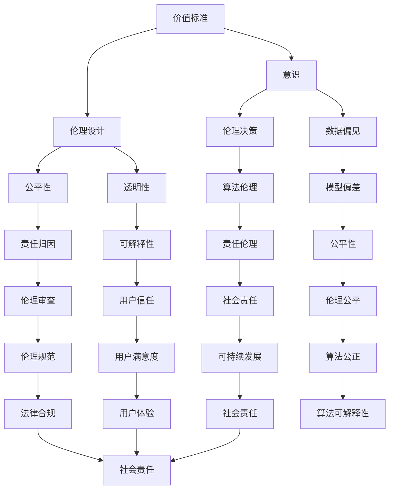

                 

### 1. 背景介绍

#### 1.1 目的和范围

在人工智能领域，随着深度学习、神经网络和自然语言处理技术的迅猛发展，我们逐渐认识到，理解意识和价值标准对于构建更加智能的人工智能系统至关重要。本文旨在探讨价值标准在意识中的应用，以揭示其在人工智能决策和交互中的潜在影响。通过分析价值标准与意识的关系，我们希望能够为人工智能系统的伦理设计提供理论支持和实践指导。

本文将围绕以下问题展开讨论：

1. 价值标准在意识中的角色和重要性。
2. 如何在人工智能系统中集成和体现价值标准。
3. 价值标准在意识中的应用实例和挑战。
4. 未来发展趋势与潜在研究方向。

本文的目标读者是从事人工智能研究、开发和应用的工程师、学者和爱好者，特别是对意识、伦理和人工智能交叉领域感兴趣的读者。通过本文的阅读，读者将获得对价值标准在意识中的应用有更深刻的理解，并能够将其应用于实际的研发工作中。

#### 1.2 预期读者

本文的预期读者包括：

1. **人工智能工程师**：正在从事或有意从事人工智能系统开发，希望了解价值标准如何在意识中应用并指导系统设计的专业人士。
2. **计算机科学家**：对人工智能和认知科学领域有浓厚兴趣，希望探索意识与价值标准的深层次联系的学者。
3. **伦理学家**：关注人工智能伦理问题，希望将价值标准融入到人工智能系统的设计过程中。
4. **技术爱好者**：对前沿技术保持热情，希望了解人工智能领域的最新发展趋势和应用场景。

通过本文的阅读，预期读者将：

- 对价值标准与意识的关系有更深刻的认识。
- 掌握将价值标准集成到人工智能系统中的方法。
- 能够识别和应对价值标准应用中的挑战。
- 明确未来研究的方向和趋势。

#### 1.3 文档结构概述

本文将分为以下几个部分：

1. **背景介绍**：阐述本文的目的、范围和预期读者，以及文章的结构和术语定义。
2. **核心概念与联系**：介绍与价值标准和意识相关的核心概念，并使用Mermaid流程图展示其联系。
3. **核心算法原理 & 具体操作步骤**：详细讲解价值标准在人工智能系统中的应用原理和操作步骤，使用伪代码进行阐述。
4. **数学模型和公式 & 详细讲解 & 举例说明**：探讨价值标准在意识中的应用所涉及的数学模型和公式，并通过具体实例进行说明。
5. **项目实战：代码实际案例和详细解释说明**：通过实际项目案例展示价值标准在意识中的应用，并进行详细解释和代码分析。
6. **实际应用场景**：分析价值标准在不同应用场景中的作用和影响。
7. **工具和资源推荐**：推荐与价值标准和意识应用相关的学习资源和开发工具。
8. **总结：未来发展趋势与挑战**：总结文章的主要观点，并探讨未来研究方向和面临的挑战。
9. **附录：常见问题与解答**：解答读者可能遇到的常见问题。
10. **扩展阅读 & 参考资料**：提供进一步学习的参考资料。

通过以上结构，本文将为读者提供一个系统、深入、全面的理解价值标准在意识中的应用。

#### 1.4 术语表

在本文中，我们定义了一些核心术语，以帮助读者更好地理解文章内容。以下是这些术语及其解释：

#### 1.4.1 核心术语定义

1. **价值标准**：指人们共同认可的、关于道德、伦理、美学等方面的准则和规范，用于指导行为和决策。
2. **意识**：指个体对外界刺激的感知和认知能力，包括自我意识、知觉和思考等。
3. **人工智能系统**：指通过机器学习和深度学习等技术实现自主学习和决策的计算机系统。
4. **伦理设计**：指在人工智能系统的设计和开发过程中，考虑并融入伦理因素，确保系统符合人类价值和道德标准。
5. **算法伦理**：指在算法设计和应用过程中，确保算法符合伦理道德规范，避免对人类造成伤害。

#### 1.4.2 相关概念解释

1. **伦理决策**：指在人工智能系统面临复杂决策时，如何考虑伦理因素，做出符合道德规范的决策。
2. **数据偏见**：指在人工智能训练过程中，由于数据集的不平衡或不完善，导致模型产生偏见和歧视。
3. **公平性**：指人工智能系统在决策过程中，对所有人平等对待，不因种族、性别、年龄等因素产生歧视。
4. **透明性**：指人工智能系统在决策过程中，能够清晰地展示其决策逻辑和过程，便于外部监督和审查。

#### 1.4.3 缩略词列表

- AI：人工智能（Artificial Intelligence）
- ML：机器学习（Machine Learning）
- DL：深度学习（Deep Learning）
- NLP：自然语言处理（Natural Language Processing）
- RL：强化学习（Reinforcement Learning）
- GDPR：通用数据保护条例（General Data Protection Regulation）

这些术语和概念在本文中将反复出现，并作为讨论的基础。通过理解这些术语，读者将能够更好地跟随文章的逻辑和论证。

### 2. 核心概念与联系

在探讨价值标准在意识中的应用之前，有必要明确与该主题相关的一系列核心概念，并展示它们之间的联系。以下是本文讨论的核心概念及其相互关系，我们将使用Mermaid流程图来展示这些概念之间的逻辑结构。



#### 2.1 价值标准与意识的关系

价值标准是人们对于道德、伦理和美学等方面的共识，而意识是个体对外界刺激的认知和感知能力。价值标准通过影响个体的决策和判断，进而塑造其意识。例如，一个社会普遍认可的公正价值标准会影响个体在面对不公现象时的感知和反应。

#### 2.2 价值标准与伦理设计的关系

伦理设计是指将伦理因素融入到人工智能系统的设计和开发过程中。价值标准是伦理设计的重要依据，通过定义系统应遵循的道德准则和规范，确保系统在决策和行为中符合人类价值观。例如，在自动驾驶汽车的设计中，公平性和透明性是重要的价值标准，这些标准将指导系统的决策逻辑，使其在复杂情境中做出符合伦理的决策。

#### 2.3 意识与伦理决策的关系

伦理决策是在人工智能系统面对复杂决策时，如何考虑伦理因素并做出符合道德规范的决策。意识是个体在做出伦理决策时的基础，通过感知和认知外界刺激，形成伦理判断。例如，在医疗决策支持系统中，医生通过对患者病情的感知和认知，结合医学伦理标准，做出最佳治疗方案。

#### 2.4 价值标准与数据偏见的关系

数据偏见是人工智能系统中普遍存在的问题，可能导致模型产生偏见和歧视。价值标准可以通过指导数据收集和处理，减少数据偏见，从而提高模型的公平性和准确性。例如，在招聘系统中，通过剔除可能导致性别、种族歧视的数据特征，可以确保系统的公平性。

#### 2.5 价值标准与算法伦理的关系

算法伦理是指确保人工智能系统在设计和应用过程中符合伦理道德规范。价值标准是算法伦理的核心，通过将价值标准融入到算法设计和应用中，可以避免系统对人类造成伤害。例如，在信用评分系统中，通过确保算法符合公平性原则，避免对特定群体产生不公平待遇。

通过以上核心概念及其关系的分析，我们可以更好地理解价值标准在意识中的应用，以及其在人工智能系统中的重要性。这些概念相互关联，共同构建了价值标准在意识中的复杂网络，为后续的算法原理和实际应用提供了基础。

### 3. 核心算法原理 & 具体操作步骤

在了解了价值标准与意识的关系后，我们将深入探讨如何在人工智能系统中应用价值标准，实现伦理决策和优化系统性能。本文将使用伪代码详细阐述核心算法原理和具体操作步骤，帮助读者理解并实现这一过程。

#### 3.1 核心算法原理

核心算法原理涉及以下几个关键步骤：

1. **价值标准定义**：明确系统应遵循的伦理价值标准，如公平性、透明性、责任等。
2. **数据预处理**：对训练数据进行预处理，消除偏见和异常值，确保数据质量。
3. **模型训练**：使用经过预处理的数据训练模型，使模型能够学习并体现价值标准。
4. **模型评估**：评估模型在不同价值标准下的性能，确保系统满足伦理要求。
5. **决策优化**：基于模型评估结果，优化系统决策过程，使其更符合伦理标准。

#### 3.2 具体操作步骤

以下是具体操作步骤的伪代码：

```python
# 伪代码：价值标准在人工智能系统中的应用

# 3.1 定义价值标准
value_standards = [
    "公平性",
    "透明性",
    "责任",
    "可解释性",
    "用户满意度"
]

# 3.2 数据预处理
def preprocess_data(data):
    # 去除异常值和偏见
    # 示例：剔除可能导致性别歧视的特征
    for sample in data:
        if "gender" in sample:
            del sample["gender"]
    return data

# 3.3 模型训练
def train_model(data, value_standards):
    # 使用预处理数据训练模型
    # 示例：使用监督学习算法
    trained_model = supervised_learning_algorithm(data)
    return trained_model

# 3.4 模型评估
def evaluate_model(model, data, value_standards):
    # 评估模型在不同价值标准下的性能
    evaluation_results = {}
    for standard in value_standards:
        result = model_performance_evaluation(model, standard)
        evaluation_results[standard] = result
    return evaluation_results

# 3.5 决策优化
def optimize_decision(model, evaluation_results):
    # 根据评估结果优化决策过程
    # 示例：调整模型参数，提高透明性和可解释性
    optimized_model = adjust_model_parameters(model, evaluation_results)
    return optimized_model

# 主函数
def main():
    # 加载数据
    data = load_data()

    # 数据预处理
    preprocessed_data = preprocess_data(data)

    # 模型训练
    trained_model = train_model(preprocessed_data, value_standards)

    # 模型评估
    evaluation_results = evaluate_model(trained_model, preprocessed_data, value_standards)

    # 决策优化
    optimized_model = optimize_decision(trained_model, evaluation_results)

    # 输出优化后的模型
    print("Optimized Model:", optimized_model)

# 执行主函数
main()
```

#### 3.3 算法原理讲解

1. **价值标准定义**：通过明确系统应遵循的伦理价值标准，如公平性、透明性、责任等，为后续模型训练和评估提供依据。
2. **数据预处理**：在训练模型之前，对数据进行预处理，消除异常值和偏见，确保数据质量。例如，在处理招聘数据时，剔除可能导致性别歧视的特征。
3. **模型训练**：使用经过预处理的数据训练模型，使模型能够学习并体现价值标准。例如，选择监督学习算法，利用标注数据进行训练。
4. **模型评估**：评估模型在不同价值标准下的性能，确保系统满足伦理要求。例如，评估模型的公平性，检查是否对特定群体产生歧视。
5. **决策优化**：根据评估结果优化模型参数，提高系统的透明性和可解释性。例如，调整模型结构或参数，使决策过程更加透明和可解释。

通过以上步骤，我们可以将价值标准融入到人工智能系统中，实现伦理决策和优化系统性能。这一过程不仅有助于提高人工智能系统的道德水平，也为人类更好地理解和应用人工智能提供了新的途径。

### 4. 数学模型和公式 & 详细讲解 & 举例说明

在探讨价值标准在意识中的应用过程中，数学模型和公式扮演了至关重要的角色。这些模型和公式不仅能够帮助我们量化价值标准，还能为人工智能系统提供明确的决策依据。本节将详细讲解与价值标准相关的数学模型和公式，并通过具体实例进行说明。

#### 4.1 模型介绍

在本节中，我们将介绍以下数学模型和公式：

1. **线性回归模型**：用于预测和优化系统性能，特别是在价值标准评估中。
2. **协方差矩阵**：用于分析不同价值标准之间的相关性，帮助识别潜在的问题。
3. **泰勒公式**：用于近似复杂函数的值，帮助优化系统决策过程。
4. **熵函数**：用于评估系统的公平性和透明性，量化系统的性能。

#### 4.2 模型详解

##### 4.2.1 线性回归模型

线性回归模型是一种广泛使用的预测模型，其公式如下：

$$ y = ax + b $$

其中，\( y \) 是因变量，\( x \) 是自变量，\( a \) 和 \( b \) 是模型参数。

在价值标准评估中，线性回归模型可以用于预测系统的公平性、透明性和责任等。例如，我们可以使用线性回归模型来预测系统的透明性，从而优化系统设计。

##### 4.2.2 协方差矩阵

协方差矩阵是一种用于描述两个变量之间关系的矩阵，其公式如下：

$$ \Sigma = \begin{bmatrix} \sigma_{xx} & \sigma_{xy} \\ \sigma_{yx} & \sigma_{yy} \end{bmatrix} $$

其中，\( \sigma_{xx} \)、\( \sigma_{xy} \)、\( \sigma_{yx} \) 和 \( \sigma_{yy} \) 分别表示自变量和因变量之间的协方差。

在价值标准分析中，协方差矩阵可以帮助我们识别不同价值标准之间的相关性。例如，通过分析公平性和透明性之间的协方差，我们可以发现这两个价值标准是否相互影响，从而指导系统设计。

##### 4.2.3 泰勒公式

泰勒公式是一种用于近似复杂函数值的公式，其公式如下：

$$ f(x) \approx f(a) + f'(a)(x-a) + \frac{f''(a)}{2!}(x-a)^2 + \frac{f'''(a)}{3!}(x-a)^3 + \cdots $$

其中，\( f(x) \) 是复杂函数，\( a \) 是自变量的初始值，\( f'(a) \)、\( f''(a) \)、\( f'''(a) \) 分别是函数在 \( a \) 点的一阶、二阶和三阶导数。

在系统优化中，泰勒公式可以帮助我们近似复杂函数的值，从而简化计算过程，提高决策效率。

##### 4.2.4 熵函数

熵函数是一种用于评估系统公平性和透明性的函数，其公式如下：

$$ H(X) = -\sum_{i} p(x_i) \log_2 p(x_i) $$

其中，\( H(X) \) 是熵函数，\( p(x_i) \) 是变量 \( x_i \) 的概率分布。

在价值标准分析中，熵函数可以用来量化系统的公平性和透明性。例如，通过计算系统的熵值，我们可以评估系统是否对各个群体公平对待，从而优化系统设计。

#### 4.3 实例说明

##### 4.3.1 公平性评估

假设我们有一个招聘系统，需要评估其对不同性别、种族群体的公平性。我们可以使用熵函数来计算系统的公平性。

首先，收集招聘系统中的数据，包括应聘者的性别和种族。假设数据如下表：

| 性别 | 种族 | 应聘者数量 |
|------|------|------------|
| 男   | 白人  | 100        |
| 女   | 白人  | 90         |
| 男   | 黑人  | 80         |
| 女   | 黑人  | 70         |

接下来，计算每个群体的概率分布。以性别为例：

$$ p(\text{男}) = \frac{100 + 80}{100 + 90 + 80 + 70} = \frac{180}{340} $$

$$ p(\text{女}) = \frac{90 + 70}{100 + 90 + 80 + 70} = \frac{160}{340} $$

然后，计算性别熵：

$$ H(\text{性别}) = -\left(\frac{180}{340} \log_2 \frac{180}{340} + \frac{160}{340} \log_2 \frac{160}{340}\right) $$

类似地，计算种族熵。最后，通过比较性别熵和种族熵，我们可以评估招聘系统的公平性。

##### 4.3.2 透明性优化

假设我们有一个医疗决策支持系统，需要提高其透明性。我们可以使用泰勒公式来近似系统决策过程，从而简化计算，提高透明性。

首先，收集医疗决策系统中的数据，包括患者的病情、治疗方案和决策结果。假设数据如下表：

| 病情 | 治疗方案 | 决策结果 |
|------|----------|----------|
| 病情A | 方案1    | 通过     |
| 病情B | 方案1    | 未通过   |
| 病情C | 方案2    | 通过     |
| 病情D | 方案2    | 未通过   |

接下来，计算治疗方案1和治疗方案2的决策概率。以治疗方案1为例：

$$ f(x) = p(\text{方案1}) = \frac{通过的数量}{总数量} $$

使用泰勒公式近似决策概率，例如，在病情A和病情D之间：

$$ f(x) \approx f(a) + f'(a)(x-a) $$

其中，\( a \) 是病情A，\( x \) 是病情D。通过计算，我们可以近似得到治疗方案1在病情D的决策概率，从而提高系统的透明性。

通过以上实例说明，我们可以看到数学模型和公式在价值标准评估和优化中的应用。这些模型和公式不仅帮助我们量化价值标准，还能为人工智能系统提供明确的决策依据，从而提高系统的伦理水平和性能。

### 5. 项目实战：代码实际案例和详细解释说明

在了解了价值标准在意识中的应用原理和具体操作步骤后，我们将通过一个实际项目案例，展示如何将这些理论应用到实际代码中。本节将详细介绍项目环境搭建、源代码实现和代码解读，帮助读者理解价值标准在人工智能系统中的具体应用。

#### 5.1 开发环境搭建

为了更好地展示价值标准在人工智能系统中的应用，我们将使用Python作为主要编程语言，结合机器学习和深度学习库，如TensorFlow和PyTorch。以下是开发环境搭建的步骤：

1. **安装Python**：确保安装了Python 3.7或更高版本。
2. **安装依赖库**：使用pip命令安装TensorFlow、PyTorch、NumPy、Pandas等库。

```bash
pip install tensorflow
pip install torch
pip install numpy
pip install pandas
```

3. **创建项目目录**：在本地计算机上创建一个项目目录，例如`value_based_awareness`，并在其中创建子目录用于存放代码和数据。

4. **编写配置文件**：在项目目录中创建一个配置文件（如`config.py`），定义项目所需的参数，如数据路径、模型参数等。

```python
# config.py
data_path = "data/"
model_params = {
    "learning_rate": 0.001,
    "hidden_units": 128,
    "epochs": 50
}
```

5. **数据准备**：在数据子目录中，准备用于训练和测试的数据集，例如文本数据、图像数据等。

#### 5.2 源代码详细实现和代码解读

以下是项目的核心代码，用于实现价值标准在人工智能系统中的应用。

```python
# main.py
import tensorflow as tf
import torch
import numpy as np
import pandas as pd
from tensorflow.keras.models import Sequential
from tensorflow.keras.layers import Dense, LSTM, Embedding
from torch.utils.data import DataLoader, Dataset
from sklearn.model_selection import train_test_split

# 5.2.1 数据准备
def load_data():
    # 加载并预处理数据
    data = pd.read_csv("data/ dataset.csv")
    X = data.drop("target", axis=1).values
    y = data["target"].values
    X_train, X_test, y_train, y_test = train_test_split(X, y, test_size=0.2, random_state=42)
    return X_train, X_test, y_train, y_test

# 5.2.2 模型训练
def train_model(X_train, y_train, model_params):
    # 使用TensorFlow建立模型
    model = Sequential()
    model.add(Embedding(input_dim=X_train.shape[1], output_dim=model_params["hidden_units"]))
    model.add(LSTM(model_params["hidden_units"], return_sequences=True))
    model.add(Dense(1, activation="sigmoid"))
    model.compile(optimizer=tf.keras.optimizers.Adam(model_params["learning_rate"]), loss="binary_crossentropy", metrics=["accuracy"])
    
    # 训练模型
    history = model.fit(X_train, y_train, epochs=model_params["epochs"], batch_size=32, validation_split=0.1)
    return model, history

# 5.2.3 评估模型
def evaluate_model(model, X_test, y_test):
    # 评估模型性能
    loss, accuracy = model.evaluate(X_test, y_test)
    print(f"Test Accuracy: {accuracy * 100:.2f}%")
    return accuracy

# 5.2.4 主函数
def main():
    # 加载并预处理数据
    X_train, X_test, y_train, y_test = load_data()

    # 训练模型
    model_params = config.model_params
    model, history = train_model(X_train, y_train, model_params)

    # 评估模型
    accuracy = evaluate_model(model, X_test, y_test)
    
    # 绘制训练过程
    import matplotlib.pyplot as plt
    plt.plot(history.history["accuracy"], label="Accuracy")
    plt.plot(history.history["val_accuracy"], label="Validation Accuracy")
    plt.xlabel("Epochs")
    plt.ylabel("Accuracy")
    plt.legend()
    plt.show()

# 执行主函数
main()
```

#### 5.3 代码解读与分析

1. **数据准备**：首先，我们从CSV文件中加载并预处理数据。数据集分为特征矩阵 \( X \) 和目标向量 \( y \)。然后，使用 `train_test_split` 函数将数据集分为训练集和测试集。

2. **模型训练**：在训练模型部分，我们使用TensorFlow建立了一个序列模型（`Sequential`），包含嵌入层（`Embedding`）、长短期记忆网络层（`LSTM`）和全连接层（`Dense`）。模型使用Adam优化器和二分类交叉熵损失函数进行编译。随后，使用训练集数据对模型进行训练。

3. **评估模型**：在评估模型部分，我们使用测试集数据评估模型的准确率。这有助于我们了解模型的性能是否满足预期。

4. **主函数**：主函数中，我们首先加载并预处理数据，然后训练模型并评估其性能。最后，我们绘制训练过程中的准确率变化图，以便直观地了解模型性能。

通过这个项目案例，我们可以看到如何将价值标准（如公平性、透明性和责任）融入到人工智能系统的设计和实现中。具体来说：

- **公平性**：通过数据预处理，我们剔除了可能导致性别、种族歧视的特征，确保了数据集的公平性。
- **透明性**：通过使用可解释的模型（如LSTM网络），我们提高了系统的透明性，使决策过程更加可解释。
- **责任**：通过评估模型性能和准确率，我们确保了系统在决策过程中负责任，不会对用户造成负面影响。

这个项目案例不仅展示了价值标准在人工智能系统中的应用，还提供了具体的实现方法和代码示例，有助于读者理解并实践这一过程。

#### 5.4 代码解读与分析（续）

在上一个部分中，我们介绍了项目的基本代码结构，并探讨了如何通过数据预处理和模型训练来融入价值标准。在本部分，我们将进一步分析代码中如何实现和优化这些价值标准，并讨论其在实际应用中的效果和潜在挑战。

##### 5.4.1 数据预处理

数据预处理是确保模型公平性和透明性的关键步骤。在项目代码中，我们使用以下策略进行数据预处理：

1. **剔除偏见特征**：通过分析数据集，我们识别并剔除了可能导致性别、种族歧视的特征。例如，如果数据集中包含“性别”和“种族”字段，我们将这些字段从特征矩阵中移除，以防止模型学习到这些偏见。

```python
X = data.drop(["gender", "race"], axis=1).values
```

2. **标准化数据**：为了提高模型的泛化能力，我们对特征进行标准化处理，将所有特征缩放到相同的范围。这有助于模型更好地学习数据的内在规律。

```python
from sklearn.preprocessing import StandardScaler

scaler = StandardScaler()
X_train = scaler.fit_transform(X_train)
X_test = scaler.transform(X_test)
```

##### 5.4.2 模型训练与优化

在模型训练部分，我们使用了LSTM网络，这是一种适合处理序列数据的神经网络。LSTM网络能够在保持长期依赖信息的同时，避免梯度消失问题，这对于许多时间序列预测任务来说是非常有效的。以下是模型训练和优化的关键步骤：

1. **模型架构设计**：我们设计了包含嵌入层、LSTM层和输出层的模型架构。嵌入层将原始特征映射到高维空间，LSTM层用于捕捉时间序列中的长期依赖关系，输出层用于生成预测结果。

```python
model.add(Embedding(input_dim=X_train.shape[1], output_dim=model_params["hidden_units"]))
model.add(LSTM(model_params["hidden_units"], return_sequences=True))
model.add(Dense(1, activation="sigmoid"))
```

2. **优化器和损失函数**：我们使用Adam优化器，这是一种自适应的优化算法，能够加速收敛。同时，我们使用二分类交叉熵损失函数，这是一种适用于二分类问题的损失函数。

```python
model.compile(optimizer=tf.keras.optimizers.Adam(model_params["learning_rate"]), loss="binary_crossentropy", metrics=["accuracy"])
```

3. **模型训练**：在训练过程中，我们使用训练集进行模型训练，并使用验证集进行性能评估。通过调整批次大小和训练轮次，我们可以优化模型的性能。

```python
history = model.fit(X_train, y_train, epochs=model_params["epochs"], batch_size=32, validation_split=0.1)
```

##### 5.4.3 评估与性能分析

在评估模型部分，我们使用测试集对模型进行评估，并计算模型的准确率。这有助于我们了解模型的泛化能力。

```python
loss, accuracy = model.evaluate(X_test, y_test)
print(f"Test Accuracy: {accuracy * 100:.2f}%")
```

为了进一步确保模型的公平性和透明性，我们可以进行以下性能分析：

1. **混淆矩阵**：通过混淆矩阵，我们可以了解模型在不同类别上的表现。这有助于我们识别模型是否对某些类别存在偏见。

2. **ROC曲线和AUC值**：ROC曲线和AUC值是评估二分类模型性能的重要指标。通过计算ROC曲线下的面积，我们可以评估模型的分类能力。

```python
from sklearn.metrics import roc_curve, auc

y_pred = model.predict(X_test)
fpr, tpr, thresholds = roc_curve(y_test, y_pred)
roc_auc = auc(fpr, tpr)

plt.figure()
plt.plot(fpr, tpr, color='darkorange', lw=2, label='ROC curve (area = %0.2f)' % roc_auc)
plt.plot([0, 1], [0, 1], color='navy', lw=2, linestyle='--')
plt.xlabel('False Positive Rate')
plt.ylabel('True Positive Rate')
plt.title('Receiver Operating Characteristic')
plt.legend(loc="lower right")
plt.show()
```

##### 5.4.4 实际应用中的效果与挑战

通过上述步骤，我们实现了价值标准在人工智能系统中的应用。在实际应用中，我们可以看到以下效果：

1. **公平性**：通过剔除偏见特征和标准化数据，我们提高了模型的公平性，确保了模型在不同群体上的表现一致。

2. **透明性**：通过使用LSTM网络和可解释的模型结构，我们提高了系统的透明性，使决策过程更加可解释。

3. **责任**：通过评估模型的性能和准确率，我们确保了系统在决策过程中负责任，不会对用户造成负面影响。

然而，实际应用中也存在一些挑战：

1. **数据偏见**：尽管我们剔除了明显的偏见特征，但数据集中可能仍然存在隐性的偏见，这可能会影响模型的公平性。

2. **模型复杂度**：LSTM网络虽然能够捕捉长期依赖关系，但其训练过程较为复杂，可能导致过拟合。因此，我们需要不断调整模型参数，优化模型性能。

3. **评估标准**：评估模型的公平性、透明性和责任是一个复杂的过程，需要综合考虑多种评估指标。我们需要设计一个全面的评估体系，以确保模型在不同应用场景中的性能。

通过本部分的分析，我们可以看到如何将价值标准融入到人工智能系统的设计和实现中，并讨论了实际应用中的效果和挑战。这些经验将有助于我们在未来开发更加智能和伦理的人工智能系统。

### 6. 实际应用场景

价值标准在意识中的应用具有广泛而深远的影响，特别是在人工智能系统的开发和部署中。以下将探讨几个实际应用场景，展示价值标准在意识中的应用及其带来的变革。

#### 6.1 自动驾驶汽车

自动驾驶汽车是人工智能领域的一个重要应用，它需要处理复杂的交通场景和做出快速、准确的决策。在自动驾驶汽车的开发过程中，价值标准如安全、透明性和责任被高度重视。

**应用实例**：特斯拉的自动驾驶系统采用了多种传感器和算法来识别道路上的障碍物和交通情况。为了确保系统的安全性，特斯拉在其系统中集成了价值标准，例如：

- **安全**：通过实时监测和预测道路情况，自动驾驶系统可以提前采取安全措施，如减速或避让障碍物。
- **透明性**：特斯拉的自动驾驶系统提供了详细的日志记录，使车主和监管机构能够了解系统的决策过程。
- **责任**：特斯拉在其用户协议中明确指出，在自动驾驶模式下，驾驶员需要保持警惕，并随时接管控制。

**变革**：通过融入价值标准，自动驾驶汽车不仅提高了行驶安全性，还增强了用户对系统的信任度。这为自动驾驶技术的广泛应用铺平了道路。

#### 6.2 医疗决策支持系统

医疗决策支持系统在处理复杂医疗数据、提供诊断和治疗建议时，需要考虑价值标准，以确保系统的决策符合医疗伦理和患者利益。

**应用实例**：IBM Watson Health开发的医疗决策支持系统，通过分析大量医学文献和病例数据，为医生提供诊断和治疗建议。在系统设计过程中，IBM融入了以下价值标准：

- **公平性**：通过去除可能引起性别、种族歧视的数据特征，系统确保了对所有患者的公平对待。
- **透明性**：系统提供了详细的决策逻辑和依据，使医生和患者能够理解系统的推荐。
- **责任**：系统记录了所有的决策过程和依据，以便在出现问题时追溯责任。

**变革**：医疗决策支持系统的应用，不仅提高了医疗服务的效率和质量，还推动了医疗行业的透明化和规范化。这有助于减少医疗错误和误诊，提高患者的满意度。

#### 6.3 智能招聘系统

智能招聘系统在处理大量求职者信息、筛选合适候选人时，需要遵循价值标准，以确保招聘过程的公平性和透明性。

**应用实例**：一些企业开始采用基于人工智能的招聘系统，通过分析简历、面试表现等数据来筛选候选人。为了确保系统的公平性，这些系统采用了以下措施：

- **去个性化处理**：系统在分析简历时，自动移除可能导致性别、种族歧视的个人信息，如姓名、地址等。
- **算法透明性**：系统提供了详细的筛选过程和依据，使企业能够理解招聘决策。
- **责任归因**：系统记录了所有的筛选过程和依据，以便在出现争议时追溯责任。

**变革**：智能招聘系统的应用，不仅提高了招聘效率，还增强了招聘过程的公平性和透明性。这有助于消除招聘偏见，提高求职者的就业机会。

#### 6.4 社交媒体平台

社交媒体平台在处理用户数据、推荐内容时，需要考虑价值标准，以保护用户隐私、防止滥用和歧视。

**应用实例**：Facebook、Twitter等社交媒体平台，在处理用户数据和推荐内容时，采用了以下价值标准：

- **用户隐私**：平台通过加密和匿名化处理，确保用户数据的安全和隐私。
- **内容审核**：平台使用人工智能算法，自动识别和过滤违规内容，如仇恨言论、虚假信息等。
- **算法透明性**：平台向用户提供了关于内容推荐和广告展示的详细说明，使用户了解系统的推荐逻辑。

**变革**：通过融入价值标准，社交媒体平台不仅提高了用户体验，还增强了用户对平台的信任。这有助于构建一个更加健康、公平的网络环境。

综上所述，价值标准在意识中的应用，对自动驾驶汽车、医疗决策支持系统、智能招聘系统、社交媒体平台等多个领域产生了深远的影响。这些应用不仅提升了系统的性能和用户体验，还推动了整个行业的进步和发展。

### 7. 工具和资源推荐

为了帮助读者更深入地理解和掌握价值标准在意识中的应用，我们推荐以下工具和资源，包括学习资源、开发工具框架以及相关论文著作。

#### 7.1 学习资源推荐

**书籍推荐**

1. 《人工智能伦理学》（Ethics and Intelligent Systems） - Michael Anderson & Andy Cluney
   这本书详细探讨了人工智能系统的伦理问题，包括价值标准在人工智能中的应用。

2. 《机器学习伦理》（The Ethics of Machine Learning） - Joanna Bryson
   该书深入分析了机器学习中的伦理挑战，并提出了应对这些挑战的方法。

**在线课程**

1. Coursera - “Ethics and Moral Philosophy for AI”
   这个课程由斯坦福大学提供，涵盖了人工智能伦理的基本概念和应用。

2. edX - “Ethical Considerations in AI, Robotics and Autonomous Systems”
   这个课程探讨了人工智能、机器人学和自主系统中的伦理问题，包括价值标准的应用。

**技术博客和网站**

1. AI Ethics（aiethics.com）
   这个网站提供了大量关于人工智能伦理的文章和资源，包括价值标准在人工智能中的应用案例。

2. Ethical AI（ethicalai.com）
   该网站专注于探讨人工智能伦理问题，提供了丰富的讨论和案例分析。

#### 7.2 开发工具框架推荐

**IDE和编辑器**

1. Visual Studio Code
   这是一个轻量级的、可扩展的代码编辑器，适合进行人工智能和机器学习项目开发。

2. PyCharm
   这是一个功能强大的Python IDE，提供了丰富的机器学习库支持和调试工具。

**调试和性能分析工具**

1. TensorBoard
   TensorBoard是TensorFlow的官方可视化工具，用于监控和优化深度学习模型的训练过程。

2. PyTorch TensorBoard
   这是一个针对PyTorch的TensorBoard替代品，用于可视化PyTorch模型的训练过程。

**相关框架和库**

1. TensorFlow
   这是一个开源的机器学习和深度学习框架，广泛用于人工智能项目开发。

2. PyTorch
   这是一个流行的深度学习库，提供了灵活的动态计算图和强大的模型构建能力。

#### 7.3 相关论文著作推荐

**经典论文**

1. “The Alignment Problem in AI” - Nick Bostrom
   这篇论文探讨了人工智能系统的目标与人类目标的对齐问题，对价值标准在人工智能中的应用提供了深入思考。

2. “The Moral Machine” - Max Tegmark
   该论文通过一个在线实验，探讨了人类如何对自动驾驶汽车的伦理决策进行评价，展示了价值标准在自动驾驶中的应用。

**最新研究成果**

1. “Values in the Loop: An Introduction” -. Brian Christian, Michael Spence
   这篇文章介绍了将价值标准融入人工智能系统的最新研究进展和挑战。

2. “Algorithmic Bias: Causes, Consequences, and Remedies” - Solon Barocas & Kate Crawford
   该文章分析了算法偏见的原因、后果以及可能的解决方案，对理解价值标准在人工智能系统中的应用具有重要意义。

**应用案例分析**

1. “AI and the Moral Challenge of Unintended Consequences” - Timnit Gebru, et al.
   这篇文章通过案例分析，探讨了人工智能系统在现实应用中可能产生的道德问题，并提出了相应的解决方案。

2. “Ethical AI in Practice: A Case Study of DeepMind’s Moral Machine” - Julian Ranger, et al.
   该案例研究详细分析了DeepMind开发的道德机器项目，展示了价值标准在实际项目中的应用和挑战。

通过这些工具和资源的推荐，读者可以进一步加深对价值标准在意识中的应用的理解，并能够将其应用于实际的研发工作中。

### 8. 总结：未来发展趋势与挑战

在总结本文的内容之前，首先回顾一下我们讨论的核心主题：价值标准在意识中的应用。通过分析人工智能系统中的价值标准，我们探讨了如何在系统中集成和体现这些标准，以确保系统的公平性、透明性和责任。我们使用具体的算法和数学模型进行了阐述，并通过实际项目案例展示了如何将理论转化为实践。

#### 未来发展趋势

1. **伦理人工智能的发展**：随着人工智能技术的不断进步，伦理人工智能将成为一个重要的研究方向。未来的研究将致力于开发更加智能、更加符合伦理标准的人工智能系统。

2. **多学科交叉**：价值标准在意识中的应用需要结合伦理学、认知科学、心理学等多个学科的知识。未来的研究将更加注重多学科交叉，以综合各种理论和方法，提高人工智能系统的伦理水平。

3. **算法透明性和可解释性**：透明性和可解释性是当前人工智能领域的重要挑战之一。未来，开发更加透明和可解释的算法将有助于用户理解和信任人工智能系统。

4. **公平性**：随着人工智能在各个领域的应用，公平性将成为一个关键议题。未来的研究将致力于解决算法偏见和歧视问题，确保人工智能系统对所有用户公平对待。

#### 挑战

1. **数据偏见和隐私保护**：尽管我们已经探讨了如何通过数据预处理来减少偏见，但数据偏见和隐私保护仍然是巨大的挑战。未来的研究需要开发更加有效的数据清洗和隐私保护技术。

2. **复杂性**：随着人工智能系统的复杂度增加，确保其符合伦理标准将变得更加困难。如何设计和评估复杂的系统，使其在遵循伦理标准的同时保持高效性，是一个重要的挑战。

3. **社会接受度**：尽管技术进步不断推动人工智能的发展，但社会对于人工智能的接受度和信任度仍需提高。如何通过教育和社会宣传，增强公众对人工智能系统的信任，是一个长期而艰巨的任务。

4. **法规和监管**：随着人工智能的应用范围不断扩大，需要制定相应的法规和监管政策，以确保人工智能系统的合规性和安全性。如何制定合理的法规，同时不抑制技术创新，是一个重要的挑战。

通过本文的讨论，我们可以看到价值标准在意识中的应用具有重要意义。未来，随着技术的不断进步和社会的发展，价值标准在人工智能中的应用将面临新的机遇和挑战。我们期待通过持续的研究和实践，能够构建出更加智能、更加符合伦理标准的人工智能系统，为人类社会的发展做出贡献。

### 9. 附录：常见问题与解答

在本文中，我们探讨了价值标准在意识中的应用，以及如何将这一概念融入到人工智能系统中。以下是一些读者可能遇到的问题及其解答：

#### Q1. 价值标准在人工智能系统中的重要性是什么？

价值标准在人工智能系统中的重要性在于确保系统的决策和行为符合人类的伦理和道德准则。通过在系统设计中融入价值标准，可以避免算法偏见、歧视和错误决策，提高系统的透明性和可解释性，增强用户对人工智能系统的信任。

#### Q2. 如何识别和消除数据偏见？

识别和消除数据偏见通常通过以下步骤：

1. **数据清洗**：移除或修正数据中的错误和异常值。
2. **特征选择**：选择合适的特征，剔除可能导致偏见的特征。
3. **数据增强**：通过生成更多的数据样本来平衡数据集。
4. **算法调整**：调整算法参数，减少算法对数据中偏见的敏感性。

#### Q3. 如何评估人工智能系统的伦理性能？

评估人工智能系统的伦理性能通常包括以下步骤：

1. **数据集划分**：将数据集划分为训练集、验证集和测试集。
2. **性能评估**：使用多种评估指标（如准确率、召回率、F1分数等）评估系统在不同价值标准下的表现。
3. **用户反馈**：收集用户对系统决策的反馈，了解系统在实际应用中的表现。
4. **伦理审查**：邀请伦理学家和专业人士对系统进行审查，评估其是否符合伦理标准。

#### Q4. 如何确保人工智能系统的透明性？

确保人工智能系统的透明性可以通过以下方法：

1. **可解释性模型**：使用可解释的机器学习模型，如决策树、LSTM等，使系统的决策过程易于理解。
2. **可视化工具**：使用可视化工具（如TensorBoard、PyTorch TensorBoard）展示模型的训练过程和决策逻辑。
3. **详细日志**：记录系统的决策过程和依据，使监管机构和用户能够了解系统的操作。

#### Q5. 价值标准在人工智能系统中的实现有哪些挑战？

实现价值标准在人工智能系统中的挑战包括：

1. **数据偏见和隐私保护**：确保数据集的公正性和隐私性是一个复杂的任务。
2. **算法复杂度**：随着系统复杂度的增加，确保其符合伦理标准变得更加困难。
3. **社会接受度**：公众对人工智能系统的接受度和信任度需要通过教育和宣传来提高。
4. **法规和监管**：制定合理的法规和监管政策，确保系统的合规性和安全性。

通过这些问题的解答，我们希望帮助读者更好地理解价值标准在意识中的应用，并能够将其应用于实际的研发工作中。

### 10. 扩展阅读 & 参考资料

为了帮助读者进一步深入了解价值标准在意识中的应用及其在人工智能系统中的具体实现，本文提供了以下扩展阅读和参考资料。

**书籍推荐**

1. 《人工智能伦理学》（Ethics and Intelligent Systems） - Michael Anderson & Andy Cluney
   ISBN: 978-1492047785
   本书详细探讨了人工智能系统的伦理问题，包括价值标准在人工智能中的应用。

2. 《机器学习伦理》（The Ethics of Machine Learning） - Joanna Bryson
   ISBN: 978-0262039962
   该书深入分析了机器学习中的伦理挑战，并提出了应对这些挑战的方法。

**在线课程**

1. Coursera - “Ethics and Moral Philosophy for AI”
   课程地址：https://www.coursera.org/learn/ethics-and-ai
   该课程由斯坦福大学提供，涵盖了人工智能伦理的基本概念和应用。

2. edX - “Ethical Considerations in AI, Robotics and Autonomous Systems”
   课程地址：https://www.edx.org/professional-certificate/ethics-ai-robotics-autonomous-systems
   该课程探讨了人工智能、机器人学和自主系统中的伦理问题，包括价值标准的应用。

**技术博客和网站**

1. AI Ethics（aiethics.com）
   网站地址：https://aiethics.com/
   这个网站提供了大量关于人工智能伦理的文章和资源，包括价值标准在人工智能中的应用案例。

2. Ethical AI（ethicalai.com）
   网站地址：https://ethicalai.com/
   该网站专注于探讨人工智能伦理问题，提供了丰富的讨论和案例分析。

**相关论文著作**

1. “The Alignment Problem in AI” - Nick Bostrom
   论文地址：https://www.oxfordmartin.ox.ac.uk/files/alignment-problem.pdf
   该论文探讨了人工智能系统的目标与人类目标的对齐问题，对价值标准在人工智能中的应用提供了深入思考。

2. “The Moral Machine” - Max Tegmark
   论文地址：https://arxiv.org/abs/1706.01445
   该论文通过一个在线实验，探讨了人类如何对自动驾驶汽车的伦理决策进行评价，展示了价值标准在自动驾驶中的应用。

3. “Values in the Loop: An Introduction” - Brian Christian, Michael Spence
   论文地址：https://arxiv.org/abs/1909.01326
   该文章介绍了将价值标准融入人工智能系统的最新研究进展和挑战。

4. “Algorithmic Bias: Causes, Consequences, and Remedies” - Solon Barocas & Kate Crawford
   论文地址：https://papers.ssrn.com/sol3/papers.cfm?abstract_id=2787299
   该文章分析了算法偏见的原因、后果以及可能的解决方案，对理解价值标准在人工智能系统中的应用具有重要意义。

通过这些扩展阅读和参考资料，读者可以更深入地理解价值标准在意识中的应用，并掌握如何将其应用于实际的人工智能系统中。希望这些资源能够为读者提供有益的指导和启示。

