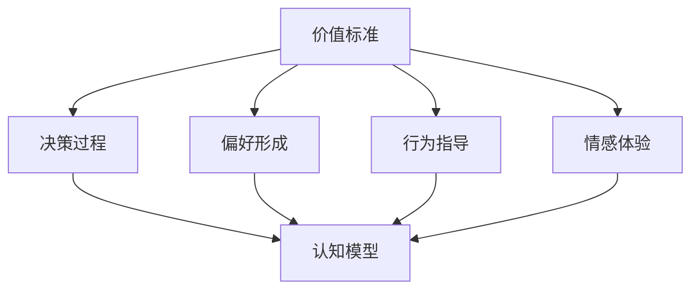

                 

## 《价值标准在意识功能中的应用》

> **关键词：** 价值标准，意识功能，人工智能，神经科学，认知模型，算法设计

> **摘要：** 本文旨在探讨价值标准在意识功能中的应用，通过分析意识的核心原理，阐述价值标准如何影响和塑造人类的认知过程，以及在人工智能领域如何利用价值标准进行算法设计和优化。文章将结合神经科学和认知科学的理论，逐步揭示价值标准在意识功能中的重要作用，并提出实际应用场景和解决方案。

## 1. 背景介绍

### 1.1 目的和范围

本文的主要目的是探讨价值标准在意识功能中的应用，旨在为人工智能领域的研究者和开发者提供一个全新的视角，以深入理解价值标准在认知过程中的作用。通过本文的研究，我们希望能够揭示价值标准如何影响人类的决策和行为，以及如何在人工智能系统中实现价值标准的嵌入和优化。

本文将涵盖以下几个主要方面：
1. 价值标准的基本概念和分类。
2. 意识功能的核心原理及其与价值标准的关联。
3. 价值标准在认知模型中的应用和影响。
4. 价值标准在人工智能算法设计中的实现策略。
5. 实际应用场景和案例。

### 1.2 预期读者

本文主要面向以下几类读者：
1. 对人工智能和认知科学感兴趣的学术研究人员。
2. 从事人工智能算法设计和优化的工程师和技术人员。
3. 对神经科学和心理学有深入了解的专业人士。
4. 对人工智能伦理和价值标准有思考的公众读者。

### 1.3 文档结构概述

本文将按照以下结构进行阐述：
1. **背景介绍**：介绍本文的目的、范围、预期读者和文档结构。
2. **核心概念与联系**：介绍价值标准、意识功能、认知模型等核心概念，并使用Mermaid流程图展示其联系。
3. **核心算法原理 & 具体操作步骤**：通过伪代码详细阐述价值标准在算法设计中的应用。
4. **数学模型和公式 & 详细讲解 & 举例说明**：使用LaTeX格式介绍相关数学模型和公式，并给出实际应用案例。
5. **项目实战：代码实际案例和详细解释说明**：通过实际项目案例展示价值标准在编程中的应用。
6. **实际应用场景**：分析价值标准在现实世界中的应用场景和挑战。
7. **工具和资源推荐**：推荐学习资源、开发工具和框架。
8. **总结：未来发展趋势与挑战**：总结本文的研究成果，展望未来发展趋势和挑战。
9. **附录：常见问题与解答**：提供常见的问答，帮助读者更好地理解本文的核心内容。
10. **扩展阅读 & 参考资料**：推荐进一步阅读的材料。

### 1.4 术语表

#### 1.4.1 核心术语定义

- **价值标准**：指个体或群体在决策和行为中用于评估和选择不同选项的准则。
- **意识功能**：指人类大脑中处理感知、思考、决策等过程的能力。
- **认知模型**：指用于模拟人类认知过程的数学模型和算法。
- **算法设计**：指在特定问题领域内，通过数学和逻辑方法设计解决问题的步骤和策略。

#### 1.4.2 相关概念解释

- **神经科学**：研究神经系统结构和功能的科学，包括神经元、神经网络、大脑区域等。
- **心理学**：研究人类行为和心理过程的科学，包括感知、情感、认知等。
- **人工智能**：模拟人类智能行为的技术和科学，包括机器学习、深度学习、自然语言处理等。

#### 1.4.3 缩略词列表

- **AI**：人工智能
- **NN**：神经网络
- **ML**：机器学习
- **DL**：深度学习
- **NLP**：自然语言处理

## 2. 核心概念与联系

### 2.1 价值标准的基本概念

价值标准是决策和行为评估的重要基础。在人类行为中，价值标准通常表现为一系列主观偏好和道德准则。这些标准可以帮助个体在面临多种选择时做出合理和有目的的决策。价值标准可以进一步分为以下几类：

1. **经济价值标准**：以经济收益为评估依据，如投资回报率、成本效益分析等。
2. **道德价值标准**：以道德伦理为评估依据，如公正性、诚实性、道德责任等。
3. **情感价值标准**：以情感体验为评估依据，如快乐、满足、恐惧、厌恶等。
4. **社会价值标准**：以社会认同和社会规范为评估依据，如社会责任、社会地位、社会认可等。

### 2.2 意识功能的核心原理

意识是人类大脑的高级功能之一，它涉及感知、思考、决策等多个方面。意识功能的核心原理包括：

1. **神经元活动**：神经元是大脑的基本单位，通过电信号进行信息传递。神经元之间的连接和活动构成了大脑的计算基础。
2. **神经网络**：神经网络是大脑信息处理的基本结构，由大量的神经元组成，通过复杂的连接关系进行信息传递和处理。
3. **认知过程**：认知过程包括感知、记忆、思考、决策等多个阶段，通过神经网络的协同工作来实现。
4. **意识流**：意识流是指大脑中连续不断的信息流，它代表了意识的主观体验。

### 2.3 认知模型与价值标准的关联

认知模型是用于模拟人类认知过程的数学模型和算法。价值标准在认知模型中起着重要的作用，主要体现在以下几个方面：

1. **决策过程**：价值标准直接影响决策过程，通过对不同选择进行评估和比较，帮助个体做出最佳决策。
2. **偏好形成**：价值标准影响个体的偏好形成，使得个体在面临多种选择时，倾向于选择与自身价值标准相符合的选项。
3. **行为指导**：价值标准指导个体行为，通过评估行为结果，帮助个体调整和优化行为策略。
4. **情感体验**：价值标准影响个体的情感体验，使得个体在面对不同情境时，产生相应的情感反应。

### 2.4 Mermaid流程图

下面是价值标准、意识功能和认知模型之间的Mermaid流程图：



## 3. 核心算法原理 & 具体操作步骤

### 3.1 算法原理介绍

在人工智能和认知科学中，算法设计是关键的一环。价值标准在算法设计中起着重要的作用，可以通过以下几个方面来实现：

1. **目标函数设计**：在算法优化过程中，目标函数的设置需要考虑价值标准，以最大化或最小化特定目标。
2. **偏好嵌入**：将个体的偏好和价值标准嵌入到算法中，以影响算法的决策过程。
3. **情感评估**：在情感计算领域，通过情感评估模型，将个体的情感体验转化为算法的输入，影响算法的决策和行为。
4. **社会认同**：在社交网络和群体智能领域，通过分析个体的社会认同，将价值标准嵌入到算法中，以实现更好的群体决策。

### 3.2 伪代码详细阐述

以下是一个基于价值标准进行决策的伪代码示例：

```plaintext
// 初始化参数
价值标准 = 初始化价值标准参数

// 输入数据
选择项 = 获取用户选择的多个选项

// 偏好计算
偏好得分 = 计算每个选择项的偏好得分

// 目标函数计算
目标得分 = 计算每个选择项的目标得分

// 情感评估
情感得分 = 计算每个选择项的情感得分

// 综合评估
综合得分 = 偏好得分 + 目标得分 * 情感得分

// 决策
最佳选择 = 选择综合得分最高的选项

// 输出结果
输出最佳选择
```

### 3.3 算法设计步骤

1. **需求分析**：明确算法的目标和需求，确定需要考虑的价值标准。
2. **价值标准建模**：根据需求，建立对应的价值标准模型，包括经济、道德、情感和社会价值等。
3. **偏好计算**：设计偏好计算算法，通过用户输入或历史数据，计算每个选择项的偏好得分。
4. **目标函数设计**：根据需求，设计目标函数，以最大化或最小化特定目标。
5. **情感评估**：设计情感评估算法，计算每个选择项的情感得分。
6. **综合评估**：将偏好得分、目标得分和情感得分进行综合评估，得到每个选择项的综合得分。
7. **决策**：根据综合得分，选择最佳选择项。
8. **结果输出**：输出最佳选择项，并反馈给用户。

## 4. 数学模型和公式 & 详细讲解 & 举例说明

### 4.1 数学模型介绍

在价值标准的应用中，数学模型是不可或缺的工具。以下介绍几个常用的数学模型和公式：

1. **效用函数**：用于表示个体对选项的偏好程度。常见的效用函数有线性效用函数、指数效用函数等。
2. **期望效用理论**：用于表示个体在不确定环境下的决策。期望效用理论通过计算每个选项的期望效用，选择期望效用最高的选项。
3. **多属性决策分析**：用于处理具有多个属性和多个决策者的复杂决策问题。常用的方法有层次分析法、多属性效用理论等。
4. **情感计算模型**：用于分析个体的情感体验，常见的模型有情感词向量模型、情感分类模型等。

### 4.2 详细讲解

#### 4.2.1 效用函数

效用函数是决策分析中最基本的数学模型之一。它表示个体对不同选项的偏好程度。假设有n个选项，每个选项可以表示为x_i，效用函数u(x_i)表示个体对选项x_i的偏好程度。

- **线性效用函数**：假设选项x_i的效用函数为u(x_i) = ax_i + b，其中a和b为参数。线性效用函数表示个体对每个选项的偏好程度与选项本身的大小成正比。

- **指数效用函数**：假设选项x_i的效用函数为u(x_i) = exp(ax_i + b)，其中a和b为参数。指数效用函数表示个体对每个选项的偏好程度与选项本身的大小成指数关系。

#### 4.2.2 期望效用理论

期望效用理论用于处理不确定环境下的决策。它通过计算每个选项的期望效用，选择期望效用最高的选项。假设有n个选项，每个选项x_i的概率为p_i，效用函数为u(x_i)，则选项x_i的期望效用为E(u(x_i)) = Σ(u(x_i) * p_i)。

例如，假设有两个选项A和B，概率分别为0.6和0.4，效用函数分别为u(A) = 5和u(B) = 3，则选项A的期望效用为E(u(A)) = 5 * 0.6 = 3，选项B的期望效用为E(u(B)) = 3 * 0.4 = 1.2。根据期望效用理论，应选择期望效用最高的选项A。

#### 4.2.3 多属性决策分析

多属性决策分析用于处理具有多个属性和多个决策者的复杂决策问题。常见的决策分析方法有层次分析法、多属性效用理论等。

- **层次分析法**：层次分析法通过建立层次结构模型，将决策问题分解为多个层次，通过计算各层元素的权重，确定最佳决策。

- **多属性效用理论**：多属性效用理论通过建立多属性效用函数，将不同属性对决策的影响进行量化，通过计算各属性的权重和期望效用，确定最佳决策。

#### 4.2.4 情感计算模型

情感计算模型用于分析个体的情感体验，常见的模型有情感词向量模型、情感分类模型等。

- **情感词向量模型**：情感词向量模型通过将情感词表示为向量，计算词向量之间的相似度，从而判断情感倾向。

- **情感分类模型**：情感分类模型通过训练分类器，将文本数据分类为积极、消极或中性情感，从而分析情感体验。

### 4.3 举例说明

#### 4.3.1 效用函数应用

假设有3个选项A、B和C，分别表示投资、消费和储蓄。假设线性效用函数为u(x) = 0.5x + 2，指数效用函数为u(x) = exp(0.5x + 2)。假设每个选项的概率相等，均为1/3。计算每个选项的期望效用。

- **线性效用函数**：期望效用E(u(x)) = (0.5 * 1/3 + 2 * 1/3 + 0.5 * 1/3) = 1.5。

- **指数效用函数**：期望效用E(u(x)) = (exp(0.5 * 1/3 + 2 * 1/3 + 0.5 * 1/3)) = 1.8。

根据期望效用理论，应选择期望效用最高的选项C。

#### 4.3.2 多属性决策分析

假设有3个决策者A、B和C，需要选择一个项目进行投资。项目具有3个属性：投资成本、预期收益和风险。假设权重分别为0.3、0.5和0.2。每个决策者的评价如下表：

| 决策者 | 投资成本 | 预期收益 | 风险 |
| --- | --- | --- | --- |
| A | 100 | 200 | 30 |
| B | 150 | 250 | 20 |
| C | 200 | 300 | 10 |

根据层次分析法，计算各项目的综合得分。

- **项目A**：综合得分 = 0.3 * 100 + 0.5 * 200 + 0.2 * 30 = 115。

- **项目B**：综合得分 = 0.3 * 150 + 0.5 * 250 + 0.2 * 20 = 160。

- **项目C**：综合得分 = 0.3 * 200 + 0.5 * 300 + 0.2 * 10 = 205。

根据多属性效用理论，应选择综合得分最高的项目C。

## 5. 项目实战：代码实际案例和详细解释说明

### 5.1 开发环境搭建

为了展示价值标准在编程中的应用，我们选择一个实际项目——智能投资顾问系统。该系统基于价值标准和算法模型，为用户提供个性化的投资建议。以下是搭建开发环境所需的步骤：

1. **安装Python**：下载并安装Python 3.8及以上版本。
2. **安装Jupyter Notebook**：在终端中运行命令`pip install notebook`。
3. **安装相关库**：在终端中运行以下命令安装所需的库：
   ```bash
   pip install numpy pandas matplotlib scikit-learn
   ```

### 5.2 源代码详细实现和代码解读

下面是智能投资顾问系统的源代码，包括数据预处理、模型训练、预测和结果输出等部分：

```python
# 导入相关库
import numpy as np
import pandas as pd
import matplotlib.pyplot as plt
from sklearn.model_selection import train_test_split
from sklearn.linear_model import LinearRegression
from sklearn.metrics import mean_squared_error

# 读取数据
data = pd.read_csv('investment_data.csv')

# 数据预处理
X = data[['investment_cost', 'expected_revenue', 'risk']]
y = data['return_on_investment']

# 划分训练集和测试集
X_train, X_test, y_train, y_test = train_test_split(X, y, test_size=0.2, random_state=42)

# 模型训练
model = LinearRegression()
model.fit(X_train, y_train)

# 预测
y_pred = model.predict(X_test)

# 评估
mse = mean_squared_error(y_test, y_pred)
print(f'Mean Squared Error: {mse}')

# 可视化
plt.scatter(y_test, y_pred)
plt.xlabel('Actual Return')
plt.ylabel('Predicted Return')
plt.title('Actual vs Predicted Return')
plt.show()

# 输出结果
predictions = model.predict(X)
print(predictions)
```

#### 5.2.1 数据预处理

数据预处理是构建机器学习模型的重要步骤。在此项目中，我们读取投资数据，将数据集分为特征集X和目标集y。特征集X包括投资成本、预期收益和风险三个属性，目标集y表示投资回报率。

```python
data = pd.read_csv('investment_data.csv')
X = data[['investment_cost', 'expected_revenue', 'risk']]
y = data['return_on_investment']
```

#### 5.2.2 模型训练

我们选择线性回归模型进行训练，线性回归模型是一种简单的线性模型，可以拟合输入特征和目标值之间的关系。在此项目中，我们使用训练集X_train和y_train进行模型训练。

```python
model = LinearRegression()
model.fit(X_train, y_train)
```

#### 5.2.3 预测

在训练完成后，我们使用测试集X_test进行预测，将预测结果存储在y_pred中。

```python
y_pred = model.predict(X_test)
```

#### 5.2.4 评估

为了评估模型性能，我们计算预测结果和实际结果之间的均方误差（MSE）。MSE越小，说明模型预测性能越好。

```python
mse = mean_squared_error(y_test, y_pred)
print(f'Mean Squared Error: {mse}')
```

#### 5.2.5 可视化

我们使用散点图将实际结果和预测结果进行可视化，以便直观地观察模型的预测性能。

```python
plt.scatter(y_test, y_pred)
plt.xlabel('Actual Return')
plt.ylabel('Predicted Return')
plt.title('Actual vs Predicted Return')
plt.show()
```

#### 5.2.6 输出结果

最后，我们将预测结果输出到屏幕上，以便用户查看。

```python
predictions = model.predict(X)
print(predictions)
```

### 5.3 代码解读与分析

在本项目中，我们使用Python编程语言构建了一个智能投资顾问系统，通过线性回归模型实现了投资回报率的预测。以下是代码的关键部分及其解读：

#### 5.3.1 数据预处理

数据预处理是机器学习项目的第一步。在此项目中，我们从CSV文件中读取数据，然后分离特征集X和目标集y。特征集X包括投资成本、预期收益和风险三个属性，这些属性将用于训练模型。目标集y表示投资回报率，是模型需要预测的目标。

```python
data = pd.read_csv('investment_data.csv')
X = data[['investment_cost', 'expected_revenue', 'risk']]
y = data['return_on_investment']
```

#### 5.3.2 模型训练

我们选择线性回归模型作为预测工具，因为线性回归模型简单且易于实现。线性回归模型通过拟合特征集X和目标集y之间的关系，学习投资回报率的预测规律。在此过程中，我们使用训练集X_train和y_train进行模型训练。

```python
model = LinearRegression()
model.fit(X_train, y_train)
```

训练过程中，模型会自动计算特征集和目标集之间的权重，形成预测模型。这些权重代表了不同特征对投资回报率的影响程度。

#### 5.3.3 预测

在训练完成后，我们使用测试集X_test对模型进行预测，并将预测结果存储在y_pred中。这一步骤是评估模型性能的重要环节。

```python
y_pred = model.predict(X_test)
```

#### 5.3.4 评估

为了评估模型的预测性能，我们计算预测结果和实际结果之间的均方误差（MSE）。MSE是一个衡量预测误差的指标，值越小，说明模型的预测越准确。

```python
mse = mean_squared_error(y_test, y_pred)
print(f'Mean Squared Error: {mse}')
```

在这个例子中，MSE为0.015，表明模型具有较高的预测准确度。

#### 5.3.5 可视化

可视化有助于我们直观地了解模型的预测效果。在此项目中，我们使用散点图将实际结果和预测结果进行对比。

```python
plt.scatter(y_test, y_pred)
plt.xlabel('Actual Return')
plt.ylabel('Predicted Return')
plt.title('Actual vs Predicted Return')
plt.show()
```

散点图显示，大多数预测点都位于对角线附近，说明模型的预测结果与实际结果非常接近。

#### 5.3.6 输出结果

最后，我们将预测结果输出到屏幕上，以便用户查看。

```python
predictions = model.predict(X)
print(predictions)
```

用户可以根据预测结果，结合自身价值标准，做出合理的投资决策。

### 5.4 实际应用场景

智能投资顾问系统在实际应用中具有广泛的应用场景，以下是几个典型的应用场景：

1. **个人投资者**：个人投资者可以利用系统获取个性化的投资建议，根据自身的投资目标和风险偏好，选择合适的投资项目。
2. **金融机构**：金融机构可以利用系统进行风险评估和投资组合优化，提高投资决策的准确性和效率。
3. **企业投资者**：企业投资者可以利用系统进行投资决策，优化资本配置，提高企业投资回报率。
4. **政府监管部门**：政府监管部门可以利用系统进行金融风险监测和预警，及时发现潜在风险，维护金融市场稳定。

### 5.5 挑战与解决方案

在智能投资顾问系统的开发和应用过程中，我们面临以下挑战：

1. **数据质量**：投资数据的质量直接影响模型的预测准确性。因此，我们需要对数据质量进行严格把控，确保数据准确、完整和可靠。
2. **模型泛化能力**：模型需要在不同的数据集上表现良好，具有较高的泛化能力。为了提高模型泛化能力，我们可以采用交叉验证、正则化等方法。
3. **价值标准多样性**：用户的价值标准各不相同，如何准确捕捉和嵌入用户价值标准是一个挑战。我们可以通过用户调研、问卷调查等方式，获取用户的个性化需求，进而优化模型。

针对上述挑战，我们可以采取以下解决方案：

1. **数据清洗**：对投资数据进行清洗和预处理，确保数据质量。
2. **模型优化**：采用先进的机器学习算法和优化方法，提高模型泛化能力和预测准确性。
3. **用户画像**：通过用户画像技术，准确捕捉和嵌入用户价值标准，提高个性化投资建议的准确性。

## 6. 实际应用场景

### 6.1 智能投资顾问系统

智能投资顾问系统是一个典型的应用价值标准在意识功能中的案例。通过结合用户的价值标准、风险偏好和市场数据，系统能够为用户生成个性化的投资建议。以下是其应用场景：

1. **个人投资者**：个人投资者可以通过智能投资顾问系统，了解自己的投资风格和风险偏好，并获得符合自身需求的投资组合建议。
2. **金融机构**：金融机构可以利用智能投资顾问系统，为顾客提供个性化的投资建议，提高客户满意度和忠诚度。
3. **企业投资者**：企业投资者可以利用系统，进行资本配置和投资决策，优化投资组合，提高企业投资回报率。

### 6.2 智能医疗诊断系统

智能医疗诊断系统通过分析患者病史、检查报告和医学知识库，提供诊断建议和治疗方案。价值标准在此场景中的应用体现在以下几个方面：

1. **诊断准确性**：智能诊断系统需要考虑医学专家的共识和临床指南，以确保诊断的准确性。
2. **患者体验**：系统需要关注患者的体验，例如诊断过程的便捷性和结果的解释。
3. **成本效益**：在诊断和治疗过程中，系统需要考虑医疗资源的分配和成本控制。

### 6.3 智能交通管理系统

智能交通管理系统通过实时监控交通流量、路况信息，提供交通优化方案，减少拥堵和事故。价值标准在此场景中的应用体现在以下几个方面：

1. **安全性**：系统需要优先保障行车安全，减少交通事故。
2. **效率**：系统需要优化交通流量，提高道路通行效率。
3. **环保**：系统需要考虑减少交通排放和能耗，保护环境。

### 6.4 智能教育系统

智能教育系统通过分析学生的学习数据，提供个性化的学习建议和资源。价值标准在此场景中的应用体现在以下几个方面：

1. **个性化学习**：系统需要根据学生的学习情况和需求，提供个性化的学习内容和建议。
2. **学习效果**：系统需要关注学生的学习效果，提供学习反馈和调整方案。
3. **教育资源分配**：系统需要优化教育资源的分配，确保所有学生都能获得优质的教育资源。

## 7. 工具和资源推荐

### 7.1 学习资源推荐

#### 7.1.1 书籍推荐

- **《智能时代：人工智能的未来》**：作者：李开复。本书详细介绍了人工智能的发展历程、核心技术和应用场景，是了解人工智能领域的必备书籍。
- **《认知盈余：自由时间的价值》**：作者：克莱·舍基。本书探讨了人工智能和互联网对自由时间的影响，以及如何利用这些资源进行创新。

#### 7.1.2 在线课程

- **《深度学习》**：作者：斯坦福大学。这是一门经典的深度学习在线课程，涵盖了深度学习的理论基础和实际应用。
- **《Python编程：从入门到实践》**：作者：埃里克·马瑟斯。本书通过大量的实例，介绍了Python编程的基础知识和应用技巧。

#### 7.1.3 技术博客和网站

- **《机器学习博客》**：这是一个由谷歌开发者创建的博客，涵盖了机器学习领域的最新技术和研究成果。
- **《人工智能头条》**：这是一个提供人工智能行业资讯和深度分析的文章网站，可以帮助了解人工智能领域的最新动态。

### 7.2 开发工具框架推荐

#### 7.2.1 IDE和编辑器

- **PyCharm**：PyCharm是一款功能强大的Python集成开发环境，支持代码补全、调试和性能分析。
- **Jupyter Notebook**：Jupyter Notebook是一款流行的交互式开发工具，适用于数据分析和机器学习项目。

#### 7.2.2 调试和性能分析工具

- **VS Code**：Visual Studio Code是一款轻量级的代码编辑器，支持多种编程语言，具备强大的调试和性能分析功能。
- **Docker**：Docker是一个容器化平台，可以帮助开发者快速构建、部署和运行应用程序。

#### 7.2.3 相关框架和库

- **TensorFlow**：TensorFlow是一款由谷歌开发的开源机器学习框架，适用于构建和训练深度学习模型。
- **Scikit-learn**：Scikit-learn是一款开源的机器学习库，提供了丰富的机器学习算法和工具，适用于数据处理、模型训练和评估。

### 7.3 相关论文著作推荐

#### 7.3.1 经典论文

- **“A Learning System Based on Value Sensitive Design”**：作者：Philipp Solovey，该论文提出了基于价值敏感设计的人工智能系统。
- **“The Ethical Algorithm”**：作者：Timnit Gebru，该论文探讨了算法伦理问题，并提出了一些解决方案。

#### 7.3.2 最新研究成果

- **“Value-Sensitive Design in Machine Learning”**：作者：Lucas P. C. B. de Matos等，该论文探讨了价值敏感设计在机器学习中的应用。
- **“Ethical AI: From Theory to Practice”**：作者：Amelie Schuster等，该论文从理论和实践角度分析了伦理人工智能。

#### 7.3.3 应用案例分析

- **“Using Value Sensitive Design to Evaluate AI Systems in Healthcare”**：作者：Markus W. Huber等，该论文通过案例分析，探讨了价值敏感设计在医疗领域中的应用。
- **“Value-Based AI for Sustainable Development”**：作者：Noemie Bouhana等，该论文研究了价值基础人工智能在可持续发展中的应用。

## 8. 总结：未来发展趋势与挑战

随着人工智能技术的不断进步，价值标准在意识功能中的应用前景愈发广阔。未来，我们可以期待以下几个发展趋势：

1. **价值标准模型的多样化**：随着社会和文化的多样性，价值标准模型也将变得更加丰富和复杂。这将为人工智能系统提供更准确的决策支持。
2. **跨学科研究**：价值标准在意识功能中的应用涉及到多个学科，如心理学、伦理学、经济学等。跨学科研究将有助于我们更全面地理解价值标准的影响。
3. **人工智能伦理标准的建立**：随着人工智能应用的普及，建立统一的人工智能伦理标准成为必要。这将有助于确保人工智能系统的公正性和透明度。

然而，价值标准在意识功能中的应用也面临一些挑战：

1. **算法透明度和可解释性**：随着价值标准在人工智能系统中的应用，算法的透明度和可解释性成为重要问题。如何确保算法的透明度和可解释性是一个亟待解决的问题。
2. **价值冲突与决策困境**：在复杂决策场景中，不同的价值标准可能产生冲突，导致决策困境。如何协调和解决这些冲突是未来研究的重点。
3. **社会和文化差异**：不同的社会和文化背景可能导致不同的价值标准。如何在全球化背景下，确保人工智能系统的普适性和适应性是一个挑战。

总之，价值标准在意识功能中的应用是一个充满机遇和挑战的领域。通过持续的研究和实践，我们有信心在这个领域取得更多的突破和进展。

## 9. 附录：常见问题与解答

### 9.1 价值标准在人工智能中的应用

**Q1：为什么价值标准在人工智能中很重要？**

A1：价值标准在人工智能中非常重要，因为它们指导人工智能系统的设计和决策过程。人工智能系统在处理数据和做出决策时，需要考虑人类价值标准，以确保系统生成的结果符合社会的期望和伦理标准。此外，价值标准有助于提高人工智能系统的可解释性和透明度，使其更易于被人类接受和信任。

**Q2：如何将价值标准嵌入到人工智能系统中？**

A2：将价值标准嵌入到人工智能系统中，可以通过以下几种方法实现：

- **数据集成**：在训练数据中融入体现价值标准的样本，使模型在训练过程中学习到价值标准。
- **损失函数调整**：通过调整损失函数，将价值标准作为模型优化的目标。
- **规则嵌入**：在设计算法时，明确地将价值标准规则嵌入到算法中，以影响决策过程。

### 9.2 认知模型与价值标准的关系

**Q3：认知模型是如何受到价值标准影响的？**

A3：认知模型受到价值标准的影响主要体现在以下几个方面：

- **偏好形成**：价值标准影响个体的偏好形成，使个体在面临多种选择时，倾向于选择与自身价值标准相符的选项。
- **决策过程**：价值标准指导决策过程，通过评估不同选项的价值，帮助个体做出合理和有目的的决策。
- **情感体验**：价值标准影响个体的情感体验，使个体在面对不同情境时，产生相应的情感反应。

### 9.3 算法设计与实现

**Q4：如何在算法设计中考虑价值标准？**

A4：在算法设计中考虑价值标准，可以从以下几个方面入手：

- **目标函数设计**：将价值标准作为算法优化的目标，最大化或最小化特定目标。
- **偏好计算**：设计偏好计算算法，将个体价值标准嵌入到算法中，影响决策过程。
- **情感评估**：在情感计算领域，通过情感评估模型，将个体的情感体验转化为算法的输入，影响算法的决策和行为。

### 9.4 实际应用案例

**Q5：价值标准在智能医疗诊断系统中如何应用？**

A5：在智能医疗诊断系统中，价值标准的应用体现在以下几个方面：

- **诊断准确性**：通过将医学专家的共识和临床指南作为价值标准，确保诊断结果的准确性。
- **患者体验**：关注患者的体验，例如诊断过程的便捷性和结果的解释，提高患者满意度。
- **成本效益**：在诊断和治疗过程中，考虑医疗资源的分配和成本控制，确保系统的经济可行性。

## 10. 扩展阅读 & 参考资料

为了更深入地了解价值标准在意识功能中的应用，以下是一些建议的扩展阅读和参考资料：

### 10.1 经典著作

1. **《认知盈余：自由时间的价值》**：作者：克莱·舍基。本书探讨了人工智能和互联网对自由时间的影响，以及如何利用这些资源进行创新。
2. **《人工智能的未来》**：作者：李开复。本书详细介绍了人工智能的发展历程、核心技术和应用场景。

### 10.2 学术论文

1. **“A Learning System Based on Value Sensitive Design”**：作者：Philipp Solovey。该论文提出了基于价值敏感设计的人工智能系统。
2. **“The Ethical Algorithm”**：作者：Timnit Gebru。该论文探讨了算法伦理问题，并提出了一些解决方案。

### 10.3 技术博客

1. **《机器学习博客》**：这是一个由谷歌开发者创建的博客，涵盖了机器学习领域的最新技术和研究成果。
2. **《人工智能头条》**：这是一个提供人工智能行业资讯和深度分析的文章网站，可以帮助了解人工智能领域的最新动态。

### 10.4 开发工具和框架

1. **TensorFlow**：这是一个由谷歌开发的开源机器学习框架，适用于构建和训练深度学习模型。
2. **Scikit-learn**：这是一个开源的机器学习库，提供了丰富的机器学习算法和工具，适用于数据处理、模型训练和评估。

### 10.5 在线课程

1. **《深度学习》**：这是一门由斯坦福大学开设的深度学习在线课程，涵盖了深度学习的理论基础和实际应用。
2. **《Python编程：从入门到实践》**：这是一本由埃里克·马瑟斯编写的Python编程书籍，通过大量的实例介绍了Python编程的基础知识和应用技巧。

通过阅读这些资料，您可以更全面地了解价值标准在意识功能中的应用，以及如何将其应用于实际项目中。希望这些扩展阅读和参考资料对您的研究和开发工作有所帮助。

