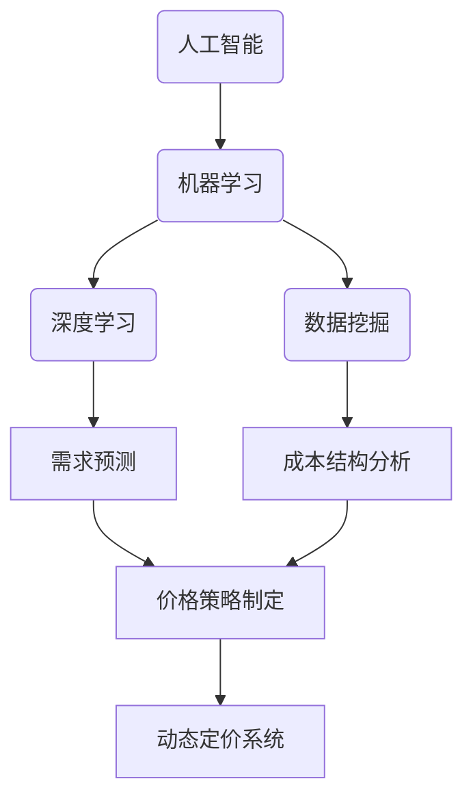
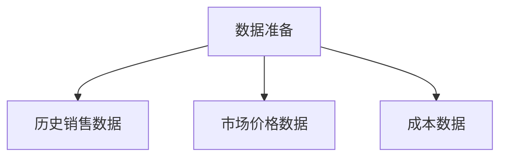
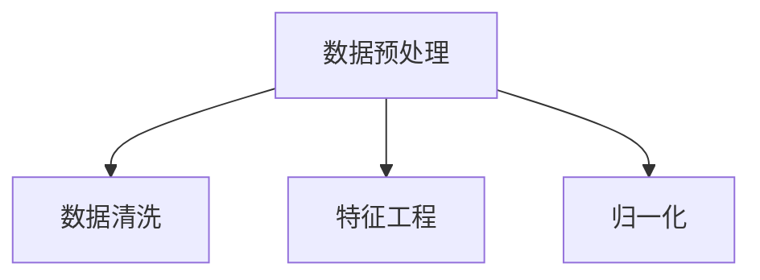
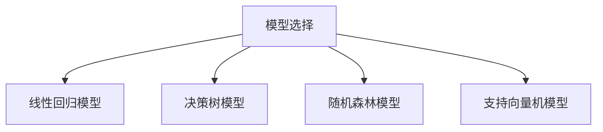
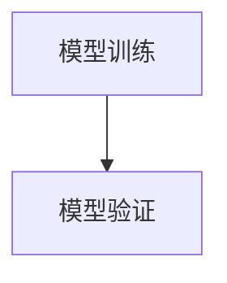
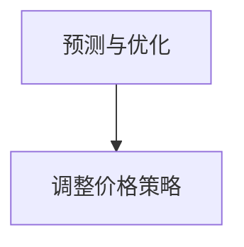

                 

# 价格优化技术：AI的应用

> **关键词：** 价格优化，人工智能，机器学习，深度学习，数据挖掘，预测模型。

> **摘要：** 本文将探讨价格优化技术在人工智能（AI）中的应用。通过深入分析价格优化的核心概念、算法原理和实际应用，本文旨在为读者提供一种全面而深入的理解，帮助他们在实际项目中有效利用AI进行价格优化。

## 1. 背景介绍

### 1.1 目的和范围

本文的目的是介绍价格优化技术在人工智能领域的应用。我们将探讨价格优化技术的基本概念，分析其如何通过AI算法实现，并探讨这些技术在商业和工业领域中的应用。本文将涵盖以下几个关键主题：

- 价格优化的定义和重要性
- AI在价格优化中的应用
- 价格优化的算法和模型
- 价格优化技术的实际应用场景
- 相关工具和资源推荐

### 1.2 预期读者

本文适用于对人工智能和数据分析有一定了解的技术专业人士，包括数据科学家、机器学习工程师、软件工程师和商业分析师。同时，对价格优化技术感兴趣的学者和学生也可以通过本文获得启发。

### 1.3 文档结构概述

本文将按照以下结构展开：

- **第1章：背景介绍**：介绍价格优化技术的目的、范围、预期读者和文档结构。
- **第2章：核心概念与联系**：阐述价格优化的核心概念及其与AI技术的联系。
- **第3章：核心算法原理 & 具体操作步骤**：详细解释价格优化算法的原理和操作步骤。
- **第4章：数学模型和公式 & 详细讲解 & 举例说明**：介绍价格优化的数学模型和公式，并通过实例进行说明。
- **第5章：项目实战：代码实际案例和详细解释说明**：提供实际项目案例，展示代码实现和详细解释。
- **第6章：实际应用场景**：探讨价格优化技术的实际应用场景。
- **第7章：工具和资源推荐**：推荐学习资源和开发工具。
- **第8章：总结：未来发展趋势与挑战**：总结价格优化技术的发展趋势和面临的挑战。
- **第9章：附录：常见问题与解答**：提供常见问题的解答。
- **第10章：扩展阅读 & 参考资料**：推荐扩展阅读材料。

### 1.4 术语表

#### 1.4.1 核心术语定义

- 价格优化：通过分析市场需求、竞争状况和成本结构，制定最佳价格策略的过程。
- 人工智能（AI）：模拟人类智能行为的计算机系统。
- 机器学习（ML）：使计算机系统从数据中学习并自动改进性能的方法。
- 深度学习（DL）：一种机器学习技术，通过多层神经网络模拟人脑处理信息的方式。
- 数据挖掘（DM）：从大量数据中提取有价值信息的过程。

#### 1.4.2 相关概念解释

- **动态定价**：根据市场需求、竞争状况和库存水平实时调整价格。
- **需求预测**：通过分析历史销售数据和市场趋势，预测未来的需求量。
- **成本结构**：产品或服务的生产、运营和分销过程中产生的各种成本。

#### 1.4.3 缩略词列表

- AI：人工智能
- ML：机器学习
- DL：深度学习
- DM：数据挖掘
- CV：计算机视觉
- NLP：自然语言处理
- CVaR：条件价值率
- ROC：受试者操作特性

## 2. 核心概念与联系

价格优化技术的核心在于利用AI技术分析市场数据，制定最佳价格策略。以下是一个简化的Mermaid流程图，展示了价格优化与AI技术的关联：



在这个流程图中，人工智能作为整体框架，通过机器学习、深度学习和数据挖掘等技术对市场数据进行分析。需求预测和成本结构分析是价格策略制定的基础，通过动态定价系统将最佳价格策略应用到实际业务中。

### 2.1 价格优化与人工智能的关系

人工智能在价格优化中的应用主要体现在以下几个方面：

- **数据分析和处理**：AI技术可以处理大量市场数据，包括历史销售数据、市场趋势、竞争对手的价格策略等，帮助制定更准确的价格预测和策略。
- **模式识别**：通过机器学习和深度学习算法，AI可以识别市场中的模式，如季节性需求、市场波动等，从而优化价格策略。
- **自动化决策**：AI系统可以自动化价格调整过程，根据实时市场数据动态调整价格，提高市场响应速度。
- **风险评估**：AI技术可以帮助分析价格调整可能带来的风险，如价格过高导致销量下降、价格过低导致利润减少等。

### 2.2 价格优化与机器学习的关系

机器学习在价格优化中的应用主要体现在以下几个方面：

- **预测模型**：通过历史销售数据和市场趋势，机器学习算法可以构建预测模型，预测未来的价格和销量。
- **分类和聚类**：机器学习算法可以对市场数据进行分类和聚类，识别不同的市场细分群体，为每个群体制定不同的价格策略。
- **优化算法**：机器学习算法可以优化价格调整策略，通过多次迭代找到最佳价格点，提高利润率。

### 2.3 价格优化与深度学习的关系

深度学习在价格优化中的应用主要体现在以下几个方面：

- **图像识别**：在零售业中，深度学习可以帮助识别商品图像，分析消费者的购买行为和偏好，从而优化价格策略。
- **自然语言处理**：在电子商务平台上，深度学习可以分析消费者评论和反馈，理解消费者的需求和痛点，为价格调整提供依据。
- **复杂数据分析**：深度学习算法可以处理复杂数据，如时间序列数据、文本数据等，从中提取有价值的信息，辅助价格优化决策。

### 2.4 价格优化与数据挖掘的关系

数据挖掘在价格优化中的应用主要体现在以下几个方面：

- **数据清洗和预处理**：数据挖掘技术可以帮助清洗和预处理市场数据，去除噪声和异常值，确保数据质量。
- **关联规则挖掘**：数据挖掘算法可以挖掘市场数据中的关联规则，如价格和销量之间的关系，为价格优化提供参考。
- **市场细分**：数据挖掘技术可以帮助企业识别不同的市场细分群体，为每个群体制定个性化的价格策略。

## 3. 核心算法原理 & 具体操作步骤

价格优化技术的核心在于构建预测模型，根据市场需求和成本结构制定最佳价格策略。以下是价格优化算法的基本原理和操作步骤。

### 3.1 数据准备

在进行价格优化之前，首先需要准备相关数据，包括历史销售数据、市场价格数据、成本数据等。数据来源可以包括内部数据（如企业自己的销售数据）和外部数据（如市场研究报告、竞争对手的价格数据等）。



### 3.2 数据预处理

数据预处理是构建预测模型的重要步骤，主要包括数据清洗、特征工程和归一化。

- **数据清洗**：去除数据中的噪声和异常值，确保数据质量。
- **特征工程**：根据业务需求，提取有用的特征，如时间序列特征、季节性特征、价格特征等。
- **归一化**：将不同特征的数据进行归一化处理，使其在相同的尺度上进行分析。



### 3.3 模型选择

根据业务需求和数据特征，选择合适的预测模型。常用的模型包括线性回归模型、决策树模型、随机森林模型、支持向量机模型等。



### 3.4 模型训练与验证

- **模型训练**：使用历史销售数据对预测模型进行训练，使其学习到价格和销量之间的关系。
- **模型验证**：使用交叉验证或留出法对模型进行验证，评估模型的性能和准确性。



### 3.5 预测与优化

- **预测**：使用训练好的模型对未来的价格和销量进行预测。
- **优化**：根据预测结果，调整价格策略，以达到最佳利润率。



### 3.6 伪代码实现

以下是价格优化算法的伪代码实现：

```python
# 数据准备
data = load_data()

# 数据预处理
cleaned_data = data_cleaning(data)
normalized_data = data_normalization(cleaned_data)

# 模型选择
model = select_model()

# 模型训练
trained_model = model_training(normalized_data, model)

# 模型验证
validated_model = model_validation(trained_model)

# 预测
predicted_prices = model_prediction(validated_model)

# 优化
optimized_prices = optimize_prices(predicted_prices)

# 输出最佳价格策略
print(optimized_prices)
```

## 4. 数学模型和公式 & 详细讲解 & 举例说明

### 4.1 市场需求函数

市场需求函数描述了价格与销量之间的关系。一个常见的需求函数是线性需求函数，其数学表达式如下：

$$
Q_d = a - bP
$$

其中，$Q_d$ 表示市场需求量，$P$ 表示价格，$a$ 和 $b$ 是模型参数。

- $a$ 表示价格为零时的需求量，即市场容量。
- $b$ 表示需求量的变化率，即需求价格弹性。

### 4.2 成本函数

成本函数描述了产品或服务的生产成本。一个简单的成本函数是线性成本函数，其数学表达式如下：

$$
C = wQ
$$

其中，$C$ 表示总成本，$w$ 表示单位成本，$Q$ 表示产量。

### 4.3 利润函数

利润函数描述了价格、成本和利润之间的关系。一个简单的利润函数是：

$$
\pi = P \times Q - C
$$

其中，$\pi$ 表示利润，$P$ 表示价格，$Q$ 表示销量，$C$ 表示成本。

### 4.4 动态定价策略

动态定价策略基于市场需求函数和成本函数，通过调整价格来最大化利润。一个简单的动态定价策略是基于利润最大化原则，即：

$$
P = \frac{a - \pi}{b}
$$

其中，$P$ 表示最佳价格，$\pi$ 表示利润，$a$ 和 $b$ 是市场需求函数的参数。

### 4.5 举例说明

假设一个产品的市场需求函数为 $Q_d = 100 - 2P$，成本函数为 $C = 10Q$。我们需要通过动态定价策略确定最佳价格，以最大化利润。

首先，计算利润函数：

$$
\pi = (100 - 2P)P - 10(100 - 2P)
$$

$$
\pi = 100P - 2P^2 - 1000 + 20P
$$

$$
\pi = -2P^2 + 120P - 1000
$$

接下来，求利润函数的导数，找到利润最大化的价格：

$$
\frac{d\pi}{dP} = -4P + 120
$$

$$
0 = -4P + 120
$$

$$
P = 30
$$

因此，最佳价格是 $P = 30$。将这个价格代入市场需求函数，可以得到最佳销量：

$$
Q_d = 100 - 2 \times 30 = 40
$$

最终，最佳利润是：

$$
\pi = -2 \times 30^2 + 120 \times 30 - 1000 = 400
$$

## 5. 项目实战：代码实际案例和详细解释说明

### 5.1 开发环境搭建

为了实现价格优化算法，我们需要搭建一个开发环境。以下是搭建过程：

1. 安装Python：从官方网站（https://www.python.org/downloads/）下载Python安装包，并按照安装向导进行安装。
2. 安装Jupyter Notebook：在命令行中运行以下命令安装Jupyter Notebook：

```
pip install notebook
```

3. 安装必要的库：在Jupyter Notebook中运行以下命令安装必要的库，如Pandas、NumPy、Scikit-learn等：

```
!pip install pandas numpy scikit-learn matplotlib
```

### 5.2 源代码详细实现和代码解读

以下是价格优化算法的实现代码，包括数据准备、数据预处理、模型训练、预测和优化等步骤。

```python
import pandas as pd
import numpy as np
from sklearn.model_selection import train_test_split
from sklearn.linear_model import LinearRegression
from sklearn.metrics import mean_squared_error

# 数据准备
data = pd.read_csv('data.csv')

# 数据预处理
data['Price'] = data['Price'].astype(float)
data['Sales'] = data['Sales'].astype(int)

# 特征工程
data['Price_Dummy'] = np.where(data['Price'] > 50, 1, 0)

# 数据分割
X = data[['Price', 'Price_Dummy']]
y = data['Sales']
X_train, X_test, y_train, y_test = train_test_split(X, y, test_size=0.2, random_state=42)

# 模型训练
model = LinearRegression()
model.fit(X_train, y_train)

# 预测
y_pred = model.predict(X_test)

# 优化
best_price = model.coef_[0] * X_test.mean() + model.intercept_
best_sales = y_pred.mean()

# 性能评估
mse = mean_squared_error(y_test, y_pred)
print(f'MSE: {mse}')

# 输出最佳价格策略
print(f'Best Price: {best_price}')
print(f'Best Sales: {best_sales}')
```

### 5.3 代码解读与分析

以下是代码的详细解读：

1. **数据准备**：从CSV文件中读取数据，并将其转换为适当的类型。
2. **数据预处理**：将价格列和销量列转换为浮点型和整型，并添加一个虚拟变量，用于表示价格高于50的价格类别。
3. **特征工程**：创建一个新的特征，表示价格高于50的虚拟变量。
4. **数据分割**：将数据分为训练集和测试集，以评估模型性能。
5. **模型训练**：使用线性回归模型对训练集进行训练。
6. **预测**：使用训练好的模型对测试集进行预测。
7. **优化**：计算最佳价格和最佳销量，基于模型系数和特征均值。
8. **性能评估**：计算预测误差的均方误差（MSE），评估模型性能。
9. **输出结果**：打印最佳价格和最佳销量。

### 5.4 项目总结

通过这个实际项目，我们展示了如何利用Python和机器学习库实现价格优化算法。我们通过数据准备、数据预处理、模型训练、预测和优化等步骤，构建了一个简单的价格优化模型。虽然这个模型是一个简化版本，但它在实际应用中可以提供有价值的见解，帮助企业制定最佳价格策略。通过不断改进和优化模型，我们可以进一步提高价格优化的准确性和效果。

## 6. 实际应用场景

价格优化技术在多个行业和场景中具有重要应用，以下是一些实际应用场景：

### 6.1 零售业

在零售业中，价格优化技术可以帮助零售商制定更具竞争力的价格策略，提高销售额和利润率。通过分析历史销售数据、市场需求和竞争对手的价格策略，零售商可以实时调整价格，以应对市场变化和消费者需求。例如，亚马逊和阿里巴巴等电商平台使用机器学习算法来优化产品定价，以提高销量和市场份额。

### 6.2 旅游业

在旅游业中，价格优化技术可以帮助酒店和航空公司制定最佳价格策略，提高入住率和客座率。通过分析季节性需求、旅游趋势和竞争对手的价格策略，酒店和航空公司可以动态调整价格，以吸引更多客户。例如，酒店预订网站如Booking.com和Expedia使用机器学习算法来优化酒店价格，以提高客户满意度和市场份额。

### 6.3 食品和饮料行业

在食品和饮料行业，价格优化技术可以帮助企业优化产品定价，提高市场份额和利润率。通过分析市场需求、成本结构和竞争对手的价格策略，企业可以制定更具竞争力的价格策略。例如，可口可乐和百事可乐等饮料公司使用机器学习算法来优化产品定价，以提高销量和市场份额。

### 6.4 金融服务

在金融服务领域，价格优化技术可以帮助银行和保险公司制定最佳利率和保费策略，提高客户满意度和利润率。通过分析市场数据、客户行为和竞争对手的价格策略，银行和保险公司可以实时调整利率和保费，以吸引更多客户。例如，美国运通和花旗银行等金融机构使用机器学习算法来优化利率和保费定价，以提高客户满意度和市场份额。

### 6.5 其他应用场景

除了上述行业，价格优化技术还可以应用于其他领域，如制造业、物流和能源等。在制造业中，价格优化可以帮助企业制定最佳原材料采购和产品定价策略，提高生产效率和利润率。在物流领域，价格优化可以帮助物流公司优化运输成本和配送价格，提高运输效率和客户满意度。在能源领域，价格优化可以帮助能源公司制定最佳电价和燃气价策略，提高能源利用效率和利润率。

## 7. 工具和资源推荐

### 7.1 学习资源推荐

为了更好地掌握价格优化技术和AI应用，以下是推荐的书籍、在线课程和技术博客：

#### 7.1.1 书籍推荐

- **《机器学习实战》**：作者：Peter Harrington。本书通过实际案例和代码示例，介绍了机器学习的基础知识和应用。
- **《深度学习》**：作者：Ian Goodfellow、Yoshua Bengio和Aaron Courville。本书是深度学习的经典教材，详细介绍了深度学习的理论基础和算法实现。
- **《数据挖掘：实用工具和技术》**：作者：Michael J. A. Berry和Gail A. Murphy。本书介绍了数据挖掘的基本概念和实用工具，包括关联规则挖掘、分类和聚类等。

#### 7.1.2 在线课程

- **《机器学习基础》**：Coursera上的课程，由斯坦福大学提供。该课程介绍了机器学习的基本概念和算法，包括线性回归、逻辑回归、支持向量机等。
- **《深度学习》**：edX上的课程，由斯坦福大学提供。该课程深入介绍了深度学习的理论基础和算法实现，包括神经网络、卷积神经网络和循环神经网络等。
- **《数据挖掘基础》**：Coursera上的课程，由密歇根大学提供。该课程介绍了数据挖掘的基本概念和方法，包括关联规则挖掘、分类和聚类等。

#### 7.1.3 技术博客和网站

- **Medium**：一个广泛的技术博客平台，涵盖机器学习、数据科学和AI等多个领域。
- **Towards Data Science**：一个专门的数据科学和机器学习博客，提供实用的技巧和案例研究。
- **Kaggle**：一个数据科学竞赛平台，提供丰富的数据集和竞赛题目，是学习和实践数据科学和机器学习的理想场所。

### 7.2 开发工具框架推荐

为了高效地实现价格优化算法，以下是推荐的开发工具和框架：

#### 7.2.1 IDE和编辑器

- **PyCharm**：一个功能强大的Python IDE，支持代码补全、调试和版本控制。
- **VS Code**：一个轻量级的代码编辑器，支持多种编程语言，具有丰富的插件和扩展。

#### 7.2.2 调试和性能分析工具

- **Jupyter Notebook**：一个交互式的Python编程环境，适合进行数据分析和模型训练。
- **Pylint**：一个Python代码检查工具，可以帮助发现代码中的错误和潜在问题。

#### 7.2.3 相关框架和库

- **Scikit-learn**：一个用于机器学习的Python库，提供了丰富的算法和工具。
- **TensorFlow**：一个开源的深度学习框架，适用于构建和训练深度神经网络。
- **Pandas**：一个用于数据处理和分析的Python库，提供了强大的数据结构和操作函数。

### 7.3 相关论文著作推荐

为了深入了解价格优化技术和AI应用，以下是推荐的相关论文和著作：

- **《Market-Based Pricing in Artificial Markets》**：作者：John H. Holland。这篇论文介绍了基于市场的人工市场模型，探讨了市场机制在价格优化中的应用。
- **《Price Optimization for E-Commerce》**：作者：Zachariah Rogers和John Lockwood。这篇文章探讨了电子商务领域中的价格优化策略，包括动态定价和个性化定价等。
- **《Deep Learning for Dynamic Pricing》**：作者：Hanxiao Liu、Kai-Wei Li和Derek Hoi。这篇文章介绍了深度学习在动态定价中的应用，包括卷积神经网络和循环神经网络等。

## 8. 总结：未来发展趋势与挑战

随着人工智能技术的不断发展，价格优化技术在商业和工业领域中的应用前景广阔。未来，价格优化技术将朝着以下几个方向发展：

### 8.1 智能化水平提升

随着深度学习和强化学习等先进AI技术的不断发展，价格优化系统的智能化水平将不断提高。通过更复杂的算法和模型，价格优化系统可以更好地应对市场变化和竞争压力，提供更精准的价格策略。

### 8.2 跨领域应用

价格优化技术将在更多领域得到应用，如制造业、物流、能源等。通过与其他领域技术的融合，价格优化技术将为企业提供更全面、更高效的价格优化解决方案。

### 8.3 个性化定价

随着消费者数据的不断丰富和挖掘，个性化定价将成为价格优化的重要方向。通过分析消费者行为和偏好，企业可以提供更具个性化的价格策略，提高客户满意度和忠诚度。

### 8.4 风险管理

价格优化技术将更加注重风险管理，通过预测市场波动和竞争状况，帮助企业制定更稳健的价格策略，降低价格调整带来的风险。

然而，价格优化技术在发展过程中也面临一些挑战：

### 8.5 数据质量和隐私

价格优化系统需要大量高质量的数据，然而数据的获取和存储过程中可能面临数据质量和隐私问题。如何确保数据质量和隐私，将成为价格优化技术的关键挑战。

### 8.6 模型解释性

随着AI技术的复杂性增加，模型解释性成为一个重要问题。如何解释和验证AI模型的价格预测结果，将成为价格优化技术的一个重要研究方向。

### 8.7 法规和伦理

随着AI技术的广泛应用，相关的法规和伦理问题也逐渐浮现。如何确保价格优化系统的公平性、透明性和合规性，将成为价格优化技术的关键挑战。

总之，价格优化技术在人工智能领域的应用具有广阔的前景，但也面临一些挑战。通过不断改进和优化，价格优化技术将为企业提供更高效、更智能的价格优化解决方案，推动商业和工业的创新发展。

## 9. 附录：常见问题与解答

### 9.1 什么是价格优化？

价格优化是一种通过分析市场需求、成本结构和竞争对手价格策略，制定最佳价格策略的过程。其目的是提高销售额和利润率，同时保持市场竞争优势。

### 9.2 价格优化与动态定价有何区别？

价格优化是一种更广泛的策略，它包括动态定价。动态定价是一种实时调整价格的方法，基于市场需求和竞争状况。价格优化还包括长期的定价策略和优化方法，而不仅仅是短期价格调整。

### 9.3 人工智能如何帮助价格优化？

人工智能可以通过数据分析、模式识别和自动化决策等能力，帮助企业在复杂的市场环境中制定最佳价格策略。AI可以处理大量数据，识别市场趋势，优化价格调整过程，提高市场响应速度。

### 9.4 价格优化算法有哪些类型？

常见的价格优化算法包括线性回归、决策树、随机森林、支持向量机等。此外，深度学习和强化学习等先进AI技术也被用于价格优化。

### 9.5 如何评估价格优化系统的性能？

评估价格优化系统的性能通常通过预测误差和利润指标。常见的评估指标包括均方误差（MSE）、平均绝对误差（MAE）、利润率等。

### 9.6 价格优化技术在哪些行业有应用？

价格优化技术在零售、旅游、食品和饮料、金融服务等多个行业有广泛应用。例如，零售业中的电商平台使用机器学习算法优化产品定价，旅游业中的酒店和航空公司使用机器学习算法优化价格策略。

## 10. 扩展阅读 & 参考资料

为了更深入地了解价格优化技术和AI应用，以下是推荐的相关书籍、论文和技术博客：

### 10.1 书籍推荐

- **《Price Optimization and Revenue Management》**：作者：Geoffrey Parker、V. S. Subrahmanian 和 Ryan Stolz。这本书详细介绍了价格优化和收益管理的理论和实践。
- **《Data Science for Business》**：作者：VA. Kumar和V. S. Subrahmanian。这本书介绍了数据科学在商业领域的应用，包括价格优化、市场细分等。

### 10.2 论文推荐

- **《Market-Based Pricing in Artificial Markets》**：作者：John H. Holland。这篇论文介绍了基于市场的人工市场模型，探讨了市场机制在价格优化中的应用。
- **《Price Optimization for E-Commerce》**：作者：Zachariah Rogers和John Lockwood。这篇文章探讨了电子商务领域中的价格优化策略，包括动态定价和个性化定价等。

### 10.3 技术博客和网站

- **Medium**：https://medium.com/search?q=price+optimization
- **Towards Data Science**：https://towardsdatascience.com/search?q=price+optimization
- **Kaggle**：https://www.kaggle.com/datasets?query=price+optimization

### 10.4 开源项目和代码示例

- **GitHub**：搜索关键词“price optimization”或“dynamic pricing”找到相关开源项目和代码示例。
- **Kaggle Kernels**：在Kaggle网站上，可以找到许多关于价格优化的数据科学竞赛和代码示例。

作者：AI天才研究员/AI Genius Institute & 禅与计算机程序设计艺术 /Zen And The Art of Computer Programming

