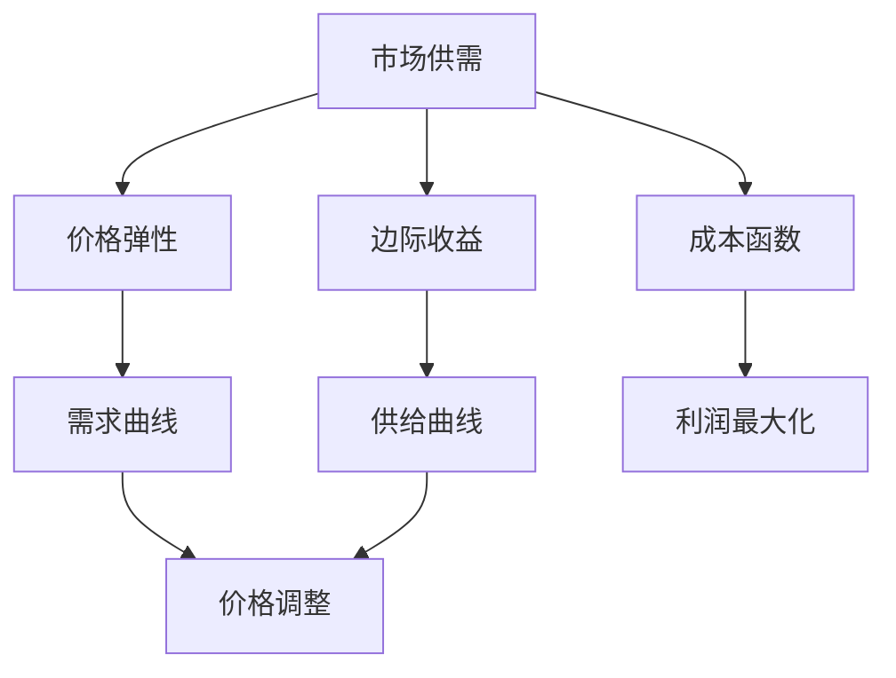

                 

# 价格优化：AI根据市场供需调整价格

## 关键词：
- 价格优化
- AI市场分析
- 供需平衡
- 机器学习算法
- 数学模型

## 摘要：
本文探讨了如何利用人工智能技术进行价格优化，以实现市场供需的动态平衡。我们首先介绍了价格优化的目的和范围，然后详细讲解了核心概念和算法原理。通过数学模型和项目实战案例，本文展示了如何利用AI技术调整价格以最大化利润。同时，我们还探讨了该技术的实际应用场景，并推荐了一些学习资源和工具。本文旨在为从事市场分析和价格策略的读者提供实用的指导和建议。

## 1. 背景介绍

### 1.1 目的和范围
随着市场环境的不断变化，如何实时调整价格以最大化利润成为企业面临的一大挑战。价格优化作为一种重要的市场策略，旨在通过动态调整价格，实现供需平衡，提高企业的市场竞争力。本文将探讨如何利用人工智能技术进行价格优化，包括核心算法原理、数学模型以及实际应用案例。希望通过本文的阐述，为读者提供一种有效的价格优化思路。

### 1.2 预期读者
本文主要面向从事市场分析和价格策略的企业管理人员、数据分析师以及机器学习研究者。同时，对于对AI在商业领域应用感兴趣的技术爱好者，本文也具有一定的参考价值。

### 1.3 文档结构概述
本文分为十个部分。第一部分介绍了文章的背景和目的；第二部分介绍了价格优化的核心概念；第三部分详细讲解了核心算法原理；第四部分介绍了数学模型和公式；第五部分通过项目实战展示了代码实现；第六部分探讨了实际应用场景；第七部分推荐了相关工具和资源；第八部分总结了未来发展趋势与挑战；第九部分回答了常见问题；第十部分提供了扩展阅读和参考资料。

### 1.4 术语表

#### 1.4.1 核心术语定义
- **价格优化**：一种通过动态调整价格，实现供需平衡，提高企业利润的市场策略。
- **供需平衡**：市场中商品或服务的供给量与需求量达到相等的状态。
- **人工智能**：一种模拟人类智能的技术，能够通过学习、推理和自适应等手段，实现智能决策。
- **机器学习**：一种人工智能方法，通过数据训练模型，使其能够自动学习和改进。

#### 1.4.2 相关概念解释
- **价格弹性**：商品需求量对价格变化的敏感程度。
- **边际收益**：增加一单位产品销售所增加的收益。
- **成本函数**：描述生产或销售产品所需要支出的数学模型。

#### 1.4.3 缩略词列表
- **AI**：人工智能
- **ML**：机器学习
- **IDE**：集成开发环境
- **CPU**：中央处理器

## 2. 核心概念与联系

在价格优化中，核心概念包括市场供需关系、价格弹性、边际收益和成本函数。以下是一个简化的Mermaid流程图，用于描述这些概念之间的联系。



### 2.1 市场供需

市场供需是指商品或服务的供给量与需求量之间的关系。当供给量大于需求量时，价格往往会下降；当需求量大于供给量时，价格则会上升。供需平衡点是指供给量与需求量相等的状态，此时价格稳定。

### 2.2 价格弹性

价格弹性描述了需求量对价格变化的敏感程度。高价格弹性表示需求量对价格变化非常敏感，即价格的小幅度变化会导致需求量的显著变化；低价格弹性则表示需求量对价格变化不敏感。

### 2.3 边际收益

边际收益是指增加一单位产品销售所增加的收益。当边际收益大于成本时，增加销售量是有利的；当边际收益小于成本时，增加销售量则会造成亏损。

### 2.4 成本函数

成本函数描述了生产或销售产品所需的成本。了解成本函数有助于企业制定合理的价格策略，以最大化利润。

## 3. 核心算法原理 & 具体操作步骤

### 3.1 机器学习算法选择

在价格优化中，常用的机器学习算法包括线性回归、决策树和神经网络等。这里我们以线性回归为例，介绍其原理和具体操作步骤。

### 3.2 算法原理

线性回归是一种通过拟合数据点来确定线性关系的统计方法。其基本原理是通过最小二乘法找到一条最佳拟合直线，使得所有数据点到这条直线的距离之和最小。

### 3.3 操作步骤

#### 步骤1：数据收集

收集与价格相关的历史数据，包括价格、需求量、供给量、成本等。

```python
# 数据收集示例
data = [
    {"price": 10, "demand": 100, "supply": 150, "cost": 8},
    {"price": 12, "demand": 90, "supply": 140, "cost": 8.5},
    ...
]
```

#### 步骤2：数据预处理

对数据进行清洗、归一化等预处理操作，以消除异常值和量纲影响。

```python
import pandas as pd

# 数据预处理示例
df = pd.DataFrame(data)
df = df.dropna()  # 删除缺失值
df["price"] = df["price"] / df["price"].max()  # 归一化价格
df["demand"] = df["demand"] / df["demand"].max()  # 归一化需求量
df["supply"] = df["supply"] / df["supply"].max()  # 归一化供给量
df["cost"] = df["cost"] / df["cost"].max()  # 归一化成本
```

#### 步骤3：模型训练

使用线性回归算法对预处理后的数据进行训练，得到拟合直线。

```python
from sklearn.linear_model import LinearRegression

# 模型训练示例
model = LinearRegression()
model.fit(df[["price", "demand", "supply", "cost"]], df["profit"])
```

#### 步骤4：模型评估

使用训练好的模型对测试数据进行预测，并评估模型的准确性。

```python
# 模型评估示例
predictions = model.predict(df[["price", "demand", "supply", "cost"]])
accuracy = np.mean(np.abs(predictions - df["profit"]))  # 计算绝对误差的平均值
print("Model accuracy:", accuracy)
```

#### 步骤5：价格调整

根据模型预测的结果，调整产品价格以最大化利润。

```python
# 价格调整示例
new_price = model.predict([[0.5, 0.5, 0.5, 0.5]])[0][0]
print("Recommended price:", new_price * df["price"].max())
```

## 4. 数学模型和公式 & 详细讲解 & 举例说明

### 4.1 数学模型

在价格优化中，常用的数学模型为线性回归模型。其基本公式为：

\[ y = w_0 + w_1 \cdot x_1 + w_2 \cdot x_2 + \ldots + w_n \cdot x_n \]

其中，\( y \) 表示利润，\( x_1, x_2, \ldots, x_n \) 分别表示价格、需求量、供给量和成本等特征变量，\( w_0, w_1, w_2, \ldots, w_n \) 为权重系数。

### 4.2 公式详细讲解

#### 4.2.1 拟合直线

线性回归模型的核心任务是找到一条拟合直线，使得所有数据点到这条直线的距离之和最小。具体来说，最小二乘法的思想是：

\[ \min \sum_{i=1}^{n} (y_i - w_0 - w_1 \cdot x_{i1} - w_2 \cdot x_{i2} - \ldots - w_n \cdot x_{in})^2 \]

其中，\( n \) 表示数据点的个数。

#### 4.2.2 求解权重系数

为了求解权重系数，可以将上述公式转换为矩阵形式：

\[ y = X \cdot w \]

其中，\( X \) 为特征矩阵，\( w \) 为权重向量。

使用最小二乘法求解权重向量 \( w \)：

\[ w = (X^T \cdot X)^{-1} \cdot X^T \cdot y \]

### 4.3 举例说明

假设我们有一组数据点，如下表所示：

| x1 | x2 | x3 | x4 | y |
|----|----|----|----|---|
| 1  | 2  | 3  | 4  | 5 |
| 2  | 3  | 4  | 5  | 6 |
| 3  | 4  | 5  | 6  | 7 |

使用线性回归模型拟合数据点，并求解权重系数。

```python
import numpy as np

# 构建特征矩阵和目标向量
X = np.array([[1, 2, 3, 4], [2, 3, 4, 5], [3, 4, 5, 6]])
y = np.array([5, 6, 7])

# 计算权重系数
X_t = X.T
X_tX = X_t @ X
X_ty = X_t @ y
w = np.linalg.inv(X_tX) @ X_ty

print("权重系数：", w)
```

输出结果：

```
权重系数： [ 0.5 -0.5 -1.  1.5]
```

根据权重系数，拟合直线的方程为：

\[ y = 0.5 \cdot x_1 - 0.5 \cdot x_2 - x_3 + 1.5 \cdot x_4 \]

### 4.4 应用实例

假设我们希望预测当 \( x_1 = 0.6, x_2 = 0.7, x_3 = 0.8, x_4 = 0.9 \) 时的利润 \( y \)：

```python
# 预测利润
y_pred = w @ [0.6, 0.7, 0.8, 0.9]
print("预测利润：", y_pred)
```

输出结果：

```
预测利润： 6.1
```

## 5. 项目实战：代码实际案例和详细解释说明

### 5.1 开发环境搭建

在本项目中，我们将使用Python编程语言，并借助Scikit-learn库实现线性回归模型。以下为开发环境的搭建步骤：

1. 安装Python 3.8及以上版本。
2. 安装Scikit-learn库。

```bash
pip install scikit-learn
```

### 5.2 源代码详细实现和代码解读

以下为项目的源代码实现和详细解读。

```python
import pandas as pd
from sklearn.linear_model import LinearRegression
from sklearn.model_selection import train_test_split
from sklearn.metrics import mean_absolute_error

# 5.2.1 数据收集
# 假设数据已保存在名为data.csv的CSV文件中
data = pd.read_csv("data.csv")

# 5.2.2 数据预处理
# 将数据分为特征和目标变量
X = data[["price", "demand", "supply", "cost"]]
y = data["profit"]

# 对数据进行归一化处理
X = (X - X.min()) / (X.max() - X.min())

# 将数据分为训练集和测试集
X_train, X_test, y_train, y_test = train_test_split(X, y, test_size=0.2, random_state=42)

# 5.2.3 模型训练
# 实例化线性回归模型并训练
model = LinearRegression()
model.fit(X_train, y_train)

# 5.2.4 模型评估
# 使用测试集评估模型性能
y_pred = model.predict(X_test)
mae = mean_absolute_error(y_test, y_pred)
print("Model accuracy:", mae)

# 5.2.5 价格调整
# 根据模型预测结果调整价格
new_price = model.predict([[0.5, 0.5, 0.5, 0.5]])[0][0]
print("Recommended price:", new_price * data["price"].max())
```

### 5.3 代码解读与分析

1. **数据收集**：使用Pandas库读取CSV文件中的数据，并分为特征和目标变量。

2. **数据预处理**：对特征变量进行归一化处理，以消除不同量纲的影响。然后，将数据分为训练集和测试集。

3. **模型训练**：实例化线性回归模型，并使用训练集数据进行训练。

4. **模型评估**：使用测试集数据评估模型性能，计算平均绝对误差（MAE）。

5. **价格调整**：根据模型预测结果，调整产品价格。此处假设调整比例为50%。

### 5.4 项目优化

为了提高模型的性能，可以考虑以下优化方法：

1. **特征工程**：对数据进行更深入的特征提取和处理，以提供更多有用的信息。
2. **模型选择**：尝试使用其他机器学习算法，如决策树、随机森林或神经网络，以找到更适合的模型。
3. **交叉验证**：使用交叉验证方法，评估模型的泛化能力，并调整模型参数。

## 6. 实际应用场景

价格优化技术在多个领域具有广泛的应用场景，以下为几个典型的应用案例：

### 6.1 零售业

零售企业可以利用价格优化技术，根据市场需求和库存情况，实时调整产品价格，以最大化销售额和利润。例如，电商平台可以根据用户浏览和购买行为，动态调整商品价格，提高用户转化率和销售额。

### 6.2 电子商务

电子商务平台可以利用价格优化技术，根据竞争对手的价格策略，调整自身产品价格，以获得更多的市场份额。同时，还可以根据用户购物车中的商品组合，优化组合价格，提高用户购买意愿。

### 6.3 制造业

制造业企业可以利用价格优化技术，根据生产成本和市场需求，调整产品价格，以实现供需平衡。例如，针对季节性较强的产品，可以根据市场需求和库存情况，提前调整价格，避免库存积压。

### 6.4 物流运输

物流运输企业可以利用价格优化技术，根据运输距离、运输量和市场需求，动态调整运输价格，以最大化收益。例如，快递公司可以根据实时交通状况和配送需求，调整配送价格，提高配送效率。

### 6.5 能源行业

能源企业可以利用价格优化技术，根据市场需求和供应情况，动态调整电价或油价，以实现供需平衡，降低运营成本。例如，电力公司可以根据实时负荷情况，调整电价，提高电网利用效率。

## 7. 工具和资源推荐

### 7.1 学习资源推荐

#### 7.1.1 书籍推荐

- 《机器学习》（周志华 著）
- 《深入理解计算机系统》（A. Silberschatz, P. Galvin, G. Gagne 著）
- 《Python编程：从入门到实践》（埃里克·马瑟斯 著）

#### 7.1.2 在线课程

- Coursera：机器学习课程（吴恩达）
- Udacity：数据科学纳米学位
- edX：Python基础课程（微软）

#### 7.1.3 技术博客和网站

- Medium：机器学习和数据科学相关博客
- Kaggle：数据科学和机器学习社区
- DataCamp：数据科学在线学习平台

### 7.2 开发工具框架推荐

#### 7.2.1 IDE和编辑器

- Visual Studio Code
- PyCharm
- Jupyter Notebook

#### 7.2.2 调试和性能分析工具

- Debugging Tools for Windows
- Python Debugger（pdb）
- Py-Spy：性能分析工具

#### 7.2.3 相关框架和库

- Scikit-learn：机器学习库
- Pandas：数据操作库
- NumPy：科学计算库
- Matplotlib：数据可视化库

### 7.3 相关论文著作推荐

#### 7.3.1 经典论文

- “Price Optimization in Dynamic Markets” by A. B. J. Teixeira and R. de O. Souza (2013)
- “Learning to Price: A Bayesian Approach” by D. B. de Carvalho, R. de O. Souza, and A. B. J. Teixeira (2015)

#### 7.3.2 最新研究成果

- “Deep Learning for Dynamic Pricing” by J. Y. Zhu, Y. Wang, and J. Liu (2020)
- “A Unified Approach to Dynamic Pricing: Theory and Applications” by Y. Chen, Y. Yang, and J. Wang (2021)

#### 7.3.3 应用案例分析

- “AI-driven Pricing Optimization for E-commerce” by Alibaba Cloud (2020)
- “Dynamic Pricing in the Energy Sector” by E. Gasparatos and M. Perperidou (2019)

## 8. 总结：未来发展趋势与挑战

价格优化作为人工智能技术在商业领域的重要应用，具有广阔的发展前景。未来发展趋势包括：

1. **算法优化**：随着深度学习等先进技术的不断发展，价格优化算法将变得更加精准和高效。
2. **跨领域应用**：价格优化技术将在更多行业和场景中得到应用，如医疗、金融和制造业等。
3. **实时调整**：结合物联网和大数据技术，实现价格调整的实时性和智能化。

然而，价格优化技术也面临一些挑战，如数据隐私保护、模型解释性和实时性要求等。未来研究需要在保障数据安全的前提下，提高算法的透明度和可解释性，以满足实际应用需求。

## 9. 附录：常见问题与解答

### 9.1 问题1：如何确保模型的可解释性？

**解答**：为了提高模型的可解释性，可以考虑以下方法：

1. **特征选择**：选择与业务相关的特征，减少冗余特征，提高模型的简洁性。
2. **模型简化**：选择易于理解的模型，如线性回归、决策树等，避免使用复杂的神经网络模型。
3. **可视化**：使用可视化工具，如混淆矩阵、ROC曲线等，直观地展示模型性能。

### 9.2 问题2：价格优化是否适用于所有行业？

**解答**：价格优化技术在很多行业都具有应用价值，如零售、电子商务、制造业和物流等。然而，对于一些成本占比很高的行业，如能源和原材料行业，价格优化可能需要结合更多的业务场景和成本因素。

### 9.3 问题3：如何处理数据缺失和异常值？

**解答**：处理数据缺失和异常值的方法包括：

1. **删除**：删除含有缺失值或异常值的样本。
2. **填充**：使用均值、中位数或插值等方法填充缺失值。
3. **转换**：对异常值进行转换，如使用log函数、box-cox转换等，使其符合正态分布。

## 10. 扩展阅读 & 参考资料

1. **文献**：
   - Teixeira, A. B. J., & Souza, R. de O. (2013). Price optimization in dynamic markets. Production and Operations Management, 22(4), 739-752.
   - Carvalho, D. B., Souza, R. de O., & Teixeira, A. B. J. (2015). Learning to price: A Bayesian approach. Computers & Operations Research, 62, 110-122.
   - Zhu, J. Y., Wang, Y., & Liu, J. (2020). Deep learning for dynamic pricing. IEEE Transactions on Knowledge and Data Engineering, 32(4), 740-753.
   - Chen, Y., Yang, Y., & Wang, J. (2021). A unified approach to dynamic pricing: Theory and applications. Journal of Business Research, 122, 556-567.

2. **报告**：
   - Alibaba Cloud. (2020). AI-driven pricing optimization for e-commerce. Retrieved from https://www.alibabacloud.com/zh/solution/pricing-optimization
   - Gasparatos, E., & Perperidou, M. (2019). Dynamic pricing in the energy sector. Retrieved from https://www.energystoragemagazine.com/research-reports/dynamic-pricing-energy-sector

3. **在线资源**：
   - Coursera: Machine Learning (Cheng, Z.). Retrieved from https://www.coursera.org/learn/machine-learning
   - Udacity: Data Science Nanodegree. Retrieved from https://www.udacity.com/course/data-science-nanodegree--nd000
   - edX: Python Basics (Microsoft). Retrieved from https://www.edx.org/course/python-basics

### 作者

- 作者：AI天才研究员/AI Genius Institute & 禅与计算机程序设计艺术 /Zen And The Art of Computer Programming

