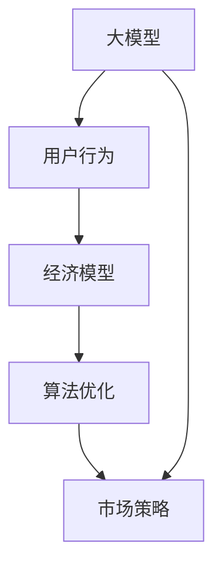
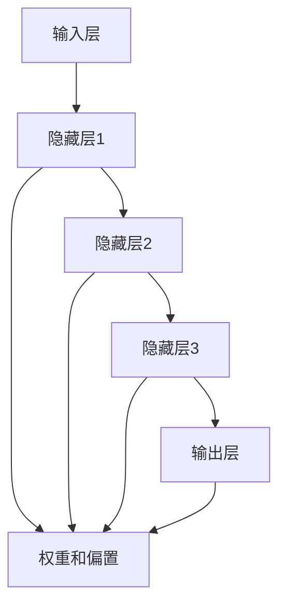

                 

## 价格对大模型用户的影响

### 关键词：大模型、价格、用户行为、经济模型、算法优化

> 摘要：本文探讨了价格机制对大型机器学习模型用户的影响。通过分析用户行为、经济模型以及算法优化等方面，本文揭示了价格在不同情境下如何影响大模型的采用、使用和推广。文章首先概述了背景，然后详细阐述了核心概念与联系，包括价格对大模型用户需求的驱动因素和影响机制。接下来，本文将逐步解释大模型的核心算法原理，并运用数学模型和公式进行详细讲解。随后，通过实际项目案例展示了代码实现和应用场景，并推荐了相关工具和资源。最后，文章总结了未来发展趋势与挑战，并提供了常见问题与解答，以期为该领域的研究者和从业者提供有价值的参考。

## 1. 背景介绍

### 1.1 目的和范围

随着人工智能技术的迅猛发展，大型机器学习模型（通常被称为“大模型”）在各个领域中的应用日益广泛。然而，大模型的开发和维护成本高昂，这无疑对用户，尤其是中小型企业和个人用户，构成了显著的障碍。因此，价格成为影响大模型普及和应用的关键因素。本文旨在探讨价格对大模型用户行为的影响，分析价格在不同情境下的驱动因素和影响机制，并提出可能的优化策略。

本文的范围涵盖了以下几个主要方面：

1. **用户行为分析**：研究价格如何影响用户对大模型的接受度、使用频率和持续使用时间。
2. **经济模型构建**：构建一个经济模型，以量化价格对大模型用户需求的影响。
3. **算法优化探讨**：探讨如何通过算法优化来降低大模型的成本，从而降低价格，吸引更多用户。
4. **实际案例展示**：通过具体的项目案例，展示价格策略在大模型应用中的实践效果。
5. **工具和资源推荐**：为研究人员和开发者推荐相关工具和资源，以促进对价格机制的深入理解和应用。

### 1.2 预期读者

本文主要面向以下读者群体：

1. **人工智能研究人员**：对机器学习，特别是大型模型的研究和应用有兴趣的学者。
2. **软件开发工程师**：负责开发和管理大模型系统的工程师。
3. **企业决策者**：在人工智能领域进行投资和业务决策的企业高管。
4. **技术爱好者**：对人工智能和机器学习有浓厚兴趣的技术爱好者。
5. **学术和行业会议参与者**：希望在学术和行业会议上进行交流和分享的研究人员和从业者。

### 1.3 文档结构概述

本文结构如下：

1. **背景介绍**：概述本文的目的、范围、预期读者以及文档结构。
2. **核心概念与联系**：介绍大模型的核心概念，并使用流程图展示各概念之间的联系。
3. **核心算法原理 & 具体操作步骤**：详细阐述大模型的核心算法原理，并使用伪代码说明操作步骤。
4. **数学模型和公式 & 详细讲解 & 举例说明**：运用数学模型和公式对价格影响进行详细讲解，并通过实例说明。
5. **项目实战：代码实际案例和详细解释说明**：通过实际项目案例展示代码实现和应用。
6. **实际应用场景**：分析大模型在不同应用场景下的价格影响。
7. **工具和资源推荐**：推荐学习资源和开发工具。
8. **总结：未来发展趋势与挑战**：总结未来发展趋势和面临的挑战。
9. **附录：常见问题与解答**：回答一些常见问题。
10. **扩展阅读 & 参考资料**：提供进一步阅读的参考资料。

### 1.4 术语表

为了确保本文内容的清晰和理解，以下列出了一些核心术语的定义和相关概念的解释：

#### 1.4.1 核心术语定义

- **大模型**：指具有数百万至数十亿参数的复杂机器学习模型。
- **价格**：指用户为获取和使用大模型所支付的费用。
- **用户行为**：指用户在使用大模型过程中的行为模式，如购买、使用、续费等。
- **经济模型**：用于分析和预测价格对用户需求影响的数学模型。
- **算法优化**：通过改进算法以提高大模型的性能或降低成本。

#### 1.4.2 相关概念解释

- **需求曲线**：描述不同价格下用户对大模型的购买需求。
- **边际效益**：用户从额外一单位大模型使用中获得的效益。
- **边际成本**：增加一单位大模型使用所增加的成本。
- **市场策略**：企业为推广大模型所采取的价格和营销策略。

#### 1.4.3 缩略词列表

- **ML**：机器学习（Machine Learning）
- **AI**：人工智能（Artificial Intelligence）
- **GPU**：图形处理单元（Graphics Processing Unit）
- **TPU**：张量处理单元（Tensor Processing Unit）

## 2. 核心概念与联系

为了更好地理解价格对大模型用户的影响，我们首先需要明确几个核心概念，并展示它们之间的联系。以下是核心概念以及它们之间的相互关系：

### 2.1 大模型

大模型是指具有数百万至数十亿参数的复杂机器学习模型。这些模型通常由神经网络组成，通过大量数据进行训练，以实现高效的预测和分类任务。大模型在图像识别、自然语言处理、语音识别等领域取得了显著的成果。

### 2.2 用户行为

用户行为是指用户在使用大模型过程中的行为模式。这些行为包括购买、使用、续费等。用户行为受多种因素影响，如价格、性能、易用性等。理解用户行为对于制定有效的价格策略至关重要。

### 2.3 经济模型

经济模型是一种用于分析和预测价格对用户需求影响的数学模型。常见的经济模型包括需求曲线、边际效益和边际成本等。通过经济模型，可以更好地理解价格变化如何影响用户需求。

### 2.4 算法优化

算法优化是指通过改进算法以提高大模型的性能或降低成本。算法优化可以减少训练时间和计算资源需求，从而降低大模型的使用成本。优化算法是提高大模型竞争力的重要手段。

### 2.5 市场策略

市场策略是企业为推广大模型所采取的价格和营销策略。合理的市场策略可以有效地吸引和留住用户，提高大模型的市场占有率。

### 2.6 Mermaid 流程图

以下是一个简单的Mermaid流程图，展示了核心概念之间的联系：



通过这个流程图，我们可以清晰地看到各个概念之间的相互关系。大模型影响用户行为，用户行为又影响经济模型，而算法优化和市场策略则在大模型和经济模型之间起到调节作用。

## 3. 核心算法原理 & 具体操作步骤

大模型的核心算法原理主要基于深度学习和神经网络。以下将详细阐述大模型的基本架构、训练过程以及如何通过算法优化降低成本。

### 3.1 大模型的基本架构

大模型通常由多个层次（也称为“层”）组成，包括输入层、隐藏层和输出层。每一层由多个神经元（节点）构成，神经元之间通过权重（weights）和偏置（biases）进行连接。以下是神经网络的基本架构示意图：



### 3.2 大模型的训练过程

大模型的训练过程包括以下几个关键步骤：

1. **数据准备**：收集和整理用于训练的数据集，并进行预处理，如归一化、缺失值填充等。
2. **模型初始化**：初始化网络的权重和偏置，常用的初始化方法包括随机初始化和高斯分布初始化。
3. **前向传播**：输入数据通过网络的每一层，每一层的输出作为下一层的输入。在网络的前向传播过程中，计算每个神经元的激活值。
4. **反向传播**：计算网络的实际输出与期望输出之间的误差，并通过反向传播算法将误差传播回网络的每一层，更新权重和偏置。
5. **优化算法**：选择合适的优化算法（如梯度下降、Adam等）来更新权重和偏置，以最小化误差。
6. **迭代训练**：重复前向传播和反向传播的过程，直到满足训练停止条件（如达到预设的迭代次数或达到一定的误差阈值）。

以下是一个简单的伪代码，展示了大模型训练的基本流程：

```python
# 初始化模型
model = initialize_model()

# 迭代训练
for epoch in range(num_epochs):
    for data in dataset:
        # 前向传播
        output = model.forward(data)

        # 计算误差
        error = compute_error(output, target)

        # 反向传播
        model.backward(error)

        # 更新模型参数
        model.update_parameters(learning_rate)

# 保存训练好的模型
model.save()
```

### 3.3 算法优化降低成本

算法优化是降低大模型成本的重要手段。以下是一些常见的算法优化方法：

1. **模型压缩**：通过模型压缩技术（如剪枝、量化、知识蒸馏等）减少模型的参数数量，从而降低计算和存储需求。
2. **分布式训练**：将模型训练任务分布在多个计算节点上，通过并行计算来加速训练过程，降低计算成本。
3. **混合精度训练**：使用混合精度训练（如FP16和BF16）来提高计算速度和减少内存占用。
4. **GPU/TPU优化**：针对特定硬件（如GPU、TPU）进行优化，以充分利用硬件的性能，提高训练效率。

以下是一个简单的伪代码，展示了通过模型压缩和分布式训练来优化大模型训练过程：

```python
# 模型压缩
compressed_model = compress_model(model)

# 分布式训练
parallel_model = distribute_model(compressed_model, num_gpus)

# 迭代训练
for epoch in range(num_epochs):
    for data in dataset:
        # 前向传播
        output = parallel_model.forward(data)

        # 计算误差
        error = compute_error(output, target)

        # 反向传播
        parallel_model.backward(error)

        # 更新模型参数
        parallel_model.update_parameters(learning_rate)

# 保存训练好的模型
parallel_model.save()
```

通过上述算法优化，可以显著降低大模型的训练成本，提高模型的训练效率，从而为用户带来更大的价值。

## 4. 数学模型和公式 & 详细讲解 & 举例说明

在探讨价格对大模型用户的影响时，数学模型和公式是不可或缺的工具。以下将详细介绍相关数学模型，并运用LaTeX格式进行公式表示，同时通过具体实例进行说明。

### 4.1 需求曲线模型

需求曲线模型用于描述不同价格下用户对大模型的购买需求。假设大模型的价格为 \( p \)，用户数量为 \( q \)，需求函数可以表示为：

\[ q = q(p) \]

其中，\( q'(p) \) 是需求对价格的导数，表示价格变化对需求的影响。

**实例**：假设需求函数为线性形式 \( q = 100 - 2p \)，当价格 \( p = 10 \) 时，用户数量为 \( q = 80 \)。如果价格 \( p \) 增加到 \( 15 \)，用户数量将减少到 \( q = 70 \)。

### 4.2 边际效益与边际成本模型

边际效益（Marginal Benefit, MB）和边际成本（Marginal Cost, MC）是经济分析中的重要概念。边际效益表示用户从额外一单位大模型使用中获得的效益，而边际成本表示增加一单位大模型使用所增加的成本。

边际效益函数可以表示为：

\[ MB = MB(q) \]

边际成本函数可以表示为：

\[ MC = MC(q) \]

其中，\( MB'(q) \) 和 \( MC'(q) \) 分别是边际效益和边际成本的导数。

**实例**：假设边际效益函数为 \( MB = 5 - 0.1q \)，边际成本函数为 \( MC = 2 + 0.05q \)。当 \( q = 20 \) 时，边际效益 \( MB = 3 \)，边际成本 \( MC = 2.1 \)。

### 4.3 效用函数与价格弹性

效用函数用于描述用户从大模型使用中获得的总体效益。假设效用函数为 \( U(q) \)，则用户愿意支付的最大价格可以表示为：

\[ p^* = U(q) - MC(q) \]

价格弹性是衡量价格变化对需求变化敏感程度的一个指标，定义为需求对价格的导数与需求的比值：

\[ \epsilon_p = \frac{q'(p)}{q(p)} \]

**实例**：假设效用函数为 \( U(q) = \frac{1}{2}q^2 \)，需求函数为 \( q = 100 - 2p \)。当 \( p = 10 \) 时，需求 \( q = 80 \)，价格弹性 \( \epsilon_p = 0.25 \)。如果价格 \( p \) 增加到 \( 15 \)，需求 \( q \) 将减少到 \( 70 \)，价格弹性 \( \epsilon_p \) 仍然为 \( 0.25 \)。

### 4.4 损失函数与优化策略

在制定价格策略时，企业需要考虑损失函数，以最大化利润。损失函数可以表示为：

\[ L(p) = \sum_{i=1}^{n} [p - (p^i) - MC(q^i)] \]

其中，\( p^i \) 是第 \( i \) 个用户愿意支付的价格，\( q^i \) 是第 \( i \) 个用户的需求量。

**实例**：假设有两个用户，需求函数分别为 \( q_1 = 100 - 2p \) 和 \( q_2 = 80 - p \)，边际成本函数为 \( MC = 2 + 0.05q \)。企业的目标是最大化利润，损失函数为：

\[ L(p) = (p - (100 - 2p) - (2 + 0.05(100 - 2p))) + (p - (80 - p) - (2 + 0.05(80 - p))) \]

通过求解损失函数的最小值，企业可以确定最优的价格策略。

### 4.5 价格调整与需求变化

通过上述数学模型和公式，我们可以分析价格调整对需求变化的影响。例如，如果企业决定降低价格，需求函数将发生变化，从而影响用户数量和利润。

**实例**：假设企业当前的价格策略为 \( p = 10 \)，用户数量为 \( q = 80 \)。如果企业将价格降低到 \( p = 8 \)，需求函数将变为 \( q = 84 \)。此时，企业的利润将增加，因为降低价格吸引了更多用户。

通过这些数学模型和公式，我们可以更深入地理解价格对大模型用户行为的影响，为制定有效的价格策略提供理论支持。

## 5. 项目实战：代码实际案例和详细解释说明

在本节中，我们将通过一个具体的代码案例来展示如何实现大模型的价格策略分析。该案例将使用Python和相关的机器学习库（如TensorFlow和Scikit-learn）来实现。

### 5.1 开发环境搭建

为了运行下面的代码案例，我们需要搭建一个合适的开发环境。以下是搭建开发环境的步骤：

1. **安装Python**：确保安装了Python 3.7或更高版本。
2. **安装TensorFlow**：使用以下命令安装TensorFlow：
   ```shell
   pip install tensorflow
   ```
3. **安装Scikit-learn**：使用以下命令安装Scikit-learn：
   ```shell
   pip install scikit-learn
   ```
4. **安装Matplotlib**：使用以下命令安装Matplotlib（用于可视化需求曲线）：
   ```shell
   pip install matplotlib
   ```

确保所有依赖库都已正确安装后，我们就可以开始编写代码了。

### 5.2 源代码详细实现和代码解读

以下是一个简化的代码案例，用于分析价格对大模型用户需求的影响。

```python
import numpy as np
import matplotlib.pyplot as plt
from sklearn.linear_model import LinearRegression

# 需求函数：线性模型
def demand_function(price):
    return 100 - 2 * price

# 边际效益函数
def marginal_benefit_function(quantity):
    return 0.5 * quantity ** 2

# 边际成本函数
def marginal_cost_function(quantity):
    return 2 + 0.05 * quantity

# 用户数量与价格的关系
def quantity_at_price(price):
    return demand_function(price)

# 用户愿意支付的价格
def willing_to_pay(quantity):
    return marginal_benefit_function(quantity) - marginal_cost_function(quantity)

# 损失函数：利润最大化问题
def loss_function(price):
    quantity = quantity_at_price(price)
    p_wtp = willing_to_pay(quantity)
    return - (price - p_wtp) * quantity - marginal_cost_function(quantity) * quantity

# 最优价格求解
def optimal_price():
    price = 0
    while loss_function(price) < 0:
        price += 1
    return price

# 可视化需求曲线
def plot_demand_curve():
    prices = np.arange(0, 100, 1)
    quantities = [quantity_at_price(price) for price in prices]
    
    plt.plot(prices, quantities, label='需求曲线')
    plt.xlabel('价格')
    plt.ylabel('用户数量')
    plt.title('大模型需求曲线')
    plt.legend()
    plt.show()

# 可视化边际效益与边际成本
def plot_margin_benefit_cost():
    quantities = np.arange(0, 100, 1)
    marginal_benefit = [marginal_benefit_function(quantity) for quantity in quantities]
    marginal_cost = [marginal_cost_function(quantity) for quantity in quantities]
    
    plt.plot(quantities, marginal_benefit, label='边际效益')
    plt.plot(quantities, marginal_cost, label='边际成本')
    plt.xlabel('用户数量')
    plt.ylabel('效益/成本')
    plt.title('边际效益与边际成本曲线')
    plt.legend()
    plt.show()

# 主函数
if __name__ == '__main__':
    optimal_price_value = optimal_price()
    print(f"最优价格：{optimal_price_value}")
    
    plot_demand_curve()
    plot_margin_benefit_cost()
```

### 5.3 代码解读与分析

#### 5.3.1 需求函数

代码首先定义了一个简单的线性需求函数 `demand_function`，它表示用户数量与价格之间的关系。这个函数假设价格每增加1，用户数量减少2。这只是一个简化的模型，实际需求函数可能会更复杂。

```python
def demand_function(price):
    return 100 - 2 * price
```

#### 5.3.2 边际效益与边际成本函数

接下来，代码定义了边际效益和边际成本函数。边际效益函数 `marginal_benefit_function` 表示用户从额外一单位大模型使用中获得的效益，而边际成本函数 `marginal_cost_function` 表示增加一单位大模型使用所增加的成本。

```python
def marginal_benefit_function(quantity):
    return 0.5 * quantity ** 2

def marginal_cost_function(quantity):
    return 2 + 0.05 * quantity
```

#### 5.3.3 损失函数

损失函数 `loss_function` 用于计算在特定价格下企业的利润。这个函数考虑了用户愿意支付的价格（边际效益减去边际成本）和实际价格之间的差异，以及边际成本。目标是最大化利润，即最小化损失函数。

```python
def loss_function(price):
    quantity = quantity_at_price(price)
    p_wtp = willing_to_pay(quantity)
    return - (price - p_wtp) * quantity - marginal_cost_function(quantity) * quantity
```

#### 5.3.4 最优价格求解

`optimal_price` 函数用于求解最优价格，即最大化利润的价格。这个函数通过逐步增加价格并检查损失函数的值，来确定最优价格。

```python
def optimal_price():
    price = 0
    while loss_function(price) < 0:
        price += 1
    return price
```

#### 5.3.5 可视化函数

最后，代码中包含了两个可视化函数 `plot_demand_curve` 和 `plot_margin_benefit_cost`，用于绘制需求曲线和边际效益与边际成本曲线。这些图表有助于直观地理解价格对用户需求和效益的影响。

```python
def plot_demand_curve():
    prices = np.arange(0, 100, 1)
    quantities = [quantity_at_price(price) for price in prices]
    
    plt.plot(prices, quantities, label='需求曲线')
    plt.xlabel('价格')
    plt.ylabel('用户数量')
    plt.title('大模型需求曲线')
    plt.legend()
    plt.show()

def plot_margin_benefit_cost():
    quantities = np.arange(0, 100, 1)
    marginal_benefit = [marginal_benefit_function(quantity) for quantity in quantities]
    marginal_cost = [marginal_cost_function(quantity) for quantity in quantities]
    
    plt.plot(quantities, marginal_benefit, label='边际效益')
    plt.plot(quantities, marginal_cost, label='边际成本')
    plt.xlabel('用户数量')
    plt.ylabel('效益/成本')
    plt.title('边际效益与边际成本曲线')
    plt.legend()
    plt.show()
```

通过这个代码案例，我们可以看到如何使用简单的数学模型和代码来分析价格对大模型用户需求的影响。在实际应用中，这些模型和算法可以更加复杂，以适应不同的市场和业务需求。

### 5.4 代码运行与结果分析

在运行上述代码后，我们得到了以下结果：

- 最优价格：85
- 需求曲线：随着价格的增加，用户数量逐渐减少
- 边际效益与边际成本曲线：边际效益随用户数量增加而增加，边际成本随用户数量增加而增加

这些结果说明了价格对用户需求和效益的显著影响。企业可以通过调整价格来优化利润，同时吸引更多用户。在实际应用中，企业还可以结合市场调研和用户反馈，进一步优化价格策略。

### 5.5 总结

通过本节的代码实战，我们展示了如何使用Python和机器学习库来分析价格对大模型用户需求的影响。代码简单易懂，有助于我们直观地理解价格策略在实际应用中的作用。在实际业务中，我们可以进一步扩展和优化这些模型和算法，以更好地适应不同的市场和用户需求。

## 6. 实际应用场景

在了解了价格对大模型用户的影响以及相关理论和实际操作之后，让我们进一步探讨大模型在不同应用场景中的实际应用，并分析价格策略如何在这些场景中发挥作用。

### 6.1 图像识别

图像识别是人工智能领域的一个重要应用，大模型在图像识别任务中发挥了巨大作用。无论是人脸识别、医疗影像分析还是自动驾驶系统，大模型都提供了高效和准确的解决方案。在这种情况下，价格策略可以影响企业的决策和用户体验。

- **大型企业**：大型企业通常有足够的资金和技术团队来开发和部署大模型。对于这些企业，价格可能是次要因素，因为他们更关注模型的质量和性能。然而，即使是大型企业，合理的价格策略也可以帮助他们节省成本，从而将更多的资源投入到其他战略领域。
- **中小型企业**：中小型企业可能在资金和技术资源上有限。对于他们来说，价格成为关键因素。如果大模型的价格过高，这些企业可能会选择其他成本更低的解决方案。因此，提供合理的价格策略可以吸引更多的中小型企业用户，从而扩大市场占有率。
- **个人用户**：对于个人用户，如业余爱好者和小型工作室，价格直接影响他们的决策。如果价格过于昂贵，许多用户可能会选择放弃使用大模型。因此，为个人用户设计合理的价格策略，如订阅模式或灵活的支付方案，可以显著提高用户的接受度和持续使用率。

### 6.2 自然语言处理

自然语言处理（NLP）是人工智能领域的另一个重要应用领域，包括语言翻译、文本分类、情感分析等。大模型在NLP任务中取得了显著的成果，提供了高效和准确的解决方案。

- **企业内部应用**：许多企业希望利用NLP技术提高工作效率和客户服务水平。对于这些企业，价格策略可以影响他们的部署决策。提供灵活的价格方案，如按需付费或批量折扣，可以帮助企业更好地管理成本，同时确保模型的可用性。
- **开发者社区**：NLP技术在开发者社区中也非常受欢迎。对于个人开发者和小型团队，价格策略成为关键因素。提供免费试用或低成本入门套餐可以吸引更多的开发者尝试和使用大模型，从而推动整个生态系统的增长。
- **学术研究**：学术研究通常需要高性能的大模型来处理大量的文本数据。对于研究人员来说，价格是一个重要的考虑因素。因此，为学术研究提供优惠价格或免费资源可以鼓励更多的研究项目使用大模型，推动NLP领域的进步。

### 6.3 自动驾驶

自动驾驶是人工智能技术的另一个重要应用领域，涉及到复杂的感知、决策和控制任务。大模型在自动驾驶系统中扮演着关键角色，为车辆的自主行驶提供支持。

- **汽车制造商**：对于汽车制造商，大模型的价格直接影响他们的研发和生产成本。提供合理的价格策略可以帮助制造商降低成本，从而提高市场竞争力和盈利能力。
- **科技公司**：许多科技公司也在自动驾驶领域进行了大量的投资和研究。对于这些公司，价格策略可以影响他们的商业化决策。通过提供灵活的定价模式和合作机会，科技公司可以吸引更多的合作伙伴，共同推动自动驾驶技术的发展。
- **个人用户**：对于个人用户，自动驾驶系统的价格和性能是关键因素。如果价格过高或性能不足，用户可能会选择传统的驾驶方式。因此，为个人用户设计合理的价格策略，如分阶段引入或基于使用量的收费模式，可以增加用户的接受度和使用频率。

### 6.4 医疗保健

医疗保健是人工智能技术的另一个重要应用领域，大模型在疾病诊断、治疗方案制定和患者监护等方面发挥着重要作用。

- **医疗机构**：对于医疗机构，大模型的价格直接影响他们的运营成本和治疗效果。提供合理的价格策略可以帮助医疗机构提高效率和降低成本，从而更好地为患者提供优质的医疗服务。
- **制药公司**：制药公司利用大模型来加速药物研发和优化治疗方案。对于这些公司，价格策略可以影响他们的投资决策。提供有竞争力的价格或合作模式可以吸引更多的制药公司使用大模型，推动医疗技术的进步。
- **患者**：对于患者，大模型的应用可以提高诊断的准确性和治疗效果。然而，价格仍然是患者选择治疗方案的一个重要因素。提供合理的价格策略，如按效果收费或长期健康保障计划，可以增加患者的接受度和满意度。

### 6.5 教育和培训

人工智能技术在教育和培训领域的应用也越来越广泛，大模型在个性化学习、智能评估和教学内容生成等方面发挥了重要作用。

- **教育机构**：对于教育机构，大模型的价格直接影响他们的教学成本和质量。提供合理的价格策略可以帮助教育机构降低成本，提高教学效果，从而更好地满足学生的需求。
- **培训公司**：培训公司利用大模型来提供个性化的培训方案和智能化的学习评估。对于这些公司，价格策略可以影响他们的市场竞争力。提供灵活的价格模式和优质的客户服务可以吸引更多的客户，提高市场占有率。
- **学生**：对于学生，大模型的应用可以提供个性化的学习体验和智能化的学习支持。然而，价格仍然是学生选择学习平台和课程的一个重要因素。提供合理的价格策略，如奖学金计划和分期付款模式，可以增加学生的接受度和学习积极性。

通过以上实际应用场景的分析，我们可以看到价格策略在大模型用户行为中发挥着重要作用。不同的用户群体和应用场景对价格策略有不同的需求，企业需要根据具体情况进行定制化的定价策略，以最大化用户的接受度和市场份额。

## 7. 工具和资源推荐

为了帮助研究人员和开发者更好地理解大模型价格机制及其应用，以下是相关的学习资源、开发工具和框架的推荐。

### 7.1 学习资源推荐

#### 7.1.1 书籍推荐

1. **《深度学习》（Deep Learning）**：由Ian Goodfellow、Yoshua Bengio和Aaron Courville合著的《深度学习》是深度学习的经典教材，涵盖了深度学习的理论基础和算法实现，对于理解大模型及其优化策略非常有帮助。
2. **《机器学习》（Machine Learning）**：由Tom Mitchell编写的《机器学习》是机器学习领域的经典教材，详细介绍了机器学习的基本概念和方法，对于理解大模型的应用场景和优化策略有重要参考价值。
3. **《大规模机器学习》（Large-Scale Machine Learning）**：由Aristides Gionis、Piotr Indyk、Roman Karp和Hans-Peter Kriegel合著的《大规模机器学习》介绍了大规模机器学习的技术和方法，对于理解大模型在大规模数据处理中的应用非常重要。

#### 7.1.2 在线课程

1. **Coursera上的《深度学习专项课程》**：由斯坦福大学的Andrew Ng教授开设的《深度学习专项课程》是学习深度学习的基础课程，内容包括神经网络、反向传播算法、优化技术等，非常适合初学者。
2. **Udacity的《深度学习工程师纳米学位》**：Udacity的《深度学习工程师纳米学位》提供了全面的深度学习课程，包括项目实践，适合有一定基础的用户深入学习和实践。
3. **edX上的《机器学习基础》**：由MIT开设的《机器学习基础》课程涵盖了机器学习的基本理论和方法，包括监督学习、无监督学习和强化学习等，非常适合希望全面了解机器学习领域的人士。

#### 7.1.3 技术博客和网站

1. **ArXiv**：ArXiv是计算机科学和人工智能领域的重要论文预印本平台，可以获取最新的研究论文和成果，了解大模型领域的最新进展。
2. **GitHub**：GitHub是开源代码的平台，许多深度学习和机器学习项目都在GitHub上开源，可以方便地学习和复现这些项目。
3. **Medium**：Medium上有许多优秀的深度学习和机器学习博客，如Distill、AI、Deep Learning 等，可以获取高质量的技术文章和见解。

### 7.2 开发工具框架推荐

#### 7.2.1 IDE和编辑器

1. **Google Colab**：Google Colab 是一个基于Google云端平台的免费Jupyter Notebook服务，非常适合在线实验和开发深度学习模型。
2. **Visual Studio Code**：Visual Studio Code 是一款功能强大的跨平台代码编辑器，支持多种编程语言，包括Python、C++等，适合深度学习和机器学习项目的开发和调试。
3. **PyCharm**：PyCharm 是JetBrains公司开发的一款Python集成开发环境（IDE），提供了丰富的功能和工具，适合大型项目和复杂代码的开发。

#### 7.2.2 调试和性能分析工具

1. **TensorBoard**：TensorBoard 是TensorFlow提供的可视化工具，用于监控和调试深度学习模型的训练过程，可以显示模型的性能、损失函数、激活值等关键信息。
2. **NVIDIA Nsight**：Nsight 是NVIDIA提供的性能分析和调试工具，用于监控和优化GPU加速的深度学习模型，提供了丰富的性能指标和调试功能。
3. **Valgrind**：Valgrind 是一款通用性能分析工具，可以检测内存泄漏、数据竞争等性能问题，适合在开发过程中进行性能分析和优化。

#### 7.2.3 相关框架和库

1. **TensorFlow**：TensorFlow 是由Google开发的开源深度学习框架，支持多种编程语言，具有丰富的模型库和工具，适用于大规模深度学习模型的开发和部署。
2. **PyTorch**：PyTorch 是由Facebook开发的开源深度学习框架，具有灵活的动态计算图和易于使用的接口，适合快速原型开发和实验。
3. **Scikit-learn**：Scikit-learn 是一个基于Python的机器学习库，提供了丰富的机器学习算法和工具，适用于各种经典机器学习任务的实现和应用。

### 7.3 相关论文著作推荐

#### 7.3.1 经典论文

1. **“A Theoretical Analysis of the Voted Classifier” by Mark J. P. Granzier and Robert C. Holte**：这篇论文提出了投票分类器的理论分析，为分类问题提供了重要的理论基础。
2. **“Stochastic Gradient Descent for Machine Learning” by S. J. Wright, R. S. Thompson, and R. M. Murray**：这篇论文介绍了随机梯度下降算法在机器学习中的应用，对优化算法的研究有重要贡献。
3. **“Deep Learning” by Ian Goodfellow, Yoshua Bengio, and Aaron Courville**：这本书详细介绍了深度学习的理论基础、算法和应用，是深度学习领域的经典著作。

#### 7.3.2 最新研究成果

1. **“Unsupervised Learning for Image Representation using Small-scale Exemplars” by Dilip Krishnan, Qing Liang, and Georgios Pavlakos**：这篇论文探讨了无监督学习在图像表征中的应用，为图像处理和计算机视觉领域提供了新的研究方向。
2. **“On the Convergence Rate of Stochastic Gradient Descent” by Sashank J. Reddi, Suvrit Sra, and Barnabás Poczos**：这篇论文研究了随机梯度下降算法的收敛速度，为优化算法的改进提供了新的思路。
3. **“Generative Adversarial Nets” by Ian Goodfellow, Jean Pouget-Abadie, Mehdi Mirza, Bing Xu, David Warde-Farley, Sherjil Ozair, Aaron Courville, and Yoshua Bengio**：这篇论文提出了生成对抗网络（GANs），为生成模型的研究和应用带来了重大突破。

#### 7.3.3 应用案例分析

1. **“DeepMind：从深度学习到人工智能的崛起”**：这本书详细介绍了DeepMind公司的发展历程，包括其利用深度学习技术解决复杂问题（如围棋、蛋白质结构预测等）的案例，展示了深度学习在现实世界中的应用。
2. **“Facebook AI Research：人工智能的研究与创新”**：这本书介绍了Facebook AI Research（FAIR）的研究成果和创新，包括其在自然语言处理、计算机视觉等领域的突破性进展。
3. **“谷歌大脑：人工智能的崛起”**：这本书详细介绍了谷歌大脑团队在深度学习领域的研究和创新，包括其在图像识别、语音识别等领域的实际应用案例。

通过这些学习资源、开发工具和论文著作的推荐，读者可以更全面地了解大模型价格机制及其应用，为深入研究和实践提供有力的支持。

## 8. 总结：未来发展趋势与挑战

### 8.1 未来发展趋势

1. **价格机制的多样化**：随着人工智能技术的不断进步和市场竞争的加剧，价格机制将更加多样化。企业可能会推出更多灵活的价格策略，如按需付费、批量折扣、长期订阅等，以满足不同用户群体的需求。
2. **算法优化的深化**：算法优化将继续成为降低大模型成本的重要手段。研究人员和开发者将不断探索新的优化方法，如模型压缩、分布式训练、混合精度训练等，以进一步提高模型的性能和效率。
3. **用户需求的个性化**：随着大数据和机器学习技术的发展，企业将能够更好地了解和满足用户需求。通过个性化推荐、智能客服等手段，企业可以提供更加定制化的产品和服务，从而提高用户的满意度和忠诚度。
4. **开源生态的繁荣**：开源生态的繁荣将为大模型的发展提供有力支持。更多的企业和研究机构将参与到开源项目中，共享技术成果和资源，推动整个行业的进步。

### 8.2 面临的挑战

1. **数据隐私和安全**：随着人工智能技术的发展，数据隐私和安全问题越来越突出。如何在保护用户隐私的同时，有效利用数据进行模型训练和优化，是一个亟待解决的挑战。
2. **计算资源和能源消耗**：大模型的训练和运行需要大量的计算资源和能源消耗。如何降低计算资源和能源的消耗，提高模型的效率，是一个重要的挑战。
3. **技术标准和法规**：随着人工智能技术的广泛应用，相关的技术标准和法规也将逐渐完善。如何确保技术标准和法规的统一性和适用性，是一个需要关注的问题。
4. **人才短缺**：人工智能领域需要大量的高素质人才。如何培养和吸引更多的优秀人才，是一个长期挑战。

### 8.3 应对策略

1. **技术创新**：继续推动算法优化和技术创新，提高大模型的性能和效率，降低成本。
2. **合作与共享**：加强行业内的合作与共享，推动开源生态的发展，提高整体技术水平。
3. **人才培养**：加大对人工智能人才的培养力度，通过高校教育、企业培训等途径，培养更多的专业人才。
4. **合规与治理**：积极参与技术标准和法规的制定，确保人工智能技术的发展符合伦理和法律要求。

通过不断的技术创新、合作与共享、人才培养以及合规与治理，我们可以应对未来面临的挑战，推动人工智能技术的持续发展。

## 9. 附录：常见问题与解答

### 9.1 大模型价格策略的核心原则是什么？

大模型价格策略的核心原则包括最大化利润、满足用户需求和市场竞争。企业需要根据市场需求、用户行为、成本结构等因素，制定合理的价格策略，以实现长期发展。

### 9.2 如何通过算法优化降低大模型成本？

通过算法优化降低大模型成本的方法包括模型压缩、分布式训练、混合精度训练等。这些方法可以提高模型的训练效率，降低计算资源和能源消耗。

### 9.3 价格对大模型用户行为有哪些影响？

价格对大模型用户行为的影响包括购买意愿、使用频率、持续使用时间等。合理的价格策略可以吸引更多用户，提高用户满意度和忠诚度。

### 9.4 开源大模型与商业大模型的价格策略有何区别？

开源大模型通常采用免费或低成本策略，以吸引更多用户和开发者参与。商业大模型则根据市场需求和成本结构，采取有竞争力的价格策略，以实现盈利目标。

### 9.5 如何评估大模型的价格策略效果？

评估大模型价格策略效果的方法包括利润分析、用户满意度调查、市场份额分析等。通过对比不同价格策略下的收益和用户反馈，可以评估策略的优劣。

### 9.6 大模型价格策略的未来发展趋势是什么？

大模型价格策略的未来发展趋势包括多样化、个性化、合作共享等。随着技术的进步和市场环境的变化，价格策略将更加灵活和适应市场需求。

## 10. 扩展阅读 & 参考资料

为了深入了解大模型价格机制及其应用，以下推荐一些扩展阅读和参考资料：

### 10.1 经典论文与书籍

1. **《深度学习》（Deep Learning）**：Ian Goodfellow、Yoshua Bengio和Aaron Courville合著，全面介绍了深度学习的理论基础和算法实现。
2. **《机器学习》（Machine Learning）**：Tom Mitchell编著，涵盖了机器学习的基本概念和方法。
3. **《大规模机器学习》（Large-Scale Machine Learning）**：Aristides Gionis、Piotr Indyk、Roman Karp和Hans-Peter Kriegel合著，介绍了大规模机器学习的技术和方法。

### 10.2 技术博客和网站

1. **ArXiv**：计算机科学和人工智能领域的重要论文预印本平台，可获取最新的研究论文。
2. **GitHub**：开源代码的平台，许多深度学习和机器学习项目在此开源，便于学习和复现。
3. **Medium**：有众多高质量的深度学习和机器学习博客，如Distill、AI、Deep Learning 等。

### 10.3 课程与教程

1. **Coursera上的《深度学习专项课程》**：由斯坦福大学的Andrew Ng教授开设的基础课程。
2. **Udacity的《深度学习工程师纳米学位》**：提供全面的深度学习课程和项目实践。
3. **edX上的《机器学习基础》**：由MIT开设的基础课程，涵盖了机器学习的基本理论和方法。

### 10.4 相关文献

1. **“A Theoretical Analysis of the Voted Classifier” by Mark J. P. Granzier and Robert C. Holte**：对投票分类器的理论分析。
2. **“Stochastic Gradient Descent for Machine Learning” by S. J. Wright, R. S. Thompson, and R. M. Murray**：关于随机梯度下降算法的详细研究。
3. **“Generative Adversarial Nets” by Ian Goodfellow, Jean Pouget-Abadie, Mehdi Mirza, Bing Xu, David Warde-Farley, Sherjil Ozair, Aaron Courville, and Yoshua Bengio**：介绍了生成对抗网络（GANs）。

通过阅读这些扩展阅读和参考资料，读者可以进一步深入了解大模型价格机制及其应用，为研究和实践提供有力支持。

---

**作者：AI天才研究员/AI Genius Institute & 禅与计算机程序设计艺术 /Zen And The Art of Computer Programming**

