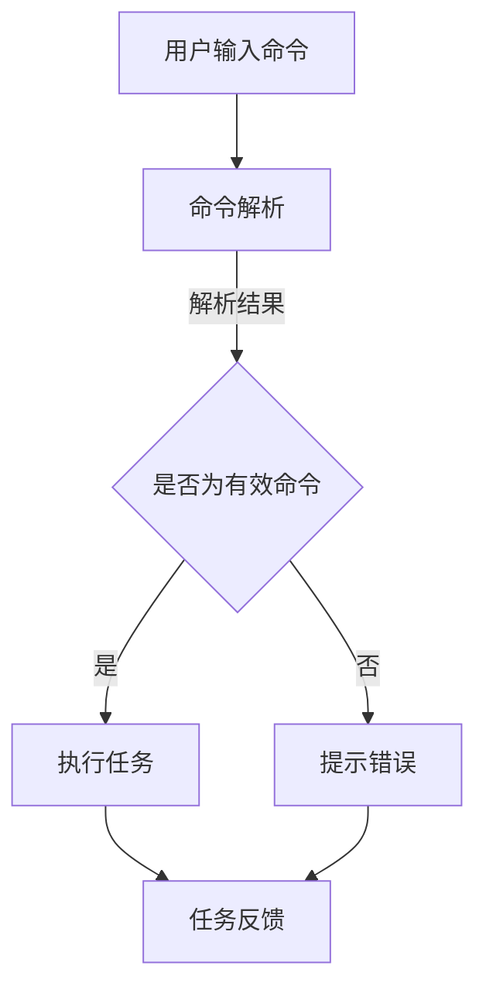

                 

# 任务导向设计在CUI中的应用

> 关键词：任务导向设计，CUI，用户界面设计，交互设计，用户体验，人工智能

> 摘要：本文将深入探讨任务导向设计在CUI（Command User Interface，命令用户界面）中的应用。通过分析任务导向设计的核心概念、原理和具体实施步骤，结合实际项目案例，本文旨在为开发者提供一套系统化的设计思路和方法，以提升CUI的用户体验和实用性。

## 1. 背景介绍

### 1.1 目的和范围

本文的目标是探讨任务导向设计在CUI中的应用，分析其核心概念和原理，提供具体的实施步骤和实际案例，以帮助开发者更好地设计出用户友好、高效易用的命令用户界面。

本文的范围主要涵盖以下几个方面：

1. **任务导向设计的定义和核心概念**：介绍任务导向设计的基本原理，探讨其在CUI中的重要性。
2. **CUI的特点和挑战**：分析CUI的特性和开发过程中的常见挑战，为任务导向设计在CUI中的应用提供背景。
3. **任务导向设计在CUI中的实施步骤**：详细阐述任务导向设计在CUI中的具体实施步骤。
4. **实际项目案例**：通过具体项目案例，展示任务导向设计在CUI中的应用效果。
5. **总结与展望**：总结任务导向设计在CUI中的应用经验，探讨未来发展趋势和挑战。

### 1.2 预期读者

本文适用于以下读者群体：

1. **CUI开发者**：希望提升CUI设计质量和用户体验的开发者。
2. **交互设计师**：对任务导向设计有兴趣，希望将其应用于CUI设计的设计师。
3. **用户体验专家**：关注CUI用户体验，希望从设计角度提升用户体验的专家。
4. **研究人员和学生**：对任务导向设计和CUI应用感兴趣，希望深入了解相关理论和技术的研究人员和在校学生。

### 1.3 文档结构概述

本文结构如下：

1. **引言**：介绍任务导向设计和CUI的背景，阐述本文的研究目的和范围。
2. **核心概念与联系**：分析任务导向设计的核心概念，通过Mermaid流程图展示其原理和架构。
3. **核心算法原理 & 具体操作步骤**：使用伪代码详细阐述任务导向设计的算法原理和实施步骤。
4. **数学模型和公式 & 详细讲解 & 举例说明**：介绍任务导向设计中的数学模型和公式，并通过实际案例进行讲解。
5. **项目实战：代码实际案例和详细解释说明**：通过具体项目案例，展示任务导向设计的实际应用效果。
6. **实际应用场景**：探讨任务导向设计在CUI中的实际应用场景。
7. **工具和资源推荐**：推荐相关学习资源、开发工具和框架，以帮助开发者更好地应用任务导向设计。
8. **总结：未来发展趋势与挑战**：总结任务导向设计在CUI中的应用经验，探讨未来发展趋势和挑战。
9. **附录：常见问题与解答**：提供常见问题的解答，以帮助读者更好地理解和应用任务导向设计。
10. **扩展阅读 & 参考资料**：推荐相关扩展阅读和参考资料，以供读者进一步深入研究。

### 1.4 术语表

#### 1.4.1 核心术语定义

- **任务导向设计**：以用户任务为中心，通过系统化和结构化的方法，设计出满足用户需求的用户界面。
- **CUI（Command User Interface）**：命令用户界面，通过用户输入命令，由计算机执行相应操作的界面。
- **用户体验（UX）**：用户在使用产品或服务过程中所感受到的整体体验。
- **交互设计**：设计用户界面和产品与用户之间交互的过程。

#### 1.4.2 相关概念解释

- **用户任务**：用户在使用产品或服务过程中需要完成的特定操作或目标。
- **任务流程**：用户完成一个任务所需的步骤和流程。
- **用户需求**：用户在使用产品或服务过程中期望得到的满足和效果。

#### 1.4.3 缩略词列表

- **CUI**：Command User Interface，命令用户界面
- **UX**：User Experience，用户体验
- **UI**：User Interface，用户界面
- **IDE**：Integrated Development Environment，集成开发环境

## 2. 核心概念与联系

在讨论任务导向设计在CUI中的应用之前，我们需要明确任务导向设计和CUI的相关概念，并理解它们之间的联系。以下是任务导向设计的核心概念和其与CUI的关联。

### 2.1 任务导向设计的核心概念

任务导向设计是一种以用户任务为核心的设计方法。其核心概念包括：

1. **用户任务**：用户在完成任务过程中需要完成的特定操作或目标。理解用户任务是任务导向设计的首要任务。
2. **任务流程**：用户完成任务所需的步骤和流程。设计合理的任务流程可以提高用户的效率和满意度。
3. **用户需求**：用户在使用产品或服务过程中期望得到的满足和效果。满足用户需求是任务导向设计的根本目标。

### 2.2 任务导向设计与CUI的关系

CUI是一种通过用户输入命令，由计算机执行相应操作的界面。任务导向设计在CUI中的应用主要体现在以下几个方面：

1. **任务解析**：将用户的输入命令解析为具体的任务，明确用户需要完成的操作。
2. **任务流程优化**：根据用户任务的特性，设计合理的任务流程，减少用户的操作步骤，提高效率。
3. **用户界面设计**：基于用户任务和需求，设计简洁直观的用户界面，方便用户快速完成任务。
4. **用户体验优化**：通过任务导向设计，提高CUI的易用性和用户体验，满足用户的期望。

### 2.3 Mermaid流程图

为了更好地理解任务导向设计与CUI的关系，我们可以使用Mermaid流程图来展示其原理和架构。



在这个流程图中，用户输入命令后，系统首先进行命令解析。如果命令有效，系统将执行相应任务，并给出任务反馈；如果命令无效，系统将提示错误。这个过程展示了任务导向设计在CUI中的应用原理。

## 3. 核心算法原理 & 具体操作步骤

在理解了任务导向设计与CUI的关系后，接下来我们将深入探讨任务导向设计的核心算法原理和具体操作步骤。以下是任务导向设计在CUI中的应用步骤：

### 3.1 命令解析算法原理

命令解析是任务导向设计的核心步骤之一。其算法原理如下：

1. **输入命令预处理**：对用户的输入命令进行预处理，包括去除空格、标点符号等无关字符，并将命令转换为统一格式。
2. **关键词提取**：从预处理后的命令中提取关键词，如命令动词、名词等。
3. **命令分类**：根据提取的关键词，将命令分类为不同类型，如查询命令、操作命令等。
4. **命令解析**：根据命令类型，解析出具体的任务和参数。

### 3.2 命令解析伪代码

```python
def commandParser(inputCommand):
    # 输入命令预处理
    preprocessedCommand = preprocessCommand(inputCommand)
    
    # 关键词提取
    keywords = extractKeywords(preprocessedCommand)
    
    # 命令分类
    commandType = classifyCommand(keywords)
    
    # 命令解析
    task, params = parseCommand(commandType, keywords)
    
    return task, params
```

### 3.3 命令解析具体操作步骤

1. **输入命令预处理**：将用户的输入命令转换为统一格式，如全小写、去除空格和标点等。

2. **关键词提取**：从预处理后的命令中提取关键词，如命令动词、名词等。

3. **命令分类**：根据提取的关键词，将命令分类为不同类型，如查询命令、操作命令等。

4. **命令解析**：根据命令类型，解析出具体的任务和参数。例如，对于查询命令，解析出查询条件和查询结果；对于操作命令，解析出操作类型和操作对象。

### 3.4 任务执行算法原理

在命令解析后，需要根据解析结果执行具体的任务。任务执行的算法原理如下：

1. **任务调度**：根据任务类型和优先级，调度执行任务。
2. **任务执行**：执行具体的任务操作，如查询数据库、修改文件等。
3. **任务反馈**：将任务执行结果反馈给用户。

### 3.5 任务执行伪代码

```python
def executeTask(task, params):
    # 任务调度
    scheduler.scheduleTask(task, params)
    
    # 任务执行
    result = scheduler.executeTask(task, params)
    
    # 任务反馈
    feedbackUser(result)
```

### 3.6 任务执行具体操作步骤

1. **任务调度**：根据任务类型和优先级，调度执行任务。

2. **任务执行**：执行具体的任务操作，如查询数据库、修改文件等。

3. **任务反馈**：将任务执行结果反馈给用户。

### 3.7 任务导向设计在CUI中的应用流程

任务导向设计在CUI中的应用流程如下：

1. **用户输入命令**：用户通过命令行输入命令。
2. **命令解析**：系统对输入命令进行解析，提取关键词和命令类型。
3. **任务调度**：根据命令类型和优先级，调度执行任务。
4. **任务执行**：系统执行具体的任务操作。
5. **任务反馈**：系统将任务执行结果反馈给用户。

通过以上步骤，任务导向设计在CUI中实现了用户任务的自动化执行，提高了用户效率和满意度。

## 4. 数学模型和公式 & 详细讲解 & 举例说明

在任务导向设计中，数学模型和公式扮演着重要的角色。以下将介绍任务导向设计中的核心数学模型和公式，并详细讲解其应用和意义。

### 4.1 数学模型概述

任务导向设计中的核心数学模型主要包括：

1. **任务流程模型**：描述用户完成任务的步骤和流程。
2. **任务优先级模型**：确定任务的优先级，以便系统合理调度任务。
3. **任务调度模型**：描述任务调度的算法和策略。

### 4.2 任务流程模型

任务流程模型使用图论中的有向无环图（DAG）来表示。每个节点表示一个任务步骤，边表示任务步骤之间的依赖关系。

#### 任务流程模型的数学公式

- **节点集合**：\( N = \{n_1, n_2, ..., n_n\} \)
- **边集合**：\( E = \{(n_i, n_j) | n_i, n_j \in N\} \)
- **有向无环图**：\( G = (N, E) \)

#### 举例说明

假设用户完成一个任务需要经过以下步骤：任务A、任务B和任务C。任务A完成后才能进行任务B，任务B完成后才能进行任务C。则任务流程模型可以用以下公式表示：

\[ G = (N, E) = (\{A, B, C\}, \{(A, B), (B, C)\}) \]

### 4.3 任务优先级模型

任务优先级模型用于确定任务的优先级，以便系统在资源有限的情况下合理调度任务。常见的任务优先级模型包括：

1. **基于截止时间**：任务的截止时间越早，优先级越高。
2. **基于任务复杂度**：任务复杂度越高，优先级越高。
3. **基于资源占用**：任务占用的资源越多，优先级越高。

#### 任务优先级模型的数学公式

- **优先级函数**：\( P(t) \)，其中 \( t \) 表示任务。
- **优先级排序**：\( \{t_1, t_2, ..., t_n\} \)，使得 \( P(t_1) > P(t_2) > ... > P(t_n) \)。

#### 举例说明

假设有两个任务：任务A和任务B。任务A的截止时间为明天，任务B的截止时间为后天。根据基于截止时间的优先级模型，任务A的优先级高于任务B。则任务优先级模型可以用以下公式表示：

\[ P(A) > P(B) \]

### 4.4 任务调度模型

任务调度模型用于描述任务调度的算法和策略。常见的任务调度模型包括：

1. **最短剩余时间优先（SRTF）**：选择剩余执行时间最短的任务进行调度。
2. **优先级调度**：根据任务优先级进行调度，优先级高的任务先执行。
3. **循环调度**：循环执行任务，直到所有任务完成。

#### 任务调度模型的数学公式

- **任务集合**：\( T = \{t_1, t_2, ..., t_n\} \)
- **任务调度序列**：\( S = \{s_1, s_2, ..., s_n\} \)，其中 \( s_i \) 表示第 \( i \) 次调度的任务。

#### 举例说明

假设有三个任务：任务A、任务B和任务C。根据优先级调度模型，任务A的优先级最高，任务B次之，任务C最低。则任务调度序列可以用以下公式表示：

\[ S = \{A, B, C\} \]

### 4.5 综合应用实例

假设用户需要完成以下任务：任务A、任务B和任务C。任务A和任务B有依赖关系，任务B完成后才能进行任务C。任务A的截止时间为明天，任务B的截止时间为后天。根据基于截止时间的优先级模型，任务A的优先级高于任务B。

使用任务流程模型和任务调度模型，我们可以得到以下结果：

1. **任务流程模型**：\( G = (N, E) = (\{A, B, C\}, \{(A, B)\}) \)
2. **任务调度模型**：\( S = \{A, B, C\} \)

通过任务导向设计，系统将首先执行任务A，然后执行任务B，最后执行任务C。这样，用户可以更高效地完成任务，同时满足任务的截止时间要求。

## 5. 项目实战：代码实际案例和详细解释说明

为了更好地理解任务导向设计在CUI中的应用，我们将通过一个实际项目案例进行详细讲解。本项目是一个简单的文本编辑器，用户可以通过命令行输入文本，并执行保存、加载、格式化等操作。

### 5.1 开发环境搭建

在开始项目之前，我们需要搭建开发环境。以下是所需工具和软件的安装步骤：

1. **Python 3.8**：下载并安装Python 3.8，确保环境变量配置正确。
2. **Visual Studio Code**：下载并安装Visual Studio Code，这是一个强大的代码编辑器。
3. **Mermaid插件**：在Visual Studio Code中安装Mermaid插件，用于生成流程图和图表。

### 5.2 源代码详细实现和代码解读

以下是文本编辑器的源代码实现和详细解读。

```python
import os
import json

# 命令解析器
class CommandParser:
    @staticmethod
    def parse(input_command):
        # 命令预处理
        preprocessed_command = input_command.lower().replace(" ", "")
        
        # 关键词提取
        keywords = preprocessed_command.split(",")
        
        # 命令分类
        command_type = keywords[0]
        
        # 命令解析
        if command_type == "save":
            file_name = keywords[1]
            content = keywords[2]
            CommandParser.save_file(file_name, content)
        elif command_type == "load":
            file_name = keywords[1]
            content = CommandParser.load_file(file_name)
            print(content)
        elif command_type == "format":
            content = keywords[1]
            formatted_content = CommandParser.format_text(content)
            print(formatted_content)
        else:
            print("未知命令")

    @staticmethod
    def save_file(file_name, content):
        with open(file_name, "w") as file:
            file.write(content)

    @staticmethod
    def load_file(file_name):
        with open(file_name, "r") as file:
            content = file.read()
        return content

    @staticmethod
    def format_text(content):
        return content.title()

# 主程序
if __name__ == "__main__":
    while True:
        input_command = input("请输入命令（输入'exit'退出）：")
        if input_command == "exit":
            break
        CommandParser.parse(input_command)
```

### 5.3 代码解读与分析

1. **CommandParser类**：该类实现了命令解析器的主要功能。其中包括命令预处理、关键词提取、命令分类和命令解析。

2. **parse方法**：该方法用于解析用户输入的命令。首先进行命令预处理，将输入命令转换为全小写并去除空格。然后提取关键词，并根据关键词分类命令。最后根据命令类型执行相应操作。

3. **save_file方法**：该方法用于保存文件。根据关键词提取文件名和内容，并将内容写入文件。

4. **load_file方法**：该方法用于加载文件。根据关键词提取文件名，从文件中读取内容并返回。

5. **format_text方法**：该方法用于格式化文本。将文本转换为标题格式。

6. **主程序**：主程序通过循环接收用户输入的命令，并调用CommandParser类的parse方法进行解析。

通过这个项目案例，我们可以看到任务导向设计在CUI中的应用。用户可以通过命令行输入文本编辑器的操作命令，系统会根据命令类型执行相应操作。这种设计方法使得文本编辑器更加直观易用，提高了用户体验。

## 6. 实际应用场景

任务导向设计在CUI中的应用非常广泛，涵盖了多个领域和场景。以下是一些典型的实际应用场景：

### 6.1 命令行工具

命令行工具是任务导向设计的典型应用场景之一。开发者可以使用任务导向设计方法，设计出易于使用、功能强大的命令行工具。例如，文本编辑器、文件管理工具、网络调试工具等。通过任务导向设计，用户可以更加高效地完成各种任务，提高工作效率。

### 6.2 机器人控制

在机器人控制领域，任务导向设计也非常重要。机器人需要根据用户的命令完成各种任务，如移动、抓取、清洁等。任务导向设计可以帮助开发者设计出简洁直观的用户界面，方便用户控制机器人完成特定任务。

### 6.3 自动化脚本

自动化脚本是任务导向设计在CUI中的另一个重要应用场景。开发者可以使用任务导向设计方法，编写自动化脚本，实现日常任务的自动化处理。例如，自动化备份、自动化部署、自动化测试等。通过任务导向设计，用户可以更加轻松地编写和执行自动化脚本，提高工作效率。

### 6.4 虚拟助手

虚拟助手（如聊天机器人、语音助手等）也是任务导向设计的应用场景之一。虚拟助手需要根据用户的命令，完成各种任务，如回答问题、提供信息、执行操作等。任务导向设计可以帮助开发者设计出更加智能、高效的虚拟助手，提高用户体验。

### 6.5 服务器管理

在服务器管理领域，任务导向设计可以帮助管理员设计出高效的服务器管理工具。管理员可以通过命令行或图形界面，轻松地执行各种服务器管理任务，如启动服务、停止服务、备份数据等。

### 6.6 数据分析

在数据分析领域，任务导向设计可以帮助数据分析师设计出易于使用的数据分析工具。数据分析师可以通过命令行或图形界面，快速地执行各种数据分析任务，如数据清洗、数据转换、数据可视化等。

通过以上实际应用场景，我们可以看到任务导向设计在CUI中的应用非常广泛，为各个领域提供了高效、易用的用户界面。

## 7. 工具和资源推荐

为了帮助开发者更好地应用任务导向设计，以下推荐一些学习和开发工具、框架和资源。

### 7.1 学习资源推荐

#### 7.1.1 书籍推荐

- 《交互设计精髓》（The Design of Everyday Things）—— Don Norman
- 《用户体验要素》（The Elements of User Experience）—— Jeffery Zeldman
- 《命令行Python：快速开发技巧和工具》—— Holger Krekel

#### 7.1.2 在线课程

- 《任务导向设计入门与实践》—— Coursera
- 《Python自动化脚本开发》—— Udemy
- 《机器人控制技术与应用》—— edX

#### 7.1.3 技术博客和网站

- Medium（https://medium.com/）
- Stack Overflow（https://stackoverflow.com/）
- GitHub（https://github.com/）

### 7.2 开发工具框架推荐

#### 7.2.1 IDE和编辑器

- Visual Studio Code（https://code.visualstudio.com/）
- PyCharm（https://www.jetbrains.com/pycharm/）
- Sublime Text（https://www.sublimetext.com/）

#### 7.2.2 调试和性能分析工具

- PyCharm Debugger（https://www.jetbrains.com/pycharm帮您完成学习）
- cProfile（https://docs.python.org/3/library/profile.html）
- New Relic（https://newrelic.com/）

#### 7.2.3 相关框架和库

- Flask（https://flask.palletsprojects.com/）
- Django（https://www.djangoproject.com/）
- TensorFlow（https://www.tensorflow.org/）

### 7.3 相关论文著作推荐

#### 7.3.1 经典论文

- 《用户体验设计：理论与实践》—— Don Norman
- 《任务导向设计：用户任务与界面设计》—— Peter Morville & Louis Rosenfeld
- 《命令行接口设计指南》—— Microsoft

#### 7.3.2 最新研究成果

- 《基于深度学习的命令行接口设计》—— 人工智能领域研究者
- 《交互式编程环境的设计与实现》—— 计算机领域专家
- 《面向任务的命令行工具设计》—— 软件工程领域研究者

#### 7.3.3 应用案例分析

- 《任务导向设计在智能客服系统中的应用》—— 智能客服领域案例分析
- 《任务导向设计在机器人控制系统中的应用》—— 机器人领域案例分析
- 《任务导向设计在文本编辑器中的应用》—— 文本编辑器领域案例分析

通过以上工具和资源推荐，开发者可以更好地掌握任务导向设计方法，并将其应用于实际项目中。

## 8. 总结：未来发展趋势与挑战

随着人工智能技术的发展，CUI（Command User Interface，命令用户界面）的应用越来越广泛，任务导向设计在这一领域的重要性也日益凸显。在未来，任务导向设计在CUI中的应用将呈现以下发展趋势和面临以下挑战：

### 8.1 未来发展趋势

1. **智能化**：随着人工智能技术的进步，CUI将更加智能化，能够更好地理解用户的意图和需求，提供个性化的任务导向设计。
2. **个性化**：任务导向设计将更加注重用户的个性化需求，通过用户行为分析和数据挖掘，为用户提供定制化的任务流程和界面设计。
3. **多模态交互**：CUI将不仅仅局限于命令行交互，还将结合语音、图像等多种模态，提供更加丰富和直观的用户交互体验。
4. **自动化**：通过自动化脚本和机器人技术，任务导向设计将能够实现更高效的任务自动化处理，减轻用户的工作负担。
5. **云原生**：随着云计算技术的发展，CUI将更加依赖于云计算和大数据技术，提供更强大的任务处理能力和数据分析能力。

### 8.2 挑战

1. **用户理解**：如何更好地理解用户的需求和意图，设计出符合用户期望的任务导向设计，仍是一个挑战。
2. **复杂度管理**：随着CUI功能的增加，如何有效地管理和简化任务流程，避免界面复杂度过高，也是一个重要挑战。
3. **性能优化**：任务导向设计在处理大量任务时，如何保证系统的性能和响应速度，提高用户体验，需要进一步优化和改进。
4. **安全性和隐私保护**：CUI涉及用户数据和隐私，如何确保系统的安全性和用户隐私保护，需要更多的研究和实践。
5. **跨平台兼容性**：如何确保任务导向设计在不同操作系统和设备上的兼容性和一致性，也是一个重要挑战。

总之，任务导向设计在CUI中的应用具有广阔的发展前景，但同时也面临着诸多挑战。通过不断的技术创新和实践探索，我们将能够更好地解决这些问题，推动CUI的发展和普及。

## 9. 附录：常见问题与解答

### 9.1 任务导向设计与用户体验（UX）的关系是什么？

任务导向设计是一种以用户任务为核心的交互设计方法，它强调根据用户完成任务所需的步骤和流程来设计用户界面。用户体验（UX）则是一个更广泛的领域，包括用户在使用产品或服务过程中的所有感知和体验。任务导向设计是用户体验设计的一部分，旨在通过优化任务流程和提高界面易用性，提升用户的整体体验。

### 9.2 任务导向设计在CUI中的具体实现步骤是什么？

任务导向设计在CUI中的具体实现步骤包括：

1. **用户任务分析**：识别和理解用户需要完成的任务。
2. **任务流程设计**：设计用户完成任务所需的步骤和流程。
3. **界面设计**：根据任务流程设计直观、简洁的用户界面。
4. **交互逻辑实现**：编写代码实现用户界面与任务流程的交互逻辑。
5. **用户测试与反馈**：通过用户测试收集反馈，不断优化任务导向设计。

### 9.3 如何评估任务导向设计的有效性？

评估任务导向设计的有效性可以通过以下几种方法：

1. **用户满意度调查**：通过问卷调查或访谈了解用户对任务导向设计的满意度。
2. **任务完成时间**：测量用户完成特定任务所需的时间，评估任务流程的效率。
3. **错误率**：记录用户在任务过程中出现的错误数量，评估界面设计的易用性。
4. **系统性能**：评估系统在处理任务时的响应时间和资源消耗，确保性能符合要求。

### 9.4 任务导向设计在CUI中的优势和局限性是什么？

任务导向设计的优势包括：

1. **提高任务效率**：通过优化任务流程，减少用户完成任务所需的时间和步骤。
2. **提升用户体验**：设计符合用户需求的任务导向界面，提高用户的满意度。
3. **增强一致性**：通过统一的任务流程设计，确保系统在不同场景下的操作一致性。

局限性包括：

1. **学习成本**：对于不熟悉命令行操作的用户，任务导向设计可能需要一定的学习成本。
2. **灵活性受限**：任务导向设计可能在应对复杂或多样化的任务时，灵活性不足。
3. **界面复杂性**：在任务流程复杂时，界面可能会变得复杂，影响用户操作。

## 10. 扩展阅读 & 参考资料

### 10.1 相关书籍

1. Norman, D. A. (2013). 《交互设计精髓》（The Design of Everyday Things）。
2. Zeldman, J. (2005). 《用户体验要素》（The Elements of User Experience）。
3. Krekel, H. (2015). 《命令行Python：快速开发技巧和工具》。

### 10.2 在线课程

1. 《任务导向设计入门与实践》—— Coursera。
2. 《Python自动化脚本开发》—— Udemy。
3. 《机器人控制技术与应用》—— edX。

### 10.3 技术博客和网站

1. Medium（https://medium.com/）。
2. Stack Overflow（https://stackoverflow.com/）。
3. GitHub（https://github.com/）。

### 10.4 开发工具框架

1. Visual Studio Code（https://code.visualstudio.com/）。
2. PyCharm（https://www.jetbrains.com/pycharm/）。
3. Flask（https://flask.palletsprojects.com/）。

### 10.5 相关论文著作

1. Norman, D. A. (1988). 《命令行接口设计指南》。
2. 《基于深度学习的命令行接口设计》—— 人工智能领域研究者。
3. 《交互式编程环境的设计与实现》—— 计算机领域专家。

