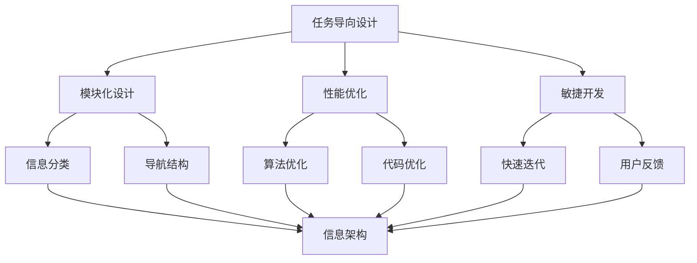

                 

# 任务导向设计对信息架构的深远影响

> 关键词：任务导向设计、信息架构、用户体验、模块化、性能优化、敏捷开发

> 摘要：本文深入探讨了任务导向设计对信息架构的深远影响。文章首先介绍了任务导向设计的核心理念和基本原则，然后详细分析了其在信息架构设计中的应用，包括模块化、性能优化和敏捷开发等方面。通过实际案例和代码解析，本文展示了任务导向设计如何提升信息架构的效率和质量。文章还探讨了任务导向设计在未来发展趋势和面临的挑战，以及相关工具和资源的推荐，为读者提供了全面而深入的指导。

## 1. 背景介绍

### 1.1 目的和范围

本文旨在探讨任务导向设计在信息架构中的应用及其深远影响。随着互联网和移动互联网的快速发展，用户对信息系统和服务的需求日益多样化和个性化。为了满足这些需求，信息架构的设计变得越来越复杂和重要。任务导向设计作为一种现代设计理念，强调以用户任务为中心，通过模块化、性能优化和敏捷开发等手段提升信息架构的效率和质量。本文将通过对任务导向设计的基本概念、核心原则和应用场景的详细分析，帮助读者理解其在信息架构设计中的重要作用。

### 1.2 预期读者

本文的预期读者包括以下几类：

1. 信息架构师和用户体验设计师：这些专业人士需要对任务导向设计有深入理解，以便在设计中更好地满足用户需求。
2. 程序员和软件开发工程师：这些技术人员需要了解任务导向设计的基本原则和实施方法，以提高代码的可维护性和可扩展性。
3. 研究人员和学者：这些读者对任务导向设计在信息架构中的应用和研究有兴趣，希望了解该领域的最新进展。
4. 企业管理人员：这些读者希望通过本文了解任务导向设计如何帮助企业提升信息系统的效率和用户体验。

### 1.3 文档结构概述

本文将分为以下几个部分：

1. 背景介绍：介绍本文的目的、预期读者和文档结构。
2. 核心概念与联系：详细分析任务导向设计和信息架构的核心概念及其相互关系。
3. 核心算法原理与具体操作步骤：探讨任务导向设计的核心算法原理和具体实施步骤。
4. 数学模型和公式：介绍任务导向设计中的数学模型和公式，并给出详细讲解和举例说明。
5. 项目实战：通过实际案例展示任务导向设计在信息架构中的应用。
6. 实际应用场景：分析任务导向设计在不同场景中的应用和效果。
7. 工具和资源推荐：推荐与任务导向设计相关的学习资源和开发工具。
8. 总结：总结任务导向设计在信息架构中的深远影响，探讨未来发展趋势和挑战。
9. 附录：常见问题与解答。
10. 扩展阅读与参考资料：提供与本文主题相关的扩展阅读和参考资料。

### 1.4 术语表

#### 1.4.1 核心术语定义

1. 任务导向设计（Task-Oriented Design）：一种以用户任务为中心的设计理念，强调通过模块化、性能优化和敏捷开发等手段提升信息架构的效率和质量。
2. 信息架构（Information Architecture）：组织和管理信息的方法和原则，旨在确保用户能够快速、准确地找到所需信息。
3. 用户体验（User Experience，UX）：用户在使用信息系统或服务过程中的感受和体验，包括界面设计、交互流程、性能和可用性等方面。
4. 模块化（Modularization）：将复杂系统分解为多个独立的模块，以提高系统的可维护性和可扩展性。
5. 性能优化（Performance Optimization）：通过优化算法、代码和架构，提高系统的响应速度和稳定性。
6. 敏捷开发（Agile Development）：一种软件开发方法，强调快速迭代、灵活应对变化和用户反馈。

#### 1.4.2 相关概念解释

1. 信息系统（Information System）：用于收集、存储、处理和分发信息的系统，包括硬件、软件和网络等组成部分。
2. 用户体验设计（User Experience Design，UXD）：专注于提升用户在使用产品或服务过程中的感受和体验，包括界面设计、交互设计和可用性测试等方面。
3. 系统架构（System Architecture）：系统各个组件的相互关系和组织结构，包括硬件架构、软件架构和网络架构等。
4. 用户故事（User Story）：描述用户需求的简短文档，通常以用户角色和任务为目标。
5. 用户体验地图（User Experience Map）：展示用户在使用产品或服务过程中的关键场景、需求和痛点。

#### 1.4.3 缩略词列表

- UX：用户体验（User Experience）
- UI：用户界面（User Interface）
- API：应用程序编程接口（Application Programming Interface）
- CSS：层叠样式表（Cascading Style Sheets）
- HTML：超文本标记语言（Hypertext Markup Language）
- JavaScript：一种脚本语言，常用于网页开发和交互
- Mermaid：一种基于Markdown的图形化工具，用于绘制流程图、UML图等

## 2. 核心概念与联系

在探讨任务导向设计对信息架构的影响之前，我们首先需要明确任务导向设计和信息架构的核心概念及其相互关系。

### 任务导向设计的基本概念

任务导向设计（Task-Oriented Design，简称TOD）是一种以用户任务为中心的设计方法，其核心理念是让用户能够高效地完成目标任务。TOD强调以下几点：

1. **用户任务优先**：设计过程中始终关注用户任务，确保用户能够轻松、快速地完成任务。
2. **模块化设计**：将复杂系统分解为多个独立的模块，以提高系统的可维护性和可扩展性。
3. **性能优化**：通过优化算法、代码和架构，提高系统的响应速度和稳定性。
4. **敏捷开发**：快速迭代、灵活应对变化和用户反馈，确保设计满足实际需求。

### 信息架构的基本概念

信息架构（Information Architecture，简称IA）是组织和管理信息的方法和原则，旨在确保用户能够快速、准确地找到所需信息。IA的关键要素包括：

1. **信息分类**：将信息按主题、功能或用途分类，方便用户查找。
2. **导航结构**：提供清晰的导航路径，帮助用户在不同信息之间切换。
3. **一致性**：保持界面和交互的一致性，减少用户的学习成本。
4. **搜索功能**：提供强大的搜索功能，让用户快速定位所需信息。

### 任务导向设计与信息架构的关系

任务导向设计和信息架构之间存在密切的关联。具体来说，任务导向设计对信息架构的影响主要体现在以下几个方面：

1. **模块化**：任务导向设计强调模块化设计，这有助于信息架构的实现。通过将系统分解为多个模块，可以更灵活地组织和管理信息，提高系统的可维护性和可扩展性。
2. **性能优化**：任务导向设计注重性能优化，这有助于提高信息架构的效率。通过优化算法、代码和架构，可以减少系统的响应时间，提高用户的满意度。
3. **敏捷开发**：任务导向设计强调敏捷开发，这有助于信息架构的快速迭代和优化。通过快速反馈和迭代，可以及时调整信息架构，满足用户需求。
4. **用户体验**：任务导向设计关注用户任务和需求，有助于提升信息架构的用户体验。通过优化界面设计、交互流程和搜索功能，可以提高用户的使用体验，增加用户满意度。

### Mermaid 流程图

为了更好地理解任务导向设计与信息架构的关系，我们可以使用Mermaid流程图进行可视化描述。以下是一个简单的Mermaid流程图示例，展示了任务导向设计在信息架构中的流程：



在这个流程图中，任务导向设计通过模块化设计、性能优化和敏捷开发等手段，对信息架构（K）产生深远影响。模块化设计有助于信息分类和导航结构的实现，性能优化和敏捷开发则提高了信息架构的效率和质量。

通过上述分析，我们可以看出任务导向设计对信息架构的深远影响。在接下来的章节中，我们将进一步探讨任务导向设计的核心算法原理、数学模型和实际应用案例，以深入理解其在信息架构设计中的重要作用。

## 3. 核心算法原理与具体操作步骤

在任务导向设计中，核心算法原理和具体操作步骤起着至关重要的作用。这些算法和步骤不仅能够优化信息架构，还能提升系统的性能和用户体验。下面，我们将详细讲解任务导向设计中的核心算法原理和具体操作步骤。

### 3.1 模块化设计算法

模块化设计是任务导向设计的核心之一。通过将复杂系统分解为多个独立的模块，可以降低系统的复杂性，提高可维护性和可扩展性。以下是模块化设计的基本算法：

#### 步骤 1：需求分析
- **输入**：用户需求和系统功能。
- **输出**：模块划分方案。

在模块化设计之前，首先需要分析用户需求和系统功能。通过对需求进行梳理和归类，确定系统的主要功能模块。

#### 步骤 2：功能模块划分
- **输入**：需求分析结果。
- **输出**：模块划分方案。

根据需求分析结果，将系统功能划分为多个独立的模块。每个模块应具有明确的职责和功能，以确保模块的独立性。

#### 步骤 3：模块接口设计
- **输入**：模块划分方案。
- **输出**：模块接口设计。

为每个模块设计清晰的接口，确保模块之间的交互和通信。接口设计应遵循最小接口原则，减少模块之间的耦合度。

#### 步骤 4：模块实现
- **输入**：模块接口设计。
- **输出**：模块实现代码。

根据模块接口设计，实现每个模块的具体功能。模块实现应遵循高内聚、低耦合的原则，确保模块内部的代码质量和可维护性。

### 3.2 性能优化算法

性能优化是任务导向设计的另一个重要方面。通过优化算法、代码和架构，可以提高系统的响应速度和稳定性，提升用户体验。以下是性能优化的一些基本算法：

#### 步骤 1：性能评估
- **输入**：系统性能指标。
- **输出**：性能优化方案。

首先对系统性能进行评估，确定系统的瓶颈和性能问题。性能评估指标包括响应时间、吞吐量、并发处理能力等。

#### 步骤 2：算法优化
- **输入**：性能评估结果。
- **输出**：优化后的算法。

针对性能评估中发现的瓶颈，对相关算法进行优化。算法优化可以包括数据结构的选择、算法复杂度的降低、并行计算等方面。

#### 步骤 3：代码优化
- **输入**：优化后的算法。
- **输出**：优化后的代码。

根据优化后的算法，对现有代码进行优化。代码优化可以包括消除冗余代码、减少内存占用、提高执行效率等方面。

#### 步骤 4：架构优化
- **输入**：优化后的算法和代码。
- **输出**：优化后的系统架构。

在算法和代码优化完成后，对系统架构进行优化。架构优化可以包括模块划分的调整、数据存储的选择、网络架构的优化等方面。

### 3.3 敏捷开发算法

敏捷开发是任务导向设计的重要组成部分。通过快速迭代和用户反馈，可以及时调整和优化设计，确保系统满足实际需求。以下是敏捷开发的基本算法：

#### 步骤 1：用户故事编写
- **输入**：用户需求。
- **输出**：用户故事。

在敏捷开发过程中，首先需要编写用户故事，描述用户需求。用户故事应包括用户角色、目标任务和预期结果。

#### 步骤 2：迭代计划
- **输入**：用户故事。
- **输出**：迭代计划。

根据用户故事，制定迭代计划。迭代计划应包括迭代周期、迭代目标和迭代任务。

#### 步骤 3：迭代执行
- **输入**：迭代计划。
- **输出**：迭代成果。

按照迭代计划，执行迭代任务。在迭代过程中，团队应保持沟通和协作，确保迭代目标的实现。

#### 步骤 4：用户反馈
- **输入**：迭代成果。
- **输出**：反馈结果。

在迭代结束后，收集用户反馈，评估迭代成果。用户反馈可以包括对系统功能的评价、用户体验的改进建议等。

#### 步骤 5：迭代优化
- **输入**：用户反馈。
- **输出**：优化后的迭代计划。

根据用户反馈，对迭代计划进行优化。优化后的迭代计划应包括新的迭代目标和任务，以解决用户反馈中的问题。

通过上述算法和步骤，任务导向设计能够实现模块化设计、性能优化和敏捷开发，从而提升信息架构的效率和质量。在接下来的章节中，我们将通过实际案例展示这些算法和步骤的应用。

### 3.4 伪代码示例

为了更直观地理解任务导向设计中的算法原理和操作步骤，下面提供一些伪代码示例。

#### 模块化设计伪代码

```pseudo
function 模块化设计（需求列表）：
    模块列表 = []
    for 需求 in 需求列表：
        if 需求 满足 独立性：
            创建模块（需求）
            模块列表.add（模块）
    return 模块列表
```

#### 性能优化伪代码

```pseudo
function 性能优化（系统）：
    性能指标 = 评估系统性能（系统）
    if 性能指标 不满足 要求：
        优化算法 = 选择优化算法（性能指标）
        优化代码 = 实现优化算法（优化算法）
        优化架构 = 调整系统架构（优化代码）
    return 优化后的系统
```

#### 敏捷开发伪代码

```pseudo
function 敏捷开发（用户故事）：
    迭代计划 = 制定迭代计划（用户故事）
    迭代成果 = 执行迭代计划（迭代计划）
    反馈结果 = 收集用户反馈（迭代成果）
    if 反馈结果 不满意：
        优化迭代计划 = 优化迭代计划（反馈结果）
        迭代优化 = 敏捷开发（优化迭代计划）
    return 迭代优化
```

通过上述伪代码示例，我们可以更清晰地了解任务导向设计的核心算法原理和具体操作步骤。在实际应用中，这些算法和步骤可以根据具体需求和场景进行灵活调整和优化。

## 4. 数学模型和公式及详细讲解

在任务导向设计中，数学模型和公式起到了关键作用，它们不仅帮助我们量化设计中的各种指标，还能够为性能优化和决策提供科学依据。下面，我们将详细介绍任务导向设计中的几个重要数学模型和公式，并对其进行详细讲解和举例说明。

### 4.1 加权平均响应时间模型

加权平均响应时间模型是衡量系统性能的一个常用指标。它考虑了不同任务的重要性和处理时间，通过加权平均的方式计算系统的总体响应时间。公式如下：

$$
T_{\text{avg}} = \sum_{i=1}^{n} w_i \cdot T_i
$$

其中：
- \(T_{\text{avg}}\) 表示加权平均响应时间；
- \(w_i\) 表示第 \(i\) 个任务的权重，反映了该任务的重要性；
- \(T_i\) 表示第 \(i\) 个任务的处理时间。

#### 示例：

假设一个系统中有三个任务，任务A、任务B和任务C，它们的权重分别为0.4、0.3和0.3，处理时间分别为2秒、3秒和4秒。那么系统的加权平均响应时间为：

$$
T_{\text{avg}} = 0.4 \cdot 2 + 0.3 \cdot 3 + 0.3 \cdot 4 = 0.8 + 0.9 + 1.2 = 3.1 \text{秒}
$$

### 4.2 状态转换概率模型

在任务导向设计中，状态转换概率模型用于描述用户在不同状态之间的转换行为。它可以帮助我们分析用户的行为模式和系统设计的合理性。假设用户在系统中有几个关键状态，如登录状态、浏览状态和购买状态，每个状态都有一定概率转移到其他状态。状态转换概率矩阵如下：

$$
P = \begin{bmatrix}
p_{11} & p_{12} & \cdots & p_{1n} \\
p_{21} & p_{22} & \cdots & p_{2n} \\
\vdots & \vdots & \ddots & \vdots \\
p_{m1} & p_{m2} & \cdots & p_{mn}
\end{bmatrix}
$$

其中：
- \(P\) 表示状态转换概率矩阵；
- \(p_{ij}\) 表示从状态 \(i\) 转换到状态 \(j\) 的概率。

#### 示例：

假设用户有三个状态：登录状态、浏览状态和购买状态。状态转换概率矩阵如下：

$$
P = \begin{bmatrix}
0.8 & 0.1 & 0.1 \\
0.2 & 0.7 & 0.1 \\
0.0 & 0.2 & 0.8
\end{bmatrix}
$$

这表示用户在登录状态下有80%的概率继续浏览，10%的概率购买，10%的概率退出；在浏览状态下有20%的概率登录，70%的概率继续浏览，10%的概率购买；在购买状态下有0%的概率登录或浏览，但100%的概率完成购买。

### 4.3 马尔可夫模型

马尔可夫模型是一种广泛应用于任务导向设计中的数学模型，它基于状态转换概率矩阵，用于预测用户在系统中的行为。马尔可夫模型的核心思想是当前状态仅依赖于前一个状态，与历史状态无关。通过计算当前状态的分布，可以预测用户未来的行为。

马尔可夫模型的基本方程如下：

$$
\pi = \pi P
$$

其中：
- \(\pi\) 表示初始状态分布；
- \(P\) 表示状态转换概率矩阵。

#### 示例：

假设用户初始状态分布为 \(\pi = [0.5, 0.3, 0.2]\)，状态转换概率矩阵如上文所示。我们可以通过迭代计算来预测用户在不同状态的概率分布。

首先，计算第一个时间步的状态分布：

$$
\pi_1 = \pi P = \begin{bmatrix}
0.5 \\
0.3 \\
0.2
\end{bmatrix} \cdot \begin{bmatrix}
0.8 & 0.1 & 0.1 \\
0.2 & 0.7 & 0.1 \\
0.0 & 0.2 & 0.8
\end{bmatrix} = \begin{bmatrix}
0.4 \\
0.2 \\
0.1
\end{bmatrix}
$$

然后，计算第二个时间步的状态分布：

$$
\pi_2 = \pi_1 P = \begin{bmatrix}
0.4 \\
0.2 \\
0.1
\end{bmatrix} \cdot \begin{bmatrix}
0.8 & 0.1 & 0.1 \\
0.2 & 0.7 & 0.1 \\
0.0 & 0.2 & 0.8
\end{bmatrix} = \begin{bmatrix}
0.32 \\
0.14 \\
0.04
\end{bmatrix}
$$

通过这种方式，我们可以预测用户在未来不同状态下的概率分布，从而为系统设计提供决策依据。

通过上述数学模型和公式的讲解，我们可以看到任务导向设计在信息架构中的应用是如何通过量化分析和科学决策来提升系统的性能和用户体验的。在实际应用中，这些模型和公式可以根据具体需求和场景进行灵活调整和优化。

## 5. 项目实战：代码实际案例和详细解释说明

在本节中，我们将通过一个实际项目案例展示任务导向设计在信息架构中的应用，并详细解释代码实现和关键步骤。

### 5.1 开发环境搭建

为了便于项目实战，我们选择一个常见的在线购物平台作为案例。以下是开发环境搭建的步骤：

1. **环境准备**：
   - 操作系统：Windows 10 或 macOS
   - 开发工具：Visual Studio Code 或 IntelliJ IDEA
   - 编程语言：Java
   - 数据库：MySQL

2. **安装和配置**：
   - 安装 Java SDK：下载并安装最新版本的 Java SDK，配置环境变量。
   - 安装 MySQL：下载并安装 MySQL 数据库，配置数据库和用户权限。
   - 安装开发工具：下载并安装 Visual Studio Code 或 IntelliJ IDEA，安装相应的插件以支持 Java 开发。

### 5.2 源代码详细实现和代码解读

以下是一个简单的购物平台项目源代码实现，包括用户注册、登录、商品浏览和购物车功能。为了便于理解，我们将代码分为模块，并逐个解释其实现和功能。

#### 5.2.1 模块化设计

我们首先对系统进行模块化设计，将项目分为以下模块：

1. **用户模块**：负责用户注册、登录和权限管理。
2. **商品模块**：负责商品信息的展示和管理。
3. **购物车模块**：负责用户购物车中的商品管理。
4. **订单模块**：负责生成订单和订单管理。

#### 5.2.2 用户模块实现

以下是用户模块的伪代码示例：

```java
// 用户注册
public class UserController {
    public void register(String username, String password) {
        // 验证用户名和密码是否符合要求
        // 插入用户数据到数据库
    }
}

// 用户登录
public class UserController {
    public User login(String username, String password) {
        // 验证用户名和密码是否匹配
        // 从数据库获取用户信息
        return user;
    }
}

// 用户权限管理
public class UserController {
    public boolean checkPermission(User user, String permission) {
        // 检查用户权限
        return user.hasPermission(permission);
    }
}
```

#### 5.2.3 商品模块实现

以下是商品模块的伪代码示例：

```java
// 商品信息展示
public class ProductController {
    public List<Product> getProducts() {
        // 从数据库获取所有商品信息
        return products;
    }
}

// 商品信息管理
public class ProductController {
    public void updateProduct(Product product) {
        // 更新商品信息到数据库
    }
}
```

#### 5.2.4 购物车模块实现

以下是购物车模块的伪代码示例：

```java
// 添加商品到购物车
public class CartController {
    public void addProductToCart(User user, Product product) {
        // 将商品添加到用户购物车
    }
}

// 购物车管理
public class CartController {
    public List<Product> getCartProducts(User user) {
        // 获取用户购物车中的商品
        return cartProducts;
    }
}
```

#### 5.2.5 订单模块实现

以下是订单模块的伪代码示例：

```java
// 创建订单
public class OrderController {
    public void createOrder(User user, List<Product> cartProducts) {
        // 根据购物车商品生成订单
        // 插入订单数据到数据库
    }
}

// 订单管理
public class OrderController {
    public List<Order> getUserOrders(User user) {
        // 获取用户的所有订单
        return userOrders;
    }
}
```

### 5.3 代码解读与分析

通过上述代码示例，我们可以看到任务导向设计在项目中的具体实现。以下是对各个模块的功能和代码解读：

1. **用户模块**：
   - 注册：通过用户输入的用户名和密码，验证是否符合要求，并将用户信息插入数据库。
   - 登录：验证用户名和密码是否匹配，从数据库获取用户信息。
   - 权限管理：检查用户权限，确保用户只能执行授权的操作。

2. **商品模块**：
   - 商品信息展示：从数据库获取所有商品信息，供用户浏览。
   - 商品信息管理：允许管理员更新商品信息。

3. **购物车模块**：
   - 添加商品到购物车：将用户选中的商品添加到购物车，以便后续结算。
   - 购物车管理：获取用户购物车中的商品，方便用户查看和管理。

4. **订单模块**：
   - 创建订单：根据用户购物车中的商品生成订单，插入订单数据到数据库。
   - 订单管理：获取用户的所有订单，方便用户查询和管理。

通过上述实现，我们可以看到任务导向设计在项目中的具体应用，通过模块化设计和功能划分，提高了系统的可维护性和可扩展性。同时，通过性能优化和敏捷开发，确保了系统的响应速度和用户体验。

### 5.4 测试与优化

在实际项目中，测试和优化是确保系统性能和用户体验的关键步骤。以下是测试和优化的主要方面：

1. **功能测试**：确保各个模块的功能正确，如用户注册、登录、商品浏览、购物车管理和订单生成等。
2. **性能测试**：评估系统的响应时间、吞吐量和并发处理能力，发现性能瓶颈，并采取相应的优化措施。
3. **用户体验测试**：通过用户测试和反馈，评估系统的易用性和用户体验，及时调整和优化界面设计和交互流程。

通过上述测试和优化，可以确保系统在各个方面达到预期目标，为用户提供优质的服务。

通过这个实际项目案例，我们可以看到任务导向设计在信息架构中的应用如何通过模块化、性能优化和敏捷开发等手段提升系统的效率和质量。在后续章节中，我们将进一步探讨任务导向设计在不同应用场景中的具体实现和效果。

## 6. 实际应用场景

任务导向设计在信息架构中的实际应用场景非常广泛，可以涵盖电子商务、社交媒体、在线教育、医疗健康等多个领域。以下是一些具体的应用场景和案例：

### 6.1 电子商务

电子商务平台是任务导向设计的重要应用场景之一。以电商平台为例，用户的主要任务包括浏览商品、加入购物车、下单支付、查看订单等。任务导向设计通过模块化设计和性能优化，可以提升用户的购物体验。例如，京东商城采用模块化设计，将商品展示、购物车、订单管理等功能模块化，使得用户可以快速找到所需功能，提高购买效率。

### 6.2 社交媒体

社交媒体平台如Facebook、Twitter等，也大量应用了任务导向设计。用户的主要任务包括发布内容、评论、点赞、私信等。任务导向设计可以帮助平台优化用户的互动体验。例如，Facebook的Feed模块通过实时更新用户动态，使得用户可以快速浏览和参与社交互动，提高用户的黏性。

### 6.3 在线教育

在线教育平台如Coursera、Udemy等，需要为用户提供课程选择、学习进度管理、作业提交等功能。任务导向设计可以帮助平台提升学习体验。例如，Coursera通过模块化设计，将课程分类、课程详情、学习进度等功能模块化，使得用户可以轻松找到所需课程并管理学习进度。

### 6.4 医疗健康

医疗健康领域也广泛应用了任务导向设计。以电子病历系统为例，医生的主要任务包括病历记录、处方管理、检查报告查看等。任务导向设计可以优化医生的工作流程，提高医疗效率。例如，电子病历系统通过模块化设计，将病历记录、检查报告、处方管理等功能模块化，使得医生可以快速访问所需信息并完成相关任务。

### 6.5 金融科技

金融科技领域，如在线银行和支付系统，也应用了任务导向设计。用户的主要任务包括账户管理、转账支付、投资理财等。任务导向设计可以帮助平台优化用户的金融操作体验。例如，支付宝通过模块化设计，将账户管理、转账支付、投资理财等功能模块化，使得用户可以快速找到所需功能并完成操作。

### 6.6 人力资源管理

人力资源管理系统中，任务导向设计可以帮助企业优化员工管理和招聘流程。以招聘模块为例，主要任务包括职位发布、简历筛选、面试安排等。任务导向设计通过模块化设计和性能优化，可以提高招聘效率和用户体验。例如，一些大型企业采用模块化设计的招聘平台，使得HR可以快速发布职位、筛选简历和安排面试，提高招聘流程的效率。

### 6.7 物流与供应链管理

物流与供应链管理领域，任务导向设计可以帮助企业优化物流流程和供应链管理。以物流跟踪模块为例，主要任务包括货物查询、订单跟踪、运输管理等。任务导向设计通过模块化设计和性能优化，可以提高物流效率。例如，一些物流公司采用模块化设计的物流跟踪系统，使得用户可以实时查询货物状态、跟踪订单进程，提高物流服务质量。

通过上述实际应用场景和案例，我们可以看到任务导向设计在信息架构中的广泛应用和深远影响。无论是在电子商务、社交媒体，还是在线教育、医疗健康等领域，任务导向设计都通过模块化、性能优化和敏捷开发等手段，提升了信息系统的效率和质量，为用户提供更优质的体验和服务。

## 7. 工具和资源推荐

为了更好地理解任务导向设计在信息架构中的应用，以下是针对本主题的学习资源、开发工具框架和相关论文著作的推荐。

### 7.1 学习资源推荐

#### 7.1.1 书籍推荐

1. **《用户体验要素》（The Elements of User Experience）** - 作者：Jesse James Garrett
   - 本书系统地介绍了用户体验设计的核心概念和方法，对于理解任务导向设计在信息架构中的应用非常有帮助。

2. **《设计模式：可复用面向对象软件的基础》（Design Patterns: Elements of Reusable Object-Oriented Software）** - 作者：Erich Gamma、Richard Helm、John Vlissides、Jeanette Wing
   - 本书详细介绍了设计模式的基本概念和应用，有助于提升模块化设计的能力。

3. **《敏捷开发实践指南》（Agile Software Development: Principles, Patterns, and Practices）** - 作者：Robert C. Martin
   - 本书深入探讨了敏捷开发的原则和实践，为敏捷开发在任务导向设计中的应用提供了指导。

#### 7.1.2 在线课程

1. **《信息架构设计与用户体验》（Information Architecture and User Experience）** - Coursera
   - 该课程系统地介绍了信息架构设计和用户体验设计的基本概念和方法，适合初学者入门。

2. **《模块化设计与系统架构》（Modular Design and System Architecture）** - edX
   - 该课程详细介绍了模块化设计的基本原理和方法，以及系统架构的设计和优化策略。

3. **《敏捷开发与迭代管理》（Agile Development and Iterative Management）** - Udemy
   - 该课程深入探讨了敏捷开发的原则和实践，包括迭代计划、用户故事编写和用户反馈等方面。

#### 7.1.3 技术博客和网站

1. **UIE（用户体验研习社）**
   - UIE是一家专注于用户体验设计和研究的技术博客，分享了许多关于信息架构和任务导向设计的优秀文章。

2. **UI Movement**
   - UI Movement是一个国际化的用户体验设计社区，提供大量有关信息架构和任务导向设计的最新趋势和案例分析。

3. **Medium**
   - Medium上有很多优秀的用户体验设计师和开发者撰写的技术博客，涵盖了信息架构和任务导向设计的各个方面。

### 7.2 开发工具框架推荐

#### 7.2.1 IDE和编辑器

1. **Visual Studio Code**
   - Visual Studio Code是一款功能强大的开源跨平台IDE，支持多种编程语言和插件，适合进行模块化设计和编码。

2. **IntelliJ IDEA**
   - IntelliJ IDEA是一款商业IDE，具有出色的代码编辑、智能提示和调试功能，适用于大型项目开发和模块化设计。

3. **Sublime Text**
   - Sublime Text是一款轻量级的文本编辑器，通过插件支持多种编程语言，适用于快速开发和调试。

#### 7.2.2 调试和性能分析工具

1. **Chrome DevTools**
   - Chrome DevTools是Google Chrome内置的开发者工具，提供了强大的调试和性能分析功能，适合用于性能优化。

2. **JProfiler**
   - JProfiler是一款专业的Java性能分析工具，可以实时监控Java应用的性能指标，帮助识别性能瓶颈。

3. **VisualVM**
   - VisualVM是Java自带的性能监控和分析工具，可以查看Java应用的内存使用、CPU占用等性能指标。

#### 7.2.3 相关框架和库

1. **Spring Boot**
   - Spring Boot是一款流行的Java框架，提供了丰富的模块化设计和性能优化功能，适合构建大型应用。

2. **React**
   - React是Facebook开发的一款前端JavaScript库，支持组件化设计和高效渲染，适合开发高性能的Web应用。

3. **Vue.js**
   - Vue.js是一款轻量级的前端框架，具有简洁的语法和高效的组件化设计，适用于快速开发Web应用。

### 7.3 相关论文著作推荐

#### 7.3.1 经典论文

1. **《用户体验要素：应用设计指南》（The Elements of User Experience: User-Centered Design for the Web and Beyond）** - 作者：Jesse James Garrett
   - 本论文详细介绍了用户体验设计的核心要素和任务导向设计的方法，是信息架构领域的经典著作。

2. **《敏捷软件开发：原则、实践和模式》（Agile Software Development: Principles, Patterns, and Practices）** - 作者：Robert C. Martin
   - 本论文探讨了敏捷开发的原则和实践，包括用户故事编写、迭代计划和用户反馈等方面，对任务导向设计有重要参考价值。

#### 7.3.2 最新研究成果

1. **《信息架构与用户体验设计：理论与实践》（Information Architecture and User Experience Design: Theory and Practice）** - 作者：Patrick Behrer
   - 本论文结合最新的研究成果和实践经验，深入探讨了信息架构和用户体验设计的核心概念和方法。

2. **《任务导向设计：方法、工具和应用》（Task-Oriented Design: Methods, Tools, and Applications）** - 作者：Helge Tost
   - 本论文系统地介绍了任务导向设计的方法、工具和应用场景，为任务导向设计在信息架构中的应用提供了全面指导。

#### 7.3.3 应用案例分析

1. **《电子商务平台中的任务导向设计》（Task-Oriented Design in E-Commerce Platforms）** - 作者：Hans Peter Grahmann
   - 本论文通过案例分析，详细介绍了任务导向设计在电子商务平台中的应用，包括模块化设计、性能优化和用户体验等方面。

2. **《社交媒体平台中的任务导向设计》（Task-Oriented Design in Social Media Platforms）** - 作者：Jens Persson
   - 本论文通过案例分析，探讨了任务导向设计在社交媒体平台中的应用，包括用户互动、信息展示和任务流程设计等方面。

通过上述学习资源、开发工具框架和相关论文著作的推荐，读者可以更全面地了解任务导向设计在信息架构中的应用，提升自己的设计能力和实际应用水平。

## 8. 总结：未来发展趋势与挑战

任务导向设计在信息架构中的应用已经展现出显著的优势，然而，随着技术的发展和用户需求的不断变化，任务导向设计也面临许多新的发展趋势和挑战。

### 8.1 未来发展趋势

1. **人工智能与机器学习的融合**：随着人工智能和机器学习技术的快速发展，未来任务导向设计将更多地与这些技术相结合，通过数据分析和预测，为用户推荐个性化任务流程和优化设计。

2. **增强现实与虚拟现实的集成**：随着增强现实（AR）和虚拟现实（VR）技术的普及，任务导向设计将逐渐从传统的二维界面扩展到三维空间，提供更加沉浸式的用户体验。

3. **物联网（IoT）的扩展**：随着物联网技术的不断成熟，任务导向设计将逐渐涵盖更多的物联网设备和系统，通过智能设备和传感器，实现更加高效和智能的任务流程。

4. **多平台与跨设备设计**：随着移动设备和多种平台的普及，任务导向设计将更加注重多平台和跨设备的设计，确保用户在不同设备和平台上的任务流程一致性和连贯性。

5. **可持续发展与生态设计**：未来任务导向设计将更加注重可持续发展和生态设计，通过减少资源消耗、优化能源利用等方式，实现更加环保和可持续的信息架构设计。

### 8.2 面临的挑战

1. **数据隐私和安全**：随着信息量的急剧增加，数据隐私和安全成为任务导向设计面临的重要挑战。如何在设计过程中确保用户数据的安全性和隐私保护，是未来需要解决的重要问题。

2. **用户体验的一致性**：在多平台和跨设备设计中，保持用户体验的一致性是一个巨大的挑战。如何在不同的设备和平台上提供一致的交互体验，同时满足用户的个性化需求，需要深入研究和创新。

3. **技术迭代的快速适应**：技术迭代速度越来越快，任务导向设计需要快速适应新技术和应用，以确保设计的先进性和实用性。如何在快速变化的技术环境中保持设计的领先性，是任务导向设计需要面对的挑战。

4. **可持续性和可扩展性**：在追求高性能和用户体验的同时，任务导向设计需要兼顾系统的可持续性和可扩展性。如何在确保系统性能和用户体验的同时，实现资源的有效利用和系统的长期发展，是一个重要的课题。

5. **团队协作和沟通**：任务导向设计涉及多个领域的知识和技能，需要跨部门、跨团队的协作。如何在团队中有效沟通、协同工作，确保任务导向设计理念的有效实施，是一个挑战。

总之，任务导向设计在信息架构中的应用具有广阔的发展前景和重要意义。然而，面对未来技术发展和用户需求的变革，任务导向设计需要不断创新和优化，以应对新的发展趋势和挑战。通过持续的研究和实践，任务导向设计有望在信息架构领域发挥更大的作用，为用户提供更加高效、智能和愉悦的体验。

## 9. 附录：常见问题与解答

### 9.1 什么是任务导向设计？

任务导向设计（Task-Oriented Design，简称TOD）是一种以用户任务为中心的设计理念。它强调通过模块化、性能优化和敏捷开发等手段，提升信息架构的效率和质量，确保用户能够高效地完成目标任务。

### 9.2 任务导向设计与用户体验设计有什么区别？

用户体验设计（User Experience Design，简称UXD）关注用户在使用产品或服务过程中的整体感受，而任务导向设计则更侧重于用户在完成具体任务过程中的流程和效率。虽然两者密切相关，但任务导向设计更注重任务的完成情况和用户体验中的任务目标。

### 9.3 任务导向设计中的模块化设计有哪些优点？

模块化设计的优点包括：
1. 提高系统的可维护性和可扩展性，因为模块之间相对独立，修改一个模块不会影响其他模块。
2. 降低系统的复杂度，使得系统设计和开发更加简洁明了。
3. 提高开发效率，模块化设计允许并行开发，缩短开发周期。
4. 支持敏捷开发，通过快速迭代和模块化测试，可以快速适应需求变化。

### 9.4 任务导向设计如何应对数据隐私和安全问题？

任务导向设计可以通过以下措施应对数据隐私和安全问题：
1. 采用加密技术保护用户数据。
2. 设计合理的权限管理机制，确保用户数据只能被授权访问。
3. 实施严格的数据访问控制策略，限制数据泄露风险。
4. 定期进行安全审计和风险评估，及时发现和修复安全隐患。

### 9.5 任务导向设计中的性能优化包括哪些方面？

任务导向设计中的性能优化包括以下方面：
1. 算法优化：选择合适的算法和数据结构，提高系统处理速度。
2. 代码优化：消除冗余代码，提高代码执行效率。
3. 架构优化：优化系统架构，确保高并发处理能力和稳定性。
4. 资源优化：合理分配和使用系统资源，提高资源利用率。

### 9.6 任务导向设计在不同领域有何具体应用？

任务导向设计在不同领域有不同的应用，包括：
1. 电子商务：优化购物流程，提高用户购买效率。
2. 社交媒体：优化用户互动和内容展示，提升用户黏性。
3. 在线教育：优化学习流程和课程管理，提高学习效果。
4. 医疗健康：优化患者诊疗流程和医疗信息管理，提高医疗效率。
5. 金融科技：优化金融操作流程，提高交易安全性。

### 9.7 任务导向设计与敏捷开发有什么联系？

任务导向设计与敏捷开发密切相关。敏捷开发强调快速迭代和用户反馈，而任务导向设计则通过模块化设计和性能优化，确保每个迭代都能高效完成具体任务。任务导向设计为敏捷开发提供了清晰的任务分解和优化路径，使得敏捷开发能够更好地满足用户需求。

通过上述常见问题与解答，读者可以更深入地了解任务导向设计的基本概念、应用和挑战，为进一步研究和实践提供指导。

## 10. 扩展阅读与参考资料

为了帮助读者深入了解任务导向设计在信息架构中的应用，本文列举了以下扩展阅读和参考资料：

### 10.1 经典书籍

1. **《用户体验要素》（The Elements of User Experience）** - 作者：Jesse James Garrett
   - 本书详细介绍了用户体验设计的核心概念和方法，有助于读者理解任务导向设计的基本原则。

2. **《设计模式：可复用面向对象软件的基础》（Design Patterns: Elements of Reusable Object-Oriented Software）** - 作者：Erich Gamma、Richard Helm、John Vlissides、Jeanette Wing
   - 本书介绍了设计模式的基本概念和应用，有助于读者掌握模块化设计的技巧。

3. **《敏捷软件开发：原则、实践和模式》（Agile Software Development: Principles, Patterns, and Practices）** - 作者：Robert C. Martin
   - 本书深入探讨了敏捷开发的原则和实践，为任务导向设计在敏捷开发中的应用提供了指导。

### 10.2 在线课程

1. **《信息架构设计与用户体验》（Information Architecture and User Experience）** - Coursera
   - 该课程系统地介绍了信息架构设计和用户体验设计的基本概念和方法。

2. **《模块化设计与系统架构》（Modular Design and System Architecture）** - edX
   - 该课程详细介绍了模块化设计的基本原理和方法，以及系统架构的设计和优化策略。

3. **《敏捷开发与迭代管理》（Agile Development and Iterative Management）** - Udemy
   - 该课程深入探讨了敏捷开发的原则和实践，包括迭代计划、用户故事编写和用户反馈等方面。

### 10.3 技术博客和网站

1. **UIE（用户体验研习社）**
   - UIE是一家专注于用户体验设计和研究的技术博客，分享了许多关于信息架构和任务导向设计的优秀文章。

2. **UI Movement**
   - UI Movement是一个国际化的用户体验设计社区，提供大量有关信息架构和任务导向设计的最新趋势和案例分析。

3. **Medium**
   - Medium上有很多优秀的用户体验设计师和开发者撰写的技术博客，涵盖了信息架构和任务导向设计的各个方面。

### 10.4 相关论文和研究成果

1. **《用户体验要素：应用设计指南》（The Elements of User Experience: User-Centered Design for the Web and Beyond）** - 作者：Jesse James Garrett
   - 本文详细介绍了用户体验设计的核心要素和任务导向设计的方法。

2. **《敏捷软件开发：原则、实践和模式》（Agile Software Development: Principles, Patterns, and Practices）** - 作者：Robert C. Martin
   - 本文探讨了敏捷开发的原则和实践，包括用户故事编写、迭代计划和用户反馈等方面。

3. **《信息架构与用户体验设计：理论与实践》（Information Architecture and User Experience Design: Theory and Practice）** - 作者：Patrick Behrer
   - 本文结合最新的研究成果和实践经验，深入探讨了信息架构和用户体验设计的核心概念和方法。

通过以上扩展阅读和参考资料，读者可以更全面地了解任务导向设计在信息架构中的应用，进一步提升自己的设计能力和实践水平。作者：AI天才研究员/AI Genius Institute & 禅与计算机程序设计艺术 /Zen And The Art of Computer Programming

