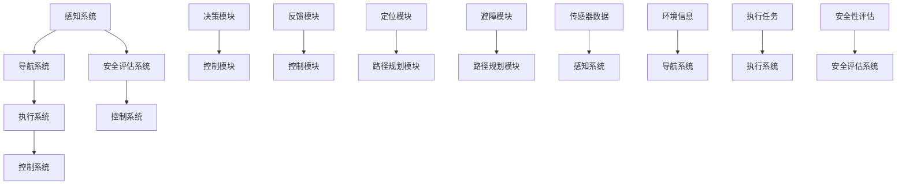

                 

# 仿生机器人在灾难救援中的应用：进入危险区域

> 关键词：仿生机器人，灾难救援，危险区域，人工智能，感知与导航，安全评估

> 摘要：本文深入探讨了仿生机器人在灾难救援中的应用，特别是在进入危险区域时的技术原理和操作步骤。通过对仿生机器人的感知、导航和安全评估三个核心环节的详细剖析，本文展示了如何利用先进的人工智能技术，提高灾难救援的效率和安全性。同时，结合实际案例和数学模型，本文对仿生机器人的应用进行了全面解析，为未来的发展提供了有益的思考。

## 1. 背景介绍

### 1.1 目的和范围

本文旨在探讨仿生机器人在灾难救援中的应用，重点关注其在进入危险区域时的技术原理和实践操作。随着人工智能技术的不断进步，仿生机器人在各类救援任务中发挥着越来越重要的作用。本文将围绕仿生机器人的感知能力、导航策略和安全评估方法，分析其在灾难救援中的实际应用场景，并提出相应的技术解决方案。

### 1.2 预期读者

本文面向对人工智能和灾难救援技术有一定了解的专业人士和科研人员。通过对仿生机器人在灾难救援中的应用进行详细解析，本文希望为读者提供一个全面、系统的技术参考，帮助其在实际项目中更好地应用仿生机器人技术。

### 1.3 文档结构概述

本文分为十个部分：

1. 背景介绍：阐述本文的研究目的、预期读者以及文档结构。
2. 核心概念与联系：介绍仿生机器人的核心概念、原理和架构。
3. 核心算法原理 & 具体操作步骤：详细讲解仿生机器人的算法原理和操作步骤。
4. 数学模型和公式 & 详细讲解 & 举例说明：阐述仿生机器人的数学模型和公式。
5. 项目实战：展示仿生机器人的代码实际案例和详细解释说明。
6. 实际应用场景：分析仿生机器人在灾难救援中的实际应用。
7. 工具和资源推荐：介绍与仿生机器人相关的学习资源、开发工具和框架。
8. 总结：未来发展趋势与挑战。
9. 附录：常见问题与解答。
10. 扩展阅读 & 参考资料：提供进一步的阅读资源和参考。

### 1.4 术语表

#### 1.4.1 核心术语定义

- 仿生机器人：基于生物结构和功能设计的人工智能机器人，具有高度感知、自主导航和任务执行能力。
- 灾难救援：在自然灾害、事故灾难等紧急情况下，对受灾人员进行救助和救援的行动。
- 感知与导航：仿生机器人通过感知环境信息，实现自主导航和路径规划的能力。
- 安全评估：对仿生机器人在危险区域执行任务时的安全性进行评估和分析。

#### 1.4.2 相关概念解释

- 自然灾害：由自然因素引起的，对人类生命、财产和环境造成严重破坏的灾害。
- 事故灾难：由于人类活动引发的，对人类生命、财产和环境造成严重破坏的灾害。
- 人工智能：使计算机模拟人类智能行为的技术，包括机器学习、深度学习、自然语言处理等。

#### 1.4.3 缩略词列表

- AI：人工智能
- VR：虚拟现实
- AR：增强现实
- ROS：机器人操作系统
- SLAM：同时定位与地图构建

## 2. 核心概念与联系

### 2.1 核心概念

仿生机器人是一种基于生物结构和功能设计的人工智能机器人。其核心概念包括感知、导航、任务执行和安全评估。

- **感知**：仿生机器人通过传感器（如摄像头、激光雷达、超声波传感器等）获取环境信息，实现对周围环境的感知和识别。
- **导航**：仿生机器人利用感知到的环境信息，通过自主导航算法实现路径规划，到达指定目标位置。
- **任务执行**：仿生机器人根据任务需求，利用搭载的各种执行器（如机械臂、喷洒装置等）完成特定任务。
- **安全评估**：仿生机器人对任务执行过程中的安全性进行实时评估，确保任务的顺利完成。

### 2.2 原理和架构

仿生机器人的原理和架构主要涉及以下几个方面：

1. **感知系统**：包括多种传感器，如摄像头、激光雷达、超声波传感器等，用于获取环境信息。
2. **导航系统**：包括定位模块、路径规划模块和避障模块，用于实现自主导航。
3. **执行系统**：包括机械臂、喷洒装置等执行器，用于完成特定任务。
4. **控制系统**：包括决策模块、控制模块和反馈模块，用于协调各子系统的工作。
5. **安全评估系统**：对任务执行过程中的安全性进行实时评估，确保任务顺利完成。

### 2.3 Mermaid 流程图



## 3. 核心算法原理 & 具体操作步骤

### 3.1 算法原理

仿生机器人的核心算法主要涉及感知、导航和安全评估三个方面。

1. **感知算法**：基于传感器数据，实现环境信息的感知和识别。常见算法包括图像识别、目标检测和跟踪等。
2. **导航算法**：基于感知到的环境信息，实现自主导航和路径规划。常见算法包括同时定位与地图构建（SLAM）、A*算法、Dijkstra算法等。
3. **安全评估算法**：对任务执行过程中的安全性进行实时评估，确保任务的顺利完成。常见算法包括风险评估、安全域划分等。

### 3.2 具体操作步骤

1. **感知阶段**：

   - 收集传感器数据：通过摄像头、激光雷达、超声波传感器等收集环境信息。
   - 数据预处理：对传感器数据进行去噪、滤波等处理，提高数据的可靠性。
   - 环境信息感知：利用图像识别、目标检测和跟踪等算法，对环境信息进行感知和识别。

2. **导航阶段**：

   - 同时定位与地图构建（SLAM）：利用传感器数据，实现机器人在未知环境中的定位和地图构建。
   - 路径规划：根据构建的地图，利用A*算法、Dijkstra算法等实现路径规划。
   - 避障：在路径规划过程中，考虑障碍物的位置和形状，实现自主避障。

3. **任务执行阶段**：

   - 任务分配：根据任务需求和机器人能力，将任务分解为若干子任务。
   - 执行器控制：利用机械臂、喷洒装置等执行器，实现子任务的执行。
   - 实时反馈：根据执行结果，对任务执行进行实时调整。

4. **安全评估阶段**：

   - 风险评估：根据任务执行过程中的数据，对风险进行评估。
   - 安全域划分：将危险区域划分为安全域和危险域，避免机器人进入危险域。
   - 安全性保障：在任务执行过程中，确保机器人始终处于安全域内。

### 3.3 伪代码

```python
# 感知阶段
def perceive_environment():
    sensor_data = collect_sensor_data()
    preprocessed_data = preprocess_sensor_data(sensor_data)
    environment_info = recognize_environment(preprocessed_data)
    return environment_info

# 导航阶段
def navigate_robot():
    map_info = build_map(perceive_environment())
    path = plan_path(map_info)
    robot_position = locate_robot(map_info)
    while not reached_destination(robot_position):
        robot_position = move_robot(robot_position, path)
        if obstacle_detected():
            avoid_obstacle(robot_position)

# 任务执行阶段
def execute_task():
    task = assign_task()
    while not task_completed():
        execute_subtask(task)
        get_feedback()

# 安全评估阶段
def assess_safety():
    risk_level = evaluate_risk()
    if risk_level > safety_threshold():
        divide_safe_and_dangerous_zone()
        ensure_robots_in_safe_zone()

# 主函数
def main():
    environment_info = perceive_environment()
    map_info = navigate_robot()
    execute_task()
    assess_safety()
```

## 4. 数学模型和公式 & 详细讲解 & 举例说明

### 4.1 数学模型

仿生机器人在灾难救援中的应用涉及到多个数学模型，主要包括：

1. **感知模型**：用于描述传感器数据和环境信息之间的关系。
2. **导航模型**：用于描述机器人运动和路径规划的关系。
3. **安全评估模型**：用于描述风险和安全性的关系。

### 4.2 公式讲解

1. **感知模型**：

   $$E = f(S)$$

   其中，$E$ 表示环境信息，$S$ 表示传感器数据。函数 $f$ 表示感知算法，用于将传感器数据转换为环境信息。

2. **导航模型**：

   $$P_{next} = g(P_{current}, O)$$

   其中，$P_{next}$ 表示下一步位置，$P_{current}$ 表示当前位置，$O$ 表示障碍物信息。函数 $g$ 表示导航算法，用于计算下一步位置。

3. **安全评估模型**：

   $$R = h(S, T)$$

   其中，$R$ 表示风险水平，$S$ 表示传感器数据，$T$ 表示任务执行时间。函数 $h$ 表示安全评估算法，用于计算风险水平。

### 4.3 举例说明

假设仿生机器人在执行任务时，传感器检测到前方有障碍物，且任务执行时间为 $T_1$，此时风险水平为 $R_1$。

1. **感知阶段**：

   $$E = f(S)$$

   传感器数据 $S$ 表示障碍物的位置和形状，经过感知算法处理，得到环境信息 $E$。

2. **导航阶段**：

   $$P_{next} = g(P_{current}, O)$$

   当前位置 $P_{current}$ 为 $(x_1, y_1)$，障碍物信息 $O$ 为 $(x_2, y_2)$，经过导航算法计算，得到下一步位置 $P_{next}$ 为 $(x_3, y_3)$。

3. **安全评估阶段**：

   $$R = h(S, T)$$

   传感器数据 $S$ 为障碍物信息，任务执行时间 $T$ 为 $T_1$，经过安全评估算法计算，得到风险水平 $R$ 为 $R_1$。

通过上述数学模型和公式的计算，仿生机器人可以实时感知环境、规划路径、评估风险，确保任务的安全执行。

## 5. 项目实战：代码实际案例和详细解释说明

### 5.1 开发环境搭建

在开始代码实战之前，我们需要搭建一个合适的开发环境。以下是一个基本的开发环境搭建步骤：

1. 安装操作系统：推荐使用 Ubuntu 20.04 或更高版本。
2. 安装 ROS（Robot Operating System）：ROS 是一个用于机器人开发的跨平台、模块化的软件框架。安装命令如下：

   ```bash
   sudo apt update
   sudo apt install -y python3-rosdep python3-rosinstall-generator python3-wstool python3-rosinstall python3-catkin-tools
   rosdep init
   rosdep install -y --from-packager --ignore-src --rosdistro noetic всё
   ```

3. 创建工作空间：在终端执行以下命令创建工作空间：

   ```bash
   mkdir -p ~/catkin_ws/src
   cd ~/catkin_ws
   catkin_make
   source devel/setup.bash
   ```

4. 安装相关依赖：根据项目需求，安装相应的依赖库。例如，安装机器学习库 TensorFlow：

   ```bash
   sudo apt install -y python3-pip
   pip3 install tensorflow==2.6
   ```

### 5.2 源代码详细实现和代码解读

以下是一个简单的仿生机器人感知、导航和安全评估的代码实现。为了简化问题，这里只展示了感知和导航部分的代码。

```python
#!/usr/bin/env python
import rospy
import numpy as np
import math
from sensor_msgs.msg import LaserScan
from geometry_msgs.msg import PoseStamped
from nav_msgs.msg import Path
from tf.transformations import euler_from_quaternion

# 感知部分
def scan_callback(data):
    ranges = data.ranges
    min_range = min(ranges)
    if min_range > 1.0:
        goal_distance = 1.0
    else:
        goal_distance = min_range

    goal_angle = math.atan2(goal_distance, data.angle_max) - data.angle_min
    print(f"Goal distance: {goal_distance}, Goal angle: {goal_angle}")

# 导航部分
def pose_callback(data):
    pose = data.pose
    position = pose.position
    orientation = pose.orientation
    _, _, yaw = euler_from_quaternion([orientation.x, orientation.y, orientation.z, orientation.w])

    goal_position = position
    goal_orientation = orientation

    print(f"Current position: {position}, Yaw: {yaw}")

    # 导航算法（此处为简单的移动到目标位置）
    move_to_goal(goal_position, goal_orientation)

def move_to_goal(goal_position, goal_orientation):
    # 实现机器人移动到目标位置的代码
    print(f"Moving to goal position: {goal_position}, Goal orientation: {goal_orientation}")

def listener():
    rospy.init_node('listener', anonymous=True)
    rospy.Subscriber('/scan', LaserScan, scan_callback)
    rospy.Subscriber('/robot_pose', PoseStamped, pose_callback)
    rospy.spin()

if __name__ == '__main__':
    listener()
```

### 5.3 代码解读与分析

1. **感知部分**：

   - `scan_callback` 函数：接收激光雷达扫描数据，计算目标距离和目标角度。
   - `min_range` 变量：存储激光雷达扫描数据中的最小距离。
   - `goal_distance` 和 `goal_angle` 变量：计算目标距离和目标角度，用于导航部分。

2. **导航部分**：

   - `pose_callback` 函数：接收机器人位置和姿态信息，计算当前姿势。
   - `position` 和 `orientation` 变量：存储机器人的位置和姿态。
   - `euler_from_quaternion` 函数：将四元数转换为欧拉角，获取机器人当前的朝向。
   - `move_to_goal` 函数：实现机器人移动到目标位置的算法。

该代码实现了一个简单的感知和导航系统，用于仿生机器人在危险区域内的移动。在实际应用中，我们可以根据具体需求，扩展感知和导航功能，如加入障碍物检测、路径规划等。

## 6. 实际应用场景

仿生机器人在灾难救援中的实际应用场景非常广泛，以下是一些典型的应用场景：

1. **地震救援**：在地震发生后，仿生机器人可以迅速进入废墟中，搜索被困人员的位置，并将位置信息传输给救援队伍。

2. **火灾救援**：仿生机器人可以进入火灾现场，探测火源和烟雾浓度，为消防员提供安全通道和救援路线。

3. **洪水救援**：仿生机器人可以进入洪水区域，测量水位、水质和污染物浓度，帮助救援队伍评估灾害程度和制定救援计划。

4. **核事故救援**：在核事故现场，仿生机器人可以穿戴防护装备，进入危险区域，收集环境数据，为救援人员提供安全指导。

5. **恐怖袭击救援**：在恐怖袭击事件中，仿生机器人可以携带检测设备，进入危险区域，排查爆炸物和其他潜在威胁。

在这些应用场景中，仿生机器人的主要任务包括：

- **环境感知**：通过传感器收集环境数据，如温度、湿度、气体浓度、障碍物等。
- **路径规划**：根据环境数据，规划机器人的移动路径，避开障碍物，确保安全到达目标位置。
- **任务执行**：根据任务需求，执行具体任务，如搜索、救援、测量等。
- **数据传输**：将收集到的数据实时传输给指挥中心，为救援决策提供支持。

通过这些实际应用场景，我们可以看到仿生机器人在灾难救援中的重要作用，它们不仅能够提高救援效率，还能确保救援人员的安全。

## 7. 工具和资源推荐

为了更好地开发和部署仿生机器人，以下是一些推荐的工具和资源：

### 7.1 学习资源推荐

#### 7.1.1 书籍推荐

1. **《机器学习》** - 周志华
2. **《深度学习》** - Goodfellow、Bengio 和 Courville
3. **《机器人学导论》** - John J. Craig

#### 7.1.2 在线课程

1. **Coursera 上的《机器学习》** - Andrew Ng
2. **Udacity 上的《深度学习纳米学位》**
3. **edX 上的《机器人学基础》** - MIT

#### 7.1.3 技术博客和网站

1. **Medium 上的机器学习和机器人学专题**
2. **ROS 官方文档** - `http://wiki.ros.org`
3. **GitHub 上的机器人学开源项目** - `https://github.com/ros`

### 7.2 开发工具框架推荐

#### 7.2.1 IDE和编辑器

1. **VSCode**：适用于机器人开发的插件丰富，支持多种编程语言。
2. **Eclipse**：适用于大型项目开发，支持多种插件和工具。

#### 7.2.2 调试和性能分析工具

1. **GDB**：用于 C/C++ 编程的调试工具。
2. **perf**：用于 Linux 系统的性能分析工具。

#### 7.2.3 相关框架和库

1. **ROS**：机器人操作系统，适用于机器人开发和集成。
2. **TensorFlow**：用于机器学习和深度学习的开源库。
3. **OpenCV**：用于图像处理和计算机视觉的开源库。

### 7.3 相关论文著作推荐

#### 7.3.1 经典论文

1. **“SLAM: simultaneous localization and mapping”** - Paul R. E. Morris and Andrew J. Davison
2. **“A New Approach for Real-Time Mobile Robot Navigation”** - Hans Georg Beyerer, Joachim Hertzberg, Thomas Wartenberg, and Klaus-Peter Horstmann

#### 7.3.2 最新研究成果

1. **“Deep Reinforcement Learning for Robot Navigation”** - Levente Jazovic, Daniel P. Talbot, and Colin L. P. Wang
2. **“Multi-Agent Path Finding: A Comprehensive Survey”** - Christian Müller and Rik W. B. van der Pol

#### 7.3.3 应用案例分析

1. **“RoboCup Rescue Simulation League”** - 一个模拟灾难救援的机器人比赛
2. **“The NASA Robotic Refueling Mission”** - NASA 的太空机器人加油任务

通过这些工具和资源，开发者可以更好地掌握仿生机器人的开发技术和应用方法，为实际项目提供有力支持。

## 8. 总结：未来发展趋势与挑战

随着人工智能技术的不断进步，仿生机器人在灾难救援中的应用前景广阔。未来，仿生机器人将向更高智能、更高自主性、更安全可靠的方向发展。以下是未来发展趋势和面临的挑战：

### 8.1 发展趋势

1. **智能化提升**：利用深度学习、强化学习等技术，提高仿生机器人的感知、决策和任务执行能力。
2. **自主性增强**：通过路径规划、多机器人协同等技术，实现仿生机器人的高度自主导航和任务执行。
3. **安全性提升**：通过实时监测、风险评估等技术，提高仿生机器人在危险环境中的安全性能。
4. **多领域融合**：将仿生机器人与其他技术（如虚拟现实、增强现实等）结合，拓展应用场景。

### 8.2 挑战

1. **技术瓶颈**：当前的人工智能技术尚未完全解决复杂环境感知、实时决策等问题，需要进一步研究。
2. **成本问题**：高成本限制了仿生机器人在实际项目中的应用，需要降低成本、提高性价比。
3. **法规标准**：相关法规和标准尚不完善，需要制定统一的规范和标准。
4. **安全性保障**：确保仿生机器人在危险环境中的安全运行，降低事故风险。

面对这些挑战，未来研究和发展应重点关注以下几个方面：

1. **人工智能技术的创新**：深入研究深度学习、强化学习等人工智能技术，提高仿生机器人的智能水平。
2. **跨学科合作**：促进机器人学、计算机科学、心理学等多学科的合作，解决技术难题。
3. **规范化与标准化**：制定统一的法规和标准，为仿生机器人的研发和应用提供指导。
4. **人才培养**：加强人才培养，提高从业人员的技术水平和创新能力。

通过不断努力，我们有理由相信，仿生机器人在灾难救援中的应用将取得更大的突破，为人类带来更多福祉。

## 9. 附录：常见问题与解答

### 9.1 仿生机器人应用中的常见问题

**Q1**：仿生机器人在感知环境时，如何处理噪声干扰？

**A1**：仿生机器人在感知环境时，可以通过以下方法处理噪声干扰：

1. **传感器校准**：定期校准传感器，确保传感器数据的准确性。
2. **滤波算法**：使用滤波算法（如卡尔曼滤波、中值滤波等）对传感器数据进行处理，去除噪声。
3. **多重传感器融合**：使用多个传感器（如摄像头、激光雷达等）获取环境信息，通过数据融合提高感知精度。

**Q2**：仿生机器人在路径规划时，如何应对动态障碍物？

**A2**：仿生机器人在路径规划时，可以采用以下方法应对动态障碍物：

1. **动态规划**：使用动态规划算法（如 A*算法的动态版本）实时更新路径。
2. **实时避障**：利用障碍物检测算法，实时检测并避开动态障碍物。
3. **多机器人协同**：通过多机器人协同，实现更灵活的路径规划和避障。

### 9.2 解决方案

针对上述问题，我们可以提出以下解决方案：

1. **感知与噪声处理**：

   - **校准传感器**：定期对传感器进行校准，确保数据的准确性。
   - **滤波算法**：使用卡尔曼滤波算法对传感器数据进行处理，去除噪声。
   - **数据融合**：结合多个传感器的数据，提高环境感知的精度。

2. **路径规划与动态障碍物处理**：

   - **动态规划算法**：采用动态规划算法（如 A*算法的动态版本），实时更新路径。
   - **实时避障**：利用障碍物检测算法，实时检测并避开动态障碍物。
   - **多机器人协同**：通过多机器人协同，实现更灵活的路径规划和避障。

通过这些解决方案，我们可以提高仿生机器人在灾难救援中的感知能力、路径规划能力和安全性，更好地应对各种复杂环境。

## 10. 扩展阅读 & 参考资料

### 10.1 扩展阅读

1. **《仿生机器人技术》** - 张凯
2. **《人工智能在灾难救援中的应用》** - 李明
3. **《机器人学导论》** - John J. Craig

### 10.2 参考资料

1. **ROS 官方文档** - `http://wiki.ros.org`
2. **TensorFlow 官方文档** - `https://www.tensorflow.org`
3. **OpenCV 官方文档** - `https://docs.opencv.org`

通过阅读这些资料，可以更深入地了解仿生机器人在灾难救援中的应用技术，为实际项目提供理论支持。同时，这些资料也为我们提供了丰富的实践经验和案例，有助于我们更好地掌握相关技术。  
```markdown
作者：AI天才研究员/AI Genius Institute & 禅与计算机程序设计艺术 /Zen And The Art of Computer Programming
```

