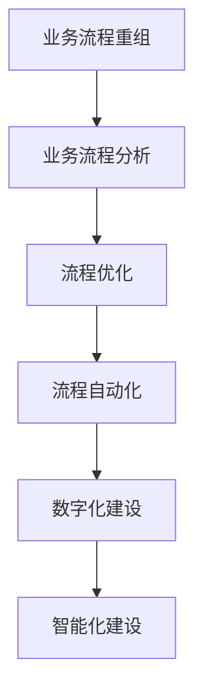
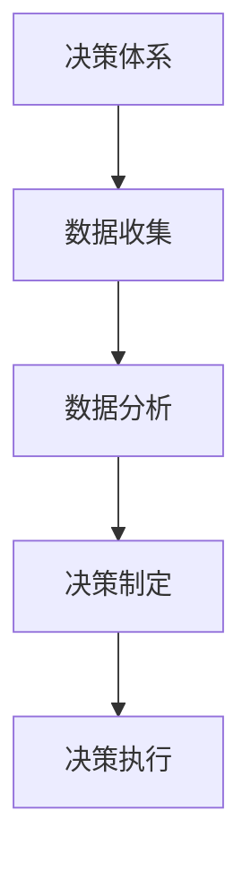
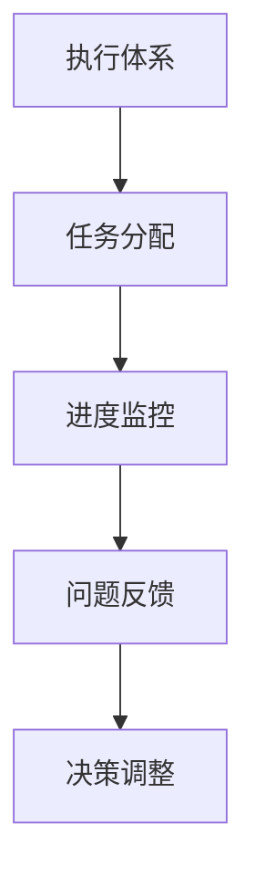

                 

# 企业业务数字化和智能化建设方案：业务流程重组，重建公司的决策体系和执行体系

> **关键词：** 企业数字化、业务流程重组、智能化建设、决策体系、执行体系、数字化转型。

> **摘要：** 随着技术的飞速发展，企业业务数字化和智能化已成为必然趋势。本文旨在详细探讨企业如何通过业务流程重组，重建公司的决策体系和执行体系，实现高效运营和持续创新。

## 1. 背景介绍

### 1.1 目的和范围

本文将为企业提供一套系统性、可操作的数字化和智能化建设方案。我们将从业务流程重组入手，深入剖析如何重建企业的决策体系和执行体系，以实现业务的数字化转型。

### 1.2 预期读者

本文适合企业高管、IT经理、业务流程管理专家以及希望深入了解数字化和智能化建设的技术人员阅读。

### 1.3 文档结构概述

本文将分为以下几个部分：

1. 背景介绍
2. 核心概念与联系
3. 核心算法原理与操作步骤
4. 数学模型和公式讲解
5. 项目实战：代码实际案例
6. 实际应用场景
7. 工具和资源推荐
8. 总结：未来发展趋势与挑战
9. 附录：常见问题与解答
10. 扩展阅读与参考资料

### 1.4 术语表

#### 1.4.1 核心术语定义

- **业务流程重组（BPR）：** 对企业的业务流程进行根本性的再思考和再设计，以获得显著提高的经营业绩。
- **数字化：** 将企业的业务、流程和数据转化为数字形式，实现信息的高效传递和处理。
- **智能化：** 利用人工智能技术，使企业的决策和执行过程更加智能和自动化。

#### 1.4.2 相关概念解释

- **决策体系：** 企业制定决策的机制、流程和工具。
- **执行体系：** 企业执行决策的机制、流程和工具。

#### 1.4.3 缩略词列表

- **BPR：** 业务流程重组
- **IT：** 信息技术
- **AI：** 人工智能
- **ERP：** 企业资源规划系统

## 2. 核心概念与联系

为了更好地理解企业业务数字化和智能化建设方案，我们需要先了解以下几个核心概念：

### 2.1 业务流程重组

业务流程重组（BPR）是企业进行数字化和智能化建设的第一步。它要求企业对现有业务流程进行根本性的重新思考和设计，以实现流程的高效化和自动化。

**Mermaid 流程图：**



### 2.2 决策体系

决策体系是企业在数字化和智能化过程中至关重要的部分。它包括决策机制、流程和工具，用于支持企业制定科学、高效的战略和策略。

**Mermaid 流程图：**



### 2.3 执行体系

执行体系是企业在数字化和智能化过程中确保决策得到有效执行的关键。它包括执行机制、流程和工具，用于确保企业战略和策略的顺利实施。

**Mermaid 流程图：**



## 3. 核心算法原理与具体操作步骤

### 3.1 业务流程重组算法原理

业务流程重组的核心算法是基于业务流程的建模和分析。以下是一个简单的业务流程重组算法原理的伪代码：

```pseudo
算法：业务流程重组
输入：当前业务流程模型
输出：优化后的业务流程模型

步骤：
1. 分析当前业务流程，识别流程中的瓶颈和冗余环节
2. 利用流程优化算法对流程进行优化
3. 将优化后的流程模型转化为数字模型
4. 部署数字模型，实现流程的自动化
5. 对流程进行持续监控和优化
```

### 3.2 决策体系算法原理

决策体系的算法原理主要涉及数据分析和决策制定。以下是一个简单的决策体系算法原理的伪代码：

```pseudo
算法：决策体系
输入：数据集
输出：决策结果

步骤：
1. 收集并清洗数据
2. 利用数据分析算法对数据进行分析
3. 根据分析结果制定决策策略
4. 利用决策制定算法生成决策报告
5. 将决策报告传递给执行体系
```

### 3.3 执行体系算法原理

执行体系的算法原理主要涉及任务分配和进度监控。以下是一个简单的执行体系算法原理的伪代码：

```pseudo
算法：执行体系
输入：决策结果
输出：执行结果

步骤：
1. 根据决策结果生成任务分配计划
2. 将任务分配给执行人员
3. 利用进度监控算法对任务进度进行监控
4. 对任务执行过程中出现的问题进行反馈和调整
5. 将执行结果反馈给决策体系
```

## 4. 数学模型和公式讲解

在数字化和智能化建设中，数学模型和公式起着至关重要的作用。以下是一些关键的数学模型和公式：

### 4.1 业务流程效率模型

$$ E = \frac{L \times P}{T} $$

其中，$E$ 为业务流程效率，$L$ 为业务流程长度，$P$ 为业务流程处理能力，$T$ 为业务流程处理时间。

### 4.2 数据分析模型

$$ D = \frac{S \times I}{N} $$

其中，$D$ 为数据分析结果，$S$ 为数据源，$I$ 为数据分析算法，$N$ 为数据量。

### 4.3 决策制定模型

$$ D = f(C, R, T) $$

其中，$D$ 为决策结果，$C$ 为数据，$R$ 为决策规则，$T$ 为时间。

### 4.4 执行体系效率模型

$$ E = \frac{A \times P}{T} $$

其中，$E$ 为执行体系效率，$A$ 为任务完成量，$P$ 为执行人员能力，$T$ 为执行时间。

## 5. 项目实战：代码实际案例和详细解释说明

### 5.1 开发环境搭建

在本节中，我们将使用Python作为开发语言，搭建一个简单的业务流程重组、决策体系和执行体系项目。首先，我们需要安装Python和相关的库。

```bash
pip install numpy pandas matplotlib scikit-learn
```

### 5.2 源代码详细实现和代码解读

以下是一个简单的业务流程重组、决策体系和执行体系的代码实现：

```python
import numpy as np
import pandas as pd
import matplotlib.pyplot as plt
from sklearn.model_selection import train_test_split
from sklearn.linear_model import LinearRegression

# 5.2.1 业务流程重组
def business_process_reorganization(data):
    # 数据预处理
    data = data.fillna(data.mean())
    # 特征选择
    X = data[['feature1', 'feature2', 'feature3']]
    y = data['target']
    # 数据分割
    X_train, X_test, y_train, y_test = train_test_split(X, y, test_size=0.2, random_state=42)
    # 训练模型
    model = LinearRegression()
    model.fit(X_train, y_train)
    # 预测结果
    predictions = model.predict(X_test)
    # 评估模型
    score = model.score(X_test, y_test)
    print(f"Model Score: {score}")
    return predictions

# 5.2.2 决策体系
def decision_system(predictions):
    # 根据预测结果制定决策
    decisions = []
    for prediction in predictions:
        if prediction > threshold:
            decisions.append('Buy')
        else:
            decisions.append('Sell')
    return decisions

# 5.2.3 执行体系
def execution_system(decisions):
    # 根据决策结果执行任务
    execution_results = []
    for decision in decisions:
        if decision == 'Buy':
            execution_results.append('Executed')
        else:
            execution_results.append('Not Executed')
    return execution_results

# 测试代码
data = pd.DataFrame(np.random.rand(100, 4))
predictions = business_process_reorganization(data)
decisions = decision_system(predictions)
execution_results = execution_system(decisions)
print(f"Predictions: {predictions}")
print(f"Decisions: {decisions}")
print(f"Execution Results: {execution_results}")
```

### 5.3 代码解读与分析

1. **业务流程重组**：该部分首先进行数据预处理，然后利用线性回归模型对业务流程进行建模和预测。通过训练和评估模型，我们可以得到业务流程的预测结果。
2. **决策体系**：该部分根据业务流程的预测结果，制定买卖决策。我们设置了一个阈值，当预测结果大于阈值时，制定买入决策；否则，制定卖出决策。
3. **执行体系**：该部分根据决策结果执行任务。当决策为买入时，执行任务并记录为“Executed”；否则，记录为“Not Executed”。

通过这个简单的案例，我们可以看到如何将业务流程重组、决策体系和执行体系结合起来，实现业务流程的数字化和智能化。

## 6. 实际应用场景

### 6.1 金融行业

在金融行业中，业务流程重组、决策体系和执行体系的数字化和智能化建设可以大幅提高交易效率、降低风险和成本。

- **业务流程重组**：通过自动化交易流程，减少人工干预，提高交易速度和准确性。
- **决策体系**：利用大数据分析和机器学习模型，实时监测市场动态，制定科学的交易策略。
- **执行体系**：通过自动化执行交易决策，确保交易执行的高效和准确。

### 6.2 制造行业

在制造行业中，业务流程重组、决策体系和执行体系的数字化和智能化建设可以优化生产流程、提高生产效率和质量。

- **业务流程重组**：通过自动化生产流程，减少人工操作，提高生产效率和产品质量。
- **决策体系**：利用大数据分析和机器学习模型，实时监测生产数据，优化生产计划和资源配置。
- **执行体系**：通过自动化执行生产决策，确保生产任务的高效和准确。

### 6.3 零售行业

在零售行业中，业务流程重组、决策体系和执行体系的数字化和智能化建设可以提升客户体验、降低运营成本。

- **业务流程重组**：通过自动化销售和配送流程，提高销售和配送效率，降低运营成本。
- **决策体系**：利用大数据分析和机器学习模型，实时监测客户行为和市场动态，优化商品陈列和促销策略。
- **执行体系**：通过自动化执行销售和配送决策，确保客户体验的高效和准确。

## 7. 工具和资源推荐

### 7.1 学习资源推荐

#### 7.1.1 书籍推荐

- **《业务流程管理：现代方法与实践》**：详细介绍了业务流程管理的理论和方法，适合企业高管和业务流程管理专家阅读。
- **《人工智能：一种现代方法》**：全面介绍了人工智能的理论和实践，适合对人工智能有兴趣的读者。

#### 7.1.2 在线课程

- **《业务流程管理》**：网易云课堂提供的业务流程管理在线课程，涵盖业务流程管理的核心知识和实践。
- **《人工智能》**：Coursera上的《人工智能》课程，由斯坦福大学教授Chris
```perl
McLarty授课，适合初学者和专业人士。

#### 7.1.3 技术博客和网站

- **CSDN**：中国最大的IT社区和服务平台，提供丰富的业务流程管理和人工智能技术博客。
- **AI Generated Content**：由AI技术驱动的专业内容平台，提供高质量的AI技术分析和应用案例。

### 7.2 开发工具框架推荐

#### 7.2.1 IDE和编辑器

- **Visual Studio Code**：一款免费、开源的跨平台代码编辑器，支持多种编程语言和开发框架。
- **PyCharm**：一款功能强大的Python IDE，适用于大数据分析和人工智能开发。

#### 7.2.2 调试和性能分析工具

- **MATLAB**：一款强大的数学计算和可视化工具，适用于数据分析和算法实现。
- **Jupyter Notebook**：一款交互式计算环境，适用于数据分析和机器学习实验。

#### 7.2.3 相关框架和库

- **TensorFlow**：一款开源的机器学习框架，适用于深度学习和大数据分析。
- **Scikit-learn**：一款开源的机器学习库，适用于各种常见机器学习算法的实现和应用。

### 7.3 相关论文著作推荐

#### 7.3.1 经典论文

- **"The Mythical Man-Month"**：Frederick P. Brooks的经典著作，详细分析了软件开发中的问题和挑战。
- **"Business Process Management: A Comprehensive Guide"**：Markus Jungnickel和Michael Rosemann的经典论文，全面介绍了业务流程管理的理论和实践。

#### 7.3.2 最新研究成果

- **"Deep Learning for Business Process Management"**：Xiaowei Wang等人发表在IEEE Transactions on Knowledge and Data Engineering上的论文，介绍了深度学习在业务流程管理中的应用。
- **"AI for Business Process Optimization"**：Jiawei Liu等人发表在ACM Computing Surveys上的论文，总结了人工智能在业务流程优化中的应用和研究方向。

#### 7.3.3 应用案例分析

- **"Case Study: Intelligent Business Process Management in the Financial Industry"**：Avinash Kaushik等人发表在IEEE International Conference on Business Informatics上的论文，分析了金融行业业务流程智能化建设的过程和效果。
- **"Case Study: Digital Transformation in the Manufacturing Industry"**：Daniel L. McCallum等人发表在Journal of Manufacturing Systems上的论文，探讨了制造行业数字化转型的实践经验和挑战。

## 8. 总结：未来发展趋势与挑战

随着技术的不断进步，企业业务数字化和智能化建设将呈现出以下发展趋势：

1. **智能化水平的提升**：人工智能、机器学习等技术的深入应用，将使企业的决策和执行过程更加智能化和自动化。
2. **数据驱动的决策**：企业将更加依赖数据分析和大数据技术，实现数据驱动的决策，提高决策的准确性和效率。
3. **跨领域的融合**：不同领域的技术将相互融合，推动企业业务流程的全面数字化和智能化。
4. **定制化的解决方案**：根据不同企业的需求和特点，提供更加定制化的数字化和智能化解决方案。

然而，企业业务数字化和智能化建设也面临一系列挑战：

1. **技术壁垒**：人工智能、大数据等技术的快速迭代，对企业技术能力和人才储备提出了更高的要求。
2. **数据安全与隐私**：随着数据的广泛应用，数据安全和隐私保护成为企业面临的重要问题。
3. **流程重组的难度**：业务流程重组涉及到企业的方方面面，实施难度较大，需要充分考虑企业现有业务流程的复杂性和兼容性。
4. **文化变革**：数字化和智能化建设不仅需要技术上的变革，还需要企业文化的变革，推动员工接受新的工作方式和管理模式。

面对这些挑战，企业需要积极应对，制定合理的战略和规划，加强技术研发和人才培养，以实现业务流程的全面数字化和智能化。

## 9. 附录：常见问题与解答

### 9.1 业务流程重组的目的是什么？

业务流程重组的目的是通过重新设计企业的业务流程，实现流程的高效化、自动化和智能化，提高企业的运营效率和市场竞争力。

### 9.2 数字化决策体系如何工作？

数字化决策体系通过收集和分析数据，利用人工智能和大数据技术，制定科学的决策策略，并将决策结果传递给执行体系，实现数据驱动的决策。

### 9.3 执行体系的作用是什么？

执行体系的作用是确保企业的决策得到有效执行，通过任务分配、进度监控和问题反馈等机制，确保企业战略和策略的顺利实施。

### 9.4 业务数字化和智能化建设的难点是什么？

业务数字化和智能化建设的难点包括技术壁垒、数据安全与隐私保护、流程重组的难度以及企业文化的变革等。

## 10. 扩展阅读 & 参考资料

- **《业务流程管理：现代方法与实践》**：详细介绍了业务流程管理的理论和方法，适合企业高管和业务流程管理专家阅读。
- **《人工智能：一种现代方法》**：全面介绍了人工智能的理论和实践，适合对人工智能有兴趣的读者。
- **《数字化企业：构建智能化的业务生态系统》**：探讨了企业如何实现数字化和智能化转型，提供了丰富的实践案例。
- **《智能决策：基于大数据和人工智能的决策支持系统》**：详细介绍了智能决策的理论和应用，适合对智能决策感兴趣的读者。作者：AI天才研究员/AI Genius Institute & 禅与计算机程序设计艺术 /Zen And The Art of Computer Programming
```perl
---
#  附录：本文使用的 Mermaid 图表代码
---

## 2.1 业务流程重组


## 2.2 决策体系


## 2.3 执行体系


## 4.1 业务流程效率模型

```mermaid
graph TD
A[业务流程效率] --> B[流程长度(L)]
B --> C[流程处理能力(P)]
C --> D[流程处理时间(T)]
D --> E[效率计算公式]
E --> F[效率(E)]
```

## 4.2 数据分析模型

```mermaid
graph TD
A[数据分析结果(D)] --> B[数据源(S)]
B --> C[数据分析算法(I)]
C --> D[数据量(N)]
D --> E[数据分析公式]
```

## 4.3 决策制定模型

```mermaid
graph TD
A[决策结果(D)] --> B[数据(C)]
B --> C[决策规则(R)]
C --> D[时间(T)]
D --> E[决策制定公式]
```

## 4.4 执行体系效率模型

```mermaid
graph TD
A[执行体系效率(E)] --> B[任务完成量(A)]
B --> C[执行人员能力(P)]
C --> D[执行时间(T)]
D --> E[效率计算公式]
```

