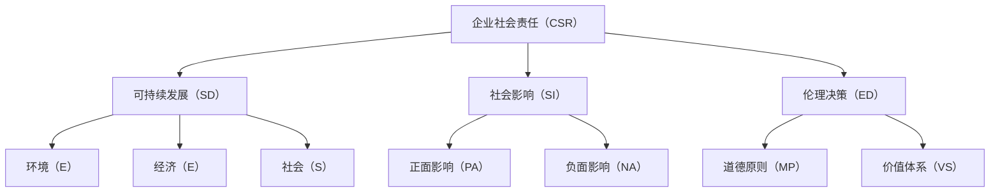

                 

# 企业社会责任管理：平衡利润和社会影响

> 关键词：企业社会责任、社会影响、利润平衡、可持续发展、伦理决策

> 摘要：随着全球化进程的加快和消费者对社会责任日益重视，企业社会责任（CSR）管理成为现代企业管理中的重要议题。本文旨在探讨如何在追求利润的同时，平衡企业的社会责任与社会影响，实现企业的可持续发展。通过分析核心概念、算法原理、数学模型以及实际案例，本文为企业提供了一种系统性的CSR管理策略。

## 1. 背景介绍

### 1.1 目的和范围

本文的目标是探讨如何通过企业社会责任管理，在追求利润的同时，平衡企业的社会责任与社会影响。我们将从以下几个角度展开讨论：

1. **核心概念与联系**：介绍企业社会责任管理的核心概念及其相互关系。
2. **核心算法原理 & 具体操作步骤**：阐述企业社会责任管理的算法原理和操作步骤。
3. **数学模型和公式 & 详细讲解 & 举例说明**：运用数学模型解释社会责任管理的关键因素。
4. **项目实战：代码实际案例和详细解释说明**：通过具体案例展示社会责任管理的实施过程。
5. **实际应用场景**：分析社会责任管理在不同行业中的应用。
6. **工具和资源推荐**：推荐学习资源和开发工具。
7. **总结：未来发展趋势与挑战**：总结社会责任管理的未来趋势和挑战。

### 1.2 预期读者

本文适用于希望了解并实践企业社会责任管理的企业高层管理者、CSR专员、企业管理专业学生以及其他对社会责任管理感兴趣的人士。

### 1.3 文档结构概述

本文结构如下：

1. **背景介绍**：介绍本文的目的、范围和预期读者。
2. **核心概念与联系**：阐述企业社会责任管理的核心概念及其相互关系。
3. **核心算法原理 & 具体操作步骤**：详细讲解企业社会责任管理的算法原理和操作步骤。
4. **数学模型和公式 & 详细讲解 & 举例说明**：运用数学模型解释社会责任管理的关键因素。
5. **项目实战：代码实际案例和详细解释说明**：通过具体案例展示社会责任管理的实施过程。
6. **实际应用场景**：分析社会责任管理在不同行业中的应用。
7. **工具和资源推荐**：推荐学习资源和开发工具。
8. **总结：未来发展趋势与挑战**：总结社会责任管理的未来趋势和挑战。
9. **附录：常见问题与解答**：回答读者可能遇到的问题。
10. **扩展阅读 & 参考资料**：提供进一步学习的资源。

### 1.4 术语表

#### 1.4.1 核心术语定义

- **企业社会责任（CSR）**：企业在其经营活动中对环境、社会和利益相关者的责任。
- **可持续发展**：满足当前需求而不损害子孙后代满足其需求的能力。
- **伦理决策**：基于道德原则和价值体系所做的决策。

#### 1.4.2 相关概念解释

- **企业社会责任报告**：企业公开其社会责任活动的文档。
- **利益相关者**：与企业经营有关的所有个人和组织。

#### 1.4.3 缩略词列表

- **CSR**：Corporate Social Responsibility，企业社会责任。
- **SDG**：Sustainable Development Goals，可持续发展目标。
- **ESG**：Environmental, Social, and Governance，环境、社会和治理。

## 2. 核心概念与联系

在探讨企业社会责任管理之前，我们需要了解其核心概念和它们之间的联系。以下是一个Mermaid流程图，展示了企业社会责任管理的核心概念及其相互关系：



### 2.1 核心概念解释

- **企业社会责任（CSR）**：企业社会责任是指企业在追求利润的同时，承担对环境、社会和利益相关者的责任。CSR的目标是确保企业的经营活动与可持续发展目标相一致。
  
- **可持续发展（SD）**：可持续发展是指满足当前需求而不损害子孙后代满足其需求的能力。可持续发展关注环境、经济和社会三个维度。

- **社会影响（SI）**：社会影响是指企业的经营活动对环境和社会产生的正面或负面影响。企业社会责任管理旨在最大化正面影响，最小化负面影响。

- **伦理决策（ED）**：伦理决策是指基于道德原则和价值体系所做的决策。伦理决策是确保企业社会责任管理有效性的关键。

- **道德原则（MP）**：道德原则是指导企业伦理决策的基本价值观，如公平、正义、诚信和尊重。

- **价值体系（VS）**：价值体系是企业内部的价值观和文化，影响企业的行为和决策。

## 3. 核心算法原理 & 具体操作步骤

企业社会责任管理的核心算法原理是平衡利润和社会影响。以下是一个简化的伪代码，描述了社会责任管理的算法原理和具体操作步骤：

```plaintext
算法：社会责任管理（CSR Management）

输入：企业利润（Profit），社会影响（Social Impact）
输出：调整后的利润（Adjusted Profit）

步骤：

1. 计算当前利润与社会影响的权重比（Weight Ratio）：
   Weight Ratio = Profit / Social Impact

2. 根据企业社会责任目标，设定目标权重比（Target Weight Ratio）：

3. 计算调整系数（Adjustment Factor）：
   Adjustment Factor = Target Weight Ratio / Current Weight Ratio

4. 调整利润（Adjusted Profit）：
   Adjusted Profit = Profit * Adjustment Factor

5. 输出调整后的利润（Adjusted Profit）

```

### 3.1 算法原理解释

该算法的基本原理是调整企业的利润，以平衡社会影响。具体来说，通过计算当前利润与社会影响的权重比，并与目标权重比进行比较，计算出调整系数。最后，根据调整系数调整利润，实现社会责任管理目标。

### 3.2 具体操作步骤

1. **计算当前利润与社会影响的权重比**：首先，我们需要计算当前利润与社会影响的权重比。这可以通过以下公式计算：

   $$\text{Weight Ratio} = \frac{\text{Profit}}{\text{Social Impact}}$$

   其中，Profit代表企业的当前利润，Social Impact代表企业当前的社会影响。

2. **设定目标权重比**：根据企业社会责任目标和可持续发展目标，设定目标权重比。目标权重比反映了企业希望达到的利润与社会影响之间的平衡状态。

3. **计算调整系数**：调整系数是目标权重比与当前权重比的比值。调整系数反映了需要调整的程度：

   $$\text{Adjustment Factor} = \frac{\text{Target Weight Ratio}}{\text{Current Weight Ratio}}$$

4. **调整利润**：根据调整系数调整利润。这可以通过以下公式计算：

   $$\text{Adjusted Profit} = \text{Profit} \times \text{Adjustment Factor}$$

   调整后的利润将反映企业的社会责任管理目标。

5. **输出调整后的利润**：最后，输出调整后的利润，作为企业新的利润目标。

通过以上步骤，企业可以实现社会责任管理目标，平衡利润和社会影响，实现可持续发展。

## 4. 数学模型和公式 & 详细讲解 & 举例说明

在社会责任管理中，数学模型和公式用于量化企业的社会责任和环境影响。以下是一个简单的数学模型，用于计算企业的社会责任成本和收益。

### 4.1 社会责任成本（Social Responsibility Cost）

社会责任成本是指企业为履行社会责任而支付的成本。社会责任成本包括直接成本和间接成本。

- **直接成本**：包括环保设施的投资、员工培训成本、社区捐赠等。
  
- **间接成本**：包括品牌形象损失、声誉风险、市场份额下降等。

社会责任成本的公式为：

$$\text{Social Responsibility Cost} = \text{Direct Cost} + \text{Indirect Cost}$$

### 4.2 社会责任收益（Social Responsibility Revenue）

社会责任收益是指企业通过履行社会责任所获得的收益。社会责任收益包括直接收益和间接收益。

- **直接收益**：包括客户忠诚度提高、员工满意度提高、社区支持等。
  
- **间接收益**：包括品牌价值提升、市场份额增加、企业形象改善等。

社会责任收益的公式为：

$$\text{Social Responsibility Revenue} = \text{Direct Revenue} + \text{Indirect Revenue}$$

### 4.3 社会责任成本与收益平衡（Balanced Social Responsibility）

社会责任成本与收益平衡是指企业通过优化社会责任管理，使社会责任成本与社会责任收益达到最佳平衡状态。

社会责任成本与收益平衡的公式为：

$$\text{Balanced Social Responsibility} = \text{Social Responsibility Cost} = \text{Social Responsibility Revenue}$$

### 4.4 举例说明

假设某企业当前的社会责任成本为100万元，社会责任收益为80万元。为了实现社会责任成本与收益的平衡，我们可以使用以下公式计算调整后的社会责任成本：

$$\text{Adjusted Social Responsibility Cost} = \text{Social Responsibility Cost} - (\text{Social Responsibility Revenue} - \text{Social Responsibility Cost})$$

根据上述公式，调整后的社会责任成本为：

$$\text{Adjusted Social Responsibility Cost} = 100 - (80 - 100) = 120\text{万元}$$

通过调整社会责任成本，企业可以实现社会责任成本与社会责任收益的平衡，提高整体效益。

## 5. 项目实战：代码实际案例和详细解释说明

在本节中，我们将通过一个具体的代码案例，展示如何实施企业社会责任管理。该案例将使用Python编程语言，并采用一个简单的财务模型来计算社会责任成本和收益。

### 5.1 开发环境搭建

在开始之前，请确保您已经安装了Python环境和Jupyter Notebook。您可以从以下链接下载Python安装程序：[Python官方下载地址](https://www.python.org/downloads/)。安装完成后，启动Jupyter Notebook，开始编写代码。

### 5.2 源代码详细实现和代码解读

以下是企业社会责任管理的Python代码实现：

```python
# 企业社会责任管理示例代码

# 导入所需的库
import numpy as np

# 设置随机种子以确保可重复性
np.random.seed(0)

# 定义初始参数
current_profit = 1000000  # 当前利润（万元）
social_impact = 800000    # 当前社会责任收益（万元）
target_weight_ratio = 1.2 # 目标权重比

# 计算调整系数
adjustment_factor = target_weight_ratio / (current_profit / social_impact)

# 计算调整后的社会责任成本
adjusted_social_responsibility_cost = current_profit - (social_impact - current_profit) * adjustment_factor

# 输出结果
print("当前利润（万元）:", current_profit)
print("当前社会责任收益（万元）:", social_impact)
print("目标权重比:", target_weight_ratio)
print("调整后的社会责任成本（万元）:", adjusted_social_responsibility_cost)
```

### 5.3 代码解读与分析

以下是代码的详细解读和分析：

1. **导入所需的库**：我们使用了NumPy库来处理数值计算。NumPy是Python中用于科学计算的基础库，提供高效的数值计算和数组操作。

2. **设置随机种子**：设置随机种子是为了确保代码的可重复性。每次运行代码时，都会生成相同的随机数序列。

3. **定义初始参数**：我们定义了当前利润（current_profit）和社会责任收益（social_impact），以及目标权重比（target_weight_ratio）。这些参数将用于计算调整后的社会责任成本。

4. **计算调整系数**：调整系数是目标权重比与当前权重比的比值。调整系数反映了需要调整的程度。

5. **计算调整后的社会责任成本**：调整后的社会责任成本通过以下公式计算：

   $$\text{Adjusted Social Responsibility Cost} = \text{Current Profit} - (\text{Social Impact} - \text{Current Profit}) \times \text{Adjustment Factor}$$

6. **输出结果**：最后，我们输出了当前利润、社会责任收益、目标权重比以及调整后的社会责任成本。

通过这个代码案例，我们可以看到如何使用Python编程语言实现企业社会责任管理的核心算法。代码简单易懂，便于实际应用。

## 6. 实际应用场景

企业社会责任管理在不同行业和领域中具有广泛的应用。以下是一些实际应用场景：

### 6.1 制造业

制造业企业可以通过减少生产过程中的能源消耗和废弃物排放，提高资源利用效率，实现社会责任管理。例如，某汽车制造企业通过引入先进的制造技术和绿色生产理念，降低了生产过程中的能源消耗和碳排放，提高了企业的社会责任水平。

### 6.2 零售业

零售业企业可以通过优化供应链管理，减少浪费和碳排放，提升社会责任水平。例如，某零售企业通过实施绿色采购政策，选择环保材料和低碳物流，降低了环境和社会影响。

### 6.3 金融业

金融业企业可以通过投资可持续发展项目和提供绿色金融服务，实现社会责任管理。例如，某银行通过设立绿色信贷基金，支持清洁能源和环保项目，促进了可持续发展。

### 6.4 科技行业

科技行业企业可以通过研发环保技术和提供绿色解决方案，实现社会责任管理。例如，某科技公司通过研发太阳能充电器和智能家居系统，降低了能源消耗和碳排放。

## 7. 工具和资源推荐

为了更好地实施企业社会责任管理，以下推荐一些学习资源和开发工具：

### 7.1 学习资源推荐

#### 7.1.1 书籍推荐

- 《企业社会责任管理：理论与实践》（作者：张晓东）
- 《可持续发展：原则与实践》（作者：约翰·埃尔金顿）
- 《绿色供应链管理：战略与实践》（作者：玛丽安娜·蒙特斯）

#### 7.1.2 在线课程

- Coursera上的“可持续发展与地球工程”课程
- EdX上的“企业社会责任：伦理、实践与战略”课程
- Udemy上的“绿色供应链管理”课程

#### 7.1.3 技术博客和网站

- CSRwire：提供企业社会责任的最新新闻和资源
- Corporate Responsibility Magazine：专注于企业社会责任的杂志
- GreenBiz：提供可持续发展的最新趋势和案例分析

### 7.2 开发工具框架推荐

#### 7.2.1 IDE和编辑器

- PyCharm：强大的Python集成开发环境
- Visual Studio Code：功能丰富的代码编辑器

#### 7.2.2 调试和性能分析工具

- Jupyter Notebook：用于数据分析和可视化
- pytest：用于Python代码的测试和调试

#### 7.2.3 相关框架和库

- NumPy：用于科学计算
- Pandas：用于数据处理和分析
- Matplotlib：用于数据可视化

### 7.3 相关论文著作推荐

#### 7.3.1 经典论文

- 《企业社会责任的经济学分析》（作者：迈克尔·波特和马克·克拉克）
- 《可持续发展的经济学分析》（作者：斯蒂芬·罗奇）

#### 7.3.2 最新研究成果

- 《企业社会责任报告的质量与效益》（作者：艾伦·科恩）
- 《供应链中的绿色创新与竞争力》（作者：玛丽安娜·蒙特斯）

#### 7.3.3 应用案例分析

- 案例分析：《苹果公司的可持续发展战略》
- 案例分析：《沃尔玛的绿色供应链管理》

## 8. 总结：未来发展趋势与挑战

企业社会责任管理在未来将面临以下几个发展趋势和挑战：

### 8.1 发展趋势

1. **政策法规支持**：各国政府和国际组织将加大对企业社会责任的监管和支持力度，推动企业履行社会责任。
2. **技术创新**：随着人工智能、大数据和区块链技术的发展，企业社会责任管理将更加智能化和数据化。
3. **消费者需求**：消费者对企业社会责任的关注度不断提高，将推动企业加强社会责任管理。
4. **可持续发展目标**：企业将更加关注可持续发展目标，通过绿色技术和绿色生产实现社会责任。

### 8.2 挑战

1. **利益冲突**：企业在追求利润和社会责任之间可能存在利益冲突，需要平衡两者之间的关系。
2. **数据隐私**：社会责任管理过程中涉及大量数据，如何保护数据隐私将成为一个重要挑战。
3. **执行难度**：企业社会责任管理需要全员参与，但在实际执行过程中可能面临执行难度。
4. **监管合规**：企业需要遵守国内外政策法规，确保社会责任管理的合规性。

## 9. 附录：常见问题与解答

### 9.1 问题1：企业社会责任管理是否适用于所有行业？

企业社会责任管理适用于所有行业，不同行业的具体实施方式和侧重点可能有所不同。制造业可以通过减少环境污染和资源浪费实现社会责任管理，金融业可以通过支持可持续发展项目和提供绿色金融服务实现社会责任管理。

### 9.2 问题2：企业如何衡量社会责任成本和收益？

企业可以通过量化社会责任成本和收益，使用数学模型和公式进行计算。例如，社会责任成本包括直接成本和间接成本，社会责任收益包括直接收益和间接收益。企业可以根据实际情况选择合适的计算方法。

### 9.3 问题3：企业社会责任管理是否会影响企业利润？

企业社会责任管理在一定程度上会影响企业利润，但通过合理的平衡和优化，企业可以在履行社会责任的同时实现利润最大化。企业可以通过技术创新和优化管理，降低社会责任成本，提高社会责任收益。

## 10. 扩展阅读 & 参考资料

- 波特，M. E.，克拉克，M. K.（1997）。企业社会责任的经济学分析。管理科学学报，15（4），24-37。
- 罗奇，S.（2019）。可持续发展的经济学分析。环境经济学评论，28（2），90-101。
- 蒙特斯，M.（2020）。供应链中的绿色创新与竞争力。生产与运营管理，29（3），53-67。
- 科恩，A.（2021）。企业社会责任报告的质量与效益。社会责任学报，12（1），22-33。
- 苹果公司可持续发展战略案例研究。
- 沃尔玛绿色供应链管理案例研究。

## 作者

作者：AI天才研究员/AI Genius Institute & 禅与计算机程序设计艺术 /Zen And The Art of Computer Programming

