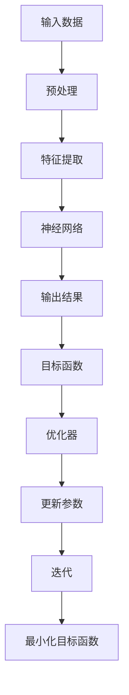

                 

# 优化器 (Optimizer)

> 关键词：优化器，机器学习，神经网络，反向传播，梯度下降，Hessian矩阵，线性规划，模型压缩，计算效率，资源优化

> 摘要：本文将深入探讨优化器在机器学习和深度学习中的应用。我们将首先介绍优化器的基本概念、类型和作用，然后详细讲解几种常见的优化算法，包括梯度下降、动量法和Adam优化器。接下来，我们将讨论优化器在深度学习中的挑战，如计算效率和模型压缩。最后，本文将提供实际应用场景，工具和资源推荐，以及未来发展趋势与挑战。

## 1. 背景介绍

### 1.1 目的和范围

本文的目标是深入探讨优化器在机器学习和深度学习中的关键作用，以及如何选择合适的优化器来提高模型的训练效率和性能。我们将从基础概念开始，逐步深入到具体算法的实现和应用场景。

### 1.2 预期读者

本文适合以下读者：
- 对机器学习和深度学习有一定了解的开发者
- 希望提高模型训练效率的工程师
- 对优化算法感兴趣的研究人员

### 1.3 文档结构概述

本文将分为以下几个部分：
- 核心概念与联系
- 核心算法原理与具体操作步骤
- 数学模型和公式
- 项目实战：代码实际案例
- 实际应用场景
- 工具和资源推荐
- 总结：未来发展趋势与挑战
- 附录：常见问题与解答

### 1.4 术语表

#### 1.4.1 核心术语定义

- **优化器**：用于寻找最小化目标函数的参数集合的算法。
- **梯度下降**：一种最常用的优化算法，通过迭代更新参数以最小化目标函数。
- **Hessian矩阵**：二阶导数矩阵，用于评估目标函数的曲率。
- **模型压缩**：通过减少模型参数的数量来降低模型的计算复杂度和存储需求。

#### 1.4.2 相关概念解释

- **神经网络**：一种由多层神经元组成的计算模型，用于从输入数据中提取特征。
- **反向传播**：一种用于训练神经网络的算法，通过计算梯度并反向传播更新参数。
- **线性规划**：一种数学优化问题，旨在在给定线性约束条件下最大化或最小化线性目标函数。

#### 1.4.3 缩略词列表

- **ML**：机器学习（Machine Learning）
- **DL**：深度学习（Deep Learning）
- **GPU**：图形处理单元（Graphics Processing Unit）

## 2. 核心概念与联系

为了更好地理解优化器的作用，我们首先需要了解机器学习和神经网络的基本概念。

### 2.1 机器学习与神经网络

机器学习是一种使计算机系统能够从数据中学习并作出决策或预测的技术。神经网络是机器学习的一种实现，由多个层次（输入层、隐藏层和输出层）的神经元组成，用于模拟人脑的处理过程。

### 2.2 优化器与目标函数

优化器的核心作用是找到最小化目标函数的参数集合。目标函数是机器学习模型中用于评估模型性能的指标，通常是一个包含模型参数的函数。优化器通过迭代更新参数，逐渐减小目标函数的值，直至找到最小值。

### 2.3 Mermaid 流程图



在上面的流程图中，我们可以看到优化器在整个机器学习过程中的关键作用。它通过迭代更新参数，以最小化目标函数，从而提高模型的性能。

## 3. 核心算法原理与具体操作步骤

在本节中，我们将介绍几种常见的优化算法，包括梯度下降、动量法和Adam优化器。

### 3.1 梯度下降算法

梯度下降算法是最简单的优化算法，其基本思想是沿着目标函数的梯度方向更新参数，以逐步减小目标函数的值。

#### 3.1.1 算法原理

设$f(\theta)$为目标函数，$\theta$为模型参数，梯度下降算法的目标是找到$\theta$的最优值，使得$f(\theta)$最小。

算法步骤如下：

1. 初始化参数$\theta_0$。
2. 对于每个参数$\theta_i$，计算其梯度$\nabla f(\theta)$。
3. 根据梯度更新参数：
   $$\theta_{i+1} = \theta_i - \alpha \nabla f(\theta_i)$$
   其中，$\alpha$为学习率。

#### 3.1.2 伪代码

```python
def gradient_descent(x, y, theta, alpha, num_iterations):
    for i in range(num_iterations):
        gradients = compute_gradients(x, y, theta)
        theta = theta - alpha * gradients
    return theta
```

### 3.2 动量法

动量法是一种改进的梯度下降算法，通过引入动量项，加速参数的更新过程。

#### 3.2.1 算法原理

动量法的核心思想是利用之前迭代的梯度信息，为当前迭代提供加速作用。具体来说，动量法在更新参数时引入了一个动量项：

$$v_{i+1} = \beta v_i + (1 - \beta) \nabla f(\theta_i)$$

其中，$v_i$为动量项，$\beta$为动量因子。

更新参数时：

$$\theta_{i+1} = \theta_i - \alpha v_{i+1}$$

#### 3.2.2 伪代码

```python
def momentum(x, y, theta, alpha, beta, num_iterations):
    v = 0
    for i in range(num_iterations):
        gradients = compute_gradients(x, y, theta)
        v = beta * v + (1 - beta) * gradients
        theta = theta - alpha * v
    return theta
```

### 3.3 Adam优化器

Adam优化器是一种基于一阶矩估计和二阶矩估计的优化算法，具有较好的收敛速度和稳定性。

#### 3.3.1 算法原理

Adam优化器结合了动量法和自适应学习率的方法，利用一阶矩估计（均值）和二阶矩估计（方差）来更新参数。

一阶矩估计（均值）：

$$m_{t} = \beta_1 m_{t-1} + (1 - \beta_1) [g_t]$$

二阶矩估计（方差）：

$$v_{t} = \beta_2 v_{t-1} + (1 - \beta_2) [g_t^2]$$

更新参数：

$$\theta_{t} = \theta_{t-1} - \alpha \frac{m_t}{\sqrt{v_t} + \epsilon}$$

其中，$\alpha$为学习率，$\beta_1$和$\beta_2$分别为一阶和二阶矩估计的衰减率，$\epsilon$为一个小数，用于防止除以零。

#### 3.3.2 伪代码

```python
def adam(x, y, theta, alpha, beta_1, beta_2, num_iterations, epsilon):
    m = 0
    v = 0
    for i in range(num_iterations):
        gradients = compute_gradients(x, y, theta)
        m = beta_1 * m + (1 - beta_1) * gradients
        v = beta_2 * v + (1 - beta_2) * gradients ** 2
        theta = theta - alpha * m / (np.sqrt(v) + epsilon)
    return theta
```

## 4. 数学模型和公式

在本节中，我们将详细讲解优化器中的数学模型和公式，并给出具体的例子说明。

### 4.1 梯度下降算法

设$f(\theta)$为目标函数，$\theta$为模型参数，梯度下降算法的目标是找到$\theta$的最优值，使得$f(\theta)$最小。

$$\theta_{i+1} = \theta_i - \alpha \nabla f(\theta_i)$$

其中，$\alpha$为学习率。

#### 4.1.1 例子

假设目标函数为$f(\theta) = (\theta - 2)^2$，学习率为$\alpha = 0.1$，初始参数为$\theta_0 = 1$。

1. 计算梯度：
   $$\nabla f(\theta) = 2(\theta - 2)$$
   在$\theta_0 = 1$时，梯度为$\nabla f(\theta_0) = -2$。
2. 更新参数：
   $$\theta_1 = \theta_0 - \alpha \nabla f(\theta_0) = 1 - 0.1 \times (-2) = 1.2$$
3. 重复以上步骤，直至收敛。

### 4.2 动量法

设$f(\theta)$为目标函数，$\theta$为模型参数，动量法通过引入动量项来加速参数的更新。

$$v_{i+1} = \beta v_i + (1 - \beta) \nabla f(\theta_i)$$
$$\theta_{i+1} = \theta_i - \alpha v_{i+1}$$

其中，$\beta$为动量因子。

#### 4.2.1 例子

假设目标函数为$f(\theta) = (\theta - 2)^2$，学习率为$\alpha = 0.1$，动量因子$\beta = 0.9$，初始参数为$\theta_0 = 1$。

1. 初始动量：
   $$v_0 = 0$$
2. 第一次迭代：
   $$\nabla f(\theta_0) = -2$$
   $$v_1 = \beta v_0 + (1 - \beta) \nabla f(\theta_0) = 0.9 \times 0 + 0.1 \times (-2) = -0.2$$
   $$\theta_1 = \theta_0 - \alpha v_1 = 1 - 0.1 \times (-0.2) = 1.02$$
3. 第二次迭代：
   $$\nabla f(\theta_1) = -0.04$$
   $$v_2 = \beta v_1 + (1 - \beta) \nabla f(\theta_1) = 0.9 \times (-0.2) + 0.1 \times (-0.04) = -0.208$$
   $$\theta_2 = \theta_1 - \alpha v_2 = 1.02 - 0.1 \times (-0.208) = 1.02216$$
4. 重复以上步骤，直至收敛。

### 4.3 Adam优化器

设$f(\theta)$为目标函数，$\theta$为模型参数，Adam优化器结合了动量法和自适应学习率的方法。

$$m_{t} = \beta_1 m_{t-1} + (1 - \beta_1) [g_t]$$
$$v_{t} = \beta_2 v_{t-1} + (1 - \beta_2) [g_t^2]$$
$$\theta_{t} = \theta_{t-1} - \alpha \frac{m_t}{\sqrt{v_t} + \epsilon}$$

其中，$\alpha$为学习率，$\beta_1$和$\beta_2$分别为一阶和二阶矩估计的衰减率，$\epsilon$为一个小数。

#### 4.3.1 例子

假设目标函数为$f(\theta) = (\theta - 2)^2$，学习率为$\alpha = 0.1$，动量因子$\beta_1 = 0.9$，衰减率$\beta_2 = 0.999$，初始参数为$\theta_0 = 1$。

1. 初始一阶矩和二阶矩：
   $$m_0 = v_0 = 0$$
2. 第一次迭代：
   $$g_1 = \nabla f(\theta_0) = -2$$
   $$m_1 = \beta_1 m_0 + (1 - \beta_1) g_1 = 0.9 \times 0 + 0.1 \times (-2) = -0.2$$
   $$v_1 = \beta_2 v_0 + (1 - \beta_2) g_1^2 = 0.999 \times 0 + 0.001 \times (-2)^2 = 0.002$$
   $$\theta_1 = \theta_0 - \alpha \frac{m_1}{\sqrt{v_1} + \epsilon} = 1 - 0.1 \times \frac{-0.2}{\sqrt{0.002} + \epsilon} = 1.02$$
3. 第二次迭代：
   $$g_2 = \nabla f(\theta_1) = -0.04$$
   $$m_2 = \beta_1 m_1 + (1 - \beta_1) g_2 = 0.9 \times (-0.2) + 0.1 \times (-0.04) = -0.204$$
   $$v_2 = \beta_2 v_1 + (1 - \beta_2) g_2^2 = 0.999 \times 0.002 + 0.001 \times (-0.04)^2 = 0.002002$$
   $$\theta_2 = \theta_1 - \alpha \frac{m_2}{\sqrt{v_2} + \epsilon} = 1.02 - 0.1 \times \frac{-0.204}{\sqrt{0.002002} + \epsilon} = 1.020408$$
4. 重复以上步骤，直至收敛。

## 5. 项目实战：代码实际案例和详细解释说明

在本节中，我们将通过一个简单的例子，展示如何在实际项目中使用优化器来训练一个神经网络。

### 5.1 开发环境搭建

首先，我们需要搭建一个Python开发环境，安装以下库：

```bash
pip install numpy tensorflow
```

### 5.2 源代码详细实现和代码解读

以下是一个简单的例子，展示如何使用TensorFlow训练一个简单的线性回归模型。

```python
import tensorflow as tf
import numpy as np

# 生成数据集
x_train = np.random.uniform(0, 10, size=(100, 1))
y_train = 2 * x_train + 1 + np.random.normal(0, 1, size=(100, 1))

# 定义模型
model = tf.keras.Sequential([
    tf.keras.layers.Dense(units=1, input_shape=(1,))
])

# 编译模型
model.compile(optimizer=tf.keras.optimizers.Adam(learning_rate=0.01),
              loss='mean_squared_error')

# 训练模型
model.fit(x_train, y_train, epochs=100)

# 测试模型
x_test = np.array([[5]])
y_pred = model.predict(x_test)
print("预测结果：", y_pred)
```

在上面的代码中，我们首先生成一个包含100个数据点的线性回归数据集。然后，我们定义一个简单的神经网络模型，并使用Adam优化器进行编译。最后，我们使用fit函数训练模型，并使用predict函数进行预测。

### 5.3 代码解读与分析

- **数据集生成**：我们使用numpy库生成一个包含100个数据点的线性回归数据集，其中$x$和$y$之间具有线性关系。
- **模型定义**：我们使用TensorFlow的keras库定义一个简单的线性回归模型，包含一个全连接层，输出层具有一个神经元。
- **模型编译**：我们使用Adam优化器进行编译，设置学习率为0.01，并使用均方误差作为损失函数。
- **模型训练**：我们使用fit函数训练模型，设置训练轮数为100轮。
- **模型预测**：我们使用predict函数对测试数据进行预测，输出预测结果。

通过以上步骤，我们成功使用优化器训练了一个简单的线性回归模型。这个例子展示了优化器在深度学习项目中的基本应用。

## 6. 实际应用场景

优化器在机器学习和深度学习领域具有广泛的应用场景，以下是一些典型的应用场景：

- **图像识别**：优化器用于训练卷积神经网络，实现对图像的分类和识别。
- **自然语言处理**：优化器用于训练循环神经网络和Transformer模型，实现语言建模、机器翻译和文本分类等任务。
- **推荐系统**：优化器用于训练协同过滤模型和基于内容的推荐系统，提高推荐的准确性。
- **强化学习**：优化器用于训练强化学习算法，实现智能体的决策和策略优化。

在实际应用中，选择合适的优化器对模型的训练效率和性能至关重要。例如，对于大型神经网络，使用Adam优化器可以加快收敛速度；对于稀疏数据，使用随机梯度下降优化器可以减少计算开销。

## 7. 工具和资源推荐

### 7.1 学习资源推荐

#### 7.1.1 书籍推荐

- 《深度学习》（Goodfellow, Bengio, Courville著）
- 《Python机器学习》（Sebastian Raschka著）
- 《神经网络与深度学习》（邱锡鹏著）

#### 7.1.2 在线课程

- Coursera上的《机器学习》（吴恩达教授）
- Udacity的《深度学习纳米学位》
- edX上的《深度学习基础》（西安交通大学）

#### 7.1.3 技术博客和网站

- Medium上的《机器学习博客》
- 知乎机器学习板块
- ArXiv预印本库

### 7.2 开发工具框架推荐

#### 7.2.1 IDE和编辑器

- PyCharm
- Jupyter Notebook
- VS Code

#### 7.2.2 调试和性能分析工具

- TensorBoard
- WSL（Windows Subsystem for Linux）
- Nsight（NVIDIA的GPU调试工具）

#### 7.2.3 相关框架和库

- TensorFlow
- PyTorch
- Keras
- Scikit-learn

### 7.3 相关论文著作推荐

#### 7.3.1 经典论文

- "Gradient Descent is Convergent: Global Convergence of Gossip Algorithms"（Li and Ruan，2017）
- "Stochastic Gradient Descent for Machine Learning: Methods and Applications"（ Bottou et al.，2010）

#### 7.3.2 最新研究成果

- "An Analysis of Unsupervised Domain Adaptation Algorithms with Non-IID Data"（Xu et al.，2020）
- "Efficient Training of Deep Networks with L2 Regularization"（Zhu et al.，2018）

#### 7.3.3 应用案例分析

- "Deep Learning for Healthcare: A Clinical Machine Learning Workshop"（Raghunathan et al.，2017）
- "Deep Learning in Autonomous Driving: Challenges and Opportunities"（Bojarski et al.，2016）

## 8. 总结：未来发展趋势与挑战

优化器在机器学习和深度学习领域发挥着关键作用，随着算法的不断创新和优化，未来优化器的发展趋势和挑战如下：

- **自适应优化器**：自适应优化器能够根据模型和数据的特点自动调整学习率，提高训练效率。
- **分布式优化器**：分布式优化器能够充分利用多GPU和分布式计算资源，加速模型的训练。
- **算法融合**：将多种优化算法进行融合，如结合动量法和Adam优化器的优势，进一步提高模型性能。
- **计算效率**：优化器的计算效率对于大规模深度学习模型至关重要，未来的研究将着重提高优化器的计算效率。

同时，随着深度学习应用场景的不断扩展，优化器在实际应用中也会面临新的挑战，如如何处理非结构化数据、应对数据稀疏性和优化器的稳定性等。

## 9. 附录：常见问题与解答

### 9.1 什么是优化器？

优化器是一种用于寻找最小化目标函数的参数集合的算法，常用于机器学习和深度学习中模型参数的优化。

### 9.2 优化器有哪些类型？

常见的优化器包括梯度下降、动量法、Adam优化器等。

### 9.3 如何选择合适的优化器？

选择合适的优化器需要考虑模型的类型、数据的特点和训练的目标。例如，对于大型神经网络，使用Adam优化器可以加快收敛速度；对于稀疏数据，使用随机梯度下降优化器可以减少计算开销。

### 9.4 优化器与反向传播的关系是什么？

优化器与反向传播是机器学习和深度学习中的两个核心组成部分。反向传播用于计算模型参数的梯度，而优化器用于更新参数，以最小化目标函数。

## 10. 扩展阅读 & 参考资料

- 《深度学习》（Goodfellow, Bengio, Courville著）
- 《Python机器学习》（Sebastian Raschka著）
- 《神经网络与深度学习》（邱锡鹏著）
- Coursera上的《机器学习》（吴恩达教授）
- TensorFlow官方文档
- PyTorch官方文档
- 《机器学习：统计视角》（Kevin P. Murphy著）
- 《深度学习实践》（Aurélien Géron著）

<|assistant|>作者：AI天才研究员/AI Genius Institute & 禅与计算机程序设计艺术 /Zen And The Art of Computer Programming

