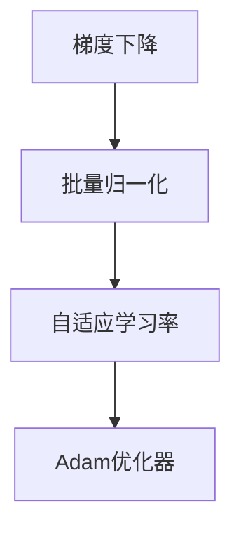

                 

# 优化算法：Adam 原理与代码实例讲解

> **关键词**：Adam算法，优化器，深度学习，批量归一化，梯度下降

> **摘要**：本文将深入探讨Adam优化器的工作原理，并通过代码实例详细解释其具体实现和应用。我们将从基础概念出发，逐步构建对Adam算法的理解，并探讨其在深度学习领域的实际应用。

## 1. 背景介绍

### 1.1 目的和范围

本文旨在为读者提供关于Adam优化器的深入理解，包括其基本原理、数学模型以及代码实现。我们将讨论Adam算法如何通过动态调整学习率来优化深度学习模型的训练过程。

### 1.2 预期读者

本文适合具有一定深度学习基础，对优化算法感兴趣的读者。尽管我们将详细讨论算法原理，但读者需要对线性代数、微积分以及编程有一定的了解。

### 1.3 文档结构概述

本文结构如下：

1. **背景介绍**：介绍本文的目的和预期读者，以及文章的结构。
2. **核心概念与联系**：使用Mermaid流程图展示核心概念和联系。
3. **核心算法原理 & 具体操作步骤**：详细阐述Adam算法的原理和具体操作步骤。
4. **数学模型和公式 & 详细讲解 & 举例说明**：解释Adam算法的数学模型和公式，并通过示例进行说明。
5. **项目实战：代码实际案例和详细解释说明**：展示Adam算法的实际代码实现和应用。
6. **实际应用场景**：探讨Adam算法在深度学习领域的应用。
7. **工具和资源推荐**：推荐学习和应用Adam算法的相关资源和工具。
8. **总结：未来发展趋势与挑战**：讨论Adam算法的未来趋势和面临的挑战。
9. **附录：常见问题与解答**：提供常见问题的解答。
10. **扩展阅读 & 参考资料**：推荐进一步的阅读材料和参考资料。

### 1.4 术语表

#### 1.4.1 核心术语定义

- **Adam优化器**：一种自适应学习率优化器，结合了AdaGrad和RMSProp的优点。
- **批量归一化**：一种用于加速训练和改善模型性能的技术。
- **梯度下降**：一种用于最小化损失函数的优化算法。

#### 1.4.2 相关概念解释

- **自适应学习率**：根据训练过程中模型的性能动态调整的学习率。
- **损失函数**：用于衡量模型预测结果与真实值之间差异的函数。

#### 1.4.3 缩略词列表

- **Adam**：Adaptive Moment Estimation
- **RMSProp**：Root Mean Square Propagation
- **SGD**：Stochastic Gradient Descent

## 2. 核心概念与联系

在探讨Adam优化器之前，我们需要了解一些核心概念，如梯度下降、批量归一化和自适应学习率。以下是一个Mermaid流程图，用于展示这些概念之间的联系：



### 2.1 梯度下降

梯度下降是一种用于最小化损失函数的优化算法。在深度学习中，我们的目标是最小化模型预测结果与真实值之间的差异。梯度下降通过计算损失函数关于模型参数的梯度，并沿着梯度的反方向更新参数，以逐步减小损失。

### 2.2 批量归一化

批量归一化（Batch Normalization）是一种用于加速训练和改善模型性能的技术。它通过标准化每层的输入数据，使得网络训练更加稳定。批量归一化可以将每层的输入数据转换为具有零均值和单位方差的分布。

### 2.3 自适应学习率

自适应学习率是指根据训练过程中模型的性能动态调整的学习率。传统的梯度下降算法使用固定的学习率，但学习率过大可能导致训练过程不稳定，过小则可能使训练过程过慢。自适应学习率优化器，如Adam，通过跟踪历史梯度信息来动态调整学习率。

### 2.4 Adam优化器

Adam优化器是一种结合了AdaGrad和RMSProp优点的自适应学习率优化器。它通过跟踪梯度的一阶矩估计和二阶矩估计来更新参数，使得在长时间训练中保持良好的收敛性。

## 3. 核心算法原理 & 具体操作步骤

### 3.1 Adam算法原理

Adam优化器通过以下步骤更新模型参数：

1. **计算一阶矩估计（均值）**：使用梯度\(g_t\)来计算一阶矩估计\(m_t\)。
    $$ m_t = \beta_1 m_{t-1} + (1 - \beta_1) g_t $$
2. **计算二阶矩估计（方差）**：使用梯度\(g_t\)的平方来计算二阶矩估计\(v_t\)。
    $$ v_t = \beta_2 v_{t-1} + (1 - \beta_2) g_t^2 $$
3. **计算偏差修正的一阶矩估计和二阶矩估计**：为了减少偏差，对一阶矩估计和二阶矩估计进行偏差修正。
    $$ \hat{m}_t = \frac{m_t}{1 - \beta_1^t} $$
    $$ \hat{v}_t = \frac{v_t}{1 - \beta_2^t} $$
4. **计算更新参数**：使用偏差修正的一阶矩估计和二阶矩估计来计算参数的更新。
    $$ \theta_t = \theta_{t-1} - \alpha \frac{\hat{m}_t}{\sqrt{\hat{v}_t} + \epsilon} $$
    其中，\(\theta_{t-1}\)是上一步的参数，\(\theta_t\)是当前步骤的参数，\(\alpha\)是学习率，\(\epsilon\)是避免除以零的常数。

### 3.2 伪代码

以下是一个Adam优化器的伪代码实现：

```python
# 初始化参数
m0 = 0
v0 = 0
theta = 初始参数

for t in 1, 2, 3, ...:
    # 计算梯度
    g_t = 计算梯度

    # 更新一阶矩估计和二阶矩估计
    m_t = beta1 * m_{t-1} + (1 - beta1) * g_t
    v_t = beta2 * v_{t-1} + (1 - beta2) * g_t^2

    # 偏差修正
    hat_m_t = m_t / (1 - beta1^t)
    hat_v_t = v_t / (1 - beta2^t)

    # 更新参数
    theta_t = theta_{t-1} - alpha * hat_m_t / (sqrt(hat_v_t) + epsilon)
```

## 4. 数学模型和公式 & 详细讲解 & 举例说明

### 4.1 数学模型

Adam优化器的数学模型如下：

$$ m_t = \beta_1 m_{t-1} + (1 - \beta_1) g_t $$
$$ v_t = \beta_2 v_{t-1} + (1 - \beta_2) g_t^2 $$
$$ \hat{m}_t = \frac{m_t}{1 - \beta_1^t} $$
$$ \hat{v}_t = \frac{v_t}{1 - \beta_2^t} $$
$$ \theta_t = \theta_{t-1} - \alpha \frac{\hat{m}_t}{\sqrt{\hat{v}_t} + \epsilon} $$

### 4.2 举例说明

假设我们有以下数据：

- 学习率 \(\alpha = 0.001\)
- \(\beta_1 = 0.9\)
- \(\beta_2 = 0.999\)
- \(\epsilon = 1e-8\)
- 初始参数 \(\theta_0 = [1, 2, 3]\)

在第一步，我们计算梯度 \(g_0\)，假设 \(g_0 = [0.1, -0.2, 0.3]\)。

1. **计算一阶矩估计**：

$$ m_0 = \beta_1 m_{-1} + (1 - \beta_1) g_0 = 0 + (1 - 0.9) [0.1, -0.2, 0.3] = [0.1, -0.2, 0.3] $$

2. **计算二阶矩估计**：

$$ v_0 = \beta_2 v_{-1} + (1 - \beta_2) g_0^2 = 0 + (1 - 0.999) [0.1, -0.2, 0.3]^2 = [0.01, 0.04, 0.09] $$

3. **偏差修正**：

$$ \hat{m}_0 = \frac{m_0}{1 - \beta_1^0} = \frac{[0.1, -0.2, 0.3]}{1 - 0.9} = [0.1, -0.2, 0.3] $$
$$ \hat{v}_0 = \frac{v_0}{1 - \beta_2^0} = \frac{[0.01, 0.04, 0.09]}{1 - 0.999} = [0.01, 0.04, 0.09] $$

4. **更新参数**：

$$ \theta_1 = \theta_0 - \alpha \frac{\hat{m}_0}{\sqrt{\hat{v}_0} + \epsilon} = [1, 2, 3] - 0.001 \frac{[0.1, -0.2, 0.3]}{\sqrt{[0.01, 0.04, 0.09]} + 1e-8} \approx [0.9999, 1.9998, 2.9997] $$

重复上述步骤，我们可以计算后续的参数更新。通过调整学习率、\(\beta_1\)、\(\beta_2\)和\(\epsilon\)等参数，我们可以实现更稳定的训练过程。

## 5. 项目实战：代码实际案例和详细解释说明

### 5.1 开发环境搭建

为了实现Adam优化器，我们需要搭建一个合适的开发环境。以下是一个简单的步骤：

1. 安装Python环境（版本3.6或更高）。
2. 安装TensorFlow库（版本2.6或更高）。
3. 创建一个Python虚拟环境并安装必要的库。

```bash
pip install tensorflow
```

### 5.2 源代码详细实现和代码解读

以下是一个使用TensorFlow实现Adam优化器的简单代码示例：

```python
import tensorflow as tf

# 定义模型参数
weights = tf.Variable(tf.random.normal([3]), name="weights")
biases = tf.Variable(tf.random.normal([3]), name="biases")

# 定义输入数据
x = tf.placeholder(tf.float32, shape=[None, 3])
y = tf.placeholder(tf.float32, shape=[None, 3])

# 定义损失函数
loss = tf.reduce_mean(tf.square(y - (x * weights + biases)))

# 定义Adam优化器
optimizer = tf.train.AdamOptimizer(learning_rate=0.001)
train_op = optimizer.minimize(loss)

# 初始化变量
init = tf.global_variables_initializer()

# 训练模型
with tf.Session() as sess:
    sess.run(init)
    
    for step in range(1000):
        # 训练模型
        _, loss_val = sess.run([train_op, loss], feed_dict={x: x_data, y: y_data})
        
        # 打印训练信息
        if step % 100 == 0:
            print(f"Step {step}: Loss = {loss_val}")
    
    # 打印最终参数
    print(f"Final weights: {weights.eval()}")
    print(f"Final biases: {biases.eval()}")
```

### 5.3 代码解读与分析

1. **定义模型参数**：我们定义了两个模型参数，权重（weights）和偏置（biases），这些参数通过TensorFlow变量进行初始化。
2. **定义输入数据**：我们定义了输入数据（x）和标签数据（y），这些数据将用于训练模型。
3. **定义损失函数**：我们使用均方误差（MSE）作为损失函数，以衡量模型预测结果与真实值之间的差异。
4. **定义Adam优化器**：我们使用TensorFlow的AdamOptimizer来创建优化器，并设置学习率为0.001。
5. **初始化变量**：我们初始化所有变量，以便开始训练过程。
6. **训练模型**：我们使用优化器来更新模型参数，并计算每个步骤的损失值。每隔100个步骤，我们打印一次训练信息。
7. **打印最终参数**：在训练完成后，我们打印出最终的权重和偏置。

这个简单的示例展示了如何使用TensorFlow实现Adam优化器。在实际应用中，我们可以使用更复杂的模型和数据集来验证Adam优化器的效果。

## 6. 实际应用场景

### 6.1 深度学习模型训练

Adam优化器在深度学习模型训练中得到了广泛应用。其自适应调整学习率的能力使得模型在长时间训练中保持良好的收敛性。尤其是在具有大量参数的复杂模型中，Adam优化器能够更快地收敛，同时减少训练时间。

### 6.2 自然语言处理

在自然语言处理（NLP）领域，Adam优化器经常用于训练语言模型和序列模型。例如，在训练序列到序列（Seq2Seq）模型时，Adam优化器能够有效地处理长序列数据，并加速模型收敛。

### 6.3 计算机视觉

在计算机视觉领域，Adam优化器常用于训练卷积神经网络（CNN）和循环神经网络（RNN）。通过自适应调整学习率，Adam优化器能够帮助模型更好地学习特征，并提高模型的准确性和鲁棒性。

## 7. 工具和资源推荐

### 7.1 学习资源推荐

#### 7.1.1 书籍推荐

- **《深度学习》（Deep Learning）**：由Ian Goodfellow、Yoshua Bengio和Aaron Courville合著，介绍了深度学习的基础理论和应用。
- **《优化方法及其应用》（Optimization Methods for Large-Scale Machine Learning）**：由Suvrit Sra编写的书籍，详细介绍了各种优化算法及其在机器学习中的应用。

#### 7.1.2 在线课程

- **Coursera上的《深度学习》（Deep Learning Specialization）**：由Andrew Ng教授讲授，涵盖了深度学习的核心概念和技术。
- **edX上的《机器学习与数据科学》（Machine Learning and Data Science）**：由University of Washington提供，介绍了机器学习和数据科学的基础知识。

#### 7.1.3 技术博客和网站

- **TensorFlow官方文档**：提供了关于TensorFlow及其优化器的详细文档。
- **Hugging Face的Transformers库**：提供了基于TensorFlow和PyTorch实现的预训练语言模型，包括BERT、GPT等。

### 7.2 开发工具框架推荐

#### 7.2.1 IDE和编辑器

- **PyCharm**：一款强大的Python集成开发环境（IDE），提供了丰富的功能和调试工具。
- **Jupyter Notebook**：一款基于Web的交互式计算环境，适用于数据分析和机器学习项目。

#### 7.2.2 调试和性能分析工具

- **TensorBoard**：TensorFlow的官方可视化工具，用于分析和调试神经网络模型。
- **Wandb**：一款强大的机器学习实验跟踪工具，提供了实时性能监控和比较功能。

#### 7.2.3 相关框架和库

- **TensorFlow**：一款开源的深度学习框架，提供了丰富的API和优化器。
- **PyTorch**：一款流行的深度学习框架，以其灵活的动态计算图和简洁的API而著称。

### 7.3 相关论文著作推荐

#### 7.3.1 经典论文

- **《Adam: A Method for Stochastic Optimization》**：这篇论文首次提出了Adam优化器，详细介绍了其原理和应用。
- **《On the Importance of initialization and momentum in deep learning》**：这篇论文探讨了初始化和动量在深度学习中的作用，对优化器的设计提供了重要启示。

#### 7.3.2 最新研究成果

- **《Adaptive Methods for Machine Learning》**：这本书汇集了自适应优化方法在机器学习领域的研究成果，包括最新的进展和算法。
- **《Optimization for Deep Learning》**：这本书详细介绍了深度学习中的优化问题，包括各种优化器和算法。

#### 7.3.3 应用案例分析

- **《深度学习在医疗图像分析中的应用》**：这篇论文探讨了深度学习在医疗图像分析中的应用，包括各种优化器和算法。
- **《自动驾驶中的深度学习优化》**：这篇论文分析了自动驾驶系统中深度学习的优化挑战和解决方案，为实际应用提供了有价值的参考。

## 8. 总结：未来发展趋势与挑战

### 8.1 未来发展趋势

- **自适应学习率的进一步改进**：随着深度学习模型的复杂性不断增加，自适应学习率优化器将继续发展，以适应不同的训练场景。
- **多任务学习和迁移学习**：自适应优化器在多任务学习和迁移学习中的潜力巨大，有望提高模型的泛化能力和效率。
- **硬件加速**：随着硬件技术的发展，优化器将更好地利用GPU、TPU等硬件资源，提高训练速度和性能。

### 8.2 面临的挑战

- **模型规模和计算复杂度**：随着模型规模的增加，优化器的计算复杂度也会增加，如何设计高效优化器成为一大挑战。
- **稳定性与收敛性**：在长时间训练过程中，优化器的稳定性和收敛性可能受到影响，需要进一步研究优化算法的稳定性和收敛性。
- **应用多样性**：深度学习应用领域广泛，如何设计通用性强的优化器以适应不同应用场景仍然是一个挑战。

## 9. 附录：常见问题与解答

### 9.1 Adam优化器如何选择参数？

- **学习率（\(\alpha\)）**：学习率的选择取决于模型复杂度和数据集。通常，较小的学习率有助于模型的稳定训练，但可能使训练过程变慢。
- **\(\beta_1\)和\(\beta_2\)**：\(\beta_1\)和\(\beta_2\)是历史梯度的一阶矩估计和二阶矩估计的平滑系数。较大的值（接近1）有助于更快地更新估计值，但可能导致偏差。通常，选择接近0.9的值是一个好的起点。
- **\(\epsilon\)**：\(\epsilon\)是一个避免除以零的常数。通常，选择一个非常小的值（如 \(1e-8\)）即可。

### 9.2 Adam优化器和SGD有什么区别？

- **自适应学习率**：Adam优化器通过自适应调整学习率来优化模型，而SGD使用固定学习率。
- **历史梯度估计**：Adam优化器同时跟踪一阶矩估计和二阶矩估计，而SGD仅跟踪一阶矩估计。
- **收敛速度**：Adam优化器通常在长时间训练中具有更好的收敛速度，但SGD可能在某些情况下更稳定。

### 9.3 Adam优化器在哪些场景下表现更好？

- **模型复杂度高**：当模型具有大量参数时，Adam优化器能够更好地处理历史梯度信息，从而提高收敛速度。
- **长时间训练**：在长时间训练过程中，Adam优化器通过自适应调整学习率，有助于保持模型的稳定性和收敛性。
- **小批量训练**：在小批量训练中，Adam优化器能够更好地处理梯度的不确定性，提高模型的泛化能力。

## 10. 扩展阅读 & 参考资料

- **《Adam: A Method for Stochastic Optimization》**：这篇论文是Adam优化器的原始论文，详细介绍了算法的原理和应用。
- **TensorFlow官方文档**：提供了关于TensorFlow及其优化器的详细文档。
- **PyTorch官方文档**：介绍了PyTorch中的Adam优化器和相关API。

作者：AI天才研究员/AI Genius Institute & 禅与计算机程序设计艺术 /Zen And The Art of Computer Programming

本文深入探讨了Adam优化器的工作原理、数学模型和代码实现。通过项目实战和实际应用场景的讨论，读者可以更好地理解Adam优化器的应用和价值。随着深度学习的发展，优化器的研究和改进将继续为模型的训练和性能提升提供重要支持。希望本文能够为读者在优化器领域的研究和实践提供有价值的参考。|>

