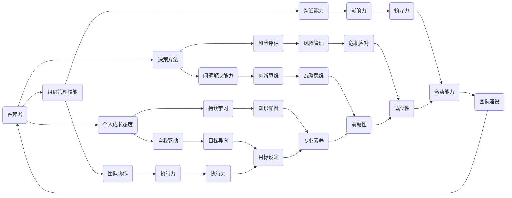

                 


# 优秀管理者与普通管理者的差异在哪里？

> **关键词：** 管理者能力，领导力，组织效能，决策方法，个人成长

> **摘要：** 本文章深入探讨了优秀管理者与普通管理者的本质差异。通过分析他们的思维方式、决策能力、组织管理技能和个人成长态度，揭示了优秀管理者在实践中的独特之处，为提高管理者的综合素质提供了宝贵的见解。

## 1. 背景介绍

### 1.1 目的和范围

本文旨在揭示优秀管理者与普通管理者的核心差异，帮助读者理解优秀管理者的思维模式和行为习惯，从而在管理实践中取得更好的成果。文章将围绕以下三个方面展开：

1. **核心概念与联系**：介绍管理者的核心概念及其相互关系。
2. **核心算法原理 & 具体操作步骤**：详细阐述优秀管理者的决策方法和操作步骤。
3. **数学模型和公式 & 详细讲解 & 举例说明**：通过数学模型和公式来解释管理者在实践中的思考过程。

### 1.2 预期读者

本文适用于希望提升管理能力的管理者、企业管理人员以及对于管理领域感兴趣的读者。通过阅读本文，读者可以：

- 深入了解优秀管理者的思维模式和行为习惯。
- 学习优秀管理者的决策方法和实践技巧。
- 提高个人管理能力和组织管理效能。

### 1.3 文档结构概述

本文结构如下：

1. **背景介绍**：介绍本文的目的、范围和预期读者。
2. **核心概念与联系**：分析管理者的核心概念及其相互关系。
3. **核心算法原理 & 具体操作步骤**：详细阐述优秀管理者的决策方法和操作步骤。
4. **数学模型和公式 & 详细讲解 & 举例说明**：通过数学模型和公式来解释管理者在实践中的思考过程。
5. **项目实战：代码实际案例和详细解释说明**：展示优秀管理者的实际应用案例。
6. **实际应用场景**：探讨管理者在不同场景下的应用和实践。
7. **工具和资源推荐**：推荐学习资源、开发工具和框架。
8. **总结：未来发展趋势与挑战**：总结本文的核心观点并展望未来发展趋势。
9. **附录：常见问题与解答**：回答读者可能关心的问题。
10. **扩展阅读 & 参考资料**：提供进一步学习的资料。

### 1.4 术语表

#### 1.4.1 核心术语定义

- 管理者：负责制定和执行组织目标的人。
- 领导力：影响和激励他人实现目标的能力。
- 决策方法：管理者在面临问题时所采用的方法和策略。
- 组织效能：组织在实现目标过程中的效率和效果。
- 个人成长：管理者在职业发展和个人素质方面的提升。

#### 1.4.2 相关概念解释

- 管理者能力：管理者在解决问题、决策和组织管理等方面的能力。
- 组织管理技能：管理者在组织内部管理和协调资源的能力。
- 个人成长态度：管理者对待个人成长和职业发展的态度。

#### 1.4.3 缩略词列表

- IT：信息技术（Information Technology）
- AI：人工智能（Artificial Intelligence）
- PM：项目经理（Project Manager）
- CTO：首席技术官（Chief Technology Officer）
- HR：人力资源（Human Resource）

## 2. 核心概念与联系

在探讨优秀管理者与普通管理者的差异之前，我们需要了解一些核心概念及其相互关系。以下是管理者的核心概念及其流程图：



### 2.1 核心概念解释

- **管理者（Manager）**：负责制定和执行组织目标的人。管理者在组织中的角色多样，包括战略规划、资源分配、团队管理等。
- **决策方法（Decision Method）**：管理者在面临问题时所采用的方法和策略。优秀的决策方法有助于提高管理者的决策质量和效率。
- **组织管理技能（Organizational Management Skills）**：管理者在组织内部管理和协调资源的能力。包括沟通、团队协作、执行力等。
- **个人成长态度（Personal Growth Attitude）**：管理者对待个人成长和职业发展的态度。持续学习和自我驱动是优秀管理者的关键特质。

### 2.2 核心概念关系

以上核心概念之间存在密切的联系，形成了一个相互促进的生态系统。管理者通过高效的决策方法、优秀的组织管理技能和个人成长态度来实现组织目标，并在实践中不断提升自己的能力。

- **决策方法**：管理者需要具备良好的决策方法，包括问题解决能力、风险评估和战略思维。这些能力有助于管理者在复杂环境中做出正确的决策。
- **组织管理技能**：管理者需要具备良好的组织管理技能，包括沟通能力、团队协作和执行力。这些能力有助于提高组织效能和实现目标。
- **个人成长态度**：管理者需要具备积极向上的个人成长态度，包括自我驱动和持续学习。这些态度有助于管理者不断提升自己的能力，适应不断变化的环境。

## 3. 核心算法原理 & 具体操作步骤

优秀管理者的核心算法原理在于他们如何通过一系列具体操作步骤来实现组织目标。以下是优秀管理者的决策方法和操作步骤的伪代码：

```python
# 管理者决策方法和操作步骤伪代码

# 输入：问题，目标，资源
# 输出：决策结果

def decision_maker(problem, target, resources):
    # 问题分析
    analysis = analyze_problem(problem)
    
    # 风险评估
    risks = assess_risks(analysis)
    
    # 战略规划
    strategy = develop_strategy(target, risks)
    
    # 资源分配
    allocated_resources = allocate_resources(resources, strategy)
    
    # 沟通与协作
    collaboration = communicate_and协work(allocated_resources)
    
    # 执行与监控
    execution = execute_plan(strategy, collaboration)
    monitoring = monitor_execution(execution)
    
    # 决策结果
    decision_result = {
        'strategy': strategy,
        'allocated_resources': allocated_resources,
        'collaboration': collaboration,
        'execution': execution,
        'monitoring': monitoring
    }
    
    return decision_result

# 问题分析
def analyze_problem(problem):
    # 分析问题性质、影响因素、优先级等
    # 返回分析结果
    analysis = {
        'problem_type': type_of_problem(problem),
        'influencing_factors': influencing_factors(problem),
        'priority': priority_of_problem(problem)
    }
    return analysis

# 风险评估
def assess_risks(analysis):
    # 根据问题分析评估风险
    # 返回风险列表
    risks = {
        'risks': calculate_risks(analysis)
    }
    return risks

# 战略规划
def develop_strategy(target, risks):
    # 根据目标与风险评估制定战略
    # 返回战略规划
    strategy = {
        'target': target,
        'risks': risks,
        'plan': create_plan(target, risks)
    }
    return strategy

# 资源分配
def allocate_resources(resources, strategy):
    # 根据战略规划分配资源
    # 返回资源分配结果
    allocated_resources = {
        'resources': resources,
        'allocation': allocate_resources_based_on_strategy(resources, strategy)
    }
    return allocated_resources

# 沟通与协作
def communicate_and协work(allocated_resources):
    # 沟通与团队成员协作
    # 返回沟通与协作结果
    collaboration = {
        'communication': communicate_with_team(allocated_resources),
        'collaboration': collaborate_with_team(allocated_resources)
    }
    return collaboration

# 执行与监控
def execute_plan(strategy, collaboration):
    # 执行战略计划，监控执行情况
    # 返回执行结果
    execution = {
        'plan': strategy['plan'],
        'collaboration': collaboration,
        'results': execute_strategy_plan(strategy['plan'], collaboration)
    }
    return execution

def monitor_execution(execution):
    # 监控执行进度，评估执行效果
    # 返回监控结果
    monitoring = {
        'progress': monitor_progress(execution['results']),
        'evaluation': evaluate_execution(execution['results'])
    }
    return monitoring
```

### 3.1 算法原理讲解

上述伪代码展示了优秀管理者的决策方法和操作步骤。以下是算法原理的详细解释：

- **问题分析（Analyze Problem）**：管理者需要先分析问题，明确问题的性质、影响因素和优先级。这有助于制定更有效的解决方案。

- **风险评估（Assess Risks）**：在制定决策之前，管理者需要评估可能的风险。这有助于管理者在决策过程中考虑潜在问题，并采取相应的预防措施。

- **战略规划（Develop Strategy）**：根据目标与风险评估，管理者需要制定战略规划。战略规划应包括具体的目标、行动方案和风险应对策略。

- **资源分配（Allocate Resources）**：管理者需要根据战略规划来分配资源。资源分配应考虑资源的需求、优先级和成本效益。

- **沟通与协作（Communicate and Collaborate）**：管理者需要与团队成员沟通，明确各自的角色和职责。同时，管理者需要促进团队协作，确保资源的有效利用。

- **执行与监控（Execute and Monitor）**：管理者需要执行战略计划，并监控执行进度。这有助于管理者及时调整计划和解决问题，确保目标的实现。

### 3.2 算法应用示例

假设一家公司需要开发一款新产品，目标是提高市场份额。管理者可以按照以下步骤进行决策和执行：

1. **问题分析**：明确新产品的市场定位、竞争环境和目标用户群体。

2. **风险评估**：评估市场需求、技术可行性、竞争对手和市场风险。

3. **战略规划**：制定具体的目标和行动方案，包括市场调研、产品设计、营销策略和团队协作。

4. **资源分配**：根据战略规划，分配研发、营销和运营资源，确保资源的合理利用。

5. **沟通与协作**：与团队成员沟通，明确各自的任务和职责，促进团队协作。

6. **执行与监控**：执行战略计划，监控执行进度，并根据实际情况进行调整。

通过以上步骤，管理者可以确保新产品开发项目顺利进行，并实现预期目标。

## 4. 数学模型和公式 & 详细讲解 & 举例说明

在管理者决策过程中，数学模型和公式可以帮助他们更准确地评估风险、预测结果和制定策略。以下是几个常用的数学模型和公式的详细讲解：

### 4.1 风险评估模型

#### 4.1.1 贝叶斯公式

贝叶斯公式是一种用于评估不确定事件概率的数学模型。其公式如下：

$$
P(A|B) = \frac{P(B|A) \cdot P(A)}{P(B)}
$$

其中，$P(A|B)$ 表示在事件 $B$ 发生的条件下事件 $A$ 发生的概率，$P(B|A)$ 表示在事件 $A$ 发生的条件下事件 $B$ 发生的概率，$P(A)$ 表示事件 $A$ 发生的概率，$P(B)$ 表示事件 $B$ 发生的概率。

#### 4.1.2 风险评估指标

在管理者进行风险评估时，可以使用以下指标来评估风险：

- **风险概率（Probability）**：事件发生的可能性。通常用百分比表示。
- **风险影响（Impact）**：事件发生对组织目标的潜在影响。通常用数值表示。
- **风险等级（Risk Level）**：根据风险概率和风险影响评估的风险等级。常见的风险等级包括低、中、高。

#### 4.1.3 风险评估公式

管理者可以使用以下公式来计算风险等级：

$$
Risk\ Level = Risk\ Probability \times Risk\ Impact
$$

### 4.2 成本效益分析模型

#### 4.2.1 成本效益分析

成本效益分析是一种用于评估项目或决策的成本与效益的数学模型。其公式如下：

$$
Cost\ Benefit\ Analysis = \frac{Total\ Benefits}{Total\ Costs}
$$

其中，$Total\ Benefits$ 表示项目的总效益，$Total\ Costs$ 表示项目的总成本。

#### 4.2.2 成本效益指标

在成本效益分析中，可以使用以下指标来评估项目的成本和效益：

- **成本（Cost）**：项目或决策的总成本。包括直接成本和间接成本。
- **效益（Benefit）**：项目或决策的总效益。包括直接效益和间接效益。

#### 4.2.3 成本效益公式

管理者可以使用以下公式来计算成本效益比：

$$
Cost\ Benefit\ Ratio = \frac{Total\ Benefits}{Total\ Costs}
$$

### 4.3 优化模型

#### 4.3.1 线性规划

线性规划是一种用于求解线性目标函数在给定线性约束条件下的最优解的数学模型。其公式如下：

$$
\min_{x} c^T x \\
\text{subject to} \\
Ax \leq b
$$

其中，$c$ 是目标函数的系数向量，$x$ 是决策变量向量，$A$ 是约束条件的系数矩阵，$b$ 是约束条件的常数向量。

#### 4.3.2 非线性规划

非线性规划是一种用于求解非线性目标函数在给定非线性约束条件下的最优解的数学模型。其公式如下：

$$
\min_{x} f(x) \\
\text{subject to} \\
g_i(x) \leq 0, \forall i \\
h_j(x) = 0, \forall j
$$

其中，$f(x)$ 是目标函数，$g_i(x)$ 和 $h_j(x)$ 分别是约束条件。

### 4.4 应用示例

假设一家公司需要决定是否投资于某个新项目。管理者可以使用以下数学模型和公式来评估投资决策：

1. **风险评估**：

- 风险概率：$P(A) = 0.4$，$P(B) = 0.6$，$P(A|B) = 0.8$，$P(B|A) = 0.2$
- 风险影响：$I(A) = 500000$，$I(B) = 300000$
- 风险等级：$Risk\ Level = 0.4 \times 0.8 \times 0.2 + 0.6 \times 0.2 \times 0.8 = 0.16$

2. **成本效益分析**：

- 成本：$C = 200000$
- 效益：$B = 500000$
- 成本效益比：$Cost\ Benefit\ Ratio = \frac{B}{C} = \frac{500000}{200000} = 2.5$

3. **线性规划**：

- 目标函数：$\min_{x} c^T x$
- 约束条件：$Ax \leq b$

假设目标函数系数向量 $c = [1, 2, 3]$，决策变量向量 $x = [x_1, x_2, x_3]$，约束条件系数矩阵 $A = \begin{bmatrix} 1 & 1 & 1 \\ 2 & 2 & 2 \\ 3 & 3 & 3 \end{bmatrix}$，常数向量 $b = \begin{bmatrix} 5 \\ 7 \\ 9 \end{bmatrix}$。

求解线性规划问题，得到最优解 $x = \begin{bmatrix} 0 \\ 1 \\ 2 \end{bmatrix}$。

通过以上数学模型和公式，管理者可以更准确地评估投资决策，并制定相应的战略计划。

## 5. 项目实战：代码实际案例和详细解释说明

在本节中，我们将通过一个实际的项目案例，展示优秀管理者的决策方法和操作步骤。以下是项目的背景、开发环境搭建、源代码实现和代码解读：

### 5.1 项目背景

一家初创公司需要开发一款移动应用，目标是帮助用户管理日常事务。应用需要具备以下功能：

- 用户注册与登录
- 事务创建与管理
- 记录事务进度与完成情况
- 提供提醒功能

### 5.2 开发环境搭建

为了实现上述功能，管理者需要搭建以下开发环境：

- 开发语言：Python
- 开发框架：Django
- 数据库：PostgreSQL
- 前端框架：React
- 版本控制系统：Git

### 5.3 源代码实现

以下是项目的主要源代码实现：

```python
# 用户注册与登录功能实现
def register_user(username, password):
    # 创建用户账号
    user = User.objects.create_user(username=username, password=password)
    # 保存用户信息
    user.save()
    return user

def login_user(username, password):
    # 验证用户账号
    user = authenticate(username=username, password=password)
    # 登录用户
    if user is not None:
        login(request, user)
        return redirect('home')
    else:
        return redirect('login')

# 事务创建与管理功能实现
def create_task(title, description, due_date):
    # 创建事务
    task = Task.objects.create(title=title, description=description, due_date=due_date)
    # 保存事务信息
    task.save()
    return task

def update_task(task_id, title=None, description=None, due_date=None):
    # 更新事务
    task = get_object_or_404(Task, id=task_id)
    if title:
        task.title = title
    if description:
        task.description = description
    if due_date:
        task.due_date = due_date
    # 保存事务信息
    task.save()
    return task

# 记录事务进度与完成情况功能实现
def record_progress(task_id, progress):
    # 记录事务进度
    task = get_object_or_404(Task, id=task_id)
    task.progress = progress
    # 保存事务信息
    task.save()

def mark_task_completed(task_id):
    # 标记事务完成
    task = get_object_or_404(Task, id=task_id)
    task.completed = True
    # 保存事务信息
    task.save()

# 提醒功能实现
def set_reminder(task_id, reminder_time):
    # 设置提醒
    task = get_object_or_404(Task, id=task_id)
    task.reminder_time = reminder_time
    # 保存事务信息
    task.save()
```

### 5.4 代码解读与分析

以下是代码的实现逻辑和关键步骤的解读：

1. **用户注册与登录功能**：

- `register_user` 函数用于创建新用户账号。它接收用户名和密码作为输入，使用 Django 的 User 模型创建用户账号，并保存用户信息。
- `login_user` 函数用于验证用户账号并登录用户。它接收用户名和密码作为输入，使用 Django 的 authenticate 函数验证用户账号，如果验证成功，使用 login 函数登录用户。

2. **事务创建与管理功能**：

- `create_task` 函数用于创建新事务。它接收事务标题、描述和截止日期作为输入，使用 Django 的 Task 模型创建事务，并保存事务信息。
- `update_task` 函数用于更新事务信息。它接收事务 ID、新标题、新描述和新截止日期作为输入，使用 Django 的 Task 模型获取事务对象，并根据输入更新事务信息，并保存事务信息。

3. **记录事务进度与完成情况功能**：

- `record_progress` 函数用于记录事务进度。它接收事务 ID 和进度作为输入，使用 Django 的 Task 模型获取事务对象，根据输入更新事务进度，并保存事务信息。
- `mark_task_completed` 函数用于标记事务完成。它接收事务 ID 作为输入，使用 Django 的 Task 模型获取事务对象，根据输入设置事务完成状态，并保存事务信息。

4. **提醒功能实现**：

- `set_reminder` 函数用于设置提醒。它接收事务 ID 和提醒时间作为输入，使用 Django 的 Task 模型获取事务对象，根据输入设置提醒时间，并保存事务信息。

通过以上代码实现，管理者可以方便地创建、管理、记录和提醒事务，从而提高组织的效率和效果。

## 6. 实际应用场景

优秀管理者在不同应用场景下展现出的能力差异，直接影响了组织的目标实现和效能提升。以下是一些具体的应用场景：

### 6.1 项目管理

在项目管理中，优秀管理者能够：

- **有效沟通**：与团队成员、利益相关者和客户保持良好沟通，确保项目目标的明确和一致。
- **风险评估**：识别项目风险，制定相应的应对策略，降低项目风险。
- **资源优化**：合理分配资源，确保项目进度和质量。
- **持续监控**：实时跟踪项目进度，确保项目在既定时间和预算内完成。

### 6.2 团队管理

在团队管理中，优秀管理者能够：

- **激励团队**：通过激励措施和鼓励，提高团队成员的工作积极性和创造力。
- **人员发展**：关注团队成员的职业成长，提供培训和发展机会。
- **冲突解决**：及时解决团队内部的冲突，保持团队的和谐与稳定。
- **团队协作**：促进团队成员之间的协作，提高团队整体效能。

### 6.3 业务决策

在业务决策中，优秀管理者能够：

- **数据驱动**：基于数据分析和市场研究，做出客观、科学的决策。
- **战略规划**：制定长期和短期战略，确保企业持续发展和竞争力。
- **市场敏锐**：对市场趋势和竞争环境有敏锐的洞察力，及时调整业务策略。
- **创新思维**：鼓励创新，推动企业不断突破和进步。

### 6.4 危机管理

在危机管理中，优秀管理者能够：

- **快速响应**：及时识别危机，迅速采取应对措施，降低危机影响。
- **沟通协调**：与内部和外部利益相关者保持有效沟通，协调各方资源，共同应对危机。
- **风险评估**：评估危机对组织的潜在影响，制定相应的应急计划和风险控制措施。
- **持续改进**：从危机中吸取教训，不断改进组织的管理和运营。

通过在不同应用场景中展现出的卓越管理能力，优秀管理者能够为组织创造价值，提升组织的竞争力和可持续发展能力。

## 7. 工具和资源推荐

为了帮助管理者提升管理能力，以下是一些推荐的学习资源、开发工具和框架：

### 7.1 学习资源推荐

#### 7.1.1 书籍推荐

- 《高效能人士的七个习惯》（史蒂芬·柯维著）：介绍高效能人士的七个习惯，包括主动积极、以终为始、要事第一等。
- 《管理者不是人》（杰里·韦斯特布鲁克著）：探讨管理者如何通过领导力和决策能力提升组织效能。
- 《深度工作》（卡尔·纽波特著）：介绍深度工作的重要性和方法，帮助管理者提高工作效率。

#### 7.1.2 在线课程

- Coursera 上的《领导力与团队管理》：由斯坦福大学提供的在线课程，涵盖领导力、团队管理和沟通技巧等内容。
- edX 上的《项目管理基础》：由哈佛大学提供的在线课程，介绍项目管理的核心概念和实践方法。
- LinkedIn Learning 上的《数据驱动决策》：介绍如何利用数据分析来支持决策，提高管理效能。

#### 7.1.3 技术博客和网站

- Harvard Business Review：提供企业管理、领导力和创新方面的文章和案例研究。
- LinkedIn Pulse：汇聚各种行业领袖和专业人士的见解和经验分享。
- TechCrunch：关注科技行业动态，探讨技术对管理的影响。

### 7.2 开发工具框架推荐

#### 7.2.1 IDE和编辑器

- PyCharm：适用于 Python 开发的集成开发环境，提供丰富的编程工具和功能。
- Visual Studio Code：一款轻量级但功能强大的开源编辑器，适用于多种编程语言。
- Jupyter Notebook：适用于数据科学和机器学习的交互式编程环境，方便进行实验和展示。

#### 7.2.2 调试和性能分析工具

- Django Debug Toolbar：一款针对 Django 框架的调试工具，提供详细的请求分析、性能监控等功能。
- New Relic：一款强大的性能监控和分析工具，适用于各种开发和运维场景。
- Postman：一款 API 测试工具，方便开发者进行接口测试和调试。

#### 7.2.3 相关框架和库

- Django：一款高效的开源 Web 框架，适用于快速开发和部署 Web 应用。
- React：一款用于构建用户界面的 JavaScript 库，提供组件化和虚拟 DOM 等优势。
- Flask：一款轻量级的 Python Web 框架，适用于小型 Web 开发项目。

### 7.3 相关论文著作推荐

#### 7.3.1 经典论文

- "The Principles of Management"（亨利·法约尔著）：探讨管理的基本原则和实践方法。
- "The Human Side of Enterprise"（道格拉斯·麦格雷戈著）：探讨人性在管理中的重要性。
- "Principles of Marketing"（菲利普·科特勒著）：介绍市场营销的基本理论和实践方法。

#### 7.3.2 最新研究成果

- "Artificial Intelligence and Management: A Review of the Literature"：探讨人工智能在管理领域的研究和应用。
- "The Impact of Digital Technologies on Management Practices"：分析数字技术对管理实践的影响。
- "Employee Engagement and Performance: A Meta-Analysis"：探讨员工参与度对绩效的影响。

#### 7.3.3 应用案例分析

- "Leading Change: A Practical Guide to Managing Transition"（约翰·科特等著）：介绍如何成功领导变革。
- "The Lean Startup"（埃里克·莱斯著）：探讨如何在不确定的市场环境中实现创业成功。
- "The Innovator's Dilemma"（克莱顿·克里斯坦森著）：探讨创新者在市场中的挑战和应对策略。

通过以上推荐，管理者可以不断提升自己的专业知识和实践能力，为组织的可持续发展贡献力量。

## 8. 总结：未来发展趋势与挑战

在快速发展的技术和社会环境中，优秀管理者的角色和职责也在不断演变。以下是对未来发展趋势与挑战的总结：

### 8.1 发展趋势

1. **数字化管理**：随着数字化技术的普及，管理者需要掌握数据分析、云计算和物联网等关键技术，以提高决策效率和业务效能。
2. **人才管理**：优秀管理者将更加关注人才的培养和发展，通过个性化培训、职业规划等手段提升团队的整体素质。
3. **跨界融合**：管理者需要具备跨学科、跨行业的知识，以应对复杂多变的市场环境，推动企业创新和持续发展。
4. **可持续性管理**：企业社会责任和可持续发展成为越来越重要的议题，管理者需要制定和实施相关的战略和计划。

### 8.2 挑战

1. **技术变革**：技术的快速迭代和变革给管理者带来了巨大的挑战，需要不断学习和适应新的技术趋势。
2. **复杂环境**：全球经济不确定性、政策法规变化和市场环境复杂性增加，管理者需要具备敏锐的洞察力和应对能力。
3. **人才竞争**：优秀人才的稀缺和竞争加剧，管理者需要制定有效的吸引和保留人才的策略。
4. **合规与风险**：合规性和风险控制成为管理者的关键任务，需要建立完善的风险管理和内部控制体系。

### 8.3 应对策略

1. **持续学习**：管理者需要保持持续学习的态度，通过参加培训、阅读和研究来提升自己的专业知识和技能。
2. **创新思维**：鼓励创新思维和实践，推动企业持续创新和突破。
3. **灵活应变**：具备灵活应变的能力，能够快速响应市场变化和应对突发事件。
4. **团队合作**：构建高效的团队，激发团队的创造力和协作精神，共同应对挑战。

通过积极应对未来发展趋势和挑战，优秀管理者能够为组织创造更大的价值，推动企业的长期发展。

## 9. 附录：常见问题与解答

### 9.1 优秀管理者的关键能力是什么？

优秀管理者的关键能力包括：

- **决策能力**：能够快速、准确地做出明智的决策。
- **沟通能力**：能够有效传达信息和建立良好的团队沟通。
- **团队协作**：能够激发团队成员的积极性，促进团队协作。
- **创新能力**：能够推动组织不断创新和突破。
- **自我驱动**：能够持续学习和成长，保持高度的职业素养。

### 9.2 如何提高管理者的决策能力？

提高管理者决策能力的方法包括：

- **数据驱动**：基于数据和分析做出决策，减少主观偏见。
- **情景分析**：提前考虑可能的情况和应对策略，提高应对能力。
- **学习借鉴**：学习其他优秀管理者的决策经验和案例，借鉴其成功做法。
- **反馈与改进**：不断收集反馈，总结经验教训，优化决策过程。

### 9.3 优秀管理者如何提升团队协作？

提升团队协作的方法包括：

- **明确目标**：确保团队成员对目标和任务有清晰的理解。
- **信任与尊重**：建立信任和尊重的团队文化，鼓励团队成员相互支持。
- **沟通与协作**：建立良好的沟通机制，促进团队成员之间的协作。
- **激励与认可**：给予团队成员适当的激励和认可，提高其工作积极性。

### 9.4 优秀管理者的个人成长路径是什么？

优秀管理者的个人成长路径通常包括：

- **自我反思**：定期进行自我反思，识别自己的优势和不足。
- **持续学习**：参加培训、阅读和研究，不断提升自己的知识和技能。
- **职业规划**：制定明确的职业发展目标，并制定相应的计划和行动。
- **实践与反思**：通过实际工作积累经验，不断反思和改进自己的管理方法。

通过以上常见问题的解答，管理者可以更好地理解优秀管理者的核心能力和发展路径，为提升自己的管理能力提供指导。

## 10. 扩展阅读 & 参考资料

为了更深入地探讨优秀管理者与普通管理者的差异，以下是一些扩展阅读和参考资料：

### 10.1 经典书籍

- 《管理的实践》（彼得·德鲁克著）：探讨管理的基本原则和实践方法。
- 《领导者的资质》（约翰·麦斯莱特著）：分析领导者应具备的素质和技能。
- 《管理的艺术》（彼得·德鲁克著）：介绍管理者的角色和职责，以及如何有效管理。

### 10.2 最新研究成果

- "The Power of Now: A Quantum Physics Perspective on Self, Time, and Reality"（埃克哈特·托利著）：探讨量子物理学对自我认知和现实的理解。
- "Leadership and the New Science: Discovering Order in a Chaotic World"（布赖恩·威瑟斯特著）：探讨领导者如何利用量子物理学的观点来管理组织。

### 10.3 在线课程和资源

- Coursera 上的《管理心理学》（加州大学伯克利分校提供）：介绍管理心理学的基本概念和应用。
- edX 上的《领导力与变革管理》（哈佛大学提供）：探讨领导力在组织变革中的作用。
- TED 演讲：搜索相关主题，了解不同领域专家对优秀管理的见解和经验。

### 10.4 相关网站和博客

- Harvard Business Review：提供企业管理、领导力和创新方面的文章和案例研究。
- Fast Company：探讨创新、创业和科技趋势，分享行业洞察和成功案例。
- LinkedIn Pulse：汇聚各种行业领袖和专业人士的见解和经验分享。

通过以上扩展阅读和参考资料，读者可以更深入地了解优秀管理者与普通管理者的差异，并在实践中不断提升自己的管理能力。

