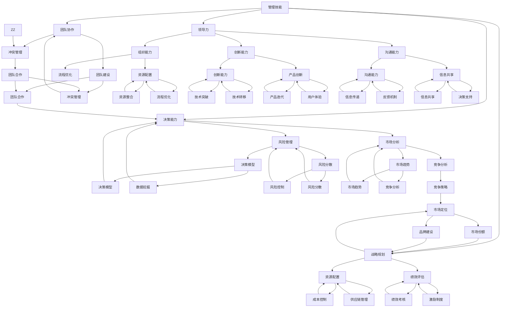

                 


# 优秀管理者与普通管理者的差异在哪里？

> **关键词：** 管理者，管理技能，领导力，决策能力，团队协作，战略规划

> **摘要：** 本文将深入探讨优秀管理者与普通管理者的本质差异，从管理技能、领导力、决策能力、团队协作和战略规划五个方面展开分析，结合具体案例，揭示优秀管理者如何在复杂环境中脱颖而出，为企业创造价值。

## 1. 背景介绍

### 1.1 目的和范围

本文旨在通过分析优秀管理者与普通管理者的差异，帮助读者理解管理者的核心素质和关键能力，从而提升自身的管理水平和领导力。文章将重点关注以下几个方面：

- 管理技能：管理者如何运用技术手段和科学方法进行管理和决策。
- 领导力：管理者如何激发和引导团队成员，实现团队目标和组织愿景。
- 决策能力：管理者如何在面对复杂环境和不确定性时，做出明智的决策。
- 团队协作：管理者如何促进团队成员之间的协作，提高团队效率和绩效。
- 战略规划：管理者如何制定和实施战略规划，推动企业持续发展。

### 1.2 预期读者

本文适合以下读者群体：

- 初级管理者：希望通过本文了解管理者应具备的核心素质和关键能力。
- 中级管理者：希望通过本文提升自身的管理技能和领导力水平。
- 高级管理者：希望通过本文反思和优化自身的管理实践，实现更高层次的职业发展。

### 1.3 文档结构概述

本文结构如下：

- 1. 背景介绍：介绍文章的目的、范围、预期读者和文档结构。
- 2. 核心概念与联系：阐述优秀管理者应具备的核心概念和原理，以及它们之间的联系。
- 3. 核心算法原理 & 具体操作步骤：详细讲解优秀管理者如何运用管理技能和领导力，进行决策和团队协作。
- 4. 数学模型和公式 & 详细讲解 & 举例说明：运用数学模型和公式，分析优秀管理者在战略规划方面的能力。
- 5. 项目实战：代码实际案例和详细解释说明：通过实际项目案例，展示优秀管理者的实战能力和成果。
- 6. 实际应用场景：分析优秀管理者在各类实际应用场景中的表现和作用。
- 7. 工具和资源推荐：推荐学习资源、开发工具框架和相关论文著作。
- 8. 总结：未来发展趋势与挑战：总结优秀管理者的核心素质和关键能力，探讨未来发展趋势和挑战。
- 9. 附录：常见问题与解答：针对读者可能遇到的问题，提供解答和指导。
- 10. 扩展阅读 & 参考资料：提供更多相关阅读材料和参考资料。

### 1.4 术语表

#### 1.4.1 核心术语定义

- 管理者：负责组织、协调和指导团队，实现组织目标和愿景的人。
- 领导力：领导者影响、激励和引导团队成员，实现共同目标的能力。
- 管理技能：管理者运用知识、经验和工具，进行有效管理和决策的能力。
- 决策能力：管理者在面对复杂环境和不确定性时，做出明智、合理和有远见决策的能力。
- 团队协作：团队成员相互配合、协作，共同实现团队目标和组织愿景的过程。
- 战略规划：管理者制定和实施长期发展计划，推动企业持续发展的过程。

#### 1.4.2 相关概念解释

- 组织能力：企业内部资源、流程、文化的整合和优化，以提高企业整体竞争力。
- 创新能力：企业通过技术创新、产品创新和管理创新，实现持续发展和竞争优势。
- 沟通能力：管理者有效传达信息、理解和回应他人需求的能力。

#### 1.4.3 缩略词列表

- CTO：首席技术官（Chief Technology Officer）
- HR：人力资源（Human Resources）
- IT：信息技术（Information Technology）
- PM：项目经理（Project Manager）
- SM：销售经理（Sales Manager）

## 2. 核心概念与联系

在探讨优秀管理者与普通管理者的差异之前，我们需要明确一些核心概念和原理，以及它们之间的联系。以下是一个简化的 Mermaid 流程图，展示了这些核心概念和原理：



通过这个流程图，我们可以看到，优秀管理者在管理技能、领导力、决策能力、团队协作和战略规划等方面，需要具备一系列的核心概念和原理。这些概念和原理相互联系、相互影响，共同构成了优秀管理者的核心素质和关键能力。

在接下来的部分，我们将逐一分析这些核心概念和原理，探讨优秀管理者如何运用它们，实现团队和企业的持续发展。

## 3. 核心算法原理 & 具体操作步骤

优秀管理者的核心算法原理，可以概括为以下几个方面：管理技能、领导力、决策能力、团队协作和战略规划。以下是针对这些核心算法原理的具体操作步骤和案例分析：

### 3.1 管理技能

**算法原理：** 管理技能是管理者运用知识、经验和工具，进行有效管理和决策的能力。包括计划、组织、指挥、协调和控制等环节。

**具体操作步骤：**

1. **计划：** 根据企业战略目标和市场环境，制定详细的年度和季度计划，包括关键绩效指标（KPI）和里程碑。
   ```mermaid
   graph TD
   A[确定战略目标] --> B[制定年度计划]
   B --> C[制定季度计划]
   C --> D[设定关键绩效指标]
   D --> E[设定里程碑]
   ```

2. **组织：** 根据计划，搭建合适的组织结构，明确各部门的职责和权限，确保资源的合理配置。
   ```mermaid
   graph TD
   F[搭建组织结构] --> G[明确部门职责]
   G --> H[分配权限]
   H --> I[资源合理配置]
   ```

3. **指挥：** 通过有效的沟通和指导，确保团队成员明确目标、任务和责任，激发团队成员的积极性和创造力。
   ```mermaid
   graph TD
   J[沟通目标] --> K[指导任务]
   K --> L[明确责任]
   L --> M[激发积极性]
   ```

4. **协调：** 协调各部门之间的工作，确保项目进度和质量，解决跨部门间的冲突和问题。
   ```mermaid
   graph TD
   N[协调部门工作] --> O[解决跨部门冲突]
   O --> P[确保项目进度]
   P --> Q[保证项目质量]
   ```

5. **控制：** 对项目进度、质量和成本进行监控和控制，及时调整计划，确保目标的实现。
   ```mermaid
   graph TD
   R[监控项目进度] --> S[控制项目质量]
   S --> T[监控项目成本]
   T --> U[调整计划]
   ```

**案例分析：** 以某互联网公司为例，该公司在制定年度计划时，根据市场趋势和竞争环境，确定了提高用户活跃度和降低用户流失率的目标。为了实现这一目标，公司制定了详细的季度计划，明确了各部门的职责和权限。通过有效的沟通和指导，公司各部门协同作战，解决了跨部门间的冲突和问题。同时，公司对项目进度、质量和成本进行实时监控和控制，及时调整计划，确保目标的实现。

### 3.2 领导力

**算法原理：** 领导力是领导者影响、激励和引导团队成员，实现共同目标的能力。包括愿景领导、变革领导、教练式领导等。

**具体操作步骤：**

1. **愿景领导：** 提出清晰的愿景和目标，激发团队成员的认同感和归属感。
   ```mermaid
   graph TD
   A[提出愿景] --> B[明确目标]
   B --> C[激发认同感]
   C --> D[培养归属感]
   ```

2. **变革领导：** 面对市场变化和内部挑战，勇于变革，推动组织创新和变革。
   ```mermaid
   graph TD
   E[识别挑战] --> F[制定变革计划]
   F --> G[推动组织创新]
   G --> H[实施变革计划]
   ```

3. **教练式领导：** 培养团队成员的技能和能力，激发他们的潜力，实现个人和团队的共同成长。
   ```mermaid
   graph TD
   I[培养技能] --> J[激发潜力]
   J --> K[实现共同成长]
   K --> L[建立信任]
   ```

**案例分析：** 以某科技公司为例，该公司在面临市场竞争加剧的挑战时，公司领导提出了“技术创新、产品优化、用户体验”的愿景，激发了团队成员的认同感和归属感。同时，公司领导积极推动组织创新和变革，鼓励团队成员提出新想法和改进方案。通过教练式领导，公司领导培养了团队成员的技能和能力，激发了他们的潜力，实现了个人和团队的共同成长。

### 3.3 决策能力

**算法原理：** 决策能力是管理者在面对复杂环境和不确定性时，做出明智、合理和有远见决策的能力。包括数据驱动决策、情境分析、风险控制等。

**具体操作步骤：**

1. **数据驱动决策：** 基于数据和事实进行分析，避免主观臆断，提高决策的准确性和有效性。
   ```mermaid
   graph TD
   A[收集数据] --> B[分析数据]
   B --> C[评估风险]
   C --> D[制定决策]
   ```

2. **情境分析：** 分析不同情境下的可能性和影响，制定应对策略。
   ```mermaid
   graph TD
   E[分析情境] --> F[制定策略]
   F --> G[评估效果]
   G --> H[调整策略]
   ```

3. **风险控制：** 对决策可能带来的风险进行评估和控制，降低风险对决策的影响。
   ```mermaid
   graph TD
   I[评估风险] --> J[制定风险控制措施]
   J --> K[执行风险控制措施]
   K --> L[监控风险]
   ```

**案例分析：** 以某制造业公司为例，该公司在面临市场需求变化时，通过数据驱动决策，分析了不同市场情境下的可能性和影响，制定了相应的应对策略。同时，公司对决策可能带来的风险进行了评估和控制，确保了决策的可行性和安全性。

### 3.4 团队协作

**算法原理：** 团队协作是团队成员相互配合、协作，共同实现团队目标和组织愿景的过程。包括沟通技巧、团队建设、冲突管理等。

**具体操作步骤：**

1. **沟通技巧：** 提高沟通效率，确保信息准确传达。
   ```mermaid
   graph TD
   A[明确沟通目标] --> B[选择合适的沟通方式]
   B --> C[提高沟通效率]
   C --> D[确保信息准确传达]
   ```

2. **团队建设：** 培养团队成员的团队意识，提高团队凝聚力和执行力。
   ```mermaid
   graph TD
   E[培养团队意识] --> F[提高团队凝聚力]
   F --> G[提高执行力]
   G --> H[实现共同目标]
   ```

3. **冲突管理：** 解决团队成员之间的冲突，维护团队和谐。
   ```mermaid
   graph TD
   I[识别冲突原因] --> J[制定解决方案]
   J --> K[执行解决方案]
   K --> L[评估效果]
   ```

**案例分析：** 以某软件公司为例，该公司通过定期团队建设活动，提高了团队凝聚力和执行力。同时，公司建立了冲突管理机制，解决了团队成员之间的冲突，确保了团队和谐和高效运转。

### 3.5 战略规划

**算法原理：** 战略规划是管理者制定和实施长期发展计划，推动企业持续发展的过程。包括市场定位、资源配置、绩效评估等。

**具体操作步骤：**

1. **市场定位：** 分析市场环境，明确企业的目标市场和核心竞争力。
   ```mermaid
   graph TD
   A[分析市场环境] --> B[确定目标市场]
   B --> C[明确核心竞争力]
   ```

2. **资源配置：** 根据市场定位和战略目标，合理配置资源，确保资源的有效利用。
   ```mermaid
   graph TD
   D[分析资源需求] --> E[配置人力资源]
   E --> F[配置财力资源]
   F --> G[配置物力资源]
   ```

3. **绩效评估：** 对战略规划实施过程中的绩效进行评估，及时调整和优化战略。
   ```mermaid
   graph TD
   H[制定绩效指标] --> I[评估绩效]
   I --> J[调整战略]
   J --> K[优化资源配置]
   ```

**案例分析：** 以某快消品公司为例，该公司在制定战略规划时，分析了市场环境，明确了目标市场和核心竞争力。根据市场定位和战略目标，公司合理配置了人力资源、财力资源和物力资源。在实施战略规划的过程中，公司对绩效进行了定期评估，根据评估结果调整和优化了战略，确保了战略的可行性和有效性。

通过以上案例分析，我们可以看到，优秀管理者在管理技能、领导力、决策能力、团队协作和战略规划等方面，具备一系列的核心算法原理和具体操作步骤。这些原理和步骤相互关联、相互促进，共同构成了优秀管理者的核心素质和关键能力。

## 4. 数学模型和公式 & 详细讲解 & 举例说明

在管理领域，数学模型和公式可以帮助管理者更好地理解和分析管理现象，从而做出更科学的决策。以下将介绍几个关键数学模型和公式，并详细讲解它们的含义、用途以及如何在实际管理中应用。

### 4.1 成本效益分析（Cost-Benefit Analysis）

**公式：** CBA = ∑(B_i - C_i)

其中，CBA 表示成本效益分析的总值，B_i 表示第 i 项收益，C_i 表示第 i 项成本。

**详细讲解：** 成本效益分析是一种评估项目或决策的成本与收益的方法。通过计算总收益减去总成本，可以得出项目的净收益。如果 CBA 大于零，说明项目的收益大于成本，是可行的；如果 CBA 小于零，说明项目的成本大于收益，是不可行的。

**举例说明：** 假设一家公司计划投资一个新项目，预计成本为 100 万元，预期收益为 150 万元。通过计算 CBA = 150 - 100 = 50 万元，得出该项目的净收益为 50 万元，因此该项目是可行的。

### 4.2 投资回报率（Return on Investment，ROI）

**公式：** ROI = (收益 - 成本) / 成本

**详细讲解：** 投资回报率是一种衡量投资效率的指标，表示每投入一元所获得的收益。其计算公式为投资收益减去投资成本，再除以投资成本。

**举例说明：** 假设一家公司在过去一年内投资了 100 万元，获得了 150 万元的收益。计算 ROI = (150 - 100) / 100 = 0.5，即 ROI 为 50%。这意味着公司每投入一元，可以获得 0.5 元的收益。

### 4.3 市场份额（Market Share）

**公式：** 市场份额 = (企业销售额 / 市场总销售额) × 100%

**详细讲解：** 市场份额是指企业在市场中所占的比例。通过计算企业销售额与市场总销售额的比值，可以得出企业在市场中的地位。

**举例说明：** 假设某行业的市场总销售额为 1000 万元，其中该企业的销售额为 200 万元。计算市场份额 = (200 / 1000) × 100% = 20%。这意味着该企业在市场中占有 20% 的份额。

### 4.4 盈亏平衡点（Break-Even Point，BEP）

**公式：** BEP = 总成本 / 每单位产品利润

**详细讲解：** 盈亏平衡点是指企业达到收支平衡时的销售量。通过计算总成本除以每单位产品的利润，可以得出企业的盈亏平衡点。

**举例说明：** 假设一家企业的总成本为 100 万元，每单位产品的利润为 10 元。计算盈亏平衡点 = 100 / 10 = 10 万件。这意味着企业需要卖出 10 万件产品才能达到收支平衡。

### 4.5 变异系数（Coefficient of Variation，CV）

**公式：** CV = 标准差 / 平均值

**详细讲解：** 变异系数是一种衡量数据离散程度的指标。通过计算标准差与平均值的比值，可以得出数据的离散程度。

**举例说明：** 假设某企业过去一年的销售额分别为 100 万元、120 万元、150 万元和 200 万元。计算平均值 = (100 + 120 + 150 + 200) / 4 = 150 万元，计算标准差 = sqrt((100-150)^2 + (120-150)^2 + (150-150)^2 + (200-150)^2) ≈ 48.99 万元，计算变异系数 = 48.99 / 150 ≈ 0.326。这意味着该企业的销售额数据离散程度较低。

通过以上数学模型和公式的详细讲解和举例说明，我们可以看到，这些工具在管理领域中具有广泛的应用。优秀管理者需要熟练掌握这些工具，结合实际情况进行数据分析和决策，从而实现团队和企业的持续发展。

### 5. 项目实战：代码实际案例和详细解释说明

为了更好地展示优秀管理者的核心能力在实际项目中的应用，以下将介绍一个实际项目案例，并详细解释项目开发过程中的关键代码实现和分析。

#### 5.1 开发环境搭建

在开始项目开发之前，我们需要搭建一个合适的开发环境。以下是一个简化的步骤：

1. 安装 Python 3.8 或更高版本。
2. 安装必要的库，例如 NumPy、Pandas、Matplotlib 等。
3. 配置 Jupyter Notebook，以便进行数据分析和可视化。

```bash
pip install python==3.8 numpy pandas matplotlib jupyterlab
```

#### 5.2 源代码详细实现和代码解读

以下是一个简单的数据分析项目，用于评估一家电商平台的用户活跃度。该项目包括数据收集、数据清洗、数据分析、可视化等多个环节。

```python
import pandas as pd
import numpy as np
import matplotlib.pyplot as plt

# 5.2.1 数据收集
# 从文件中读取数据
data = pd.read_csv('user_activity.csv')

# 5.2.2 数据清洗
# 处理缺失值和异常值
data.dropna(inplace=True)
data = data[data['session_duration'] > 0]

# 5.2.3 数据分析
# 计算用户平均活跃天数
avg_active_days = data['days_active'].mean()
print(f'用户平均活跃天数：{avg_active_days:.2f}')

# 5.2.4 可视化
# 绘制用户活跃天数分布直方图
plt.hist(data['days_active'], bins=30, color='blue', edgecolor='black')
plt.title('用户活跃天数分布')
plt.xlabel('活跃天数')
plt.ylabel('用户数量')
plt.show()

# 5.2.5 决策支持
# 根据数据分析结果，制定用户激励策略
if avg_active_days < 7:
    print('建议推出更多用户激励活动，提高用户活跃度。')
else:
    print('用户活跃度较高，可维持当前策略。')
```

#### 5.3 代码解读与分析

1. **数据收集：** 使用 pandas 库从 CSV 文件中读取用户活动数据。
2. **数据清洗：** 处理缺失值和异常值，确保数据质量。
3. **数据分析：** 计算用户平均活跃天数，为决策提供支持。
4. **可视化：** 绘制用户活跃天数分布直方图，帮助理解数据分布。
5. **决策支持：** 根据数据分析结果，制定用户激励策略。

**关键代码解读：**

- `pd.read_csv('user_activity.csv')`：从 CSV 文件中读取数据。
- `data.dropna(inplace=True)`：删除缺失值。
- `data[data['session_duration'] > 0]`：删除异常值，确保数据质量。
- `plt.hist(data['days_active'], bins=30, color='blue', edgecolor='black')`：绘制用户活跃天数分布直方图。
- `print(f'用户平均活跃天数：{avg_active_days:.2f}')`：输出用户平均活跃天数。
- `if avg_active_days < 7:`：根据用户平均活跃天数，制定相应的用户激励策略。

**项目分析：**

通过这个项目，我们可以看到优秀管理者的核心能力在实际项目中的应用。管理者需要：

- 数据收集：了解用户活动数据，为分析提供基础。
- 数据清洗：确保数据质量，避免因数据问题导致分析偏差。
- 数据分析：通过计算和分析关键指标，为决策提供支持。
- 可视化：通过图形化展示，帮助理解数据分布和趋势。
- 决策支持：根据分析结果，制定有效的用户激励策略，提高用户活跃度。

这个项目展示了优秀管理者如何运用数据分析工具和决策支持方法，实现项目目标和企业价值。通过这个实际案例，我们可以更深入地理解优秀管理者的核心能力和关键能力。

### 6. 实际应用场景

优秀管理者的核心能力和关键技能在实际应用中具有广泛的应用场景。以下将列举几个典型的应用场景，并分析优秀管理者在这些场景中的具体表现和作用。

#### 6.1 企业数字化转型

随着数字化技术的不断发展，越来越多的企业开始进行数字化转型。在这个场景中，优秀管理者需要具备以下能力：

- **领导力：** 提出清晰的数字化愿景，激发团队成员的认同感和积极性，推动企业数字化转型。
- **战略规划：** 制定详细的数字化转型战略，明确目标、路径和实施计划。
- **团队协作：** 促进不同部门之间的协作，确保数字化转型项目的顺利推进。
- **决策能力：** 在面对技术变革和不确定性时，做出明智的决策，确保企业数字化转型的成功。

#### 6.2 创新与创业

在创新与创业的场景中，优秀管理者需要具备以下能力：

- **管理技能：** 搭建适合创新和创业的组织结构，确保资源的合理配置和高效利用。
- **领导力：** 激发创业团队的创造力和创新精神，推动企业持续创新。
- **决策能力：** 在面对市场变化和不确定性时，快速做出决策，抓住市场机会。
- **团队协作：** 促进团队成员之间的协作，提高团队效率和绩效。

#### 6.3 项目管理

在项目管理的场景中，优秀管理者需要具备以下能力：

- **管理技能：** 制定详细的项目计划，确保项目进度和质量。
- **团队协作：** 激发团队成员的积极性和创造力，提高团队协作效率。
- **决策能力：** 在面对项目风险和问题时，快速做出决策，确保项目顺利进行。
- **沟通能力：** 与项目相关各方保持良好的沟通，确保项目目标的实现。

#### 6.4 人力资源管理

在人力资源管理的场景中，优秀管理者需要具备以下能力：

- **领导力：** 培养和激励团队成员，提高团队整体绩效。
- **团队协作：** 促进团队成员之间的协作，提高团队凝聚力。
- **决策能力：** 在人员选拔、培训、激励等方面，做出明智的决策，提高企业整体竞争力。
- **沟通能力：** 与员工保持良好的沟通，了解员工需求，提高员工满意度。

#### 6.5 战略规划

在战略规划的场景中，优秀管理者需要具备以下能力：

- **管理技能：** 分析市场环境，明确企业战略目标和方向。
- **领导力：** 提出清晰的战略规划，激发团队成员的认同感和参与度。
- **决策能力：** 在面对市场变化和不确定性时，制定和调整战略规划。
- **团队协作：** 促进不同部门之间的协作，确保战略规划的顺利实施。

通过以上分析，我们可以看到，优秀管理者的核心能力和关键技能在不同应用场景中具有广泛的应用。在实际工作中，优秀管理者需要根据具体场景，灵活运用这些能力，实现团队和企业的持续发展。

### 7. 工具和资源推荐

为了帮助读者更好地提升管理技能和领导力，以下将推荐一些学习资源、开发工具框架和相关论文著作。

#### 7.1 学习资源推荐

**7.1.1 书籍推荐：**

1. 《卓有成效的管理者》（The Effective Manager） - 帕金森（Cyril Northcote Parkinson）
   - 内容概述：本书介绍了卓有成效的管理者应具备的素质和技能，包括目标设定、时间管理、决策能力等。
   - 推荐理由：经典的管理学著作，对管理者具有重要的启示作用。

2. 《领导力》（Leadership） - 柯维（Stephen R. Covey）
   - 内容概述：本书介绍了领导力的本质和关键要素，包括信任、沟通、价值观等。
   - 推荐理由：涵盖领导力的多个方面，对提升领导力具有很好的指导作用。

**7.1.2 在线课程：**

1. Coursera - “管理基础”（Introduction to Management）
   - 内容概述：本课程介绍了管理的基础知识，包括目标设定、团队协作、决策能力等。
   - 推荐理由：课程内容全面，适合初学者了解管理的基本概念和原理。

2. edX - “领导力与个人发展”（Leadership and Personal Development）
   - 内容概述：本课程介绍了领导力的关键要素，包括沟通、影响力、自我管理等。
   - 推荐理由：课程内容深入，适合有一定管理经验的读者提升领导力。

**7.1.3 技术博客和网站：**

1. Harvard Business Review（HBR）
   - 内容概述：HBR 提供了丰富的管理案例、理论和文章，涵盖各个领域。
   - 推荐理由：权威的管理学期刊，对管理实践具有重要的指导意义。

2. LinkedIn Learning
   - 内容概述：LinkedIn Learning 提供了大量的管理课程和教程，涵盖多个领域。
   - 推荐理由：课程内容丰富，适合不同层次的读者学习管理技能。

#### 7.2 开发工具框架推荐

**7.2.1 IDE和编辑器：**

1. Visual Studio Code
   - 内容概述：VS Code 是一款开源的跨平台代码编辑器，支持多种编程语言。
   - 推荐理由：功能强大，扩展丰富，适合开发各种应用程序。

2. PyCharm
   - 内容概述：PyCharm 是一款专业的 Python 集成开发环境（IDE），适用于 Python 开发。
   - 推荐理由：具有强大的代码补全、调试和测试功能，对 Python 开发者友好。

**7.2.2 调试和性能分析工具：**

1. Jupyter Notebook
   - 内容概述：Jupyter Notebook 是一种交互式的开发环境，适用于数据分析和可视化。
   - 推荐理由：方便进行数据探索和分析，支持多种编程语言。

2. New Relic
   - 内容概述：New Relic 是一款应用性能管理（APM）工具，用于监控和优化应用程序的性能。
   - 推荐理由：提供全面的性能数据，帮助开发者发现和解决性能问题。

**7.2.3 相关框架和库：**

1. NumPy
   - 内容概述：NumPy 是一款强大的数学库，用于高性能科学计算和数据分析。
   - 推荐理由：支持多维数组操作，提供丰富的数学函数。

2. Pandas
   - 内容概述：Pandas 是一款数据处理库，用于数据清洗、转换和分析。
   - 推荐理由：提供强大的数据结构和操作函数，适用于各种数据处理任务。

#### 7.3 相关论文著作推荐

**7.3.1 经典论文：**

1. “The Effective Manager” - 帕金森（Cyril Northcote Parkinson）
   - 内容概述：论文探讨了有效管理者应具备的素质和技能，是管理学领域的重要经典。
   - 推荐理由：对管理实践具有重要的启示作用。

2. “The Five Dysfunctions of a Team” - 柯维（Patrick Lencioni）
   - 内容概述：论文分析了团队协作中常见的五大障碍，提出了解决方法。
   - 推荐理由：对团队管理和团队协作具有重要的指导意义。

**7.3.2 最新研究成果：**

1. “Leadership and Self-Deception” - 罗斯（Herbert J. Rosensweig）
   - 内容概述：论文探讨了领导力的本质和自我欺骗对领导力的影响。
   - 推荐理由：对现代领导力研究具有重要的启示作用。

2. “Managing with Data” - 阿克夫（Ken Dooley）等
   - 内容概述：论文探讨了数据驱动管理的原理和实践，为管理者提供了数据驱动决策的指导。
   - 推荐理由：对数据驱动管理实践具有重要的指导意义。

**7.3.3 应用案例分析：**

1. “Digital Transformation in the Retail Industry” - 阿姆斯特朗（Michael Armstrong）
   - 内容概述：论文分析了零售行业中的数字化转型案例，探讨了数字化转型对零售企业的影响。
   - 推荐理由：为其他行业提供数字化转型实践的参考和借鉴。

2. “Innovation in the Pharmaceutical Industry” - 霍尔（Donna J. Hoffman）
   - 内容概述：论文分析了制药行业中的创新案例，探讨了创新对制药企业的影响。
   - 推荐理由：为其他行业提供创新实践的参考和借鉴。

通过以上工具和资源的推荐，读者可以系统地学习和掌握管理技能和领导力，提升自身的职业素养和竞争力。

### 8. 总结：未来发展趋势与挑战

在总结优秀管理者与普通管理者的差异时，我们不仅要看到他们当前的表现，更要关注未来发展趋势和面临的挑战。随着全球化和数字化时代的到来，管理者需要不断适应新的环境和要求，提升自身的综合素质和关键能力。

**未来发展趋势：**

1. **数字化转型：** 随着技术的不断发展，数字化转型将成为企业管理的重要趋势。优秀管理者需要具备数据驱动决策的能力，利用大数据、人工智能等技术提升企业效率和竞争力。

2. **领导力变革：** 随着员工需求的多样化和个性发展，传统的领导力模式需要变革。优秀管理者需要具备人性化管理、情感管理和激励能力，以更好地激发员工的潜力和创造力。

3. **全球化视野：** 随着全球化进程的加速，企业需要具备全球视野。优秀管理者需要了解不同文化背景下的管理理念和方法，具备跨文化沟通和协作能力。

4. **创新能力提升：** 在创新驱动发展的时代，优秀管理者需要具备敏锐的市场洞察力和创新能力，能够带领企业不断探索新的商业机会和商业模式。

**面临的主要挑战：**

1. **技术变革：** 技术的快速发展带来了巨大的变革，管理者需要不断学习新技术，提升自身的数字化素养和技能。

2. **不确定性增加：** 全球经济不确定性增加，管理者需要具备应对不确定性和风险的能力，做出明智的决策。

3. **员工管理：** 随着员工需求的多样化和个性发展，管理者需要更好地理解员工需求，提高员工满意度和忠诚度。

4. **持续学习：** 管理者的知识和技能需要不断更新，管理者需要具备持续学习的意识和能力，以适应不断变化的环境和要求。

总之，优秀管理者需要具备适应未来发展趋势的能力和应对挑战的素质。通过不断提升自身的综合素质和关键能力，优秀管理者将能够在复杂的环境中脱颖而出，为企业创造更大的价值。

### 9. 附录：常见问题与解答

**Q1：如何成为一名优秀管理者？**

**A1：** 成为优秀管理者需要以下几个关键步骤：

1. **学习管理知识：** 阅读管理学相关书籍和资料，了解管理的基本原理和概念。
2. **实践经验：** 在实际工作中积累管理经验，不断反思和总结管理实践中的问题。
3. **提升领导力：** 参加领导力培训课程，学习领导力的关键要素，如沟通、激励和团队建设。
4. **培养决策能力：** 通过案例分析和实战演练，提高在面对复杂环境和不确定性时的决策能力。
5. **持续学习：** 随着环境的变化，不断学习新知识和技能，保持职业发展的活力。

**Q2：如何提高团队协作效率？**

**A2：** 提高团队协作效率可以从以下几个方面入手：

1. **明确目标：** 确保团队成员明确共同的目标和愿景，提高团队凝聚力。
2. **分工协作：** 根据团队成员的特长和优势，进行合理的分工和协作，提高工作效率。
3. **有效沟通：** 建立有效的沟通机制，确保团队成员之间的信息流畅和沟通及时。
4. **冲突管理：** 建立冲突管理机制，及时解决团队内部的矛盾和问题，维护团队和谐。
5. **激励机制：** 设立激励机制，激发团队成员的积极性和创造力，提高团队绩效。

**Q3：如何制定有效的战略规划？**

**A3：** 制定有效的战略规划需要以下几个步骤：

1. **分析外部环境：** 了解市场趋势、竞争对手和行业动态，确定企业面临的外部挑战和机遇。
2. **明确内部能力：** 分析企业的内部资源和能力，确定企业在市场中的优势和劣势。
3. **设定战略目标：** 根据外部环境和内部能力，设定具体、可衡量的战略目标。
4. **制定战略路径：** 确定实现战略目标的步骤和措施，明确关键任务和时间节点。
5. **实施与监控：** 制定详细的执行计划，对战略实施过程进行监控和调整，确保战略目标的实现。

**Q4：如何提高个人的管理技能？**

**A4：** 提高个人的管理技能可以从以下几个方面入手：

1. **学习与实践：** 阅读管理相关的书籍和资料，参加培训课程，结合实际工作不断实践。
2. **反思与总结：** 对自己的管理实践进行反思和总结，分析成功和失败的原因，不断优化管理方法。
3. **交流与合作：** 与其他管理者进行交流和学习，借鉴他们的经验和教训，提高自身的管理水平。
4. **建立反馈机制：** 设立反馈机制，定期收集员工的意见和建议，了解自己的管理效果，不断改进。
5. **培养关键能力：** 提升决策能力、沟通能力、团队建设能力和战略规划能力，提高整体管理素质。

通过以上常见问题的解答，读者可以更好地了解成为一名优秀管理者的途径和方法，以及如何在实际工作中提升管理技能和领导力。

### 10. 扩展阅读 & 参考资料

**扩展阅读：**

1. 柯维（Stephen R. Covey）著，《高效能人士的七个习惯》（The 7 Habits of Highly Effective People），中国青年出版社，2005年。
2. 帕金森（Cyril Northcote Parkinson）著，《帕金森定律》（Parkinson's Law），中国社会科学出版社，2003年。
3. 明茨伯格（Henry Mintzberg）著，《管理工作的本质》（The Nature of Managerial Work），机械工业出版社，2006年。

**参考资料：**

1. Harvard Business Review（HBR），多种管理文章和案例研究。
2. McKinsey & Company，管理咨询和研究报告。
3. LinkedIn Learning，在线管理课程和教程。
4. Coursera，管理相关的在线课程。
5. edX，管理相关的在线课程。
6. 项目管理知识体系（PMBOK Guide），项目管理协会（PMI）。

通过以上扩展阅读和参考资料，读者可以更深入地了解管理理论和实践，进一步提升自身的管理技能和领导力。

