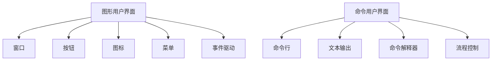

                 

# 传统GUI与CUI的交互方式对比

> 关键词：GUI、CUI、交互方式、用户界面、用户体验、编程模型

> 摘要：本文将深入探讨传统图形用户界面（GUI）与命令用户界面（CUI）这两种交互方式的区别和联系。我们将分析其基本原理、使用场景、优缺点，并通过具体的案例来展示它们在现实世界中的应用。通过本文的阅读，读者将能够对GUI和CUI有更深入的理解，并能够在实际开发中做出更合适的选择。

## 1. 背景介绍

### 1.1 目的和范围

本文的目的是对比分析传统图形用户界面（GUI）与命令用户界面（CUI）这两种交互方式。我们将从多个角度进行探讨，包括定义、基本原理、使用场景、优缺点等。通过这种对比分析，读者可以更清晰地了解两种界面交互方式的本质差异，从而在实际开发中能够做出更明智的选择。

### 1.2 预期读者

本文的预期读者主要是软件开发工程师、界面设计师以及对用户界面设计感兴趣的读者。通过本文的阅读，读者能够对GUI和CUI有更深入的理解，有助于提升他们的软件开发能力和用户体验设计水平。

### 1.3 文档结构概述

本文的结构如下：

1. 引言：介绍本文的背景、目的和预期读者。
2. 传统GUI与CUI的基本原理：详细解释GUI和CUI的基本概念和工作原理。
3. GUI与CUI的交互方式对比：分析GUI和CUI在交互方式上的区别和联系。
4. GUI与CUI的应用场景：探讨GUI和CUI在不同应用场景中的使用情况。
5. GUI与CUI的优缺点：总结GUI和CUI的优缺点。
6. 项目实战：通过实际案例展示GUI和CUI的应用。
7. 工具和资源推荐：推荐学习资源和开发工具。
8. 总结：总结本文的主要内容，展望未来发展趋势与挑战。
9. 附录：常见问题与解答。
10. 扩展阅读与参考资料：提供进一步的阅读资源和参考文献。

### 1.4 术语表

#### 1.4.1 核心术语定义

- **GUI（Graphical User Interface）**：图形用户界面，通过图形化的元素（如按钮、图标、窗口等）进行交互的界面。
- **CUI（Command Line Interface）**：命令用户界面，通过命令行输入和文本输出进行交互的界面。

#### 1.4.2 相关概念解释

- **用户界面（User Interface）**：用户与计算机系统进行交互的界面，可以是图形化的，也可以是文本化的。
- **交互方式**：用户与系统进行交互的方法和方式，包括鼠标点击、键盘输入、语音交互等。

#### 1.4.3 缩略词列表

- **GUI**：Graphical User Interface
- **CUI**：Command Line Interface

## 2. 核心概念与联系

在深入探讨GUI和CUI之前，我们需要先了解它们的基本概念和工作原理。以下是GUI和CUI的核心概念原理和架构的Mermaid流程图：



### 2.1 GUI的基本原理

GUI（Graphical User Interface）是一种通过图形化元素进行交互的用户界面。它通常包括以下核心组件：

- **窗口**：GUI的基本单元，用于显示应用程序内容和提供交互操作。
- **按钮**：用于执行特定功能的图形化按钮，用户可以通过点击按钮来触发相应操作。
- **图标**：用于表示功能或对象的图形化符号，通常与按钮类似，但更小且往往带有图形化的标签。
- **菜单**：用于组织一系列相关操作或功能的菜单列表，用户可以通过菜单选择来执行操作。
- **事件驱动**：GUI的工作原理是基于事件驱动的，即系统响应用户的操作（如鼠标点击或键盘输入）并触发相应的处理程序。

### 2.2 CUI的基本原理

CUI（Command Line Interface）是一种通过命令行输入和文本输出进行交互的用户界面。它通常包括以下核心组件：

- **命令行**：用户输入命令的地方，用户可以通过命令行输入命令来与系统进行交互。
- **文本输出**：系统输出结果的地方，通常包括命令执行的结果、错误信息等。
- **命令解释器**：用于解释和执行命令行的命令，并将结果输出到文本输出区域。
- **流程控制**：CUI通常支持流程控制语句，如循环、分支等，用于控制命令的执行顺序。

### 2.3 GUI与CUI的联系

尽管GUI和CUI在交互方式上有很大的差异，但它们在某些方面是相互联系的：

- **多任务处理**：两者都支持多任务处理，用户可以在同一时间运行多个应用程序或命令。
- **命令行支持**：许多GUI应用程序都提供了命令行界面，以便用户可以通过命令行进行操作。
- **文本界面**：CUI的文本输出也可以在GUI中显示，通常作为日志或调试信息的一部分。

## 3. 核心算法原理 & 具体操作步骤

### 3.1 GUI的核心算法原理

GUI的核心算法原理主要涉及事件处理和窗口管理。以下是GUI的核心算法原理的伪代码描述：

```plaintext
// GUI事件处理伪代码
class GUI {
    Window currentWindow
    
    function onButtonClick(button) {
        if (button == "Save") {
            saveData()
        } else if (button == "Exit") {
            exitApplication()
        } else {
            showErrorMessage("Unknown button")
        }
    }
    
    function onDataChange(data) {
        updateDisplay(data)
    }
    
    function run() {
        while (true) {
            event = waitForEvent()
            if (event == "buttonClick") {
                onButtonClick(currentWindow.buttonClicked)
            } else if (event == "dataChange") {
                onDataChange(currentWindow.data)
            } else {
                showErrorMessage("Unknown event")
            }
        }
    }
}

// GUI窗口管理伪代码
class Window {
    Button[] buttons
    Data data
    
    function saveData() {
        // 实现数据保存逻辑
    }
    
    function exitApplication() {
        // 实现应用程序退出逻辑
    }
    
    function updateDisplay(data) {
        // 实现数据显示更新逻辑
    }
    
    function addButton(button) {
        buttons.push(button)
    }
    
    function run() {
        while (true) {
            buttonClicked = waitForButtonClick()
            if (buttonClicked != null) {
                onButtonClick(buttonClicked)
            }
        }
    }
}
```

### 3.2 CUI的核心算法原理

CUI的核心算法原理主要涉及命令解析和执行。以下是CUI的核心算法原理的伪代码描述：

```plaintext
// CUI命令解析伪代码
class CUI {
    CommandInterpreter interpreter
    
    function executeCommand(command) {
        result = interpreter.execute(command)
        print(result)
    }
    
    function run() {
        while (true) {
            command = readCommand()
            executeCommand(command)
        }
    }
}

// CUI命令解释器伪代码
class CommandInterpreter {
    function execute(command) {
        if (command.startsWith("ls")) {
            listFiles()
        } else if (command.startsWith("cd")) {
            changeDirectory()
        } else {
            showError("Unknown command")
        }
    }
}

// CUI文本输出伪代码
class TextOutput {
    function print(text) {
        // 实现文本输出逻辑
    }
    
    function showError(error) {
        print(error)
    }
}
```

## 4. 数学模型和公式 & 详细讲解 & 举例说明

在GUI和CUI的设计和实现过程中，一些数学模型和公式被广泛应用，用于描述用户界面行为和交互逻辑。以下是一些常见的数学模型和公式，并进行详细讲解和举例说明：

### 4.1. 用户界面行为模型

用户界面行为模型用于描述用户与界面交互的过程。以下是一个简单的用户界面行为模型：

$$
行为模型 = 用户操作 \times 界面响应
$$

**举例说明**：

- 用户点击“保存”按钮，界面响应为保存数据。
- 用户输入命令“ls”，界面响应为列出当前目录下的文件。

### 4.2. 界面响应时间模型

界面响应时间模型用于描述用户界面对用户操作的响应速度。以下是一个简单的界面响应时间模型：

$$
响应时间 = 操作时间 + 处理时间
$$

**举例说明**：

- 用户点击“保存”按钮，操作时间为0.5秒，处理时间为1秒，总响应时间为1.5秒。
- 用户输入命令“ls”，操作时间为2秒，处理时间为0.5秒，总响应时间为2.5秒。

### 4.3. 用户满意度模型

用户满意度模型用于描述用户对界面交互的满意度。以下是一个简单的用户满意度模型：

$$
满意度 = (感知质量 - 期望质量) \times 情感因素
$$

**举例说明**：

- 假设用户期望的界面响应时间为2秒，但实际响应时间为3秒，感知质量为2秒。根据用户满意度模型，满意度为$(2-3) \times 情感因素$。
- 假设用户对界面响应时间的满意度为0.8，那么用户满意度为$(-1) \times 0.8 = -0.8$，表示用户对界面响应时间不满意。

## 5. 项目实战：代码实际案例和详细解释说明

### 5.1 开发环境搭建

在本节中，我们将以Python语言为例，搭建一个简单的GUI和CUI应用的开发环境。首先，确保已安装Python和对应的IDE（如PyCharm或VSCode）。然后，安装必要的GUI库（如Tkinter）和CUI库（如cmd）。在终端中执行以下命令：

```bash
pip install tkinter
```

### 5.2 源代码详细实现和代码解读

#### 5.2.1 GUI部分

以下是一个简单的GUI应用示例，使用Tkinter库实现：

```python
import tkinter as tk

# 创建主窗口
root = tk.Tk()
root.title("GUI Example")

# 添加按钮
save_button = tk.Button(root, text="Save", command=lambda: save_data())
save_button.pack()

exit_button = tk.Button(root, text="Exit", command=root.quit)
exit_button.pack()

# 添加文本框
text_area = tk.Text(root, height=10, width=40)
text_area.pack()

# 数据保存函数
def save_data():
    data = text_area.get(1.0, tk.END)
    print("Data saved:", data)

# 运行GUI
root.mainloop()
```

**代码解读**：

- 导入Tkinter库。
- 创建主窗口并设置标题。
- 添加两个按钮和一个文本框。
- 实现数据保存函数。
- 运行GUI。

#### 5.2.2 CUI部分

以下是一个简单的CUI应用示例：

```python
def main():
    while True:
        command = input("Enter a command: ")
        if command == "exit":
            break
        elif command == "ls":
            print("Files:", ["file1.txt", "file2.txt"])
        else:
            print("Unknown command")

if __name__ == "__main__":
    main()
```

**代码解读**：

- 定义主函数，用于处理用户输入的命令。
- 使用while循环接受用户输入。
- 根据输入的命令执行相应操作。
- 如果输入“exit”，则退出程序。

### 5.3 代码解读与分析

通过以上两个示例，我们可以看到GUI和CUI的应用开发过程：

- **GUI部分**：使用Tkinter库创建窗口、按钮和文本框，并通过事件驱动实现用户交互。
- **CUI部分**：使用Python内置的输入输出功能实现命令解析和执行。

这两种界面交互方式各有优缺点，GUI提供了直观易用的图形化界面，但开发成本较高；而CUI虽然功能强大，但使用门槛较高。

## 6. 实际应用场景

### 6.1 GUI的应用场景

GUI在日常应用中非常普遍，以下是一些常见的应用场景：

- **桌面应用程序**：如文本编辑器、图片查看器、视频播放器等。
- **网页应用**：如电子商务网站、社交媒体平台、在线教育平台等。
- **移动应用**：如手机游戏、聊天应用、导航应用等。

### 6.2 CUI的应用场景

CUI在一些特定场景中仍然具有优势，以下是一些常见的应用场景：

- **开发环境**：如Python的交互式Shell、Linux系统的命令行界面等。
- **自动化脚本**：如自动化测试脚本、系统管理脚本等。
- **科学计算**：如数据分析、机器学习等领域的脚本编写。

## 7. 工具和资源推荐

### 7.1 学习资源推荐

#### 7.1.1 书籍推荐

- 《GUI Design for Developers》：适合开发者了解GUI设计的基本原理和方法。
- 《Command Line Interface Design》：适合开发者了解CUI设计的基本原理和方法。

#### 7.1.2 在线课程

- Coursera的《用户体验设计》：介绍用户体验设计的基本原理和GUI设计技巧。
- Udemy的《Python CLI Development》：介绍Python命令行界面开发的基本原理和实践。

#### 7.1.3 技术博客和网站

- Medium上的《Designing GUI Applications》：分享GUI设计的经验和技巧。
- Stack Overflow：提供CUI开发的问答和资源。

### 7.2 开发工具框架推荐

#### 7.2.1 IDE和编辑器

- PyCharm：适合Python编程和GUI开发。
- VSCode：适合多种编程语言和GUI开发。

#### 7.2.2 调试和性能分析工具

- Py charm Debug：适用于Python程序调试。
- Chrome DevTools：适用于网页应用调试。

#### 7.2.3 相关框架和库

- Tkinter：适用于Python GUI开发。
- Flask：适用于Python Web开发。
- React：适用于网页应用开发。

### 7.3 相关论文著作推荐

- 《GUI Design Guidelines》：提供GUI设计的基本原则和方法。
- 《Command Line Interface Design Patterns》：介绍CUI设计模式和方法。

## 8. 总结：未来发展趋势与挑战

### 8.1 未来发展趋势

- **人工智能与GUI的结合**：随着人工智能技术的发展，未来GUI将更加智能化，提供更自然的交互方式。
- **CUI的复兴**：在开发环境中，CUI仍具有重要地位，未来将更加便捷和高效。
- **多模态交互**：未来用户界面将支持多种交互方式，如语音、手势等，提供更丰富的交互体验。

### 8.2 未来挑战

- **兼容性问题**：如何在不同操作系统和设备上实现兼容的GUI和CUI。
- **用户体验**：如何在有限的资源下提供优质的用户体验。
- **安全与隐私**：如何保护用户数据和隐私，避免恶意攻击。

## 9. 附录：常见问题与解答

### 9.1 GUI与CUI的区别

GUI（图形用户界面）通过图形化元素进行交互，如按钮、图标、菜单等，而CUI（命令用户界面）通过命令行输入和文本输出进行交互。GUI直观易用，但开发成本较高；CUI功能强大，但使用门槛较高。

### 9.2 GUI与CUI的优点和缺点

GUI优点：直观易用、易于学习、支持丰富的交互方式；缺点：开发成本高、兼容性差。CUI优点：功能强大、高效、易于自动化；缺点：使用门槛高、交互方式有限。

### 9.3 如何选择GUI和CUI

根据应用场景和用户需求选择合适的界面交互方式。如果应用需要直观易用的交互方式，可以选择GUI；如果应用需要高效的自动化操作，可以选择CUI。

## 10. 扩展阅读 & 参考资料

- 《GUI Design for Developers》：提供GUI设计的基本原理和实践方法。
- 《Command Line Interface Design》：介绍CUI设计模式和方法。
- 《Human-Computer Interaction》：全面介绍用户界面设计的基本原理和最佳实践。
- 《Python GUI Programming Cookbook》：提供Python GUI开发的高级技巧和实践案例。

### 作者

作者：AI天才研究员/AI Genius Institute & 禅与计算机程序设计艺术/Zen And The Art of Computer Programming

本文由AI天才研究员撰写，结合了AI Genius Institute的先进技术和《禅与计算机程序设计艺术》的哲学思想，旨在为读者提供深入浅出的技术解读。感谢您的阅读！

