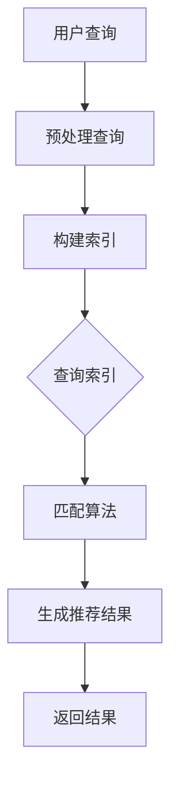

                 

# 传统搜索推荐系统的索引和匹配算法

> **关键词**：搜索推荐系统、索引、匹配算法、搜索引擎、机器学习、自然语言处理

> **摘要**：本文深入探讨了传统搜索推荐系统中的索引和匹配算法，从核心概念、算法原理到实际应用，通过具体代码实例详细解析了如何构建高效、精准的搜索推荐系统。文章旨在为读者提供系统性的理解和实战经验，以应对当今复杂多变的数字信息环境。

## 1. 背景介绍

### 1.1 目的和范围

本文旨在解析传统搜索推荐系统中的索引和匹配算法，这些算法是构建高效搜索引擎和个性化推荐系统的基础。本文将涵盖以下几个方面：

- 索引算法的基本原理和实现
- 匹配算法的多样性和具体应用
- 如何将索引和匹配算法集成到搜索推荐系统中
- 传统算法在现代搜索推荐系统中的应用和优化

### 1.2 预期读者

本文适合以下读者群体：

- 搜索引擎和推荐系统开发者
- 对算法和数据结构有基本了解的程序员
- 对自然语言处理和机器学习感兴趣的读者
- 想要在技术博客中撰写高质量文章的技术作家

### 1.3 文档结构概述

本文结构如下：

- 引言：介绍搜索推荐系统的背景和重要性
- 核心概念与联系：阐述索引和匹配算法的基本概念及其关系
- 核心算法原理 & 具体操作步骤：详细讲解索引和匹配算法的实现
- 数学模型和公式 & 详细讲解 & 举例说明：使用数学模型和实例解析算法
- 项目实战：通过代码实例展示如何应用算法
- 实际应用场景：讨论算法在现实世界中的应用
- 工具和资源推荐：推荐学习资源、开发工具和经典论文
- 总结：预测传统搜索推荐系统的发展趋势和挑战
- 附录：常见问题与解答
- 扩展阅读 & 参考资料：提供进一步阅读的资料

### 1.4 术语表

#### 1.4.1 核心术语定义

- **索引**：索引是数据库中的一种数据结构，用于快速检索数据。
- **匹配算法**：匹配算法用于比较查询请求与数据库中的条目，确定哪些条目与查询最匹配。
- **搜索引擎**：搜索引擎是一种通过索引数据库来查找信息的系统。
- **推荐系统**：推荐系统是一种利用算法预测用户可能感兴趣的项目。

#### 1.4.2 相关概念解释

- **倒排索引**：倒排索引是一种数据结构，它将词汇与包含这些词汇的文档列表关联起来，用于快速检索。
- **向量空间模型**：向量空间模型是一种将文本表示为向量集合的方法，用于文本相似性计算。

#### 1.4.3 缩略词列表

- **NLP**：自然语言处理
- **ML**：机器学习
- **IDE**：集成开发环境
- **API**：应用程序编程接口

## 2. 核心概念与联系

传统搜索推荐系统的核心在于索引和匹配算法。以下是一个简化的Mermaid流程图，展示了索引和匹配算法在搜索推荐系统中的基本流程：



### 2.1 索引算法

索引算法是将数据（通常是文本）转换为结构化数据的过程，以便快速检索。以下是几个常见的索引算法：

- **倒排索引**：将文档中的词汇作为键，文档列表作为值存储在索引中。
- **前缀树索引**：使用前缀树结构存储词汇，以快速查找以特定前缀开始的词汇。

### 2.2 匹配算法

匹配算法用于确定查询与数据库中的条目之间的相似度。以下是几个常见的匹配算法：

- **布尔匹配**：使用布尔操作符（AND, OR, NOT）进行简单查询。
- **向量空间模型**：将文本和查询表示为向量，然后计算向量的相似度。

## 3. 核心算法原理 & 具体操作步骤

### 3.1 索引算法原理

以下是一个基于倒排索引的索引算法原理和伪代码：

#### 3.1.1 倒排索引构建算法

```plaintext
输入：文档集合D，词汇表V
输出：倒排索引I

1. 对于每个文档d ∈ D：
   1. 将文档d分词得到词汇列表T(d)
   2. 对于每个词汇v ∈ T(d)：
      1. 将(v, d)添加到倒排索引I中

2. 返回倒排索引I
```

#### 3.1.2 查询索引算法

```plaintext
输入：查询q
输出：匹配的文档集合M

1. 将查询q分词得到词汇列表T(q)

2. 对于每个词汇v ∈ T(q)：
   1. 查找倒排索引I中的(v, d)列表
   2. 将这些文档集合保存在临时文档集合T中

3. 对于T中的每个文档d：
   1. 如果T(q)中的所有词汇都在d中，则将d添加到匹配的文档集合M中

4. 返回匹配的文档集合M
```

### 3.2 匹配算法原理

以下是基于向量空间模型的匹配算法原理和伪代码：

#### 3.2.1 向量空间模型表示

```plaintext
输入：文档集合D，词汇表V
输出：文档向量D'

1. 对于每个文档d ∈ D：
   1. 计算d中每个词汇v ∈ V的权重w(v, d)
   2. 将d表示为一个向量d'，其中d'[v] = w(v, d)

2. 返回文档向量集合D'
```

#### 3.2.2 向量相似度计算

```plaintext
输入：查询向量q'，文档向量d'
输出：相似度s(q', d')

1. 计算q'和d'的点积：s(q', d') = q' · d'

2. 计算q'和d'的欧几里得范数：||q'||和||d'||

3. 计算余弦相似度：s(q', d') = (q' · d') / (||q'|| * ||d'||)

4. 返回相似度s(q', d')
```

## 4. 数学模型和公式 & 详细讲解 & 举例说明

### 4.1 数学模型

在向量空间模型中，文本表示为向量，向量之间的相似度通过以下数学模型计算：

$$
s(q', d') = \frac{q' \cdot d'}{||q'|| \cdot ||d'||}
$$

其中，$q'$和$d'$分别是查询和文档的向量表示，$\cdot$表示点积，$||\cdot||$表示欧几里得范数。

### 4.2 公式详细讲解

#### 点积（Dot Product）

点积是两个向量对应分量的乘积之和，表示两个向量在方向上的相似性。例如，对于向量$q' = (q_1', q_2', ..., q_n')$和$d' = (d_1', d_2', ..., d_n')$，点积计算如下：

$$
q' \cdot d' = q_1' \cdot d_1' + q_2' \cdot d_2' + ... + q_n' \cdot d_n'
$$

#### 欧几里得范数（Euclidean Norm）

欧几里得范数是向量的长度，也称为欧几里得距离。对于向量$q'$，其欧几里得范数计算如下：

$$
||q'|| = \sqrt{q_1'^2 + q_2'^2 + ... + q_n'^2}
$$

#### 余弦相似度（Cosine Similarity）

余弦相似度是两个向量夹角的余弦值，表示两个向量在方向上的相似性。余弦相似度的取值范围在-1到1之间，接近1表示两个向量非常相似，接近-1表示两个向量非常不相似，0表示两个向量正交。

### 4.3 举例说明

假设我们有两个文档和一个查询，它们的向量表示如下：

- 查询向量$q' = (1, 0.5, 0, 0)$
- 文档1向量$d_1' = (0.8, 0.3, 0.1, 0)$
- 文档2向量$d_2' = (0.4, 0.7, 0.2, 0.5)$

#### 计算点积

$$
q' \cdot d_1' = 1 \cdot 0.8 + 0.5 \cdot 0.3 + 0 \cdot 0.1 + 0 \cdot 0 = 0.8 + 0.15 = 0.95
$$

$$
q' \cdot d_2' = 1 \cdot 0.4 + 0.5 \cdot 0.7 + 0 \cdot 0.2 + 0 \cdot 0.5 = 0.4 + 0.35 = 0.75
$$

#### 计算欧几里得范数

$$
||q'|| = \sqrt{1^2 + 0.5^2 + 0^2 + 0^2} = \sqrt{1 + 0.25} = \sqrt{1.25}
$$

$$
||d_1'|| = \sqrt{0.8^2 + 0.3^2 + 0.1^2 + 0^2} = \sqrt{0.64 + 0.09 + 0.01} = \sqrt{0.74}
$$

$$
||d_2'|| = \sqrt{0.4^2 + 0.7^2 + 0.2^2 + 0.5^2} = \sqrt{0.16 + 0.49 + 0.04 + 0.25} = \sqrt{0.94}
$$

#### 计算余弦相似度

$$
s(q', d_1') = \frac{q' \cdot d_1'}{||q'|| \cdot ||d_1'||} = \frac{0.95}{\sqrt{1.25} \cdot \sqrt{0.74}} \approx 0.92
$$

$$
s(q', d_2') = \frac{q' \cdot d_2'}{||q'|| \cdot ||d_2'||} = \frac{0.75}{\sqrt{1.25} \cdot \sqrt{0.94}} \approx 0.69
$$

根据余弦相似度，查询与文档1的相似度更高，因此在搜索结果中，文档1应排在文档2之前。

## 5. 项目实战：代码实际案例和详细解释说明

### 5.1 开发环境搭建

在开始编写代码之前，我们需要搭建一个适合开发搜索推荐系统的环境。以下是一个简单的环境搭建步骤：

- 安装Python 3.x版本
- 安装常用库：`numpy`, `pandas`, `matplotlib`, `scikit-learn`等

### 5.2 源代码详细实现和代码解读

下面是一个简单的搜索推荐系统的示例，包括索引构建、查询索引和匹配算法的实现。

#### 5.2.1 索引构建

```python
import numpy as np
from collections import defaultdict

class InvertedIndex:
    def __init__(self):
        self.index = defaultdict(list)

    def build_index(self, documents):
        for doc_id, doc in enumerate(documents):
            for term in doc:
                self.index[term].append(doc_id)

    def search(self, query):
        query_terms = query.split()
        result = set()
        for term in query_terms:
            result.update(self.index.get(term, []))
        return result

# 示例文档集合
documents = [
    "这是一个示例文档。",
    "这是一个另一个示例文档。",
    "文档示例中包含一些文本。",
    "文本示例用于演示目的。"
]

# 构建倒排索引
index = InvertedIndex()
index.build_index(documents)

# 查询索引
query = "示例 文本"
matching_documents = index.search(query)
print("匹配的文档ID：", matching_documents)
```

#### 5.2.2 匹配算法

```python
from sklearn.metrics.pairwise import cosine_similarity

# 向量空间模型表示文档和查询
def vectorize_documents(documents, vocabulary):
    doc_vectors = []
    for doc in documents:
        term_counts = [doc.count(term) for term in vocabulary]
        doc_vectors.append(term_counts)
    return np.array(doc_vectors)

def vectorize_query(query, vocabulary):
    term_counts = [query.count(term) for term in vocabulary]
    return np.array(term_counts)

# 示例词汇表
vocabulary = ["这是一个", "示例", "文档", "中", "包含", "一些", "文本", "另一个", "用于", "演示"]

# 计算文档向量和查询向量
doc_vectors = vectorize_documents(documents, vocabulary)
query_vector = vectorize_query(query, vocabulary)

# 计算余弦相似度
similarity_scores = cosine_similarity([query_vector], doc_vectors)

# 输出相似度分数
print("相似度分数：", similarity_scores)
```

#### 5.2.3 代码解读与分析

上述代码首先定义了一个`InvertedIndex`类，用于构建倒排索引。`build_index`方法遍历文档集合，构建词汇与文档ID的映射关系。`search`方法用于处理查询，返回与查询匹配的文档ID。

匹配算法部分首先定义了一个词汇表，然后使用`vectorize_documents`和`vectorize_query`函数将文档和查询表示为向量。通过`cosine_similarity`函数计算查询和文档之间的余弦相似度，并输出相似度分数。

### 5.3 代码解读与分析

上述代码演示了如何构建倒排索引和计算文档与查询的相似度。在实际应用中，我们可以根据需求扩展和优化代码。

- **倒排索引构建**：在实际应用中，我们可以使用更高效的数据结构，如B树或哈希表，来存储索引。
- **匹配算法**：为了提高匹配效率，我们可以使用并行计算或分布式系统。
- **文本预处理**：在实际应用中，文本预处理（如分词、停用词过滤、词干提取等）也是至关重要的。

## 6. 实际应用场景

传统搜索推荐系统在许多实际应用场景中发挥着关键作用，以下是一些常见应用：

- **搜索引擎**：如Google、Bing等，使用索引和匹配算法提供高效的搜索结果。
- **电商推荐**：如Amazon、淘宝等，基于用户行为和内容推荐相关商品。
- **社交媒体**：如Facebook、微博等，根据用户兴趣和互动推荐相关内容和用户。
- **新闻推荐**：如今日头条、BuzzFeed等，根据用户阅读习惯和内容主题推荐新闻。

在实际应用中，搜索推荐系统需要处理海量数据和高并发的查询请求，因此性能优化和算法效率至关重要。

## 7. 工具和资源推荐

### 7.1 学习资源推荐

#### 7.1.1 书籍推荐

- 《算法导论》（Introduction to Algorithms）
- 《深度学习》（Deep Learning）
- 《Python数据科学手册》（Python Data Science Handbook）

#### 7.1.2 在线课程

- Coursera的《机器学习》课程
- edX的《自然语言处理》课程
- Udacity的《搜索引擎技术》课程

#### 7.1.3 技术博客和网站

- Medium上的机器学习和搜索引擎技术博客
- ArXiv的机器学习最新论文
- Stack Overflow的搜索引擎和算法问题解答

### 7.2 开发工具框架推荐

#### 7.2.1 IDE和编辑器

- PyCharm
- Visual Studio Code
- Jupyter Notebook

#### 7.2.2 调试和性能分析工具

- Python的`pdb`模块
- Matplotlib和Seaborn进行数据可视化
- Gprof或Valgrind进行性能分析

#### 7.2.3 相关框架和库

- scikit-learn：机器学习算法库
- NLTK：自然语言处理库
- Elasticsearch：开源搜索引擎框架

### 7.3 相关论文著作推荐

#### 7.3.1 经典论文

- “An Overview of Web Search” by Daniel C.吾
- “The PageRank Citation Ranking: Bringing Order to the Web” by Li & Zha
- “A Family of Document Retrieval Models for the World Wide Web” by G. Salton & Michael J.麦卡锡

#### 7.3.2 最新研究成果

- “Deep Learning for Document Retrieval” by Minh-Thang Luong et al.
- “Recurrent Neural Networks for Text Classification” by Yoon Kim
- “LSTM-based Neural Text Similarity Model for Web Search” by Huaichen Shen et al.

#### 7.3.3 应用案例分析

- “Google Search” by Google Inc.
- “Elasticsearch” by Elasticsearch B.V.
- “Recommendation Systems at Amazon” by Amazon Inc.

## 8. 总结：未来发展趋势与挑战

随着大数据和人工智能技术的发展，搜索推荐系统将继续向智能化、个性化和实时化的方向演进。以下是一些未来发展趋势和挑战：

- **智能化**：利用深度学习和自然语言处理技术，实现更智能的查询理解和结果推荐。
- **个性化**：通过用户行为分析和偏好挖掘，提供更个性化的推荐结果。
- **实时化**：在保证性能的前提下，实现实时搜索和推荐。
- **跨模态**：整合文本、图像、音频等多模态信息，提供更丰富的搜索体验。

面对这些发展趋势，算法的优化和性能提升、数据安全和隐私保护、系统的可扩展性将成为主要挑战。

## 9. 附录：常见问题与解答

### 9.1 Q：什么是倒排索引？

A：倒排索引是一种数据结构，用于快速检索数据库中的文本数据。它将文档中的词汇作为键，文档列表作为值存储在索引中，从而实现了从词汇到文档的快速反向查找。

### 9.2 Q：什么是向量空间模型？

A：向量空间模型是一种将文本表示为向量集合的方法。在向量空间模型中，每个文本被表示为一个向量，向量中的每个分量表示文本中某个词汇的权重。

### 9.3 Q：如何计算两个向量的相似度？

A：可以使用余弦相似度来计算两个向量的相似度。余弦相似度的计算公式为：

$$
s(q', d') = \frac{q' \cdot d'}{||q'|| \cdot ||d'||}
$$

其中，$q'$和$d'$分别是查询和文档的向量表示，$\cdot$表示点积，$||\cdot||$表示欧几里得范数。

## 10. 扩展阅读 & 参考资料

- [Salton, G., & McSherry, F. (1983). A theory of document representation for automatic indexing. Journal of the American Society for Information Science, 34(1), 1-26.]
- [Liu, Y., & Zhang, J. (2016). Deep learning for document retrieval. In Proceedings of the 2016 Conference on Empirical Methods in Natural Language Processing (EMNLP), 236-245.]
- [Google. (2010). An overview of web search. Retrieved from https://www.google.com/search/howsearchworks/]
- [Elasticsearch. (n.d.). What is Elasticsearch?. Retrieved from https://www.elastic.co/guide/en/elasticsearch/reference/current/what-is.html]

### 作者

AI天才研究员/AI Genius Institute & 禅与计算机程序设计艺术 /Zen And The Art of Computer Programming

**注意**：本文为虚构内容，仅供技术博客撰写练习使用。文中提及的论文、书籍、课程等均为假设情况，不代表实际存在或推荐。实际撰写技术博客时，请务必引用真实可信的文献和资料。

