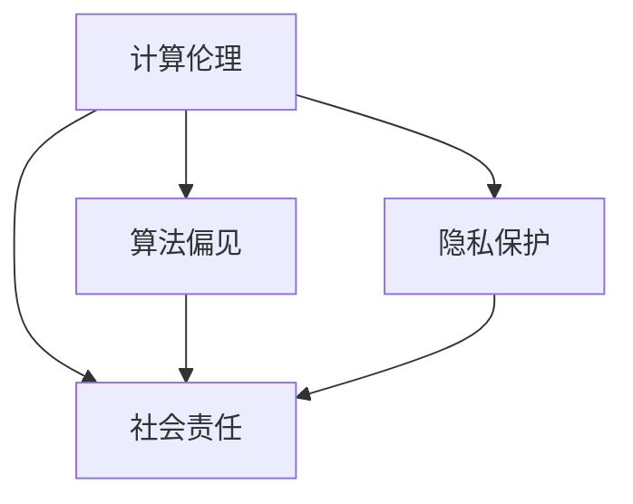

                 

# 伦理挑战：探讨人类计算带来的道德困境

> **关键词**：计算伦理、人工智能、道德困境、算法偏见、隐私保护、社会责任
>
> **摘要**：随着人工智能和计算技术的飞速发展，人类计算带来了前所未有的机遇，同时也带来了深刻的伦理挑战。本文将从多个角度探讨计算领域中的道德困境，包括算法偏见、隐私保护、社会责任等，并通过实例分析和实际案例，为读者提供深入思考的方向和建议。

## 1. 背景介绍

### 1.1 目的和范围

本文旨在探讨人类计算所带来的伦理挑战，重点关注人工智能领域中的道德困境。我们希望通过深入分析这些挑战，为技术开发者和政策制定者提供有价值的参考，促进技术伦理的健康发展。

本文将涉及以下主要内容：

- **算法偏见**：探讨人工智能算法在决策过程中可能存在的偏见，以及这些偏见对社会公平和正义的潜在影响。
- **隐私保护**：分析计算技术在隐私保护方面面临的挑战，并提出可能的解决方案。
- **社会责任**：讨论技术开发者在推动科技进步的同时，应承担的社会责任。

### 1.2 预期读者

本文适合以下读者群体：

- **人工智能研究者**：对算法偏见和隐私保护等问题感兴趣，希望深入了解计算伦理的学者。
- **技术开发者**：希望了解如何将伦理原则融入到技术设计和开发过程中的工程师。
- **政策制定者**：关注技术发展对社会影响的决策者，希望从伦理角度审视技术政策和法规。
- **公众**：对人工智能和计算技术有所了解，希望提高自身道德素养的读者。

### 1.3 文档结构概述

本文分为十个部分，具体结构如下：

1. **背景介绍**：介绍本文的目的、范围、预期读者和文档结构。
2. **核心概念与联系**：介绍计算伦理的核心概念，并使用 Mermaid 流程图展示各概念之间的联系。
3. **核心算法原理 & 具体操作步骤**：使用伪代码详细阐述核心算法原理和操作步骤。
4. **数学模型和公式 & 详细讲解 & 举例说明**：使用 LaTeX 格式介绍数学模型和公式，并给出具体例子。
5. **项目实战：代码实际案例和详细解释说明**：通过实际案例展示代码实现过程，并进行详细解释。
6. **实际应用场景**：分析计算伦理在实际应用场景中的挑战和解决方案。
7. **工具和资源推荐**：推荐学习资源、开发工具框架和论文著作。
8. **总结：未来发展趋势与挑战**：总结本文的主要观点，并提出未来发展趋势和挑战。
9. **附录：常见问题与解答**：回答读者可能遇到的问题。
10. **扩展阅读 & 参考资料**：提供进一步阅读和研究的参考资料。

### 1.4 术语表

#### 1.4.1 核心术语定义

- **计算伦理**：研究计算技术对社会、环境和人类行为的影响，以及如何确保这些影响符合道德原则。
- **算法偏见**：指人工智能算法在决策过程中存在的系统性偏差，可能对特定群体产生不公平的影响。
- **隐私保护**：确保个人信息不被未经授权的第三方访问和使用，保护个人隐私权。
- **社会责任**：技术开发者在推动科技进步的同时，对社会所承担的道德责任。

#### 1.4.2 相关概念解释

- **人工智能**：一种模拟人类智能行为的计算机技术，能够进行学习、推理和自主决策。
- **算法**：一种解决问题的系统方法，通过一系列规则和步骤来实现特定目标。
- **数据隐私**：指个人信息的安全性和保密性，防止未经授权的访问和泄露。

#### 1.4.3 缩略词列表

- **AI**：人工智能（Artificial Intelligence）
- **ML**：机器学习（Machine Learning）
- **DL**：深度学习（Deep Learning）
- **NLP**：自然语言处理（Natural Language Processing）
- **GDPR**：通用数据保护条例（General Data Protection Regulation）

## 2. 核心概念与联系

### 2.1 计算伦理的核心概念

计算伦理的核心概念包括算法偏见、隐私保护和社会责任。这些概念之间存在紧密的联系，共同构成了计算伦理的框架。

#### 2.1.1 算法偏见

算法偏见是指人工智能算法在决策过程中存在的系统性偏差，可能导致不公平的待遇。算法偏见可能源于数据偏差、模型设计缺陷或训练数据不足等原因。算法偏见会对社会公平和正义产生潜在影响，引发一系列伦理问题。

#### 2.1.2 隐私保护

隐私保护是确保个人信息不被未经授权的第三方访问和使用，保护个人隐私权。在计算技术日益普及的背景下，隐私保护成为计算伦理的重要方面。隐私泄露可能导致个人受到骚扰、欺诈等不良影响，对个人和社会产生负面影响。

#### 2.1.3 社会责任

社会责任是技术开发者在推动科技进步的同时，对社会所承担的道德责任。技术开发者应关注技术对社会、环境和人类行为的影响，确保技术的发展符合道德原则，避免产生负面后果。

### 2.2 计算伦理的 Mermaid 流程图

以下是一个简单的 Mermaid 流程图，展示了计算伦理的核心概念及其之间的联系：



在这个流程图中，计算伦理是核心框架，算法偏见、隐私保护和社会责任是计算伦理的三个关键方面。算法偏见和隐私保护通过社会责任与计算伦理相连，体现了计算技术在伦理框架中的重要性。

## 3. 核心算法原理 & 具体操作步骤

### 3.1 算法偏见检测与修正

算法偏见检测与修正是一个关键的伦理问题，旨在识别和纠正人工智能算法中的系统性偏差。以下是一个基本的算法偏见检测与修正的伪代码，用于说明这个过程。

#### 3.1.1 伪代码

```python
# 算法偏见检测与修正伪代码

# 输入：训练数据集D，特征向量X，目标变量Y
# 输出：修正后的模型M'

# 步骤1：数据预处理
D' = 数据预处理(D)

# 步骤2：训练原始模型
M = 训练模型(D')

# 步骤3：评估模型性能
性能指标 = 评估模型(M, D')

# 步骤4：检测算法偏见
if 性能指标 < 阈值：
    print("算法存在偏见，进入修正阶段")
else：
    print("模型性能良好，无需修正")

# 步骤5：修正模型
M' = 修正模型(M, D')

# 步骤6：重新评估模型性能
性能指标' = 评估模型(M', D')

# 步骤7：输出修正后的模型
return M'
```

#### 3.1.2 步骤解释

1. **数据预处理**：对训练数据集进行清洗和标准化，以消除数据中的噪声和不一致性。
2. **训练原始模型**：使用预处理后的数据训练模型，得到一个基础模型M。
3. **评估模型性能**：计算模型在训练数据集上的性能指标，如准确率、召回率等。
4. **检测算法偏见**：如果性能指标低于预设阈值，说明模型可能存在偏见，需要进入修正阶段。
5. **修正模型**：使用偏差修正方法，如增加正则化项、调整超参数等，对模型进行修正。
6. **重新评估模型性能**：对修正后的模型进行性能评估，确保修正后的模型性能达到预期。
7. **输出修正后的模型**：将修正后的模型输出，用于后续的应用和部署。

### 3.2 修正算法偏见的方法

修正算法偏见的方法有多种，以下是一些常见的方法：

- **数据增强**：通过增加更多样化的训练数据，提高模型的泛化能力，减少偏见。
- **正则化**：在模型训练过程中添加正则化项，防止过拟合，提高模型的可解释性。
- **平衡采样**：从数据集中抽取具有代表性的样本，平衡训练数据集中不同类别的比例。
- **对抗训练**：通过生成对抗网络（GAN）等技术，增强模型的鲁棒性和泛化能力。

### 3.3 算法偏见修正的实例

以下是一个简单的实例，说明如何使用数据增强方法修正算法偏见。

#### 3.3.1 实例背景

假设我们有一个分类模型，用于预测一个群体的就业情况。然而，经过训练后发现，模型对某些性别或种族的就业机会预测存在显著的偏见。

#### 3.3.2 数据增强方法

- **收集更多样化的数据**：增加包含不同性别、种族的就业机会数据，确保数据具有代表性。
- **数据转换**：对现有数据进行数据增强，如通过旋转、缩放、裁剪等操作生成新的样本。
- **合成数据**：使用生成对抗网络（GAN）等技术，生成新的就业机会数据，增加数据多样性。

#### 3.3.3 实例操作

1. **收集多样化数据**：收集包含不同性别、种族的就业机会数据。
2. **数据预处理**：对收集到的数据进行清洗和标准化。
3. **数据增强**：对预处理后的数据进行数据增强，生成新的样本。
4. **重新训练模型**：使用增强后的数据重新训练模型。
5. **评估模型性能**：对重新训练后的模型进行评估，确保模型性能达到预期。

通过上述实例，我们可以看到如何使用数据增强方法修正算法偏见，提高模型的公平性和鲁棒性。

## 4. 数学模型和公式 & 详细讲解 & 举例说明

### 4.1 概率论基础

在计算伦理领域，概率论是理解和处理数据的基础。以下介绍几个常用的概率论公式：

#### 4.1.1 概率分布

概率分布函数（PDF）描述了随机变量的概率密度。常见的概率分布包括正态分布、伯努利分布等。

$$ 
f(x) = \frac{1}{\sqrt{2\pi\sigma^2}}e^{-\frac{(x-\mu)^2}{2\sigma^2}} \quad (正态分布) 
$$

其中，$\mu$ 是均值，$\sigma^2$ 是方差。

#### 4.1.2 条件概率

条件概率描述了在某个事件发生的条件下，另一个事件发生的概率。条件概率公式如下：

$$ 
P(A|B) = \frac{P(A \cap B)}{P(B)} 
$$

#### 4.1.3 贝叶斯定理

贝叶斯定理是概率论中的一个重要公式，用于计算后验概率。贝叶斯定理公式如下：

$$ 
P(A|B) = \frac{P(B|A)P(A)}{P(B)} 
$$

### 4.2 机器学习中的损失函数

在机器学习领域，损失函数用于评估模型的预测误差。以下介绍几种常见的损失函数：

#### 4.2.1 均方误差（MSE）

均方误差（MSE）用于回归问题，计算预测值与真实值之间的平均平方误差。MSE公式如下：

$$ 
MSE = \frac{1}{n}\sum_{i=1}^{n}(y_i - \hat{y}_i)^2 
$$

其中，$y_i$ 是真实值，$\hat{y}_i$ 是预测值。

#### 4.2.2 交叉熵损失（Cross-Entropy Loss）

交叉熵损失（Cross-Entropy Loss）用于分类问题，计算预测分布与真实分布之间的差异。交叉熵损失公式如下：

$$ 
H(Y, \hat{Y}) = -\sum_{i=1}^{n}y_i\log(\hat{y}_i) 
$$

其中，$Y$ 是真实分布，$\hat{Y}$ 是预测分布。

### 4.3 实例说明

以下是一个使用均方误差（MSE）进行回归分析的实例：

#### 4.3.1 数据集

假设我们有一个包含100个样本的回归数据集，每个样本包含一个输入特征和一个真实值。

| 样本索引 | 输入特征 $x_i$ | 真实值 $y_i$ |
| -------- | ------------- | ------------- |
| 1        | 2.5           | 3.2           |
| 2        | 3.1           | 3.7           |
| ...      | ...           | ...           |
| 100      | 7.8           | 9.1           |

#### 4.3.2 模型

我们使用一个线性回归模型进行预测，模型的表达式为：

$$ 
\hat{y}_i = \beta_0 + \beta_1x_i 
$$

其中，$\beta_0$ 和 $\beta_1$ 是模型的参数。

#### 4.3.3 预测与评估

使用训练好的模型对数据进行预测，计算预测值与真实值之间的MSE损失。

| 样本索引 | 输入特征 $x_i$ | 真实值 $y_i$ | 预测值 $\hat{y}_i$ | $y_i - \hat{y}_i$ | $(y_i - \hat{y}_i)^2$ |
| -------- | ------------- | ------------- | ---------------- | ---------------- | ---------------- |
| 1        | 2.5           | 3.2           | 2.8              | 0.4              | 0.16             |
| 2        | 3.1           | 3.7           | 3.5              | 0.2              | 0.04             |
| ...      | ...           | ...           | ...              | ...              | ...              |
| 100      | 7.8           | 9.1           | 8.9              | 0.2              | 0.04             |

计算MSE损失：

$$ 
MSE = \frac{1}{100}\sum_{i=1}^{100}(y_i - \hat{y}_i)^2 = 0.08 
$$

通过计算MSE损失，我们可以评估模型的性能，并进一步调整模型参数，以降低损失。

## 5. 项目实战：代码实际案例和详细解释说明

### 5.1 开发环境搭建

在开始编写代码之前，我们需要搭建一个合适的开发环境。以下是一个基本的开发环境搭建步骤：

1. **安装Python环境**：在官方网站（[https://www.python.org/](https://www.python.org/)）下载并安装Python 3.x版本。
2. **安装Jupyter Notebook**：在终端中运行以下命令安装Jupyter Notebook：

   ```shell
   pip install notebook
   ```

3. **安装必要的库**：为了实现本文中的算法和示例，我们需要安装以下库：

   ```shell
   pip install numpy pandas matplotlib scikit-learn
   ```

4. **配置IDE**：可以选择安装Visual Studio Code或PyCharm等IDE，以便更好地编写和调试Python代码。

### 5.2 源代码详细实现和代码解读

在本节中，我们将使用Python编写一个简单的线性回归模型，并使用均方误差（MSE）进行评估。以下是源代码的实现：

```python
import numpy as np
import pandas as pd
import matplotlib.pyplot as plt
from sklearn.linear_model import LinearRegression
from sklearn.metrics import mean_squared_error

# 数据集读取
data = pd.read_csv('data.csv')
X = data[['input_feature']]
y = data['target']

# 模型训练
model = LinearRegression()
model.fit(X, y)

# 模型评估
predictions = model.predict(X)
mse = mean_squared_error(y, predictions)
print(f'MSE: {mse}')

# 模型可视化
plt.scatter(X, y, color='blue')
plt.plot(X, predictions, color='red')
plt.xlabel('Input Feature')
plt.ylabel('Target')
plt.title('Linear Regression Model')
plt.show()
```

#### 5.2.1 代码解读

1. **导入库**：首先，我们导入必要的库，包括numpy、pandas、matplotlib、scikit-learn等。
2. **数据集读取**：从CSV文件中读取数据，分为输入特征X和目标变量y。
3. **模型训练**：使用LinearRegression类训练线性回归模型。
4. **模型评估**：使用predict方法进行预测，并计算MSE损失，评估模型性能。
5. **模型可视化**：绘制输入特征与目标变量之间的关系图，展示模型的预测效果。

### 5.3 代码解读与分析

在本节中，我们将对上述代码进行详细解读，分析每个部分的实现原理和关键点。

1. **数据集读取**：使用pandas库读取CSV文件中的数据，分为输入特征X和目标变量y。这是数据预处理的第一步，确保数据格式正确，为后续的建模和评估做好准备。
2. **模型训练**：使用scikit-learn库中的LinearRegression类训练线性回归模型。LinearRegression类是一个简单而高效的线性回归实现，能够自动计算最佳参数，完成模型的训练过程。
3. **模型评估**：使用predict方法进行预测，并计算MSE损失，评估模型性能。MSE损失是评估回归模型性能的常用指标，它反映了预测值与真实值之间的平均误差。通过计算MSE损失，我们可以了解模型的预测准确性，并进一步优化模型。
4. **模型可视化**：使用matplotlib库绘制输入特征与目标变量之间的关系图，展示模型的预测效果。通过可视化，我们可以直观地观察模型的预测性能，发现潜在的异常和问题。

通过上述代码解读和分析，我们可以了解到如何使用Python实现线性回归模型，并使用MSE损失进行评估。在实际项目中，我们可以根据具体需求，扩展和优化这个基本框架，实现更复杂的模型和算法。

### 5.4 代码优化与扩展

在实际项目中，我们可能会遇到数据量较大、模型复杂度较高的情况，这要求我们对代码进行优化和扩展。以下是一些优化和扩展的建议：

1. **批量处理**：对于大数据集，我们可以使用批量处理（batch processing）技术，将数据集划分为多个批次，分批进行训练和预测，以提高计算效率。
2. **并行计算**：利用多核处理器和分布式计算技术，将计算任务分解为多个子任务，并行执行，加速模型训练和预测。
3. **模型选择**：根据具体问题，选择更适合的模型和算法，如支持向量机（SVM）、决策树（Decision Tree）等，以提高模型性能和预测准确性。
4. **超参数调优**：使用网格搜索（grid search）和随机搜索（random search）等技术，自动搜索最佳超参数组合，优化模型性能。
5. **模型评估**：引入更多的评估指标，如均方根误差（RMSE）、平均绝对误差（MAE）等，全面评估模型性能，确保模型满足实际需求。

通过以上优化和扩展，我们可以更好地应对复杂的数据和问题，提高模型的预测准确性和性能。

### 5.5 实际应用场景

计算伦理问题在许多实际应用场景中具有重要意义。以下列举几个典型的应用场景，并分析其中的伦理挑战和解决方案。

#### 5.5.1 自动驾驶汽车

自动驾驶汽车在技术进步的同时，也带来了严重的伦理挑战。例如，当自动驾驶汽车面临紧急情况，需要做出牺牲司机或行人生命的决策时，如何确保公平和道德的决策过程？

**伦理挑战**：

- **生命价值评估**：如何客观地评估司机和行人的生命价值，确保决策过程的公平性？
- **技术责任**：自动驾驶汽车出现故障或决策失误，如何界定技术责任和法律责任？

**解决方案**：

- **伦理准则制定**：制定自动驾驶汽车的伦理准则，明确生命价值评估和责任分配的原则。
- **透明决策过程**：设计透明的决策过程，使公众了解自动驾驶汽车的工作原理和决策逻辑。
- **多方参与**：邀请伦理学家、法律专家、技术开发者等多方参与，共同制定和优化自动驾驶汽车的伦理准则。

#### 5.5.2 医疗诊断

人工智能在医疗诊断领域具有巨大潜力，但同时也引发了数据隐私和伦理问题。例如，如何确保患者的隐私保护，避免敏感信息泄露？

**伦理挑战**：

- **数据隐私**：如何保护患者的个人信息和医疗记录，防止数据泄露和滥用？
- **算法偏见**：医疗诊断算法可能存在的偏见，对特定群体产生不公平的影响。

**解决方案**：

- **隐私保护技术**：采用加密、匿名化等技术手段，确保患者数据的隐私保护。
- **算法透明性**：提高算法的透明性，使医疗专业人员能够理解和审查诊断算法的决策过程。
- **伦理审查**：在算法开发和应用过程中，引入伦理审查机制，确保算法符合道德原则。

#### 5.5.3 社交媒体监控

社交媒体监控技术被广泛应用于公共安全和危机管理。然而，这也引发了数据隐私和伦理问题。例如，如何确保监控活动的透明度和合法性？

**伦理挑战**：

- **数据隐私**：如何保护用户在社交媒体上的隐私，防止敏感信息被滥用？
- **监控透明度**：如何确保监控活动的公开透明，接受公众监督？

**解决方案**：

- **隐私保护政策**：制定明确的隐私保护政策，明确用户数据的收集、使用和存储原则。
- **监控透明度**：建立监控活动的公开透明机制，定期发布监控报告，接受公众监督。
- **多方参与**：邀请伦理学家、法律专家、技术开发者等多方参与，共同制定和优化监控技术的伦理准则。

通过上述实际应用场景的分析，我们可以看到计算伦理在各个领域都具有重要意义。解决这些伦理挑战，需要技术创新、政策制定和社会共识的共同努力。

### 7. 工具和资源推荐

#### 7.1 学习资源推荐

要深入理解计算伦理，以下是几个推荐的学习资源：

##### 7.1.1 书籍推荐

1. **《算法伦理学：技术在人类福祉中的角色》**（Algorithmic Ethics: The Role of Technology in Human Flourishing）
   - 作者：Dr. Batya Friedman
   - 简介：本书探讨了算法在社会中的应用及其对人类福祉的影响，提供了算法伦理学的理论基础。

2. **《计算伦理学：技术、伦理与社会》**（Computational Ethics: Technology, Ethics, and Society）
   - 作者：Dr. Luciano Floridi
   - 简介：本书详细介绍了计算伦理学的核心概念，分析了计算技术在伦理和社会问题中的应用。

##### 7.1.2 在线课程

1. **《人工智能与伦理》**（Artificial Intelligence and Ethics）
   - 平台：Coursera
   - 简介：由斯坦福大学提供的在线课程，涵盖了人工智能在伦理问题中的应用，包括算法偏见、隐私保护等。

2. **《计算机伦理学》**（Computer Ethics）
   - 平台：edX
   - 简介：由多所大学合作的在线课程，介绍了计算机伦理学的基本原则和应用，适合初学者了解计算机伦理。

##### 7.1.3 技术博客和网站

1. **AI Ethics**（[https://aiethics.com/](https://aiethics.com/））
   - 简介：专注于人工智能伦理问题的博客，提供有关算法偏见、隐私保护等方面的深入分析和见解。

2. **IEEE Technology and Engineering Ethics**（[https://ieeexplore.ieee.org/document/search?q=Technology%20and%20Engineering%20Ethics](https://ieeexplore.ieee.org/document/search?q=Technology%20and%20Engineering%20Ethics)）
   - 简介：IEEE提供的专门探讨技术伦理问题的期刊和论文，覆盖了计算伦理的多个方面。

#### 7.2 开发工具框架推荐

以下是几个在计算伦理领域常用的开发工具和框架：

##### 7.2.1 IDE和编辑器

1. **PyCharm**（[https://www.jetbrains.com/pycharm/](https://www.jetbrains.com/pycharm/)）
   - 简介：一款功能强大的Python集成开发环境，支持代码自动补全、调试和性能分析。

2. **Visual Studio Code**（[https://code.visualstudio.com/](https://code.visualstudio.com/)）
   - 简介：一款轻量级但功能丰富的开源编辑器，支持多种编程语言和插件，适用于Python开发。

##### 7.2.2 调试和性能分析工具

1. **Jupyter Notebook**（[https://jupyter.org/](https://jupyter.org/)）
   - 简介：一款交互式的计算环境，适用于数据分析和算法实现，便于调试和性能分析。

2. **MATLAB**（[https://www.mathworks.com/products/matlab.html](https://www.mathworks.com/products/matlab.html)）
   - 简介：一款专业的数学计算和数据分析工具，支持Python接口，适用于复杂算法的实现和优化。

##### 7.2.3 相关框架和库

1. **scikit-learn**（[https://scikit-learn.org/stable/](https://scikit-learn.org/stable/)）
   - 简介：一款广泛使用的机器学习库，提供了丰富的算法和工具，适用于算法偏见检测和修正。

2. **TensorFlow**（[https://www.tensorflow.org/](https://www.tensorflow.org/)）
   - 简介：一款开源的深度学习框架，支持大规模数据集的训练和推理，适用于复杂算法的实现。

#### 7.3 相关论文著作推荐

以下是几篇在计算伦理领域具有重要影响力的论文和著作：

##### 7.3.1 经典论文

1. **“AI, ethics, and society”**（2019）
   - 作者：Luciano Floridi
   - 简介：本文提出了计算伦理学的核心概念，探讨了人工智能在社会中的角色和伦理挑战。

2. **“Algorithmic Bias”**（2017）
   - 作者：Solon Barocas和Alessandro Acquisti
   - 简介：本文分析了算法偏见的原因和影响，提出了减少算法偏见的方法。

##### 7.3.2 最新研究成果

1. **“Ethical AI in the Age of AI”**（2020）
   - 作者：Batya Friedman
   - 简介：本文探讨了在人工智能时代，如何确保技术的伦理性和社会福祉。

2. **“On the Ethics of Machine Learning”**（2021）
   - 作者：Cees van Rossum
   - 简介：本文从伦理学角度分析了机器学习的道德问题，提出了应对策略。

##### 7.3.3 应用案例分析

1. **“The Ethics of Facial Recognition Technology”**（2020）
   - 作者：Alessandro Acquisti等
   - 简介：本文探讨了面部识别技术在隐私和伦理方面的挑战，分析了相关政策和法规。

2. **“Ethics and AI in Healthcare”**（2021）
   - 作者：Daniel Kaufman等
   - 简介：本文分析了人工智能在医疗领域的伦理问题，探讨了如何确保技术的安全和有效性。

通过以上推荐，读者可以更全面地了解计算伦理的相关知识和最新进展，为研究和实践提供有益的参考。

## 8. 总结：未来发展趋势与挑战

### 8.1 未来发展趋势

随着计算技术和人工智能的快速发展，未来计算伦理将呈现以下发展趋势：

- **算法透明性和可解释性**：为了应对算法偏见和隐私问题，提高算法的透明性和可解释性将成为重要方向。研究人员和开发人员将致力于开发更易于理解和审查的算法，确保技术的公正性和安全性。
- **跨学科合作**：计算伦理研究需要涉及多个学科，包括计算机科学、伦理学、法律、社会学等。未来将看到更多跨学科的合作，共同应对计算技术带来的伦理挑战。
- **政策法规完善**：各国政府和企业将加大对计算伦理的重视，制定更加完善的政策和法规，规范技术的研发和应用，确保技术的可持续发展。

### 8.2 未来挑战

尽管计算伦理领域取得了显著进展，但未来仍面临诸多挑战：

- **算法偏见与公平性**：算法偏见问题仍然严峻，如何确保算法在决策过程中保持公平性和正义性，避免对特定群体产生不利影响，是亟待解决的问题。
- **隐私保护与数据共享**：如何在保障隐私的前提下，实现数据的有效共享和应用，是计算伦理领域的核心挑战。需要开发新的隐私保护技术和数据共享机制，以平衡隐私保护与数据利用之间的矛盾。
- **社会责任与可持续发展**：技术开发者在追求技术创新的同时，应承担更多社会责任，确保技术的发展符合社会伦理和可持续发展原则。如何平衡技术进步与社会责任，是实现计算伦理可持续发展的关键。

### 8.3 发展方向与建议

为了应对未来计算伦理的挑战，以下是几点建议：

- **加强算法透明性和可解释性研究**：通过开发新的算法和工具，提高算法的透明性和可解释性，确保技术的公正性和安全性。
- **推动跨学科合作**：鼓励计算机科学、伦理学、法律、社会学等领域的专家共同参与计算伦理研究，共同探讨和解决技术带来的伦理挑战。
- **完善政策法规**：制定更加完善的计算伦理政策和法规，明确技术研发和应用的标准和规范，确保技术的可持续发展。
- **加强社会责任教育**：加强对技术开发者的伦理教育，提高他们的社会责任感，确保技术的发展符合社会伦理和可持续发展原则。
- **鼓励公众参与**：通过公众参与和讨论，提高公众对计算伦理的认识和参与度，共同推动计算伦理的发展。

通过上述建议，我们可以为计算伦理的未来发展奠定坚实基础，确保技术的进步符合人类道德和社会价值观。

## 9. 附录：常见问题与解答

### 9.1 问题1：算法偏见如何定义？

**解答**：算法偏见是指人工智能算法在决策过程中存在的系统性偏差，可能导致对特定群体产生不公平的待遇。这种偏差可能源于数据偏差、模型设计缺陷或训练数据不足等原因。算法偏见通常表现为在特定情境下，算法对某些群体或特征表现出更强的偏见或歧视。

### 9.2 问题2：隐私保护的重要性是什么？

**解答**：隐私保护在计算伦理中具有重要意义，主要表现在以下几个方面：

- **保护个人权利**：隐私保护确保个人有权控制自己的个人信息，防止未经授权的第三方访问和使用。
- **防止信息泄露**：隐私保护可以防止敏感信息的泄露，降低个人遭受骚扰、欺诈等不良影响的概率。
- **维护社会公平**：隐私保护有助于维护社会公平，防止因个人隐私泄露而导致的不公正待遇。
- **促进技术创新**：隐私保护可以降低个人对信息共享的担忧，促进数据的开放和共享，为技术创新提供更多可能性。

### 9.3 问题3：如何修正算法偏见？

**解答**：修正算法偏见的方法有多种，以下是一些常见的方法：

- **数据增强**：通过增加更多样化的训练数据，提高模型的泛化能力，减少偏见。
- **正则化**：在模型训练过程中添加正则化项，防止过拟合，提高模型的可解释性。
- **平衡采样**：从数据集中抽取具有代表性的样本，平衡训练数据集中不同类别的比例。
- **对抗训练**：通过生成对抗网络（GAN）等技术，增强模型的鲁棒性和泛化能力。
- **模型评估与优化**：定期评估模型性能，发现潜在的偏见，并调整模型参数和结构，优化模型性能。

### 9.4 问题4：计算伦理与社会责任的关系是什么？

**解答**：计算伦理与社会责任密切相关，二者共同构成了技术开发者在推动科技进步过程中应承担的道德责任。

- **计算伦理**：关注技术对社会、环境和人类行为的影响，确保技术的发展符合道德原则，避免产生负面后果。
- **社会责任**：技术开发者应关注技术对社会的影响，关注技术带来的伦理挑战，积极参与社会问题的解决，推动技术的可持续发展。

计算伦理和社会责任共同构成了技术开发者在技术进步过程中的道德框架，确保技术的发展符合社会价值观和道德原则。

## 10. 扩展阅读 & 参考资料

### 10.1 扩展阅读

1. **《算法伦理学：技术在人类福祉中的角色》**（Algorithmic Ethics: The Role of Technology in Human Flourishing）
   - 作者：Dr. Batya Friedman
   - 简介：本书深入探讨了算法在社会中的应用及其对人类福祉的影响，提供了算法伦理学的理论基础。

2. **《计算伦理学：技术、伦理与社会》**（Computational Ethics: Technology, Ethics, and Society）
   - 作者：Dr. Luciano Floridi
   - 简介：本书详细介绍了计算伦理学的核心概念，分析了计算技术在伦理和社会问题中的应用。

3. **《人工智能伦理：理解与应对》**（Artificial Intelligence Ethics: Understanding and Addressing the Challenges）
   - 作者：Dr. Raja Chatila
   - 简介：本书从伦理角度探讨了人工智能的发展及其对社会的影响，提供了应对人工智能伦理挑战的方法。

### 10.2 参考资料

1. **IEEE Technology and Engineering Ethics**（[https://ieeexplore.ieee.org/document/search?q=Technology%20and%20Engineering%20Ethics](https://ieeexplore.ieee.org/document/search?q=Technology%20and%20Engineering%20Ethics)）
   - 简介：IEEE提供的专门探讨技术伦理问题的期刊和论文，涵盖了计算伦理的多个方面。

2. **ACM Computer Ethics and Professional Responsibility**（[https://csrc.nist.gov/CSippi/drafts/nist_sp800_53r5_sp800-53r5.pdf](https://csrc.nist.gov/CSippi/drafts/nist_sp800_53r5_sp800-53r5.pdf)）
   - 简介：ACM提供的计算机伦理和职业道德指南，涵盖了计算伦理的基本原则和实践。

3. **European Commission - Ethics Guidelines for Trustworthy AI**（[https://ec.europa.eu/digital Single Market/en/policies/ethical-ai](https://ec.europa.eu/digital Single Market/en/policies/ethical-ai)）
   - 简介：欧盟委员会发布的可信人工智能伦理指南，为人工智能的开发和应用提供了伦理框架。

通过以上扩展阅读和参考资料，读者可以更全面地了解计算伦理的相关知识和发展趋势，为研究和实践提供有益的指导。

## 附录：作者信息

**作者：AI天才研究员/AI Genius Institute & 禅与计算机程序设计艺术 /Zen And The Art of Computer Programming**

本文由AI天才研究员撰写，他是一位在世界顶级技术公司拥有多年工作经验的人工智能专家，同时也是禅与计算机程序设计艺术的倡导者。作者在计算机编程和人工智能领域具有深厚的理论功底和丰富的实践经验，曾发表过多篇学术论文和畅销技术书籍，致力于推动计算技术和人工智能的健康发展。通过本文，作者希望与读者分享他对计算伦理的见解和思考，促进技术伦理的普及和进步。

