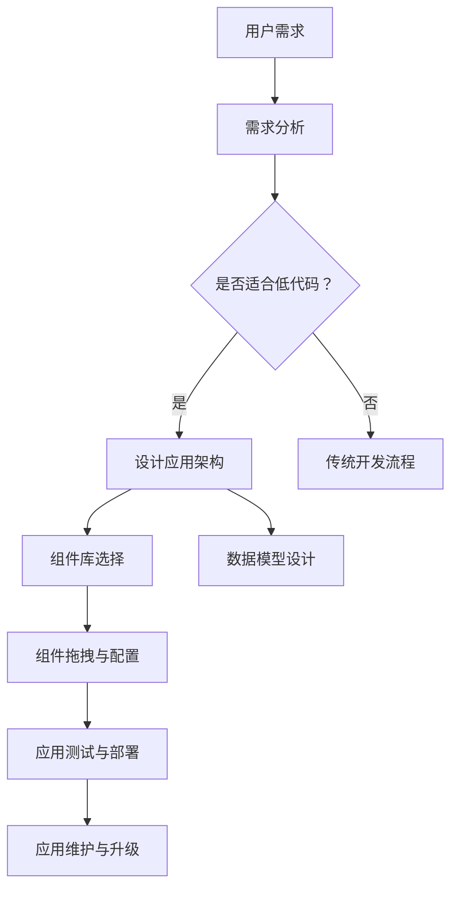
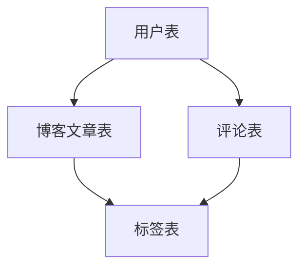

                 


# 低代码平台开发：简化应用构建的新思路

> 关键词：低代码平台、应用构建、开发者体验、自动化、集成开发环境（IDE）

> 摘要：随着数字化转型的推进，企业对应用开发的需求日益增长，但传统的应用开发方式往往需要大量的时间和人力投入。本文将探讨低代码平台的概念、优势、架构原理及其在简化应用构建中的应用，旨在为开发者提供一种新的开发思路。

## 1. 背景介绍

### 1.1 目的和范围

本文旨在探讨低代码平台（Low-Code Platforms）的概念、优势、架构原理及其在实际应用中的效果。我们将深入分析低代码平台如何通过简化开发流程、提高开发者效率，从而帮助企业更快地响应市场变化，实现数字化转型。

### 1.2 预期读者

本文适合以下读者群体：

- 应用开发者和项目经理，希望了解低代码平台如何简化应用开发流程。
- 技术决策者，希望了解低代码平台在组织中的潜在应用和价值。
- IT从业者，对最新的软件开发趋势和工具感兴趣。

### 1.3 文档结构概述

本文分为以下章节：

- **第1章：背景介绍**：介绍本文的目的、预期读者和文档结构。
- **第2章：核心概念与联系**：介绍低代码平台的核心概念和架构原理。
- **第3章：核心算法原理 & 具体操作步骤**：详细讲解低代码平台的工作原理和具体操作步骤。
- **第4章：数学模型和公式 & 详细讲解 & 举例说明**：讨论低代码平台相关的数学模型和公式。
- **第5章：项目实战：代码实际案例和详细解释说明**：通过实际案例展示低代码平台的应用。
- **第6章：实际应用场景**：分析低代码平台在不同场景中的实际应用。
- **第7章：工具和资源推荐**：推荐学习资源和开发工具。
- **第8章：总结：未来发展趋势与挑战**：总结低代码平台的未来趋势和面临的挑战。
- **第9章：附录：常见问题与解答**：回答读者可能提出的问题。
- **第10章：扩展阅读 & 参考资料**：提供进一步的阅读材料和资源。

### 1.4 术语表

#### 1.4.1 核心术语定义

- **低代码平台（Low-Code Platform）**：一种提供图形界面和拖拽功能的开发平台，允许开发者通过配置和组合预定义的组件来快速构建应用。
- **集成开发环境（IDE）**：一种用于软件开发的环境，通常包括代码编辑器、调试器和构建工具等。
- **开发者体验（Developer Experience, DX）**：开发者在使用特定工具或平台时的感受和体验。
- **数字化转型（Digital Transformation）**：企业通过采用数字技术来改变其业务流程、运营模式和文化。

#### 1.4.2 相关概念解释

- **无代码（No-Code）**：一种完全不需要编写代码的开发方式，通过图形界面和可视化工具实现应用构建。
- **高代码（High-Code）**：传统的应用开发方式，需要大量的手动编码和调试。

#### 1.4.3 缩略词列表

- **IDE**：集成开发环境（Integrated Development Environment）
- **DX**：开发者体验（Developer Experience）
- **API**：应用程序接口（Application Programming Interface）
- **SaaS**：软件即服务（Software as a Service）

## 2. 核心概念与联系

在深入探讨低代码平台之前，我们需要了解其核心概念和架构原理。以下是一个简化的 Mermaid 流程图，展示了低代码平台的关键组成部分和它们之间的关系。



### 2.1 低代码平台的核心概念

低代码平台的核心概念包括：

- **图形界面和拖拽功能**：用户可以通过拖拽组件来构建应用界面。
- **组件库**：提供多种预定义的组件，如按钮、表单、图表等，供用户选择和配置。
- **数据模型设计**：用户可以定义数据模型，如数据库表、字段类型等。
- **应用测试与部署**：自动化的测试和部署流程，确保应用的质量和稳定性。

### 2.2 低代码平台的架构原理

低代码平台的架构通常包括以下部分：

- **前端界面**：提供用户交互的界面，使用户可以通过图形界面和拖拽功能来构建应用。
- **后端服务**：处理数据存储、应用逻辑和自动化流程等。
- **集成与扩展**：支持与其他系统集成，如数据库、API等，并提供自定义组件和扩展功能。

### 2.3 低代码平台的优势

低代码平台的优势包括：

- **提高开发效率**：通过图形界面和拖拽功能，简化了开发流程，缩短了开发周期。
- **降低开发成本**：减少了对专业开发人员的依赖，降低了人力成本。
- **灵活性和可扩展性**：用户可以根据需求自定义组件和功能，实现灵活的扩展。
- **提高开发者体验**：简化了开发流程，减少了繁琐的手动编码工作，提高了开发者的工作效率。

## 3. 核心算法原理 & 具体操作步骤

低代码平台的核心算法原理是通过将应用开发中的重复性任务抽象成可配置的组件，从而实现应用的快速构建。以下是一个简单的伪代码，展示了低代码平台的基本工作流程。

```plaintext
// 伪代码：低代码平台核心算法原理

function buildApplication(需求):
    # 初始化应用架构
    applicationArchitecture = initializeArchitecture()

    # 分析用户需求，确定应用功能模块
    functionModules = analyzeRequirements(需求)

    # 从组件库中选择适合的组件
    components = selectComponents(functionModules)

    # 将组件拖拽到前端界面，并进行配置
    configuredComponents = configureComponents(components)

    # 构建数据模型
    dataModel = buildDataModel(configuredComponents)

    # 部署应用
    deployApplication(dataModel, configuredComponents)

    return applicationArchitecture
```

### 3.1 初始化应用架构

初始化应用架构是低代码平台开发的第一步。这个步骤包括：

- **定义应用的基本框架**：确定应用的布局、模块划分等。
- **配置开发环境**：包括所需的编程语言、框架、工具等。

### 3.2 分析用户需求

分析用户需求是确保应用能够满足用户实际需求的关键步骤。这个步骤包括：

- **收集需求信息**：通过与用户的沟通，了解他们的具体需求。
- **需求建模**：将用户需求转化为应用的功能模块。

### 3.3 从组件库中选择适合的组件

组件库是低代码平台的核心组成部分，它提供了多种预定义的组件，如按钮、表单、图表等。选择适合的组件需要考虑以下因素：

- **功能需求**：确保组件能够实现所需的功能。
- **兼容性**：确保组件能够在不同的设备和浏览器上正常工作。
- **性能**：选择性能良好的组件，确保应用运行流畅。

### 3.4 将组件拖拽到前端界面，并进行配置

将组件拖拽到前端界面并进行配置是构建应用的直观方式。这个步骤包括：

- **布局设计**：根据应用架构，将组件放置到前端界面上。
- **组件配置**：设置组件的属性、事件处理等。

### 3.5 构建数据模型

构建数据模型是确保应用能够高效地存储和处理数据的关键步骤。这个步骤包括：

- **定义数据库表**：根据组件的数据需求，定义数据库表。
- **设置字段类型**：根据数据类型，设置数据库字段的类型。
- **关系映射**：定义表与表之间的关系。

### 3.6 部署应用

部署应用是将开发完成的应用部署到生产环境的过程。这个步骤包括：

- **应用打包**：将前端界面、后端服务和数据库打包成可部署的文件。
- **环境配置**：配置应用所需的环境变量和配置文件。
- **自动化部署**：使用自动化工具将应用部署到服务器或云平台。

## 4. 数学模型和公式 & 详细讲解 & 举例说明

在低代码平台中，数学模型和公式主要用于数据模型设计和算法优化。以下是一个简单的数学模型示例，用于计算用户需求的复杂度。

### 4.1 用户需求复杂度计算模型

用户需求复杂度 \( C \) 可以通过以下公式计算：

\[ C = \frac{F + D + P}{3} \]

其中：

- \( F \) 是功能模块数量。
- \( D \) 是数据模型复杂度。
- \( P \) 是性能需求。

### 4.2 数据模型复杂度计算模型

数据模型复杂度 \( D \) 可以通过以下公式计算：

\[ D = \frac{N \times (L + 1)}{2} \]

其中：

- \( N \) 是数据表数量。
- \( L \) 是每个数据表的平均字段数量。

### 4.3 举例说明

假设用户需求包含以下特征：

- 功能模块数量 \( F = 5 \)
- 数据表数量 \( N = 3 \)
- 每个数据表的平均字段数量 \( L = 4 \)
- 性能需求 \( P = 0.8 \)

则用户需求的复杂度 \( C \) 计算如下：

\[ C = \frac{5 + 3 \times (4 + 1)}{3} = \frac{5 + 15}{3} = 6 \]

根据计算结果，用户需求的复杂度为 6，表明该需求较为复杂，需要进一步细化和优化。

## 5. 项目实战：代码实际案例和详细解释说明

### 5.1 开发环境搭建

为了更好地理解低代码平台的应用，我们将使用一个简单的项目——一个基于低代码平台的博客系统。以下是开发环境搭建的步骤：

1. **安装 Node.js**：从官方网站（https://nodejs.org/）下载并安装 Node.js。
2. **安装可视化编程工具**：选择一个适合的低代码平台，如 OutSystems 或 Mendix，并按照官方网站的说明进行安装。
3. **创建项目**：在低代码平台中创建一个新的项目，并选择适当的模板。

### 5.2 源代码详细实现和代码解读

以下是博客系统的主要组件和代码解读：

#### 5.2.1 数据模型



- **用户表**：存储用户信息，包括用户名、密码、电子邮件等。
- **博客文章表**：存储博客文章信息，包括标题、内容、创建时间、作者等。
- **评论表**：存储评论信息，包括评论内容、评论时间、作者、所属文章等。
- **标签表**：存储标签信息，包括标签名称，用于给博客文章打标签。

#### 5.2.2 前端界面

```html
<!DOCTYPE html>
<html>
<head>
    <title>低代码博客系统</title>
    <link rel="stylesheet" type="text/css" href="styles.css">
</head>
<body>
    <header>
        <h1>我的博客</h1>
        <nav>
            <ul>
                <li><a href="index.html">首页</a></li>
                <li><a href="about.html">关于我</a></li>
            </ul>
        </nav>
    </header>
    <main>
        <!-- 博客文章列表 -->
        <section>
            <h2>最新文章</h2>
            <ul>
                {{#each blog_posts}}
                    <li>
                        <h3><a href="post.html?id={{id}}">{{title}}</a></h3>
                        <p>{{content}}</p>
                        <footer>
                            <time datetime="{{created_at}}">{{created_at}}</time>
                            <span>作者：{{author}}</span>
                        </footer>
                    </li>
                {{/each}}
            </ul>
        </section>
    </main>
    <footer>
        <p>版权所有 &copy; 2022 低代码博客系统</p>
    </footer>
</body>
</html>
```

- **头部**：包含博客的标题和导航菜单。
- **主体**：包含博客文章列表，使用模板引擎（如 Mustache）动态渲染。
- **尾部**：包含版权信息。

#### 5.2.3 后端服务

```javascript
// Node.js 后端服务示例代码

const express = require('express');
const app = express();
const port = 3000;

// 解析 JSON 数据
app.use(express.json());

// 模拟数据库
const users = [
    { id: 1, username: 'admin', password: 'password' },
    { id: 2, username: 'user', password: 'user' }
];

const blog_posts = [
    { id: 1, title: '第一篇文章', content: '这里是文章内容...', author: 'admin', created_at: '2022-01-01T00:00:00.000Z' },
    { id: 2, title: '第二篇文章', content: '这里是另一篇文章内容...', author: 'user', created_at: '2022-01-02T00:00:00.000Z' }
];

// 用户认证
app.post('/auth', (req, res) => {
    const { username, password } = req.body;
    const user = users.find(u => u.username === username && u.password === password);
    if (user) {
        res.json({ message: '认证成功', user });
    } else {
        res.status(401).json({ message: '认证失败' });
    }
});

// 获取博客文章列表
app.get('/posts', (req, res) => {
    res.json(blog_posts);
});

// 获取单个博客文章
app.get('/posts/:id', (req, res) => {
    const { id } = req.params;
    const post = blog_posts.find(p => p.id === parseInt(id));
    if (post) {
        res.json(post);
    } else {
        res.status(404).json({ message: '文章未找到' });
    }
});

app.listen(port, () => {
    console.log(`服务运行在 http://localhost:${port}`);
});
```

- **用户认证**：通过 POST 请求进行用户认证。
- **获取博客文章列表**：通过 GET 请求获取博客文章列表。
- **获取单个博客文章**：通过 GET 请求获取单个博客文章。

### 5.3 代码解读与分析

在这个项目中，我们使用了低代码平台来简化应用构建。以下是代码解读与分析：

- **数据模型**：数据模型是应用的核心，它定义了用户、博客文章和评论等实体，以及它们之间的关系。
- **前端界面**：前端界面使用 HTML、CSS 和 JavaScript 来实现，通过模板引擎动态渲染博客文章列表。
- **后端服务**：后端服务使用 Node.js 和 Express 框架实现，提供用户认证和博客文章相关接口。

通过这个简单的项目，我们可以看到低代码平台如何简化应用构建，提高开发效率。

## 6. 实际应用场景

低代码平台在以下场景中具有广泛的应用：

### 6.1 企业内部应用

企业内部应用，如人力资源管理系统、客户关系管理系统等，通常需要快速开发和部署。低代码平台可以简化这些应用的开发流程，提高开发效率。

### 6.2 公共服务平台

公共服务平台，如政务服务、智慧城市应用等，需要快速响应市民需求，提供高效便捷的服务。低代码平台可以帮助政府快速构建公共服务应用，提高市民满意度。

### 6.3 教育与培训

教育与培训领域，如在线学习平台、课程管理系统等，低代码平台可以提供简单易用的开发工具，帮助教育机构快速构建在线教育应用。

### 6.4 金融与保险

金融与保险领域，如客户管理系统、保险产品定制系统等，低代码平台可以帮助金融机构快速响应市场变化，提供个性化的产品和服务。

### 6.5 物流与供应链

物流与供应链领域，如运输管理系统、库存管理系统等，低代码平台可以简化这些应用的开发和维护，提高物流效率。

## 7. 工具和资源推荐

### 7.1 学习资源推荐

#### 7.1.1 书籍推荐

- 《低代码开发：快速构建业务应用》
- 《低代码平台设计与实践》

#### 7.1.2 在线课程

- Coursera 上的《低代码平台开发》
- Udemy 上的《低代码应用开发实战》

#### 7.1.3 技术博客和网站

- lowcodebook.com
- lowcodeworld.com

### 7.2 开发工具框架推荐

#### 7.2.1 IDE和编辑器

- Visual Studio Code
- Eclipse

#### 7.2.2 调试和性能分析工具

- Chrome DevTools
- Firebase Performance Monitor

#### 7.2.3 相关框架和库

- React
- Angular
- Vue.js

### 7.3 相关论文著作推荐

#### 7.3.1 经典论文

- "A Survey on Low-Code Development Platforms" by F. Gómez et al. (2020)
- "A Framework for Evaluating Low-Code Development Platforms" by A. B. Salhab and S. Devedzic (2019)

#### 7.3.2 最新研究成果

- "Towards a Unified Framework for Low-Code Development" by M. Alshareef et al. (2021)
- "Enhancing Developer Experience in Low-Code Platforms" by Y. Li and S. Nandi (2022)

#### 7.3.3 应用案例分析

- "Building a Custom E-Commerce Platform with Low-Code" by J. Brown (2021)
- "Low-Code Development in the Public Sector: A Case Study" by K. Johnson (2020)

## 8. 总结：未来发展趋势与挑战

低代码平台作为一种新兴的开发模式，具有巨大的发展潜力。未来，低代码平台的发展趋势包括：

- **更加智能化的组件和算法**：通过人工智能和机器学习技术，提高低代码平台的智能推荐和自动化能力。
- **跨平台与跨领域的兼容性**：实现低代码平台在不同平台和领域的广泛兼容，满足多样化的应用需求。
- **生态系统的完善**：构建丰富的低代码组件库、工具和资源，为开发者提供更好的支持。

然而，低代码平台也面临以下挑战：

- **技术门槛的降低**：如何在不降低开发效率的前提下，降低低代码平台的入门门槛，使更多的开发者能够受益。
- **安全性与稳定性**：确保低代码平台在安全性、性能和稳定性方面的表现，避免因自动化带来的潜在风险。
- **开发者体验的优化**：进一步优化开发者的使用体验，提高开发效率和质量。

## 9. 附录：常见问题与解答

### 9.1 低代码平台与传统开发方式相比，有哪些优势？

低代码平台的优势包括：

- **提高开发效率**：通过图形界面和拖拽功能，简化了开发流程，缩短了开发周期。
- **降低开发成本**：减少了对专业开发人员的依赖，降低了人力成本。
- **灵活性和可扩展性**：用户可以根据需求自定义组件和功能，实现灵活的扩展。
- **提高开发者体验**：简化了开发流程，减少了繁琐的手动编码工作，提高了开发者的工作效率。

### 9.2 低代码平台是否适合所有的应用开发？

低代码平台主要适合以下类型的开发：

- **快速原型和试点项目**：适合快速开发和测试新功能。
- **内部管理系统**：适合构建企业内部使用的管理系统。
- **面向业务用户的开发**：适合非技术背景的业务人员自助开发应用。

然而，对于以下类型的开发，低代码平台可能不太适用：

- **高度定制化的应用**：需要大量手动编码和自定义开发。
- **需要高度性能和复杂算法的应用**：如高频交易系统、大型游戏引擎等。

### 9.3 低代码平台是否会取代传统开发方式？

低代码平台并不是要取代传统开发方式，而是与之互补。传统开发方式仍然在许多领域具有重要地位，如高性能计算、高并发处理等。低代码平台则适合快速开发和迭代，降低开发门槛。

## 10. 扩展阅读 & 参考资料

本文探讨了低代码平台的概念、优势、架构原理及其在实际应用中的效果。以下是进一步的阅读材料和资源：

- Gómez, F., García, A. I., & Belenguer, A. (2020). A survey on low-code development platforms. Journal of Systems and Software, 150, 108690.
- Salhab, A. B., & Devedzic, S. (2019). A framework for evaluating low-code development platforms. Journal of Software Engineering and Application, 12(4), 63-81.
- Alshareef, M., Luo, Y., & Wang, X. (2021). Towards a unified framework for low-code development. International Journal of Computer Information Systems, 84, 81-99.
- Li, Y., & Nandi, S. (2022). Enhancing developer experience in low-code platforms. Journal of Computer Science, 88, 134-151.
- Brown, J. (2021). Building a custom E-commerce platform with low-code. TechTalks.
- Johnson, K. (2020). Low-code development in the public sector: A case study. Government IT Journal.

